## 立创开发板 开源嵌入式组件移植测试 GCC Makefile Pyocd 工程模板建立 

### Windows环境搭建参考

1. 参考教程  https://blog.csdn.net/weixin_42328389/article/details/119823834
2. 仓库收集  https://github.com/cjacker 

### **一、本次环境搭建所用的软硬件**

1）Windows or Linux (本文以Windows为主，linux基本环境流程差不多，可能需要修改部分Makefile代码)

2）JLink、Daplink、Wch-Link烧录器

3）GNU Arm Embedded Toolchain交叉编译器

4）Mingw-w64 GCC for Windows 64 

5）GD32F407VET6 立创开发板


### **二、软件安装配置**

1. #### GNU Arm Embedded Toolchain交叉编译器

   进入arm开发者官网，往下滑动选择下载解压可用的ZIP压缩包文件

   [下载链接： Downloads | GNU Arm Embedded Toolchain Downloads – Arm Developer](https://developer.arm.com/tools-and-software/open-source-software/developer-tools/gnu-toolchain/gnu-rm/downloads)

   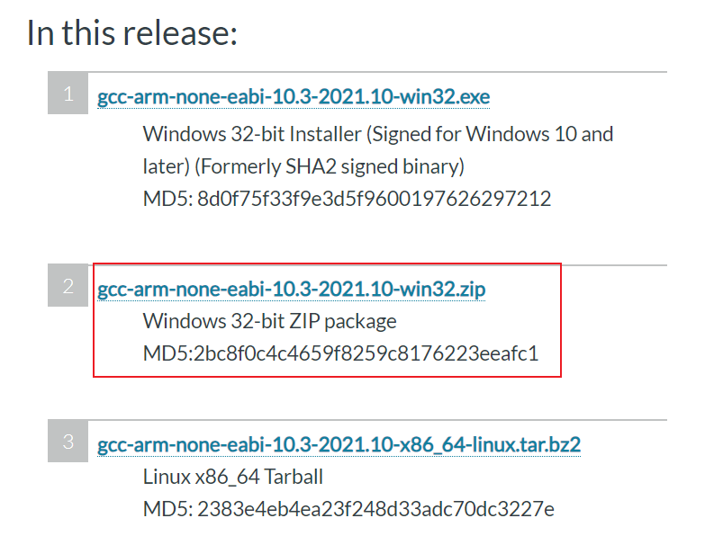

    将下载好的压缩包文件解压在gcc-arm-none-eabi”文件夹中，并记住文件内“bin”文件的路径，后续需添加到系统环境变量Path中。

   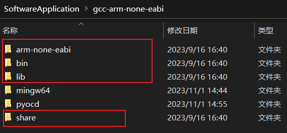

   

   添加完环境变量后，进行测试，检测是否安装好。

   

2. #### 安装**Mingw-w64 GCC**

   点击链接进入到SourceForge官网，往下翻可以找到很多版本的下载链接，选择红色框内型号即可，不同前后缀的具体差异请参考:

   [MinGW gcc下载链接及sjlj、dwarf、seh异同以及gcc安装_AMDDMA的博客-CSDN博客_seh和sjlj](https://blog.csdn.net/AMDDMA/article/details/111600238)

   下载链接：

   [MinGW-w64 - for 32 and 64 bit Windows - Browse Files at SourceForge.net](https://sourceforge.net/projects/mingw-w64/files/)

   

    同样，将下载好的文件解压到“gcc-arm-none-eabi”文件夹下，记住目录下的“bin”文件路径

   

   进入“bin”文件内找到“mingw32-make”应用程序文件，复制一份并重命名为“make”。这么做有利于在命令行执行make指令，而不是输入mingw32-make。

   

​		添加完环境变量后，进行测试，检测是否安装好。

​		      

​			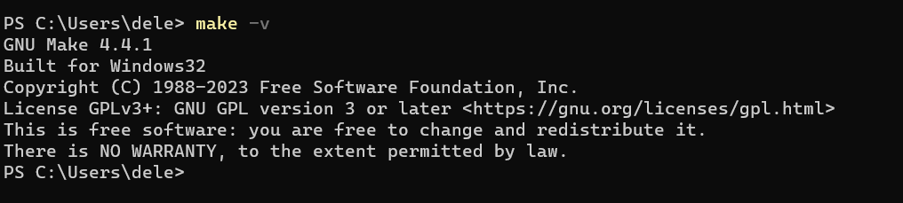

#### 3. 安装PyOCD 

 pyocd学习教程 https://www.cnblogs.com/halin/p/15169658.html

```basic
pip install -i https://pypi.tuna.tsinghua.edu.cn/simpl pyocd
```

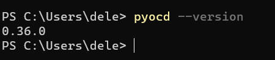

综上所述，基本的软件环境已经配置好。

### **三、GD32F407-GCC-Template工程配置**

1. 工程结构

   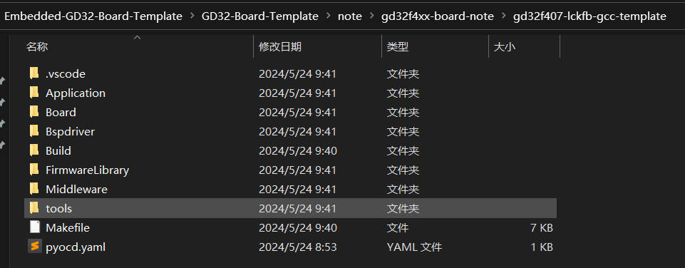

   ```bash
   - Application
   - Board
   - Bspdriver
   - FirmwareLibrary
      FirmwareLibrary/CMSIS/
      FirmwareLibrary/GD32F4xx_standard_peripheral
      FirmwareLibrary/Ld
   - Build
     //编译过程输出文件
   - tools
     GigaDevice.GD32F4xx_DFP.3.2.0.pack
   - Makefile
      Makefile脚本文件，重点，构建全流程脚本
   ```
   
2. Makefile文件编写(重点)

   ```makefile
   ######################################
   # target
   ######################################
   TARGET = gd32f407vet6-lckfb-gcc-template
   
   
   ######################################
   # building variables
   ######################################
   # debug build?
   DEBUG = 1
   # optimization for size
   OPT = -Os
   
   
   #######################################
   # paths
   #######################################
   # Build path
   BUILD_DIR = Build
   
   ######################################
   # source
   ######################################
   # C sources
   C_SOURCES =  \
   FirmwareLibrary/GD32F4xx_standard_peripheral/Source/gd32f4xx_adc.c \
   FirmwareLibrary/GD32F4xx_standard_peripheral/Source/gd32f4xx_can.c \
   FirmwareLibrary/GD32F4xx_standard_peripheral/Source/gd32f4xx_crc.c \
   FirmwareLibrary/GD32F4xx_standard_peripheral/Source/gd32f4xx_ctc.c \
   FirmwareLibrary/GD32F4xx_standard_peripheral/Source/gd32f4xx_dac.c \
   FirmwareLibrary/GD32F4xx_standard_peripheral/Source/gd32f4xx_dbg.c \
   FirmwareLibrary/GD32F4xx_standard_peripheral/Source/gd32f4xx_dci.c \
   FirmwareLibrary/GD32F4xx_standard_peripheral/Source/gd32f4xx_dma.c \
   FirmwareLibrary/GD32F4xx_standard_peripheral/Source/gd32f4xx_enet.c \
   FirmwareLibrary/GD32F4xx_standard_peripheral/Source/gd32f4xx_exmc.c \
   FirmwareLibrary/GD32F4xx_standard_peripheral/Source/gd32f4xx_exti.c \
   FirmwareLibrary/GD32F4xx_standard_peripheral/Source/gd32f4xx_fmc.c \
   FirmwareLibrary/GD32F4xx_standard_peripheral/Source/gd32f4xx_fwdgt.c \
   FirmwareLibrary/GD32F4xx_standard_peripheral/Source/gd32f4xx_gpio.c \
   FirmwareLibrary/GD32F4xx_standard_peripheral/Source/gd32f4xx_i2c.c \
   FirmwareLibrary/GD32F4xx_standard_peripheral/Source/gd32f4xx_ipa.c \
   FirmwareLibrary/GD32F4xx_standard_peripheral/Source/gd32f4xx_iref.c \
   FirmwareLibrary/GD32F4xx_standard_peripheral/Source/gd32f4xx_misc.c \
   FirmwareLibrary/GD32F4xx_standard_peripheral/Source/gd32f4xx_pmu.c \
   FirmwareLibrary/GD32F4xx_standard_peripheral/Source/gd32f4xx_rcu.c \
   FirmwareLibrary/GD32F4xx_standard_peripheral/Source/gd32f4xx_rtc.c \
   FirmwareLibrary/GD32F4xx_standard_peripheral/Source/gd32f4xx_sdio.c \
   FirmwareLibrary/GD32F4xx_standard_peripheral/Source/gd32f4xx_spi.c \
   FirmwareLibrary/GD32F4xx_standard_peripheral/Source/gd32f4xx_syscfg.c \
   FirmwareLibrary/GD32F4xx_standard_peripheral/Source/gd32f4xx_timer.c \
   FirmwareLibrary/GD32F4xx_standard_peripheral/Source/gd32f4xx_tli.c \
   FirmwareLibrary/GD32F4xx_standard_peripheral/Source/gd32f4xx_trng.c \
   FirmwareLibrary/GD32F4xx_standard_peripheral/Source/gd32f4xx_usart.c \
   FirmwareLibrary/GD32F4xx_standard_peripheral/Source/gd32f4xx_wwdgt.c \
   FirmwareLibrary/CMSIS/GD/GD32F4xx/Source/system_gd32f4xx.c \
   Application/main.c \
   Board/board.c \
   Bspdriver/bsp_uart.c \
   Bspdriver/bsp_led.c \
   Middleware/multi_button.c \
   Middleware/stimer.c \
   # ASM sources
   ASM_SOURCES = FirmwareLibrary/CMSIS/GD/GD32F4xx/Source/GCC/startup_gd32f407_427.S
   
   
   #######################################
   # binaries
   #######################################
   PREFIX = arm-none-eabi-
   GCC_PATH = /SoftwareApplication/gcc-arm-none-eabi/bin
   ifdef GCC_PATH
   CC = $(GCC_PATH)/$(PREFIX)gcc
   AS = $(GCC_PATH)/$(PREFIX)gcc -x assembler-with-cpp
   CP = $(GCC_PATH)/$(PREFIX)objcopy
   SZ = $(GCC_PATH)/$(PREFIX)size
   else
   CC = $(PREFIX)gcc
   AS = $(PREFIX)gcc -x assembler-with-cpp
   CP = $(PREFIX)objcopy
   SZ = $(PREFIX)size
   endif
   HEX = $(CP) -O ihex
   BIN = $(CP) -O binary -S
    
   #######################################
   # CFLAGS
   #######################################
   # cpu
   CPU = -mcpu=cortex-m4
   
   # fpu
   FPU = -mfpu=fpv4-sp-d16
   
   # float-abi
   FLOAT-ABI = -mfloat-abi=hard
   
   # mcu
   MCU = $(CPU) -mthumb $(FPU) $(FLOAT-ABI)
   
   # macros for gcc
   # AS defines
   AS_DEFS = 
   
   # C defines
   C_DEFS =  \
   -DUSE_STDPERIPH_DRIVER \
   -DGD32F407
   
   
   # AS includes
   AS_INCLUDES = 
   
   # C includes
   C_INCLUDES =  \
   -IFirmwareLibrary/GD32F4xx_standard_peripheral/Include \
   -IFirmwareLibrary/CMSIS/Include \
   -IFirmwareLibrary/CMSIS/GD/GD32F4xx/Include/ \
   -IFirmwareLibrary/CMSIS \
   -IMiddleware \
   -IBspdriver \
   -IApplication \
   -IBoard \
   # compile gcc flags
   ASFLAGS = $(MCU) $(AS_DEFS) $(AS_INCLUDES) $(OPT) -Wall -fdata-sections -ffunction-sections
   
   CFLAGS = $(MCU) $(C_DEFS) $(C_INCLUDES) $(OPT) -Wall -fdata-sections -ffunction-sections
   
   ifeq ($(DEBUG), 1)
   CFLAGS += -g -gdwarf-2
   endif
   
   
   # Generate dependency information
   CFLAGS += -MMD -MP -MF"$(@:%.o=%.d)"
   
   
   #######################################
   # LDFLAGS
   #######################################
   # link script
   LDSCRIPT = FirmwareLibrary/Ld/Link.ld
   
   # libraries
   LIBS = -lc -lm -lnosys 
   LIBDIR = 
   LDFLAGS = $(MCU) -u_printf_float -specs=nosys.specs -T$(LDSCRIPT) $(LIBDIR) $(LIBS) -Wl,-Map=$(BUILD_DIR)/$(TARGET).map,--cref -Wl,--gc-sections
   
   # default action: build all
   all: $(BUILD_DIR)/$(TARGET).elf $(BUILD_DIR)/$(TARGET).hex $(BUILD_DIR)/$(TARGET).bin
   
   
   #######################################
   # build the application
   #######################################
   # list of objects
   OBJECTS = $(addprefix $(BUILD_DIR)/,$(notdir $(C_SOURCES:.c=.o)))
   vpath %.c $(sort $(dir $(C_SOURCES)))
   # list of ASM program objects
   OBJECTS += $(addprefix $(BUILD_DIR)/,$(notdir $(ASM_SOURCES:.S=.o)))
   vpath %.S $(sort $(dir $(ASM_SOURCES)))
   
   $(BUILD_DIR)/%.o: %.c Makefile | $(BUILD_DIR) 
   	@echo "[CC]    $<"
   	@$(CC) -c $(CFLAGS) -Wa,-a,-ad,-alms=$(BUILD_DIR)/$(notdir $(<:.c=.lst)) $< -o $@
   
   $(BUILD_DIR)/%.o: %.S Makefile | $(BUILD_DIR)
   	@echo "[AS]    $<"
   	@$(AS) -c $(CFLAGS) $< -o $@
   
   $(BUILD_DIR)/$(TARGET).elf: $(OBJECTS) Makefile
   	@echo "[HEX]   $< -> $@"
   	@$(CC) $(OBJECTS) $(LDFLAGS) -o $@
   	@$(SZ) -A $@
   
   $(BUILD_DIR)/%.hex: $(BUILD_DIR)/%.elf | $(BUILD_DIR)
   	@echo "[HEX]   $< -> $@"
   	@$(HEX) $< $@
   	
   $(BUILD_DIR)/%.bin: $(BUILD_DIR)/%.elf | $(BUILD_DIR)
   	@echo "[BIN]   $< -> $@"
   	@$(BIN) $< $@	
   	
   $(BUILD_DIR):
   	@mkdir $@
   
   
   #######################################
   # program
   #######################################
   
   program:
   	pyocd erase -c -t gd32f407ve --config pyocd.yaml
   	pyocd load build/$(TARGET).hex -t gd32f407ve --config pyocd.yaml
   
   #######################################
   # clean up
   #######################################
   clean:
   	-del /q  $(BUILD_DIR)
   
   #######################################
   # dependencies
   #######################################
   -include $(wildcard $(BUILD_DIR)/*.d)
   
   # *** EOF ***
   
   ```
   
   ### Linux环境搭建
   
   1. 安装GNU Arm Embedded Toolchain交叉编译器
   
      进入arm开发者官网，往下滑动选择下载解压可用的ZIP压缩包文件 ，选择linux版本
   
      也可以直接在linux系统中下载，这里使用的Ubuntu 22.04 
   
      ```bash
      sudo apt-get install gcc-arm-none-eabi
      ```
   
      下载完成查看
   
      ```bash
      arm-none-eabi-gcc -v
      ```
   
      
   
   2. 修改Makefile
   
      注释GCC_PATH
   
      
   
      修改 clean命令
   
      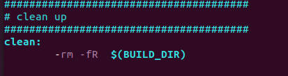
   

   ### **四、工程测试**

   1. make 构建工程

      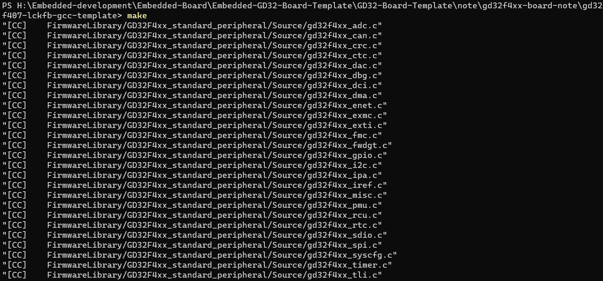

      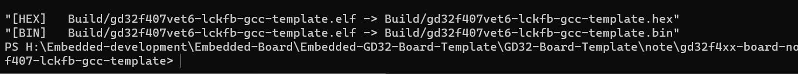

   2. make program  pyocd

      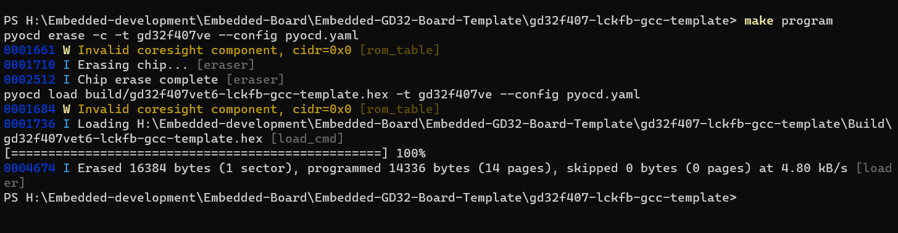

        接上串口线，打开串口软件，查看终端输出情况（如果是从MDK-Keil工程移植过来，printf应该是不支持的，因此终端没有输出，需要修改相关代码，后面写修改文件）（图片中的情况是修改之后的效果）

      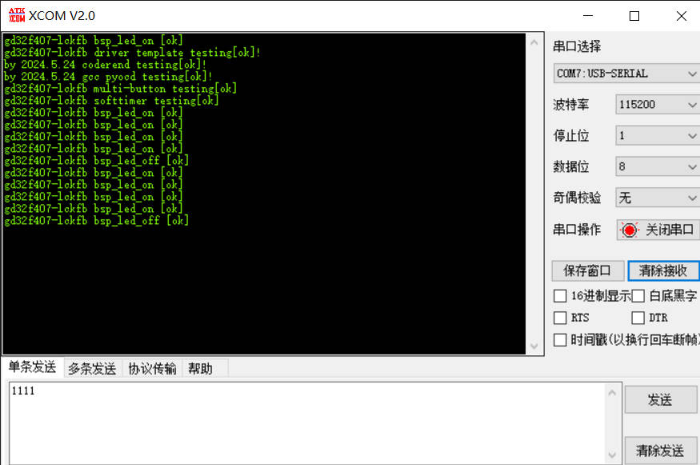

   4. 注意修改的部分

      uart printf重定向问题
   
      ```c
      //重定向c库函数printf到串口，重定向后可使用printf函数
      // int fputc(int ch, FILE *f)
      // {
      //     /* 发送一个字节数据到串口 */
      //     usart_data_transmit(COM_UART[0], (uint8_t) ch);
      
      //     /* 等待发送完毕 */
      //     while (usart_flag_get(COM_UART[0], USART_FLAG_TBE) == RESET);
      
      //     return (ch);
      // }
      
      int _write (int fd, char *pBuffer, int size)  
      {  
          for (int i = 0; i < size; i++)  
          {  
              usart_data_transmit(COM_UART[0], (uint8_t)pBuffer[i]);
              while(RESET == usart_flag_get(COM_UART[0], USART_FLAG_TBE));     
          }  
          return size;  
      }
      
      ```
   
      4. Linux平台测试
      
         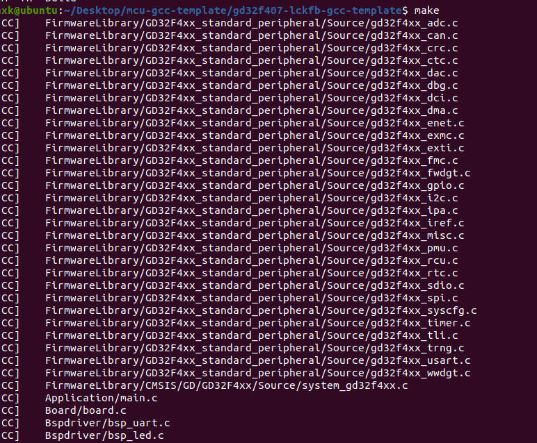
      
         
