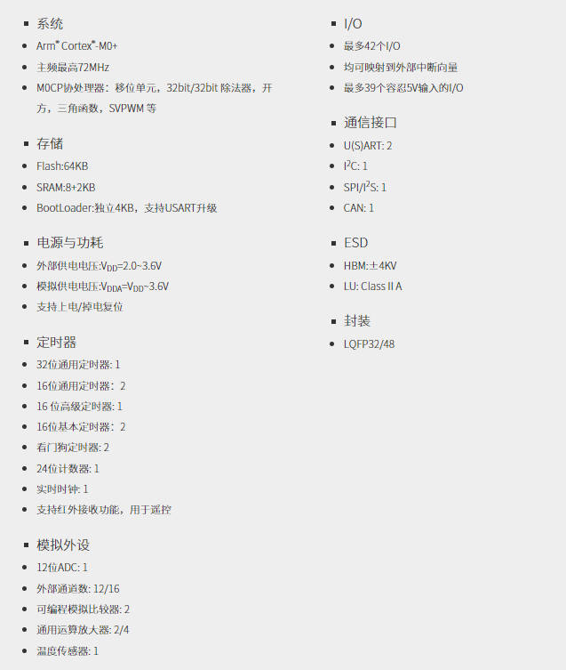
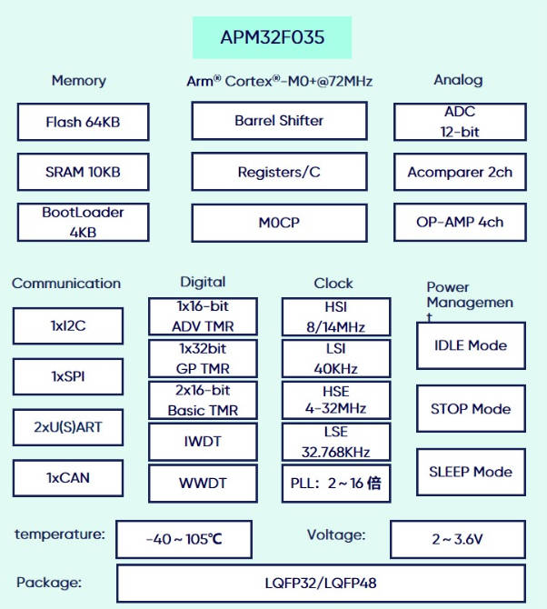
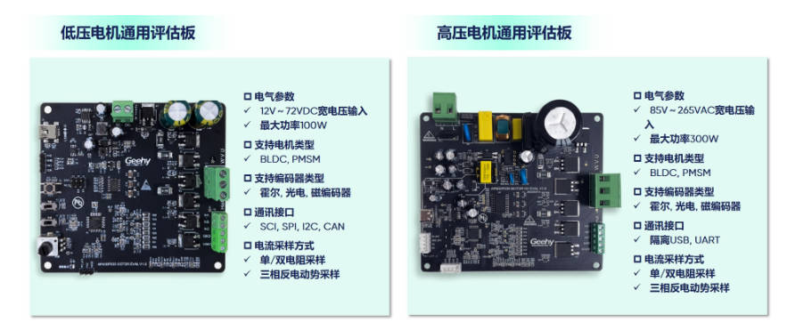
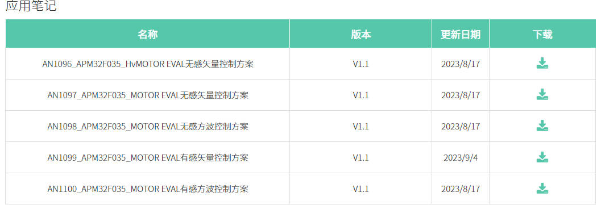

## 极海APM32F035电机控制开发板评测 00 APM32F035开发平台与资料合集

### 高效运算与处理速度	

高性能、高性价比电机专用APM32F035系列 MCU，系列型号基于Arm® Cortex®-M0+内核，主频可达72MHz，内置 Vector Computer(MDU+CORDIC)多种专用数学运算加速器，集成高速 ADC、运放、比较器、及 CAN 控制器等外设资源，搭配电机控制通用开发平台，有效提升电机控制性能，降低产品运行成本。

### 多种算法硬件配置

基于Arm® Cortex®-M0+内核，主频72MHz，支持MDU+Cordic与CRC，满足电机应用的处理性能；Flash 64KB，SRAM 10KB，满足电机嵌入式应用的各种算法需求；支持单周期32位硬件乘法器，内置M0CP协处理器以增强Cortex-M0+运行性能，其硬件配置包括移位单元、32bit /32bit除法器、乘加运算、开方、三角函数、SVPWM；集成电机专用PWM，支持互补、刹车，并可与M0CP联动。

### 集成资源丰富

### 支持多种模拟与连接功能

内置高精度模拟外设与数字外设，满足不同功能需求与高速连接应用需求。除常规外设如12位ADC（1Msps）、SPI、U(S)ART（支持全双工通信）、I2C、CAN外，新增2个可编程模拟比较器COMP、4个通用运算放大器OP-Amp覆盖各种电机电流采样应用，以及1个温度传感器。其中4个通用运算放大器可通过外接电阻调整运放增益，也可通过设置选择内部预设的增益档位，转换速率高达10v/us。

极海电机通用评估板

极海电机控制通用开发平台从应用层、中间层、器件层、硬件层、资深电机团队上提供全面的生态支持，包括客户支持、高低压通用电机平台、细分领域专用硬件、底层寄存器SDK、电机专用运算、多种算法选择、多种控制方式接入、以及全面的保护机制。

#### 电机控制专用APM32F035

1. 电机控制专用APM32F035资料 https://www.geehy.com/product/fifth/APM32F035

2. 电机控制案例应用笔记 

   