## 极海APM32F035电机控制开发板评测 开发板开箱 环境搭建 

去年，玩了不少的国产MCU开发板，例如武汉芯源CW32，兆易创新GD32、上海航芯ACM32、沁恒CH32V307，雅特力AT32等开发板。各大电子论坛也有不少的评测活动，但是关于极海APM32F035电机评估板一直在申请也没有申请到，过年前芯查查再一次的发出了活动，立马申请了，但是第一阶段其实也没有申请到，但是后面又增加评测人员了，我终于拿到了。十分感谢官方的支持。学习仓库链接 

https://gitee.com/End-ING/embedded-apm32f035-board

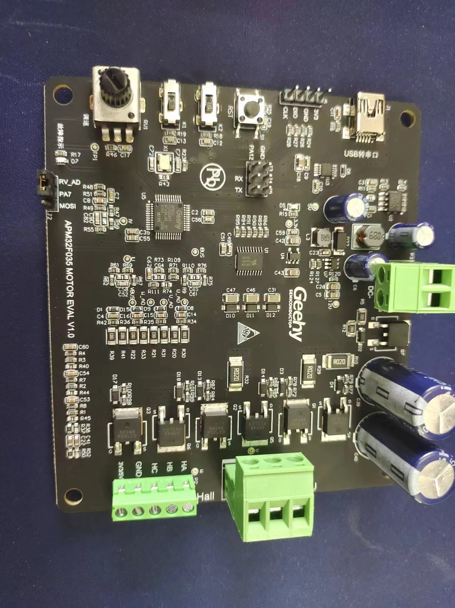

### 极海APM32F035

  极海的高性能、高性价比电机专用APM32F035系列 MCU，系列型号基于Arm® Cortex®-M0+内核，主频可达72MHz，内置 Vector Computer(MDU+CORDIC)多种专用数学运算加速器，集成高速 ADC、运放、比较器、及 CAN 控制器等外设资源，搭配电机控制通用开发平台，有效提升电机控制性能，降低产品运行成本。

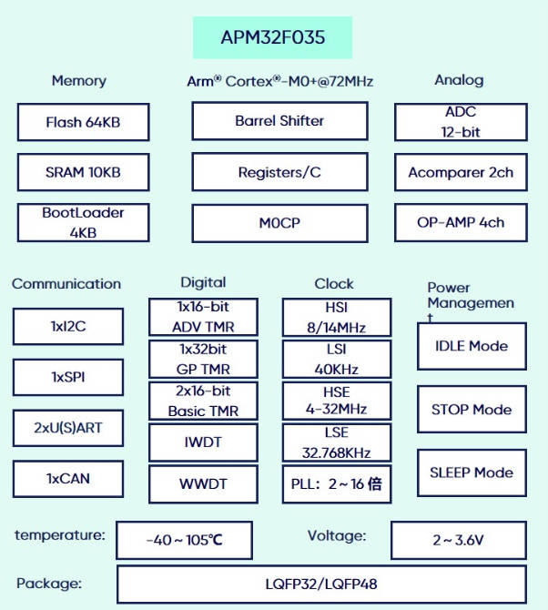

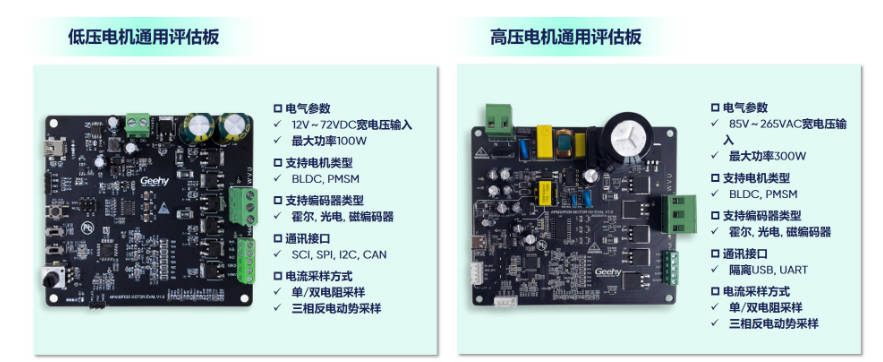

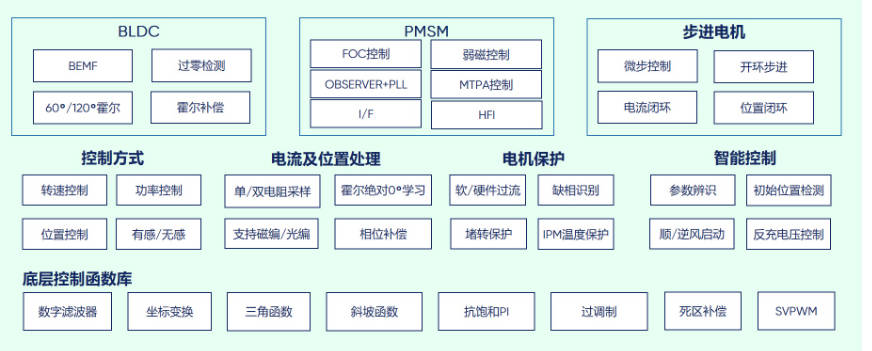

   极海电机控制通用开发平台从应用层、中间层、器件层、硬件层、资深电机团队上提供全面的生态支持，包括客户支持、高低压通用电机平台、细分领域专用硬件、底层寄存器SDK、电机专用运算、多种算法选择、多种控制方式接入、以及全面的保护机制。


### 环境搭建

1. MDK-KEIL的安装（具体安装参考网络教程）https://blog.csdn.net/weixin_44543463/article/details/120535830

下载安装之后，安装Geehy.APM32F035_DFP.1.0.0.pack文件即可。


2. 下载APM32F035电机控制板的官方资料 https://www.geehy.com/product/fifth/APM32F035

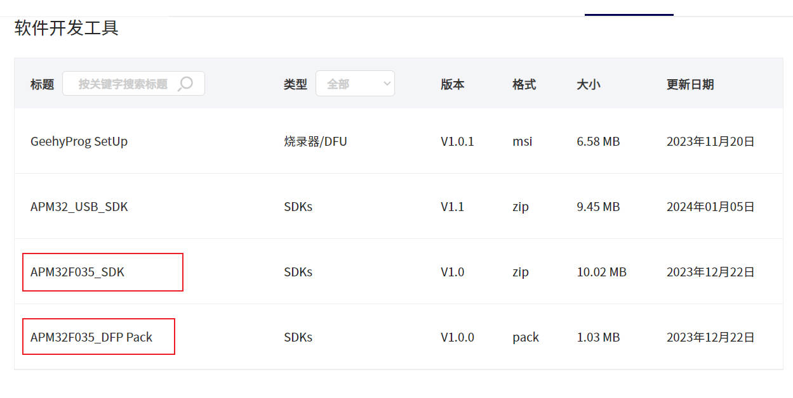

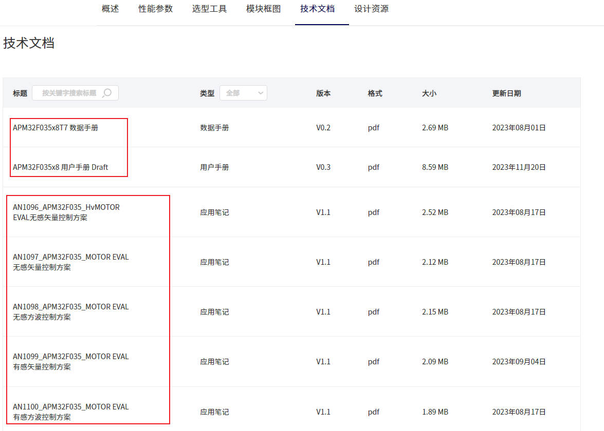

3. 下载相关资料，寻找关键资料（数据手册，用户手册，原理图文件，APM32F035_SDK）

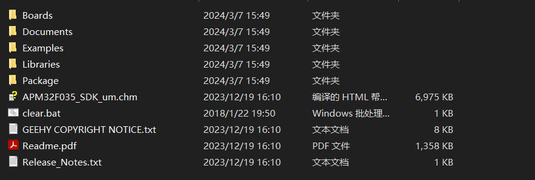

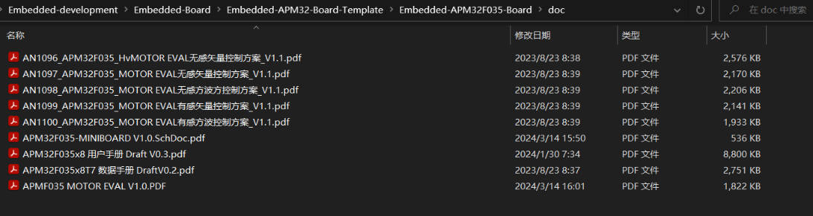

4. 建立工程模板

#### 4.1 APM32F035_SDK

Examples Libraries是最重要的开发文件，其中Libraries里面有官方的库函数文件，Examples提供了大量的，丰富的参考例程，但是值得注意的是，提供案例代码不是以APM32F035-Motor电机开发板为核心开发板，是APM32F035-Mini开发板为核心，所以不能直接用。

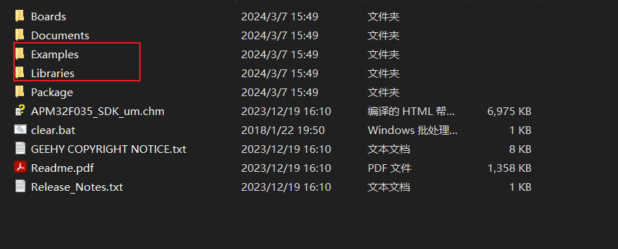

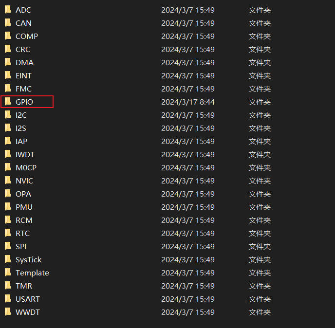

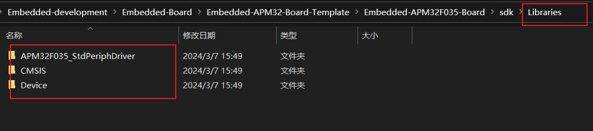

#### 4.2 以GPIO模板工程建立新模板

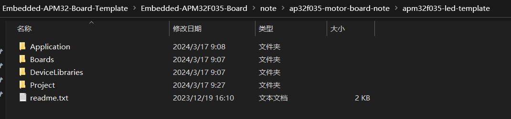

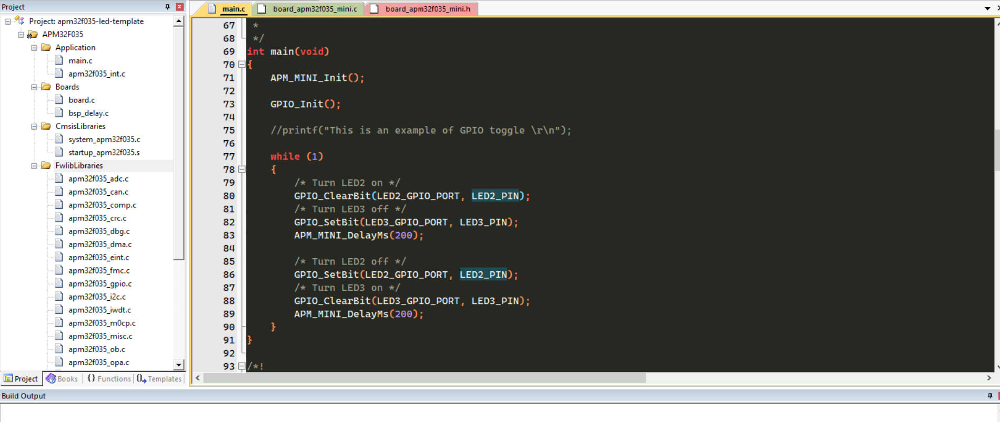

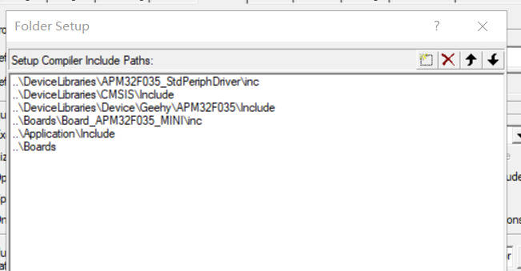

#### 4.3 编译代码

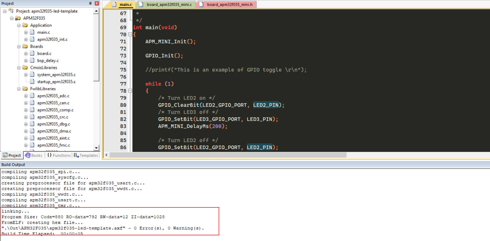

#### 4.4 修改代码点亮LED灯

如果直接SDK提供的GPIO工程模板，下载程序是没有现象的，因为不是一个板子，因此需要在APM32F035-Motor开发板找出对应的LED灯，第一次寻找的时候，我没有发现合适的，发现这个板子基本上没有引出过多的引脚，绝大多数的io端口应该都和电机相关的接到了一起。但是仔细查看原理图，发现故障指示灯D7是可以去控制的。修改工程中的代码。

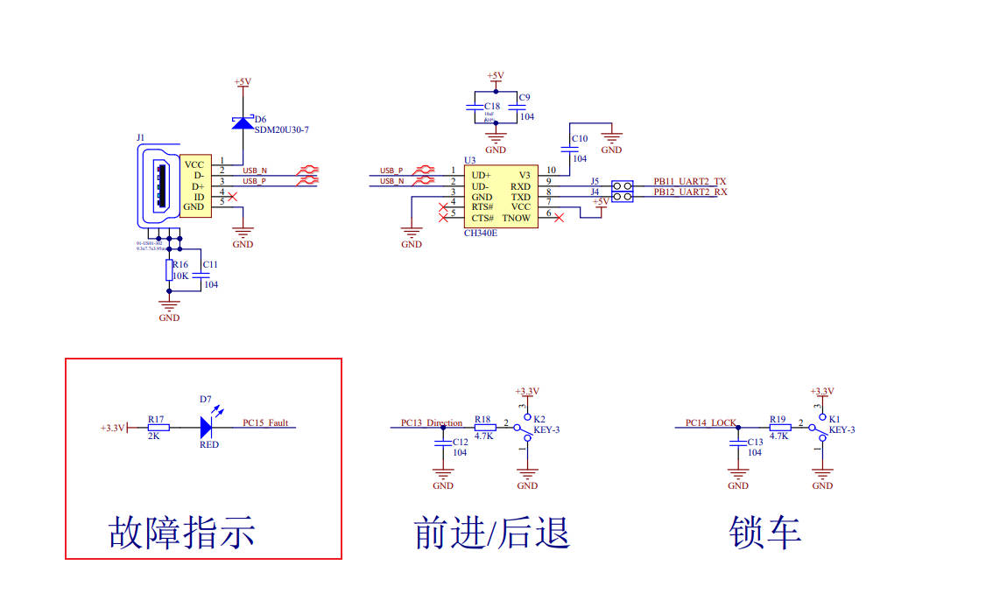


```c
/* Includes */
#include "main.h"
#include "bsp_delay.h"
#include "apm32f035_rcm.h"
#include "apm32f035_gpio.h"
#include "apm32f035_misc.h"
#include <stdio.h>
#include <string.h>


/** @addtogroup Examples
  * @brief GPIO toggle examples
  @{
  */

/** @addtogroup GPIO_Toggle
  @{
  */

/** @defgroup GPIO_Toggle_Macros Macros
  @{
*/

/* printf using USART1  */
#define DEBUG_USART             USART1

/**@} end of group GPIO_Toggle_Macros*/

/** @defgroup GPIO_Toggle_Functions Functions
  @{
  */

void APM_MINI_Init(void);
void GPIO_Init(void);

/*!
 * @brief       Main program
 *
 * @param       None
 *
 * @retval      None
 *
 */
int main(void)
{
    APM_MINI_Init();

    GPIO_Init();

    //printf("This is an example of GPIO toggle \r\n");

    while (1)
    {
        /* Turn LED2 on */
        GPIO_ClearBit(LED2_GPIO_PORT, LED2_PIN);
        /* Turn LED3 off */
        //GPIO_SetBit(LED3_GPIO_PORT, LED3_PIN);
        APM_MINI_DelayMs(200);

        /* Turn LED2 off */
        GPIO_SetBit(LED2_GPIO_PORT, LED2_PIN);
        /* Turn LED3 on */
        //GPIO_ClearBit(LED3_GPIO_PORT, LED3_PIN);
        APM_MINI_DelayMs(200);
    }
}

/*!
 * @brief       Init MINI board
 *
 * @param       None
 *
 * @retval      None
 *
 * @note
 */
void APM_MINI_Init(void)
{
    /* Init delay function */
    APM_MINI_DelayInit();

//    APM_MINI_PBInit(BUTTON_KEY1, BUTTON_MODE_GPIO);
//    APM_MINI_COMInit(COM2);
}

/*!
 * @brief       GPIO initialization
 *
 * @param       None
 *
 * @retval      None
 *
 */
void GPIO_Init(void)
{
    GPIO_Config_T gpioConfig;

    RCM_EnableAHBPeriphClock(LED2_GPIO_CLK | LED3_GPIO_CLK);
    /* LED2 GPIO configuration */
    gpioConfig.pin = LED2_PIN;
    gpioConfig.mode = GPIO_MODE_OUT;
    gpioConfig.outtype = GPIO_OUT_TYPE_PP;
    gpioConfig.speed = GPIO_SPEED_50MHz;
    gpioConfig.pupd = GPIO_PUPD_NO;
    GPIO_Config(LED2_GPIO_PORT, &gpioConfig);

    /* LED3 GPIO configuration */
    //gpioConfig.pin = LED3_PIN;
    //GPIO_Config(LED3_GPIO_PORT, &gpioConfig);
}
```

4.5 下载代码

我使用的下载工具是DAP-LINK，感觉用起来还是挺方便的。

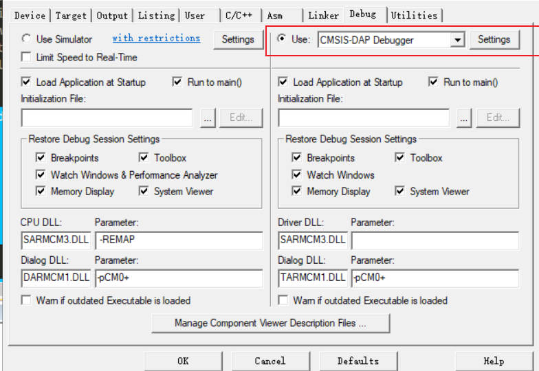

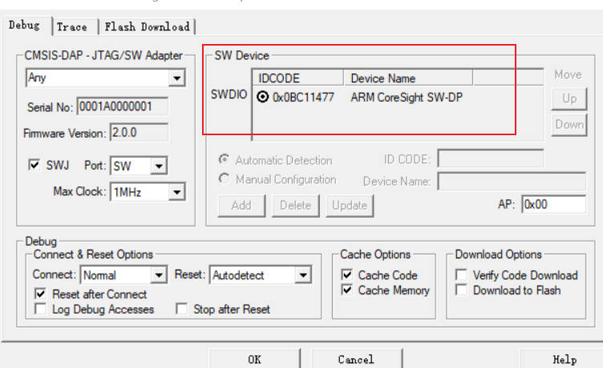

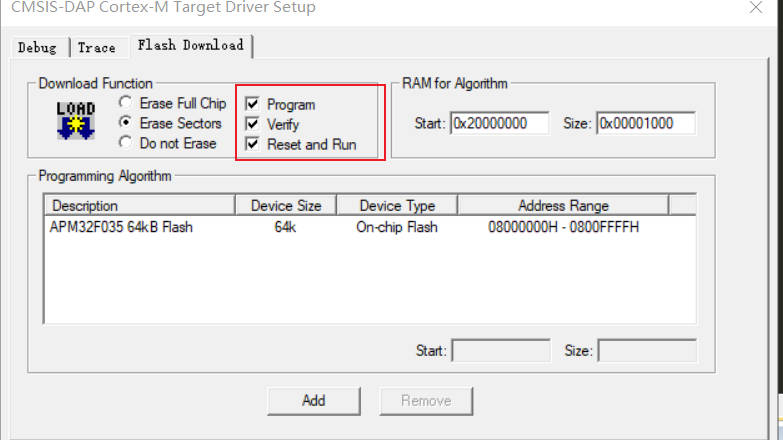

硬件图

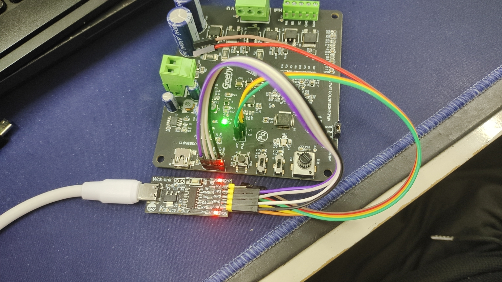

下载程序，观察现象

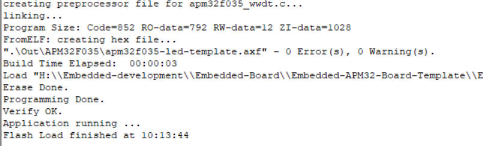

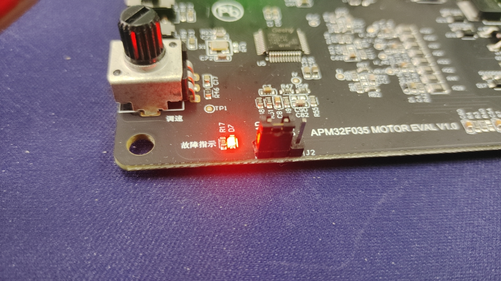

