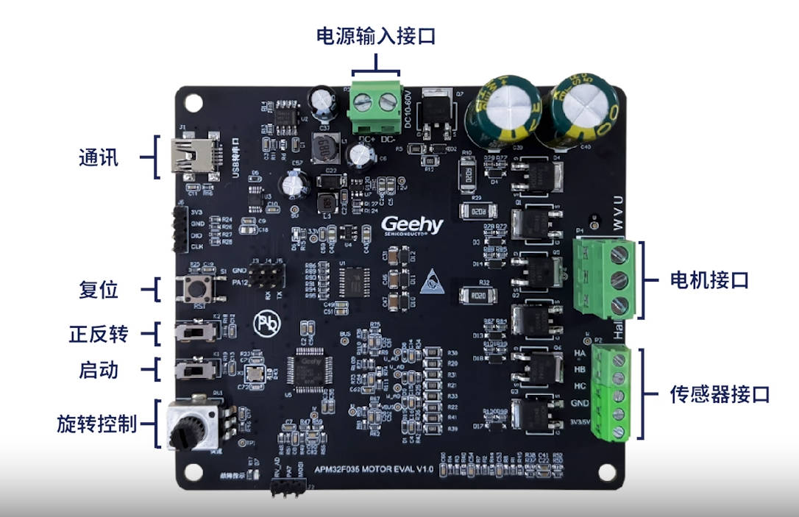
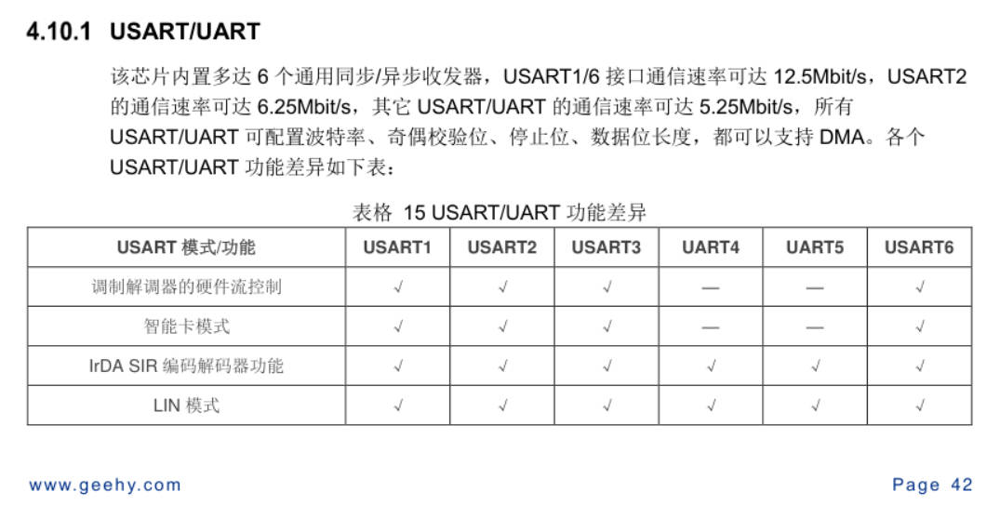
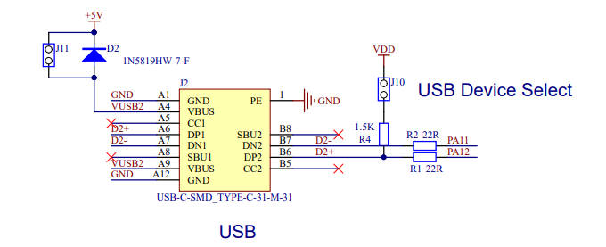
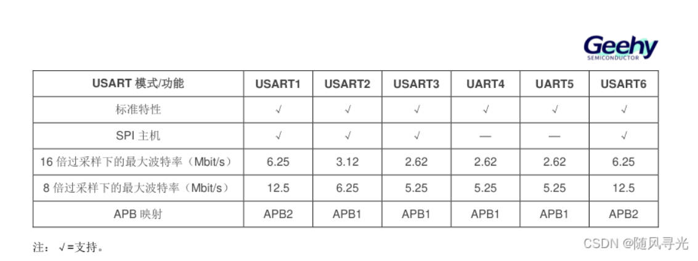
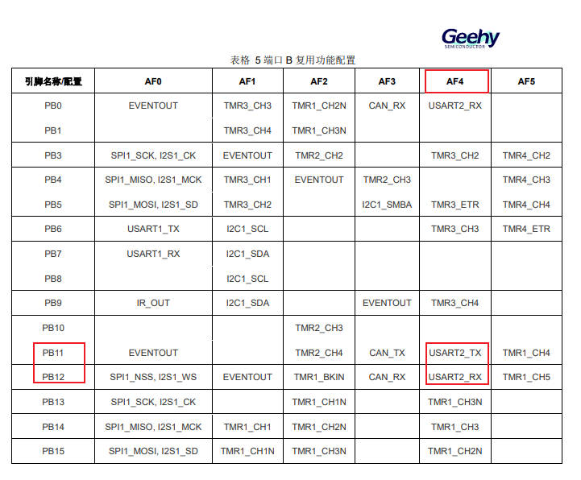
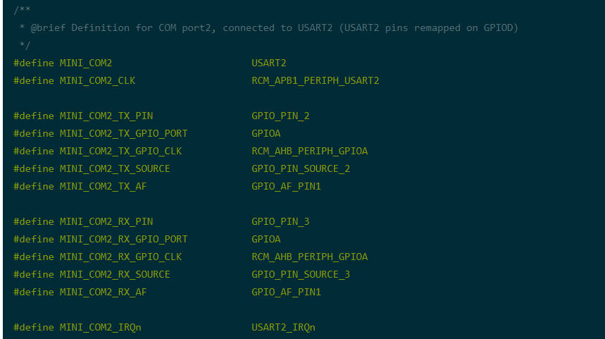
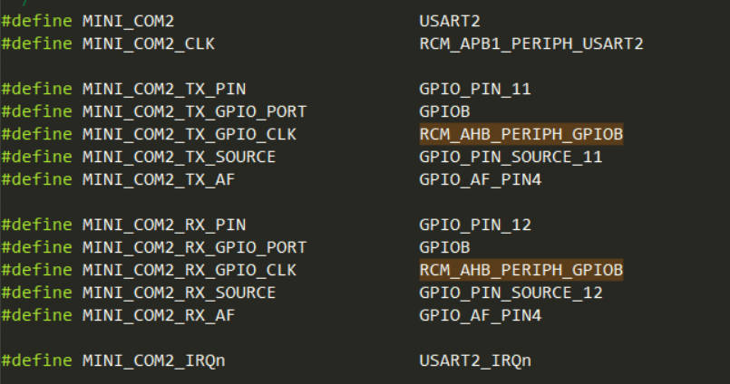
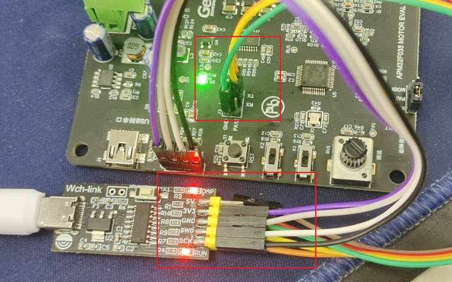
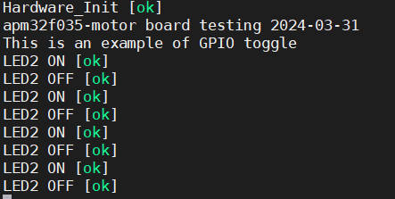

## 极海APM32F035电机控制开发板评测 02 串口打印测试

###  1. 软硬件平台

1. 极海APM32F035电机控制开发板

2. MDK-ARM Keil

   

###  2. 串口终端调试

串口打印在多个领域和场景中发挥着重要作用，尤其在嵌入式系统、硬件调试、软件开发以及通信协议测试等方面。以下是串口打印的主要作用：

1. **调试与排错**：在嵌入式系统或硬件设备的开发过程中，串口打印是一种常用的调试手段。通过串口打印，开发者可以实时查看设备的运行状态、变量值、错误信息等，从而快速定位问题所在，进行排错和修复。
2. **信息展示**：对于一些需要与用户交互的设备，串口打印可以用于显示设备的工作状态、提示信息、参数设置等。这有助于用户了解设备的运行情况，进行正确的操作。
3. **通信协议测试**：在通信协议的开发和测试过程中，串口打印可以用于监视通信数据的发送和接收情况。通过对比发送和接收的数据，开发者可以验证通信协议的正确性和可靠性。
4. **日志记录**：在某些应用中，串口打印还可以用于记录设备的运行日志。这些日志对于后续的故障分析、性能优化等方面具有很高的价值。
5. **配置与更新**：一些设备可能支持通过串口接收配置信息或进行软件更新。在这种情况下，串口打印可以用于显示配置过程中的信息或更新进度。

需要注意的是，虽然串口打印在开发过程中具有重要的作用，但在实际应用中也需要考虑到其可能带来的性能开销和安全隐患。因此，在设计和实现串口打印功能时，需要权衡其利弊，确保其在满足需求的同时不会对系统造成过大的负担。

### 3. APM32F035开发板 USART串口

1. APM32F035芯片提供了两个串口

   

2. 开发板硬件串口电路

   

3. APM32F035芯片 USART串口挂载AHB总线下面

   

4. 使用PB11,PB12作为串口功能时，需要对GPIO端口功能进行复用

   下图可以看到PB11,PB12可以作为串口2的TX,RX,同时也是CAN总线的TX,RX

   

   ### 4. 快速移植串口打印测试代码

   1. 在之前的led工程模板上进行复制，并修改名称为apm32f035-usart-printf-templatem

   2. 打开工程，并定位到board_apm32f035_mini.c board_apm32f035_mini.h文件，修改里面的东西

      1. (1) 修改串口2的宏定义

         (2) 修改GPIO端口复用功能

         (3) 修改时钟

         由于官方提供的SDK中的代码，并不是直接适配到apm32f035电机开发板的，因此需要修改，下面是原始的串口2，使用是PA2,PA3作为串口功能使用，但是在电机开发板中是使用PB11,PB12端口，因此需要进行修改。

          

      

   3. 初始化串口函数，进行GPIO，USART串口配置

      工程模板里面是使用了COM作为参数进行初始化的，这里面好处是可以调用函数，进行同时配置。这样子的编写代码方法可以参考。

      相关的变量或者宏定义如下

      ```c
      USART_T* COM_USART[COMn] = {MINI_COM1, MINI_COM2};
      GPIO_T* COM_TX_PORT[COMn] = {MINI_COM1_TX_GPIO_PORT, MINI_COM2_TX_GPIO_PORT};
      GPIO_T* COM_RX_PORT[COMn] = {MINI_COM1_RX_GPIO_PORT, MINI_COM2_RX_GPIO_PORT};
      const uint32_t COM_USART_CLK[COMn] = {MINI_COM1_CLK, MINI_COM2_CLK};
      
      const RCM_AHB_PERIPH_T COM_TX_PORT_CLK[COMn] = {MINI_COM1_TX_GPIO_CLK, MINI_COM2_TX_GPIO_CLK};
      
      const RCM_AHB_PERIPH_T COM_RX_PORT_CLK[COMn] = {MINI_COM1_RX_GPIO_CLK, MINI_COM2_RX_GPIO_CLK};
      
      const GPIO_PIN_T COM_TX_PIN[COMn] = {MINI_COM1_TX_PIN, MINI_COM2_TX_PIN};
      
      const GPIO_PIN_T COM_RX_PIN[COMn] = {MINI_COM1_RX_PIN, MINI_COM2_RX_PIN};
      
      const GPIO_PIN_SOURCE_T COM_TX_PIN_SOURCE[COMn] = {MINI_COM1_TX_SOURCE, MINI_COM2_TX_SOURCE};
      
      const GPIO_PIN_SOURCE_T COM_RX_PIN_SOURCE[COMn] = {MINI_COM1_RX_SOURCE, MINI_COM2_RX_SOURCE};
      
      const GPIO_AF_T COM_TX_AF[COMn] = {MINI_COM1_TX_AF, MINI_COM2_TX_AF};
      
      const GPIO_AF_T COM_RX_AF[COMn] = {MINI_COM1_RX_AF, MINI_COM2_RX_AF};
      
      
      #define COMn                             2
      
      /**
       * @brief Definition for COM port1, connected to USART1
       */
      #define MINI_COM1                        USART1
      #define MINI_COM1_CLK                    RCM_APB2_PERIPH_USART1
      
      #define MINI_COM1_TX_PIN                 GPIO_PIN_9
      #define MINI_COM1_TX_GPIO_PORT           GPIOA
      #define MINI_COM1_TX_GPIO_CLK            RCM_AHB_PERIPH_GPIOA
      #define MINI_COM1_TX_SOURCE              GPIO_PIN_SOURCE_9
      #define MINI_COM1_TX_AF                  GPIO_AF_PIN1
      
      #define MINI_COM1_RX_PIN                 GPIO_PIN_10
      #define MINI_COM1_RX_GPIO_PORT           GPIOA
      #define MINI_COM1_RX_GPIO_CLK            RCM_AHB_PERIPH_GPIOA
      #define MINI_COM1_RX_SOURCE              GPIO_PIN_SOURCE_10
      #define MINI_COM1_RX_AF                  GPIO_AF_PIN1
      
      #define MINI_COM1_IRQn                   USART1_IRQn
      /**
       * @brief Definition for COM port2, connected to USART2 (USART2 pins remapped on GPIOD)
       */
      #define MINI_COM2                        USART2
      #define MINI_COM2_CLK                    RCM_APB1_PERIPH_USART2
      
      #define MINI_COM2_TX_PIN                 GPIO_PIN_11
      #define MINI_COM2_TX_GPIO_PORT           GPIOB
      #define MINI_COM2_TX_GPIO_CLK            RCM_AHB_PERIPH_GPIOB
      #define MINI_COM2_TX_SOURCE              GPIO_PIN_SOURCE_11
      #define MINI_COM2_TX_AF                  GPIO_AF_PIN4
      
      #define MINI_COM2_RX_PIN                 GPIO_PIN_12
      #define MINI_COM2_RX_GPIO_PORT           GPIOB
      #define MINI_COM2_RX_GPIO_CLK            RCM_AHB_PERIPH_GPIOB
      #define MINI_COM2_RX_SOURCE              GPIO_PIN_SOURCE_12
      #define MINI_COM2_RX_AF                  GPIO_AF_PIN4
      
      #define MINI_COM2_IRQn                   USART2_IRQn
      typedef enum
      {
          COM1 = 0,
          COM2 = 1
      } COM_T;
      
      ```

      ```c
      void APM_MINI_COMInit(COM_T COM)
      {
          GPIO_Config_T gpioConfig;
          USART_Config_T usartConfigStruct;
          /* Enable GPIO clock */
          RCM_EnableAHBPeriphClock(COM_TX_PORT_CLK[COM] | COM_RX_PORT_CLK[COM]);
      
          /* Enable COM1 or COM2 clock */
          if (COM == COM1)
          {
              RCM_EnableAPB2PeriphClock(COM_USART_CLK[COM]);
          }
          else
          {
              RCM_EnableAPB1PeriphClock(COM_USART_CLK[COM]);
          }
      
          /* Connect PXx to USARTx_Tx */
          GPIO_ConfigPinAF(COM_TX_PORT[COM], COM_TX_PIN_SOURCE[COM], COM_TX_AF[COM]);
      
          /* Connect PXx to USARTx_Rx */
          GPIO_ConfigPinAF(COM_RX_PORT[COM], COM_RX_PIN_SOURCE[COM], COM_RX_AF[COM]);
      
          /* Configure USART Tx as alternate function push-pull */
          gpioConfig.mode = GPIO_MODE_AF;
          gpioConfig.pin = COM_TX_PIN[COM];
          gpioConfig.speed = GPIO_SPEED_50MHz;
          gpioConfig.outtype = GPIO_OUT_TYPE_PP;
          gpioConfig.pupd = GPIO_PUPD_PU;
          GPIO_Config(COM_TX_PORT[COM], &gpioConfig);
      
          /* Configure USART Rx as input floating */
          gpioConfig.pin = COM_RX_PIN[COM];
          GPIO_Config(COM_RX_PORT[COM], &gpioConfig);
      
          /* MINI_USARTs configured as follow:
          - BaudRate = 115200 baud
          - Word Length = 8 Bits
          - One Stop Bit
          - No parity
          - Hardware flow control disabled (RTS and CTS signals)
          - Receive and transmit enabled
          */
      
          usartConfigStruct.baudRate = 115200;
          usartConfigStruct.mode     = USART_MODE_TX_RX;
          usartConfigStruct.hardwareFlowCtrl = USART_FLOW_CTRL_NONE;
          usartConfigStruct.parity   = USART_PARITY_NONE;
          usartConfigStruct.stopBits =  USART_STOP_BIT_1;
          usartConfigStruct.wordLength = USART_WORD_LEN_8B;
          USART_Config(COM_USART[COM], &usartConfigStruct);
      
          /* Enable USART_Interrupt_RXBNEIE */
          USART_EnableInterrupt(COM_USART[COM], USART_INT_RXBNEIE);
      
          if (COM_USART[COM] == USART1)
          {
              NVIC_EnableIRQRequest(USART1_IRQn, 2);
          }
          else if (COM_USART[COM] == USART2)
          {
              NVIC_EnableIRQRequest(USART2_IRQn, 3);
          }
      
          /* Enable USART */
          USART_Enable(COM_USART[COM]);
      }
      ```

      

   4. 调用APM_MINI_COMInit函数，同时需要配置串口打印的函数（完成printf重定向，官方代码已经提供）

      在下面的代码，对不同类型的编译器都进行了处理，在KEIL中进行printf重定向是通过fputc完成的，但是在gcc环境中是通过write完成的。

      下面的DEBUG_USART使用是MINI_COM2与开发板的接口一一对应。

      ```c
      #if defined (__CC_ARM) || defined (__ICCARM__) || (defined(__ARMCC_VERSION) && (__ARMCC_VERSION >= 6010050))
      
      /*!
      * @brief       Redirect C Library function printf to serial port.
      *              After Redirection, you can use printf function.
      *
      * @param       ch:  The characters that need to be send.
      *
      * @param       *f:  pointer to a FILE that can recording all information
      *              needed to control a stream
      *
      * @retval      The characters that need to be send.
      *
      * @note
      */
      int fputc(int ch, FILE* f)
      {
          /* send a byte of data to the serial port */
          USART_TxData(DEBUG_USART, (uint8_t)ch);
      
          /* wait for the data to be send  */
          while (USART_ReadStatusFlag(DEBUG_USART, USART_FLAG_TXBE) == RESET);
      
          return (ch);
      }
      
      #elif defined (__GNUC__)
      
      /*!
      * @brief       Redirect C Library function printf to serial port.
      *              After Redirection, you can use printf function.
      *
      * @param       ch:  The characters that need to be send.
      *
      * @retval      The characters that need to be send.
      *
      * @note
      */
      int __io_putchar(int ch)
      {
          /* send a byte of data to the serial port */
          USART_TxData(DEBUG_USART, ch);
      
          /* wait for the data to be send  */
          while (USART_ReadStatusFlag(DEBUG_USART, USART_FLAG_TXBE) == RESET);
      
          return ch;
      }
      
      /*!
      * @brief       Redirect C Library function printf to serial port.
      *              After Redirection, you can use printf function.
      *
      * @param       file:  Meaningless in this function.
      *
      * @param       *ptr:  Buffer pointer for data to be sent.
      *
      * @param       len:  Length of data to be sent.
      *
      * @retval      The characters that need to be send.
      *
      * @note
      */
      int _write(int file, char* ptr, int len)
      {
          int i;
          for (i = 0; i < len; i++)
          {
              __io_putchar(*ptr++);
          }
      
          return len;
      }
      
      #else
      #warning Not supported compiler type
      #endif
      
      ```

### 5.测试代码

1. 主函数
```c
         #include "main.h"
         #include "bsp_delay.h"
         #include "apm32f035_rcm.h"
         #include "apm32f035_gpio.h"
         #include "apm32f035_misc.h"
         #include <stdio.h>
         #include <string.h>
         
         /* printf using USART1  */
         #define DEBUG_USART             MINI_COM2
         void APM_MINI_Init(void);
         void GPIO_Init(void);
         
         void APM_MINI_Init(void)
         {
             /* Init delay function */
             APM_MINI_DelayInit();
         		APM_MINI_PBInit(BUTTON_KEY1, BUTTON_MODE_GPIO);
         	  APM_MINI_COMInit(COM2);
         }
         void GPIO_Init(void)
         {
             GPIO_Config_T gpioConfig;
         
             RCM_EnableAHBPeriphClock(LED2_GPIO_CLK | LED3_GPIO_CLK);
             /* LED2 GPIO configuration */
             gpioConfig.pin = LED2_PIN;
             gpioConfig.mode = GPIO_MODE_OUT;
             gpioConfig.outtype = GPIO_OUT_TYPE_PP;
             gpioConfig.speed = GPIO_SPEED_50MHz;
             gpioConfig.pupd = GPIO_PUPD_NO;
             GPIO_Config(LED2_GPIO_PORT, &gpioConfig);
         
             /* LED3 GPIO configuration */
             //gpioConfig.pin = LED3_PIN;
             //GPIO_Config(LED3_GPIO_PORT, &gpioConfig);
         }
         
         /*!
          * Main program
          */
         int main(void)
         {
             APM_MINI_Init();
         
             GPIO_Init();
             printf("Hardware_Init [ok] \r\n");
             printf("apm32f035-motor board testing 2024-03-31\r\n");
             printf("This is an example of GPIO toggle \r\n");
         
             while (1)
             {
                 /* Turn LED2 on */
                 GPIO_ClearBit(LED2_GPIO_PORT, LED2_PIN);
         			  printf("LED2 ON [ok] \r\n");
                 /* Turn LED3 off */
                 //GPIO_SetBit(LED3_GPIO_PORT, LED3_PIN);
                 APM_MINI_DelayMs(500);
         
                 /* Turn LED2 off */
                 GPIO_SetBit(LED2_GPIO_PORT, LED2_PIN);
         			  printf("LED2 OFF [ok] \r\n");
                 /* Turn LED3 on */
                 //GPIO_ClearBit(LED3_GPIO_PORT, LED3_PIN);
                 APM_MINI_DelayMs(500);
             }
         }
         
```
 2. 测试效果

使用的WCH-LINK下载器，这个工具既可以下载程序，同时也支持串口，当然了板载的USB口也可以使用，但是板载串口的接口还是老式的Micro,感觉可以优化成Type-C接口。





完成串口打印功能，对后面进行电机调试也有不少好处，进行了就是对于电机进行简单驱动了，个人对于无刷电机的了解不多，更多的需要查看官方例程代码进行学习了，计划后面先驱动一下电机，（电机已经到了），同时计划与武汉芯源的CW32-BLDC电机开发板进行一下对比，（计划来个两篇文章）同时也是完成原始的评测计划，短时间对于电机研究可能来不及，平时也有其他的事情干。
