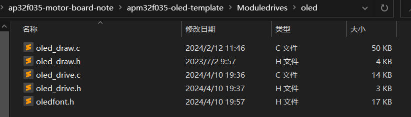
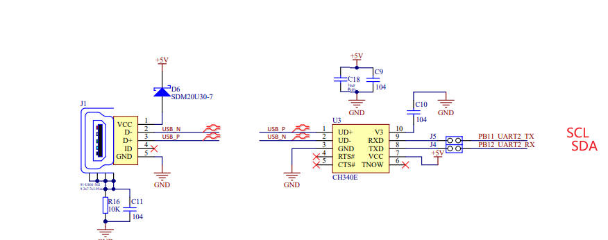
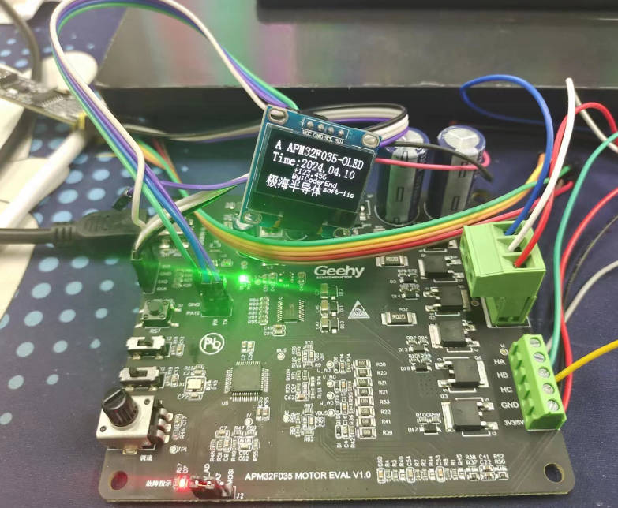

## 极海APM32F035电机控制开发板评测 03 0.96寸 IIC接口 OLED模块显示

### 1.软硬件平台

1. 软硬件平台

   1. AT32A403A Board开发板

   2. MDK-ARM Keil

   3. 0.96寸 IIC接口 OLED显示模块
   
      

### OLED模块简述

OLED显示模块在单片机开发中扮演着重要的角色。它利用有机发光二极管（OLED）技术，通过电流激发有机材料发光，从而实现信息显示。这种显示技术具有自发光、对比度高、厚度薄、视角广、反应速度快、可用于挠曲性面板、使用温度范围广以及构造和制程简单等特点。

在单片机开发中，OLED显示模块的主要作用体现在以下几个方面：

1. **信息显示**：OLED显示模块能够直观地展示单片机处理后的数据或状态信息，如传感器读数、系统状态等。这对于调试和监控单片机的工作状态非常有帮助。
2. **人机交互**：通过OLED显示模块，用户可以更方便地与单片机进行交互。例如，用户可以通过查看OLED屏幕上的菜单或提示信息来执行相应的操作，从而实现对单片机的控制。
3. **节省空间与功耗**：由于OLED显示模块具有薄型、低功耗的特点，它非常适合在空间有限且对功耗要求较高的应用场景中使用。例如，在可穿戴设备或便携式电子产品中，OLED显示模块能够有效地节省空间并降低功耗。
4. **提升用户体验**：OLED显示模块的高对比度和广视角范围能够确保用户在各种角度下都能清晰地看到显示内容，从而提升用户的使用体验。

#### OLED 显示函数支持

 1.  OLED 显示字符、字符串 汉字
```c
void OLED_ShowChar_06x08(uint8_t X, uint8_t Y, uint8_t Char);//显示字符函数
void OLED_ShowString_06x08(uint8_t X, uint8_t Y, uint8_t *String);//显示字符串函数
void OLED_ShowCHinese(uint8_t X,uint8_t Y,uint8_t Chinese);//显示汉字函数
void OLED_ShowChar_08x16(uint8_t X, uint8_t Y, uint8_t Char);//显示字符函数
void OLED_ShowString_16x16(uint8_t X, uint8_t Y, uint8_t *String);//显示字符串函数
```
 2.  OLED 显示整型数字/浮点型数字/二进制数字/十六进制数字

```c
void OLED_ShowNumber_SignedInteger_06x08(uint8_t X, uint8_t Y, int16_t IntegerNumber, uint8_t Count);//显示有符号整型数字函数
void OLED_ShowNumber_UnsignedInteger_06x08(uint8_t X, uint8_t Y, uint16_t IntegerNumber, uint8_t Count);//显显示无符号整型数字函数
void OLED_ShowNumber_Float_06x08(uint8_t X, uint8_t Y, float FloatNumber, uint8_t Count1, uint8_t Count2);//显示浮点数函数
void OLED_ShowNumber_Binary_06x08(uint8_t X, uint8_t Y, unsigned long BinaryNumber, uint8_t Count);//显示数组函数
void OLED_ShowNumber_Hex_06x08(uint8_t X, uint8_t Y, unsigned long BinaryNumber, uint8_t Count);//显示十六进制数字函数

```

 3.  OLED 基本绘图函数


```c
//  OLED 绘制直线
void OLED_DrawLine(uint8_t X, uint8_t Y, uint8_t PointData);
//  OLED 绘制图像
void OLED_RollDisplay(void);//设置水平左右移
void Draw_BMP(uint8_t x0,uint8_t y0,uint8_t x1,uint8_t y1,uint8_t BMP[]);
//画点函数
void OLED_DrawDot(uint8_t X,uint8_t Y,uint8_t T);
//画直线函数
void LCD_DrawLine(uint32_t X1, uint32_t Y1, uint32_t X2,uint32_t Y2);
//dot ==1 表示亮显示出来
void OLED_Fill_Draw_circle(uint8_t X0,uint8_t Y0,uint8_t r,uint8_t dot);
//ucFilled ==1 表示填充 //画直圆函数
void OLED_DrawCircle( uint16_t usX_Center, uint16_t usY_Center, uint16_t usRadius, uint8_t ucFilled );
//画矩形函数
void LCD_DrawRectangle(uint16_t X1, uint16_t Y1, uint16_t X2, uint16_t Y2);
```
### 3.模拟IIC移植 OLED屏幕驱动

1. 建立工程模板，添加相关驱动文件

   在之前的工程模板上进行添加文件，同时oled部分代码参考梁山派GD32F4开发板资料进行。

   olde_drive.c olde_drive.h // oled底层驱动文件，包括软件iic实现，oled引脚配置，oled初始化.

   olde_draw.c olde_draw.h // oled应用层文件，主要是绘图api实现（可以移植到其他开发板，不需要改，仅配置好驱动文件即可

   

2. 配置引脚

   **由于APM32电机开发板基本上没有多余引脚引出，为数不多的引脚就串口2的端口**

   

   选择引脚，进入工程开始编写屏幕引脚初始化代码。

   为了方便后续移植，我在**oled_drive.h**处宏定义了每一个引脚，后续根据需要进行修改即可。

   ```c
   #define OLED_SCL_GPIO_PORT            GPIOB
   #define OLED_SCL_GPIO_PIN             GPIO_PIN_11
   #define OLED_SCL_GPIO_CLOCK    				RCM_AHB_PERIPH_GPIOB
   
   #define OLED_SDA_GPIO_PORT            GPIOB
   #define OLED_SDA_GPIO_PIN             GPIO_PIN_12
   #define OLED_SDA_GPIO_CLOCK    				RCM_AHB_PERIPH_GPIOB
   
   ```

3. 屏幕GPIO端口初始化配置

   ```c
   void OLED_GPIO_Configuare(void)
   {
   
   	  GPIO_Config_T  gpioConfig;
   
       /* Enable the OLED_SCL Clock */
       RCM_EnableAHBPeriphClock(OLED_SCL_GPIO_CLOCK);
        /* Enable the OLED_SDA Clock */
       RCM_EnableAHBPeriphClock(OLED_SDA_GPIO_CLOCK);
   		
       /* Configure the OLED_SDA pin */
       gpioConfig.pin = OLED_SDA_GPIO_PIN ;
       gpioConfig.mode = GPIO_MODE_OUT;
       gpioConfig.outtype = GPIO_OUT_TYPE_OD;
       gpioConfig.speed = GPIO_SPEED_50MHz;
       gpioConfig.pupd = GPIO_PUPD_NO;
   		 
       GPIO_Config(OLED_SDA_GPIO_PORT, &gpioConfig);
       
       /* Configure the OLED_SCL pin */
   	gpioConfig.pin = OLED_SCL_GPIO_PIN;
       gpioConfig.mode = GPIO_MODE_OUT;
       gpioConfig.outtype = GPIO_OUT_TYPE_OD;
       gpioConfig.speed = GPIO_SPEED_50MHz;
       gpioConfig.pupd = GPIO_PUPD_NO;
      
   	  GPIO_Config(OLED_SCL_GPIO_PORT, &gpioConfig);
      
   }
   ```
   
4. IIC接口宏定义设置

   ```C
   //-----------------OLED IIC端口定义----------------  					   
   #define OLED_SCLK_Clr() GPIO_ClearBit(OLED_SCL_GPIO_PORT,OLED_SCL_GPIO_PIN)		//SCL IIC接口的时钟信号
   #define OLED_SCLK_Set() GPIO_SetBit(OLED_SCL_GPIO_PORT,OLED_SCL_GPIO_PIN)
   
   #define OLED_SDIN_Clr() GPIO_ClearBit(OLED_SDA_GPIO_PORT,OLED_SDA_GPIO_PIN)		//SDA IIC接口的数据信号
   #define OLED_SDIN_Set() GPIO_SetBit(OLED_SDA_GPIO_PORT,OLED_SDA_GPIO_PIN)
   ```
   
5. 软件IIC代码实现

   ```c
   //==================================================================================================
   //  函数功能: IIC外设驱动函数部分
   //  函数标记: IIC_Start
   //  函数说明: 无
   //-------------------------------------------------------------------------------------------------
   //  |   -   |   -   |   0   |   1   |   2   |   3   |   4   |   5   |   6   |   7   |   8   |   9   
   //==================================================================================================
   void IIC_Start()
   {
   	OLED_SCLK_Set() ;
   	OLED_SDIN_Set();
   	OLED_SDIN_Clr();
   	OLED_SCLK_Clr();
   }
   //==================================================================================================
   //  函数功能: IIC外设驱动函数部分
   //  函数标记: IIC_Stop
   //  函数说明: 无
   //-------------------------------------------------------------------------------------------------
   //  |   -   |   -   |   0   |   1   |   2   |   3   |   4   |   5   |   6   |   7   |   8   |   9   
   //==================================================================================================
   void IIC_Stop()
   {
       OLED_SCLK_Set() ;
   	OLED_SDIN_Clr();
   	OLED_SDIN_Set();	
   }
   //==================================================================================================
   //  函数功能: IIC外设驱动函数部分
   //  函数标记: IIC_Stop
   //  函数说明: 无
   //-------------------------------------------------------------------------------------------------
   //  |   -   |   -   |   0   |   1   |   2   |   3   |   4   |   5   |   6   |   7   |   8   |   9   
   //==================================================================================================
   void IIC_Wait_Ack()
   {
   	OLED_SCLK_Set() ;
   	OLED_SCLK_Clr();
   }
   //==================================================================================================
   //  函数功能: IIC外设驱动函数部分
   //  函数标记: Write_IIC_Byte
   //  函数说明: 无
   //-------------------------------------------------------------------------------------------------
   //  |   -   |   -   |   0   |   1   |   2   |   3   |   4   |   5   |   6   |   7   |   8   |   9   
   //==================================================================================================
   void Write_IIC_Byte(uint8_t IIC_Byte)
   {
   	uint8_t i;
   	uint8_t m,da;
   	da=IIC_Byte;
   	OLED_SCLK_Clr();
   	for(i=0;i<8;i++)		
   	{
   		m=da;
   		//	OLED_SCLK_Clr();
   		m=m&0x80;
   		if(m==0x80)
   		{
   			OLED_SDIN_Set();
   		}
   		else 
   			OLED_SDIN_Clr();
   		
   		da=da<<1;
   		OLED_SCLK_Set();
   		OLED_SCLK_Clr();
   }
   
   }
   //==================================================================================================
   //  函数功能: IIC外设驱动函数部分
   //  函数标记: Write_IIC_Command
   //  函数说明: 无
   //-------------------------------------------------------------------------------------------------
   //  |   -   |   -   |   0   |   1   |   2   |   3   |   4   |   5   |   6   |   7   |   8   |   9   
   //==================================================================================================
   void Write_IIC_Command(uint8_t IIC_Command)
   {
      IIC_Start();
      Write_IIC_Byte(0x78);            //Slave address,SA0=0
      IIC_Wait_Ack();	
      Write_IIC_Byte(0x00);			//write command
      IIC_Wait_Ack();	
      Write_IIC_Byte(IIC_Command); 
      IIC_Wait_Ack();	
      IIC_Stop();
   }
   //==================================================================================================
   //  函数功能: IIC外设驱动函数部分
   //  函数标记: Write_IIC_Data
   //  函数说明: 无
   //-------------------------------------------------------------------------------------------------
   //  |   -   |   -   |   0   |   1   |   2   |   3   |   4   |   5   |   6   |   7   |   8   |   9   
   //==================================================================================================
   void Write_IIC_Data(uint8_t IIC_Data)
   {
       IIC_Start();
       Write_IIC_Byte(0x78);			//D/C#=0; R/W#=0
   	IIC_Wait_Ack();	
       Write_IIC_Byte(0x40);			//write data
   	IIC_Wait_Ack();	
       Write_IIC_Byte(IIC_Data);
   	IIC_Wait_Ack();	
       IIC_Stop();
   }
   ```

6. OLED初始化函数

   ```c
   //==================================================================================================
   //  函数功能: OLED 外设驱动函数部分
   //  函数标记: OLED_Init
   //  函数说明: 初始化函数配置
   //-------------------------------------------------------------------------------------------------
   //  |   -   |   -   |   0   |   1   |   2   |   3   |   4   |   5   |   6   |   7   |   8   |   9   
   //==================================================================================================
   void OLED_Init(void)
   { 	
       OLED_GPIO_Configuare();
       OLED_WR_Byte(0xAE,OLED_CMD);//--display off
   	OLED_WR_Byte(0x00,OLED_CMD);//---set low column address
   	OLED_WR_Byte(0x10,OLED_CMD);//---set high column address
   	OLED_WR_Byte(0x40,OLED_CMD);//--set start line address  
   	OLED_WR_Byte(0xB0,OLED_CMD);//--set page address
   	OLED_WR_Byte(0x81,OLED_CMD); // contract control
   	OLED_WR_Byte(0xFF,OLED_CMD);//--128   
   	OLED_WR_Byte(0xA1,OLED_CMD);//set segment remap 
   	OLED_WR_Byte(0xA6,OLED_CMD);//--normal / reverse
   	OLED_WR_Byte(0xA8,OLED_CMD);//--set multiplex ratio(1 to 64)
   	OLED_WR_Byte(0x3F,OLED_CMD);//--1/32 duty
   	OLED_WR_Byte(0xC8,OLED_CMD);//Com scan direction
   	OLED_WR_Byte(0xD3,OLED_CMD);//-set display offset
   	OLED_WR_Byte(0x00,OLED_CMD);//
       
   	OLED_WR_Byte(0xD5,OLED_CMD);//set osc division
   	OLED_WR_Byte(0x80,OLED_CMD);//
   	
   	OLED_WR_Byte(0xD8,OLED_CMD);//set area color mode off
   	OLED_WR_Byte(0x05,OLED_CMD);//
   	
   	OLED_WR_Byte(0xD9,OLED_CMD);//Set Pre-Charge Period
   	OLED_WR_Byte(0xF1,OLED_CMD);//
   	
   	OLED_WR_Byte(0xDA,OLED_CMD);//set com pin configuartion
   	OLED_WR_Byte(0x12,OLED_CMD);//
   	
   	OLED_WR_Byte(0xDB,OLED_CMD);//set Vcomh
   	OLED_WR_Byte(0x30,OLED_CMD);//
   	
   	OLED_WR_Byte(0x8D,OLED_CMD);//set charge pump enable
   	OLED_WR_Byte(0x14,OLED_CMD);//
   	
   	OLED_WR_Byte(0xAF,OLED_CMD);//--turn on oled panel
   	
   
   	OLED_Clear();
   	OLED_Set_Pos(0,0);
   }  
   ```

   综上所述，软件模拟IIC 驱动OLED文件完成，接下来就是应用层文件,具体参考仓库代码。

   [模拟IIC 驱动OLED]: https://gitee.com/End-ING/embedded-apm32f35-board/tree/master/note/apm32f035-board/ap32f035-motor-board-note/apm32f035-oled-template

### 5.案例测试
   
   1. 主函数
   
      ```c
      /* Includes */
      #include "main.h"
      
      /* printf using USART1  */
      #define DEBUG_USART             MINI_COM2
      
      void APM_MINI_Init(void);
      void GPIO_Init(void);
      
      /*!
       * @brief       Init MINI board
       *
       * @param       None
       *
       * @retval      None
       *
       * @note
       */
      void APM_MINI_Init(void)
      {
          /* Init delay function */
          APM_MINI_DelayInit();
      		APM_MINI_PBInit(BUTTON_KEY1, BUTTON_MODE_GPIO);
      	  //APM_MINI_COMInit(COM2);
      }
      
      /*!
       * @brief       GPIO initialization
       *
       * @param       None
       *
       * @retval      None
       *
       */
      void GPIO_Init(void)
      {
          GPIO_Config_T gpioConfig;
      
          RCM_EnableAHBPeriphClock(LED2_GPIO_CLK | LED3_GPIO_CLK);
          /* LED2 GPIO configuration */
          gpioConfig.pin = LED2_PIN;
          gpioConfig.mode = GPIO_MODE_OUT;
          gpioConfig.outtype = GPIO_OUT_TYPE_PP;
          gpioConfig.speed = GPIO_SPEED_50MHz;
          gpioConfig.pupd = GPIO_PUPD_NO;
          GPIO_Config(LED2_GPIO_PORT, &gpioConfig);
      }
      
      void oled_example(void)
      {
            OLED_ShowChar_08x16(0,0,'A');
            OLED_ShowString_08x16(16,0,"APM32F035-OLED");
      //      OLED_ShowNumber_SignedInteger_06x08(16,2,1234,5);
      //      OLED_ShowNumber_UnsignedInteger_06x08(64,2,1234,4);
            OLED_ShowString_08x16(0,2,"Time:2024.04.10");
            OLED_ShowNumber_Float_06x08(32,4,123.456,3,3);
            OLED_ShowString_06x08(32,5,"By:CoderEnd");
          
      
            OLED_ShowCHinese(0,6,0);
            OLED_ShowCHinese(16,6,1);
            OLED_ShowCHinese(32,6,2);
            OLED_ShowCHinese(48,6,3);
            OLED_ShowCHinese(64,6,4);
            OLED_ShowString_06x08(80,6,"soft-iic");
      }  
      /*!
       * @brief       Main program
       *
       * @param       None
       *
       * @retval      None
       *
       */
      int main(void)
      {
          APM_MINI_Init();
      
          GPIO_Init();
      	  OLED_Init();
          printf("Hardware_Init [ok] \r\n");
          printf("apm32f035-motor board testing 2024-04-10\r\n");
          printf("This is an example of oled \r\n");
          
      	  oled_example();
          while (1)
          {
               /* Turn LED2 on */
              GPIO_ClearBit(LED2_GPIO_PORT, LED2_PIN);
              APM_MINI_DelayMs(1000);
      
              /* Turn LED2 off */
              GPIO_SetBit(LED2_GPIO_PORT, LED2_PIN);
              APM_MINI_DelayMs(500);
      
      
          }
      }
      ```
2. 测试效果
   
      软件IIC
   
      