## 04 极海APM32F035电机控制开发板评测 04 BLDC无刷电机控制基础测试

### 1. 无刷电机基本概念

无刷直流电机（Brushless Direct Current Motor，简称BLDCM）由电动机主体和驱动器组成，是一种典型的机电一体化产品。无刷电机是指**无电刷和换向器（或集电环）的电机**，又称无换向器电机。正如名称指出的那样，BLDC电机不用电刷来换向。BLDC电机和有刷直流电机以及感应电机相比，有许多优点。其中包括：

- 更好的转速一转矩特性
- 快速动态响应
- 高效率
- 使用寿命长
- 运转无噪音
- 较高的转速范围

### 2. 无刷电机分类

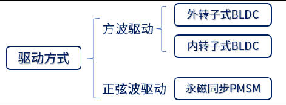

BLDC与 PMSM电机在控制方式、运行方式、绕组方式 等等， 都有很大的区别，最主要的区别就是反电动势不同， BLDC接近于方波， PMSM接近于正弦波。总结了一张BLDC与 PMSM之间的对比表，如下表：

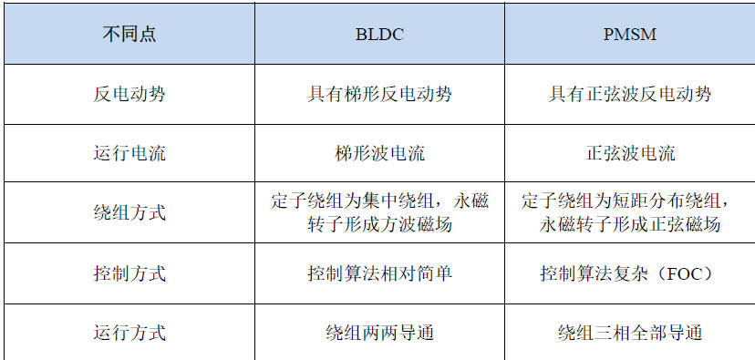

直流无刷电机的主要参数介绍

- 极对数 ：转子磁铁 NS级的对数，此参数和电机旋转速度有关：电子速度 = 电机实际速度 * 极对数 。
- KV值 ：电机的运转速度，值越大电机转速越大。电机转速 = KV值 * 工作电压 。 同系列同外形尺寸的无刷电机，根据绕线匝数的多少，会表现出不同的 KV 特性。**绕线匝数多的， KV 值低，最高输出电流小，扭力大；绕线匝数少的， KV 值高，最高输出电流大，扭力小**
- 额定转速 ：额定的电流下的空载转速，通常单位用 RPM表示；
- 转矩 ：电机中转子产生的可以带动机械负载的驱动力矩。通常单位为 N.M

### 3. 直流无刷电机的基本控制原理

1. 安培定则

   安培定则， 也叫右手螺旋定则，是表示 电流 和电流激发磁场的磁感线方向间关系的定则 。 我们这里利用定则之一： 当 用右手握住通电螺线管，让四指指向电流的方向，那么大拇指所指的那一端是通电螺线管的 N极。 如下图所示：

   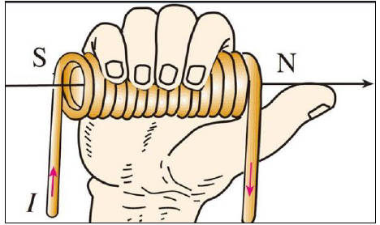

   所以通电 线圈会产生磁场，我们可以把通电线圈的磁场看成一个磁体，如下图：

   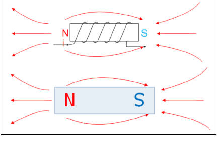

   **磁体之间，存在异性相吸，同性相斥的原理，通电线圈和永磁体之间同样存在，而无刷电机就是利用了通电线圈和永磁体的相互作用原理.**

2. 无刷电机结构

   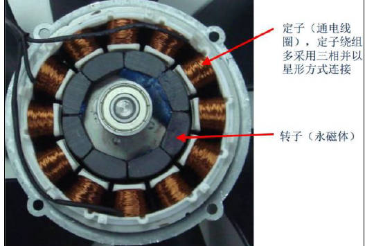

   无刷电机的 3根电机线按顺序依次叫 U相线 (一般为黄色 V相线 (一般为绿色 )和 W相线 (一般为蓝色 3组漆包线绕组的一端连接在一起，另外一端引出即为 UVW相线，所以任意两根相线通电都可以导通这两个线圈，除此之外，一般无刷电机还有另外一组引出线，即霍尔传感器线：

   霍尔 电源线正极，霍尔 电源线负极，霍尔 U相输出，霍尔 V相输出，霍尔 W相输出

   

   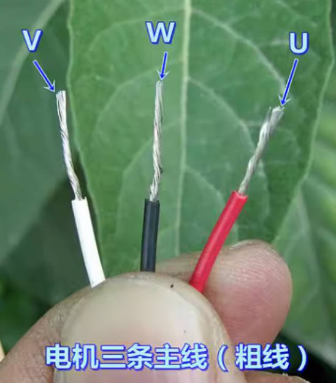

   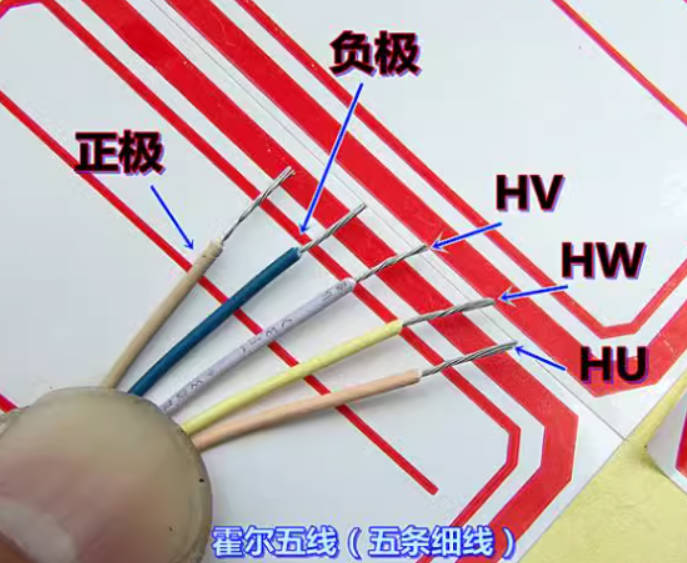

   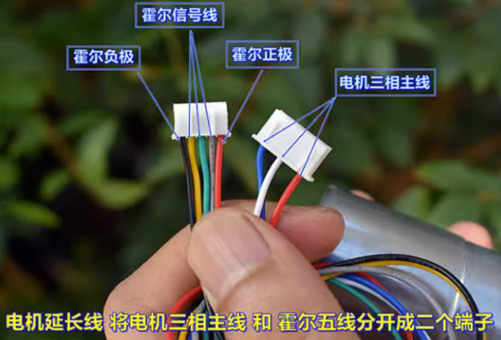

   **需要注意霍尔输出线的线序要对好，如果霍尔的线序接不对，要么电机抖动不转，要么电机转速快很多，电流很大但扭力很小，如果出现以上情况，请将霍尔的三条输出线其中的二条掉换一下。**

3. 无刷电机简化结构

   为了方便分析，将 上述无刷电机实物图的结构简化为以下形式

   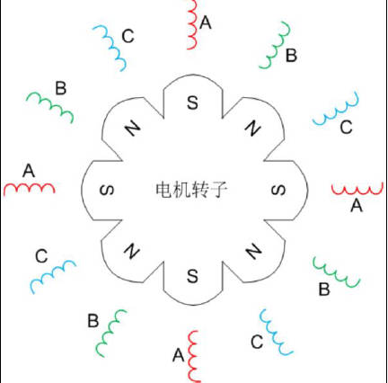

   极对数过多不易于分析所以进一步简化为如下：

   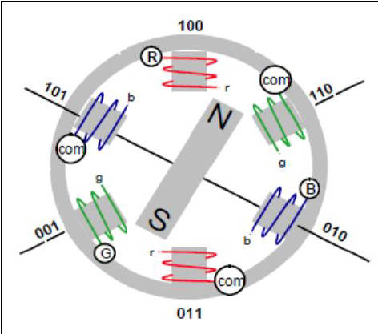

   其中 COM为公共结点，就是将 UVW三相的一端短接一起形成的节点，另外一端引出，所以可以看作 3个有公共端的线圈和一个永磁体结构，如下

   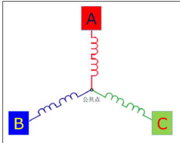

   此时将转子放上，并将 A、 B、 C改为 U、 V、 W三相方便理解，如下图：

   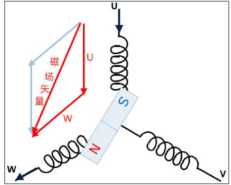

   上图反映了 U相接正极， W相接负极， V相开路， 那么 此时 电流由 U相流到 W相，同时 U相和 W相产生的磁场 合成的磁场 矢量方向即为转子磁场方向。

   由于 **BLDC的运行方式为绕组两两导通(很重要)，所以三相线圈的导通组合只有 6种通电情况**，根据合理的顺序依次切换通电顺序即可让转子跟着磁场转起来。如下图：

   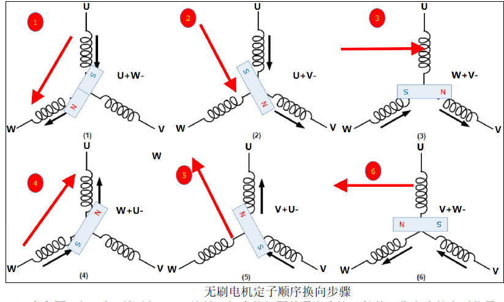

   由上图可知，想要控制 BLDC旋转，根本的问题就是产生这6拍的工作方式的电压信号（称为 BLDC的六步控制） 

   假设 BLDC的额定电压为 24V，电机的三根相线定义为 U V W

   1. 给 U接 24V、 V悬空、 W接 GND，此时电机的转轴对应上图 (1)的转子位置。
   2. 在上一步的基础上修改接线方式，给 U接 24V、 V接 GND、 W悬空，此时电机的转轴对应上图 (2)的转子位置，相较于 (1)旋转了一个角度。
   3. 在 2.的基础上继续修改接线方式， U悬空， V接 GND W接 24V，此时对应 (3)。
   4. 在 3.的基础上继续修改接线方式， U接 GND V悬空， W接 24V，此时对应 (4)。
   5. 在 4.的基础上继续修改接线方式， U接 GND V接 24V W悬空 ，此时对应 (5)。
   6. 在 5.的基础上继续修改接线方式， U悬空， V接 24V W接 GND，此时对应 (6)。

4. 三相逆变电路

   不管是 U相、 V相、 W相在 6种状态里边**有时需要接正极 有时需要接负极**，我们使用**三相逆变电路**来实现简便的**控制三相极性的切换**，如下图：

   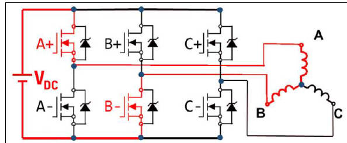

   所谓的三相逆变电路就是 由 三个半桥构成 的电路 ，图 21.2.9中的 A+与 A-为一个半桥，B+与 B-以及 C+与 C-各自又为一个半桥，共三个半桥；这三个半桥各自控制对应的 A、B、C三相绕组；当 控制 A的上桥臂 A+导通时 此时 A相绕组接到电源正，当 控制 B的 下 桥臂B-导通时 此时 B相绕组接到电源 负，所以此时电流由A流向B。

   APM32电机开发板的驱动电路设计如下：

   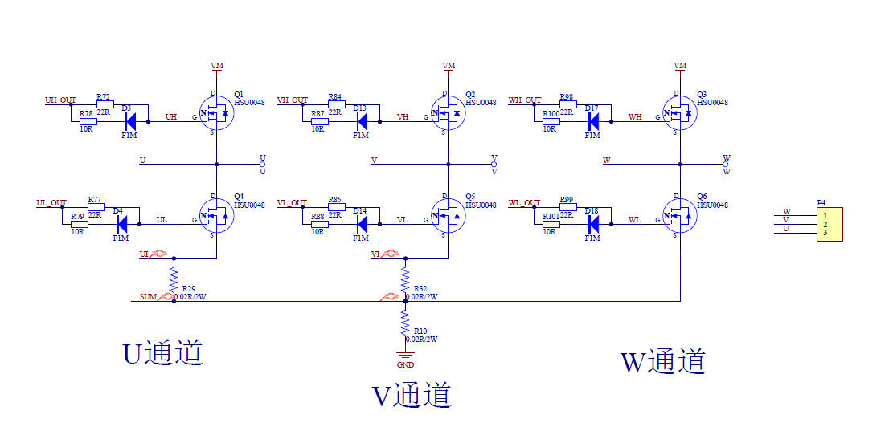

   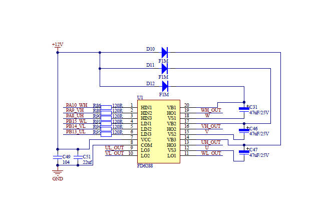

   所以想要控制绕组的极性，只需要**控制绕组对应半桥的“上桥臂导通”或者“下桥臂导通”就可以实现控**制 该相 连接 至“正极”或者“负极”了 但是要注意不可以**同侧半桥上下桥臂同时导通，负责会 短路** ，烧毁电机。 那我们要实现图中的 6步控制，就可以通过三相逆变电路来实现。

   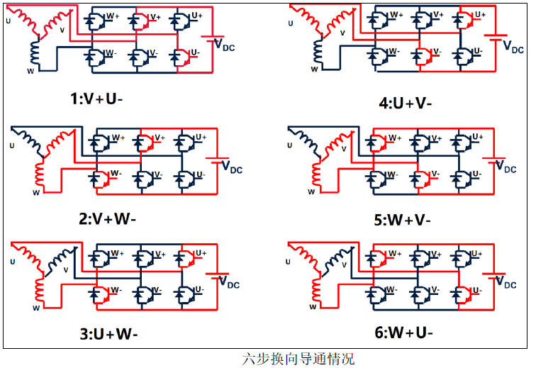

   但是如果直接以上述方式把电源加载到线圈上，这样会直接使电机很快飙到很高的速度， 这样不利于我们控制， 所以一般工作时都是将高低电平用PWM来代替**（这就要求控制器MCU需要有定时器，进行高精度的控制）**，这样可以方便的控制线圈电流，从而控制转子扭矩及转速。
   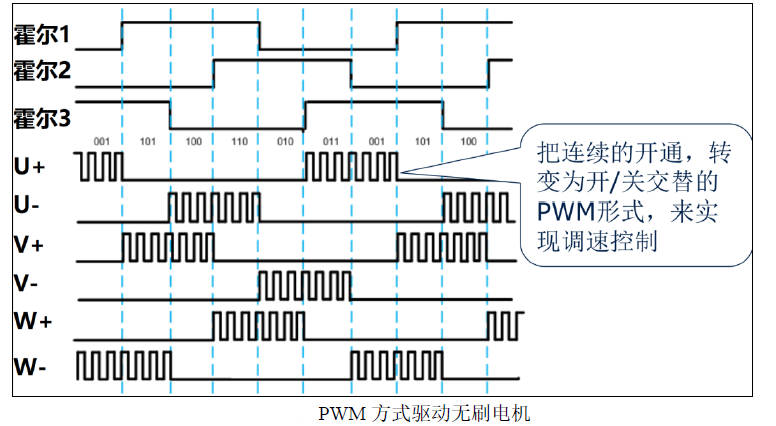
   通常 使用 PWM控制直流无刷电机的常见方法有 5种。
   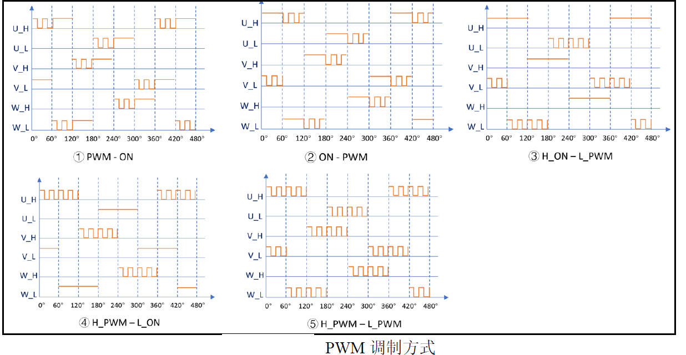
5. 直流无刷电机的霍尔传感器控制基本原理

   **驱动无刷电机的前提是我们必须要知道转子的当前位置**

   无刷电机依靠传感器提供转子位置信息进行驱动的方式我们称之为有感驱动方式，一般利用霍尔传感器获取转子位置信息。同样，无刷电机也有无感驱动的方法。我们先从最基本的有感驱动开始学习。然后一步一步按照 有感方波》》无感方波》》有感FOC》》无感FOC学习，体验电机控制的快乐。

   无刷电机的传感器一般为霍尔传感器，根据霍尔器件可检测磁场的变化的特性再搭配一定的电路将磁场方向变化信号转化成不同的高低电平信号输出，如下图

   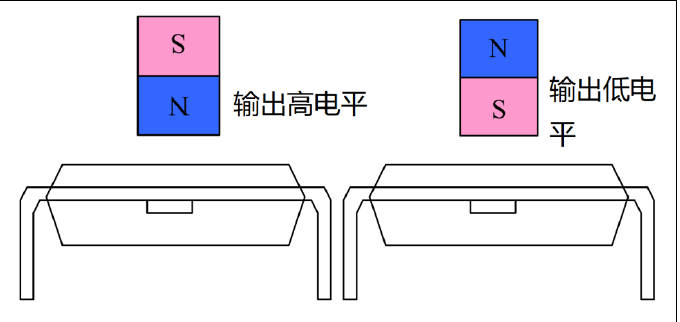

   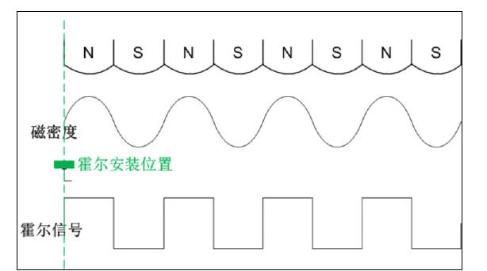

   同无刷电机均匀分布的定子一样，用于输出 3路磁场信号的 3个霍尔传感器也是均匀分布在无刷电机的一周的，每相邻两个传感器 电角度 相差 120°。电机按一定方向转动时 3个霍尔的输出会按照 6步的规律变化，如下所示。

   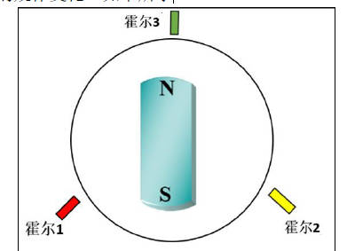

   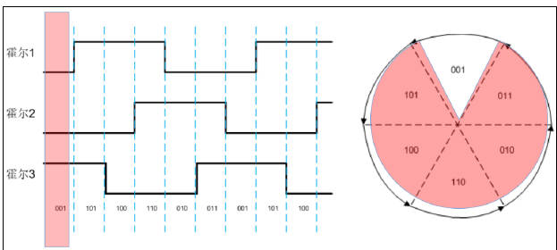

   6步换向需要依赖霍尔传感器反馈的转子位置， 其相对应的就是三相逆变电路 的 上下桥臂导通情况， 如下表所示。

   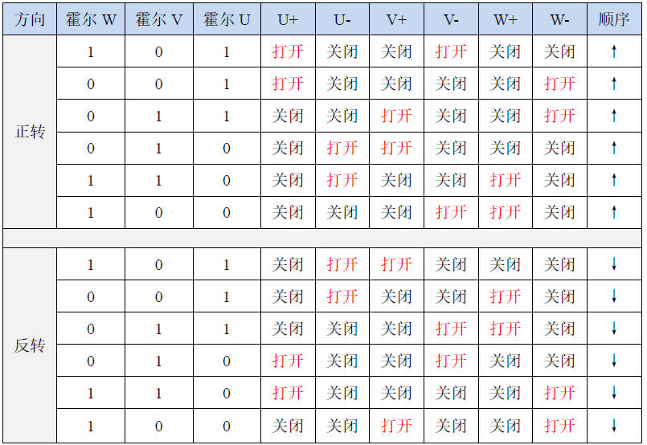

   如表所示，当我们需要无刷电机 **正转** 时，**如检测霍尔输出的组合值为“ 101”，那么此时我们需要导通 U相的上桥臂“ U+””，和 V相的下桥臂“ 即 对应当前转子所在 的 扇区位置** 。其他霍尔组合情况同理。（同时，需要注意，不同的电机和霍尔传感器可能存在不同的逻辑表，需要根据实际情况分析，但是原理基本上是一样的）

6. 有感驱动基本架构

   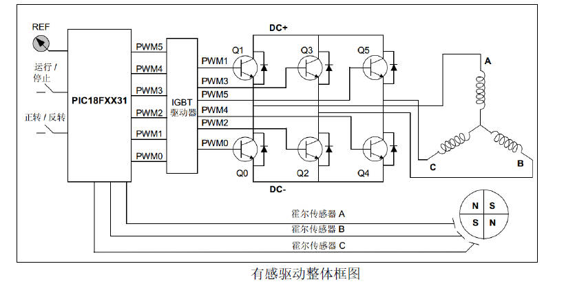

**APM32F035电机开发板 有感控制方案硬件框架：**

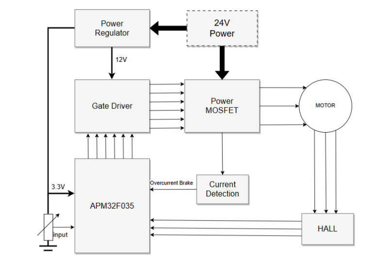

**APM32F035_MOTOR EVAL 有感矢量控制方案**

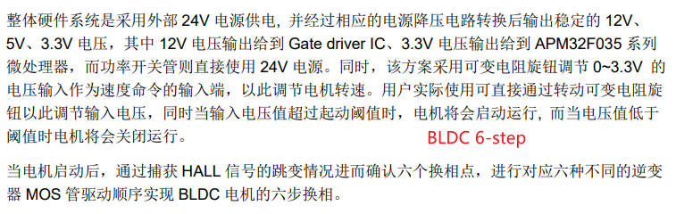

**APM32F035_MOTOR EVAL 有感方波方控制方案**

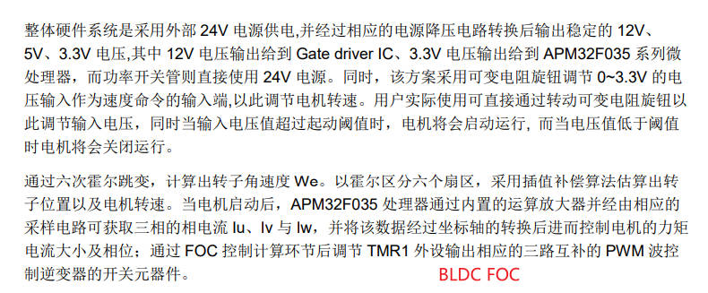


### 4. 无刷电机基本控制 软件实现

APM32极海半导体官方提供了开发板的相关例程，可以去学习。

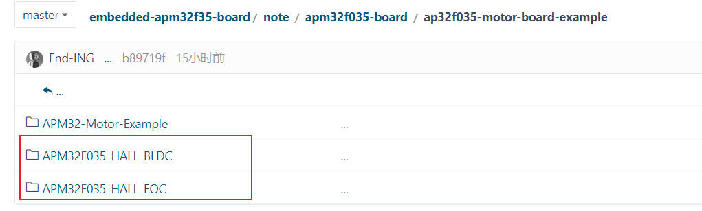

AN1099-APM32F035_MOTOR EVAL 有感矢量控制方案

AN1100-APM32F035_MOTOR EVAL 有感方波控制方案

电机控制方案整体代码架构主要可划分为 4 层，**用户层、外设驱动层、电机控制驱动层以及电机算法层（Gheey_MCLIB）**

电机算法层（Gheey_MCLIB):包括坐标变换、矢量控制等相关函数，数学库，角度估算等库函数,（但注意的是该层没有直接提供代码，直接以静态库的方式提供，因此关于的电机控制算法的设计仍然的重要的机密，重要的学习的东西）

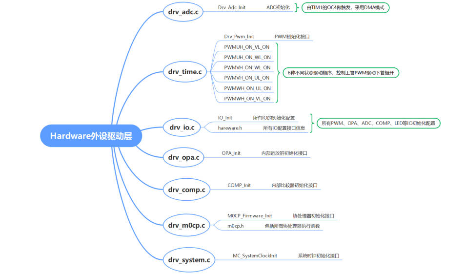

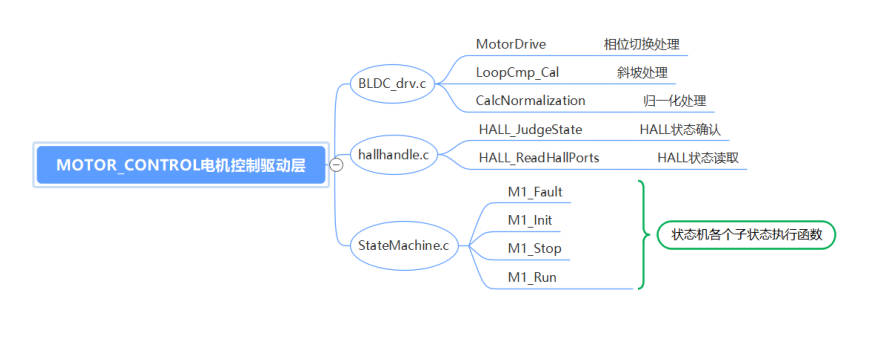

有感方波方控制方案 

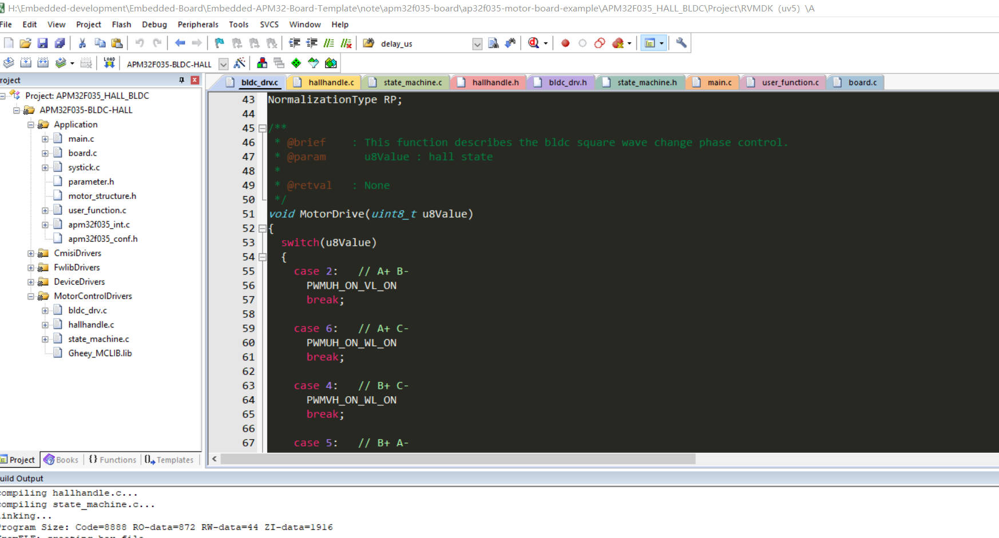

```c
void MotorDrive(uint8_t u8Value)
{
  switch(u8Value)
  {
    case 2:   // A+ B-
      PWMUH_ON_VL_ON
      break;
    
    case 6:   // A+ C-
      PWMUH_ON_WL_ON
      break;
    
    case 4:   // B+ C-
      PWMVH_ON_WL_ON
      break;
    
    case 5:   // B+ A-
      PWMVH_ON_UL_ON
      break;
    
    case 1:   // C+ A-
      PWMWH_ON_UL_ON
      break;
    
    case 3:   // C+ B-
      PWMWH_ON_VL_ON
      break;

    default:
      TMR1->CC1 = 0;
      TMR1->CC2 = 0;
      TMR1->CC3 = 0;
      
      PWMH_OFF_PWML_OFF
      break;
  }
}

```

```c
#define SET_CCR1_VAL(Value)         WRITE_REG(TMR1->CC1, Value)
#define SET_CCR2_VAL(Value)         WRITE_REG(TMR1->CC2, Value)
#define SET_CCR3_VAL(Value)         WRITE_REG(TMR1->CC3, Value)
#define SET_CCR4_VAL(Value)         WRITE_REG(TMR1->CC4, Value)

#define DISABLE_PWMOUT()            CLEAR_BIT(TMR1->BDT, (0x01U << 15))
#define ENABLE_PWMOUT()             SET_BIT(TMR1->BDT, (0x01U << 15))

#define READ_TIM1_UPDATE_FLAG()     READ_BIT(TMR1->STS, 0x01U)
#define CLEAN_TIM1_UPDATE_FLAG()    CLEAR_BIT(TMR1->STS, 0x01U)

#define TIM1_BREAK_ENABLE()         SET_BIT(TMR1->BDT,(0x01U << 12))
#define TIM1_BREAK_DISABLE()        CLEAR_BIT(TMR1->BDT,(0x01U << 12))
#define READ_TIM1_BREAK_FLAG()      READ_BIT(TMR1->STS, (0x01U << 7))
#define CLEAN_TIM1_BREAK_FLAG()     CLEAR_BIT(TMR1->STS, (0x01U << 7))


#define TMR_CCEN_CC1EN              (0x01U << 0)           ///< Capture/Compare 1 output enable
#define TMR_CCEN_CC2EN              (0x01U << 4)
#define TMR_CCEN_CC3EN              (0x01U << 8)
#define TMR_CCEN_CC1NEN             (0x01U << 2)
#define TMR_CCEN_CC2NEN             (0x01U << 6)
#define TMR_CCEN_CC3NEN             (0x01U << 10)

//========PWM1 2 3通道输出使能位操作===================================== 
#define     PWMU_Enb          TMR1->CCEN |= (uint16_t)(((uint16_t)TMR_CCEN_CC1EN)) 
#define     PWMU_Dis          TMR1->CCEN &= (uint16_t)(~((uint16_t)TMR_CCEN_CC1EN)) 
#define     PWMV_Enb          TMR1->CCEN |= (uint16_t)(((uint16_t)TMR_CCEN_CC2EN)) 
#define     PWMV_Dis          TMR1->CCEN &= (uint16_t)(~((uint16_t)TMR_CCEN_CC2EN)) 
#define     PWMW_Enb          TMR1->CCEN |= (uint16_t)(((uint16_t)TMR_CCEN_CC3EN)) 
#define     PWMW_Dis          TMR1->CCEN &= (uint16_t)(~((uint16_t)TMR_CCEN_CC3EN))  

#define     PWMUVW_Enb        TMR1->CCEN |= (uint16_t)(((uint16_t)(TMR_CCEN_CC1EN|TMR_CCEN_CC2EN|TMR_CCEN_CC3EN)))
#define     PWMUVW_Dis        TMR1->CCEN &= (uint16_t)(~((uint16_t)(TMR_CCEN_CC1EN|TMR_CCEN_CC2EN|TMR_CCEN_CC3EN))) 

#define     UL_ON             GPIO_SetBit(GPIO_PWM_U_MINUS, GPIO_PIN_PWM_U_MINUS)
#define     VL_ON             GPIO_SetBit(GPIO_PWM_V_MINUS, GPIO_PIN_PWM_V_MINUS)
#define     WL_ON             GPIO_SetBit(GPIO_PWM_W_MINUS, GPIO_PIN_PWM_W_MINUS)
#define     UL_OFF            GPIO_ClearBit(GPIO_PWM_U_MINUS, GPIO_PIN_PWM_U_MINUS)
#define     VL_OFF            GPIO_ClearBit(GPIO_PWM_V_MINUS, GPIO_PIN_PWM_V_MINUS)
#define     WL_OFF            GPIO_ClearBit(GPIO_PWM_W_MINUS, GPIO_PIN_PWM_W_MINUS)  

#define     PWM_OFF_L_OFF     UL_OFF; VL_OFF; WL_OFF; PWMUVW_Dis;
#define     PWM_ON_L_OFF      UL_OFF; VL_OFF; WL_OFF; PWMUVW_Enb;
#define     PWM_OFF_L_ON      UL_ON; VL_ON; WL_ON; PWMUVW_Dis;

#define     PWMUH_ON_VL_ON    UL_OFF; WL_OFF; PWMUVW_Dis; PWMU_Enb; VL_ON;  
#define     PWMUH_ON_WL_ON    UL_OFF; VL_OFF; PWMUVW_Dis; PWMU_Enb; WL_ON;
#define     PWMVH_ON_WL_ON    UL_OFF; VL_OFF; PWMUVW_Dis; PWMV_Enb; WL_ON;
#define     PWMVH_ON_UL_ON    VL_OFF; WL_OFF; PWMUVW_Dis; PWMV_Enb; UL_ON;
#define     PWMWH_ON_UL_ON    VL_OFF; WL_OFF; PWMUVW_Dis; PWMW_Enb; UL_ON;
#define     PWMWH_ON_VL_ON    UL_OFF; WL_OFF; PWMUVW_Dis; PWMW_Enb; VL_ON;

//========PWM1 2 3通道互补输出使能位操作===================================== 
#define     PWMUN_Enb   TMR1->CCEN |= (uint16_t)(((uint16_t)TMR_CCEN_CC1NEN)) 
#define     PWMUN_Dis   TMR1->CCEN &= (uint16_t)(~((uint16_t)TMR_CCEN_CC1NEN)) 
#define     PWMVN_Enb   TMR1->CCEN |= (uint16_t)(((uint16_t)TMR_CCEN_CC2NEN)) 
#define     PWMVN_Dis   TMR1->CCEN &= (uint16_t)(~((uint16_t)TMR_CCEN_CC2NEN)) 
#define     PWMWN_Enb   TMR1->CCEN |= (uint16_t)(((uint16_t)TMR_CCEN_CC3NEN)) 
#define     PWMWN_Dis   TMR1->CCEN &= (uint16_t)(~((uint16_t)TMR_CCEN_CC3NEN))

#define     PWMUVWN_Enb TMR1->CCEN |= (uint16_t)(((uint16_t)(TMR_CCEN_CC1NEN|TMR_CCEN_CC2NEN|TMR_CCEN_CC3NEN)))
#define     PWMUVWN_Dis TMR1->CCEN &= (uint16_t)(~((uint16_t)(TMR_CCEN_CC1NEN|TMR_CCEN_CC2NEN|TMR_CCEN_CC3NEN))) 

#define     PWMH_OFF_PWML_ON    PWMUVW_Dis;     PWMUVWN_Enb;
#define     PWMH_ON_PWML_OFF    PWMUVWN_Dis;    PWMUVW_Enb;
#define     PWMH_OFF_PWML_OFF   PWMUVWN_Dis;    PWMUVW_Dis;
#define     PWMH_ON_PWML_ON     PWMUVWN_Enb;    PWMUVW_Enb;
```

关于电机控制的代码太多，只能大概看看，上面的MotorDrive函数完成的功能基本上就是实现6步换向的功能。

官方例程的代码还需要仔细研究，不是一时半会能搞懂的，前提还是得吧基础的概念搞懂。

### 5.无刷电机基控制测试

接下来接上电机，进行电机测试。本次使用的无刷电机是在淘宝上买的，**日本（信浓）直流无刷电机 DC36V 48V 双滚珠轴承 静音 大扭力** （根据商家提供的资料，正确的接线）

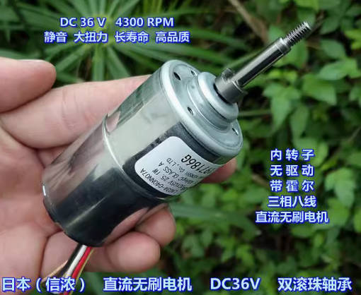

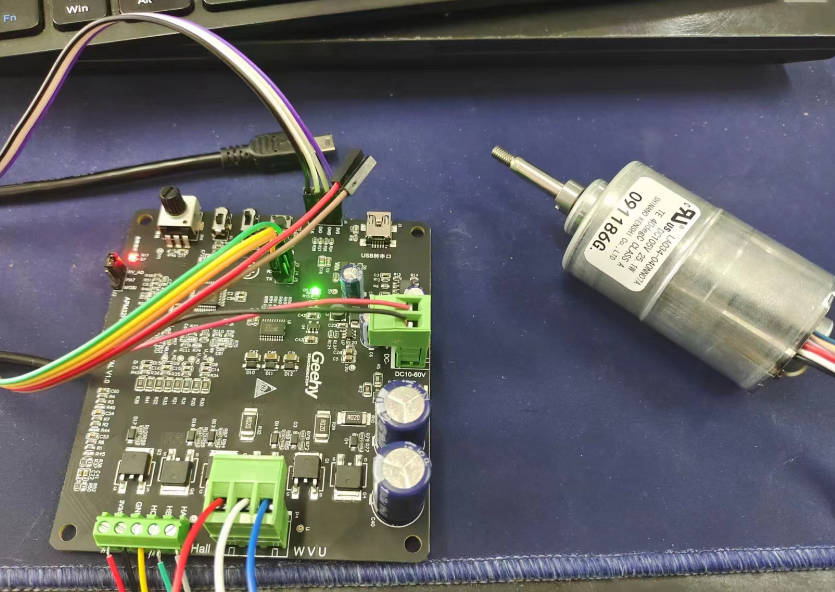

分别进行了有感矢量控制方案，有感方波控制方案的测试。有感矢量控制方案FOC的测试结果的确十分的丝滑，噪音也小了。


