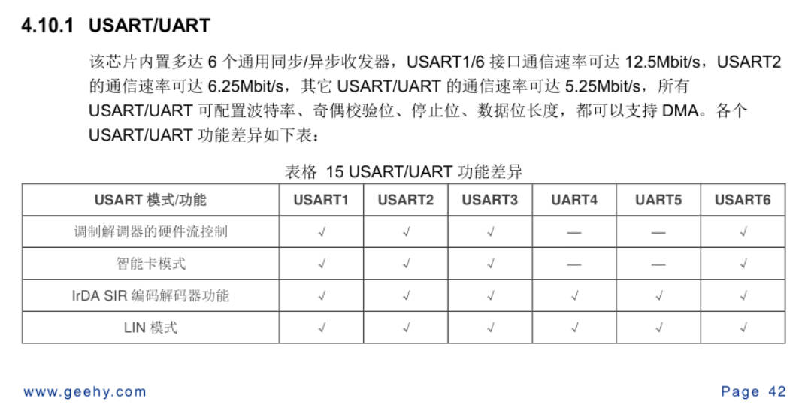
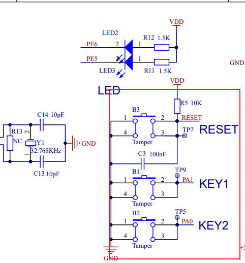
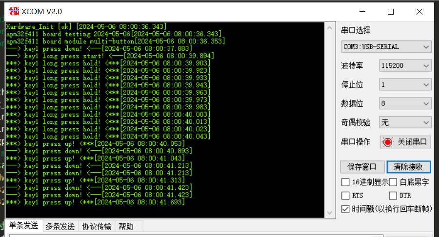

## 极海APM32F411V Tiny开发板评测02  按键、串口、定时器简测


### 串口简测
从数据手册可以看出，APM32F411共有6个USART串口。




结合官方例程和STM32的经验，对APM32进行串口接收中断初始化。

```c
#include "main.h"
#include "Bsp_Usart.h"

#define DATA_BUF_SIZE       (32)
/** USART1 receive buffer*/
uint8_t rxDataBufUSART1[DATA_BUF_SIZE] = {0};

uint32_t rxCountUSART1 = 0;
/*!
 * @brief       Delay
 *
 * @param       count:  delay count
 *
 * @retval      None
 */
void Delay(uint32_t count)
{
    volatile uint32_t delay = count;
    while(delay--);
}

/*!
 * @brief       USARTS Initialization
 *
 * @param       None
 *
 * @retval      None
 */
void USART1_Init(void)
{
	GPIO_Config_T GPIO_configStruct;
    GPIO_ConfigStructInit(&GPIO_configStruct);
    USART_Config_T usartConfigStruct;

	/*使能GPIO时钟*/
	RCM_EnableAHB1PeriphClock(RCM_AHB1_PERIPH_GPIOA);
	
	/*连接PA9至USART1_TX*/
	GPIO_ConfigPinAF(GPIOA,GPIO_PIN_SOURCE_9, GPIO_AF_USART1);
    /* 配置PA9 USART1_TX 推拉模式 */
    GPIO_configStruct.mode = GPIO_MODE_AF;
    GPIO_configStruct.pin = GPIO_PIN_9;
    GPIO_configStruct.speed = GPIO_SPEED_50MHz;
    GPIO_Config(GPIOA, &GPIO_configStruct);
	
   /*连接PA10至USART1_RX*/
    GPIO_ConfigPinAF(GPIOA, GPIO_PIN_SOURCE_10,GPIO_AF_USART1);	
    /* 配置PA10 USART1_RX 推拉模式 */
    GPIO_configStruct.mode = GPIO_MODE_AF;
    GPIO_configStruct.pin = GPIO_PIN_10;
    GPIO_Config(GPIOA, &GPIO_configStruct);
	
	/*使能USART1时钟*/
	RCM_EnableAPB2PeriphClock(RCM_APB2_PERIPH_USART1);

    usartConfigStruct.baudRate = 115200;
    usartConfigStruct.hardwareFlow = USART_HARDWARE_FLOW_NONE;
    usartConfigStruct.mode = USART_MODE_TX_RX;
    usartConfigStruct.parity = USART_PARITY_NONE;
    usartConfigStruct.stopBits = USART_STOP_BIT_1;
    usartConfigStruct.wordLength = USART_WORD_LEN_8B;
    USART_Config(USART1, &usartConfigStruct);

    /* 使能USART1 */
    USART_Enable(USART1);
    Delay(0x7FFF);//例程中进行了延时

    /* 配置USART1中断 */
    USART_EnableInterrupt(USART1, USART_INT_RXBNE);//接收中断
    USART_ClearStatusFlag(USART1, USART_FLAG_RXBNE);//清楚中断标志位
    NVIC_EnableIRQRequest(USART1_IRQn,1,0);
}


/*!
 * @brief       This function handles USART1 RX interrupt Handler
 *
 * @param       None
 *
 * @retval      None
 *
 * @note        This function need to put into  void USART1_IRQHandler(void)
 */
void  USART_Receive_Isr(void)
{
    /* USART1 Recieve Data */
    if(USART_ReadStatusFlag(USART1, USART_FLAG_RXBNE) == SET)
    {
        rxDataBufUSART1[rxCountUSART1++] = (uint8_t)USART_RxData(USART1);
    }

}

void USART_Write(USART_T* usart,uint8_t *dat,uint32_t count)
{
    while(count--)
    {
        while(USART_ReadStatusFlag(usart, USART_FLAG_TXBE) == RESET);//在接收空闲时，再发送
			USART_TxData(usart, *dat++);
        //Delay(0x5FFFF);//例程中有，但去掉后，少量发送暂时未发现影响
    }	
}


/*!
 * @brief        This function handles USART1 RX interrupt Handler
 *
 * @param        None
 *
 * @retval       None
 *
 * @note
 */
void USART1_IRQHandler(void)
{
    USART_Receive_Isr();
}

```


### 按键检测

按键代码直接迁移了例程部分，通过原理图可看出，当按下时，引脚状态为0。



```c
#include "main.h"
#include "Bsp_Key.h"

#define BUTTONn                          2

/**
 * @brief Key1 push-button
 */
#define KEY1_BUTTON_PIN                   GPIO_PIN_1
#define KEY1_BUTTON_GPIO_PORT             GPIOA
#define KEY1_BUTTON_GPIO_CLK              RCM_AHB1_PERIPH_GPIOA
#define KEY1_BUTTON_EINT_LINE             EINT_LINE_1
#define KEY1_BUTTON_EINT_PORT_SOURCE      SYSCFG_PORT_GPIOA
#define KEY1_BUTTON_EINT_PIN_SOURCE       SYSCFG_PIN_1
#define KEY1_BUTTON_EINT_IRQn             EINT1_IRQn
/**
 * @brief Key2 push-button
 */
#define KEY2_BUTTON_PIN                   GPIO_PIN_0
#define KEY2_BUTTON_GPIO_PORT             GPIOA
#define KEY2_BUTTON_GPIO_CLK              RCM_AHB1_PERIPH_GPIOA
#define KEY2_BUTTON_EINT_LINE             EINT_LINE_0
#define KEY2_BUTTON_EINT_PORT_SOURCE      SYSCFG_PORT_GPIOA
#define KEY2_BUTTON_EINT_PIN_SOURCE       SYSCFG_PIN_0
#define KEY2_BUTTON_EINT_IRQn             EINT0_IRQn


#define BUTTONn                          2

GPIO_T* BUTTON_PORT[BUTTONn] = {KEY1_BUTTON_GPIO_PORT, KEY2_BUTTON_GPIO_PORT};

const uint16_t BUTTON_PIN[BUTTONn] = {KEY1_BUTTON_PIN, KEY2_BUTTON_PIN};

const uint32_t BUTTON_CLK[BUTTONn] = {KEY1_BUTTON_GPIO_CLK, KEY2_BUTTON_GPIO_CLK};

const EINT_LINE_T BUTTON_EINT_LINE[BUTTONn] = {KEY1_BUTTON_EINT_LINE, KEY2_BUTTON_EINT_LINE};

const SYSCFG_PORT_T BUTTON_PORT_SOURCE[BUTTONn] = {KEY1_BUTTON_EINT_PORT_SOURCE, KEY2_BUTTON_EINT_PORT_SOURCE};

const SYSCFG_PIN_T BUTTON_PIN_SOURCE[BUTTONn] = {KEY1_BUTTON_EINT_PIN_SOURCE, KEY2_BUTTON_EINT_PIN_SOURCE};

const IRQn_Type BUTTON_IRQn[BUTTONn] = {KEY1_BUTTON_EINT_IRQn, KEY2_BUTTON_EINT_IRQn};


/*!
 * @brief       Configures Button GPIO and EINT Line.
 *
 * @param       Button: Specifies the Button to be configured.
 *              This parameter can be one of following parameters:
 *              @arg BUTTON_KEY1: Key1 Push Button
 *              @arg BUTTON_KEY2: Key2 Push Button
 * @param       Button_Mode: Specifies Button mode.
 *              This parameter can be one of following parameters:
 *              @arg BUTTON_MODE_GPIO: Button will be used as simple IO
 *              @arg BUTTON_MODE_EINT: Button will be connected to EINT line
 *                   with interrupt generation capability
 *
 * @retval      None
 */
void APM_PBInit(Button_TypeDef Button, ButtonMode_TypeDef Button_Mode)
{
    GPIO_Config_T     GPIO_configStruct;
    EINT_Config_T     EINT_configStruct;

    /* Enable the BUTTON Clock */
    RCM_EnableAHB1PeriphClock(BUTTON_CLK[Button]);

    /* Configure Button pin as input floating */
    GPIO_ConfigStructInit(&GPIO_configStruct);
    GPIO_configStruct.mode = GPIO_MODE_IN;
    GPIO_configStruct.pin = BUTTON_PIN[Button];
    GPIO_configStruct.pupd  = GPIO_PUPD_UP;
    GPIO_Config(BUTTON_PORT[Button], &GPIO_configStruct);

    if (Button_Mode == BUTTON_MODE_EINT)
    {
        /* Enable the SYSCFG Clock */
        RCM_EnableAPB2PeriphClock(RCM_APB2_PERIPH_SYSCFG);

        /* Connect Button EINT Line to Button GPIO Pin */
        SYSCFG_ConfigEINTLine(BUTTON_PORT_SOURCE[Button], BUTTON_PIN_SOURCE[Button]);

        /* Configure Button EINT line */
        EINT_configStruct.line = BUTTON_EINT_LINE[Button];
        EINT_configStruct.mode = EINT_MODE_INTERRUPT;
        EINT_configStruct.trigger = EINT_TRIGGER_FALLING;
        EINT_configStruct.lineCmd = ENABLE;
        EINT_Config(&EINT_configStruct);

        /* Enable and set Button EINT Interrupt to the lowest priority */
        NVIC_EnableIRQRequest(BUTTON_IRQn[Button], 0x0f, 0x0f);
    }
}
/*!
 * @brief       Returns the selected Button state.
 *
 * @param       Button: Specifies the Button to be configured.
 *              This parameter can be one of following parameters:
 *              @arg BUTTON_KEY1: Key1 Push Button
 *              @arg BUTTON_KEY2: Key2 Push Button
 *
 * @retval      The Button GPIO pin value.
 */
uint32_t APM_PBGetState(Button_TypeDef Button)
{
    return GPIO_ReadInputBit(BUTTON_PORT[Button], BUTTON_PIN[Button]);
}
/*!
 * @brief   This function handles External line 0 Handler
 *
 * @param   None
 *
 * @retval  None
 *
 */
void EINT0_IRQHandler(void)
{
    if(EINT_ReadIntFlag(EINT_LINE_0))
    {
        APM_LEDToggle(LED2);

        /*Clear EINT_LINE0 interrupt flag*/
        EINT_ClearIntFlag(EINT_LINE_0);
    }
}
/*!
 * @brief   This function handles External lines 1 Handler
 *
 * @param   None
 *
 * @retval  None
 *
 */
void EINT1_IRQHandler(void)
{
    if(EINT_ReadIntFlag(EINT_LINE_1))
    {
        APM_LEDToggle(LED3);

        /*Clear EINT_LINE0 interrupt flag*/
        EINT_ClearIntFlag(EINT_LINE_1);
    }
}
```

#### MultiButton按键检测

MultiButton开源框架仓库 [https://github.com/0x1abin/MultiButton](https://gitee.com/link?target=https%3A%2F%2Fgithub.com%2F0x1abin%2FMultiButton)

参考博客[https://blog.csdn.net/qq_36075612/article/details/115901032](https://gitee.com/link?target=https%3A%2F%2Fblog.csdn.net%2Fqq_36075612%2Farticle%2Fdetails%2F115901032)

MultiButton | 一个小巧简单易用的事件驱动型按键驱动模块 [https://zhuanlan.zhihu.com/p/128961191](https://gitee.com/link?target=https%3A%2F%2Fzhuanlan.zhihu.com%2Fp%2F128961191)

本次使用的是博客中的版本，仓库版本的代码可能与下面代码不一样，应该是更新了代码和api。

### 一、使用方法

1.先申请一个按键结构。

2.初始化按键对象，绑定按键的GPIO电平读取接口**read_button_pin()** ，后一个参数设置有效触发电平。

3.注册按键事件。

4.启动按键。

5.设置一个5ms间隔的定时器循环调用后台处理函数。

```c
//按键状态读取接口
unsigned char btn0_id = 0;
struct Button button0;

uint8_t  read_button0_GPIO(void)
{
    return (GPIO_ReadPin(BSP_PB_GPIO, BSP_PB_PIN));
}

void button_callback(void *button)
{
    uint32_t btn_event_val; 
    
    btn_event_val = get_button_event((struct Button *)button); 
    
    switch(btn_event_val)
    {
      case PRESS_DOWN:
          printf("---> key1 press down! <---\r\n"); 
      break; 
 
      case PRESS_UP: 
          printf("***> key1 press up! <***\r\n");
      break; 
 
      case PRESS_REPEAT: 
          printf("---> key1 press repeat! <---\r\n");
      break; 
 
      case SINGLE_CLICK: 
          printf("---> key1 single click! <---\r\n");
      break; 
 
      case DOUBLE_CLICK: 
          printf("***> key1 double click! <***\r\n");
      break; 
 
      case LONG_PRESS_START: 
          printf("---> key1 long press start! <---\r\n");
      break; 
 
      case LONG_PRESS_HOLD: 
          printf("***> key1 long press hold! <***\r\n");
      break; 
    }
}
```

#### 特性

MultiButton 使用C语言实现，基于面向对象方式设计思路，每个按键对象单独用一份数据结构管理：

```c
struct Button {

	uint16_t ticks;
	uint8_t  repeat: 4;
	uint8_t  event : 4;
	uint8_t  state : 3;
	uint8_t  debounce_cnt : 3;
	uint8_t  active_level : 1;
	uint8_t  button_level : 1;
	uint8_t  (*hal_button_Level)(void);
	BtnCallback  cb[number_of_event];
	struct Button* next;
};
```

这样每个按键使用单向链表相连，依次进入 button_handler(struct Button* handle) 状态机处理，所以每个按键的状态彼此独立。

#### 按键事件

| 事件             | 说明                                 |
| ---------------- | ------------------------------------ |
| PRESS_DOWN       | 按键按下，每次按下都触发             |
| PRESS_UP         | 按键弹起，每次松开都触发             |
| PRESS_REPEAT     | 重复按下触发，变量repeat计数连击次数 |
| SINGLE_CLICK     | 单击按键事件                         |
| DOUBLE_CLICK     | 双击按键事件                         |
| LONG_PRESS_START | 达到长按时间阈值时触发一次           |
| LONG_PRESS_HOLD  | 长按期间一直触发                     |

```c
#include "main.h"


//按键状态读取接口

uint8_t  read_button0_GPIO(void)
{
    return (gpio_input_data_bit_read(USER_BUTTON_PORT, USER_BUTTON_PIN));
}


unsigned char btn0_id = 0;
struct Button button0;

void button_callback(void *button)
{
    uint32_t btn_event_val; 
    
    btn_event_val = get_button_event((struct Button *)button); 
    
    switch(btn_event_val)
    {
      case PRESS_DOWN:
          printf("---> key1 press down! <---\r\n"); 
      break; 
 
      case PRESS_UP: 
          printf("***> key1 press up! <***\r\n");
      break; 
 
      case PRESS_REPEAT: 
          printf("---> key1 press repeat! <---\r\n");
      break; 
 
      case SINGLE_CLICK: 
          printf("---> key1 single click! <---\r\n");
      break; 
 
      case DOUBLE_CLICK: 
          printf("***> key1 double click! <***\r\n");
      break; 
 
      case LONG_PRESS_START: 
          printf("---> key1 long press start! <---\r\n");
      break; 
 
      case LONG_PRESS_HOLD: 
          printf("***> key1 long press hold! <***\r\n");
      break; 
    }
}

/**
  * @brief  main function.
  * @param  none
  * @retval none
  */
int main(void)
{
  //....初始化配置
  printf("Hardware_Init [ok] \r\n");
  printf("apm32f411tiny board testing 2024-05-06\r\n");
  printf("apm32f411tiny board module multi-button\r\n");
    
  //初始化按键对象
    button_init(&button0, read_button0_GPIO, 0);
    button_attach(&button0, PRESS_DOWN,       button_callback);
    button_attach(&button0, PRESS_UP,         button_callback);
    button_attach(&button0, PRESS_REPEAT,     button_callback);
    button_attach(&button0, SINGLE_CLICK,     button_callback);
    button_attach(&button0, DOUBLE_CLICK,     button_callback);
    button_attach(&button0, LONG_PRESS_START, button_callback);
    button_attach(&button0, LONG_PRESS_HOLD,  button_callback);
   //启动按键
   button_start(&button0);
  while(1)
  {
        button_ticks();
        delay_ms(5);
  }
}
```

##### 测试效果



### 定时器简测

模仿例程和STM32进行了定时器中断试验。

```c
#include "main.h"
#include "Bsp_Timer.h"

volatile uint32_t tick = 0;
unsigned int TIM2_LED=0;

/*
arr：自动重装值。
psc：时钟预分频数
定时器溢出时间计算方法:Tout=((arr+1)*(psc+1))/Ft
Ft=定时器工作频率,单位:Mhz
例如：
APM_Timer1_Init(1000-1,84-1);/*定时器时钟84M，分频系数84，所以84M/84=100kHZ，计数1000次为1ms*/
*/

void APM_Timer1_Init(unsigned int arr,unsigned int psc)
{
	TMR_BaseConfig_T TMR_BaseConfigStruct;
   /* Enable TMR1 Periph Clock */
    RCM_EnableAPB2PeriphClock(RCM_APB2_PERIPH_TMR1);

    /* 配置TIM1 向上计数模式*/
    TMR_BaseConfigStruct.clockDivision = TMR_CLOCK_DIV_1;
    TMR_BaseConfigStruct.countMode = TMR_COUNTER_MODE_UP;
    TMR_BaseConfigStruct.division = arr;
    TMR_BaseConfigStruct.period = psc;
    TMR_BaseConfigStruct.repetitionCounter = 0;
    TMR_ConfigTimeBase(TMR1, &TMR_BaseConfigStruct);

    /* Enable TMR1 Interrupt */
    TMR_EnableInterrupt(TMR1, TMR_INT_UPDATE);
    NVIC_EnableIRQRequest(TMR1_UP_TMR10_IRQn, 0, 0);

    TMR_Enable(TMR1);
}

void APM_Timer2_Init(unsigned int arr,unsigned int psc)
{
	TMR_BaseConfig_T TMR_BaseConfigStruct;
   /* Enable TMR1 Periph Clock */
    RCM_EnableAPB1PeriphClock(RCM_APB1_PERIPH_TMR2);

    /* Config TMR2 */
    TMR_BaseConfigStruct.clockDivision = TMR_CLOCK_DIV_1;
    TMR_BaseConfigStruct.countMode = TMR_COUNTER_MODE_UP;
    TMR_BaseConfigStruct.division = arr;
    TMR_BaseConfigStruct.period = psc;
    TMR_BaseConfigStruct.repetitionCounter = 0;
    TMR_ConfigTimeBase(TMR2, &TMR_BaseConfigStruct);

    /* Enable TMR2 Interrupt */
    TMR_EnableInterrupt(TMR2, TMR_INT_UPDATE);
    NVIC_EnableIRQRequest(TMR2_IRQn, 0, 0);

    TMR_Enable(TMR2);
}
/*!
 * @brief   This function handles TMR1 Update Handler
 *
 * @param   None
 *
 * @retval  None
 *
 */
void TMR1_UP_TMR10_IRQHandler(void)
{
    if(TMR_ReadIntFlag(TMR1, TMR_INT_UPDATE) == SET)
    {
//        tick++;
        TMR_ClearIntFlag(TMR1, TMR_INT_UPDATE);
    }
}
void TMR2_IRQHandler(void)
{
    if(TMR_ReadIntFlag(TMR2, TMR_INT_UPDATE) == SET)
    {
        tick++;
		if(tick==1000)
		{
			TIM2_LED=1;
			tick=0;
		}
        TMR_ClearIntFlag(TMR2, TMR_INT_UPDATE);
    }	
}

```

