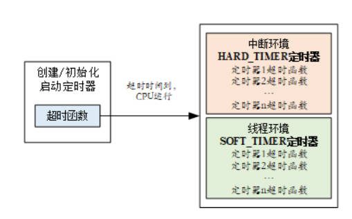
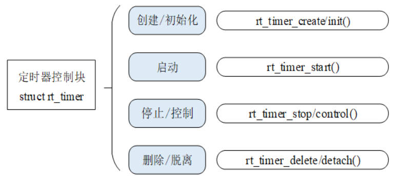
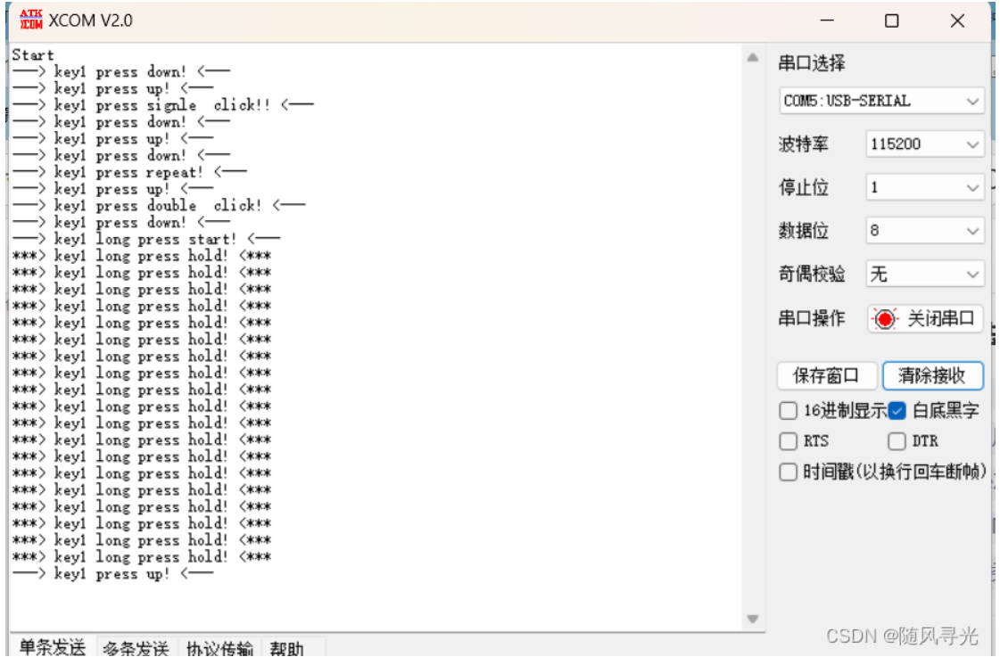

## 极海APM32F411V Tiny开发板评测04 RT-Thread定时器与MultiButton按键检测

### 1.软硬件平台

1. 试验平台：APM32F411V Tiny开发板
2. 软件：MDK-ARM Keil、AC5编译
3. RTOS：RT_Thread nano
4. 参考与引用资料：
   MultiButton开源框架仓库：https://github.com/0x1abin/MultiButton
   RT_Thread文档中心时钟管理：
   https://www.rt-thread.org/document/site/#/rt-thread-version/rt-thread-standard/programming-manual/timer/timer?id=%e5%ae%9a%e6%97%b6%e5%99%a8%e5%ba%94%e7%94%a8%e7%a4%ba%e4%be%8b

### 定时器管理

定时器，是指从指定的时刻开始，经过一定的指定时间后触发一个事件，例如定个时间提醒第二天能够按时起床。定时器有硬件定时器和软件定时器之分：

1）**硬件定时器**是芯片本身提供的定时功能。一般是由外部晶振提供给芯片输入时钟，芯片向软件模块提供一组配置寄存器，接受控制输入，到达设定时间值后芯片中断控制器产生时钟中断。硬件定时器的精度一般很高，可以达到纳秒级别，并且是中断触发方式。

2）**软件定时器**是由操作系统提供的一类系统接口，它构建在硬件定时器基础之上，使系统能够提供不受数目限制的定时器服务。

RT-Thread 操作系统提供软件实现的定时器，以时钟节拍（OS Tick）的时间长度为单位，即定时数值必须是 OS Tick 的整数倍，例如一个 OS Tick 是 10ms，那么上层软件定时器只能是 10ms，20ms，100ms 等，而不能定时为 15ms。RT-Thread 的定时器也基于系统的节拍，提供了基于节拍整数倍的定时能力。

### RT-Thread 定时器

RT-Thread 的定时器提供两类定时器机制：第一类是单次触发定时器，这类定时器在启动后只会触发一次定时器事件，然后定时器自动停止。第二类是周期触发定时器，这类定时器会周期性的触发定时器事件，直到用户手动的停止，否则将永远持续执行下去。

另外，根据超时函数执行时所处的上下文环境，RT-Thread 的定时器可以分为 HARD_TIMER 模式与 SOFT_TIMER 模式，如下图。



#### [HARD_TIMER 模式](https://www.rt-thread.org/document/site/#/rt-thread-version/rt-thread-standard/programming-manual/timer/timer?id=hard_timer-模式)

HARD_TIMER 模式的定时器超时函数在中断上下文环境中执行，可以在初始化 / 创建定时器时使用参数 RT_TIMER_FLAG_HARD_TIMER 来指定。

在中断上下文环境中执行时，对于超时函数的要求与中断服务例程的要求相同：执行时间应该尽量短，执行时不应导致当前上下文挂起、等待。例如在中断上下文中执行的超时函数它不应该试图去申请动态内存、释放动态内存等。

RT-Thread 定时器默认的方式是 HARD_TIMER 模式，即定时器超时后，超时函数是在系统时钟中断的上下文环境中运行的。在中断上下文中的执行方式决定了定时器的超时函数不应该调用任何会让当前上下文挂起的系统函数；也不能够执行非常长的时间，否则会导致其他中断的响应时间加长或抢占了其他线程执行的时间。

#### [SOFT_TIMER 模式](https://www.rt-thread.org/document/site/#/rt-thread-version/rt-thread-standard/programming-manual/timer/timer?id=soft_timer-模式)

SOFT_TIMER 模式可配置，通过宏定义 RT_USING_TIMER_SOFT 来决定是否启用该模式。该模式被启用后，系统会在初始化时创建一个 timer 线程，然后 SOFT_TIMER 模式的定时器超时函数在都会在 timer 线程的上下文环境中执行。可以在初始化 / 创建定时器时使用参数 RT_TIMER_FLAG_SOFT_TIMER 来指定设置 SOFT_TIMER 模式。

前面介绍了 RT-Thread 定时器并对定时器的工作机制进行了概念上的讲解，本节将深入到定时器的各个接口，帮助读者在代码层次上理解 RT-Thread 定时器。

在系统启动时需要初始化定时器管理系统。可以通过下面的函数接口完成：

```c
void rt_system_timer_init(void);
```

如果需要使用 SOFT_TIMER，则系统初始化时，应该调用下面这个函数接口：

```c
void rt_system_timer_thread_init(void);
```

定时器控制块中含有定时器相关的重要参数，在定时器各种状态间起到纽带的作用。定时器的相关操作如下图所示，对定时器的操作包含：创建 / 初始化定时器、启动定时器、运行定时器、删除 / 脱离定时器，所有定时器在定时超时后都会从定时器链表中被移除，而周期性定时器会在它再次启动时被加入定时器链表，这与定时器参数设置相关。在每次的操作系统时钟中断发生时，都会对已经超时的定时器状态参数做改变。



### MultiButton按键检测

### 一、简介
MultiButton 是一个小巧简单易用的事件驱动型按键驱动模块，可无限量扩展按键，按键事件的回调异步处理方式可以简化你的程序结构，去除冗余的按键处理硬编码，让你的按键业务逻辑更清晰。


### 二、使用步骤
1.先申请一个按键结构。
2.初始化按键对象，绑定按键的GPIO电平读取接口read_button_pin() ，后一个参数设置有效触发电平。
3.定义与注册按键事件。
4.启动按键。
5.设置一个5ms间隔的定时器循环调用后台处理函数。

### 三、代码示例

主函数部分：

```c
#include "main.h"
#include <stdio.h>

static rt_thread_t led1_thread = RT_NULL;
static void led1_thread_entry(void* parameter);

static void led1_thread_entry(void* parameter)
{
    while (1)
    {
        APM_LEDToggle(LED3);
        rt_thread_delay(1000);
        APM_LEDToggle(LED2);
    }
}
static struct rt_timer key_time;
static void Key_thread_Callback(void* parameter)
{
		button_ticks();

}


//按键的结构变量定义与使用  定义两个2个按键
enum Button_IDs {
  btn1_id=1,
  btn2_id=2,
};
struct Button btn1;
struct Button btn2;
uint8_t read_button_GPIO(uint8_t button_id)
{
  // you can share the GPIO read function with multiple Buttons
  switch(button_id)
  {
    case btn1_id:
      return GPIO_ReadInputBit(GPIOA, GPIO_PIN_0);
    case btn2_id:
      return GPIO_ReadInputBit(GPIOA, GPIO_PIN_1);
    default:
      return 0;
  }
}
void BTN1_PRESS_DOWN_Handler(void* btn)
{
     printf("---> key1 press down! <---\r\n");
}
void BTN1_PRESS_UP_Handler(void* btn)
{
     printf("---> key1 press up! <---\r\n");
}
void BTN1_PRESS_REPEAT_Handler(void* btn)
{
     printf("---> key1 press repeat! <---\r\n");
}
void BTN1_SINGLE_Click_Handler(void* btn)
{
    printf("---> key1 press signle  click!! <---\r\n");
}
void BTN1_DOUBLE_Click_Handler(void* btn)
{
    printf("---> key1 press double  click! <---\r\n");
}
void BTN1_LONG_PRESS_START_Handler(void* btn)
{
    printf("---> key1 long press start! <---\r\n");
}
void BTN1_LONG_PRESS_HOLD_Handler(void* btn)
{
    printf("***> key1 long press hold! <***\r\n");
}
void BTN2_PRESS_DOWN_Handler(void* btn)
{
		printf("---> key2 press down! <---\r\n");
}
void BTN2_PRESS_UP_Handler(void* btn)
{
    printf("---> key2 press up! <---\r\n");
}
void BTN2_PRESS_REPEAT_Handler(void* btn)
{
    printf("---> key2 press repeat! <---\r\n");
}
void BTN2_SINGLE_Click_Handler(void* btn)
{
    printf("---> key2 press signle  click!! <---\r\n");
}
void BTN2_DOUBLE_Click_Handler(void* btn)
{
    printf("---> key2 press double  click! <---\r\n");
}
void BTN2_LONG_PRESS_START_Handler(void* btn)
{
    printf("---> key2 long press start! <---\r\n");
}
void BTN2_LONG_PRESS_HOLD_Handler(void* btn)
{
    printf("***> key2 long press hold! <***\r\n");
}

int main()
{
	APM_LEDInit(LED2);
	APM_LEDInit(LED3);
	APM_PBInit(BUTTON_KEY1,BUTTON_MODE_EINT);
	APM_PBInit(BUTTON_KEY2,BUTTON_MODE_EINT);
//	APM_Timer1_Init(1000-1,84-1);/*定时器时钟84M，分频系数84，所以84M/84=100kHZ，计数1000次为1ms*/
//	APM_Timer2_Init(1000-1,84-1);
	USART1_Init();
	
	printf("Start\r\n");
	
 	/* button_init */
	//初始化按键对象
	button_init(&btn1, read_button_GPIO,0, btn1_id);
	button_init(&btn2, read_button_GPIO,0, btn2_id); 
  //注册按钮事件回调函数
  /* button_attach */ 
	button_attach(&btn1, PRESS_DOWN,       BTN1_PRESS_DOWN_Handler);
	button_attach(&btn1, PRESS_UP,         BTN1_PRESS_UP_Handler);
	button_attach(&btn1, PRESS_REPEAT,     BTN1_PRESS_REPEAT_Handler);
	button_attach(&btn1, SINGLE_CLICK,     BTN1_SINGLE_Click_Handler);
	button_attach(&btn1, DOUBLE_CLICK,     BTN1_DOUBLE_Click_Handler);
	button_attach(&btn1, LONG_PRESS_START, BTN1_LONG_PRESS_START_Handler);
	button_attach(&btn1, LONG_PRESS_HOLD,  BTN1_LONG_PRESS_HOLD_Handler);
 
	button_attach(&btn2, PRESS_DOWN,       BTN2_PRESS_DOWN_Handler);
	button_attach(&btn2, PRESS_UP,         BTN2_PRESS_UP_Handler);
	button_attach(&btn2, PRESS_REPEAT,     BTN2_PRESS_REPEAT_Handler);
	button_attach(&btn2, SINGLE_CLICK,     BTN2_SINGLE_Click_Handler);
	button_attach(&btn2, DOUBLE_CLICK,     BTN2_DOUBLE_Click_Handler);
	button_attach(&btn2, LONG_PRESS_START, BTN2_LONG_PRESS_START_Handler);
	button_attach(&btn2, LONG_PRESS_HOLD,  BTN2_LONG_PRESS_HOLD_Handler);
 /* button_start */ 
	button_start(&btn1);
	button_start(&btn2);

    led1_thread = rt_thread_create("led1",
                                   led1_thread_entry,
                                   RT_NULL,
                                   512,
                                   3,
                                   20);
    rt_thread_startup(led1_thread);

	 
	rt_timer_init(&key_time, "key_time",   /* 定时器名字是 key_time */
                    Key_thread_Callback, /* 超时时回调的处理函数 */
                      RT_NULL, /* 超时函数的入口参数 */
                      5, /* 定时长度为5个 OS Tick */
                    RT_TIMER_FLAG_PERIODIC); /* 周期定时器 */
    rt_thread_startup(led1_thread);
	rt_timer_start(&key_time);
}

```


