## 06-航芯ACM32G103开发板评测  1.28圆形屏幕 LVGL移植

### 参考移植教程

http://bbs.eeworld.com.cn/thread-1270136-1-1.html

### 软硬件平台

1. 航芯ACM32G103开发板
2. 1.28寸圆形彩色TFT显示屏高清IPS 模块240X240 SPI接口 GC9A01驱动芯片
3. LVGL V8.3.1源码

### LVGL

LVGL（Light and Versatile Graphics Library）是一个免费的开源图形库，提供创建具有易 于使用的图形元素、漂亮的视觉效果和低内存占用的嵌入式 GUI。

LVGL 是一款具有丰富的部件，具备高级图形特性，支持多种输入设备， 多国语言和独立于硬件之外等免费的开源图形库。接下来我们来看一下 LVGL 图形用户库的主要特点：

强大的构建块：按钮、图表、列表、滑块、图像等部件。
具有高级图形属性：具有动画、抗锯齿、不透明度、平滑滚动的高级图形。
支持各种输入设备：如触摸、鼠标、键盘、编码器。
支持多语言：UTF-8 编码。
支持多显示器：它可以同时使用多个 TFT 或者单色显示器。
支持多种样式属性：它具有类 CSS 样式的完全可定制的图形元素。
独立于硬件之外：它与任何微控制器或显示器一起使用。
可扩展性：它能够以小内存运行(最低 64 kB 闪存，16 kB RAM 的 MCU)。
支持操作系统、外部存储器和 GPU(不是必需的)。
具有高级图形效果：可进行单帧缓冲区操作。
纯 C 编写： C 语言编写以获得最大的兼容性。

### 快速移植过程

1. 在已有的ACM32G103RCT6 TFT 裸机移植LVGL的工程模板上进行修改 添加LVGL源代码文件

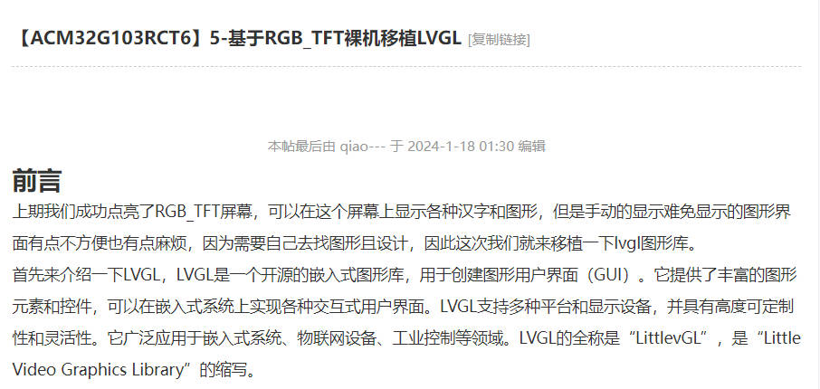

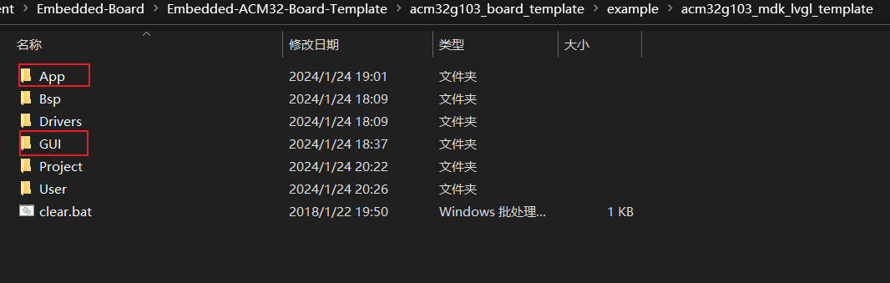

2.在已有的工程模板上，添加GC9A01驱动屏幕代码

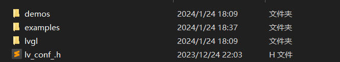

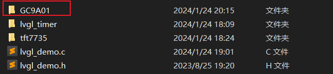

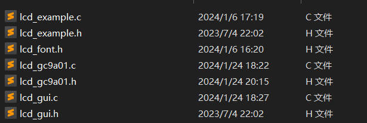

3.在KEIL添加相关源文件，添加相关路径，删除之前的屏幕驱动文件

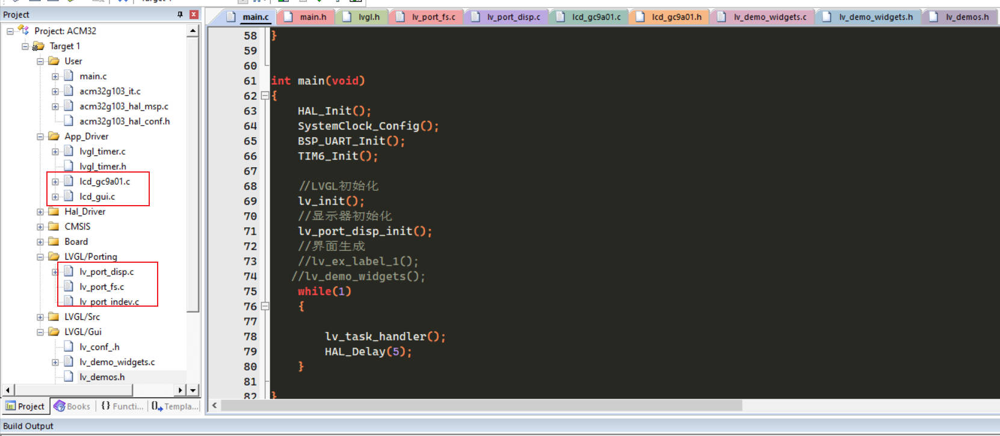

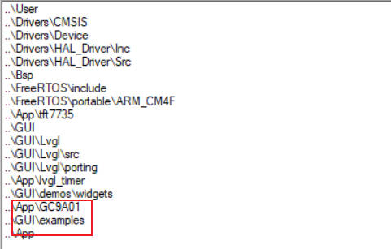


4.修改lv_port_disp屏幕显示接口文件

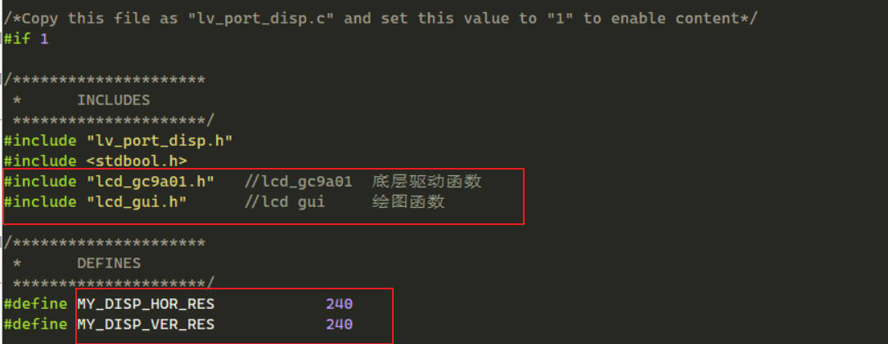

5.添加LCD屏幕初始化函数，绘图绘点函数

复制

```c
/**********************
 * STATIC FUNCTIONS
 **********************/

/*Initialize your display and the required peripherals.*/
static void disp_init(void)
{
  /*You code here*/
        LCD_Init();
        LCD_BLK_SET;//通过IO控制背光亮
}

volatile bool disp_flush_enabled = true;

/* Enable updating the screen (the flushing process) when disp_flush() is called by LVGL
 */
void disp_enable_update(void)
{
  disp_flush_enabled = true;
}

/* Disable updating the screen (the flushing process) when disp_flush() is called by LVGL
 */
void disp_disable_update(void)
{
  disp_flush_enabled = false;
}

/*Flush the content of the internal buffer the specific area on the display
 *You can use DMA or any hardware acceleration to do this operation in the background but
 *'lv_disp_flush_ready()' has to be called when finished.*/
static void disp_flush(lv_disp_drv_t * disp_drv, const lv_area_t * area, lv_color_t * color_p)
{
  if(disp_flush_enabled) {
  /*The most simple case (but also the slowest) to put all pixels to the screen one-by-one*/  
                uint16_t x,y;
  for(y = area->y1; y <= area->y2; y++) {
    for(x = area->x1; x <= area->x2; x++) {
      /*Put a pixel to the display. For example:*/
      /*put_px(x, y, *color_p)*/
                                GUI_DrawPoint(x,y,lv_color_to16(*color_p));
      color_p++;
    }
  }
  }
  /*IMPORTANT!!!
 *Inform the graphics library that you are ready with the flushing*/
  lv_disp_flush_ready(disp_drv);
}


```

基本上就完成了一个屏幕与LVGL的对接，当你换其他的屏幕是基本上也是这样子的操作，前提是屏幕驱动文件一定要适配成功。

### 案例测试

官方案例demo函数 添加官方demo代码，打开LV_USE_DEMO_WIDGETS宏定义

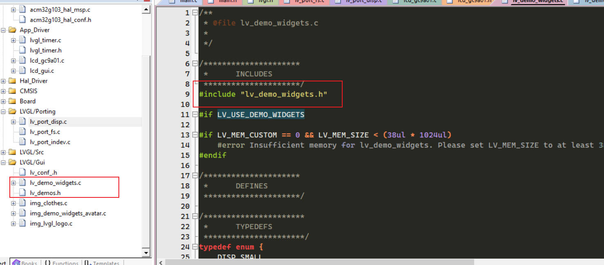

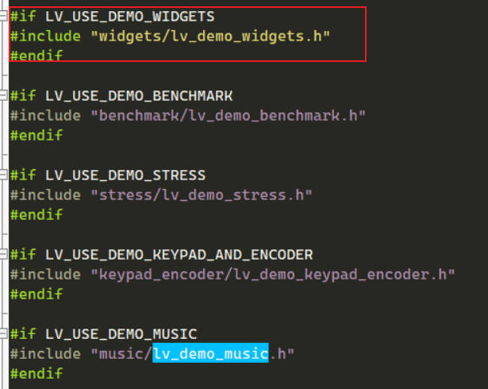

```c
#include "main.h"  

#include "lvgl_timer.h"
LoopFunction loopFunction[MAX_INIT_FUNCTIONS];
int loopFunctionCount = 0;

void callInitFunctions(void){
    uint8_t i ;
    for(i = 0 ; i<loopFunctionCount;i++){
        loopFunction<i>();
    }
}

/******************************************************************************
*@brief : main program
*@param : none
*@return: none
******************************************************************************/

#include "lvgl.h"
#include "lv_port_disp.h"
#include "lv_port_indev.h"
#include "lv_demo_widgets.h"
#include "lv_examples.h"


int main(void)
{
  HAL_Init();
  SystemClock_Config();
  BSP_UART_Init();
    TIM6_Init();

  //LVGL初始化
  lv_init();
  //显示器初始化
  lv_port_disp_init();
  //界面生成
 lv_demo_widgets();
  while(1)
  {

  lv_task_handler();
        HAL_Delay(5);
  }

}


```

编写自定义LVGL显示代码


```c
/******************************************************************************
*@file: main.c
*@brief : main program
******************************************************************************/
#include "main.h"  

#include "lvgl_timer.h"
LoopFunction loopFunction[MAX_INIT_FUNCTIONS];
int loopFunctionCount = 0;

void callInitFunctions(void){
    uint8_t i ;
    for(i = 0 ; i<loopFunctionCount;i++){
        loopFunction<i>();
    }
}

/******************************************************************************
*@brief : main program
*@param : none
*@return: none
******************************************************************************/

#include "lvgl.h"
#include "lv_port_disp.h"
#include "lv_port_indev.h"
#include "lv_demo_widgets.h"
#include "lv_examples.h"
static void lv_ex_label_1(void)
{
    /* Create a screen */
  lv_obj_t * scr = lv_obj_create(NULL);
  lv_scr_load(scr);
  lv_obj_set_style_bg_color(scr,lv_palette_main(LV_PALETTE_ORANGE),0);
  lv_obj_align(scr,LV_ALIGN_CENTER,0,0);

  /* Create a button */
  lv_obj_t * btn = lv_btn_create(scr);
  lv_obj_align(btn, NULL, LV_ALIGN_CENTER, 40);
  /* Create a label for the button */
  lv_obj_t * label = lv_label_create(btn);
  lv_label_set_text(label, "Hello EEWORLD !");    

        /* Create a button */
  lv_obj_t * btn1 = lv_btn_create(scr);
  lv_obj_align(btn1, NULL, LV_ALIGN_CENTER, 90);
  /* Create a label for the button */
  lv_obj_t * label1 = lv_label_create(btn1);
  lv_label_set_text(label1, "By End 2024.01.24!");    

        /* Create a button */
  lv_obj_t * btn2 = lv_btn_create(scr);
  lv_obj_align(btn2, NULL, LV_ALIGN_CENTER, 140);
  /* Create a label for the button */
  lv_obj_t * label2 = lv_label_create(btn2);
  lv_label_set_text(label2, "ACM32G103-Board Testing");    
}


int main(void)
{
  HAL_Init();
  SystemClock_Config();
  BSP_UART_Init();
    TIM6_Init();

  //LVGL初始化
  lv_init();
  //显示器初始化
  lv_port_disp_init();
  //界面生成
 lv_ex_label_1();

  while(1)
  {

  lv_task_handler();
        HAL_Delay(5);
  }

}

```

测试效果

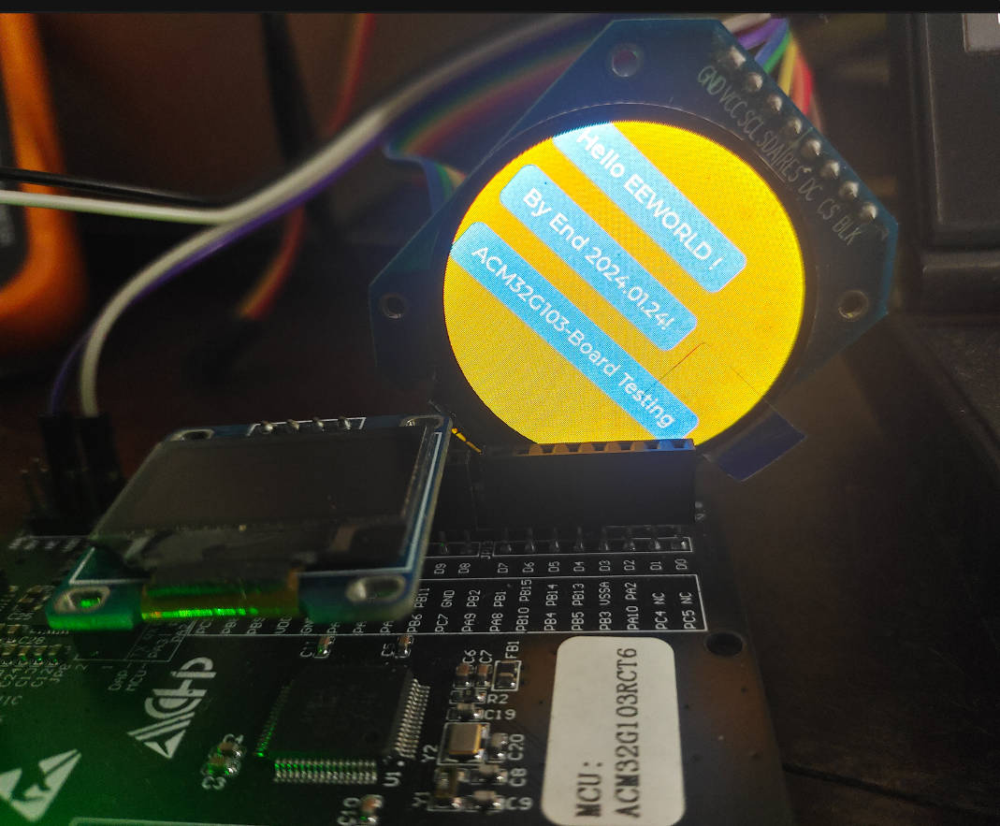

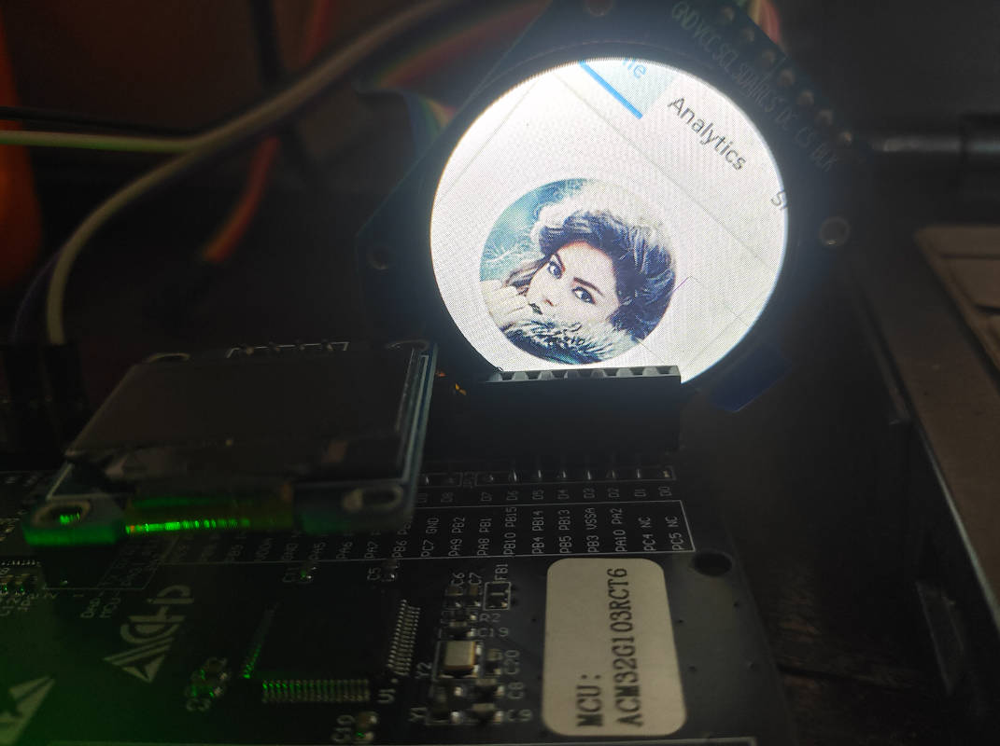