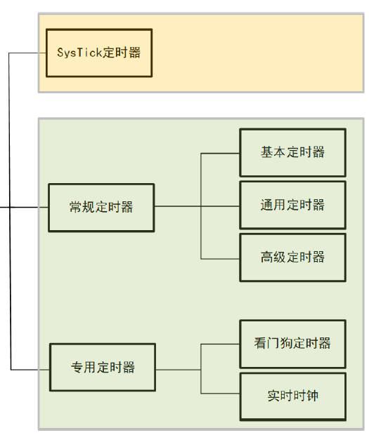
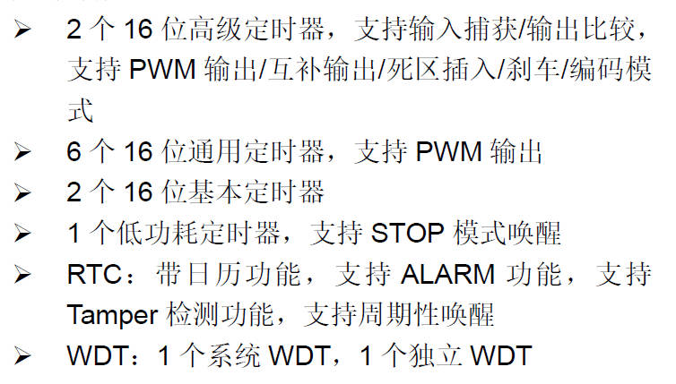
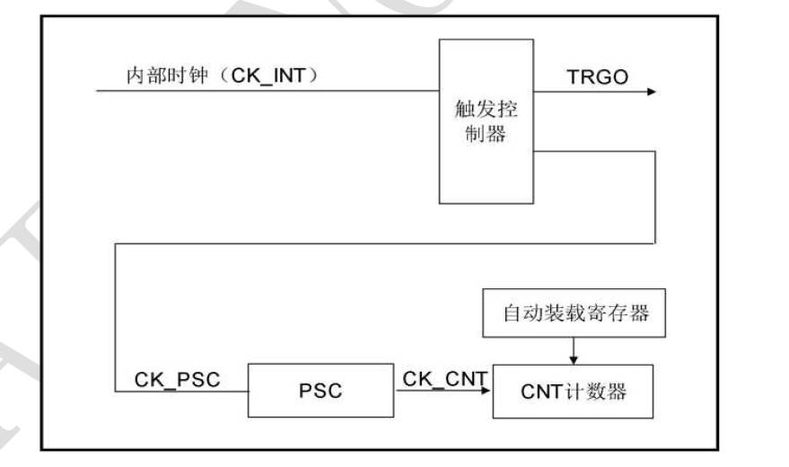
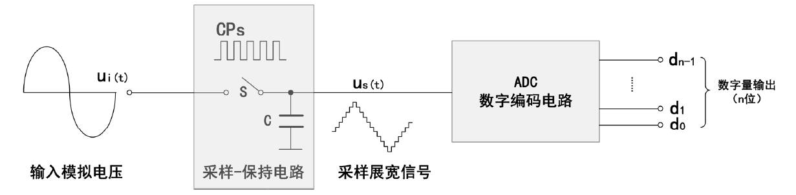
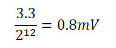
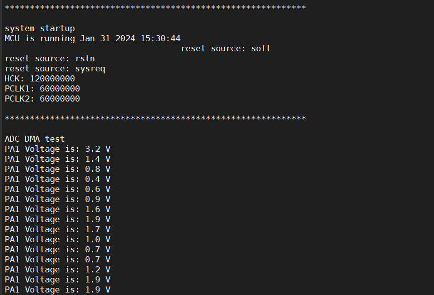
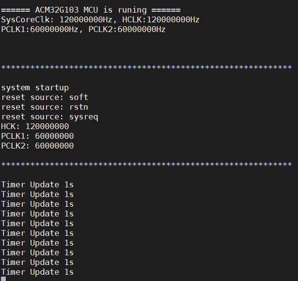

## 08-航芯ACM32G103开发板评测 ADC Timer芯片外设测试

### 1. 软硬件平台

1. ACM32G103 Board开发板
2. MDK-ARM Keil

### 2. 定时器Timer
在一般的MCU芯片中，定时器这个外设资源是非常重要的，一般可以分为SysTick定时器（系统滴答定时器）、常规定时器（基本定时器，通用定时器，高级定时器）、专用定时器（看门狗定时器，RTC）

在ACM32G103中有着丰富的定时器资源，还包括低功耗定时器lptimer,具体资源如下

基础定时器最简单，就只是普通的计数、定时功能。通用定时器在基础定时器的功能上，增加了输入捕获和输出比较等功能。高级定时器在通用定时器的功能上，造假了包含测量输入信号的脉冲宽度(输入捕获)，或者产生输出波形(输出比较、PWM、嵌入死区时间的互补PWM）的功能。
接下来进行基本的定时器定时功能测试。在官方给的SPL库里面只有两个例程，感觉有点少，与stm32相比较，许多的库函数没有完善。原本打算使用HC-SR04超声波模块进行定时器测试，但是发现有不少问题，而且定时精度比较高就放弃了，以后有时间再看看吧，或者看看其他人的东西。

基本定时器包含一个16 位自动装载计数器，由各自的可编程预分频器驱动。


```c
//嵌套向量中断控制器配置 
void NVIC_Configuration(void)
{
    NVIC_ClearPendingIRQ(TIM6_IRQn);   
    NVIC_EnableIRQ(TIM6_IRQn);   
} 
//时钟配置使能
void Clock_Configuration(void)
{
   __RCC_TIM6_CLK_ENABLE();   
}  
```
定时器配置函数
定时器的定时时间主要取决于预分频系数和定时周期。重要的参数Prescaler，Period
如果需要修改定时器定时时间，只需要修改
TIM_TimeBaseStructure.Period = (TIM_CLOCK_FREQ/1000)*500 - 1;  // 500ms 
修改为
TIM_TimeBaseStructure.Period = (TIM_CLOCK_FREQ/1000)*1000 - 1;  // 1000ms=1s 
```c
void TIM6_Init(void)  
{
    uint32_t timer_clock; 
    
    timer_clock = RCC_GetPCLK1Freq(); 
    
    if (RCC_GetHCLKFreq() != timer_clock)  // if hclk/pclk != 1, then timer clk = pclk * 2  
    {
       timer_clock =  timer_clock << 1;     
    }
    
	TIM_TimeBaseStructure.ClockDivision = TIM_CLOCKDIVISION_DIV1; 
	TIM_TimeBaseStructure.CounterMode = TIM_COUNTERMODE_UP; 
	TIM_TimeBaseStructure.RepetitionCounter = 0;  
	TIM_TimeBaseStructure.Prescaler = (timer_clock/TIM_CLOCK_FREQ) - 1;  
	TIM_TimeBaseStructure.Period = (TIM_CLOCK_FREQ/1000)*500 - 1;  // 500ms 
	    
	TIM_TimeBase_Init(TIM6, &TIM_TimeBaseStructure);           

    /* TIM IT enable */
    TIM_ITConfig(TIM6, TIM_IT_Update, ENABLE);  

    /* TIM6 enable counter */
    TIM_Cmd(TIM6, ENABLE);          
}
```

### 3.模数转换器ADC
#### 1. ADC简介
将模拟信号（连续信号）转换为数字信号（离散信号）的器件就叫模数转换器（ADC）。
按原理可分为：并行比较型A/D转换器(FLASH ADC)、逐次比较型A/D转换器(SAR ADC)和双积分式A/D转换器(Double Integral ADC)。
A/D转换过程通常为4步：采样、保持、量化和编码。如图所示。

ADC的主要有三个性能指标：分辨率、转换时间和转换精度。
##### 1.1 分辨率
分辨率：又称为转换精度，指ADC能分辨的最小电压，通常使用二进制有效位表示，反应了ADC对输入模拟量微小变化的分辨能力。当最大输入电压一定时，位数越多，量化单位越小，误差越小，分辨率越高。比如一个12位的ADC，参考电压为3.3V，则其能分辨的最小电压为：


##### 1.2 转换时间
转换时间：其倒数为转换速率，指ADC从控制信号到来开始，到输出端得到稳定的数字信号所经历的时间。转换时间通常与ADC类型有关，双积分型ADC的转换时间一般为几十毫秒，属于低速ADC；逐次逼近型ADC的转换时间一般为几十微妙，属于中速ADC；并联比较型ADC的转换时间一般为几十纳秒，属于高速ADC。
##### 1.3 转换精度
转换精度：指ADC输出的数字量所表示的模拟值与实际输入的模拟量之间的偏差，通常为1个或半个最小数字量的模拟变化量，表示为1LSB或1/2LSB。
#### 2.ACM32G103 ADC资源
ACM32G103芯片有2个12位逐次逼近型ADC。ADC1与ADC2紧密耦合，可在双重模式下运行（ADC1 为主器件，ADC2为从器件）。
 1. 12 位分辨率，可配置10 位、8 位或6 位分辨率
 2. 转换速率最高可达3Msps
 3. 20 个可用通道，包括外部信号源和内部信号源

#### 3. ADC初始化配置
首先需要定义需要使用的ADC 通道数量，以及具体的ADC 通道号。确定需要使用到的工作模式（独立模式、双ADC 模式、单端、差分或者是否支持DMA 等），设置ADC CLK，根据需求进行初始化配置。
ADC采集方式有下面四种：轮询方式，中断方式，外部触发方式，DMA 方式。
以DMA为案例进行处理。
ADC_DMA驱动函数
```c
void ADC_DMA_Drive_Iint(void)
{
    ADC_GPIO_Config();//ADC_GPIO端口引脚初始化配置
    
    ADC_Common_Register_Config();//ADC通用寄存器配置
    
    ADC_Config();//ADC工作模式配置
    
    ADC_DMA_Config();//ADC_DMA请求配置
    
    ADC_RegularStart();//使能ADC，开始常规通道的转换
}
```
ADC_GPIO端口引脚初始化配置
```c
void ADC_GPIO_Config(void)
{
    GPIO_InitTypeDef GPIO_InitStruct;
    
    __RCC_GPIOC_CLK_ENABLE();
    
    /* Configure ADC Channel_13 pin as analog input */
    GPIO_InitStruct.Pin       = GPIO_PIN_3;
    GPIO_InitStruct.Mode      = GPIO_MODE_ANALOG;
    GPIO_InitStruct.Pull      = GPIO_NOPULL;
    GPIO_Init(GPIOC, &GPIO_InitStruct); 
}
```
ADC通用寄存器配置
```c
void ADC_Common_Register_Config(void)
{
    ADC_CommonInitTypeDef ADC_CommonInitStructure;

    ADC_CommonInitStructure.ADC_Mode = ADC_MODE_INDEPENDENT;//双ADC模式选择
    ADC_CommonInitStructure.ADC_Prescaler = ADC_CLOCK_DIV4;//ADC_CLK分频选择
    ADC_CommonInitStructure.ADC_DMAAccessMode = ADC_DMAACCESSMODE_DISABLED;//双ADC下DMA功能选择
    ADC_CommonInitStructure.ADC_TwoSamplingDelay = ADC_TWOSAMPLINGDELAY_5CYCLES;//2个采样阶段之间的延迟
    ADC_CommonInit(&ADC_CommonInitStructure);
}
```
ADC工作模式配置
```c
void ADC_Config(void)
{
    ADC_InitTypeDef ADC_InitStructure;
    
    ADC_InitStructure.ADC_Resolution = ADC_RESOLUTION_12B;//分辨率
    ADC_InitStructure.ADC_ContinuousConvMode = ADC_CONT_DISABLE;//连续转换模式
    ADC_InitStructure.ADC_ExternalTrigConvEdge = ADC_EXTERNALTRIGCONVEDGE_NONE;//外部触发边沿选择
    ADC_InitStructure.ADC_ExternalTrigConv = ADC_EXTERNAL_TIG0;//触发模式
    ADC_InitStructure.ADC_DataAlign = ADC_DATAALIGN_RIGHT;//数据对齐
    ADC_InitStructure.ADC_NbrOfConversion = ADC_NUM;//规则通道序列长度 传输的数据长度为：每个通道采集30次 * 1个通道
    ADC_Init(ADCX, &ADC_InitStructure);
    
    //规则通道设置
    ADC_RegularChannelConfig(ADCX, ADC_CHANNEL_13, ADC_SEQUENCE_SQ1, ADC_SMP_CLOCK_320);
}
```
ADC_DMA请求配置
```c
void ADC_DMA_Config(void)
{
    __RCC_DMA1_CLK_ENABLE();
    
    DMA_BigEndianConfig(DMA1, DISABLE);
    
    DMA_DeInit(DMA1_Channel3);
    
    DMA_InitStruct.Mode = DMA_MODE_CIRCULAR;    
    DMA_InitStruct.DataFlow = DMA_DATAFLOW_P2M;
    DMA_InitStruct.ReqID = DMA1_REQ0_ADC1;
    DMA_InitStruct.RawInt = DMA_RAWINT_ENABLE;
    DMA_InitStruct.SrcInc = DMA_SRCINC_DISABLE;
    DMA_InitStruct.DestInc = DMA_DESTINC_ENABLE;
    DMA_InitStruct.SrcWidth = DMA_SRCWIDTH_WORD;   
    DMA_InitStruct.DestWidth = DMA_DESTWIDTH_WORD;
    DMA_InitStruct.SrcBurst = DMA_SRCBURST_1;
    DMA_InitStruct.DestBurst = DMA_DESTBURST_1;

    DMA_InitStruct.SrcAddr     = (uint32_t)&ADC1->DR;
    DMA_InitStruct.DestAddr    = (uint32_t)gadcBuffer;
    DMA_InitStruct.Size        = 1;    

    DMA_Init(DMA1_Channel3, &DMA_InitStruct);
    
    // Enable interrupt
    DMA_ClearFlag(DMA1_Channel3, DMA_FLAG_RTC);
    DMA_ITConfig(DMA1_Channel3, DMA_IT_TC, ENABLE);
    
    // Enable NVIC IRQ
    NVIC_ClearPendingIRQ(DMA1_IRQn);
    NVIC_SetPriority(DMA1_IRQn, 0x00);
    NVIC_EnableIRQ(DMA1_IRQn); 
    
    DMA_Cmd(DMA1_Channel3, ENABLE); 
}
```
使能ADC，开始常规通道的转换
```c
void ADC_RegularStart(void)
{
    /* Enable ADC DMA mode */
    ADC_DMACmd(ADCX, ENABLE);
    
    /* Enable the ADC peripheral */
    ADC_Cmd(ADCX, ENABLE);

    /* Clear the SR register */
    ADC_ClearFlag(ADCX, ADC_IT_FLAG_ALL);      

    /* Start conversion */
    ADC_SoftwareStartConv(ADCX);

}
```
中断服务函数
```c
void DMA1_IRQHandler(void)
{
    ADC_DMA_ITC_Callback();
}
void ADC_DMA_ITC_Callback(void)
{ 
    /* Transfer complete interrupt */
    if (SET == DMA_GetFlagStatus(DMA1_Channel3, DMA_FLAG_TC))
    {
        gadc1ItcConunt = 1;
        DMA_ClearFlag(DMA1_Channel3, DMA_FLAG_TC);
    }     
}

```
### 4.测试
1. Timer测试函数

```c
#define TIM_CLOCK_FREQ            (10000)  

TIM_Base_InitTypeDef TIM_TimeBaseStructure;    

volatile uint32_t Timer_Update_Flag;    

void Clock_Configuration(void);
void GPIO_Configuration(void);
void NVIC_Configuration(void);   

void NVIC_Configuration(void)
{
    NVIC_ClearPendingIRQ(TIM6_IRQn);   
    NVIC_EnableIRQ(TIM6_IRQn);   
} 

void Clock_Configuration(void)
{
   __RCC_TIM6_CLK_ENABLE();   
}  

void GPIO_Configuration(void)  
{
    // do nothing here 
}

/************************************************************************
 * function   : TIM6_Update_IRQ
 * Description: TIM6 user Interrupt Handler 
 ************************************************************************/ 
void TIM6_Update_IRQ(void)
{
	if (TIM6->SR & TIMER_SR_UIF)  
	{
		Timer_Update_Flag = 1;  
	}
	
}


void TIM6_Init(void)  
{
    uint32_t timer_clock; 
    
    timer_clock = RCC_GetPCLK1Freq(); 
    
    if (RCC_GetHCLKFreq() != timer_clock)  // if hclk/pclk != 1, then timer clk = pclk * 2  
    {
       timer_clock =  timer_clock << 1;     
    }
    
	TIM_TimeBaseStructure.ClockDivision = TIM_CLOCKDIVISION_DIV1; 
	TIM_TimeBaseStructure.CounterMode = TIM_COUNTERMODE_UP; 
	TIM_TimeBaseStructure.RepetitionCounter = 0;  
	TIM_TimeBaseStructure.Prescaler = (timer_clock/TIM_CLOCK_FREQ) - 1;  
	TIM_TimeBaseStructure.Period = (TIM_CLOCK_FREQ/1000)*500 - 1;  // 500ms 
	    
	TIM_TimeBase_Init(TIM6, &TIM_TimeBaseStructure);           

    /* TIM IT enable */
    TIM_ITConfig(TIM6, TIM_IT_Update, ENABLE);  

    /* TIM6 enable counter */
    TIM_Cmd(TIM6, ENABLE);          
}

void Timer_Update_Test(void)
{
    /* Module Clocks Configuration */
    Clock_Configuration();

    /* NVIC Configuration */   
    NVIC_Configuration();
    
	Timer_Update_Flag = 0;   
	TIM6_Init(); 
    
	while(1)
	{
		if(Timer_Update_Flag) 
		{
			printfS("Timer Update Occurs\n"); 
			Timer_Update_Flag = 0;   
		}
	}
}
```
2. ADC_DMA测试函数

```c
//采样通道数 
#define ADC_NUM    (1)

uint32_t gadcBuffer[ADC_NUM]; 
static volatile uint32_t gadc1ItcConunt = 0;                 

#define ADCX    (ADC1)

DMA_InitTypeDef DMA_InitStruct;//需配置为全局变量，不然DMA只会触发一次


/******************************************************************************
* @brief : DMA adc to memory transfer complete interrupt Callback.
* @param : None
* @return: None
******************************************************************************/ 
void ADC_DMA_ITC_Callback(void)
{ 
    /* Transfer complete interrupt */
    if (SET == DMA_GetFlagStatus(DMA1_Channel3, DMA_FLAG_TC))
    {
        gadc1ItcConunt = 1;
        DMA_ClearFlag(DMA1_Channel3, DMA_FLAG_TC);
    }     
}


/******************************************************************************
* @brief : ADC GPIO config.
* @param : None
* @return: None
******************************************************************************/
void ADC_GPIO_Config(void)
{
    GPIO_InitTypeDef GPIO_InitStruct;
    
    __RCC_GPIOC_CLK_ENABLE();
    
    /* Configure ADC Channel_13 pin as analog input */
    GPIO_InitStruct.Pin       = GPIO_PIN_3;
    GPIO_InitStruct.Mode      = GPIO_MODE_ANALOG;
    GPIO_InitStruct.Pull      = GPIO_NOPULL;
    GPIO_Init(GPIOC, &GPIO_InitStruct); 
}

/******************************************************************************
* @brief : ADC Common register config.
* @param : None
* @return: None
******************************************************************************/
void ADC_Common_Register_Config(void)
{
    ADC_CommonInitTypeDef ADC_CommonInitStructure;

    ADC_CommonInitStructure.ADC_Mode = ADC_MODE_INDEPENDENT;//双ADC模式选择
    ADC_CommonInitStructure.ADC_Prescaler = ADC_CLOCK_DIV4;//ADC_CLK分频选择
    ADC_CommonInitStructure.ADC_DMAAccessMode = ADC_DMAACCESSMODE_DISABLED;//双ADC下DMA功能选择
    ADC_CommonInitStructure.ADC_TwoSamplingDelay = ADC_TWOSAMPLINGDELAY_5CYCLES;//2个采样阶段之间的延迟
    ADC_CommonInit(&ADC_CommonInitStructure);
}

/******************************************************************************
* @brief : ADC config.
* @param : None
* @return: None
******************************************************************************/
void ADC_Config(void)
{
    ADC_InitTypeDef ADC_InitStructure;
    
    ADC_InitStructure.ADC_Resolution = ADC_RESOLUTION_12B;//分辨率
    ADC_InitStructure.ADC_ContinuousConvMode = ADC_CONT_DISABLE;//连续转换模式
    ADC_InitStructure.ADC_ExternalTrigConvEdge = ADC_EXTERNALTRIGCONVEDGE_NONE;//外部触发边沿选择
    ADC_InitStructure.ADC_ExternalTrigConv = ADC_EXTERNAL_TIG0;//触发模式
    ADC_InitStructure.ADC_DataAlign = ADC_DATAALIGN_RIGHT;//数据对齐
    ADC_InitStructure.ADC_NbrOfConversion = ADC_NUM;//规则通道序列长度 传输的数据长度为：每个通道采集30次 * 1个通道
    ADC_Init(ADCX, &ADC_InitStructure);
    
    //规则通道设置
    ADC_RegularChannelConfig(ADCX, ADC_CHANNEL_13, ADC_SEQUENCE_SQ1, ADC_SMP_CLOCK_320);
}

/******************************************************************************
* @brief : ADC DMA config.
* @param : None
* @return: None
******************************************************************************/
void ADC_DMA_Config(void)
{
    __RCC_DMA1_CLK_ENABLE();
    
    DMA_BigEndianConfig(DMA1, DISABLE);
    
    DMA_DeInit(DMA1_Channel3);
    
    DMA_InitStruct.Mode = DMA_MODE_CIRCULAR;    
    DMA_InitStruct.DataFlow = DMA_DATAFLOW_P2M;
    DMA_InitStruct.ReqID = DMA1_REQ0_ADC1;
    DMA_InitStruct.RawInt = DMA_RAWINT_ENABLE;
    DMA_InitStruct.SrcInc = DMA_SRCINC_DISABLE;
    DMA_InitStruct.DestInc = DMA_DESTINC_ENABLE;
    DMA_InitStruct.SrcWidth = DMA_SRCWIDTH_WORD;   
    DMA_InitStruct.DestWidth = DMA_DESTWIDTH_WORD;
    DMA_InitStruct.SrcBurst = DMA_SRCBURST_1;
    DMA_InitStruct.DestBurst = DMA_DESTBURST_1;

    DMA_InitStruct.SrcAddr     = (uint32_t)&ADC1->DR;
    DMA_InitStruct.DestAddr    = (uint32_t)gadcBuffer;
    DMA_InitStruct.Size        = 1;    

    DMA_Init(DMA1_Channel3, &DMA_InitStruct);
    
    // Enable interrupt
    DMA_ClearFlag(DMA1_Channel3, DMA_FLAG_RTC);
    DMA_ITConfig(DMA1_Channel3, DMA_IT_TC, ENABLE);
    
    // Enable NVIC IRQ
    NVIC_ClearPendingIRQ(DMA1_IRQn);
    NVIC_SetPriority(DMA1_IRQn, 0x00);
    NVIC_EnableIRQ(DMA1_IRQn); 
    
    DMA_Cmd(DMA1_Channel3, ENABLE); 
}


/******************************************************************************
* @brief:  Enable ADC, start conversion of regular channle 
* @param:  None 
* @return: None
******************************************************************************/
void ADC_RegularStart(void)
{
    /* Enable ADC DMA mode */
    ADC_DMACmd(ADCX, ENABLE);
    
    /* Enable the ADC peripheral */
    ADC_Cmd(ADCX, ENABLE);

    /* Clear the SR register */
    ADC_ClearFlag(ADCX, ADC_IT_FLAG_ALL);      

    /* Start conversion */
    ADC_SoftwareStartConv(ADCX);

}


void ADC_DMA_Drive_Iint(void)
{
    ADC_GPIO_Config();
    
    ADC_Common_Register_Config();
    
    ADC_Config();
    
    ADC_DMA_Config();
    
    ADC_RegularStart();
}

/******************************************************************************
* @brief : ADC function test.
* @param : None
* @return: None
******************************************************************************/
void APP_ADC_Test(void)
{
    uint32_t i;
    float vol=0.0;
    printfS("ADC DMA test \r\n");

    ADC_DMA_Drive_Iint();
    
    while(1)
    {
        ADC_SoftwareStartConv(ADCX);
        
        while(!gadc1ItcConunt);
        gadc1ItcConunt =0;
        for (i = 0; i < ADC_NUM; i++)
         {
        //  printfS("Channel_%d = %d\r\n", ((gadcBuffer[i] >> 16) & 0xFF), (gadcBuffer[i] & 0xFFF));
             
             vol = (gadcBuffer[i]&0xFFF)*3.3/4095;
					printf("PA1 Voltage is: %0.1f V \r\n", vol);
        }
         DelayMs(1000);
    }
}
```
3. 测试结果

  



