## 02-雅特力AT32A403开发板评测 CoreMark移植评测

###  1. 软硬件平台

1. AT32A403A Board开发板

2. MDK-ARM Keil

3. CoreMark源码

   

### 2. CoreMark

CoreMark是一款用于评估CPU性能的基准测试程序，它包含了多种不同的计算任务，包括浮点数、整数、缓存、内存等方面的测试。CoreMark的测试结果通常被用来作为CPU性能的参考，它可以帮助开发人员和系统管理员评估不同处理器和系统的性能，比较不同处理器之间的性能差异，也可以用来测试处理器在多线程并行计算方面的性能。

官方网站 https://www.eembc.org/

Github仓库地址 https://github.com/eembc/coremark

其中 simple为接口移植文件，比较重要，重要的修改在这里面，下面的core_main.c、core_matrix.c等文件是测试的重要文件

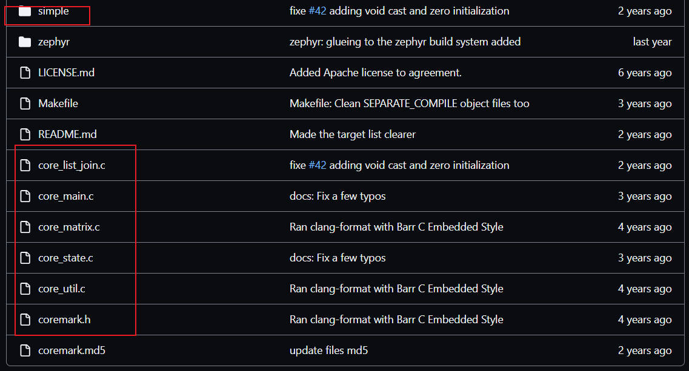

### 3. CoreMark移植

1. 在支持printf的工程上进行修改，搭建自己的工程模板，主要是修改路径，建立at32a403a_coremark_tempalte工程模板。

   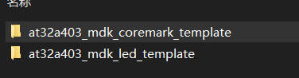

   1. Application 主函数，应用层代码
   2. BspDrivers 板级驱模块动文件
   3. Drivers 底层驱动库文件 Firmware Library
   4. Project 工程文件

   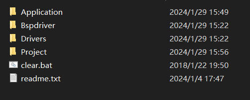

2. 添加CoreMark源代码，其中core_portme.c core_portme.h为需要修改的文件（sample文件）

   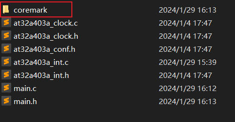

   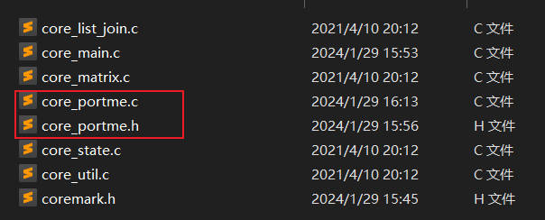

3. 打开工程，添加文件

   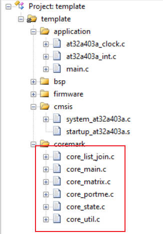

   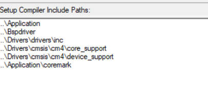

4. 修改core_portme.c文件的内容

   1. 修改部分宏定义

      其中ITERATIONS数值视情况而定。

      如果出现**ERROR! Must execute for at least 10 secs for a valid result!**,那么需要将此数值变大使程序运行时间至少在10秒以上。

      ```c
      #define SysTick_Counter_Disable ((uint32_t)0xFFFFFFFE)
      
      #define SysTick_Counter_Enable ((uint32_t)0x00000001)
      
      #define SysTick_Counter_Clear ((uint32_t)0x00000000)
      
      __IO uint32_t Ticks;
      
      #define ITERATIONS 5000;
      ```

   2. 屏蔽部分代码

      ```c
      //#define NSECS_PER_SEC              CLOCKS_PER_SEC
      //#define CORETIMETYPE               clock_t
      //#define GETMYTIME(_t)              (*_t = clock())
      //#define MYTIMEDIFF(fin, ini)       ((fin) - (ini))
      //#define TIMER_RES_DIVIDER          1
      //#define SAMPLE_TIME_IMPLEMENTATION 1
      //#define EE_TICKS_PER_SEC           (NSECS_PER_SEC / TIMER_RES_DIVIDER)
      
      /** Define Host specific (POSIX), or target specific global time variables. */
      //static CORETIMETYPE start_time_val, stop_time_val;//changed
      ```
      
   3. 添加start_time，stop_time，get_time函数主体，主要是用于时间的计时
   
      ```c
      __IO uint32_t Ticks;
      
      /* Function : start_time
              This function will be called right before starting the timed portion of
         the benchmark.
      
              Implementation may be capturing a system timer (as implemented in the
         example code) or zeroing some system parameters - e.g. setting the cpu clocks
         cycles to 0.
      */
      void start_time(void)//changed
      {
          //GETMYTIME(&start_time_val);
      	  Ticks++;
      	  SysTick_Config(SystemCoreClock / 1000);//1ms中断
      }
      /* Function : stop_time
              This function will be called right after ending the timed portion of the
         benchmark.
      
              Implementation may be capturing a system timer (as implemented in the
         example code) or other system parameters - e.g. reading the current value of
         cpu cycles counter.
      */
      void stop_time(void)//changed
      {
          //GETMYTIME(&stop_time_val);
      	/* Stop the Timer and get the encoding time */
      	 SysTick->CTRL &=SysTick_Counter_Disable;
      	 /* Clear the SysTick Counter */
      	 SysTick->VAL = SysTick_Counter_Clear;
      }
      /* Function : get_time
              Return an abstract "ticks" number that signifies time on the system.
      
              Actual value returned may be cpu cycles, milliseconds or any other
         value, as long as it can be converted to seconds by <time_in_secs>. This
         methodology is taken to accomodate any hardware or simulated platform. The
         sample implementation returns millisecs by default, and the resolution is
         controlled by <TIMER_RES_DIVIDER>
      */
      CORE_TICKS get_time(void)//changed
      {
          CORE_TICKS elapsed=(CORE_TICKS) Ticks;//(MYTIMEDIFF(stop_time_val, start_time_val));
          return elapsed;
      }
      
      ```
   
      需要在中断服务函数中添加下面代码
   
      ```c
      extern __IO uint32_t Ticks;
      void SysTick_Handler(void)
      {   
          Ticks++; 
      }
      ```
   
   4. 在portable_init函数中执行芯片初始化功能（如系统时钟，串口配置）
   
      ```c
      /* Function : portable_init
              Target specific initialization code
              Test for some common mistakes.
      */
      void portable_init(core_portable *p, int *argc, char *argv[])
      {
          
        system_clock_config();
        delay_init();
        uart_print_init(115200);
        printf("at32a403a_board hardware_init [ok] \r\n");
        printf("at_start_a403a board coremark testing 2024-1-29\r\n");
      	
          if (sizeof(ee_ptr_int) != sizeof(ee_u8 *))
          {
              ee_printf(
                  "ERROR! Please define ee_ptr_int to a type that holds a "
                  "pointer!\n");
          }
          if (sizeof(ee_u32) != 4)
          {
              ee_printf("ERROR! Please define ee_u32 to a 32b unsigned type!\n");
          }
          p->portable_id = 1;
      }
      ```
   
   5. 总体移植部分结束了，可能存在部分宏定义的修改，我也是参考别人的案例写的，可能会存在一些问题，需要自行判断
   
      core_portme.c完整代码如下：
   
      ```c
      /*
      Copyright 2018 Embedded Microprocessor Benchmark Consortium (EEMBC)
      
      Licensed under the Apache License, Version 2.0 (the "License");
      you may not use this file except in compliance with the License.
      You may obtain a copy of the License at
      
          http://www.apache.org/licenses/LICENSE-2.0
      
      Unless required by applicable law or agreed to in writing, software
      distributed under the License is distributed on an "AS IS" BASIS,
      WITHOUT WARRANTIES OR CONDITIONS OF ANY KIND, either express or implied.
      See the License for the specific language governing permissions and
      limitations under the License.
      
      Original Author: Shay Gal-on
      */
      
      #include <stdio.h>
      #include <stdlib.h>
      #include "coremark.h"
      #include "main.h"
      
      #define SysTick_Counter_Disable ((uint32_t)0xFFFFFFFE)//changed
      #define SysTick_Counter_Enable ((uint32_t)0x00000001)//changed
      #define SysTick_Counter_Clear ((uint32_t)0x00000000)//changed
      __IO uint32_t Ticks;//changed
      
      //define ITERATIONS
      #define ITERATIONS 5000;//changed
      
      
      #if VALIDATION_RUN
      volatile ee_s32 seed1_volatile = 0x3415;
      volatile ee_s32 seed2_volatile = 0x3415;
      volatile ee_s32 seed3_volatile = 0x66;
      #endif
      #if PERFORMANCE_RUN
      volatile ee_s32 seed1_volatile = 0x0;
      volatile ee_s32 seed2_volatile = 0x0;
      volatile ee_s32 seed3_volatile = 0x66;
      #endif
      #if PROFILE_RUN
      volatile ee_s32 seed1_volatile = 0x8;
      volatile ee_s32 seed2_volatile = 0x8;
      volatile ee_s32 seed3_volatile = 0x8;
      #endif
      volatile ee_s32 seed4_volatile = ITERATIONS;
      volatile ee_s32 seed5_volatile = 0;
      
      
      void assert_failed(uint8_t* file, uint32_t line)
      { 
        /* User can add his own implementation to report the file name and line number,
           ex: printf("Wrong parameters value: file %s on line %d\r\n", file, line) */
      
        /* Infinite loop */
        while (1)
        {}
      }
      
      
      
      
      /* Porting : Timing functions
              How to capture time and convert to seconds must be ported to whatever is
         supported by the platform. e.g. Read value from on board RTC, read value from
         cpu clock cycles performance counter etc. Sample implementation for standard
         time.h and windows.h definitions included.
      */
      /* Define : TIMER_RES_DIVIDER
              Divider to trade off timer resolution and total time that can be
         measured.
      
              Use lower values to increase resolution, but make sure that overflow
         does not occur. If there are issues with the return value overflowing,
         increase this value.
              */
      				//changed
      //#define NSECS_PER_SEC              CLOCKS_PER_SEC
      //#define CORETIMETYPE               clock_t
      //#define GETMYTIME(_t)              (*_t = clock())
      //#define MYTIMEDIFF(fin, ini)       ((fin) - (ini))
      //#define TIMER_RES_DIVIDER          1
      //#define SAMPLE_TIME_IMPLEMENTATION 1
      //#define EE_TICKS_PER_SEC           (NSECS_PER_SEC / TIMER_RES_DIVIDER)
      
      /** Define Host specific (POSIX), or target specific global time variables. */
      //static CORETIMETYPE start_time_val, stop_time_val;//changed
      #define EE_TICKS_PER_SEC 1000.0//changed
      /* Function : start_time
              This function will be called right before starting the timed portion of
         the benchmark.
      
              Implementation may be capturing a system timer (as implemented in the
         example code) or zeroing some system parameters - e.g. setting the cpu clocks
         cycles to 0.
      */
      void start_time(void)//changed
      {
          //GETMYTIME(&start_time_val);
      	  Ticks++;
      	  SysTick_Config(SystemCoreClock / 1000);//1ms中断
      }
      /* Function : stop_time
              This function will be called right after ending the timed portion of the
         benchmark.
      
              Implementation may be capturing a system timer (as implemented in the
         example code) or other system parameters - e.g. reading the current value of
         cpu cycles counter.
      */
      void stop_time(void)//changed
      {
          //GETMYTIME(&stop_time_val);
      	/* Stop the Timer and get the encoding time */
      	 SysTick->CTRL &=SysTick_Counter_Disable;
      	 /* Clear the SysTick Counter */
      	 SysTick->VAL = SysTick_Counter_Clear;
      }
      /* Function : get_time
              Return an abstract "ticks" number that signifies time on the system.
      
              Actual value returned may be cpu cycles, milliseconds or any other
         value, as long as it can be converted to seconds by <time_in_secs>. This
         methodology is taken to accomodate any hardware or simulated platform. The
         sample implementation returns millisecs by default, and the resolution is
         controlled by <TIMER_RES_DIVIDER>
      */
      CORE_TICKS get_time(void)//changed
      {
          CORE_TICKS elapsed=(CORE_TICKS) Ticks;//(MYTIMEDIFF(stop_time_val, start_time_val));
          return elapsed;
      }
      /* Function : time_in_secs
              Convert the value returned by get_time to seconds.
      
              The <secs_ret> type is used to accomodate systems with no support for
         floating point. Default implementation implemented by the EE_TICKS_PER_SEC
         macro above.
      */
      secs_ret
      time_in_secs(CORE_TICKS ticks)
      {
          secs_ret retval = ((secs_ret)ticks) / (secs_ret)EE_TICKS_PER_SEC;
          return retval;
      }
      
      ee_u32 default_num_contexts = 1;
      
      
      
      
      /* Function : portable_init
              Target specific initialization code
              Test for some common mistakes.
      */
      void portable_init(core_portable *p, int *argc, char *argv[])
      {
          
        system_clock_config();
        delay_init();
        uart_print_init(115200);
        printf("at32a403a_board hardware_init [ok] \r\n");
        printf("at_start_a403a board coremark testing 2024-1-29\r\n");
      	
          if (sizeof(ee_ptr_int) != sizeof(ee_u8 *))
          {
              ee_printf(
                  "ERROR! Please define ee_ptr_int to a type that holds a "
                  "pointer!\n");
          }
          if (sizeof(ee_u32) != 4)
          {
              ee_printf("ERROR! Please define ee_u32 to a 32b unsigned type!\n");
          }
          p->portable_id = 1;
      }
      /* Function : portable_fini
              Target specific final code
      */
      void
      portable_fini(core_portable *p)
      {
          p->portable_id = 0;
      }
      
      ```
   
   5. 由于原工程有main函数，core_main也有main函数，则需要注释吊main.c的函数。
   
      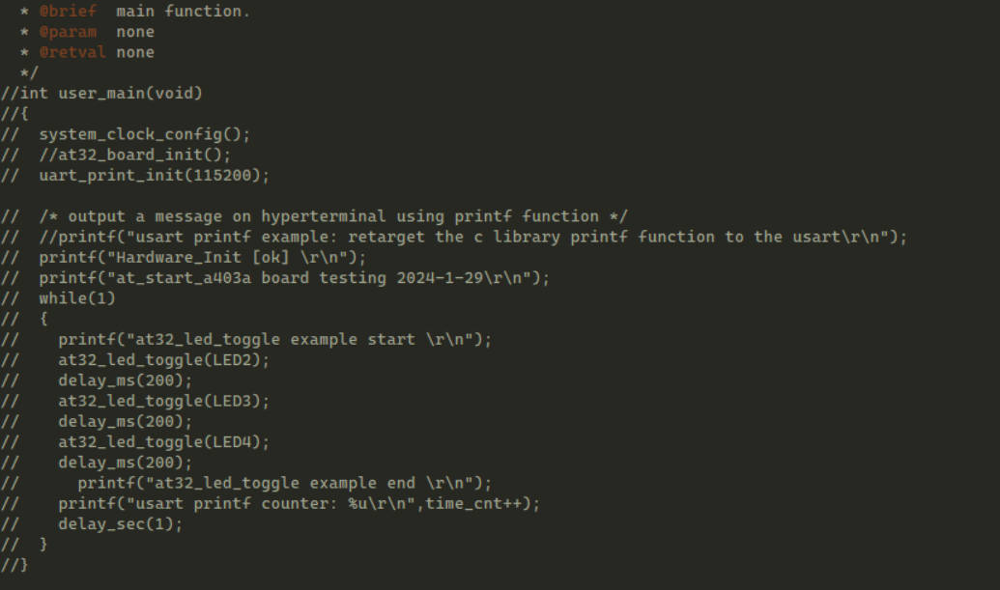
   
   6. 修改编译器版本和优化等级（与MDK工程设置保持一致）
   
      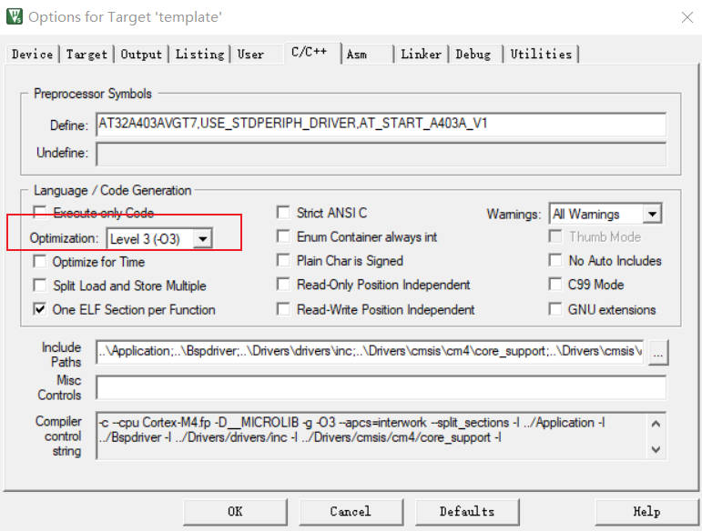
   
      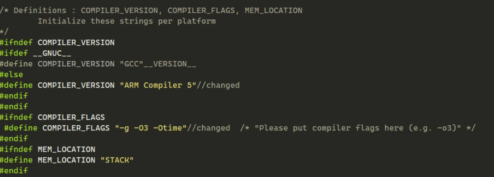
   
   7. 编译，下载程序，测试
   
      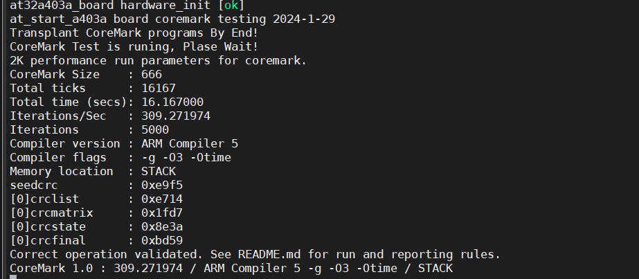
   
      