##  03-雅特力AT32A403开发板评测 官方图形化配置工具Work Bench使用

###  1. 软硬件平台

1. AT32A403A Board开发板

2. MDK-ARM Keil

3. Work Bench

   

### 2. AT32 Work Bench

为了方便开发者快速开发芯片，国外大厂的搞了单片机图形化配置工具，生成初始化配置代码，像使用范围比较多的有，意法半导体的STM32CubeMX,瑞萨电子的e2stuio开发工具FSP。这几年，国产MCU开发厂商也得到了快速发展，但是像图形化配置工具的还是比较少，我自己知道就雅特力的AT32 Work Bench和小华半导体的XHCode,还要一家8位MCU厂商，赛元电子。

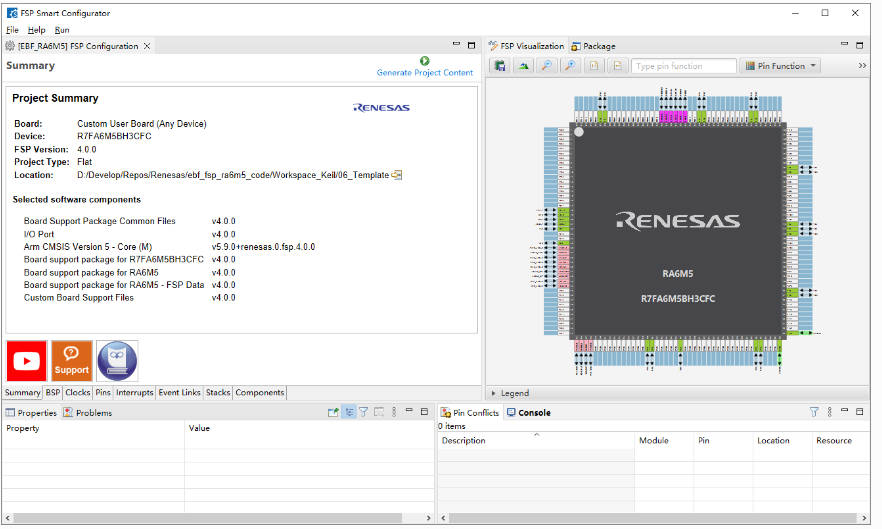

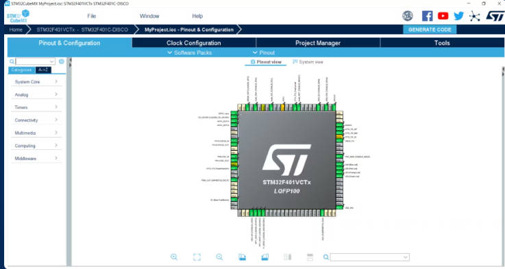

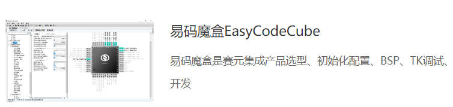

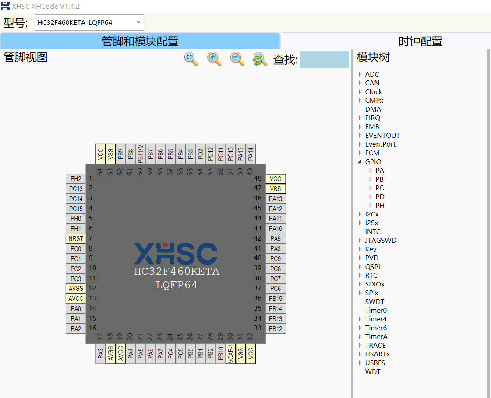

AT32 Work Bench 有以下主要特点：

1. 支持外设初始化配置 
2. 支持 PIN MUX 配置，并可自定义 PIN 脚标签 
3. 支持系统时钟自动化配置 
4. 支持在线代码预览，所见即所得
5.  支持 add user code 功能（客户已有代码不会被新生成工程覆盖） 
6. 支持 Keil、IAR、AT32 IDE 等常见 IDE 工程自动生成 
7.  支持最近编辑的设计记录 
8. 支持配置 PDF 报告的生成
9.  支持中英文切换 
10. 支持 Windows、Linux 等多平台 
11. 支持软件的在线升级，以及 MCU 固件的在线下载

下载地址 https://www.arterytek.com/cn/support/index.jsp?index=0


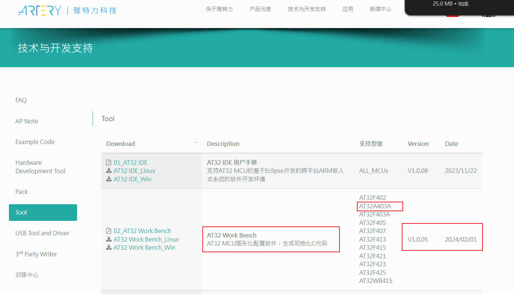

支持Windows,Linux系统开发，Windows系统免安装，直接打开使用。

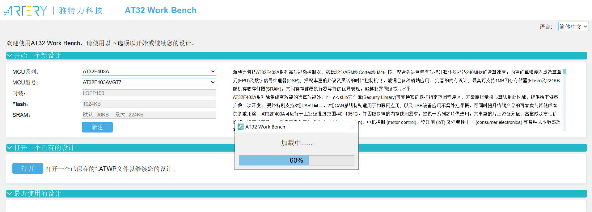

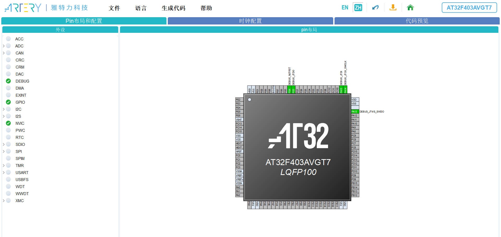

### 3. AT32 Work Bench创建工程测试

1. 打开AT32 Work Bench软件，选择开发芯片，简单配置芯片类型，创建配置工程。

   以AT32A403芯片作为测试案例，进行下面的全部操作。

   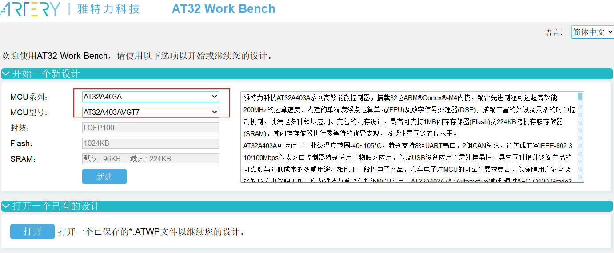

   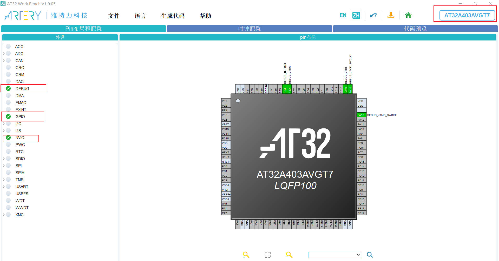

2. 配置板载LED，配置GPIO端口模式，输出模式 GPIO_Output。

   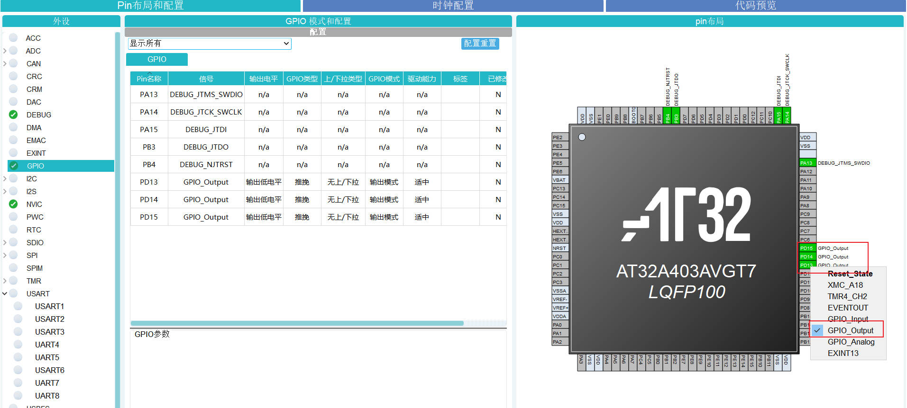

3. 串口打印配置，配置USART1 使用PA9,PA10

   选择异步模式，波特率等具体配置如下

   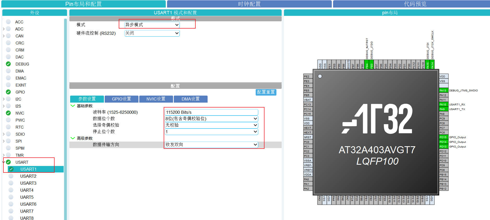

   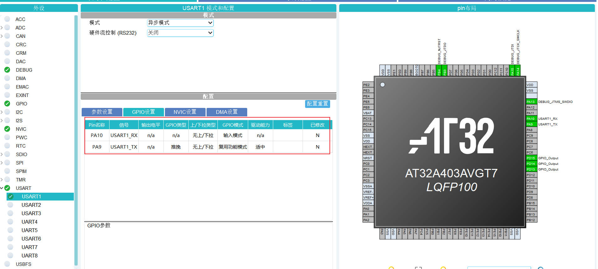

4. 生成工程模板

   点击生成代码，设置生成代码路径，设置芯片驱动库版本。

   设置了项目名称，项目位置，使用的工具链（MDK-KEIL）,选择了 MCU固件包版本，如果没有则需要自己添加，点击固件包管理，选择对应的芯片，并进行下载。

   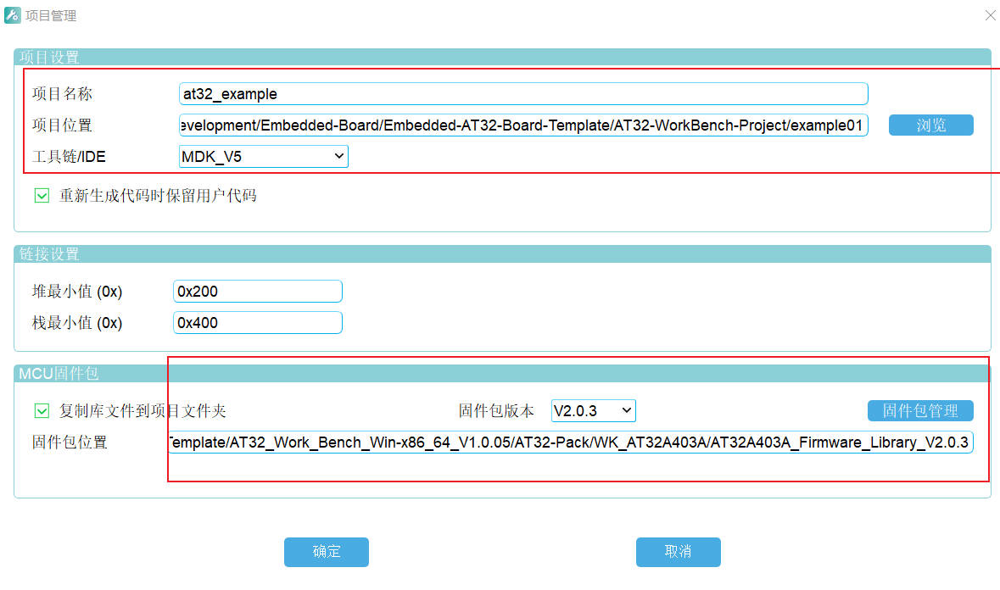

   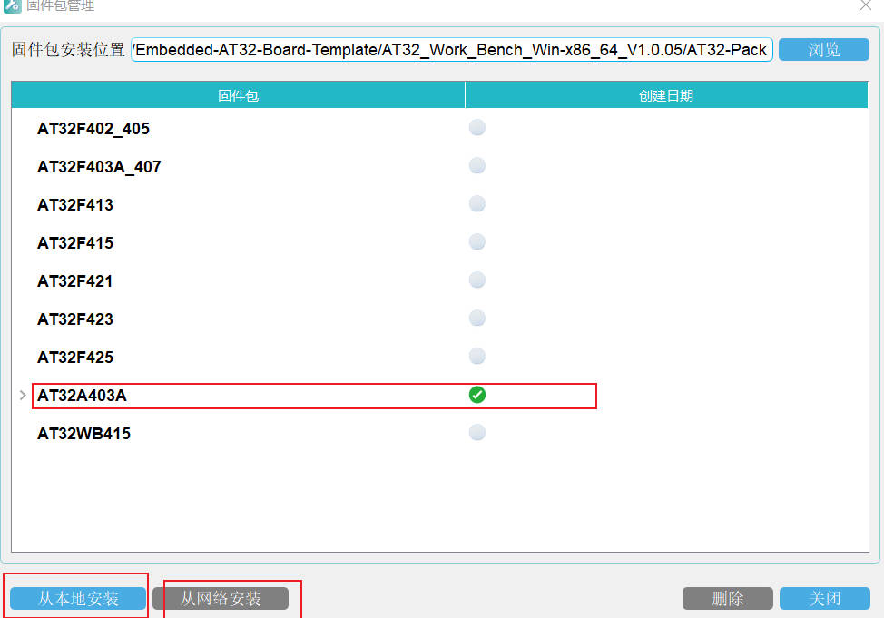

   

   打开生成的KEIL工程查看生成的代码。

   

   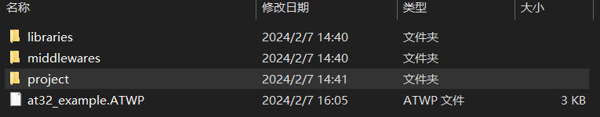

   GPIO端口配置函数

   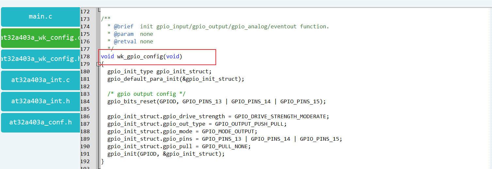

   USART1串口配置函数

   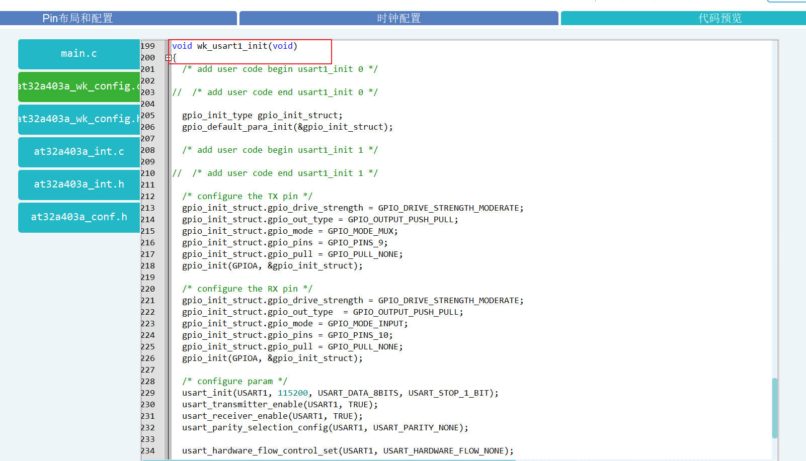

   时钟使能配置函数

   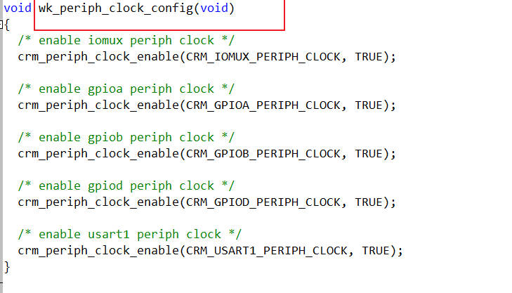

   

5. 添加个人文件，进行修改完善。

   1. 添加bsp_delay.c bsp_delay.h文件，完善delay_us,delay_ms函数

      ```c
      
      /* delay variable */
      static __IO uint32_t fac_us;
      static __IO uint32_t fac_ms;
      /**
        * @brief  initialize delay function
        * @param  none
        * @retval none
        */
      void delay_init()
      {
        /* configure systick */
        systick_clock_source_config(SYSTICK_CLOCK_SOURCE_AHBCLK_NODIV);
        fac_us = system_core_clock / (1000000U);
        fac_ms = fac_us * (1000U);
      }
      
      /**
        * @brief  inserts a delay time.
        * @param  nus: specifies the delay time length, in microsecond.
        * @retval none
        */
      void delay_us(uint32_t nus)
      {
        uint32_t temp = 0;
        SysTick->LOAD = (uint32_t)(nus * fac_us);
        SysTick->VAL = 0x00;
        SysTick->CTRL |= SysTick_CTRL_ENABLE_Msk ;
        do
        {
          temp = SysTick->CTRL;
        }while((temp & 0x01) && !(temp & (1 << 16)));
      
        SysTick->CTRL &= ~SysTick_CTRL_ENABLE_Msk;
        SysTick->VAL = 0x00;
      }
      
      /**
        * @brief  inserts a delay time.
        * @param  nms: specifies the delay time length, in milliseconds.
        * @retval none
        */
      void delay_ms(uint16_t nms)
      {
        uint32_t temp = 0;
        while(nms)
        {
          if(nms > STEP_DELAY_MS)
          {
            SysTick->LOAD = (uint32_t)(STEP_DELAY_MS * fac_ms);
            nms -= STEP_DELAY_MS;
          }
          else
          {
            SysTick->LOAD = (uint32_t)(nms * fac_ms);
            nms = 0;
          }
          SysTick->VAL = 0x00;
          SysTick->CTRL |= SysTick_CTRL_ENABLE_Msk;
          do
          {
            temp = SysTick->CTRL;
          }while((temp & 0x01) && !(temp & (1 << 16)));
      
          SysTick->CTRL &= ~SysTick_CTRL_ENABLE_Msk;
          SysTick->VAL = 0x00;
        }
      }
      ```

      

   2. 添加bsp_uart.c bsp_uart.h文件，完善串口打印函数

      这里使用的串口1配置代码是使用工具生成的，我建立了独立的c,h文件，因此需要注释at32a403a_wk_config.c和at32a403a_wk_config.h文件中的wk_usart1_init函数定义和声明.(这样子的目的，仅仅个人习惯而已)

      ```c
      /* support printf function, usemicrolib is unnecessary */
      #if (__ARMCC_VERSION > 6000000)
        __asm (".global __use_no_semihosting\n\t");
        void _sys_exit(int x)
        {
          x = x;
        }
        /* __use_no_semihosting was requested, but _ttywrch was */
        void _ttywrch(int ch)
        {
          ch = ch;
        }
        FILE __stdout;
      #else
       #ifdef __CC_ARM
        #pragma import(__use_no_semihosting)
        struct __FILE
        {
          int handle;
        };
        FILE __stdout;
        void _sys_exit(int x)
        {
          x = x;
        }
        /* __use_no_semihosting was requested, but _ttywrch was */
        void _ttywrch(int ch)
        {
          ch = ch;
        }
       #endif
      #endif
      
      #if defined (__GNUC__) && !defined (__clang__)
        #define PUTCHAR_PROTOTYPE int __io_putchar(int ch)
      #else
        #define PUTCHAR_PROTOTYPE int fputc(int ch, FILE *f)
      #endif
      
      /**
        * @brief  retargets the c library printf function to the usart.
        * @param  none
        * @retval none
        */
      PUTCHAR_PROTOTYPE
      {
        while(usart_flag_get(USART1, USART_TDBE_FLAG) == RESET);
        usart_data_transmit(USART1, (uint16_t)ch);
        while(usart_flag_get(USART1, USART_TDC_FLAG) == RESET);
        return ch;
      }
      
      #if (defined (__GNUC__) && !defined (__clang__)) || (defined (__ICCARM__))
      #if defined (__GNUC__) && !defined (__clang__)
      int _write(int fd, char *pbuffer, int size)
      #elif defined ( __ICCARM__ )
      #pragma module_name = "?__write"
      int __write(int fd, char *pbuffer, int size)
      #endif
      {
        for(int i = 0; i < size; i ++)
        {
          while(usart_flag_get(PRINT_UART, USART_TDBE_FLAG) == RESET);
          usart_data_transmit(PRINT_UART, (uint16_t)(*pbuffer++));
          while(usart_flag_get(PRINT_UART, USART_TDC_FLAG) == RESET);
        }
      
        return size;
      }
      #endif
      
      
      
      void wk_usart1_init(void)
      {
        /* add user code begin usart1_init 0 */
      
        /* add user code end usart1_init 0 */
      
        gpio_init_type gpio_init_struct;
        gpio_default_para_init(&gpio_init_struct);
      
        /* add user code begin usart1_init 1 */
      
        /* add user code end usart1_init 1 */
      
        /* configure the TX pin */
        gpio_init_struct.gpio_drive_strength = GPIO_DRIVE_STRENGTH_MODERATE;
        gpio_init_struct.gpio_out_type = GPIO_OUTPUT_PUSH_PULL;
        gpio_init_struct.gpio_mode = GPIO_MODE_MUX;
        gpio_init_struct.gpio_pins = GPIO_PINS_9;
        gpio_init_struct.gpio_pull = GPIO_PULL_NONE;
        gpio_init(GPIOA, &gpio_init_struct);
      
        /* configure the RX pin */
        gpio_init_struct.gpio_drive_strength = GPIO_DRIVE_STRENGTH_MODERATE;
        gpio_init_struct.gpio_out_type  = GPIO_OUTPUT_PUSH_PULL;
        gpio_init_struct.gpio_mode = GPIO_MODE_INPUT;
        gpio_init_struct.gpio_pins = GPIO_PINS_10;
        gpio_init_struct.gpio_pull = GPIO_PULL_NONE;
        gpio_init(GPIOA, &gpio_init_struct);
      
        /* configure param */
        usart_init(USART1, 115200, USART_DATA_8BITS, USART_STOP_1_BIT);
        usart_transmitter_enable(USART1, TRUE);
        usart_receiver_enable(USART1, TRUE);
        usart_parity_selection_config(USART1, USART_PARITY_NONE);
      
        usart_hardware_flow_control_set(USART1, USART_HARDWARE_FLOW_NONE);
      
        usart_enable(USART1, TRUE);
      
        /* add user code begin usart1_init 2 */
      
        /* add user code end usart1_init 2 */
      }
      
      ```

   3. 工程模板文件结构

      

### 4.编写主程序，下载代码，查看现象

1. 编写主程序代码

   ```c
   /* add user code begin Header */
   /**
     **************************************************************************
     * @file     main.c
     * @brief    main program
     **************************************************************************
     *                       Copyright notice & Disclaimer
     *
     * The software Board Support Package (BSP) that is made available to
     * download from Artery official website is the copyrighted work of Artery.
     * Artery authorizes customers to use, copy, and distribute the BSP
     * software and its related documentation for the purpose of design and
     * development in conjunction with Artery microcontrollers. Use of the
     * software is governed by this copyright notice and the following disclaimer.
     *
     * THIS SOFTWARE IS PROVIDED ON "AS IS" BASIS WITHOUT WARRANTIES,
     * GUARANTEES OR REPRESENTATIONS OF ANY KIND. ARTERY EXPRESSLY DISCLAIMS,
     * TO THE FULLEST EXTENT PERMITTED BY LAW, ALL EXPRESS, IMPLIED OR
     * STATUTORY OR OTHER WARRANTIES, GUARANTEES OR REPRESENTATIONS,
     * INCLUDING BUT NOT LIMITED TO, THE IMPLIED WARRANTIES OF MERCHANTABILITY,
     * FITNESS FOR A PARTICULAR PURPOSE, OR NON-INFRINGEMENT.
     *
     **************************************************************************
     */
   /* add user code end Header */
   
   /* Includes ------------------------------------------------------------------*/
   #include "main.h"
   
   /* private includes ----------------------------------------------------------*/
   /* add user code begin private includes */
   
   /* add user code end private includes */
   
   /* private typedef -----------------------------------------------------------*/
   /* add user code begin private typedef */
   
   /* add user code end private typedef */
   
   /* private define ------------------------------------------------------------*/
   /* add user code begin private define */
   
   /* add user code end private define */
   
   /* private macro -------------------------------------------------------------*/
   /* add user code begin private macro */
   
   /* add user code end private macro */
   
   /* private variables ---------------------------------------------------------*/
   /* add user code begin private variables */
   
   /* add user code end private variables */
   
   /* private function prototypes --------------------------------------------*/
   /* add user code begin function prototypes */
   
   /* add user code end function prototypes */
   
   /* private user code ---------------------------------------------------------*/
   /* add user code begin 0 */
   __IO uint32_t time_cnt = 0;
   /* add user code end 0 */
   
   /**
     * @brief main function.
     * @param  none
     * @retval none
     */
   int main(void)
   {
     /* add user code begin 1 */
     
     /* add user code end 1 */
   
     /* system clock config. */
     wk_system_clock_config();
   
     /* config periph clock. */
     wk_periph_clock_config();
   
     /* nvic config. */
     wk_nvic_config();
   
     /* init usart1 function. */
     wk_usart1_init();
   
     /* init gpio function. */
     wk_gpio_config();
   
     /* add user code begin 2 */
       delay_init();
     printf("Hardware_Init [ok] \r\n");
     printf("at_start_a403a board testing By End\r\n");
     printf("at_start_a403a board testing 2024-02-07\r\n");
     /* add user code end 2 */
   
     while(1)
     {
       /* add user code begin 3 */
       printf("at32_workbench_template start [ok] \r\n");
       printf("at32_led_toggle example start [ok]  \r\n");
   	gpio_bits_reset(GPIOD, GPIO_PINS_13);
       delay_ms(500);
       gpio_bits_set(GPIOD, GPIO_PINS_13);
       delay_ms(500);
       printf("at32_led2_toggle example  [ok]  \r\n");
       gpio_bits_reset(GPIOD, GPIO_PINS_14);
       delay_ms(500);
       gpio_bits_set(GPIOD, GPIO_PINS_14);
       delay_ms(500);
       printf("at32_led3_toggle example  [ok]  \r\n");
       gpio_bits_reset(GPIOD, GPIO_PINS_15);
       delay_ms(500);
       gpio_bits_set(GPIOD, GPIO_PINS_15);
       delay_ms(500);
       printf("at32_led4_toggle example  [ok]  \r\n");
       printf("at32_led_toggle example end [ok]  \r\n");  
       printf("at32_workbench_template end [ok] \r\n");
       printf("usart printf counter: %u\r\n",time_cnt++);
        
       /* add user code end 3 */
     }
   }
   
   ```

   

2. 下载代码

   板载AT-Link下载程序，支持虚拟串口，并对接到PA9,PA10。这里我选择了AT-Link-EZ CMSIS-DAP,之前我直接下载的工程，却显示无非下载，但是下载别人的工程却没有问题，不知道啥子情况，然后设置成这个模式，下载代码就没有问题了，具体原因可能不是这个。

   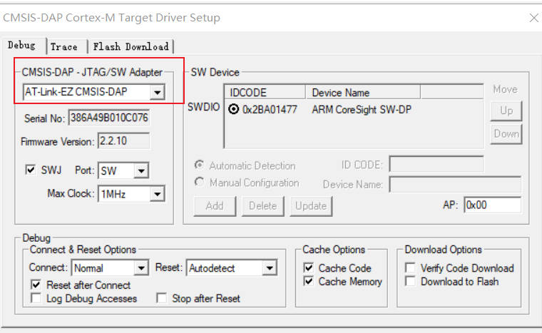

3. 观察现象

   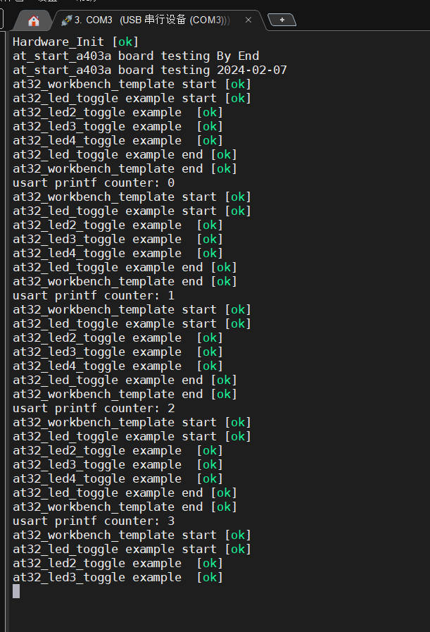

