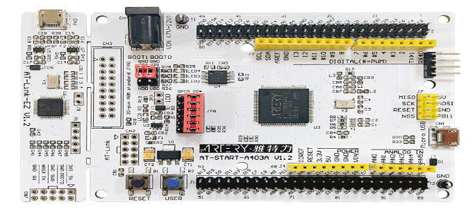
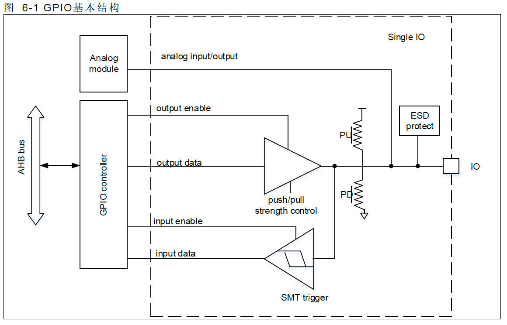
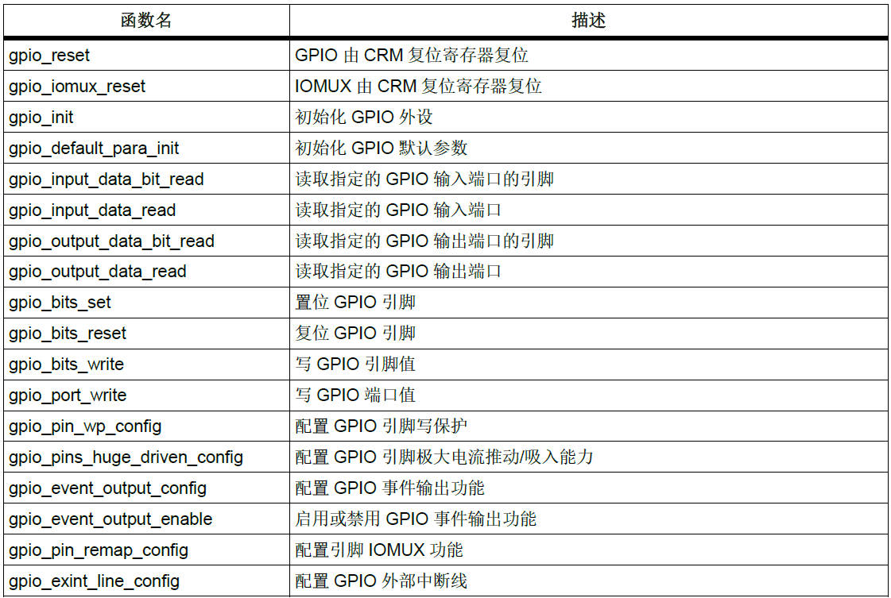
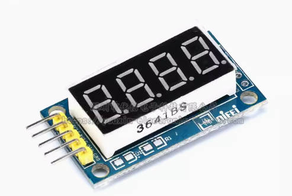
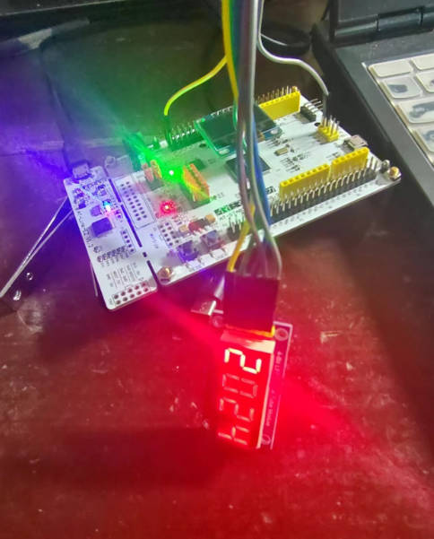
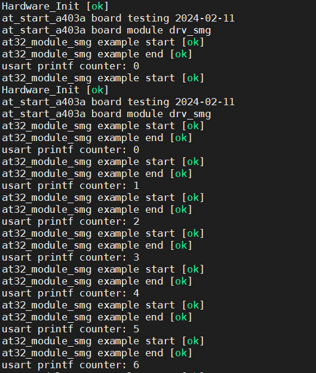
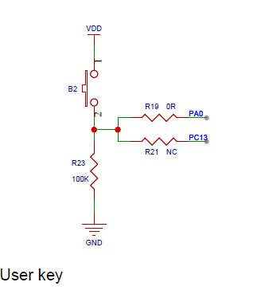
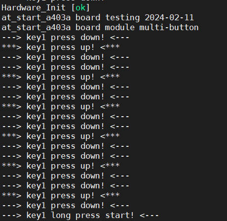

## 04-雅特力AT32A403开发板评测 GPIO输入输出 数码管显示 按键检测Multibutton移植

GPIO输出典型应用——点灯

GPIO输入典型应用——按键


###  1. 软硬件平台

1. AT32A403A Board开发板

2. MDK-ARM Keil

3. 4-bit 数码管

   


### 2.GPIO 

AT32A403A 支持多达80 个双向I/O 管脚，这些管脚分为5 组，分别为PA、PB、PC、PD 和PE，每组
最多包含16 个管脚，每个管脚都可以实现与外部的通讯、控制以及数据采集的功能。
每个管脚都支持通用功能输入输出（GPIO）或复用功能输入输出（IOMUX）。本章节详细介绍GPIO 功
能，IOMUX 功能详见复用功能输入输出章节。
每个管脚都可以软件配置成浮空输入、上拉/下拉输入、模拟输入/输出、通用推挽/开漏输出、复用推挽/开
漏输出。
每个管脚都可以软件配置输出驱动能力。
每个管脚都可以配置为外部中断输入。
每个管脚都支持配置锁定功能。

##### GPIO端口结构



在AT32A403A固件库BSP&Pack应用指南.pdf中可以查看固件库函数api



### 3.GPIO 输出模式案例 数码管 

数码管：是一种可以显示数字和其他信息的电子设备，可以看成是多个二极管的组成。

数码管显示原理：通过点亮内部的发光二极管来发光。

数码管根据其公共端所接的阳极和阴极的不同，分为了共阴极数码管和共阳极数码管。

共阳极接法：几个二极管的阳极接在一起，接到VCC（高电平），我们要想点亮，只要在在对应的二极管的阴极接上低电平即可。

共阴极接法：几个二极管的阴极接在一起，接到GND（低电平），我们要想点亮，只要在在对应的二极管的阳极接上高电平即可。



驱动代码 drv_smg.c

```c
#include "main.h"

unsigned char smg_code[] =
{
    // 0	 1	  2	   3	4	 5	  6	   7	8	 9	  A	   b	C    d	  E    F    -
    0xC0, 0xF9, 0xA4, 0xB0, 0x99, 0x92, 0x82, 0xF8, 0x80, 0x90, 0x8C, 0xBF, 0xC6, 0xA1, 0x86, 0xFF, 0xbf
};//段码


void module_smg_gpio_iint(void)
{
  
  gpio_init_type gpio_init_struct;

  /* enable the gpioa clock */
  crm_periph_clock_enable(smg_port_clock, TRUE);

  /* set default parameter */
  gpio_default_para_init(&gpio_init_struct);

  /* configure the gpio */
  gpio_init_struct.gpio_drive_strength = GPIO_DRIVE_STRENGTH_STRONGER;
  gpio_init_struct.gpio_out_type  = GPIO_OUTPUT_PUSH_PULL;
  gpio_init_struct.gpio_mode = GPIO_MODE_OUTPUT;
  gpio_init_struct.gpio_pins = smg_rclk_pin|smg_sclk_pin|smg_dio_pin;
  gpio_init_struct.gpio_pull = GPIO_PULL_NONE;
  gpio_init(smg_port, &gpio_init_struct);
  
    
    gpio_bits_reset(smg_port, smg_rclk_pin|smg_sclk_pin|smg_dio_pin);  //将数码管端口拉高
 
}


void module_smg_data_output(uint8_t data)
{
    uint8_t i;
    for (i = 0; i < 8; i++)
    {
        if (data & 0x80)//按位与，先发送高位
        {
            //SMG_DIO = 1;//SMG_DIO 端口置1
            gpio_bits_set(smg_dio_port, smg_dio_pin);
        }
        else
        {
            //SMG_DIO = 0;//SMG_DIO 端口置0
            gpio_bits_reset(smg_dio_port, smg_dio_pin);
        }
        data <<= 1;
        //SMG_SCLK = 0;
        //SMG_SCLK = 1;
        gpio_bits_reset(smg_sclk_port, smg_sclk_pin);;  //SMG_SCLK 端口置0
        gpio_bits_set(smg_sclk_port, smg_sclk_pin);;    //SMG_SCLK产生一个上升沿
    }
}
 
void module_smg_display(int num)
{
    uint8_t digit[digit_num], i, j;
    
    //将传入的数字转换为数组的元素
    for (i = 1; i <= digit_num; i++)
    {
        digit[digit_num - i] = num % 10;
        num /= 10;
    }
    
    for (j = i = 1; i <= digit_num; i++, j *= 2)
    {
        module_smg_data_output(smg_code[digit[digit_num - i]]); //发送显示数据
        module_smg_data_output(j);                              //发送显示位数
        gpio_bits_reset(smg_rclk_port, smg_rclk_pin);;  //SMG_RCLK 端口置0
        gpio_bits_set(smg_rclk_port, smg_rclk_pin);;    //SMG_RCLK产生一个上升沿
        delay_ms(2);  //保持一定时间，否则数码管亮度较低
    }

}

```

驱动代码 drv_smg.h

```c
#ifndef __DRV_SMG_H
#define __DRV_SMG_H

#include "main.h"

#define digit_num 4

//适用于同一个gpio系列下
#define smg_port_clock      CRM_GPIOD_PERIPH_CLOCK
#define smg_port            GPIOD

//适用于不同gpio系列下
#define smg_dio_port            GPIOD
#define smg_dio_pin             GPIO_PINS_15
#define smg_dio_port_clock      CRM_GPIOD_PERIPH_CLOCK

#define smg_sclk_port           GPIOD
#define smg_sclk_pin            GPIO_PINS_11
#define smg_sclk_port_clock     CRM_GPIOD_PERIPH_CLOCK

#define smg_rclk_port           GPIOD
#define smg_rclk_pin            GPIO_PINS_13
#define smg_rclk_port_clock     CRM_GPIOD_PERIPH_CLOCK


//位带操作
//#define SMG_DIO  PDout(9)
//#define SMG_RCLK PDout(11)
//#define SMG_SCLK PDout(13)


void module_smg_gpio_iint(void);
void module_smg_data_output(uint8_t data);
void module_smg_display(int num);

#endif

```

测试代码

```c
#include "main.h"


/** @addtogroup AT32A403A_periph_examples
  * @{
  */

/** @addtogroup 403A_USART_printf USART_printf
  * @{
  */

__IO uint32_t time_cnt = 0;

/**
  * @brief  main function.
  * @param  none
  * @retval none
  */
int main(void)
{
  unsigned char count_num; 
  system_clock_config();
  at32_board_init();
  uart_print_init(115200);
  module_smg_gpio_iint();
  /* output a message on hyperterminal using printf function */
  //printf("usart printf example: retarget the c library printf function to the usart\r\n");
  printf("Hardware_Init [ok] \r\n");
  printf("at_start_a403a board testing 2024-02-11\r\n");
  printf("at_start_a403a board module drv_smg\r\n");
    

  while(1)
  {
     printf("at32_module_smg example start [ok] \r\n");
    for(count_num=0;count_num<=99;count_num++)
    {	
        module_smg_display(count_num);
        delay_ms(10);
    }
    printf("at32_module_smg example end [ok] \r\n");
    printf("usart printf counter: %u\r\n",time_cnt++);
  }
}
```

##### 测试效果





### 4.GPIO 输入模式案例 按键检测Multibutton移植

在雅特力AT32A403A开发板中，一共有2个按键，一个是复位按键 ,应该用户User按键，但是只有一个user_key可以去控制。



按键机械触点断开、闭合时，由于触点的弹性作用，按键开关不会马上稳定接通或一下子断开， 使用按键时会产生图 按键抖动说明图中的带波纹信号，需要用软件消抖处理滤波，不方便输入检测。


接下来就是按键key端口初始化的函数简单分析。

```c
typedef enum
{
  USER_BUTTON                            = 0,
  NO_BUTTON                              = 1
} button_type;

#define USER_BUTTON_PIN                  GPIO_PINS_0
#define USER_BUTTON_PORT                 GPIOA
#define USER_BUTTON_CRM_CLK              CRM_GPIOA_PERIPH_CLOCK
```

```c
void at32_button_init(void)
{
  gpio_init_type gpio_init_struct;

  /* enable the button clock */
  crm_periph_clock_enable(USER_BUTTON_CRM_CLK, TRUE);

  /* set default parameter */
  gpio_default_para_init(&gpio_init_struct);

  /* configure button pin as input with pull-up/pull-down */
  gpio_init_struct.gpio_drive_strength = GPIO_DRIVE_STRENGTH_STRONGER;
  gpio_init_struct.gpio_out_type  = GPIO_OUTPUT_PUSH_PULL;
  gpio_init_struct.gpio_mode = GPIO_MODE_INPUT;
  gpio_init_struct.gpio_pins = USER_BUTTON_PIN;
  gpio_init_struct.gpio_pull = GPIO_PULL_DOWN;
  gpio_init(USER_BUTTON_PORT, &gpio_init_struct);
}

/**
  * @brief  returns the selected button state
  * @param  none
  * @retval the button gpio pin value
  */
uint8_t at32_button_state(void)
{
  return gpio_input_data_bit_read(USER_BUTTON_PORT, USER_BUTTON_PIN);
}

/**
  * @brief  returns which button have press down
  * @param  none
  * @retval the button have press down
  */
button_type at32_button_press()
{
  static uint8_t pressed = 1;
  /* get button state in at_start board */
  if((pressed == 1) && (at32_button_state() != RESET))
  {
    /* debounce */
    pressed = 0;
    delay_ms(10);
    if(at32_button_state() != RESET)
      return USER_BUTTON;
  }
  else if(at32_button_state() == RESET)
  {
    pressed = 1;
  }
  return NO_BUTTON;
}
```

at32_button_init 端口初始化函数，(at32_button_state,at32_button_press函数在multibutton没有使用到)

```c
void at32_button_init(void)
{
  gpio_init_type gpio_init_struct;

  /* enable the button clock */
  crm_periph_clock_enable(USER_BUTTON_CRM_CLK, TRUE);

  /* set default parameter */
  gpio_default_para_init(&gpio_init_struct);

  /* configure button pin as input with pull-up/pull-down */
  gpio_init_struct.gpio_drive_strength = GPIO_DRIVE_STRENGTH_STRONGER;
  gpio_init_struct.gpio_out_type  = GPIO_OUTPUT_PUSH_PULL;
  gpio_init_struct.gpio_mode = GPIO_MODE_INPUT;
  gpio_init_struct.gpio_pins = USER_BUTTON_PIN;
  gpio_init_struct.gpio_pull = GPIO_PULL_DOWN;
  gpio_init(USER_BUTTON_PORT, &gpio_init_struct);
}

/**
  * @brief  returns the selected button state
  * @param  none
  * @retval the button gpio pin value
  */
uint8_t at32_button_state(void)
{
  return gpio_input_data_bit_read(USER_BUTTON_PORT, USER_BUTTON_PIN);
}

/**
  * @brief  returns which button have press down
  * @param  none
  * @retval the button have press down
  */
button_type at32_button_press()
{
  static uint8_t pressed = 1;
  /* get button state in at_start board */
  if((pressed == 1) && (at32_button_state() != RESET))
  {
    /* debounce */
    pressed = 0;
    delay_ms(10);
    if(at32_button_state() != RESET)
      return USER_BUTTON;
  }
  else if(at32_button_state() == RESET)
  {
    pressed = 1;
  }
  return NO_BUTTON;
}
```

####  MultiButton按键检测

MultiButton开源框架仓库 [https://github.com/0x1abin/MultiButton](https://gitee.com/link?target=https%3A%2F%2Fgithub.com%2F0x1abin%2FMultiButton)

参考博客[https://blog.csdn.net/qq_36075612/article/details/115901032](https://gitee.com/link?target=https%3A%2F%2Fblog.csdn.net%2Fqq_36075612%2Farticle%2Fdetails%2F115901032)

MultiButton | 一个小巧简单易用的事件驱动型按键驱动模块 [https://zhuanlan.zhihu.com/p/128961191](https://gitee.com/link?target=https%3A%2F%2Fzhuanlan.zhihu.com%2Fp%2F128961191)

本次使用的是博客中的版本，仓库版本的代码可能与下面代码不一样，应该是更新了代码和api。

#### 使用方法

1.先申请一个按键结构。

2.初始化按键对象，绑定按键的GPIO电平读取接口**read_button_pin()** ，后一个参数设置有效触发电平。

3.注册按键事件。

4.启动按键。

5.设置一个5ms间隔的定时器循环调用后台处理函数。

```c
//按键状态读取接口
unsigned char btn0_id = 0;
struct Button button0;

uint8_t  read_button0_GPIO(void)
{
    return (GPIO_ReadPin(BSP_PB_GPIO, BSP_PB_PIN));
}

void button_callback(void *button)
{
    uint32_t btn_event_val; 
    
    btn_event_val = get_button_event((struct Button *)button); 
    
    switch(btn_event_val)
    {
      case PRESS_DOWN:
          printf("---> key1 press down! <---\r\n"); 
      break; 
 
      case PRESS_UP: 
          printf("***> key1 press up! <***\r\n");
      break; 
 
      case PRESS_REPEAT: 
          printf("---> key1 press repeat! <---\r\n");
      break; 
 
      case SINGLE_CLICK: 
          printf("---> key1 single click! <---\r\n");
      break; 
 
      case DOUBLE_CLICK: 
          printf("***> key1 double click! <***\r\n");
      break; 
 
      case LONG_PRESS_START: 
          printf("---> key1 long press start! <---\r\n");
      break; 
 
      case LONG_PRESS_HOLD: 
          printf("***> key1 long press hold! <***\r\n");
      break; 
    }
}
```

####  特性

MultiButton 使用C语言实现，基于面向对象方式设计思路，每个按键对象单独用一份数据结构管理：

```c
struct Button {

	uint16_t ticks;
	uint8_t  repeat: 4;
	uint8_t  event : 4;
	uint8_t  state : 3;
	uint8_t  debounce_cnt : 3;
	uint8_t  active_level : 1;
	uint8_t  button_level : 1;
	uint8_t  (*hal_button_Level)(void);
	BtnCallback  cb[number_of_event];
	struct Button* next;
};
```

这样每个按键使用单向链表相连，依次进入 button_handler(struct Button* handle) 状态机处理，所以每个按键的状态彼此独立。

#### 按键事件

| 事件             | 说明                                 |
| ---------------- | ------------------------------------ |
| PRESS_DOWN       | 按键按下，每次按下都触发             |
| PRESS_UP         | 按键弹起，每次松开都触发             |
| PRESS_REPEAT     | 重复按下触发，变量repeat计数连击次数 |
| SINGLE_CLICK     | 单击按键事件                         |
| DOUBLE_CLICK     | 双击按键事件                         |
| LONG_PRESS_START | 达到长按时间阈值时触发一次           |
| LONG_PRESS_HOLD  | 长按期间一直触发                     |

```c
#include "main.h"


/** @addtogroup AT32A403A_periph_examples
  * @{
  */

/** @addtogroup 403A_USART_printf USART_printf
  * @{
  */

__IO uint32_t time_cnt = 0;

//按键状态读取接口

uint8_t  read_button0_GPIO(void)
{
    return (gpio_input_data_bit_read(USER_BUTTON_PORT, USER_BUTTON_PIN));
}


unsigned char btn0_id = 0;
struct Button button0;
void button_callback(void *button)
{
    uint32_t btn_event_val; 
    
    btn_event_val = get_button_event((struct Button *)button); 
    
    switch(btn_event_val)
    {
      case PRESS_DOWN:
          printf("---> key1 press down! <---\r\n"); 
      break; 
 
      case PRESS_UP: 
          printf("***> key1 press up! <***\r\n");
      break; 
 
      case PRESS_REPEAT: 
          printf("---> key1 press repeat! <---\r\n");
      break; 
 
      case SINGLE_CLICK: 
          printf("---> key1 single click! <---\r\n");
      break; 
 
      case DOUBLE_CLICK: 
          printf("***> key1 double click! <***\r\n");
      break; 
 
      case LONG_PRESS_START: 
          printf("---> key1 long press start! <---\r\n");
      break; 
 
      case LONG_PRESS_HOLD: 
          printf("***> key1 long press hold! <***\r\n");
      break; 
    }
}

/**
  * @brief  main function.
  * @param  none
  * @retval none
  */
int main(void)
{
//  unsigned char count_num; 
  system_clock_config();
  at32_board_init();
  uart_print_init(115200);
  module_smg_gpio_iint();
  /* output a message on hyperterminal using printf function */
  //printf("usart printf example: retarget the c library printf function to the usart\r\n");
  printf("Hardware_Init [ok] \r\n");
  printf("at_start_a403a board testing 2024-02-11\r\n");
  printf("at_start_a403a board module multi-button\r\n");
    
  //初始化按键对象
    button_init(&button0, read_button0_GPIO, 0);
    button_attach(&button0, PRESS_DOWN,       button_callback);
    button_attach(&button0, PRESS_UP,         button_callback);
    button_attach(&button0, PRESS_REPEAT,     button_callback);
    button_attach(&button0, SINGLE_CLICK,     button_callback);
    button_attach(&button0, DOUBLE_CLICK,     button_callback);
    button_attach(&button0, LONG_PRESS_START, button_callback);
    button_attach(&button0, LONG_PRESS_HOLD,  button_callback);
   //启动按键
   button_start(&button0);
  while(1)
  {
        button_ticks();
        delay_ms(5);
  }
}

```

##### 测试效果

