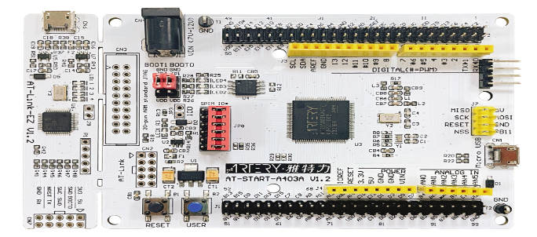
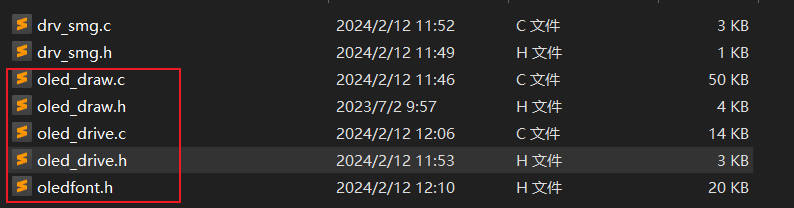
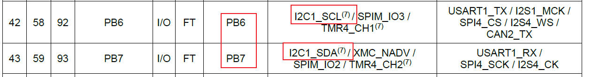
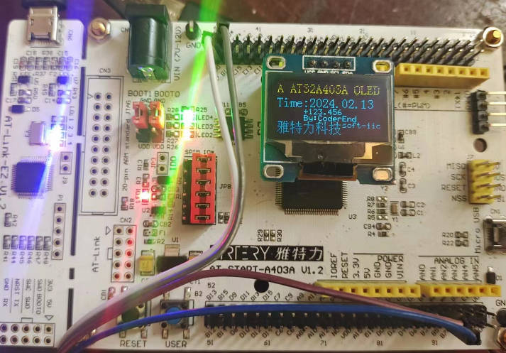
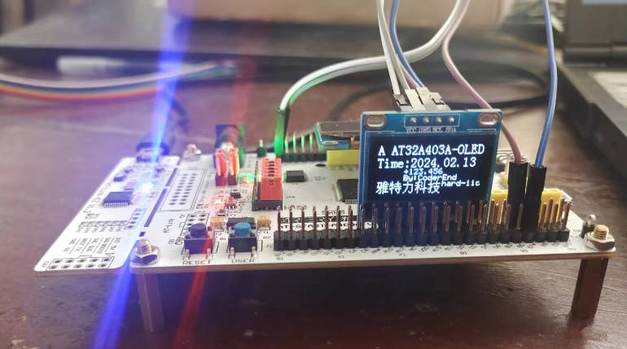

## 05-雅特力AT32A403开发板评测 0.96寸 IIC接口 OLED模块显示

### 1.软硬件平台

1. 1. 软硬件平台

   1. AT32A403A Board开发板

   2. MDK-ARM Keil

   3. 0.96寸 IIC接口 OLED显示模块

      


### 2.IIC总线
处理器和芯片间的通信可以形象的比喻成两个人讲话：1、你说的别人得能听懂：双方约定信号的协议。2、你的语速别人得能接受：双方满足时序要求。


 #### OLED 显示函数支持
 1.  OLED 显示字符、字符串 汉字
```c
void OLED_ShowChar_06x08(uint8_t X, uint8_t Y, uint8_t Char);//显示字符函数
void OLED_ShowString_06x08(uint8_t X, uint8_t Y, uint8_t *String);//显示字符串函数
void OLED_ShowCHinese(uint8_t X,uint8_t Y,uint8_t Chinese);//显示汉字函数
void OLED_ShowChar_08x16(uint8_t X, uint8_t Y, uint8_t Char);//显示字符函数
void OLED_ShowString_16x16(uint8_t X, uint8_t Y, uint8_t *String);//显示字符串函数
```
 2.  OLED 显示整型数字/浮点型数字/二进制数字/十六进制数字

```c
void OLED_ShowNumber_SignedInteger_06x08(uint8_t X, uint8_t Y, int16_t IntegerNumber, uint8_t Count);//显示有符号整型数字函数
void OLED_ShowNumber_UnsignedInteger_06x08(uint8_t X, uint8_t Y, uint16_t IntegerNumber, uint8_t Count);//显显示无符号整型数字函数
void OLED_ShowNumber_Float_06x08(uint8_t X, uint8_t Y, float FloatNumber, uint8_t Count1, uint8_t Count2);//显示浮点数函数
void OLED_ShowNumber_Binary_06x08(uint8_t X, uint8_t Y, unsigned long BinaryNumber, uint8_t Count);//显示数组函数
void OLED_ShowNumber_Hex_06x08(uint8_t X, uint8_t Y, unsigned long BinaryNumber, uint8_t Count);//显示十六进制数字函数

```

 3.  OLED 基本绘图函数


```c
//  OLED 绘制直线
void OLED_DrawLine(uint8_t X, uint8_t Y, uint8_t PointData);
//  OLED 绘制图像
void OLED_RollDisplay(void);//设置水平左右移
void Draw_BMP(uint8_t x0,uint8_t y0,uint8_t x1,uint8_t y1,uint8_t BMP[]);
//画点函数
void OLED_DrawDot(uint8_t X,uint8_t Y,uint8_t T);
//画直线函数
void LCD_DrawLine(uint32_t X1, uint32_t Y1, uint32_t X2,uint32_t Y2);
//dot ==1 表示亮显示出来
void OLED_Fill_Draw_circle(uint8_t X0,uint8_t Y0,uint8_t r,uint8_t dot);
//ucFilled ==1 表示填充 //画直圆函数
void OLED_DrawCircle( uint16_t usX_Center, uint16_t usY_Center, uint16_t usRadius, uint8_t ucFilled );
//画矩形函数
void LCD_DrawRectangle(uint16_t X1, uint16_t Y1, uint16_t X2, uint16_t Y2);
```
### 3.模拟IIC移植 OLED屏幕驱动

1. 建立工程模板，添加相关驱动文件

   在之前的工程模板上进行添加文件，同时oled部分代码参考梁山派GD32F4开发板资料进行。

   olde_drive.c olde_drive.h // oled底层驱动文件，包括软件iic实现，oled引脚配置，oled初始化.

   olde_draw.c olde_draw.h // oled应用层文件，主要是绘图api实现（可以移植到其他开发板，不需要改，仅配置好驱动文件即可

   

2. 配置引脚

   选择引脚，进入工程开始编写屏幕引脚初始化代码。

   为了方便后续移植，我在**oled_drive.h**处宏定义了每一个引脚，后续根据需要进行修改即可。

   ```c
   #define OLED_GPIO_PORT   GPIOA
   #define OLED_GPIO_CLOCK  CRM_GPIOA_PERIPH_CLOCK
   
   #define SCL_GPIO_PORT            GPIOA
   #define SCL_GPIO_PIN             GPIO_PINS_5
   #define SCL_GPIO_CLK_ENABLE()    CRM_GPIOA_PERIPH_CLOCK
   
   #define SDA_GPIO_PORT            GPIOA
   #define SDA_GPIO_PIN             GPIO_PINS_6
   #define SDA_GPIO_CLK_ENABLE()    CRM_GPIOA_PERIPH_CLOCK
   
   ```

3. 屏幕GPIO端口初始化配置

   ```c
   void OLED_GPIO_Configuare(void)
   {
   
     gpio_init_type gpio_init_struct;
   
     /* enable the gpioa clock */
     crm_periph_clock_enable(OLED_GPIO_CLOCK, TRUE);
   
     /* set default parameter */
     gpio_default_para_init(&gpio_init_struct);
   
     /* configure the gpio */
     gpio_init_struct.gpio_drive_strength = GPIO_DRIVE_STRENGTH_STRONGER;
     gpio_init_struct.gpio_out_type  = GPIO_OUTPUT_PUSH_PULL;
     gpio_init_struct.gpio_mode = GPIO_MODE_OUTPUT;
     gpio_init_struct.gpio_pins = SDA_GPIO_PIN |SCL_GPIO_PIN;
     gpio_init_struct.gpio_pull = GPIO_PULL_NONE;
     gpio_init(OLED_GPIO_PORT, &gpio_init_struct);
   }
   ```
   
4. IIC接口宏定义设置

   ```C
   //-----------------OLED IIC端口定义----------------  					   
   
   #define OLED_SCLK_Clr() gpio_bits_reset(SCL_GPIO_PORT,SCL_GPIO_PIN)//SCL IIC接口的时钟信号
   #define OLED_SCLK_Set() gpio_bits_set(SCL_GPIO_PORT,SCL_GPIO_PIN)
   
   #define OLED_SDIN_Clr() gpio_bits_reset(SDA_GPIO_PORT,SDA_GPIO_PIN)//SDA IIC接口的数据信号
   #define OLED_SDIN_Set() gpio_bits_set(SDA_GPIO_PORT,SDA_GPIO_PIN)
   ```
   
5. 软件IIC代码实现

   ```c
   //==================================================================================================
   //  函数功能: IIC外设驱动函数部分
   //  函数标记: IIC_Start
   //  函数说明: 无
   //-------------------------------------------------------------------------------------------------
   //  |   -   |   -   |   0   |   1   |   2   |   3   |   4   |   5   |   6   |   7   |   8   |   9   
   //==================================================================================================
   void IIC_Start()
   {
   	OLED_SCLK_Set() ;
   	OLED_SDIN_Set();
   	OLED_SDIN_Clr();
   	OLED_SCLK_Clr();
   }
   //==================================================================================================
   //  函数功能: IIC外设驱动函数部分
   //  函数标记: IIC_Stop
   //  函数说明: 无
   //-------------------------------------------------------------------------------------------------
   //  |   -   |   -   |   0   |   1   |   2   |   3   |   4   |   5   |   6   |   7   |   8   |   9   
   //==================================================================================================
   void IIC_Stop()
   {
       OLED_SCLK_Set() ;
   	OLED_SDIN_Clr();
   	OLED_SDIN_Set();	
   }
   //==================================================================================================
   //  函数功能: IIC外设驱动函数部分
   //  函数标记: IIC_Stop
   //  函数说明: 无
   //-------------------------------------------------------------------------------------------------
   //  |   -   |   -   |   0   |   1   |   2   |   3   |   4   |   5   |   6   |   7   |   8   |   9   
   //==================================================================================================
   void IIC_Wait_Ack()
   {
   	OLED_SCLK_Set() ;
   	OLED_SCLK_Clr();
   }
   //==================================================================================================
   //  函数功能: IIC外设驱动函数部分
   //  函数标记: Write_IIC_Byte
   //  函数说明: 无
   //-------------------------------------------------------------------------------------------------
   //  |   -   |   -   |   0   |   1   |   2   |   3   |   4   |   5   |   6   |   7   |   8   |   9   
   //==================================================================================================
   void Write_IIC_Byte(uint8_t IIC_Byte)
   {
   	uint8_t i;
   	uint8_t m,da;
   	da=IIC_Byte;
   	OLED_SCLK_Clr();
   	for(i=0;i<8;i++)		
   	{
   		m=da;
   		//	OLED_SCLK_Clr();
   		m=m&0x80;
   		if(m==0x80)
   		{
   			OLED_SDIN_Set();
   		}
   		else 
   			OLED_SDIN_Clr();
   		
   		da=da<<1;
   		OLED_SCLK_Set();
   		OLED_SCLK_Clr();
   }
   
   }
   //==================================================================================================
   //  函数功能: IIC外设驱动函数部分
   //  函数标记: Write_IIC_Command
   //  函数说明: 无
   //-------------------------------------------------------------------------------------------------
   //  |   -   |   -   |   0   |   1   |   2   |   3   |   4   |   5   |   6   |   7   |   8   |   9   
   //==================================================================================================
   void Write_IIC_Command(uint8_t IIC_Command)
   {
      IIC_Start();
      Write_IIC_Byte(0x78);            //Slave address,SA0=0
      IIC_Wait_Ack();	
      Write_IIC_Byte(0x00);			//write command
      IIC_Wait_Ack();	
      Write_IIC_Byte(IIC_Command); 
      IIC_Wait_Ack();	
      IIC_Stop();
   }
   //==================================================================================================
   //  函数功能: IIC外设驱动函数部分
   //  函数标记: Write_IIC_Data
   //  函数说明: 无
   //-------------------------------------------------------------------------------------------------
   //  |   -   |   -   |   0   |   1   |   2   |   3   |   4   |   5   |   6   |   7   |   8   |   9   
   //==================================================================================================
   void Write_IIC_Data(uint8_t IIC_Data)
   {
       IIC_Start();
       Write_IIC_Byte(0x78);			//D/C#=0; R/W#=0
   	IIC_Wait_Ack();	
       Write_IIC_Byte(0x40);			//write data
   	IIC_Wait_Ack();	
       Write_IIC_Byte(IIC_Data);
   	IIC_Wait_Ack();	
       IIC_Stop();
   }
   ```

6. OLED初始化函数

   ```c
   //==================================================================================================
   //  函数功能: OLED 外设驱动函数部分
   //  函数标记: OLED_Init
   //  函数说明: 初始化函数配置
   //-------------------------------------------------------------------------------------------------
   //  |   -   |   -   |   0   |   1   |   2   |   3   |   4   |   5   |   6   |   7   |   8   |   9   
   //==================================================================================================
   void OLED_Init(void)
   { 	
       OLED_GPIO_Configuare();
       OLED_WR_Byte(0xAE,OLED_CMD);//--display off
   	OLED_WR_Byte(0x00,OLED_CMD);//---set low column address
   	OLED_WR_Byte(0x10,OLED_CMD);//---set high column address
   	OLED_WR_Byte(0x40,OLED_CMD);//--set start line address  
   	OLED_WR_Byte(0xB0,OLED_CMD);//--set page address
   	OLED_WR_Byte(0x81,OLED_CMD); // contract control
   	OLED_WR_Byte(0xFF,OLED_CMD);//--128   
   	OLED_WR_Byte(0xA1,OLED_CMD);//set segment remap 
   	OLED_WR_Byte(0xA6,OLED_CMD);//--normal / reverse
   	OLED_WR_Byte(0xA8,OLED_CMD);//--set multiplex ratio(1 to 64)
   	OLED_WR_Byte(0x3F,OLED_CMD);//--1/32 duty
   	OLED_WR_Byte(0xC8,OLED_CMD);//Com scan direction
   	OLED_WR_Byte(0xD3,OLED_CMD);//-set display offset
   	OLED_WR_Byte(0x00,OLED_CMD);//
       
   	OLED_WR_Byte(0xD5,OLED_CMD);//set osc division
   	OLED_WR_Byte(0x80,OLED_CMD);//
   	
   	OLED_WR_Byte(0xD8,OLED_CMD);//set area color mode off
   	OLED_WR_Byte(0x05,OLED_CMD);//
   	
   	OLED_WR_Byte(0xD9,OLED_CMD);//Set Pre-Charge Period
   	OLED_WR_Byte(0xF1,OLED_CMD);//
   	
   	OLED_WR_Byte(0xDA,OLED_CMD);//set com pin configuartion
   	OLED_WR_Byte(0x12,OLED_CMD);//
   	
   	OLED_WR_Byte(0xDB,OLED_CMD);//set Vcomh
   	OLED_WR_Byte(0x30,OLED_CMD);//
   	
   	OLED_WR_Byte(0x8D,OLED_CMD);//set charge pump enable
   	OLED_WR_Byte(0x14,OLED_CMD);//
   	
   	OLED_WR_Byte(0xAF,OLED_CMD);//--turn on oled panel
   	
   
   	OLED_Clear();
   	OLED_Set_Pos(0,0);
   }  
   ```

   综上所述，软件模拟IIC 驱动OLED文件完成，接下来就是应用层文件,具体参考仓库代码。

   [模拟IIC 驱动OLED]: https://gitee.com/End-ING/embedded-arterytek32-board/tree/master/note/code/at32a403_mdk_oled_iic_template/at32a403_mdk_oled_softiic_template
   
   ### 4.硬件IIC移植 OLED屏幕驱动
   
      
   
   ```c
   i2c_handle_type hi2cx;  
   ```
   
   1. 建立工程模板，在软件模拟工程IIC基础上进行修改，添加宏定义进行操作
   
      olde_drive.c olde_drive.h // oled底层驱动文件，包括硬件iic初始化
   
      olde_draw.c olde_draw.h // oled应用层文件，主要是绘图api实现
   
   2. 配置引脚
   
      选择引脚，进入工程开始编写屏幕引脚初始化代码。
   
      为了方便后续移植，我在**oled_drive.h**处宏定义了每一个引脚，后续根据需要进行修改即可。
   
      ```c
      #define I2C_TIMEOUT                      0xFFFFFFFF
      
      #define I2Cx_ADDRESS                     0x78
      
      #define I2Cx_PORT                        I2C1
      #define I2Cx_CLK                         CRM_I2C1_PERIPH_CLOCK
      #define I2Cx_DMA                         DMA1
      #define I2Cx_DMA_CLK                     CRM_DMA1_PERIPH_CLOCK
      
      #define I2Cx_SCL_GPIO_CLK                CRM_GPIOB_PERIPH_CLOCK
      #define I2Cx_SCL_GPIO_PIN                GPIO_PINS_6
      #define I2Cx_SCL_GPIO_PinsSource         GPIO_PINS_SOURCE6
      #define I2Cx_SCL_GPIO_PORT               GPIOB
      #define I2Cx_SCL_GPIO_MUX                GPIO_MUX_4
      
      #define I2Cx_SDA_GPIO_CLK                CRM_GPIOB_PERIPH_CLOCK
      #define I2Cx_SDA_GPIO_PIN                GPIO_PINS_7
      #define I2Cx_SDA_GPIO_PinsSource         GPIO_PINS_SOURCE7
      #define I2Cx_SDA_GPIO_PORT               GPIOB
      #define I2Cx_SDA_GPIO_MUX                GPIO_MUX_4
      #define I2Cx_CLKCTRL                     0x10F03C6A   //200K
      
      ```
   
   3. IIC1初始化配置
   
      ```c
      void I2C_Init(i2c_handle_type* hi2c)
      {
        /* reset i2c peripheral */
        i2c_reset(hi2c->i2cx);
        /* i2c peripheral initialization */
        if(hi2c->i2cx == I2C1)
        {
            gpio_init_type gpio_init_struct;
            crm_periph_clock_enable(CRM_I2C1_PERIPH_CLOCK, TRUE);
            crm_periph_clock_enable(CRM_GPIOB_PERIPH_CLOCK, TRUE);
            gpio_default_para_init(&gpio_init_struct);
      
            /* configure the SCL pin */
            gpio_init_struct.gpio_out_type = GPIO_OUTPUT_OPEN_DRAIN;
            gpio_init_struct.gpio_pull = GPIO_PULL_NONE;
            gpio_init_struct.gpio_mode = GPIO_MODE_MUX;
            gpio_init_struct.gpio_drive_strength = GPIO_DRIVE_STRENGTH_MODERATE;
            gpio_init_struct.gpio_pins = I2Cx_SCL_GPIO_PIN;
            gpio_init(GPIOB, &gpio_init_struct);
      
            /* configure the SDA pin */
            gpio_init_struct.gpio_out_type = GPIO_OUTPUT_OPEN_DRAIN;
            gpio_init_struct.gpio_pull = GPIO_PULL_NONE;
            gpio_init_struct.gpio_mode = GPIO_MODE_MUX;
            gpio_init_struct.gpio_drive_strength = GPIO_DRIVE_STRENGTH_MODERATE;
            gpio_init_struct.gpio_pins = I2Cx_SDA_GPIO_PIN;
            gpio_init(GPIOB, &gpio_init_struct);
      
            i2c_init(I2C1, I2C_FSMODE_DUTY_2_1, 100000);
            i2c_own_address1_set(I2C1, I2C_ADDRESS_MODE_7BIT, 0x00);
            i2c_ack_enable(I2C1, TRUE);
            i2c_clock_stretch_enable(I2C1, TRUE);
            i2c_general_call_enable(I2C1, FALSE);
      
            i2c_enable(I2C1, TRUE);
        }
      }
      ```
   
   4. i2c_config_init 
   
      ```c
      static void i2c_config_init(void)
      {
          hi2cx.i2cx = I2C1;
          I2C_Init(&hi2cx);
      }
      ```
   
      
   
   5. 修改Write_IIC_Byte，Write_IIC_Data，Write_IIC_Command函数
   
      IIC_Config 切换软硬件IIC
   
      ```c
      #define  IIC_Config  0     //IIC_Config=0 使用硬件IIC  IIC_Config=1 使用软件IIC 
      ```
   
      ```c
      //==================================================================================================
      //  函数功能: IIC外设驱动函数部分
      //  函数标记: Write_IIC_Byte
      //  函数说明: 无
      //-------------------------------------------------------------------------------------------------
      //  |   -   |   -   |   0   |   1   |   2   |   3   |   4   |   5   |   6   |   7   |   8   |   9   
      //==================================================================================================
      void Write_IIC_Byte(uint8_t IIC_Byte)
      {
          i2c_status_type i2c_status;
          
          #if IIC_Config
      	uint8_t i;
      	uint8_t m,da;
      	da=IIC_Byte;
      	OLED_SCLK_Clr();
      	for(i=0;i<8;i++)		
      	{
      		m=da;
      		//	OLED_SCLK_Clr();
      		m=m&0x80;
      		if(m==0x80)
      		{
      			OLED_SDIN_Set();
      		}
      		else 
      			OLED_SDIN_Clr();
      		
      		da=da<<1;
              delay_us(3);
      		OLED_SCLK_Set();
              delay_us(3);
      		OLED_SCLK_Clr();
              delay_us(3);
          }
          #else
          uint8_t buff[2] = {0};
      	buff[0] = IIC_Byte;
      	i2c_status = i2c_master_transmit(&hi2cx, I2Cx_ADDRESS, buff, 1, 1000);
      	if(i2c_status != I2C_OK)
      	{
      		printf("erro send %d",i2c_status);
      	}
          #endif
      
      }
      //==================================================================================================
      //  函数功能: IIC外设驱动函数部分
      //  函数标记: Write_IIC_Command
      //  函数说明: 无
      //-------------------------------------------------------------------------------------------------
      //  |   -   |   -   |   0   |   1   |   2   |   3   |   4   |   5   |   6   |   7   |   8   |   9   
      //==================================================================================================
      void Write_IIC_Command(uint8_t IIC_Command)
      {
         i2c_status_type i2c_status;
         #if IIC_Config
         IIC_Start();
         Write_IIC_Byte(0x78);            //Slave address,SA0=0
         IIC_Wait_Ack();	
         Write_IIC_Byte(0x00);			//write command
         IIC_Wait_Ack();	
         Write_IIC_Byte(IIC_Command); 
         IIC_Wait_Ack();	
         IIC_Stop();
         #else
         uint8_t buff[2] = {0};
      	buff[0] = 0x00;
      	buff[1] = IIC_Command;
      	i2c_status = i2c_master_transmit(&hi2cx, I2Cx_ADDRESS, buff, 2, 1000);
      	if(i2c_status != I2C_OK)
      	{
      		printf("erro send %d",i2c_status);
      	} 
         #endif
      }
      //==================================================================================================
      //  函数功能: IIC外设驱动函数部分
      //  函数标记: Write_IIC_Data
      //  函数说明: 无
      //-------------------------------------------------------------------------------------------------
      //  |   -   |   -   |   0   |   1   |   2   |   3   |   4   |   5   |   6   |   7   |   8   |   9   
      //==================================================================================================
      void Write_IIC_Data(uint8_t IIC_Data)
      {
          i2c_status_type i2c_status;
          #if IIC_Config
          IIC_Start();
          Write_IIC_Byte(0x78);			//D/C#=0; R/W#=0
      	IIC_Wait_Ack();	
          Write_IIC_Byte(0x40);			//write data
      	IIC_Wait_Ack();	
          Write_IIC_Byte(IIC_Data);
      	IIC_Wait_Ack();	
          IIC_Stop();
          #else
          uint8_t buff[2] = {0};
      	buff[0] = 0x40;
      	buff[1] = IIC_Data;
      	i2c_status = i2c_master_transmit(&hi2cx, I2Cx_ADDRESS, buff, 2, 1000);
      	if(i2c_status != I2C_OK)
      	{
      		printf("erro send %d",i2c_status);
      	}
          #endif
      }
      ```
   
   6. OLED初始化
   
      ```c
      void OLED_Init(void)
      { 	
          #if IIC_Config
          OLED_GPIO_Configuare();  //软件IIC使用
          #else
          i2c_config_init();       //硬件IIC使用
          #endif
          OLED_WR_Byte(0xAE,OLED_CMD);//--display off
          ....省略初始化代码
      }
      ```
   
      [硬件IIC 驱动OLED]: https://gitee.com/End-ING/embedded-arterytek32-board/tree/master/note/code/at32a403_mdk_oled_iic_template/at32a403_mdk_oled_softiic_template
   
      
   
   ### 5.案例测试
   
   1. 主函数
   
      ```c
      #include "main.h"
      
      
      /** @addtogroup AT32A403A_periph_examples
        * @{
        */
      
      /** @addtogroup 403A_USART_printf USART_printf
        * @{
        */
      
      //__IO uint32_t time_cnt = 0;
      
      void oled_example(void)
      {
            OLED_ShowChar_08x16(0,0,'A');
            OLED_ShowString_08x16(16,0,"AT32A403A-OLED");
      //      OLED_ShowNumber_SignedInteger_06x08(16,2,1234,5);
      //      OLED_ShowNumber_UnsignedInteger_06x08(64,2,1234,4);
            OLED_ShowString_08x16(0,2,"Time:2024.02.13");
            OLED_ShowNumber_Float_06x08(32,4,123.456,3,3);
            OLED_ShowString_06x08(32,5,"By:CoderEnd");
          
      
            OLED_ShowCHinese(0,6,13);
            OLED_ShowCHinese(16,6,14);
            OLED_ShowCHinese(32,6,15);
            OLED_ShowCHinese(48,6,16);
            OLED_ShowCHinese(64,6,17);
            OLED_ShowString_06x08(80,6,"hard-iic");
      }  
      
      /**
        * @brief  main function.
        * @param  none
        * @retval none
        */
      int main(void)
      {
      //  unsigned char count_num; 
        system_clock_config();
        at32_board_init();
        uart_print_init(115200);
        module_smg_gpio_iint();
        
        OLED_Init();
        /* output a message on hyperterminal using printf function */
        //printf("usart printf example: retarget the c library printf function to the usart\r\n");
        printf("Hardware_Init [ok] \r\n");
        printf("at_start_a403a board testing 2024-02-12\r\n");
        printf("at_start_a403a board module hardiic oled \r\n");
        OLED_Clear();
        printf("oled_example_test [ok] \r\n");
        oled_example();
        while(1)
        {
              
        }
      }
      ```
   
      
   
   2. 测试效果
   
      软件IIC
   
      
   
      硬件IIC
      
      

