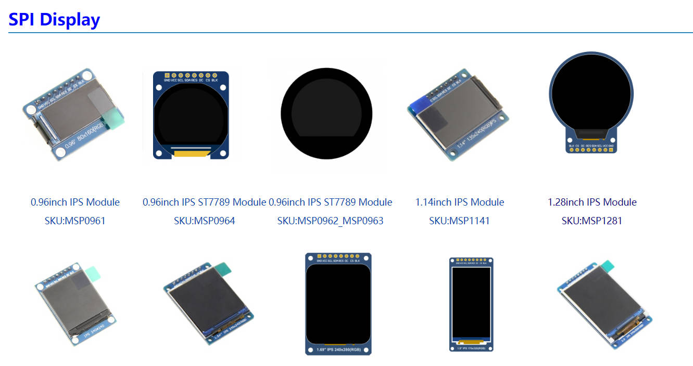
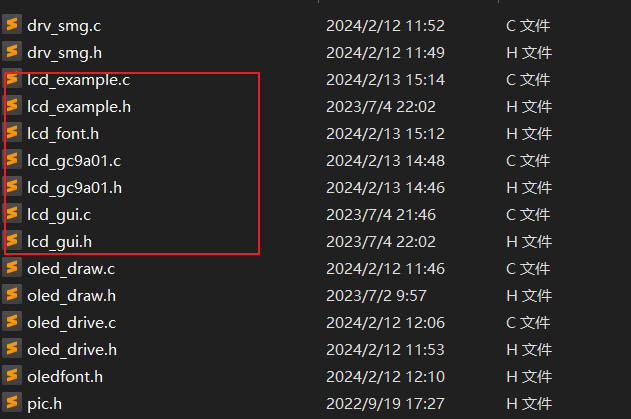
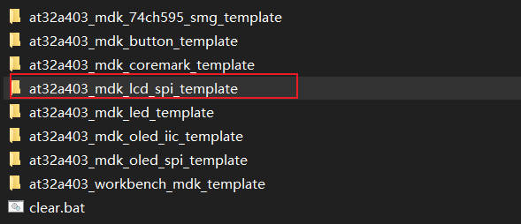
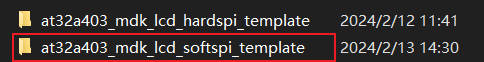
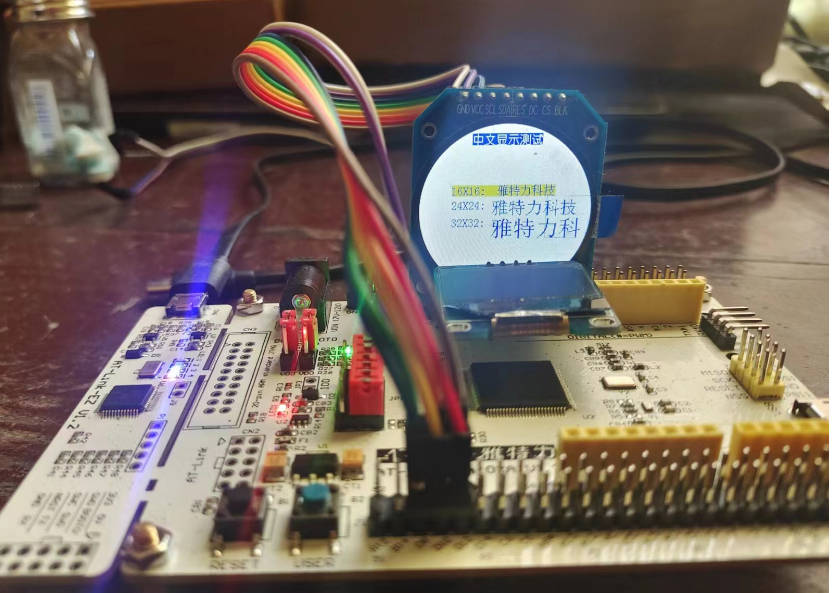
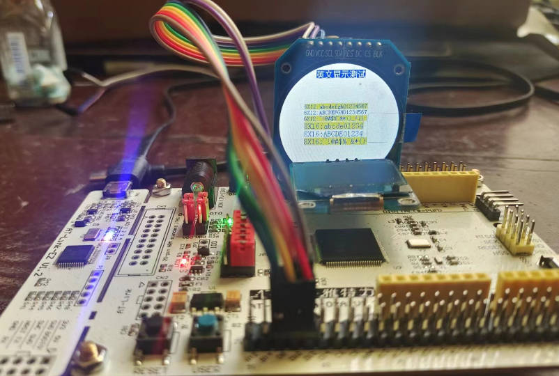
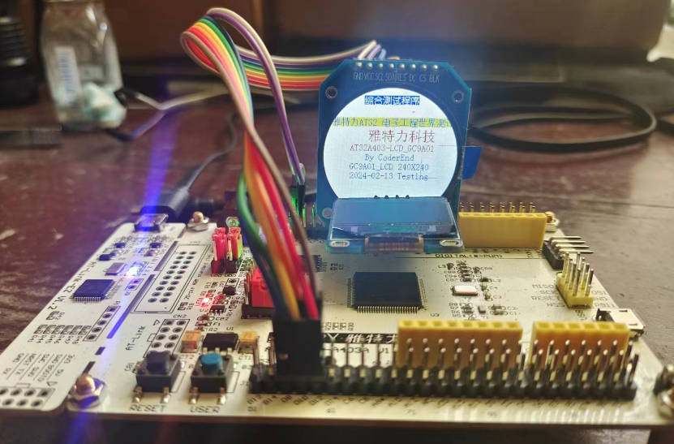

## 06-雅特力车规级MCU-AT32A403A开发板评测 GC9A01 SPI-LCD 1.28圆形屏幕 

### 硬件平台
1. AT32A403A Board开发板

2. 1.28寸圆形彩色TFT显示屏高清IPS 模块240X240 SPI接口GC9A01

   
### 产品介绍

推荐一个屏幕资料参考网站 http://www.lcdwiki.com/1.28inch_IPS_Module



- 1.28寸圆形IPS彩屏，支持 RGB 65K色显示，显示色彩丰富
- 240X240分辨率，显示清晰
- IPS全视角面板，超宽可视范围
- 采用4线制SPI串行总线，只需几个IO即可点亮
- 提供丰富的Arduino、STM32、C51以及MSP430示例程序
- 军工级工艺标准,长期稳定工作
- 提供底层驱动技术支持

### 产品参数
| 名称               | 参数                 |
| ------------------ | -------------------- |
| 显示颜色           | RGB 65K 彩色         |
| SKU                | MSP1281              |
| 尺寸               | 1.28(inch)           |
| 面板材质           | TFT                  |
| 驱动芯片           | GC9A01               |
| 分辨率             | 240*240 (Pixel)      |
| 显示接口           | 4-line SPI interface |
| 有效显示区域(AA区) | 直径：32.40 (mm)     |
| 触摸屏类型         | 无触摸屏             |
| 触摸IC             | 无触摸IC             |
| 模块PCB底板尺寸    | 38.03x45.80(mm)      |
| 视角               | 全角度               |
| 工作温度           | -10℃~60℃             |
| 存储温度           | -20℃~70℃             |
| 工作电压           | 3.3V                 |

### 接口定义

| 序号 | 模块引脚 | 引脚说明                                                     |
| ---- | -------- | ------------------------------------------------------------ |
| 1    | GND      | 液晶屏电源地                                                 |
| 2    | VCC      | 液晶屏电源正(3.3V/5V)                                        |
| 3    | SCL      | 液晶屏SPI总线时钟信号                                        |
| 4    | SDA      | 液晶屏SPI总线写数据信号                                      |
| 5    | RES      | 液晶屏复位控制信号（低电平复位，模块有复位电路，该引脚可不接） |
| 6    | DC       | 液晶屏寄存器/数据选择控制信号（低电平：寄存器，高电平：数据） |
| 7    | CS       | 液晶屏片选控制信号（低电平使能）                             |
| 8    | BLK      | 液晶屏背光控制信号（高电平点亮，如不需要控制，请接3.3V）     |

#### 模拟SPI移植LCD屏幕驱动

1. 建立工程模板，添加相关驱动文件

   ```c
   //lcd_gc9a01 硬件驱动层代码
   lcd_gc9a01.c
   lcd_gc9a01.h
   //lcd_gc9a01 软件应用层代码
   lcd_guic
   lcd_gui.h
   lcd_font.h
   //lcd_gc9a01 软件测试代码
   lcd_example.c
   lcd_example.h
   ```



2. 配置引脚
   选择引脚，进入工程开始编写屏幕引脚初始化代码。为了方便后续移植，我在**lcd_gc9a01.h**处宏定义了每一个引脚，后续根据需要进行修改即可。
   
```c
#define LCD_GPIO_PORT       GPIOD
#define LCD_GPIO_PORT_CLK   CRM_GPIOD_PERIPH_CLOCK

#define SCL_GPIO_PORT       GPIOD
#define SCL_GPIO_PIN        GPIO_PINS_8
#define SCL_GPIO_PORT_CLK   CRM_GPIOD_PERIPH_CLOCK

#define SDA_GPIO_PORT       GPIOD
#define SDA_GPIO_PIN        GPIO_PINS_9
#define SDA_GPIO_PORT_CLK   CRM_GPIOD_PERIPH_CLOCK

#define RES_GPIO_PORT       GPIOD
#define RES_GPIO_PIN        GPIO_PINS_10
#define RES_GPIO_PORT_CLK   CRM_GPIOD_PERIPH_CLOCK

#define DC_GPIO_PORT        GPIOD
#define DC_GPIO_PIN         GPIO_PINS_11
#define DC_GPIO_PORT_CLK    CRM_GPIOD_PERIPH_CLOCK

#define CS_GPIO_PORT        GPIOD
#define CS_GPIO_PIN         GPIO_PINS_12
#define CS_GPIO_PORT_CLK    CRM_GPIOD_PERIPH_CLOCK

#define BLK_GPIO_PORT        GPIOD
#define BLK_GPIO_PIN         GPIO_PINS_13
#define BLK_GPIO_PORT_CLK    CRM_GPIOD_PERIPH_CLOCK

```

3. 屏幕GPIO端口初始化配置

```c
void lcd_gpio_init(void)
{
  gpio_init_type gpio_init_struct;

  /* enable the gpioa clock */
  crm_periph_clock_enable(LCD_GPIO_PORT_CLK, TRUE);

  /* set default parameter */
  gpio_default_para_init(&gpio_init_struct);

  /* configure the gpio */
  gpio_init_struct.gpio_drive_strength = GPIO_DRIVE_STRENGTH_STRONGER;
  gpio_init_struct.gpio_out_type  = GPIO_OUTPUT_PUSH_PULL;
  gpio_init_struct.gpio_mode = GPIO_MODE_OUTPUT;
  gpio_init_struct.gpio_pins = SDA_GPIO_PIN |SCL_GPIO_PIN|RES_GPIO_PIN|DC_GPIO_PIN|CS_GPIO_PIN|BLK_GPIO_PIN;
  gpio_init_struct.gpio_pull = GPIO_PULL_NONE;
  gpio_init(LCD_GPIO_PORT, &gpio_init_struct);
    
}
```


4. SPI 接口宏定义设置

```c
#define	SPI_SCLK_SET    gpio_bits_set(SCL_GPIO_PORT,SCL_GPIO_PIN)
#define	SPI_SCLK_CLR    gpio_bits_reset(SCL_GPIO_PORT,SCL_GPIO_PIN)

#define	SPI_MOSI_SET    gpio_bits_set(SDA_GPIO_PORT,SDA_GPIO_PIN)
#define	SPI_MOSI_CLR    gpio_bits_reset(SDA_GPIO_PORT,SDA_GPIO_PIN)
   


#define	LCD_RES_SET     gpio_bits_set(RES_GPIO_PORT,RES_GPIO_PIN)
#define	LCD_RES_CLR     gpio_bits_reset(RES_GPIO_PORT,RES_GPIO_PIN)

#define	LCD_DC_SET      gpio_bits_set(DC_GPIO_PORT,DC_GPIO_PIN)
#define	LCD_DC_CLR      gpio_bits_reset(DC_GPIO_PORT,DC_GPIO_PIN)

#define	LCD_CS_SET      gpio_bits_set(CS_GPIO_PORT,CS_GPIO_PIN)
#define	LCD_CS_CLR      gpio_bits_reset(CS_GPIO_PORT,CS_GPIO_PIN)

#define	LCD_BLK_SET     gpio_bits_set(BLK_GPIO_PORT,BLK_GPIO_PIN) 
#define	LCD_BLK_CLR     gpio_bits_reset(BLK_GPIO_PORT,BLK_GPIO_PIN) 

```

5. 软件SPI代码实现

   ```C
   /*****************************************************************************
    * @name       :void  SPI_WriteByte(uint8_t Data)
    * @function   :Write a byte of data using STM32's Software SPI
    * @parameters :Data:Data to be written
    * @retvalue   :None
   ******************************************************************************/
   void SPI_WriteByte(uint8_t Data)
   {
   	unsigned char i=0;
   	for(i=8;i>0;i--)
   	{
   	  if(Data&0x80)	
   			SPI_MOSI_SET; //输出数据
       else
   		  SPI_MOSI_CLR;
         SPI_SCLK_CLR;       
         SPI_SCLK_SET;
         Data<<=1; 
   	}
   }
   
   /*****************************************************************************
    * @name       :void LCD_WR_REG(uint8_t data)
    * @function   :Write an 8-bit command to the LCD screen
    * @parameters :data:Command value to be written
    * @retvalue   :None
   ******************************************************************************/
   void LCD_WR_REG(uint8_t data)
   { 
      LCD_CS_CLR;     
      LCD_DC_CLR;	  
      SPI_WriteByte(data);
      LCD_CS_SET;	
   }
   
   /*****************************************************************************
    * @name       :void LCD_WR_DATA(uint8_t data)
    * @function   :Write an 8-bit data to the LCD screen
    * @parameters :data:data value to be written
    * @retvalue   :None
   ******************************************************************************/
   void LCD_WR_DATA(uint8_t data)
   {
      LCD_CS_CLR;
      LCD_DC_SET;
      SPI_WriteByte(data);
      LCD_CS_SET;
   }
   ```

   如果传输的数据位为1，则将SPI数据引脚拉高；传输的数据位为0，则将SPI数据引脚拉低。每次传输一个字节数据，高位在前，每个时钟上升沿传输1位数据。

6. LCD初始化函数

  ```c
  /*****************************************************************************
   * @name       :void LCD_Init(void)
   * @date       :2018-08-09 
   * @function   :Initialization LCD screen
   * @parameters :None
   * @retvalue   :None
  ******************************************************************************/	 	 
  void LCD_Init(void)
  {  
  	lcd_gpio_init();								 
   	LCD_RESET(); //LCD 复位
  //************* GC9A01初始化**********//	
   	LCD_WR_REG(0xEF);
  	LCD_WR_REG(0xEB);
  	LCD_WR_DATA(0x14); 
  	
    	LCD_WR_REG(0xFE);			 
  	LCD_WR_REG(0xEF); 
  
  	LCD_WR_REG(0xEB);	
  	LCD_WR_DATA(0x14); 
  
  	LCD_WR_REG(0x84);			
  	LCD_WR_DATA(0x40); 
  
  	LCD_WR_REG(0x85);			
  	LCD_WR_DATA(0xFF); 
  
  	LCD_WR_REG(0x86);			
  	LCD_WR_DATA(0xFF); 
  
  	LCD_WR_REG(0x87);			
  	LCD_WR_DATA(0xFF);
  
  	LCD_WR_REG(0x88);			
  	LCD_WR_DATA(0x0A);
  
  	LCD_WR_REG(0x89);			
  	LCD_WR_DATA(0x21); 
  
  	LCD_WR_REG(0x8A);			
  	LCD_WR_DATA(0x00); 
  
  	LCD_WR_REG(0x8B);			
  	LCD_WR_DATA(0x80); 
  
  	LCD_WR_REG(0x8C);			
  	LCD_WR_DATA(0x01); 
  
  	LCD_WR_REG(0x8D);			
  	LCD_WR_DATA(0x01); 
  
  	LCD_WR_REG(0x8E);			
  	LCD_WR_DATA(0xFF); 
  
  	LCD_WR_REG(0x8F);			
  	LCD_WR_DATA(0xFF); 
  
  
  	LCD_WR_REG(0xB6);
  	LCD_WR_DATA(0x00);
  	LCD_WR_DATA(0x20);
  
  	LCD_WR_REG(0x36);
  	LCD_WR_DATA(0x08);
  	
  	LCD_WR_REG(0x3A);			
  	LCD_WR_DATA(0x05); 
  
  
  	LCD_WR_REG(0x90);			
  	LCD_WR_DATA(0x08);
  	LCD_WR_DATA(0x08);
  	LCD_WR_DATA(0x08);
  	LCD_WR_DATA(0x08); 
  
  	LCD_WR_REG(0xBD);			
  	LCD_WR_DATA(0x06);
  	
  	LCD_WR_REG(0xBC);			
  	LCD_WR_DATA(0x00);	
  
  	LCD_WR_REG(0xFF);			
  	LCD_WR_DATA(0x60);
  	LCD_WR_DATA(0x01);
  	LCD_WR_DATA(0x04);
  
  	LCD_WR_REG(0xC3);			
  	LCD_WR_DATA(0x13);
  	LCD_WR_REG(0xC4);			
  	LCD_WR_DATA(0x13);
  
  	LCD_WR_REG(0xC9);			
  	LCD_WR_DATA(0x22);
  
  	LCD_WR_REG(0xBE);			
  	LCD_WR_DATA(0x11); 
  
  	LCD_WR_REG(0xE1);			
  	LCD_WR_DATA(0x10);
  	LCD_WR_DATA(0x0E);
  
  	LCD_WR_REG(0xDF);			
  	LCD_WR_DATA(0x21);
  	LCD_WR_DATA(0x0c);
  	LCD_WR_DATA(0x02);
  
  	LCD_WR_REG(0xF0);   
  	LCD_WR_DATA(0x45);
  	LCD_WR_DATA(0x09);
  	LCD_WR_DATA(0x08);
  	LCD_WR_DATA(0x08);
  	LCD_WR_DATA(0x26);
   	LCD_WR_DATA(0x2A);
  
   	LCD_WR_REG(0xF1);    
   	LCD_WR_DATA(0x43);
   	LCD_WR_DATA(0x70);
   	LCD_WR_DATA(0x72);
   	LCD_WR_DATA(0x36);
   	LCD_WR_DATA(0x37);  
   	LCD_WR_DATA(0x6F);
  
  
   	LCD_WR_REG(0xF2);   
   	LCD_WR_DATA(0x45);
   	LCD_WR_DATA(0x09);
   	LCD_WR_DATA(0x08);
   	LCD_WR_DATA(0x08);
   	LCD_WR_DATA(0x26);
   	LCD_WR_DATA(0x2A);
  
   	LCD_WR_REG(0xF3);   
   	LCD_WR_DATA(0x43);
   	LCD_WR_DATA(0x70);
   	LCD_WR_DATA(0x72);
   	LCD_WR_DATA(0x36);
   	LCD_WR_DATA(0x37); 
   	LCD_WR_DATA(0x6F);
  
  	LCD_WR_REG(0xED);	
  	LCD_WR_DATA(0x1B); 
  	LCD_WR_DATA(0x0B); 
  
  	LCD_WR_REG(0xAE);			
  	LCD_WR_DATA(0x77);
  	
  	LCD_WR_REG(0xCD);			
  	LCD_WR_DATA(0x63);		
  
  
  	LCD_WR_REG(0x70);			
  	LCD_WR_DATA(0x07);
  	LCD_WR_DATA(0x07);
  	LCD_WR_DATA(0x04);
  	LCD_WR_DATA(0x0E); 
  	LCD_WR_DATA(0x0F); 
  	LCD_WR_DATA(0x09);
  	LCD_WR_DATA(0x07);
  	LCD_WR_DATA(0x08);
  	LCD_WR_DATA(0x03);
  
  	LCD_WR_REG(0xE8);			
  	LCD_WR_DATA(0x34);
  
  	LCD_WR_REG(0x62);			
  	LCD_WR_DATA(0x18);
  	LCD_WR_DATA(0x0D);
  	LCD_WR_DATA(0x71);
  	LCD_WR_DATA(0xED);
  	LCD_WR_DATA(0x70); 
  	LCD_WR_DATA(0x70);
  	LCD_WR_DATA(0x18);
  	LCD_WR_DATA(0x0F);
  	LCD_WR_DATA(0x71);
  	LCD_WR_DATA(0xEF);
  	LCD_WR_DATA(0x70); 
  	LCD_WR_DATA(0x70);
  
  	LCD_WR_REG(0x63);			
  	LCD_WR_DATA(0x18);
  	LCD_WR_DATA(0x11);
  	LCD_WR_DATA(0x71);
  	LCD_WR_DATA(0xF1);
  	LCD_WR_DATA(0x70); 
  	LCD_WR_DATA(0x70);
  	LCD_WR_DATA(0x18);
  	LCD_WR_DATA(0x13);
  	LCD_WR_DATA(0x71);
  	LCD_WR_DATA(0xF3);
  	LCD_WR_DATA(0x70); 
  	LCD_WR_DATA(0x70);
  
  	LCD_WR_REG(0x64);			
  	LCD_WR_DATA(0x28);
  	LCD_WR_DATA(0x29);
  	LCD_WR_DATA(0xF1);
  	LCD_WR_DATA(0x01);
  	LCD_WR_DATA(0xF1);
  	LCD_WR_DATA(0x00);
  	LCD_WR_DATA(0x07);
  
  	LCD_WR_REG(0x66);			
  	LCD_WR_DATA(0x3C);
  	LCD_WR_DATA(0x00);
  	LCD_WR_DATA(0xCD);
  	LCD_WR_DATA(0x67);
  	LCD_WR_DATA(0x45);
  	LCD_WR_DATA(0x45);
  	LCD_WR_DATA(0x10);
  	LCD_WR_DATA(0x00);
  	LCD_WR_DATA(0x00);
  	LCD_WR_DATA(0x00);
  
  	LCD_WR_REG(0x67);			
  	LCD_WR_DATA(0x00);
  	LCD_WR_DATA(0x3C);
  	LCD_WR_DATA(0x00);
  	LCD_WR_DATA(0x00);
  	LCD_WR_DATA(0x00);
  	LCD_WR_DATA(0x01);
  	LCD_WR_DATA(0x54);
  	LCD_WR_DATA(0x10);
  	LCD_WR_DATA(0x32);
  	LCD_WR_DATA(0x98);
  
  	LCD_WR_REG(0x74);			
  	LCD_WR_DATA(0x10);	
  	LCD_WR_DATA(0x85);	
  	LCD_WR_DATA(0x80);
  	LCD_WR_DATA(0x00); 
  	LCD_WR_DATA(0x00); 
  	LCD_WR_DATA(0x4E);
  	LCD_WR_DATA(0x00);					
  	
      LCD_WR_REG(0x98);			
  	LCD_WR_DATA(0x3e);
  	LCD_WR_DATA(0x07);
  
  	LCD_WR_REG(0x35);	
  	LCD_WR_REG(0x21);
  
  	LCD_WR_REG(0x11); 
  	delay_ms(120); 
  
  	LCD_WR_REG(0x29); 	
      LCD_direction(USE_HORIZONTAL);//设置LCD显示方向
  	LCD_BLK_SET;//点亮背光	 
  	LCD_Clear(WHITE);//清全屏白色
  }
  ```

  

7. 驱动完整代码见仓库代码

  

  
### 屏幕测试

1. 主程序

```c
#include "main.h"

/**
  * @brief  main function.
  * @param  none
  * @retval none
  */
int main(void)
{
//  unsigned char count_num; 
  system_clock_config();
  at32_board_init();
  uart_print_init(115200);
  module_smg_gpio_iint();
  LCD_Init();
  /* output a message on hyperterminal using printf function */
  //printf("usart printf example: retarget the c library printf function to the usart\r\n");
  printf("Hardware_Init [ok] \r\n");
  printf("at_start_a403a board testing 2024-02-13\r\n");
  printf("at_start_a403a board module softspi lcd \r\n");
 
  
  while(1)
  {
       printf("lcd_example_test [start] \r\n");
       main_test(); 		   
	   menu_test();			   
       English_Font_test();     
       Chinese_Font_test();    
   
       printf("lcd_example_test [end] \r\n"); 
  }
}

```

2. 测试效果

   

   

