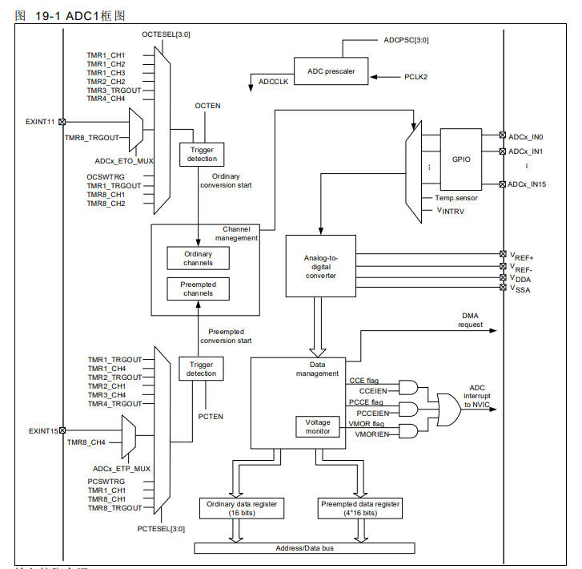
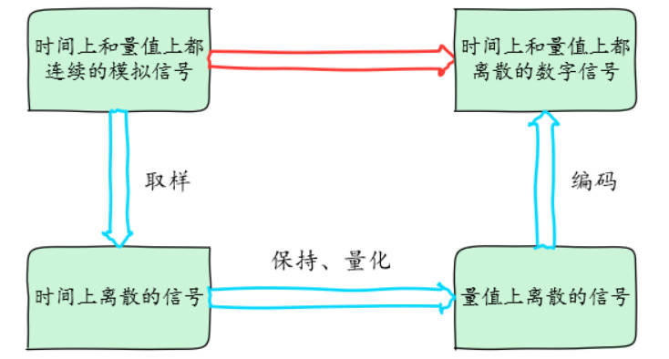
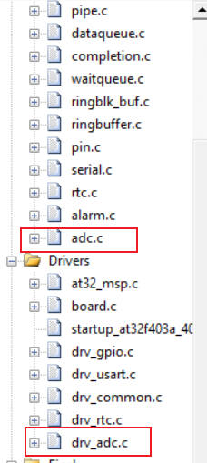
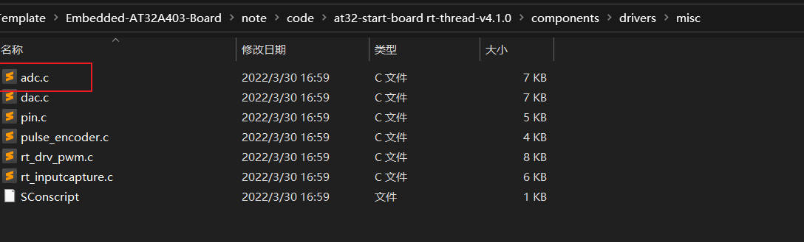
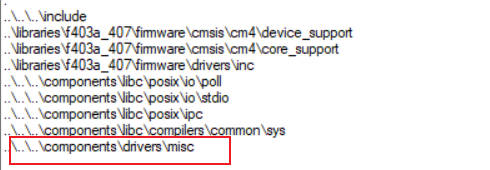
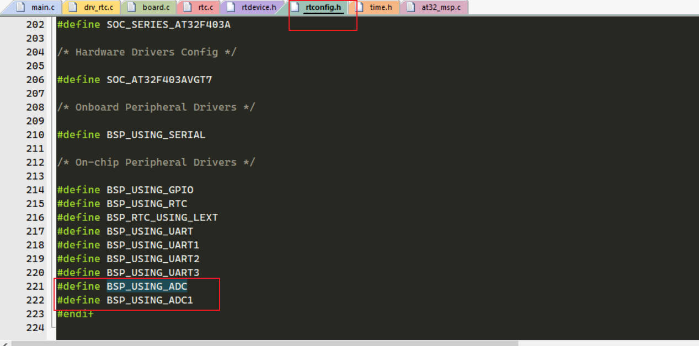
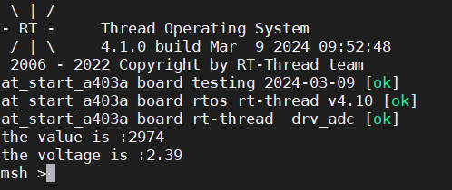
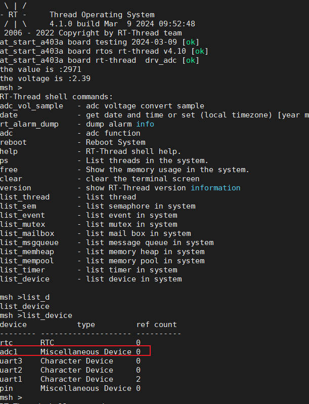
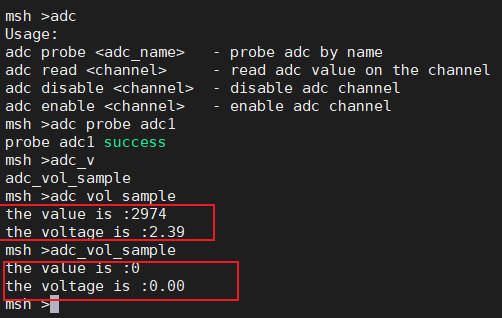

## 9  雅特力AT32A403开发板评测 ADC外设测试案例 RT-Thread ADC设备驱动测试

###  1. 软硬件平台

1. AT32A403A Board开发板

2. MDK-ARM Keil

3. RT-Thread V4.1版本源码

4. ADC

   

### 2. ADC

ADC(Analog-to-Digital Converter) 指模数转换器。是指将连续变化的模拟信号转换为离散的数字信号的器件。真实世界的模拟信号，例如温度、压力、声音或者图像等，需要转换成更容易储存、处理和发射的数字形式。模数转换器可以实现这个功能，在各种不同的产品中都可以找到它的身影。

AT32A403A系列产品，内嵌3个12位的模拟/数字转换器（ADC），共享多达16个外部通道，可以实 现单次或序列转换。在序列模式下，自动进行在选定的一组模拟输入上的转换。 

ADC接口上的其它逻辑功能包括： 

- 同时的采样和保持 
- 位移的采样和保持 
-  单次采样



输入管脚介绍： 

VDDA ：模拟电源，ADC 模拟电源 

 VSSA ：模拟电源地，ADC 模拟电源地 

 VREF+ ：模拟参考正极，ADC 使用的高端/正极模拟参考电压 

VREF- ：模拟参考负极，ADC 使用的低端/负极参考电压

 ADCx_IN ：模拟输入信号通道

#### 转换过程

如下图所示模数转换一般要经过采样、保持和量化、编码这几个步骤。在实际电路中，有些过程是合并进行的，如采样和保持，量化和编码在转换过程中是同时实现的。



采样是将时间上连续变化的模拟信号转换为时间上离散的模拟信号。采样取得的模拟信号转换为数字信号都需要一定时间，为了给后续的量化编码过程提供一个稳定的值，在采样电路后要求将所采样的模拟信号保持一段时间。

将数值连续的模拟量转换为数字量的过程称为量化。数字信号在数值上是离散的。采样保持电路的输出电压还需要按照某种近似方式归化到与之相应的离散电平上，任何数字量只能是某个最小数量单位的整数倍。量化后的数值最后还需要编码过程，也就是 A/D 转换器输出的数字量。

#### 分辨率

分辨率以二进制（或十进制）数的位数来表示，一般有8位、10位、12位、16位等，它说明模数转换器对输入信号的分辨能力，位数越多，表示分辨率越高，恢复模拟信号时会更精确。

#### 精度

精度表示 ADC 器件在所有的数值点上对应的模拟值和真实值之间的最大误差值，也就是输出数值偏离线性最大的距离。

注：精度与分辨率是两个不一样的概念，请注意区分。

#### 转换速率

转换速率是指 A/D 转换器完成一次从模拟到数字的 AD 转换所需时间的倒数。例如，某 A/D 转换器的转换速率为 1MHz，则表示完成一次 AD 转换时间为 1 微秒。

#### 3. RT-Thread 访问 ADC 设备 API接口

应用程序通过 RT-Thread 提供的 ADC 设备管理接口来访问 ADC 硬件，相关接口如下所示：

**find read wirte close open这些操作都是类似linux中的操作，一切都是文件**

| **函数**         | **描述**                              |
| ---------------- | ------------------------------------- |
| rt_device_find() | 根据 ADC 设备名称查找设备获取设备句柄 |
| rt_adc_enable()  | 使能 ADC 设备                         |
| rt_adc_read()    | 读取 ADC 设备数据                     |
| rt_adc_disable() | 关闭 ADC 设备                         |

### 4. RT-Thread ADC设备驱动测试

1. 在RT-Thread工程模板下，添加相关adc驱动

   

   

2. 添加相关头文件

   

3. 添加宏定义

   

4. 添加ADC测试案例代码

   https://www.rt-thread.org/document/site/#/rt-thread-version/rt-thread-standard/programming-manual/device/adc/adc?id=adc-%e7%ae%80%e4%bb%8b

   ```c
   #include <rtthread.h>
   #include <rtdevice.h>
   #include "board.h"
   #include "drv_gpio.h"
   #include "drv_adc.h"
   
   
   #define ADC_DEV_NAME        "adc1"      /* ADC 设备名称 */
   #define ADC_DEV_CHANNEL     5           /* ADC 通道 */
   #define REFER_VOLTAGE       330         /* 参考电压 3.3V,数据精度乘以100保留2位小数*/
   #define CONVERT_BITS        (1 << 12)   /* 转换位数为12位 */
   
   static int adc_vol_sample()
   {
    rt_adc_device_t adc_dev;
    rt_uint32_t value, vol;
    rt_err_t ret = RT_EOK;
    /* 查找设备 */
    adc_dev = (rt_adc_device_t)rt_device_find(ADC_DEV_NAME);
    if (adc_dev == RT_NULL)
    {
    rt_kprintf("adc sample run failed! can't find %s device!\n", ADC_DEV_NAME);
    return RT_ERROR;
    }
    /* 使能设备 */
    ret = rt_adc_enable(adc_dev, ADC_DEV_CHANNEL);
    /* 读取采样值 */
    value = rt_adc_read(adc_dev, ADC_DEV_CHANNEL);
    rt_kprintf("the value is :%d \n", value);
    /* 转换为对应电压值,3.3V对应12位最大值4096,数据精度乘以100保留2位小数 */
    vol = value * 330 / 4096;
    rt_kprintf("the voltage is :%d.%02d \n", vol / 100, vol % 100);
    /* 关闭通道 */
    ret = rt_adc_disable(adc_dev, ADC_DEV_CHANNEL);
    return ret;
   }
   /* 导出到 msh 命令列表中 */
   MSH_CMD_EXPORT(adc_vol_sample, adc voltage convert sample);
   
   int main()
   {
   
       rt_kprintf("at_start_a403a board testing 2024-03-09 [ok]\r\n");
       rt_kprintf("at_start_a403a board rtos rt-thread v4.10 [ok] \r\n");
       rt_kprintf("at_start_a403a board rt-thread  drv_adc [ok] \r\n");
       adc_vol_sample();
   }
   
   ```

5. 测试效果

   1. 开机效果

      

   2. ADC设备

      

   3. 把PA5(ADC1 通道5)接到GND，然后拔掉

      

      