## 10  雅特力AT32A403开发板评测 RTC外设测试案例 RT-Thread RTC设备驱动测试

###  1. 软硬件平台

1. AT32A403A Board开发板

2. MDK-ARM Keil

3. RT-Thread V4.1版本源码

4. RTC

   

### 2. RTC

​	RTC 计数逻辑位于电池供电域，内部为一个 32 位递增计数器，只要电池供电域有电，RTC 便会一 直运行，不受系统复位以及 VDD 掉电影响，RTC 主要具有以下功能： 

1. 日历功能：32 位计数器，通过转换得到年、月、日、时、分、秒 
2. 闹钟功能 
3. 入侵检测功能
4.  校准功能

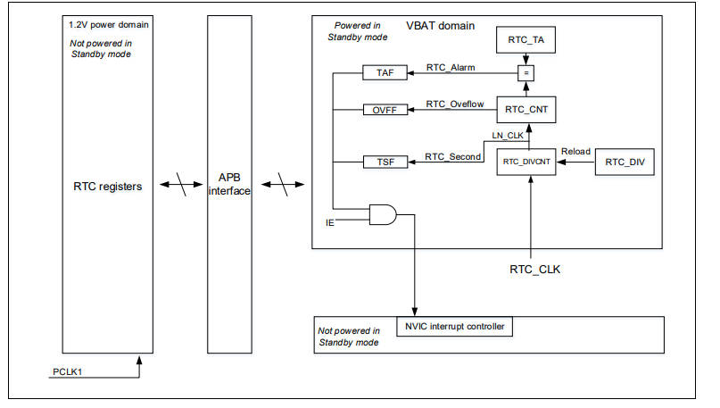

#### RTC日历功能

​	RTC 内部是一个 32 位的计数器，通常使用中该计数器 1 秒增加 1，也就是该计数器相当于秒钟，然 后根据当前的秒钟值，通过转换得到年、月、日、星期、时、分、秒，实现日历的功能，修改计数器 的值便可修改时间和日期。根据使用需要还可以产生秒中断：若秒中断使能（TSIEN=1），每隔一秒产生一个秒中断。

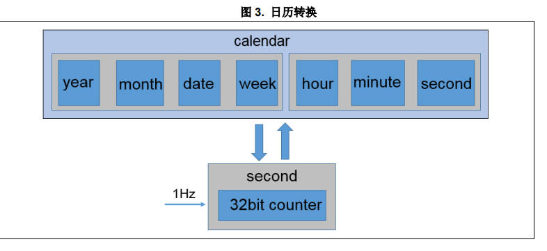

秒钟转换成日历 先规定一个起始时间，例如 1970-1-1 00:00:00 对应计数器为 0，现在比如计数值为 200000，那么 换算成时间为： 

- 天数：200000 / 86400 = 2 
- 小时：(200000 % 86400) / 3600= 7
-  分钟：(200000 % 3600) / 60= 33 
- 秒钟：200000 % 60 = 20

#####   设置日历值（日历转换成秒钟）

```c
/**
  * @brief  set time. convert the input clock to a second.
  *         the time basic : 1970.1.1
  *         legitimate year: 1970 ~ 2099
  * @param  calendar
  * @retval 0: set time right.
  *         1: set time failed.
  */
uint8_t rtc_time_set(calendar_type *calendar)
{
  uint32_t t;
  uint32_t seccount = 0;

  if(calendar->year < 1970 || calendar->year > 2099)
  {
    return 1;
  }

  for(t = 1970; t < calendar->year; t++)
  {
    if(is_leap_year(t))
    {
      seccount += 31622400;
    }
    else
    {
      seccount += 31536000;
    }
  }

  calendar->month -= 1;

  for(t = 0; t < calendar->month; t++)
  {
    seccount += (uint8_t)mon_table[t] * 86400;

    if(is_leap_year(calendar->year) && t == 1)
    {
      seccount += 86400;
    }
  }

  seccount += (uint8_t)(calendar->date - 1) * 86400;

  seccount += (uint8_t)calendar->hour * 3600;

  seccount += (uint8_t)calendar->min * 60;

  seccount += calendar->sec;

  /* enable pwc and bpr clocks */
  crm_periph_clock_enable(CRM_PWC_PERIPH_CLOCK, TRUE);
  crm_periph_clock_enable(CRM_BPR_PERIPH_CLOCK, TRUE);

  /* enable write access to bpr domain */
  pwc_battery_powered_domain_access(TRUE);

  /* set the rtc counter value */
  rtc_counter_set(seccount);

  /* wait for the register write to complete */
  rtc_wait_config_finish();

  return 0;
}
```

### 3. 软件设计流程

1.  开启 PWC、BPR 时钟 
2. 解锁电池供电域写保护 
3. 检查日历是否已经初始化，如果正确就跳过初始化，如果不正确就初始化日历以及闹钟  （初始化日历时间 2024-03-06 19:40:00）
4.  主函数里每秒打印一次日历信息 
5. 在 2024-03-06 19:40:15 时刻发生闹钟，串口进行打印并且LED亮。

```c
#include "main.h"
void oled_example(void)
{

    //OLED 汉字显示 雅特力科技
      OLED_ShowCHinese(0,0,13);
      OLED_ShowCHinese(16,0,14);
      OLED_ShowCHinese(32,0,15);
      OLED_ShowCHinese(48,0,16);
      OLED_ShowCHinese(64,0,17);
      OLED_ShowString_08x16(96,0,"RTC");
    
}  

char *weekday_table[7] = { "Sunday", "Monday", "Tuesday", "Wednesday", "Thursday", "Friday", "Saturday"};
/**
  * @brief  init alarm.
  * @param  none
  * @retval none
  */
void alarm_init(void)
{
  calendar_type alarm_struct;

  /* clear alarm flag */
  rtc_flag_clear(RTC_TA_FLAG);

  /* wait for the register write to complete */
  rtc_wait_config_finish();

  /* configure and enable rtc interrupt */
  nvic_irq_enable(RTC_IRQn, 0, 0);

  /* enable alarm interrupt */
  rtc_interrupt_enable(RTC_TA_INT, TRUE);

  /* wait for the register write to complete */
  rtc_wait_config_finish();

  /* config alarm */

  alarm_struct.year  = 2024;
  alarm_struct.month = 3;
  alarm_struct.date  = 6;
  alarm_struct.hour  = 19;
  alarm_struct.min   = 40;
  alarm_struct.sec   = 15;

  rtc_alarm_clock_set(&alarm_struct);
}
/**
  * @brief  main function.
  * @param  none
  * @retval none
  */
int main(void)
{
//  unsigned char count_num; 
  calendar_type time_struct;

  /* config nvic priority group */
  nvic_priority_group_config(NVIC_PRIORITY_GROUP_4);
  system_clock_config();
  at32_board_init();
  uart_print_init(115200);
  oled_init();
    
  /* config init calendar */
  time_struct.year  = 2024;
  time_struct.month = 3;
  time_struct.date  = 6;
  time_struct.hour  = 19;
  time_struct.min   = 40;
  time_struct.sec   = 0;
  rtc_init(&time_struct);

  /* config alarm */
  alarm_init();

  printf("initial ok\r\n");
  
  printf("Hardware_Init [ok] \r\n");
  printf("at_start_a403a board testing 2024-03-06\r\n");
  printf("at_start_a403a board module softiic oled \r\n");
  OLED_Clear();
  printf("rtc_oled_example_test [ok] \r\n");
  oled_example();
  
  while(1)
  {
    if(rtc_flag_get(RTC_TS_FLAG) != RESET)
    {
      at32_led_toggle(LED3);

      /* get time */
      rtc_time_get();

      /* print time */
      printf("%d/%d/%d ", calendar.year, calendar.month, calendar.date);
      printf("%02d:%02d:%02d %s\r\n", calendar.hour, calendar.min, calendar.sec, weekday_table[calendar.week]);
      OLED_ShowNumber_UnsignedInteger_08x16(0,2,calendar.year,4);
      OLED_ShowString_08x16(32,2,"-");
      OLED_ShowNumber_UnsignedInteger_08x16(40,2,calendar.month,2);
      OLED_ShowString_08x16(56,2,"-");
      OLED_ShowNumber_UnsignedInteger_08x16(64,2,calendar.date,2);
      OLED_ShowNumber_UnsignedInteger_08x16(0,4,calendar.hour,2);
      OLED_ShowString_08x16(16,4,":");
      OLED_ShowNumber_UnsignedInteger_08x16(24,4,calendar.min,2);
      OLED_ShowString_08x16(40,4,":");
      OLED_ShowNumber_UnsignedInteger_08x16(48,4,calendar.sec,2);
      OLED_ShowString_08x16(32,6,weekday_table[calendar.week]);
      /* wait for the register write to complete */
      rtc_wait_config_finish();

      /* clear the rtc second flag */
      rtc_flag_clear(RTC_TS_FLAG);

      /* wait for the register write to complete */
      rtc_wait_config_finish();
    }
  }
}


```

### 4.测试效果

1. 闹钟定时效果

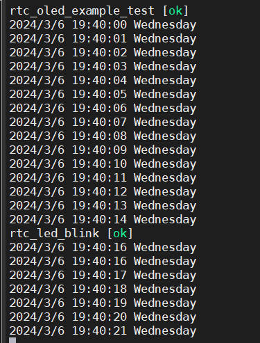

2. 复位重启，时间继续进行（恢复原始状态，需要断电）

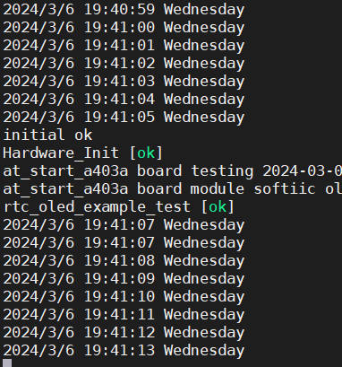

3. OLED模块显示效果

   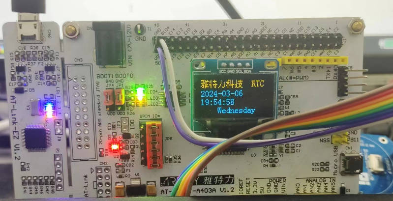

### 5.RT-Thread RTC设备驱动测试

RT-Thread 提供了一套简单的 I/O 设备模型框架，如下图所示，它位于硬件和应用程序之间，共分成三层，从上到下分别是 I/O 设备管理层、设备驱动框架层、设备驱动层。本质上设备驱动框架层、设备驱动层都是都是对于原本的库函数进行二次封装，最后提供一个统一的API接口共应用层开发。在本文使用了RTC设备。

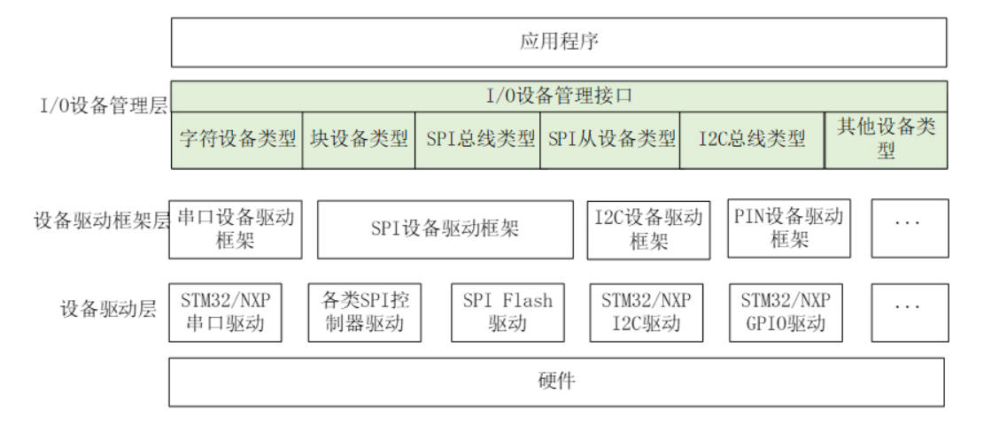

RTC （Real-Time Clock）实时时钟可以提供精确的实时时间，它可以用于产生年、月、日、时、分、秒等信息。目前实时时钟芯片大多采用精度较高的晶体振荡器作为时钟源。有些时钟芯片为了在主电源掉电时还可以工作，会外加电池供电，使时间信息一直保持有效。

RT-Thread 的 RTC设备为操作系统的时间系统提供了基础服务。面对越来越多的 IoT 场景，RTC 已经成为产品的标配，甚至在诸如 SSL 的安全传输过程中，RTC 已经成为不可或缺的部分。

#### 访问 RTC 设备

在开启 RTC 设备框架以及 RTC 驱动之后，用户可以 `#include <sys/time.h>` 用来引用标准的时间操作函数（例如 time、ctime、stime、mktime等，具体使用方法可以百度）。在Unix系统或者Windows系统下怎么使用 `<time.h>` 里边的函数，在RT-Thread下就怎么使用。**建议用户采用[标准库时间函数](https://www.rt-thread.org/document/site/#/rt-thread-version/rt-thread-standard/programming-manual/libc/iso-ansi-c?id=5-时间函数)来操作 RTC。**

1. 在RT-Thread工程模板下，添加相关RTC驱动

   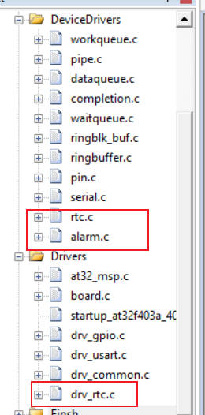

2. 添加相关头文件，重点是time.h的添加，如果不添加，会调用MDK提供的底层库，但是会报错

   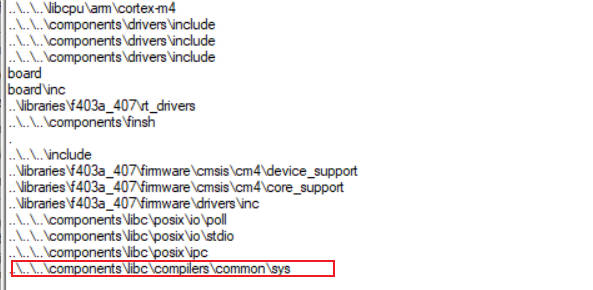

   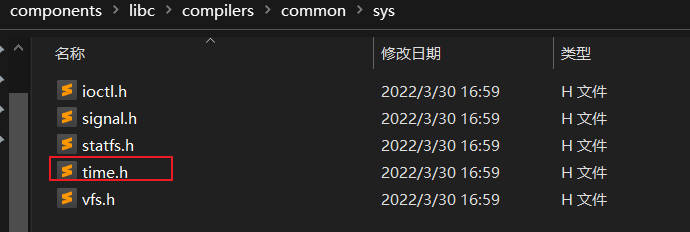

3. 添加RTC测试案例代码

   ```c
   #include <rtthread.h>
   #include <rtdevice.h>
   #include "board.h"
   #include "drv_gpio.h"
   
   
   
   #define RTC_NAME       "rtc"
   
   int main()
   {
       rt_err_t ret = RT_EOK;
       time_t now;
       rt_device_t device = RT_NULL;
   
       /* 寻找设备 */
       device = rt_device_find(RTC_NAME);
       if (!device)
       {
           rt_kprintf("find %s failed!", RTC_NAME);
           return RT_ERROR;
       }
   
       /* 初始化RTC设备 */
       if(rt_device_open(device, 0) != RT_EOK)
       {
           rt_kprintf("open %s failed!", RTC_NAME);
           return RT_ERROR;
       }
   
       /* 设置日期 */
       ret = set_date(2024, 3, 6);
       if (ret != RT_EOK)
       {
           rt_kprintf("set RTC date failed\n");
           return ret;
       }
   
       /* 设置时间 */
       ret = set_time(17, 43, 00);
       if (ret != RT_EOK)
       {
           rt_kprintf("set RTC time failed\n");
           return ret;
       }
   
       /* 获取时间 */
       now = time(RT_NULL);
       rt_kprintf("%s\n", ctime(&now));
   
       /* 延时1秒 */
       rt_thread_mdelay(1000);
   
       /* 获取时间 */
       now = time(RT_NULL);
       rt_kprintf("%s\n", ctime(&now));
   
       return ret;
   }
   
   void user_alarm_callback(rt_alarm_t alarm, time_t timestamp)
   {
       rt_kprintf("user alarm callback function.\n");
   }
   
   void alarm_sample(void)
   {  
       struct rt_alarm_setup setup;
       struct rt_alarm * alarm = RT_NULL;
       static time_t now;
       struct tm p_tm;
   
       if (alarm != RT_NULL)
           return;
   
       /* 获取当前时间戳，并把下5秒时间设置为闹钟时间 */
       now = time(NULL) + 5;
       gmtime_r(&now,&p_tm);
   
       setup.flag = RT_ALARM_ONESHOT;            
       setup.wktime.tm_year = p_tm.tm_year;
       setup.wktime.tm_mon = p_tm.tm_mon;
       setup.wktime.tm_mday = p_tm.tm_mday;
       setup.wktime.tm_wday = p_tm.tm_wday;
       setup.wktime.tm_hour = p_tm.tm_hour;
       setup.wktime.tm_min = p_tm.tm_min;
       setup.wktime.tm_sec = p_tm.tm_sec;   
   
       alarm = rt_alarm_create(user_alarm_callback, &setup);    
       if(RT_NULL != alarm)
       {
           rt_alarm_start(alarm);
       }
   }
   /* export msh cmd */
   MSH_CMD_EXPORT(alarm_sample,alarm sample);
   
   
   ```

   4. 测试效果（利用FINSH进行调试）

      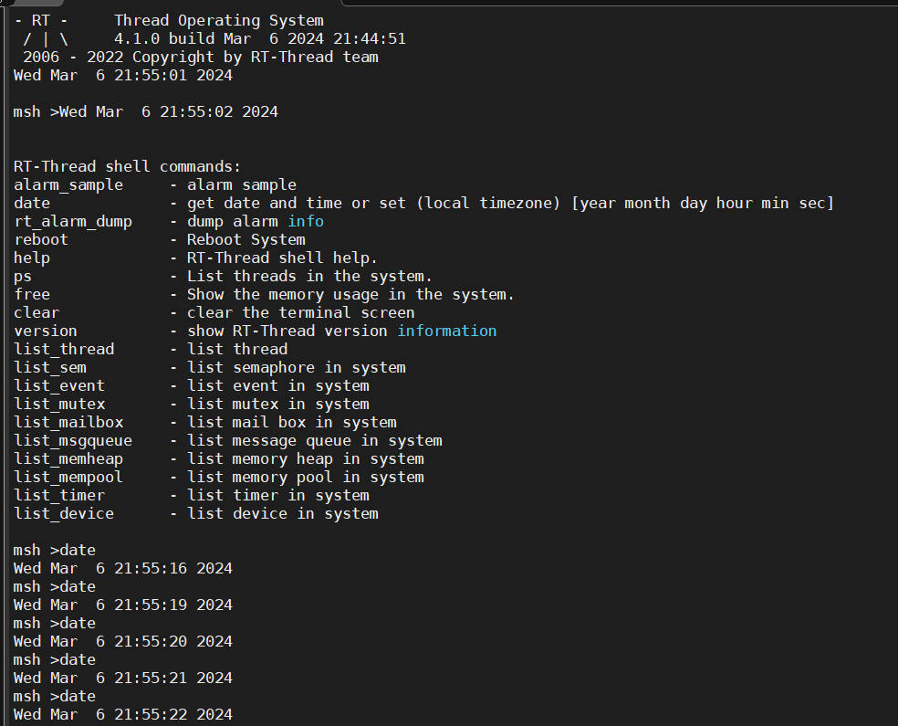

      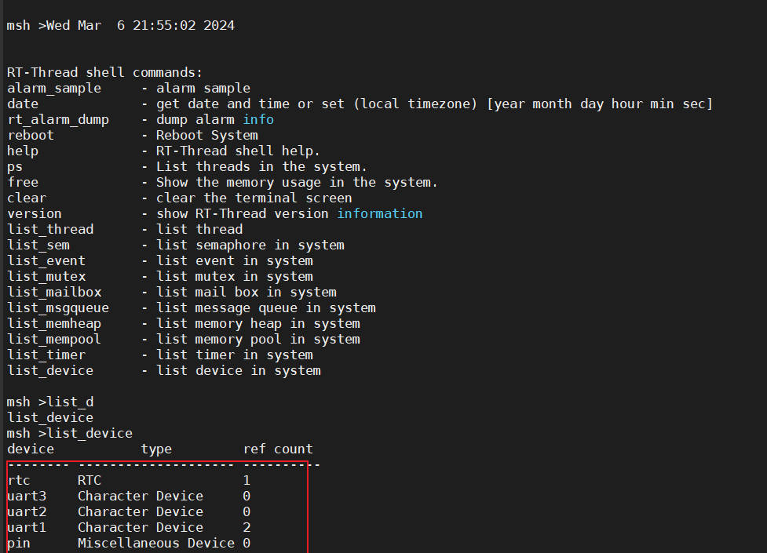
