##  11-雅特力AT32A403开发板评测 GCC Makefile 工程模板搭建

### 1. 软硬件平台

1. AT32A403A Board开发

2. GCC Makefile 

3. Artery_ICP_Programmer_V3.0.13

   

### 2.编译工具链配置

搭建过程参考 https://gitee.com/End-ING/embedded-gcc-template

#### 1. GNU Arm Embedded Toolchain交叉编译器

进入arm开发者官网，往下滑动选择下载解压可用的ZIP压缩包文件

[下载链接： Downloads | GNU Arm Embedded Toolchain Downloads – Arm Developer](https://gitee.com/link?target=https%3A%2F%2Fdeveloper.arm.com%2Ftools-and-software%2Fopen-source-software%2Fdeveloper-tools%2Fgnu-toolchain%2Fgnu-rm%2Fdownloads)


将下载好的压缩包文件解压在gcc-arm-none-eabi”文件夹中，并记住文件内“bin”文件的路径，后续需添加到系统环境变量Path中。


添加完环境变量后，进行测试，检测是否安装好。

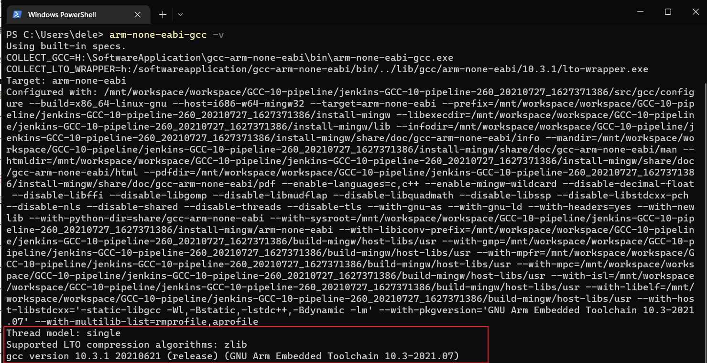

#### 2. 安装**Mingw-w64 GCC**

点击链接进入到SourceForge官网，往下翻可以找到很多版本的下载链接，选择红色框内型号即可，不同前后缀的具体差异请参考:

[MinGW gcc下载链接及sjlj、dwarf、seh异同以及gcc安装_AMDDMA的博客-CSDN博客_seh和sjlj](https://gitee.com/link?target=https%3A%2F%2Fblog.csdn.net%2FAMDDMA%2Farticle%2Fdetails%2F111600238)

下载链接：

[MinGW-w64 - for 32 and 64 bit Windows - Browse Files at SourceForge.net](https://gitee.com/link?target=https%3A%2F%2Fsourceforge.net%2Fprojects%2Fmingw-w64%2Ffiles%2F)


同样，将下载好的文件解压到“gcc-arm-none-eabi”文件夹下，记住目录下的“bin”文件路径

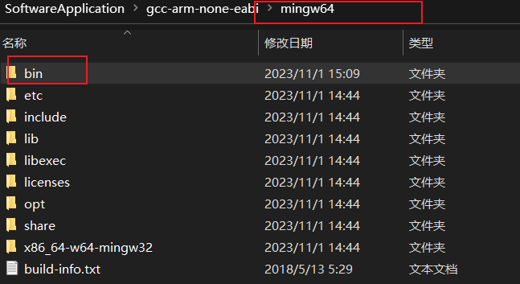

进入“bin”文件内找到“mingw32-make”应用程序文件，复制一份并重命名为“make”。这么做有利于在命令行执行make指令，而不是输入mingw32-make。


 添加完环境变量后，进行测试，检测是否安装好。


#### 3.程序下载软件Artery_ICP_Programmer

(参考上面的教程，应该是使用OpenOCD去下载程序的，但是我下载失败了，目前没有找到解决方法,因此，决定使用其他的方法去下载程序，例如Artery_ICP_Programmer，Artery_ISP_Programmer)

下载地址https://www.arterytek.com/cn/support/index.jsp?index=5

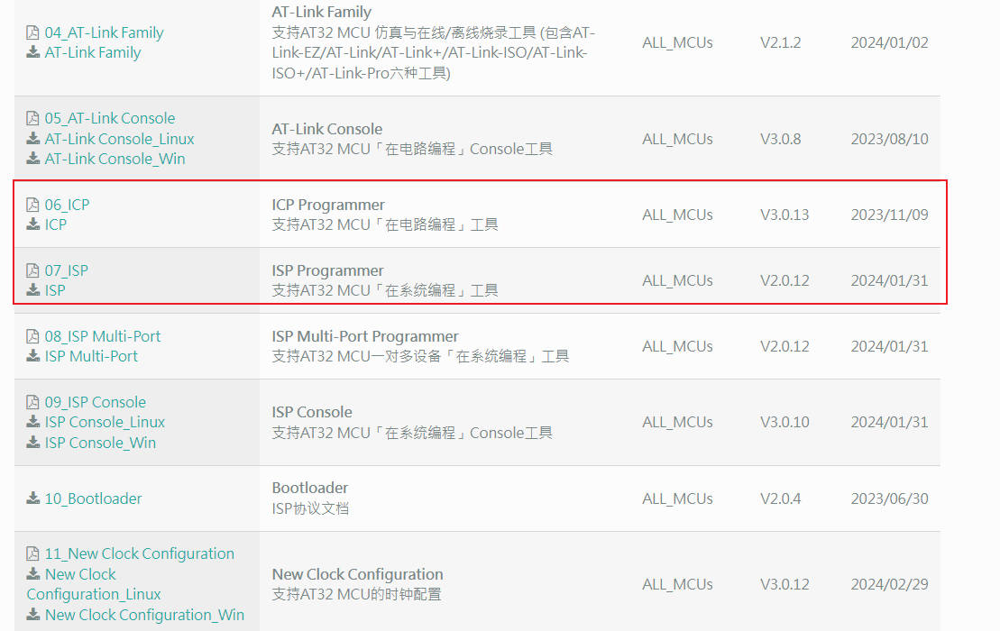

#### 程序下载方法合集

- ICP（In-Circuit Programming）。它让用户不需要将已经安装的 MCU 从目标 PCB 取下就能够通过软 件控制来更新 MCU 的程序存储。
- ISP在线编程（In-System Programming）。具有 ISP 功能的单片机芯片，可以直接在电路板上给芯片写入或者擦除程序。 
- UART： 通用异步收发传输器（Universal Asynchronous Receiver/Transmitter)。是一种全双工异步通信的串 行通讯端口(COM)。 
-  USB： 通用串行总线（Universal Serial Bus)。是一种用于规范电脑与外部设备连接与通讯的外部总线标准。 
- DFU： （Device Firmware Upgrade)。是一种基于 USB 通讯的设备固件更新协议。


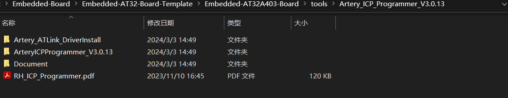

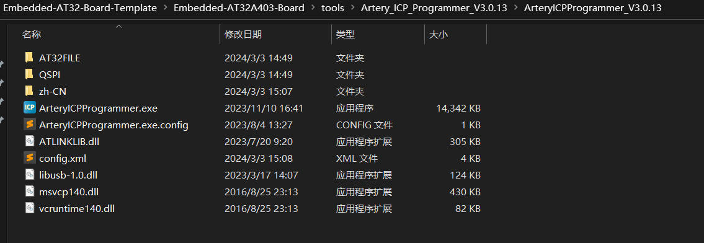

综上所述，基本的软件环境已经配置好。

### 3.Makefile文件编写(重点)

```makefile
######################################
# target
######################################
TARGET = at32a403a_template


######################################
# building variables
######################################
# debug build?
DEBUG = 1
# optimization for size
OPT = -Os


#######################################
# paths
#######################################
# Build path
BUILD_DIR = build

######################################
# source
######################################
# C sources
C_SOURCES =  \
Drivers/cmsis/cm4/device_support/system_at32a403a.c \
Drivers/drivers/src/at32a403a_acc.c \
Drivers/drivers/src/at32a403a_adc.c \
Drivers/drivers/src/at32a403a_bpr.c \
Drivers/drivers/src/at32a403a_can.c \
Drivers/drivers/src/at32a403a_crc.c \
Drivers/drivers/src/at32a403a_crm.c \
Drivers/drivers/src/at32a403a_dac.c \
Drivers/drivers/src/at32a403a_debug.c \
Drivers/drivers/src/at32a403a_dma.c \
Drivers/drivers/src/at32a403a_exint.c \
Drivers/drivers/src/at32a403a_flash.c \
Drivers/drivers/src/at32a403a_gpio.c \
Drivers/drivers/src/at32a403a_i2c.c \
Drivers/drivers/src/at32a403a_misc.c \
Drivers/drivers/src/at32a403a_pwc.c \
Drivers/drivers/src/at32a403a_rtc.c \
Drivers/drivers/src/at32a403a_sdio.c \
Drivers/drivers/src/at32a403a_spi.c \
Drivers/drivers/src/at32a403a_tmr.c \
Drivers/drivers/src/at32a403a_usart.c \
Drivers/drivers/src/at32a403a_usb.c \
Drivers/drivers/src/at32a403a_wdt.c \
Drivers/drivers/src/at32a403a_wwdt.c \
Drivers/drivers/src/at32a403a_xmc.c \
Application/main.c \
Application/at32a403a_int.c \
Application/at32a403a_clock.c \
BspDriver/at32a403a_board.c \

# ASM sources
ASM_SOURCES = \
Application/startup_at32a403a.s \


#######################################
# binaries
#######################################
PREFIX = arm-none-eabi-
GCC_PATH = /SoftwareApplication/gcc-arm-none-eabi/bin
ifdef GCC_PATH
CC = $(GCC_PATH)/$(PREFIX)gcc
AS = $(GCC_PATH)/$(PREFIX)gcc -x assembler-with-cpp
CP = $(GCC_PATH)/$(PREFIX)objcopy
SZ = $(GCC_PATH)/$(PREFIX)size
else
CC = $(PREFIX)gcc
AS = $(PREFIX)gcc -x assembler-with-cpp
CP = $(PREFIX)objcopy
SZ = $(PREFIX)size
endif
HEX = $(CP) -O ihex
BIN = $(CP) -O binary -S
 
#######################################
# CFLAGS
#######################################
# cpu
CPU = -mcpu=cortex-m4

# fpu
FPU = -mfpu=fpv4-sp-d16

# float-abi
FLOAT-ABI = -mfloat-abi=hard

# mcu
MCU = $(CPU) -mthumb $(FPU) $(FLOAT-ABI)

# macros for gcc
# AS defines
AS_DEFS = 

# C defines
C_DEFS =  \
-D USE_STDPERIPH_DRIVER \
-D AT32A403AVGT7 \
-D AT_START_A403A_V1 \

# AS includes
AS_INCLUDES = 

# C includes
C_INCLUDES = \
-IDrivers/cmsis/cm4/core_support \
-IDrivers/cmsis/cm4/device_support \
-IDrivers/drivers/inc \
-IApplication \
-IBspDriver \


# compile gcc flags
ASFLAGS = $(MCU) $(AS_DEFS) $(AS_INCLUDES) $(OPT) -Wall -fdata-sections -ffunction-sections

CFLAGS = $(MCU) $(C_DEFS) $(C_INCLUDES) $(OPT) -Wall -fdata-sections -ffunction-sections

ifeq ($(DEBUG), 1)
CFLAGS += -g -gdwarf-2
endif


# Generate dependency information
CFLAGS += -MMD -MP -MF"$(@:%.o=%.d)"


#######################################
# LDFLAGS
#######################################
# link script
LDSCRIPT = Application/AT32A403AxG_FLASH.ld

# libraries
LIBS = -lc -lm -lnosys 
LIBDIR = 
LDFLAGS = $(MCU) -u_printf_float -specs=nosys.specs -T$(LDSCRIPT) $(LIBDIR) $(LIBS) -Wl,-Map=$(BUILD_DIR)/$(TARGET).map,--cref -Wl,--gc-sections

# default action: build all
all: $(BUILD_DIR)/$(TARGET).elf $(BUILD_DIR)/$(TARGET).hex $(BUILD_DIR)/$(TARGET).bin


# #######################################
# # build the application
# #######################################
# # list of objects
# OBJECTS = $(addprefix $(BUILD_DIR)/,$(notdir $(C_SOURCES:.c=.o)))
# vpath %.c $(sort $(dir $(C_SOURCES)))
# # list of ASM program objects
# OBJECTS += $(addprefix $(BUILD_DIR)/,$(notdir $(ASM_SOURCES:.S=.o)))
# vpath %.S $(sort $(dir $(ASM_SOURCES)))

# $(BUILD_DIR)/%.o: %.c Makefile | $(BUILD_DIR) 
# 	@echo "[CC]    $<"
# 	@$(CC) -c $(CFLAGS) -Wa,-a,-ad,-alms=$(BUILD_DIR)/$(notdir $(<:.c=.lst)) $< -o $@

# $(BUILD_DIR)/%.o: %.s Makefile | $(BUILD_DIR)
# 	@echo "[AS]    $<"
# 	@$(AS) -c $(CFLAGS) $< -o $@

# $(BUILD_DIR)/$(TARGET).elf: $(OBJECTS) Makefile
# 	@echo "[HEX]   $< -> $@"
# 	@$(CC) $(OBJECTS) $(LDFLAGS) -o $@
# 	@$(SZ) $@

# $(BUILD_DIR)/%.hex: $(BUILD_DIR)/%.elf | $(BUILD_DIR)
# 	@echo "[HEX]   $< -> $@"
# 	@$(HEX) $< $@
	
# $(BUILD_DIR)/%.bin: $(BUILD_DIR)/%.elf | $(BUILD_DIR)
# 	@echo "[BIN]   $< -> $@"
# 	@$(BIN) $< $@	
	
# $(BUILD_DIR):
# 	@mkdir $@		
# 	
#######################################
# build the application
#######################################
# list of objects
OBJECTS = $(addprefix $(BUILD_DIR)/,$(notdir $(C_SOURCES:.c=.o)))
vpath %.c $(sort $(dir $(C_SOURCES)))
# list of ASM program objects
OBJECTS += $(addprefix $(BUILD_DIR)/,$(notdir $(ASM_SOURCES:.s=.o)))
vpath %.s $(sort $(dir $(ASM_SOURCES)))

$(BUILD_DIR)/%.o: %.c Makefile | $(BUILD_DIR) 
	@echo "[CC]    $<"
	@$(CC) -c $(CFLAGS) -Wa,-a,-ad,-alms=$(BUILD_DIR)/$(notdir $(<:.c=.lst)) $< -o $@

$(BUILD_DIR)/%.o: %.s Makefile | $(BUILD_DIR)
	@echo "[AS]    $<"
	@$(AS) -c $(CFLAGS) $< -o $@

$(BUILD_DIR)/$(TARGET).elf: $(OBJECTS) Makefile
	@echo "[HEX]   $< -> $@"
	@$(CC) $(OBJECTS) $(LDFLAGS) -o $@
	@$(SZ) $@

$(BUILD_DIR)/%.hex: $(BUILD_DIR)/%.elf | $(BUILD_DIR)
	@echo "[HEX]   $< -> $@"
	@$(HEX) $< $@
	
$(BUILD_DIR)/%.bin: $(BUILD_DIR)/%.elf | $(BUILD_DIR)
	@echo "[BIN]   $< -> $@"
	@$(BIN) $< $@	
	
$(BUILD_DIR):
	@mkdir $@	

#######################################
# flash  目前无法使用，openocd没有适配好
#######################################
flash:
	openocd -f atlink.cfg -f at32f403axx.cfg -c init -c halt -c "program build/$(TARGET).elf verify reset exit"

#######################################
# clean up
#######################################
clean:
	-del /q  $(BUILD_DIR)

#######################################
# dependencies
#######################################
-include $(wildcard $(BUILD_DIR)/*.d)

# *** EOF ***

```

####  make 测试

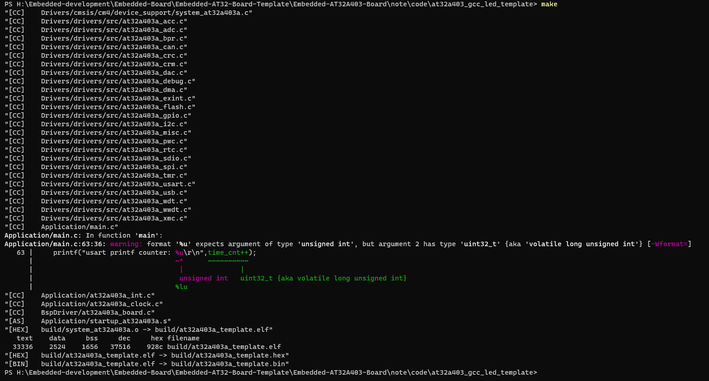

执行make命令，生成hex,bin,elf可执行文件。

### 4.程序下载（hex文件下载）

1. 编写程序

   ```c
   #include "at32a403a_board.h"
   #include "at32a403a_clock.h"
   
   
   __IO uint32_t time_cnt = 0;
   
   /**
     * @brief  main function.
     * @param  none
     * @retval none
     */
   int main(void)
   {
     system_clock_config();
     at32_board_init();
     uart_print_init(115200);
     printf("Hardware_Init [ok] \r\n");
     printf("at_start_a403a board testing 2024-03-03 [ok]\r\n");
     printf("at_start_a403a board arm-gcc-makefile template [ok] \r\n");
     while(1)
     {
       printf("at32_led_toggle example start [ok] \r\n");
       at32_led_toggle(LED2);
       delay_ms(200);
       at32_led_toggle(LED3);
       delay_ms(200);
       at32_led_toggle(LED4);
       delay_ms(200);
       printf("at32_led_toggle example end  [ok]\r\n");
       printf("usart printf counter: %u\r\n",time_cnt++);
       delay_sec(1);
     }
   }
   ```

2.  gcc下面的串口打印问题，在gcc下面使用_write进行定向printf。(如果是从KEIL的例程printf打印无法在gcc工程中使用，因此需要修改，雅特力官方提供的工程模板就很好的兼容了两者，不需要我们去进行如何的操作，具体实现在at32a403a_board.c中)

   ```c
   /* support printf function, usemicrolib is unnecessary */
   #if (__ARMCC_VERSION > 6000000)
     __asm (".global __use_no_semihosting\n\t");
     void _sys_exit(int x)
     {
       x = x;
     }
     /* __use_no_semihosting was requested, but _ttywrch was */
     void _ttywrch(int ch)
     {
       ch = ch;
     }
     FILE __stdout;
   #else
    #ifdef __CC_ARM
     #pragma import(__use_no_semihosting)
     struct __FILE
     {
       int handle;
     };
     FILE __stdout;
     void _sys_exit(int x)
     {
       x = x;
     }
     /* __use_no_semihosting was requested, but _ttywrch was */
     void _ttywrch(int ch)
     {
       ch = ch;
     }
    #endif
   #endif
   
   #if defined (__GNUC__) && !defined (__clang__)
     #define PUTCHAR_PROTOTYPE int __io_putchar(int ch)
   #else
     #define PUTCHAR_PROTOTYPE int fputc(int ch, FILE *f)
   #endif
   
   /**
     * @brief  retargets the c library printf function to the usart.
     * @param  none
     * @retval none
     */
   PUTCHAR_PROTOTYPE
   {
     while(usart_flag_get(PRINT_UART, USART_TDBE_FLAG) == RESET);
     usart_data_transmit(PRINT_UART, (uint16_t)ch);
     while(usart_flag_get(PRINT_UART, USART_TDC_FLAG) == RESET);
     return ch;
   }
   
   #if (defined (__GNUC__) && !defined (__clang__)) || (defined (__ICCARM__))
   #if defined (__GNUC__) && !defined (__clang__)
   int _write(int fd, char *pbuffer, int size)
   #elif defined ( __ICCARM__ )
   #pragma module_name = "?__write"
   int __write(int fd, char *pbuffer, int size)
   #endif
   {
     for(int i = 0; i < size; i ++)
     {
       while(usart_flag_get(PRINT_UART, USART_TDBE_FLAG) == RESET);
       usart_data_transmit(PRINT_UART, (uint16_t)(*pbuffer++));
       while(usart_flag_get(PRINT_UART, USART_TDC_FLAG) == RESET);
     }
   
     return size;
   }
   #endif
   ```

3. 打开Artery_ICP_Programmer，连接AT-Link(J-Link,板载AT-Link)

   连接成功后，会显示mcu芯片型号AT32A403AVGT7 存储器东西1024KB,AT-Link固件版本号

   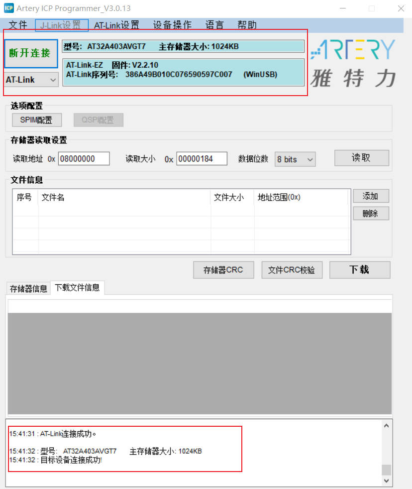

4. 添加Hex文件，读取信息

   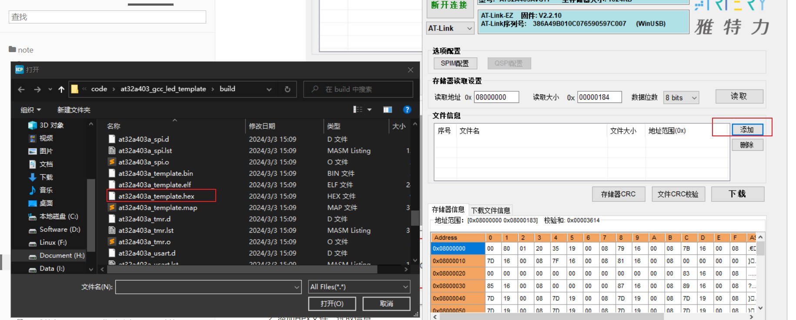

   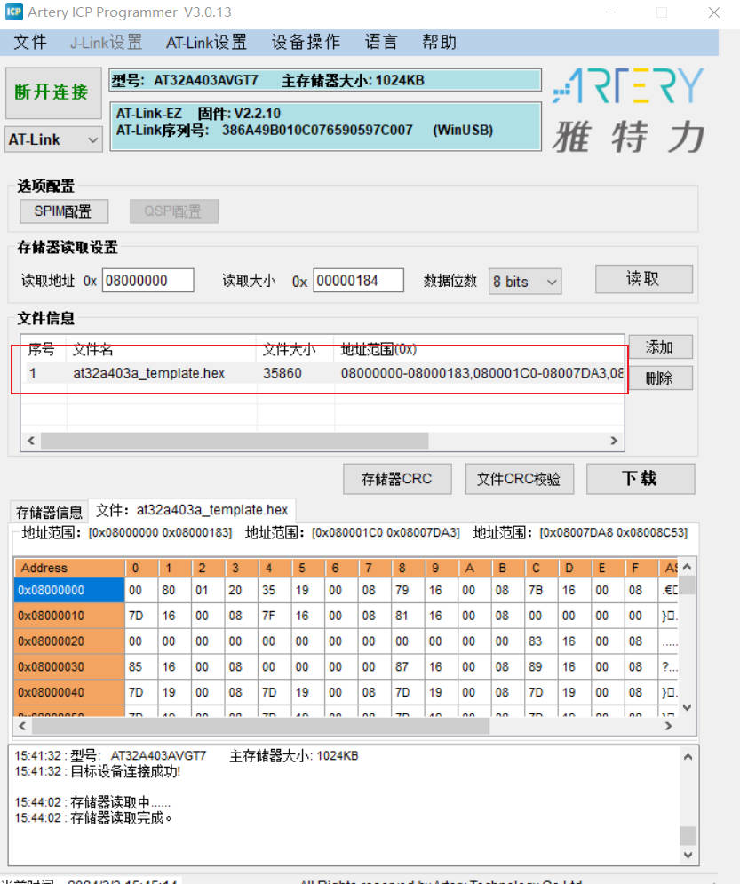

5. 下载程序

   设置下载选项，擦除选项为：主存储器全擦除

   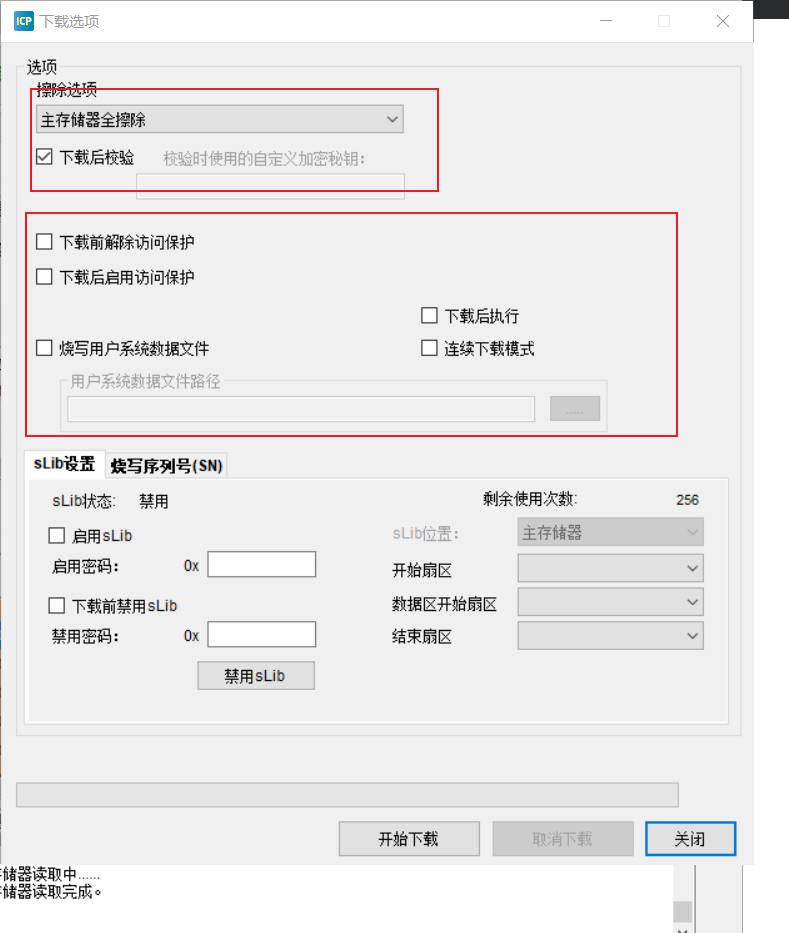

   

   如果选择了下载后启用访问保护，如果使用其他软件去下载时，会发现无法下载，需要解除访问保护，因此在这里，我们默认不选择，虽然软件会提示你要进行保护。

   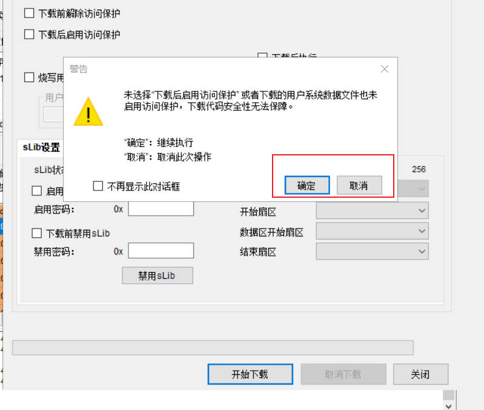

   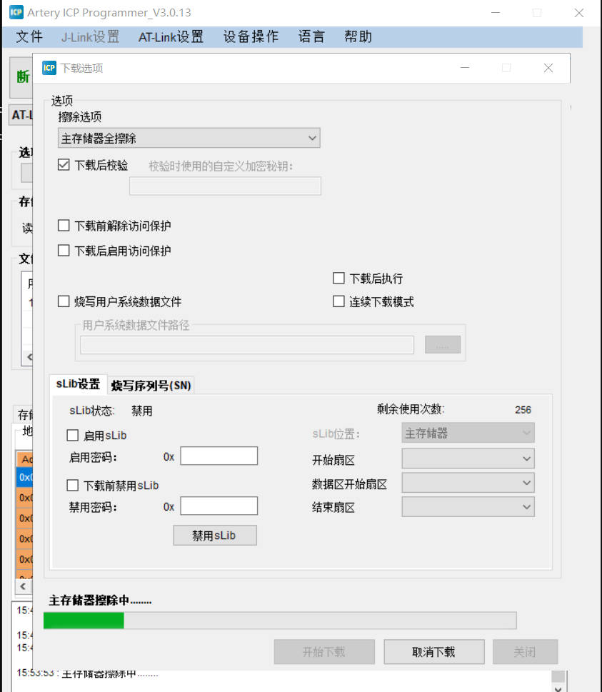

   

   5. 代码下载成功之后，需要重启开发板

      （不知道为什么直接按下复位按键没有用，导致一直认为没有下载成功，最后直接把插在板子上的usb线重新插拔之后，发现程序中的led在闪烁，串口在打印log信息,说明没有问题）

      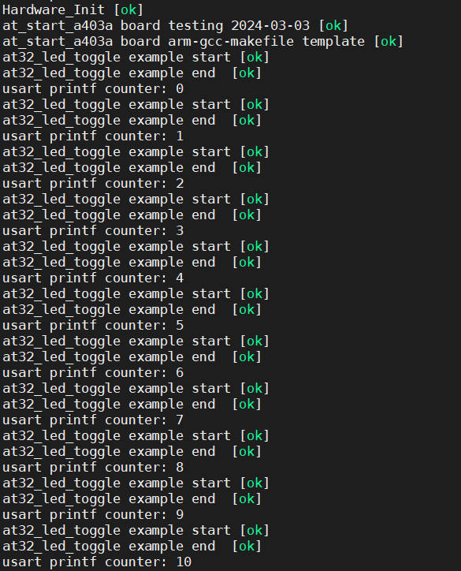