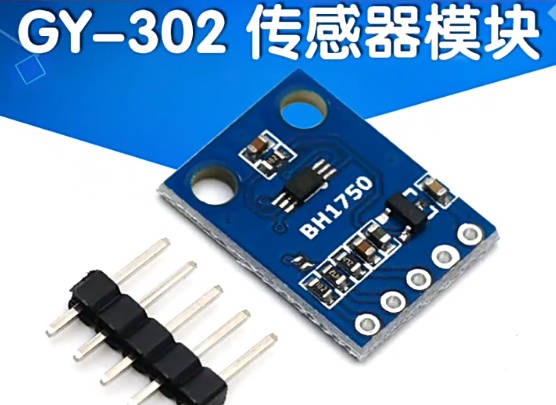
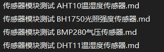
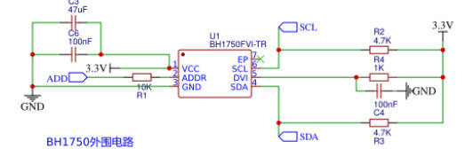
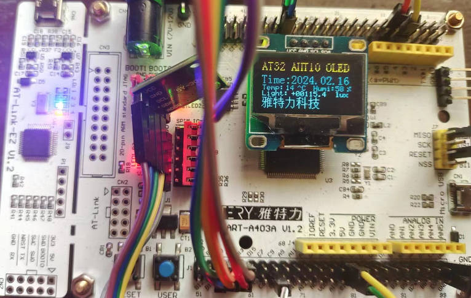
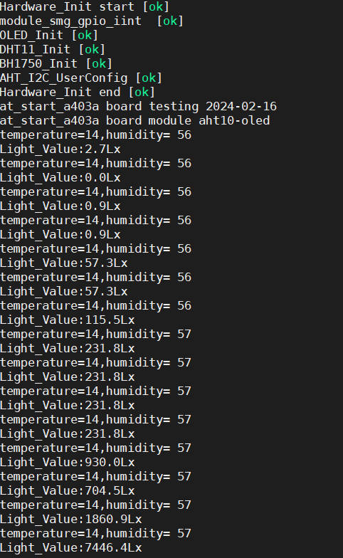

## 12-雅特力AT32A403开发板评测 传感器模块测试 BH1750光照强度传感器

### 1.软硬件平台

1. AT32A403A Board开发板

2. MDK-ARM Keil

3. 0.96寸 IIC接口 OLED显示模块

4. 传感器模块  DHT11温湿度传感器 BH1750光照强度传感器

   

   
   
   AT32 传感器模块测试 
   
   
   
   原计划进行AHT10,BH1750,BMP280,三个不同类型的传感器进行测试，找到传感器之后，先使用STM32去验证了传感器的好坏，因为之前实验过了， 最后发现BMP280传感器可能坏了，因此需要删除了驱动移植，后面想着加一些其他的传感器。
   
### 2.BH1750光照强度传感器
   
   BH1750FVI 是一款用于 I2C 总线接口的数字环境光传感器 IC。该IC最适合获得环境光，用于调整手机LCD和Keypad背光功率的数据。（传感器原理参考网络）
   
   - IIC总线接口
   - 光谱责任近似于人眼反应
   - 照度数字转换器
   - 宽范围和高分辨率。 ( 1 - 65535 lx )
   - 通过断电功能实现低电流
   - 50Hz / 60Hz 光噪声抑制功能
   - 1.8V 逻辑输入接口
   - 无需任何外部零件
   - 光源依赖性小。 （例如白炽灯、荧光灯、卤素灯、白光 LED、太阳灯）
   - 可以选择 2 种 I2C 从地址。
   - 光学窗口影响的可调测量结果（使用此功能可以检测最小 0.11 lx，最大 100000 lx。）
   - 小的测量变化 (+/- 20%)
   - 红外线的影响很小。
   
   引脚定义：
   
   | 引脚号 | 名称 | 说明                                                         |
   | :----- | :--- | :----------------------------------------------------------- |
   | 1      | VCC  | 供电电压源正极                                               |
   | 2      | SCL  | IIC时钟线，时钟输入引脚，由MCU输出时钟                       |
   | 3      | SDA  | IIC数据线，双向IO口，用来传输数据                            |
   | 4      | ADDR | IIC地址线，接GND时器件地址为0100011 ，接VCC时器件地址为1011100 |
   | 5      | GND  | 供电电压源负极                                               |



### 3.BH1750 驱动代码

drv_bh1750.c

```c
#include "main.h"


/*
	应用说明：
	在访问I2C设备前，请先调用 i2c_CheckDevice() 检测I2C设备是否正常，该函数会配置GPIO
*/


static void I2C_BH1750_GPIOConfig(void);

//==================================================================================================
//  函数功能: IIC 外设驱动函数部分
//  函数标记: i2c_Delay
//  函数说明: I2C总线位延迟，最快400KHz
//			  形 参：无
//            返 回 值: 无
//-------------------------------------------------------------------------------------------------
//  |   -   |   -   |   0   |   1   |   2   |   3   |   4   |   5   |   6   |   7   |   8   |   9   
//==================================================================================================
static void i2c_Delay(void)
{
	uint8_t i;

	/*　
	 	下面的时间是通过逻辑分析仪测试得到的。
        工作条件：CPU主频72MHz ，MDK编译环境，1级优化
  
		循环次数为10时，SCL频率 = 205KHz 
		循环次数为7时，SCL频率 = 347KHz， SCL高电平时间1.5us，SCL低电平时间2.87us 
	 	循环次数为5时，SCL频率 = 421KHz， SCL高电平时间1.25us，SCL低电平时间2.375us 
	*/
	for (i = 0; i < 10; i++); 
}
//==================================================================================================
//  函数功能: IIC 外设驱动函数部分
//  函数标记: i2c_Start
//  函数说明: CPU发起I2C总线启动信号
//			  形 参：无
//            返 回 值: 无
//-------------------------------------------------------------------------------------------------
//  |   -   |   -   |   0   |   1   |   2   |   3   |   4   |   5   |   6   |   7   |   8   |   9   
//==================================================================================================
void i2c_Start(void)
{
	/* 当SCL高电平时，SDA出现一个下跳沿表示I2C总线启动信号 */
	BH1750_I2C_SDA_1();
	BH1750_I2C_SCL_1();
	i2c_Delay();
	BH1750_I2C_SDA_0();
	i2c_Delay();
	BH1750_I2C_SCL_0();
	i2c_Delay();
}
//==================================================================================================
//  函数功能: IIC 外设驱动函数部分
//  函数标记: i2c_Stop
//  函数说明: CPU发起I2C总线停止信号
//			  形 参：无
//            返 回 值: 无
//-------------------------------------------------------------------------------------------------
//  |   -   |   -   |   0   |   1   |   2   |   3   |   4   |   5   |   6   |   7   |   8   |   9   
//==================================================================================================
void i2c_Stop(void)
{
	/* 当SCL高电平时，SDA出现一个上跳沿表示I2C总线停止信号 */
	BH1750_I2C_SDA_0();
	BH1750_I2C_SCL_1();
	i2c_Delay();
	BH1750_I2C_SDA_1();
}
//==================================================================================================
//  函数功能: IIC 外设驱动函数部分
//  函数标记: i2c_SendByte
//  函数说明: CPU发起I2C总线停止信号
//			  形    参：_ucByte ： 等待发送的字节
//            返 回 值: 无
//-------------------------------------------------------------------------------------------------
//  |   -   |   -   |   0   |   1   |   2   |   3   |   4   |   5   |   6   |   7   |   8   |   9   
//==================================================================================================
void i2c_SendByte(uint8_t _ucByte)
{
	uint8_t i;

	/* 先发送字节的高位bit7 */
	for (i = 0; i < 8; i++)
	{		
		if (_ucByte & 0x80)
		{
			BH1750_I2C_SDA_1();
		}
		else
		{
			BH1750_I2C_SDA_0();
		}
		i2c_Delay();
		BH1750_I2C_SCL_1();
		i2c_Delay();	
		BH1750_I2C_SCL_0();
		if (i == 7)
		{
			 BH1750_I2C_SDA_1(); // 释放总线
		}
		_ucByte <<= 1;	/* 左移一个bit */
		i2c_Delay();
	}
}
//==================================================================================================
//  函数功能: IIC 外设驱动函数部分
//  函数标记: i2c_ReadByte
//  函数说明: CPU从I2C总线设备读取8bit数据
//			  形    参：无
//            返 回 值: 读到的数据
//-------------------------------------------------------------------------------------------------
//  |   -   |   -   |   0   |   1   |   2   |   3   |   4   |   5   |   6   |   7   |   8   |   9   
//==================================================================================================
uint8_t i2c_ReadByte(void)
{
	uint8_t i;
	uint8_t value;

	/* 读到第1个bit为数据的bit7 */
	value = 0;
	for (i = 0; i < 8; i++)
	{
		value <<= 1;
		BH1750_I2C_SCL_1();
		i2c_Delay();
		if (BH1750_I2C_SDA_READ())
		{
			value++;
		}
		BH1750_I2C_SCL_0();
		i2c_Delay();
	}
	return value;
}
//==================================================================================================
//  函数功能: IIC 外设驱动函数部分
//  函数标记: i2c_WaitAck
//  函数说明: CPU产生一个时钟，并读取器件的ACK应答信号
//			  形    参：无
//            返 回 值: 返回0表示正确应答，1表示无器件响应
//-------------------------------------------------------------------------------------------------
//  |   -   |   -   |   0   |   1   |   2   |   3   |   4   |   5   |   6   |   7   |   8   |   9   
//==================================================================================================
uint8_t i2c_WaitAck(void)
{
	uint8_t re;

	BH1750_I2C_SDA_1();	/* CPU释放SDA总线 */
	i2c_Delay();
	BH1750_I2C_SCL_1();	/* CPU驱动SCL = 1, 此时器件会返回ACK应答 */
	i2c_Delay();
	if (BH1750_I2C_SDA_READ())	/* CPU读取SDA口线状态 */
		re = 1;
	else
		re = 0;
	BH1750_I2C_SCL_0();
	i2c_Delay();
	return re;
}

//==================================================================================================
//  函数功能: IIC 外设驱动函数部分
//  函数标记: i2c_Ack
//  函数说明: CPU产生一个ACK信号
//			  形    参：无
//            返 回 值: 无
//-------------------------------------------------------------------------------------------------
//  |   -   |   -   |   0   |   1   |   2   |   3   |   4   |   5   |   6   |   7   |   8   |   9   
//==================================================================================================
void i2c_Ack(void)
{
	BH1750_I2C_SDA_0();	/* CPU驱动SDA = 0 */
	i2c_Delay();
	BH1750_I2C_SCL_1();	/* CPU产生1个时钟 */
	i2c_Delay();
	BH1750_I2C_SCL_0();
	i2c_Delay();
	BH1750_I2C_SDA_1();	/* CPU释放SDA总线 */
}
//==================================================================================================
//  函数功能: IIC 外设驱动函数部分
//  函数标记: i2c_NAck
//  函数说明: CPU产生1个NACK信号
//			  形    参：无
//            返 回 值: 无
//-------------------------------------------------------------------------------------------------
//  |   -   |   -   |   0   |   1   |   2   |   3   |   4   |   5   |   6   |   7   |   8   |   9   
//==================================================================================================
void i2c_NAck(void)
{
	BH1750_I2C_SDA_1();	/* CPU驱动SDA = 1 */
	i2c_Delay();
	BH1750_I2C_SCL_1();	/* CPU产生1个时钟 */
	i2c_Delay();
	BH1750_I2C_SCL_0();
	i2c_Delay();	
}
//==================================================================================================
//  函数功能: IIC 外设驱动函数部分
//  函数标记: I2C_BH1750_GPIOConfig
//  函数说明: 配置I2C总线的GPIO，采用模拟IO的方式实现
//			  形    参：无
//            返 回 值: 无
//-------------------------------------------------------------------------------------------------
//  |   -   |   -   |   0   |   1   |   2   |   3   |   4   |   5   |   6   |   7   |   8   |   9   
//==================================================================================================
static void I2C_BH1750_GPIOConfig(void)
{

  gpio_init_type gpio_init_struct;

  /* enable the gpioa clock */
  crm_periph_clock_enable(BH1750_RCC_I2C_PORT_CLOCK, TRUE);

  /* set default parameter */
  gpio_default_para_init(&gpio_init_struct);

  /* configure the gpio */
  gpio_init_struct.gpio_drive_strength = GPIO_DRIVE_STRENGTH_STRONGER;
  gpio_init_struct.gpio_out_type  = GPIO_OUTPUT_PUSH_PULL;
  gpio_init_struct.gpio_mode = GPIO_MODE_OUTPUT;
  gpio_init_struct.gpio_pins = BH1750_I2C_SCL_PIN | BH1750_I2C_SDA_PIN;
  gpio_init_struct.gpio_pull = GPIO_PULL_UP;
  gpio_init(BH1750_GPIO_PORT_I2C, &gpio_init_struct);
	/* 给一个停止信号, 复位I2C总线上的所有设备到待机模式 */
  i2c_Stop();
}
//==================================================================================================
//  函数功能: IIC 外设驱动函数部分
//  函数标记: i2c_ReadByte
//  函数说明: 检测I2C总线设备，CPU向发送设备地址，然后读取设备应答来判断该设备是否存在
//			  形    参：_Address：设备的I2C总线地址
//            返 回 值: 返回值 0 表示正确， 返回1表示未探测到
//-------------------------------------------------------------------------------------------------
//  |   -   |   -   |   0   |   1   |   2   |   3   |   4   |   5   |   6   |   7   |   8   |   9   
//==================================================================================================
uint8_t i2c_CheckDevice(uint8_t _Address)
{
	uint8_t ucAck;
	i2c_Start();		/* 发送启动信号 */
	/* 发送设备地址+读写控制bit（0 = w， 1 = r) bit7 先传 */
	i2c_SendByte(_Address | BH1750_I2C_WR);
	ucAck = i2c_WaitAck();	/* 检测设备的ACK应答 */

	i2c_Stop();			/* 发送停止信号 */

	return ucAck;
}
//==================================================================================================
//  函数功能: BH1750 外设驱动函数部分
//  函数标记: BH1750_Byte_Write
//  函数说明: BH1750写一个字节
//   		  返回值	成功：0		失败：非0 
//-------------------------------------------------------------------------------------------------
//  |   -   |   -   |   0   |   1   |   2   |   3   |   4   |   5   |   6   |   7   |   8   |   9   
//==================================================================================================
uint8_t BH1750_Byte_Write(uint8_t data)
{
	i2c_Start();
	//发送写地址
	i2c_SendByte(BH1750_Addr|0);
	if(i2c_WaitAck()==1)
		return 1;
	//发送控制命令
	i2c_SendByte(data);
	if(i2c_WaitAck()==1)
		return 2;
	i2c_Stop();
	return 0;
}
//==================================================================================================
//  函数功能: BH1750 外设驱动函数部分
//  函数标记: BH1750_Read_Measure
//  函数说明: BH1750读取测量数据
//            返回值 成功：返回光照强度 	失败：返回0
//-------------------------------------------------------------------------------------------------
//  |   -   |   -   |   0   |   1   |   2   |   3   |   4   |   5   |   6   |   7   |   8   |   9   
//==================================================================================================
uint16_t BH1750_Read_Measure(void)
{
	uint16_t receive_data=0; 
	i2c_Start();
	//发送读地址
	i2c_SendByte(BH1750_Addr|1);
	if(i2c_WaitAck()==1)
		return 0;
	//读取高八位
	receive_data=i2c_ReadByte();
	i2c_Ack();
	//读取低八位
	receive_data=(receive_data<<8)+i2c_ReadByte();
	i2c_NAck();
	i2c_Stop();
	return receive_data;	//返回读取到的数据
}

//==================================================================================================
//  函数功能: BH1750 外设驱动函数部分
//  函数标记: BH1750_Power_ON
//  函数说明: BH1750s上电
//-------------------------------------------------------------------------------------------------
//  |   -   |   -   |   0   |   1   |   2   |   3   |   4   |   5   |   6   |   7   |   8   |   9   
//==================================================================================================
void BH1750_Power_ON(void)
{
	BH1750_Byte_Write(POWER_ON);
}
//==================================================================================================
//  函数功能: BH1750 外设驱动函数部分
//  函数标记: BH1750_Power_OFF
//  函数说明: //BH1750s断电
//-------------------------------------------------------------------------------------------------
//  |   -   |   -   |   0   |   1   |   2   |   3   |   4   |   5   |   6   |   7   |   8   |   9   
//==================================================================================================
void BH1750_Power_OFF(void)
{
	BH1750_Byte_Write(POWER_OFF);
}
//==================================================================================================
//  函数功能: BH1750 外设驱动函数部分
//  函数标记: BH1750_RESET
//  函数说明: BH1750复位	仅在上电时有效
//-------------------------------------------------------------------------------------------------
//  |   -   |   -   |   0   |   1   |   2   |   3   |   4   |   5   |   6   |   7   |   8   |   9   
//==================================================================================================
void BH1750_RESET(void)
{
	BH1750_Byte_Write(MODULE_RESET);
}
//==================================================================================================
//  函数功能: BH1750 外设驱动函数部分
//  函数标记: BH1750_Init
//  函数说明: BH1750初始化
//-------------------------------------------------------------------------------------------------
//  |   -   |   -   |   0   |   1   |   2   |   3   |   4   |   5   |   6   |   7   |   8   |   9   
//==================================================================================================
//
void BH1750_Init(void)
{
	I2C_BH1750_GPIOConfig();		/* 配置GPIO */
	
	BH1750_Power_ON();	//BH1750s上电
	//BH1750_RESET();			//BH1750复位
	BH1750_Byte_Write(Measure_Mode);
	//SysTick_Delay_ms(120);
}
//==================================================================================================
//  函数功能: BH1750 外设驱动函数部分
//  函数标记: LIght_Intensity
//  函数说明: 获取光照强度
//-------------------------------------------------------------------------------------------------
//  |   -   |   -   |   0   |   1   |   2   |   3   |   4   |   5   |   6   |   7   |   8   |   9   
//==================================================================================================
float LIght_Intensity(void)
{
	return (float)(BH1750_Read_Measure()/1.1f*Resolurtion);
}

```

drv_bh1750.h

```c
#ifndef __DRV_BH1750_H
#define __DRV_BH1750_H	

#include "main.h"

//--------------------------------------------------------------------------------------------------
//  宏自定义声明    |   0   |   1   |   2   |   3   |   4   |   5   |   6   |   7   |   8   |   9   
//--------------------------------------------------------------------------------------------------
//BH1750的地址
#define BH1750_Addr				0x46

//BH1750指令码
#define POWER_OFF			    0x00
#define POWER_ON			    0x01
#define MODULE_RESET			0x07
#define	CONTINUE_H_MODE		    0x10
#define CONTINUE_H_MODE2	    0x11
#define CONTINUE_L_MODE		    0x13
#define ONE_TIME_H_MODE		    0x20
#define ONE_TIME_H_MODE2	    0x21
#define ONE_TIME_L_MODE		    0x23

//测量模式
#define Measure_Mode			CONTINUE_H_MODE

#define BH1750_I2C_WR	0		/* 写控制bit */
#define BH1750_I2C_RD	1		/* 读控制bit */

//--------------------------------------------------------------------------------------------------
//  硬件端口定义    |   0   |   1   |   2   |   3   |   4   |   5   |   6   |   7   |   8   |   9   
//--------------------------------------------------------------------------------------------------
/* 定义I2C总线连接的GPIO端口, 只需要修改下面4行代码即可任意改变SCL和SDA的引脚 */

#define BH1750_GPIO_PORT_I2C	    GPIOC			            /* GPIO端口 */
#define BH1750_RCC_I2C_PORT_CLOCK 	CRM_GPIOC_PERIPH_CLOCK		/* GPIO端口时钟 */
#define BH1750_I2C_SCL_PIN		    GPIO_PINS_11			        /* 连接到SCL时钟线的GPIO */
#define BH1750_I2C_SDA_PIN		    GPIO_PINS_12			        /* 连接到SDA数据线的GPIO */

//--------------------------------------------------------------------------------------------------
//  引用函数声明    |   0   |   1   |   2   |   3   |   4   |   5   |   6   |   7   |   8   |   9   
//-------------------------------------------------------------------------------------------------- 
void i2c_Start(void);
void i2c_Stop(void);
void i2c_SendByte(uint8_t _ucByte);
uint8_t i2c_ReadByte(void);
uint8_t i2c_WaitAck(void);
void i2c_Ack(void);
void i2c_NAck(void);
uint8_t i2c_CheckDevice(uint8_t _Address);

void BH1750_Init(void);			//未包含IIC初始化
float LIght_Intensity(void);	//读取光照强度的值
uint8_t BH1750_Byte_Write(uint8_t data);
uint16_t BH1750_Read_Measure(void);
void BH1750_Power_ON(void);
void BH1750_Power_OFF(void);
void BH1750_RESET(void);

//--------------------------------------------------------------------------------------------------
//     |   0   |   1   |   2   |   3   |   4   |   5   |   6   |   7   |   8   |   9   
//--------------------------------------------------------------------------------------------------
//分辨率	光照强度（单位lx）=（High Byte  + Low Byte）/ 1.2 * 测量精度
#if ((Measure_Mode==CONTINUE_H_MODE2)|(Measure_Mode==ONE_TIME_H_MODE2))
	#define Resolurtion		0.5
#elif ((Measure_Mode==CONTINUE_H_MODE)|(Measure_Mode==ONE_TIME_H_MODE))
	#define Resolurtion		1
#elif ((Measure_Mode==CONTINUE_L_MODE)|(Measure_Mode==ONE_TIME_L_MODE))
	#define Resolurtion		4
#endif


/* 定义读写SCL和SDA的宏，已增加代码的可移植性和可阅读性 */

#define BH1750_I2C_SCL_1()  gpio_bits_write(BH1750_GPIO_PORT_I2C, BH1750_I2C_SCL_PIN,Bit_SET)		/* SCL = 1 */
#define BH1750_I2C_SCL_0()  gpio_bits_write(BH1750_GPIO_PORT_I2C, BH1750_I2C_SCL_PIN,Bit_RESET)		/* SCL = 0 */

#define BH1750_I2C_SDA_1()  gpio_bits_write(BH1750_GPIO_PORT_I2C, BH1750_I2C_SDA_PIN,Bit_SET)		/* SDA = 1 */
#define BH1750_I2C_SDA_0()  gpio_bits_write(BH1750_GPIO_PORT_I2C, BH1750_I2C_SDA_PIN,Bit_RESET)		/* SDA = 0 */

#define BH1750_I2C_SDA_READ()  gpio_input_data_bit_read(BH1750_GPIO_PORT_I2C, BH1750_I2C_SDA_PIN)	/* 读SDA口线状态 */
	 				    
#endif

```

使用的是模拟IIC进行通信，这样子的好处是不需要特定的引脚，任意引脚都可以进行模拟，在MCU芯片中，像定时器，串口资源都是相对于比较多的，但是像SPI，IIC，等接口还是比较少的，例如一个IIC接口的OLED模块，一个BH1750C传感器，假设芯片只有两个IIC接口，明显此时如果有第三个iic接口的传感器或者模块，明显就不够使用，因此使用GPIO模拟IIC通信很有必要性。

上面驱动代码需要修改的部分 （应用到不同的MCU芯片时的修改，大部分就是修改gpio的函数名称）

```c
/* 定义I2C总线连接的GPIO端口, 只需要修改下面4行代码即可任意改变SCL和SDA的引脚 */

#define BH1750_GPIO_PORT_I2C	    GPIOC			            /* GPIO端口 */
#define BH1750_RCC_I2C_PORT_CLOCK 	CRM_GPIOC_PERIPH_CLOCK		/* GPIO端口时钟 */
#define BH1750_I2C_SCL_PIN		    GPIO_PINS_11			        /* 连接到SCL时钟线的GPIO */
#define BH1750_I2C_SDA_PIN		    GPIO_PINS_12			        /* 连接到SDA数据线的GPIO */
```

```c
//==================================================================================================
//  函数功能: IIC 外设驱动函数部分
//  函数标记: I2C_BH1750_GPIOConfig
//  函数说明: 配置I2C总线的GPIO，采用模拟IO的方式实现
//			  形    参：无
//            返 回 值: 无
//-------------------------------------------------------------------------------------------------
//  |   -   |   -   |   0   |   1   |   2   |   3   |   4   |   5   |   6   |   7   |   8   |   9   
//==================================================================================================
static void I2C_BH1750_GPIOConfig(void)
{

  gpio_init_type gpio_init_struct;

  /* enable the gpioa clock */
  crm_periph_clock_enable(BH1750_RCC_I2C_PORT_CLOCK, TRUE);

  /* set default parameter */
  gpio_default_para_init(&gpio_init_struct);

  /* configure the gpio */
  gpio_init_struct.gpio_drive_strength = GPIO_DRIVE_STRENGTH_STRONGER;
  gpio_init_struct.gpio_out_type  = GPIO_OUTPUT_PUSH_PULL;
  gpio_init_struct.gpio_mode = GPIO_MODE_OUTPUT;
  gpio_init_struct.gpio_pins = BH1750_I2C_SCL_PIN | BH1750_I2C_SDA_PIN;
  gpio_init_struct.gpio_pull = GPIO_PULL_UP;
  gpio_init(BH1750_GPIO_PORT_I2C, &gpio_init_struct);
	/* 给一个停止信号, 复位I2C总线上的所有设备到待机模式 */
  i2c_Stop();
}
```

### 4.测试效果

1. 主函数

   ```c
   #include "main.h"
   //__IO uint32_t time_cnt = 0;
   
   void OLED_Show_Example(void)
   {
         OLED_ShowString_08x16(00,0,"AT32 AHT10 OLED");
         OLED_ShowString_08x16(0,2,"Time:2024.02.16");
         OLED_ShowString_06x08(0,4,"Temp:");
         OLED_ShowString_06x08(70,4,"Humi:");
         OLED_ShowString_06x08(48,4,"^C");
         OLED_ShowString_06x08(116,4,"%");
         OLED_ShowString_06x08(0,5,"Light:");
         OLED_ShowString_06x08(100,5,"lux");
         OLED_ShowCHinese(0,6,13);
         OLED_ShowCHinese(16,6,14);
         OLED_ShowCHinese(32,6,15);
         OLED_ShowCHinese(48,6,16);
         OLED_ShowCHinese(64,6,17);
   }
   void Hardware_Iint(void)
   {
     system_clock_config();
     at32_board_init();
     uart_print_init(115200);
     printf("Hardware_Init start [ok]\r\n");
     module_smg_gpio_iint();
     printf("module_smg_gpio_iint  [ok]\r\n");
     OLED_Init();
     printf("OLED_Init [ok]\r\n");
     DHT11_Init();
     printf("DHT11_Init [ok]\r\n");
     BH1750_Init();
     printf("BH1750_Init [ok]\r\n");
       
     printf("Hardware_Init end [ok] \r\n");
     
   }
   /**
     * @brief  main function.
     * @param  none
     * @retval none
     */
   int main(void)
   {
   
    
     int8_t Temperature;
     int8_t Humidity;
     float Light,aht_temp,aht_humi;  
     int8_t aht_err;  
     DHT11_Data_TypeDef DHT11_Data;
       
     Hardware_Iint();
     printf("at_start_a403a board testing 2024-02-16\r\n");
     printf("at_start_a403a board module aht10-oled \r\n");
       
     OLED_Show_Example();
     
   
     while(1)
     {
           if( DHT11_Read_TempAndHumidity ( & DHT11_Data ) == SUCCESS)
           {
                   Temperature = DHT11_Data.temp_int;
                   Humidity = DHT11_Data.humi_int;
           }            
          else
          {
                   printf("Read DHT11 ERROR!\r\n");
          }
           printf("temperature=%d,humidity= %d \r\n" ,Temperature,Humidity);
           delay_ms(500);
           
           
          if (!i2c_CheckDevice(BH1750_Addr))
   		{
   			Light = LIght_Intensity();
   		}
          printf("Light_Value:%.1fLx\r\n",Light);
          delay_ms(500);      
          OLED_ShowNumber_UnsignedInteger_06x08(32,4,Temperature,2);
          OLED_ShowNumber_UnsignedInteger_06x08(100,4,Humidity,2);
          OLED_ShowNumber_Float_06x08(40,5,Light,5,1);
     }
   }
   
   
   ```

   

2. 测试效果

   


