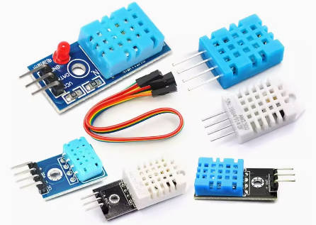
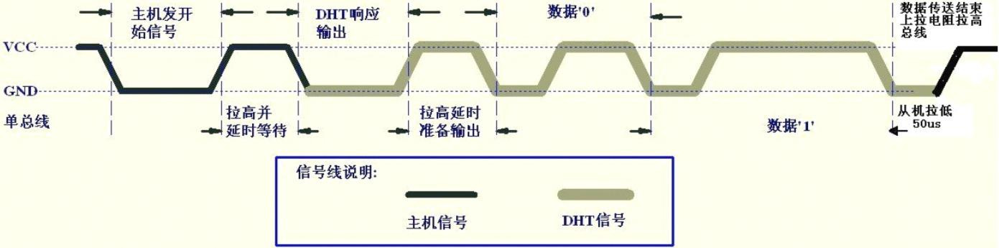
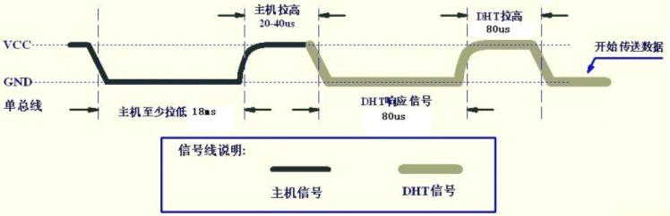
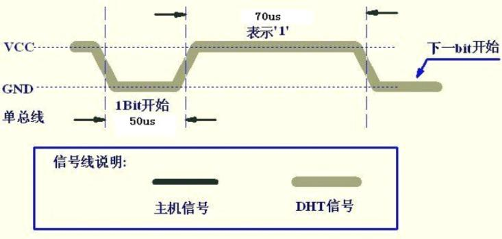
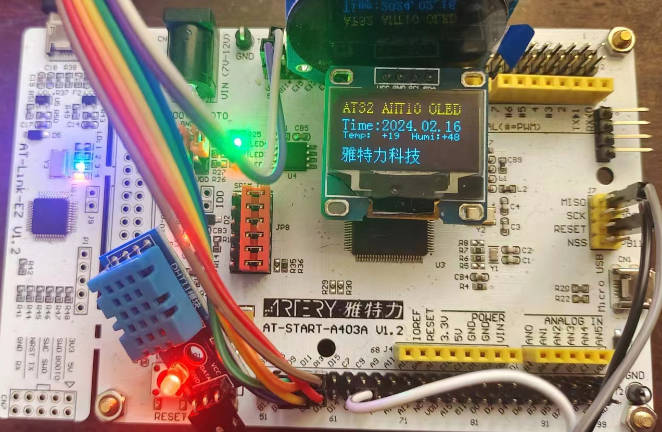

## 13-雅特力AT32A403开发板评测 传感器模块测试 DHT11温湿度传感器

### 1.软硬件平台

1. AT32A403A Board开发板

2. MDK-ARM Keil

3. 0.96寸 IIC接口 OLED显示模块

4. 传感器模块  DHT11温湿度传感器 BH1750光照强度传感器

   

   

### DHT11 温湿度传感器

DHT11是一款有已校准数字信号输出的温湿度传感器。 精度湿度+-5%RH， 温度+-2℃，量程湿度20-90%RH， 温度0~50℃。

更多DHT11信息请参考：https://baike.sogou.com/v73984313.htm?fromTitle=DHT11

下图为DHT11的引脚说明图，DATA引脚为信号输入输出。
DS18B20引脚说明


### DHT11单总线传感器驱动

DHT11 整体工作时序为：主机发送开始信号、DHT11 响应输出、主机接收 40bit 数据（湿度数据+温度数据+校验值），结束信号（可选）。具体过程如下：

1. 总线空闲状态为高电平，主机拉低总线等待 DHT11 响应, 主机把总线拉低必须大于 18ms，保证 DHT11 能检测到起始信号；

2. 主机发送开始信号结束后，拉高总线电平并延时等待 20-40us 后，读取 DHT11 的响应信号；

3. DHT11 接收到主机的开始信号后，等待微处理器开始信号结束，发送 80us 低电平响应信号；

4. DHT11 发送 80us 高电平准备发送数据；

5. DHT11 发送 40bit 数据（湿度数据+温度数据+校验值）。

   

#### 起始及响应信号

主机拉低总线至少 18ms，然后再拉高总线，延时 20~40us，此时起始信号（有时也叫复位信号）发送完毕。
DHT11 检测到复位信号后，触发一次采样，并拉低总线 80us 表示响应信号，告诉主机数据已经准备好了。DHT11 之后拉高总线 80us，然后开始传输数据。如果检测到响应信号为高电平，则 DHT11 初始化失败，请检查线路是否连接正常。



### 读时序

DHT11 开始传输数据。每 1bit 数据都以 50us 低电平开始，告诉主机开始传输一位数据了。DHT11 以高电平的长短定义数据位是 0 还是 1：当 50us 低电平过后拉高总线，高电平持续 26~28us 表示 0，高电平持续 70us 表示数据 1。
当最后 1bit 数据传送完毕后，DHT11 拉低总线 50us，表示数据传输完毕，随后总线由上拉电阻拉高进入空闲状态。

位数据0表示方式：
以 50us 低电平开始，高电平持续 26~28us 表示 0。


位数据1表示方式：
以 50us 低电平开始，高电平持续 70us 表示 1。



### 驱动代码

端口初始化

```c
/*
 * 函数名：DHT11_GPIO_Config
 * 描述  ：配置DHT11用到的I/O口
 * 输入  ：无
 * 输出  ：无
 */
 static void DHT11_GPIO_Config ( void )
 {
  gpio_init_type gpio_init_struct;

  /* enable the gpioa clock */
  crm_periph_clock_enable(DHT11_GPIO_CLOCK, TRUE);

  /* set default parameter */
  gpio_default_para_init(&gpio_init_struct);

  /* configure the gpio */
  gpio_init_struct.gpio_drive_strength = GPIO_DRIVE_STRENGTH_STRONGER;
  gpio_init_struct.gpio_out_type  = GPIO_OUTPUT_PUSH_PULL;
  gpio_init_struct.gpio_mode = GPIO_MODE_OUTPUT;
  gpio_init_struct.gpio_pins = DHT11_Dout_GPIO_PIN;
  gpio_init_struct.gpio_pull = GPIO_PULL_UP;
  gpio_init(DHT11_Dout_GPIO_PORT, &gpio_init_struct);
 }


/*
 * 函数名：DHT11_Mode_IPU
 * 描述  ：使DHT11-DATA引脚变为上拉输入模式
 * 输入  ：无
 * 输出  ：无
 */
static void DHT11_Mode_IPU(void)
{

  gpio_init_type gpio_init_struct;

  /* enable the gpioa clock */
  crm_periph_clock_enable(DHT11_GPIO_CLOCK, TRUE);

  /* set default parameter */
  gpio_default_para_init(&gpio_init_struct);

  /* configure the gpio */
  gpio_init_struct.gpio_drive_strength = GPIO_DRIVE_STRENGTH_STRONGER;
  gpio_init_struct.gpio_out_type  = GPIO_OUTPUT_PUSH_PULL;
  gpio_init_struct.gpio_mode = GPIO_MODE_INPUT;
  gpio_init_struct.gpio_pins = DHT11_Dout_GPIO_PIN;
  gpio_init_struct.gpio_pull = GPIO_PULL_UP;
  gpio_init(DHT11_Dout_GPIO_PORT, &gpio_init_struct);
	
}


/*
 * 函数名：DHT11_Mode_Out_PP
 * 描述  ：使DHT11-DATA引脚变为推挽输出模式
 * 输入  ：无
 * 输出  ：无
 */
static void DHT11_Mode_Out_PP(void)
{ 
  gpio_init_type gpio_init_struct;

  /* enable the gpioa clock */
  crm_periph_clock_enable(DHT11_GPIO_CLOCK, TRUE);

  /* set default parameter */
  gpio_default_para_init(&gpio_init_struct);

  /* configure the gpio */
  gpio_init_struct.gpio_drive_strength = GPIO_DRIVE_STRENGTH_STRONGER;
  gpio_init_struct.gpio_out_type  = GPIO_OUTPUT_PUSH_PULL;
  gpio_init_struct.gpio_mode = GPIO_MODE_OUTPUT;
  gpio_init_struct.gpio_pins = DHT11_Dout_GPIO_PIN;
  gpio_init_struct.gpio_pull = GPIO_PULL_UP;
  gpio_init(DHT11_Dout_GPIO_PORT, &gpio_init_struct);
	
}
```

从DHT11读取一个字节

```c
static uint8_t DHT11_ReadByte ( void )
{
  uint8_t i, temp=0;

  for(i=0;i<8;i++)
  {
  /*每bit以50us低电平标置开始，轮询直到从机发出 的50us 低电平 结束*/
  while(DHT11_Dout_IN()==Bit_RESET);

  /*DHT11 以26~28us的高电平表示“0”，以70us高电平表示“1”，
  *通过检测 x us后的电平即可区别这两个状 ，x 即下面的延时
  */
  HAL_DelayUs(40); //延时x us 这个延时需要大于数据0持续的时间即可

  if(DHT11_Dout_IN()==Bit_SET)/* x us后仍为高电平表示数据“1” */
  {
    /* 等待数据1的高电平结束 */
    while(DHT11_Dout_IN()==Bit_SET);

    temp|=(uint8_t)(0x01<<(7-i));//把第7-i位置1，MSB先行
  }
  else   // x us后为低电平表示数据“0”
  {
    temp&=(uint8_t)~(0x01<<(7-i)); //把第7-i位置0，MSB先行
  }
  }

  return temp;

}


```

温湿度数据获取函数

```c
/*
* 一次完整的数据传输为40bit，高位先出
* 8bit 湿度整数 + 8bit 湿度小数 + 8bit 温度整数 + 8bit 温度小数 + 8bit 校验和
*/
uint8_t DHT11_Read_TempAndHumidity(DHT11_Data_TypeDef *DHT11_Data)
{
  /*输出模式*/
  DHT11_Mode_Out_PP();
  /*主机拉低*/
  DHT11_Dout_0;
  /*延时18ms*/
  HAL_DelayMs(18);

  /*总线拉高 主机延时30us*/
  DHT11_Dout_1;

  HAL_DelayUs(30); //延时30us

  /*主机设为输入 判断从机响应信号*/
  DHT11_Mode_IPU();

  /*判断从机是否有低电平响应信号 如不响应则跳出，响应则向下运行*/
  if(DHT11_Dout_IN()==Bit_RESET)
  {
  /*轮询直到从机发出 的80us 低电平 响应信号结束*/
  while(DHT11_Dout_IN()==Bit_RESET);

  /*轮询直到从机发出的 80us 高电平 标置信号结束*/
  while(DHT11_Dout_IN()==Bit_SET);

  /*开始接收数据*/
  DHT11_Data->humi_int= DHT11_ReadByte();

  DHT11_Data->humi_deci= DHT11_ReadByte();

  DHT11_Data->temp_int= DHT11_ReadByte();

  DHT11_Data->temp_deci= DHT11_ReadByte();

  DHT11_Data->check_sum= DHT11_ReadByte();


  /*读取结束，引脚改为输出模式*/
  DHT11_Mode_Out_PP();
  /*主机拉高*/
  DHT11_Dout_1;

  /*检查读取的数据是否正确*/
  if(DHT11_Data->check_sum == DHT11_Data->humi_int + DHT11_Data->humi_deci + DHT11_Data->temp_int+ DHT11_Data->temp_deci)
    return SUCCESS;
  else
    return ERROR;
  }

  else
  return ERROR;

}

```

drv_dht11.h

```c
#ifndef __BSP_DHT11_H
#define __BSP_DHT11_H 
#include "main.h"
 
typedef struct
{
    uint8_t  humi_int;      //湿度的整数部分
    uint8_t  humi_deci;     //湿度的小数部分
    uint8_t  temp_int;      //温度的整数部分
    uint8_t  temp_deci;     //温度的小数部分
    uint8_t  check_sum;     //校验和
}DHT11_Data_TypeDef;


#define DHT11_Dout_GPIO_PORT        GPIOC
#define DHT11_Dout_GPIO_PIN         GPIO_PINS_8
#define DHT11_GPIO_CLOCK            CRM_GPIOC_PERIPH_CLOCK


#define DHT11_Dout_0                gpio_bits_write(DHT11_Dout_GPIO_PORT,DHT11_Dout_GPIO_PIN,Bit_RESET)
#define DHT11_Dout_1                gpio_bits_write(DHT11_Dout_GPIO_PORT,DHT11_Dout_GPIO_PIN,Bit_SET )
#define DHT11_Dout_IN()             gpio_input_data_bit_read( DHT11_Dout_GPIO_PORT, DHT11_Dout_GPIO_PIN )

static void DHT11_GPIO_Config ( void );
void DHT11_Init ( void );
uint8_t DHT11_Read_TempAndHumidity ( DHT11_Data_TypeDef * DHT11_Data );

#endif

```

### 案例测试

主函数

```c

#include "main.h"


void OLED_Show_Example(void)
{
      OLED_ShowString_08x16(00,0,"AT32 AHT10 OLED");
      OLED_ShowString_08x16(0,2,"Time:2024.02.16");
      OLED_ShowString_06x08(0,4,"Temp:");
      OLED_ShowString_06x08(70,4,"Humi:");
      OLED_ShowString_06x08(48,4,"^C");
      OLED_ShowString_06x08(116,4,"%");
      OLED_ShowString_06x08(0,5,"Light:");
      OLED_ShowString_06x08(100,5,"lux");
      OLED_ShowCHinese(0,6,13);
      OLED_ShowCHinese(16,6,14);
      OLED_ShowCHinese(32,6,15);
      OLED_ShowCHinese(48,6,16);
      OLED_ShowCHinese(64,6,17);
}
void Hardware_Iint(void)
{
  system_clock_config();
  at32_board_init();
  uart_print_init(115200);
  printf("Hardware_Init start [ok]\r\n");
  module_smg_gpio_iint();
  printf("module_smg_gpio_iint  [ok]\r\n");
  OLED_Init();
  printf("OLED_Init [ok]\r\n");
  DHT11_Init();
  printf("DHT11_Init [ok]\r\n");
  BH1750_Init();
  printf("BH1750_Init [ok]\r\n");
  
  printf("Hardware_Init end [ok] \r\n");
  
}
/**
  * @brief  main function.
  * @param  none
  * @retval none
  */
int main(void)
{

 
  int8_t Temperature;
  int8_t Humidity;
  float Light,aht_temp,aht_humi;  
  int8_t aht_err;  
  DHT11_Data_TypeDef DHT11_Data;
    
  Hardware_Iint();
  printf("at_start_a403a board testing 2024-02-16\r\n");
  printf("at_start_a403a board module aht10-oled \r\n");
    
  OLED_Show_Example();

  while(1)
  {
        if( DHT11_Read_TempAndHumidity ( & DHT11_Data ) == SUCCESS)
        {
                Temperature = DHT11_Data.temp_int;
                Humidity = DHT11_Data.humi_int;
        }            
       else
       {
                printf("Read DHT11 ERROR!\r\n");
       }
        printf("temperature=%d,humidity= %d \r\n" ,Temperature,Humidity);
        delay_ms(500);
        
        
       if (!i2c_CheckDevice(BH1750_Addr))
		{
			Light = LIght_Intensity();
		}
       printf("Light_Value:%.1fLx\r\n",Light);
       delay_ms(500);     
       OLED_ShowNumber_UnsignedInteger_06x08(32,4,Temperature,2);
       OLED_ShowNumber_UnsignedInteger_06x08(100,4,Humidity,2);
       OLED_ShowNumber_Float_06x08(40,5,Light,5,1);
  }
}


```

测试效果




