##  15  雅特力AT32A403开发板评测  RTOS移植-RT-Thread 线程管理测试

###  1. 软硬件平台

1. AT32A403A Board开发板

2. MDK-ARM Keil

3. RT-Thread V4.1版本源码

   发行版下载地址 https://gitee.com/rtthread/rt-thread/releases/tag/v4.1.0

   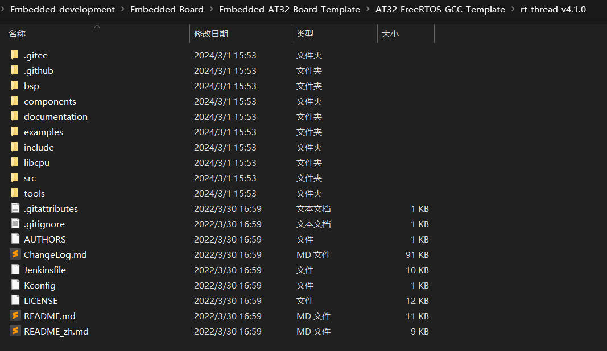

### 2. RT-Thread

RT-Thread是一个集实时操作系统（RTOS）内核、中间件组件的物联网操作系统，架构如下：

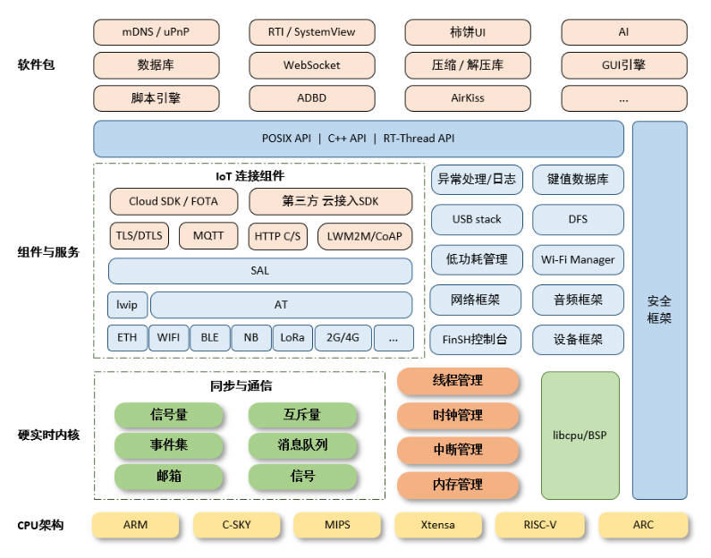

- 内核层：RT-Thread内核，是 RT-Thread的核心部分，包括了内核系统中对象的实现，例如多线程及其调度、信号量、邮箱、消息队列、内存管理、定时器等；libcpu/BSP（芯片移植相关文件 / 板级支持包）与硬件密切相关，由外设驱动和 CPU 移植构成。
- 组件与服务层：组件是基于 RT-Thread内核之上的上层软件，例如虚拟文件系统、FinSH命令行界面、网络框架、设备框架等。采用模块化设计，做到组件内部高内聚，组件之间低耦合。

### 3. AT32A403A-Board开发板移植

1. 下载RT-Thread V4.1版本源码，寻找at32相关bsp驱动包

   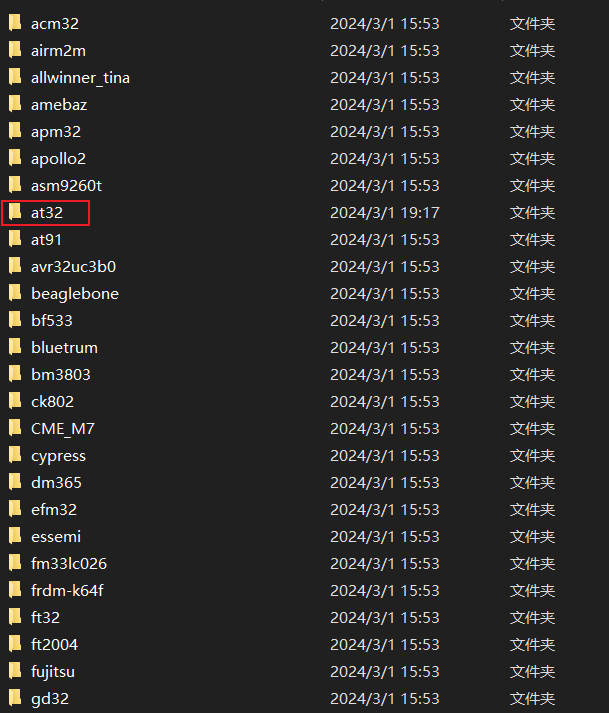

   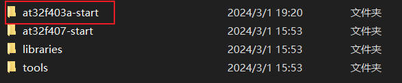

2. 复制at32f403a-start，并重新命名为at32a403a-start-board

   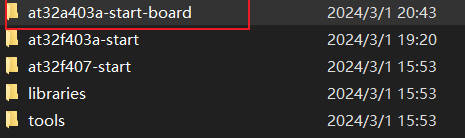

3. 打开对应的工程project,编译下载程序，发现竟然可以直接使用。

   我一直比较好奇at32f403a与at32a403a的区别是啥子，我查看一些文档，里面是芯片外设什么的都是差不多的，甚至我感觉都是一样的，但是我没有证据，但是这一次下载代码之后，发现直接通用，感觉可能是同一个芯片，应该经过了比较严格的认证。

   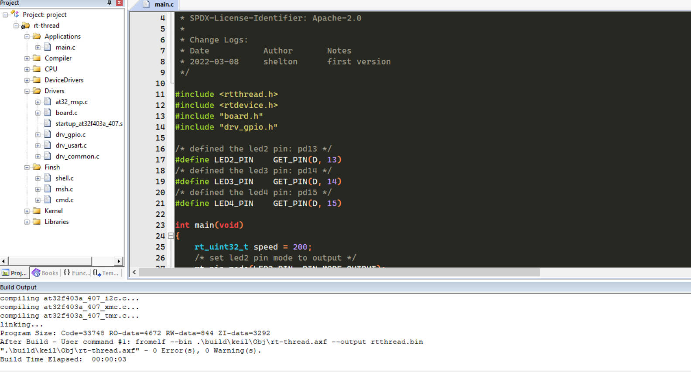

   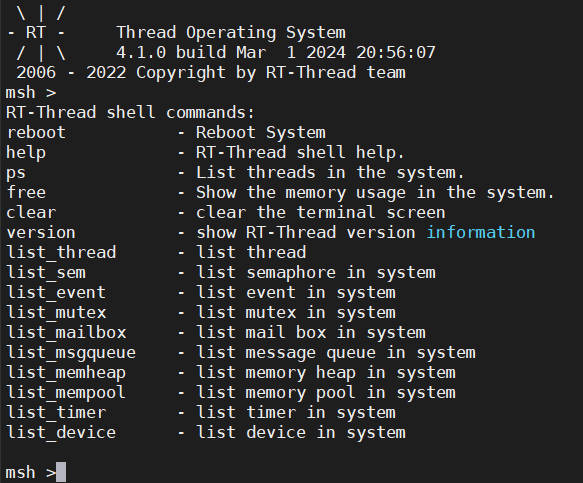

4. 虽然上面的at32f403a-start的工程可以直接使用，但是还是建立一下at32a403a的rt-thread工程吧。（主要是用at32a403a的sdk文件替代at32f403a的文件）

   重新建立工程模板，文件架构如下：

   | 名称         | 描述                                           |
   | ------------ | ---------------------------------------------- |
   | applications | 应用开发程序                                   |
   | build        | 编译环节生成中间文件                           |
   | libraries    | cmsis,drivers,rt_drivers驱动库文件             |
   | rt_examples  | 相关示例代码                                   |
   | rt-thread    | rt-thread源码文件夹                            |
   | components   | RT-Thread 的各个组件代码，例如 finsh，gui 等。 |
   | include      | RT-Thread 内核的头文件。                       |
   | libcpu       | 各类芯片的移植代码。                           |
   | src          | RT-Thread 内核的源文件。                       |

   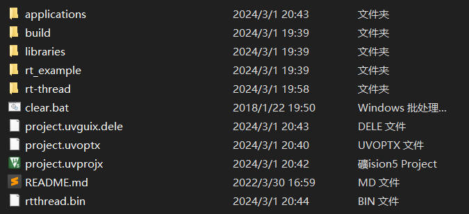

   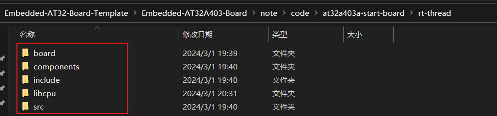

   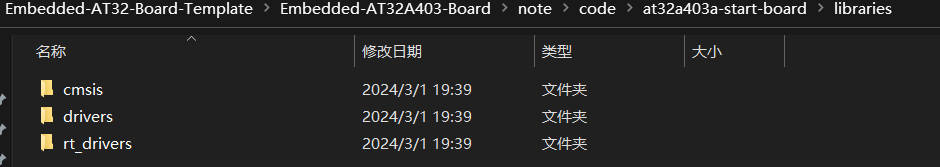

5. 打开工程，添加rt-thread源码文件，东西比较多

   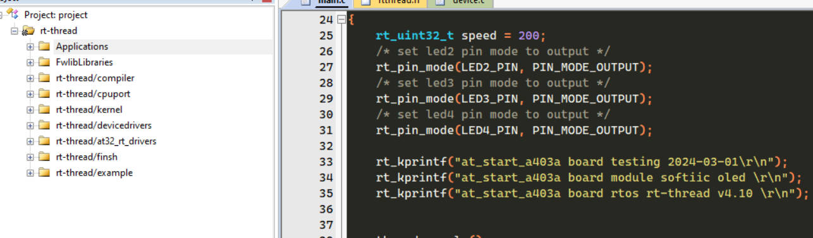

   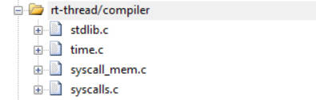

   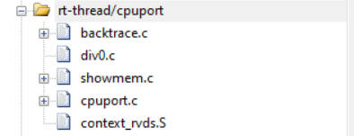

   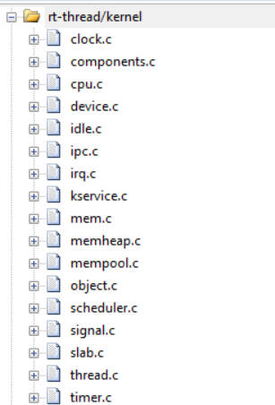

   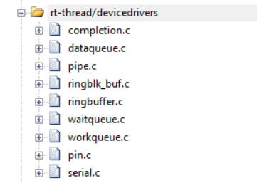

   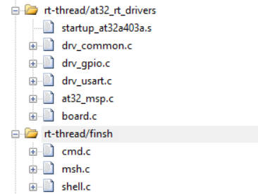

6. 添加库文件路径，这个添加也比较麻烦

   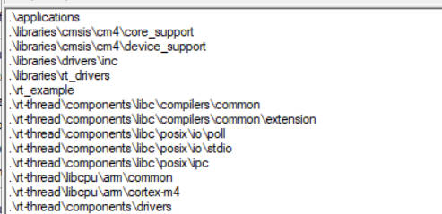

   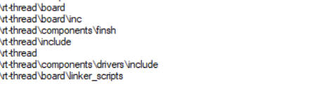

7. 添加board.c rtconfig.h文件，这两个文件非常重要。重点需要修改这两个文件。（由于直接使用at32f403a的工程，则不需要修改）

8. 注释中断文件中的HardFault_Handler、PendSV_Handler、SysTick_Handler函数

9. 编译代码（文件添加可参考工程设置，上面可能写的不清楚，因为小东西太多了）

   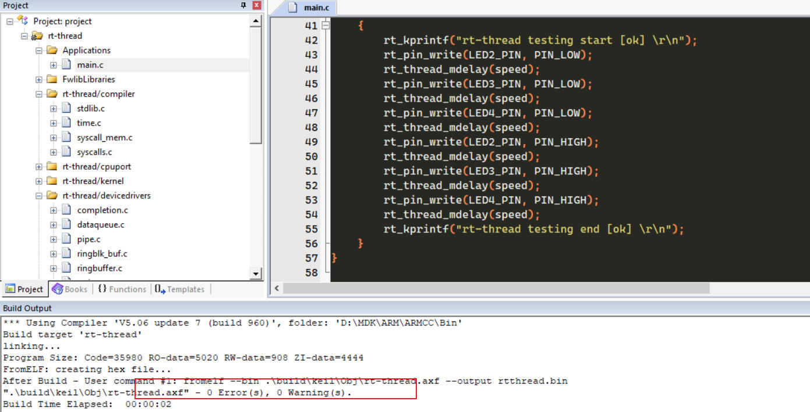

### 4. 编写程序，线程管理测试验证

1. 线程测试函数

   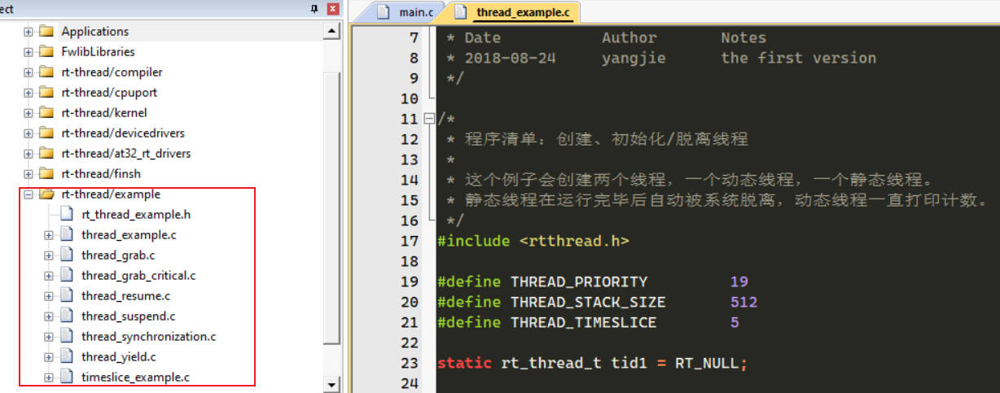

   ```c
   /* * 程序清单：创建、初始化/脱离线程
    *
    * 这个例子会创建两个线程，一个动态线程，一个静态线程。
    * 静态线程在运行完毕后自动被系统脱离，动态线程一直打印计数。
    */
   #include <rtthread.h>
   
   #define THREAD_PRIORITY         19
   #define THREAD_STACK_SIZE       512
   #define THREAD_TIMESLICE        5
   
   static rt_thread_t tid1 = RT_NULL;
   
   /* 线程1的入口函数 */
   static void thread1_entry(void *parameter)
   {
       rt_uint32_t count = 0;
   
       for (count =0 ;count< 20;count++)
       {
           /* 线程1采用低优先级运行，打印计数值20 */
           rt_kprintf("thread1 count: %d\n", count ++);
       }
       rt_kprintf("thread1 exit\n");
   }
   
   ALIGN(RT_ALIGN_SIZE)
   static char thread2_stack[1024];
   static struct rt_thread thread2;
   
   /* 线程2入口 */
   static void thread2_entry(void *param)
   {
       rt_uint32_t count = 0;
   
       /* 线程2拥有较高的优先级，以抢占线程1而获得执行 */
       for (count = 0; count < 10 ; count++)
       {
           /* 线程2打印计数值 */
           rt_kprintf("thread2 count: %d\n", count);
       }
       rt_kprintf("thread2 exit\n");
   
       /* 线程2运行结束后也将自动被系统脱离 */
   }
   
   /* 线程示例 */
   int thread_sample(void)
   {
       /* 创建线程1，名称是thread1，入口是thread1_entry*/
       tid1 = rt_thread_create("create_hread1",
                               thread1_entry, RT_NULL,
                               THREAD_STACK_SIZE,
                               THREAD_PRIORITY, THREAD_TIMESLICE);
   
       /* 如果获得线程控制块，启动这个线程 */
       if (tid1 != RT_NULL)
           rt_thread_startup(tid1);
   
       /* 初始化线程2，名称是thread2，入口是thread2_entry */
       rt_thread_init(&thread2,
                      "init_thread2",
                      thread2_entry,
                      RT_NULL,
                      &thread2_stack[0],
                      sizeof(thread2_stack),
                      THREAD_PRIORITY - 1, THREAD_TIMESLICE);
       rt_thread_startup(&thread2);
   
       return 0;
   }
   
   /* 导出到 msh 命令列表中 */
   MSH_CMD_EXPORT(thread_sample, thread sample);
   
   ```

2. 主函数

   ```c
   /*
    * Copyright (c) 2006-2021, RT-Thread Development Team
    *
    * SPDX-License-Identifier: Apache-2.0
    *
    * Change Logs:
    * Date           Author       Notes
    * 2022-03-08     shelton      first version
    */
   
   #include <rtthread.h>
   #include <rtdevice.h>
   #include "board.h"
   #include "drv_gpio.h"
   #include "rt_thread_example.h"
   /* defined the led2 pin: pd13 */
   #define LED2_PIN    GET_PIN(D, 13)
   /* defined the led3 pin: pd14 */
   #define LED3_PIN    GET_PIN(D, 14)
   /* defined the led4 pin: pd15 */
   #define LED4_PIN    GET_PIN(D, 15)
   
   int main(void)
   {
       rt_uint32_t speed = 200;
       /* set led2 pin mode to output */
       rt_pin_mode(LED2_PIN, PIN_MODE_OUTPUT);
       /* set led3 pin mode to output */
       rt_pin_mode(LED3_PIN, PIN_MODE_OUTPUT);
       /* set led4 pin mode to output */
       rt_pin_mode(LED4_PIN, PIN_MODE_OUTPUT);
       
       rt_kprintf("at_start_a403a board testing 2024-03-01\r\n");
       rt_kprintf("at_start_a403a board module softiic oled \r\n");
       rt_kprintf("at_start_a403a board rtos rt-thread v4.10 \r\n");
       
       
       thread_sample();
       
       while (1)
       {
           rt_kprintf("rt-thread testing start [ok] \r\n");
           rt_pin_write(LED2_PIN, PIN_LOW);
           rt_thread_mdelay(speed);
           rt_pin_write(LED3_PIN, PIN_LOW);
           rt_thread_mdelay(speed);
           rt_pin_write(LED4_PIN, PIN_LOW);
           rt_thread_mdelay(speed);
           rt_pin_write(LED2_PIN, PIN_HIGH);
           rt_thread_mdelay(speed);
           rt_pin_write(LED3_PIN, PIN_HIGH);
           rt_thread_mdelay(speed);
           rt_pin_write(LED4_PIN, PIN_HIGH);
           rt_thread_mdelay(speed);
           rt_kprintf("rt-thread testing end [ok] \r\n");
       }
   }
   ```

   

3. 测试效果

   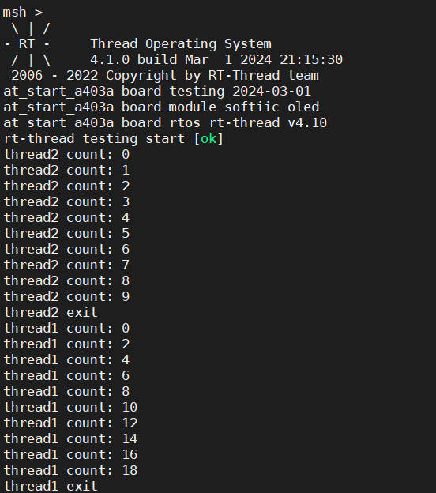

   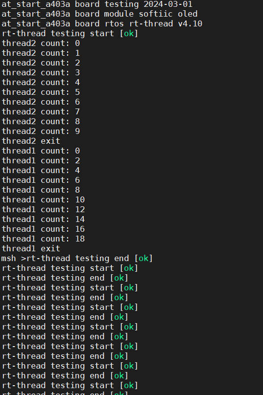

 整个程序先执行thread2,因为THREAD_PRIORITY优先级比thread1高，thread2打印完成10次计数值之后，就执行thread1，打印完成20次计数值结束。同时FINSH完美正常使用。