## 16  雅特力AT32A403开发板评测  RTOS移植-FreeRTOS 任务调度管理等应用测试

###  1. 软硬件平台

1. AT32A403A Board开发板

2. MDK-ARM Keil

3. FreeRTOS源码

   

### 2. FreeRTOS

在嵌入式领域，嵌入式实时操作系统正得到越来越广泛的应用。采用嵌入式操作系统（RTOS）可以 更合理、更高效的利用CPU的资源，简化应用软件的设计，缩短系统开发时间，更好的保证系统的 实时性和可靠性。 

FreeRTOS是一个轻量级的实时操作系统内核。作为一个轻量级的操作系统，功能包括：任务管理、 时间管理、信号量、消息队列、内存管理、记录功能、软件定时器、协程等，可基本满足较小系统的 需求。由于RTOS需要占用一定系统资源（尤其是RAM资源），只有UCOSII/III、embOS、RTT、 FreeRTOS等少数实时操作系统能在小RAM的MCU上运行。相对于UCOSII/III和embOS等商用操作 系统，FreeRTOS是免费开源的操作系统，具有源码公开、可移植、可剪裁、调度策略灵活等特点， 可以方便的移植到MCU上运行。


#### FreeRTOS主要功能和特点如下： 

1.  用户可配置内核功能 
2. 多平台的支持 
3. 提供一个高层次的信任代码的完整性 
4.  目标代码小、简单易用 
5. 遵循MISRA-C标准编程规范
6.  强大的执行跟踪功能 
7. 堆栈溢出检测
8. 没有限制的任务数量和优先级 
9. 多个任务可以分配相同的优先权 
10.  队列、二进制信号量、计数信号量、递归通信和同步的任务 
11. 优先级继承 

#### 系统功能 

作为一个轻量级的操作系统，功能包括：任务管理、时间管理、信号量、消息队列、内存管理、记录 功能、软件定时器、协程等，可基本满足较小系统的需求。FreeRTOS内核支持优先级调度算法，不 同任务可根据重要程度的不同被赋予一定的优先级，CPU总是让处于任务就绪、优先级最高的任务 运行。FreeRTOS同样支持时间片轮转调度算法，系统允许不同的任务处于同一优先级下，在没有更 高优先级任务就绪的情况下，同一优先级的任务共享系统资源。 FreeRTOS内核可根据需要设置为可剥夺型内核和不可剥夺型内核。当FreeRTOS配置成可剥夺型内 核时，处于就绪态的高优先级任务能剥夺低优先级任务的CPU使用权，这样提高了系统的实时性； 当FreeRTOS配置成不可剥夺型内核时，处于就绪态的高优先级任务只能等当前任务主动释放CPU使 用权才能获得运行，这样提高了系统的运行效率。

### 3. AT32官方 FreeRTOS例程

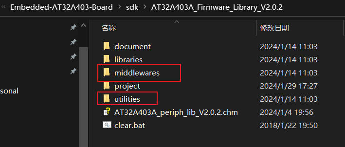

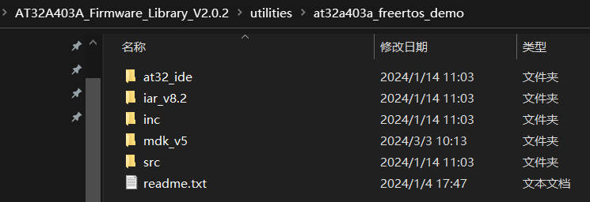

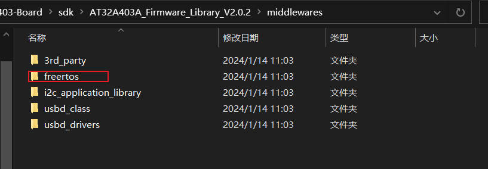

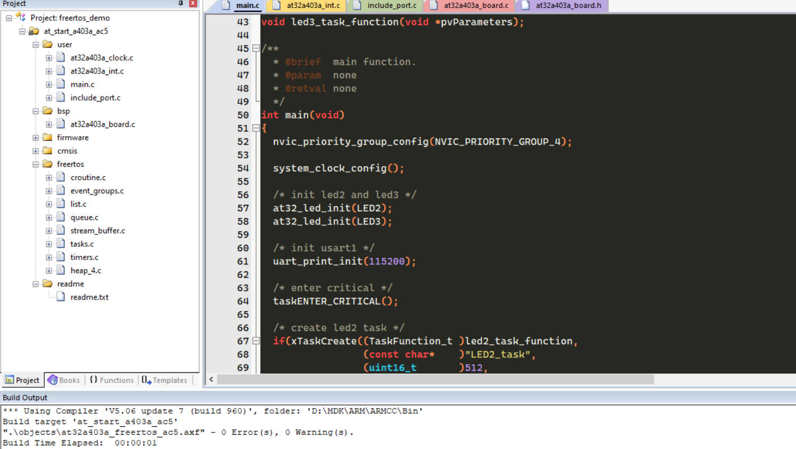

编译代码，正常运行

### 4. AT32A403A-Board开发板移植

1. 下载FreeRTOS源码

   下载地址https://www.freertos.org/zh-cn-cmn-s/a00104.html

   

   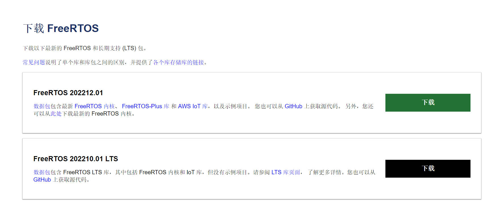

   在下载页发现有不少关于FreeRTOS内核的文档，后续学习可以参考

   

   查看下载的压缩包，主要需要的是FreeRTOS内核文件，库文件等（Source,include,portable）

   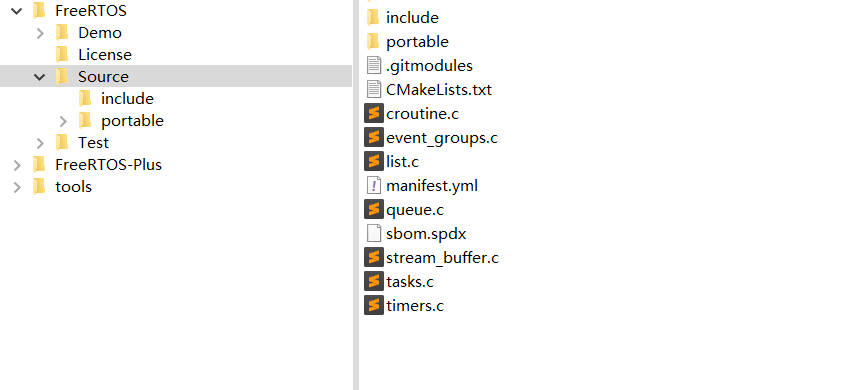

2. 重新建立工程模板，添加FreeRTOS文件夹.

   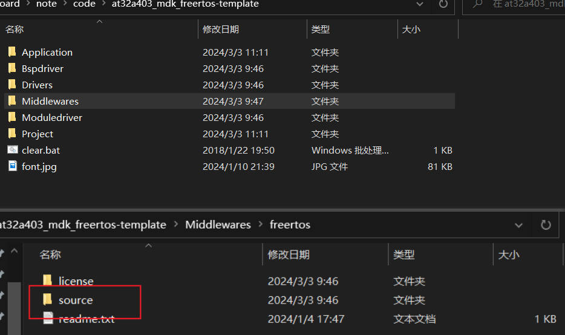

3. 添加FreeRTOS源代码到工程中

   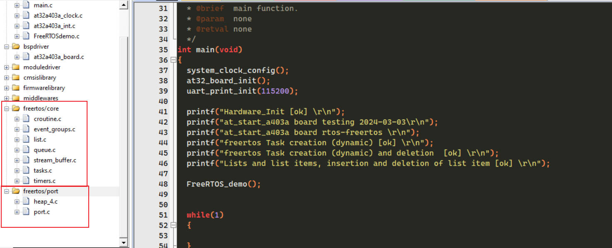

   freertos/core 内核源代码  freertos/port 任务调度算法 宏定义文件 不同芯片平台的接口文件（这里使用的Cortex-M4F）

   添加库文件路径

   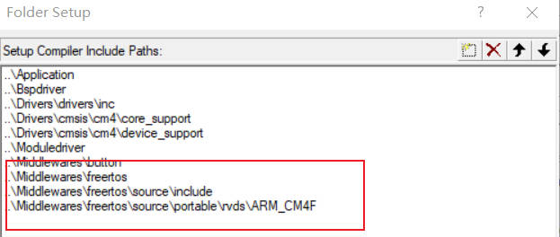

4. 添加FreeRTOSConfig.h配置文件

   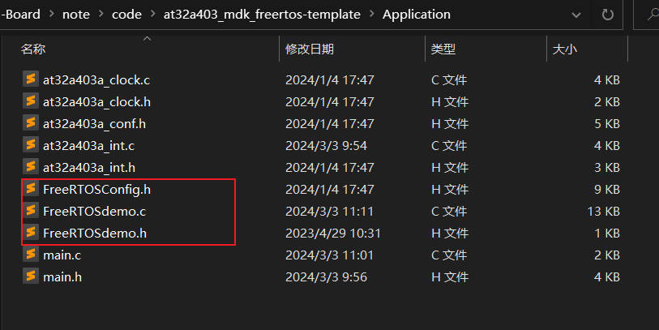

   ### 4.编写程序，任务调度管理等应用测试验证

   1. 任务创建与调度测试

   ```c
   #include "main.h"
   //--------------------------------------------------------------------------------------------------
   //  自定义    |   0   |   1   |   2   |   3   |   4   |   5   |   6   |   7   |   8   |   9   
   //--------------------------------------------------------------------------------------------------
   #define Delete_Task  1              //测试任务删除API
   #define Suspend_Resume_Task 0       //测试任务挂起与恢复API
   #define NULL 0
   
   //--------------------------------------------------------------------------------------------------
   //  FreeRTOS相关定义    |   0   |   1   |   2   |   3   |   4   |   5   |   6   |   7   |   8   |   9   
   //--------------------------------------------------------------------------------------------------
   /******************************************************
    *  START_TASK 任务 配置
    *  包括: 任务句柄 任务优先级 堆栈大小 创建任务
    *****************************************************/
   //任务优先级
   #define START_TASK_PRIO		1
   //任务堆栈大小	
   #define START_STK_SIZE 		128  
   //任务句柄
   TaskHandle_t StartTask_Handler;
   //任务函数
   void start_task(void *pvParameters);
   /******************************************************
    *  led1_task 任务 配置
    *  包括: 任务句柄 任务优先级 堆栈大小 创建任务
    *****************************************************/
   //任务优先级
   #define LED1_TASK_PRIO		2
   //任务堆栈大小	
   #define LED1_STK_SIZE 		128  
   //任务句柄
   TaskHandle_t LED1Task_Handler;
   //任务函数
   void led1_task(void *pvParameters);
   /******************************************************
    *  led2_task 任务 配置
    *  包括: 任务句柄 任务优先级 堆栈大小 创建任务
    *****************************************************/
   //任务优先级
   #define LED2_TASK_PRIO		3
   //任务堆栈大小	
   #define LED2_STK_SIZE 		128  
   //任务句柄
   TaskHandle_t LED2Task_Handler;
   //任务函数
   void led2_task(void *pvParameters);
   
   //开始任务任务函数
   void start_task(void *pvParameters)
   {
       taskENTER_CRITICAL();           //进入临界区
       //创建LED0任务
       xTaskCreate((TaskFunction_t )led1_task,     	
                   (const char*    )"led1_task",   	
                   (uint16_t       )LED1_STK_SIZE, 
                   (void*          )NULL,				
                   (UBaseType_t    )LED1_TASK_PRIO,	
                   (TaskHandle_t*  )&LED1Task_Handler);   
       //创建LED1任务
       xTaskCreate((TaskFunction_t )led2_task,     
                   (const char*    )"led2_task",   
                   (uint16_t       )LED2_STK_SIZE, 
                   (void*          )NULL,
                   (UBaseType_t    )LED2_TASK_PRIO,
                   (TaskHandle_t*  )&LED2Task_Handler);              
       vTaskDelete(StartTask_Handler); //删除开始任务
       taskEXIT_CRITICAL();            //退出临界区
   }
   
   //LED2任务函数 
   void led1_task(void *pvParameters)
   {
       //uint32_t task1_num =0;
       while(1)
       {
           //printf("task1_num:%d\r\n",++task1_num);
           printf("led1task is Running...\r\n");
           at32_led_toggle(LED2);
           vTaskDelay(500);
       }
   }   
   
   //LED2任务函数
   void led2_task(void *pvParameters)
   {
       //uint32_t task2_num =0;
       while(1)
       {
           //printf("task2_num:%d\r\n",++task2_num);
           printf("led2task is Running... \r\n");
           at32_led_toggle(LED3);
           vTaskDelay(100);
       }
   }
   
   ```

   2. 任务动态创建与删除测试

   ```c
   #include "main.h"
   //--------------------------------------------------------------------------------------------------
   //  自定义    |   0   |   1   |   2   |   3   |   4   |   5   |   6   |   7   |   8   |   9   
   //--------------------------------------------------------------------------------------------------
   #define Delete_Task  1              //测试任务删除API
   #define Suspend_Resume_Task 0       //测试任务挂起与恢复API
   #define NULL 0
   
   //--------------------------------------------------------------------------------------------------
   //  FreeRTOS相关定义    |   0   |   1   |   2   |   3   |   4   |   5   |   6   |   7   |   8   |   9   
   //--------------------------------------------------------------------------------------------------
   /******************************************************
    *  START_TASK 任务 配置
    *  包括: 任务句柄 任务优先级 堆栈大小 创建任务
    *****************************************************/
   //任务优先级
   #define START_TASK_PRIO		1
   //任务堆栈大小	
   #define START_STK_SIZE 		128  
   //任务句柄
   TaskHandle_t StartTask_Handler;
   //任务函数
   void start_task(void *pvParameters);
   /******************************************************
    *  led1_task 任务 配置
    *  包括: 任务句柄 任务优先级 堆栈大小 创建任务
    *****************************************************/
   //任务优先级
   #define LED1_TASK_PRIO		2
   //任务堆栈大小	
   #define LED1_STK_SIZE 		128  
   //任务句柄
   TaskHandle_t LED1Task_Handler;
   //任务函数
   void led1_task(void *pvParameters);
   /******************************************************
    *  led2_task 任务 配置
    *  包括: 任务句柄 任务优先级 堆栈大小 创建任务
    *****************************************************/
   //任务优先级
   #define LED2_TASK_PRIO		3
   //任务堆栈大小	
   #define LED2_STK_SIZE 		128  
   //任务句柄
   TaskHandle_t LED2Task_Handler;
   //任务函数
   void led2_task(void *pvParameters);
   /******************************************************
    *  key_task 任务 配置
    *  包括: 任务句柄 任务优先级 堆栈大小 创建任务
    *****************************************************/
   //任务优先级
   #define KEY_TASK_PRIO		4
   //任务堆栈大小	
   #define KEY_STK_SIZE 		128
   //任务句柄
   TaskHandle_t KEYTask_Handler;
   //任务函数
   void key_task(void *pvParameters);
   
   ///******************************************************
   // *  float_task 任务 配置
   // *  包括: 任务句柄 任务优先级 堆栈大小 创建任务
   // *****************************************************/
   ////任务优先级
   //#define FLOAT_TASK_PRIO		4
   ////任务堆栈大小	
   //#define FLOAT_STK_SIZE 		50
   ////任务句柄
   //TaskHandle_t FLOATTask_Handler;
   ////任务函数
   //void float_task(void *pvParameters);
   
   /******************************************************
    *  list_task 任务 配置
    *  包括: 任务句柄 任务优先级 堆栈大小 创建任务
    *****************************************************/
   //任务优先级
   #define LIST_TASK_PRIO		5
   //任务堆栈大小	
   #define LIST_STK_SIZE 		128  
   //任务句柄
   TaskHandle_t LISTTask_Handler;
   //任务函数
   void list_task(void *pvParameters);
   
   
   //开始任务任务函数
   void start_task(void *pvParameters)
   {
       taskENTER_CRITICAL();           //进入临界区
       //创建LED0任务
       xTaskCreate((TaskFunction_t )led1_task,     	
                   (const char*    )"led1_task",   	
                   (uint16_t       )LED1_STK_SIZE, 
                   (void*          )NULL,				
                   (UBaseType_t    )LED1_TASK_PRIO,	
                   (TaskHandle_t*  )&LED1Task_Handler);   
       //创建LED1任务
       xTaskCreate((TaskFunction_t )led2_task,     
                   (const char*    )"led2_task",   
                   (uint16_t       )LED2_STK_SIZE, 
                   (void*          )NULL,
                   (UBaseType_t    )LED2_TASK_PRIO,
                   (TaskHandle_t*  )&LED2Task_Handler); 
       //按键测试任务
       xTaskCreate((TaskFunction_t )key_task,     
                   (const char*    )"key_task",   
                   (uint16_t       )KEY_STK_SIZE, 
                   (void*          )NULL,
                   (UBaseType_t    )KEY_TASK_PRIO,
                   (TaskHandle_t*  )&KEYTask_Handler);             
       vTaskDelete(StartTask_Handler); //删除开始任务
       taskEXIT_CRITICAL();            //退出临界区
   }
   
   //LED2任务函数 
   void led1_task(void *pvParameters)
   {
       //uint32_t task1_num =0;
       while(1)
       {
           //printf("task1_num:%d\r\n",++task1_num);
           printf("led1task is Running...\r\n");
           at32_led_toggle(LED2);
           vTaskDelay(500);
       }
   }   
   
   //LED2任务函数
   void led2_task(void *pvParameters)
   {
       //uint32_t task2_num =0;
       while(1)
       {
           //printf("task2_num:%d\r\n",++task2_num);
           printf("led2task is Running... \r\n");
           at32_led_toggle(LED3);
           vTaskDelay(100);
       }
   }
   
   //按键测试任务 判断按键KEY0，按下KEY0删除task1 */
   void key_task(void *pvParameters)
   {   
       uint8_t key=0;
   	#if Delete_Task
       
       while(1)
       {
           printf("key_task is Running... \r\n");
           key = at32_button_press();  //按键扫描
           if(key == USER_BUTTON)
           {
               if(LED1Task_Handler != NULL)
               {
                   printf("delete led1_task... \r\n");
                   vTaskDelete(LED1Task_Handler);
                   LED1Task_Handler = NULL;
               }
   
           }
           vTaskDelay(10);
       }
       #endif
      
   	
   }
   
   
   ```
   
   
   
   3. 任务 列表项应用测试
   
   ```c
   #include "main.h"
   //--------------------------------------------------------------------------------------------------
   //  自定义    |   0   |   1   |   2   |   3   |   4   |   5   |   6   |   7   |   8   |   9   
   //--------------------------------------------------------------------------------------------------
   #define Delete_Task  1              //测试任务删除API
   #define Suspend_Resume_Task 0       //测试任务挂起与恢复API
   #define NULL 0
   
   //--------------------------------------------------------------------------------------------------
   //  FreeRTOS相关定义    |   0   |   1   |   2   |   3   |   4   |   5   |   6   |   7   |   8   |   9   
   //--------------------------------------------------------------------------------------------------
   /******************************************************
    *  START_TASK 任务 配置
    *  包括: 任务句柄 任务优先级 堆栈大小 创建任务
    *****************************************************/
   //任务优先级
   #define START_TASK_PRIO		1
   //任务堆栈大小	
   #define START_STK_SIZE 		128  
   //任务句柄
   TaskHandle_t StartTask_Handler;
   //任务函数
   void start_task(void *pvParameters);
   /******************************************************
    *  led1_task 任务 配置
    *  包括: 任务句柄 任务优先级 堆栈大小 创建任务
    *****************************************************/
   //任务优先级
   #define LED1_TASK_PRIO		2
   //任务堆栈大小	
   #define LED1_STK_SIZE 		128  
   //任务句柄
   TaskHandle_t LED1Task_Handler;
   //任务函数
   void led1_task(void *pvParameters);
   /******************************************************
    *  led2_task 任务 配置
    *  包括: 任务句柄 任务优先级 堆栈大小 创建任务
    *****************************************************/
   //任务优先级
   #define LED2_TASK_PRIO		3
   //任务堆栈大小	
   #define LED2_STK_SIZE 		128  
   //任务句柄
   TaskHandle_t LED2Task_Handler;
   //任务函数
   void led2_task(void *pvParameters);
   /******************************************************
    *  key_task 任务 配置
    *  包括: 任务句柄 任务优先级 堆栈大小 创建任务
    *****************************************************/
   //任务优先级
   #define KEY_TASK_PRIO		4
   //任务堆栈大小	
   #define KEY_STK_SIZE 		128
   //任务句柄
   TaskHandle_t KEYTask_Handler;
   //任务函数
   void key_task(void *pvParameters);
   
   ///******************************************************
   // *  float_task 任务 配置
   // *  包括: 任务句柄 任务优先级 堆栈大小 创建任务
   // *****************************************************/
   ////任务优先级
   //#define FLOAT_TASK_PRIO		4
   ////任务堆栈大小	
   //#define FLOAT_STK_SIZE 		50
   ////任务句柄
   //TaskHandle_t FLOATTask_Handler;
   ////任务函数
   //void float_task(void *pvParameters);
   
   /******************************************************
    *  list_task 任务 配置
    *  包括: 任务句柄 任务优先级 堆栈大小 创建任务
    *****************************************************/
   //任务优先级
   #define LIST_TASK_PRIO		5
   //任务堆栈大小	
   #define LIST_STK_SIZE 		128  
   //任务句柄
   TaskHandle_t LISTTask_Handler;
   //任务函数
   void list_task(void *pvParameters);
   
   
   //开始任务任务函数
   void start_task(void *pvParameters)
   {
       taskENTER_CRITICAL();           //进入临界区
       //创建LED0任务
       xTaskCreate((TaskFunction_t )led1_task,     	
                   (const char*    )"led1_task",   	
                   (uint16_t       )LED1_STK_SIZE, 
                   (void*          )NULL,				
                   (UBaseType_t    )LED1_TASK_PRIO,	
                   (TaskHandle_t*  )&LED1Task_Handler);   
       //创建LED1任务
       xTaskCreate((TaskFunction_t )led2_task,     
                   (const char*    )"led2_task",   
                   (uint16_t       )LED2_STK_SIZE, 
                   (void*          )NULL,
                   (UBaseType_t    )LED2_TASK_PRIO,
                   (TaskHandle_t*  )&LED2Task_Handler); 
       //按键测试任务
   //    xTaskCreate((TaskFunction_t )key_task,     
   //                (const char*    )"key_task",   
   //                (uint16_t       )KEY_STK_SIZE, 
   //                (void*          )NULL,
   //                (UBaseType_t    )KEY_TASK_PRIO,
   //                (TaskHandle_t*  )&KEYTask_Handler);  
       //浮点测试任务
   //    xTaskCreate((TaskFunction_t )float_task,     
   //                (const char*    )"float_task",   
   //                (uint16_t       )FLOAT_STK_SIZE, 
   //                (void*          )NULL,
   //                (UBaseType_t    )FLOAT_TASK_PRIO,
   //                (TaskHandle_t*  )&FLOATTask_Handler);  
        xTaskCreate((TaskFunction_t )list_task,     	
                   (const char*    )"list_task",   	
                   (uint16_t       )LIST_STK_SIZE, 
                   (void*          )NULL,				
                   (UBaseType_t    )LIST_TASK_PRIO,	
                   (TaskHandle_t*  )&LISTTask_Handler);               
       vTaskDelete(StartTask_Handler); //删除开始任务
       taskEXIT_CRITICAL();            //退出临界区
   }
   
   //LED2任务函数 
   void led1_task(void *pvParameters)
   {
       //uint32_t task1_num =0;
       while(1)
       {
           //printf("task1_num:%d\r\n",++task1_num);
           printf("led1task is Running...\r\n");
           at32_led_toggle(LED2);
           vTaskDelay(500);
       }
   }   
   
   //LED2任务函数
   void led2_task(void *pvParameters)
   {
       //uint32_t task2_num =0;
       while(1)
       {
           //printf("task2_num:%d\r\n",++task2_num);
           printf("led2task is Running... \r\n");
           at32_led_toggle(LED3);
           vTaskDelay(100);
       }
   }
   
   //按键测试任务 判断按键KEY0，按下KEY0删除task1 */
   void key_task(void *pvParameters)
   {   
       uint8_t key=0;
   	#if Delete_Task
       
       while(1)
       {
           printf("key_task is Running... \r\n");
           key = at32_button_press();  //按键扫描
           if(key == USER_BUTTON)
           {
               if(LED1Task_Handler != NULL)
               {
                   printf("delete led1_task... \r\n");
                   vTaskDelete(LED1Task_Handler);
                   LED1Task_Handler = NULL;
               }
   
           }
           vTaskDelay(10);
       }
       #endif
   
   	
   }
   
   List_t          TestList;           /* 定义测试列表 */
   ListItem_t      ListItem1;          /* 定义测试列表项1 */
   ListItem_t      ListItem2;          /* 定义测试列表项2 */
   ListItem_t      ListItem3;          /* 定义测试列表项3 */
   
   void list_task(void *pvParameters)
   {
       vListInitialise(&TestList);         /* 初始化列表 */
       vListInitialiseItem(&ListItem1);    /* 初始化列表项1 */
       vListInitialiseItem(&ListItem2);    /* 初始化列表项2 */
       vListInitialiseItem(&ListItem3);    /* 初始化列表项3 */
       ListItem1.xItemValue = 40;
       ListItem2.xItemValue = 60;
       ListItem3.xItemValue = 50;
   
       /* 第二步：打印列表和其他列表项的地址 */
       printf("/**************第二步：打印列表和列表项的地址**************/\r\n");
       printf("项目\t\t\t地址\r\n");
       printf("TestList\t\t0x%p\t\r\n", &TestList);
       printf("TestList->pxIndex\t0x%p\t\r\n", TestList.pxIndex);
       printf("TestList->xListEnd\t0x%p\t\r\n", (&TestList.xListEnd));
       printf("ListItem1\t\t0x%p\t\r\n", &ListItem1);
       printf("ListItem2\t\t0x%p\t\r\n", &ListItem2);
       printf("ListItem3\t\t0x%p\t\r\n", &ListItem3);
       printf("/**************************结束***************************/\r\n");
       
       printf("\r\n/*****************第三步--列表项1插入列表******************/\r\n");
       vListInsert((List_t*    )&TestList,         /* 列表 */
                   (ListItem_t*)&ListItem1);       /* 列表项 */
       printf("项目\t\t\t\t地址\r\n");
       printf("TestList->xListEnd->pxNext\t0x%p\r\n", (TestList.xListEnd.pxNext));
       printf("ListItem1->pxNext\t\t0x%p\r\n", (ListItem1.pxNext));
       printf("TestList->xListEnd->pxPrevious\t0x%p\r\n", (TestList.xListEnd.pxPrevious));
       printf("ListItem1->pxPrevious\t\t0x%p\r\n", (ListItem1.pxPrevious));
       printf("/**************************结束***************************/\r\n");
       
       /* 第四步：列表项2插入列表 */
       printf("\r\n/*****************第四步--列表项2插入列表******************/\r\n");
       vListInsert((List_t*    )&TestList,         /* 列表 */
                   (ListItem_t*)&ListItem2);       /* 列表项 */
       printf("项目\t\t\t\t地址\r\n");
       printf("TestList->xListEnd->pxNext\t0x%p\r\n", (TestList.xListEnd.pxNext));
       printf("ListItem1->pxNext\t\t0x%p\r\n", (ListItem1.pxNext));
       printf("ListItem2->pxNext\t\t0x%p\r\n", (ListItem2.pxNext));
       printf("TestList->xListEnd->pxPrevious\t0x%p\r\n", (TestList.xListEnd.pxPrevious));
       printf("ListItem1->pxPrevious\t\t0x%p\r\n", (ListItem1.pxPrevious));
       printf("ListItem2->pxPrevious\t\t0x%p\r\n", (ListItem2.pxPrevious));
       printf("/**************************结束***************************/\r\n");
       
       /* 第五步：列表项3插入列表 */
       printf("\r\n/*****************第五步--列表项3插入列表******************/\r\n");
       vListInsert((List_t*    )&TestList,         /* 列表 */
                   (ListItem_t*)&ListItem3);       /* 列表项 */
       printf("项目\t\t\t\t地址\r\n");
       printf("TestList->xListEnd->pxNext\t0x%p\r\n", (TestList.xListEnd.pxNext));
       printf("ListItem1->pxNext\t\t0x%p\r\n", (ListItem1.pxNext));
       printf("ListItem2->pxNext\t\t0x%p\r\n", (ListItem2.pxNext));
       printf("ListItem3->pxNext\t\t0x%p\r\n", (ListItem3.pxNext));
       printf("TestList->xListEnd->pxPrevious\t0x%p\r\n", (TestList.xListEnd.pxPrevious));
       printf("ListItem1->pxPrevious\t\t0x%p\r\n", (ListItem1.pxPrevious));
       printf("ListItem2->pxPrevious\t\t0x%p\r\n", (ListItem2.pxPrevious));
       printf("ListItem3->pxPrevious\t\t0x%p\r\n", (ListItem3.pxPrevious));
       printf("/**************************结束***************************/\r\n");
       
       /* 第六步：移除列表项2 */
       printf("\r\n/*******************第六步--移除列表项2********************/\r\n");
       uxListRemove((ListItem_t*   )&ListItem2);   /* 移除列表项 */
       printf("项目\t\t\t\t地址\r\n");
       printf("TestList->xListEnd->pxNext\t0x%p\r\n", (TestList.xListEnd.pxNext));
       printf("ListItem1->pxNext\t\t0x%p\r\n", (ListItem1.pxNext));
       printf("ListItem3->pxNext\t\t0x%p\r\n", (ListItem3.pxNext));
       printf("TestList->xListEnd->pxPrevious\t0x%p\r\n", (TestList.xListEnd.pxPrevious));
       printf("ListItem1->pxPrevious\t\t0x%p\r\n", (ListItem1.pxPrevious));
       printf("ListItem3->pxPrevious\t\t0x%p\r\n", (ListItem3.pxPrevious));
       printf("/**************************结束***************************/\r\n");
       
       /* 第七步：列表末尾添加列表项2 */
       printf("\r\n/****************第七步--列表末尾添加列表项2****************/\r\n");
       TestList.pxIndex = &ListItem1;
       vListInsertEnd((List_t*     )&TestList,     /* 列表 */
                      (ListItem_t* )&ListItem2);   /* 列表项 */
       printf("项目\t\t\t\t地址\r\n");
       printf("TestList->pxIndex\t\t0x%p\r\n", TestList.pxIndex);
       printf("TestList->xListEnd->pxNext\t0x%p\r\n", (TestList.xListEnd.pxNext));
       printf("ListItem1->pxNext\t\t0x%p\r\n", (ListItem1.pxNext));
       printf("ListItem2->pxNext\t\t0x%p\r\n", (ListItem2.pxNext));
       printf("ListItem3->pxNext\t\t0x%p\r\n", (ListItem3.pxNext));
       printf("TestList->xListEnd->pxPrevious\t0x%p\r\n", (TestList.xListEnd.pxPrevious));
       printf("ListItem1->pxPrevious\t\t0x%p\r\n", (ListItem1.pxPrevious));
       printf("ListItem2->pxPrevious\t\t0x%p\r\n", (ListItem2.pxPrevious));
       printf("ListItem3->pxPrevious\t\t0x%p\r\n", (ListItem3.pxPrevious));
       printf("/************************实验结束***************************/\r\n");
       while(1)
       {
           vTaskDelay(1000);
       }
   }
   
   
   
   ```
   
   
   
   4. 测试效果
   
      1. 主函数
   
         ```c
         #include "main.h"
         void FreeRTOS_demo(void)
         {
             xTaskCreate((TaskFunction_t )start_task,            //任务函数
                         (const char*    )"start_task",          //任务名称
                         (uint16_t       )START_STK_SIZE,        //任务堆栈大小
                         (void*          )NULL,                  //传递给任务函数的参数
                         (UBaseType_t    )START_TASK_PRIO,       //任务优先级
                         (TaskHandle_t*  )&StartTask_Handler);   //任务句柄              
                 vTaskStartScheduler();          //开启任务调度
         }
         
         /**
           * @brief  main function.
           * @param  none
           * @retval none
           */
         int main(void)
         {
           system_clock_config();
           at32_board_init();
           uart_print_init(115200);
           
           printf("Hardware_Init [ok] \r\n");
           printf("at_start_a403a board testing 2024-03-03\r\n");
           printf("at_start_a403a board rtos-freertos \r\n");
           printf("freertos Task creation (dynamic) [ok] \r\n");
           printf("freertos Task creation (dynamic) and deletion  [ok] \r\n");
           printf("Lists and list items, insertion and deletion of list item [ok] \r\n");
           
           FreeRTOS_demo();
           
          
           while(1)
           {
              
           }
         }
         
         
         ```
   
         
   
      2. 测试效果
   
         2.1 任务动态创建
   
         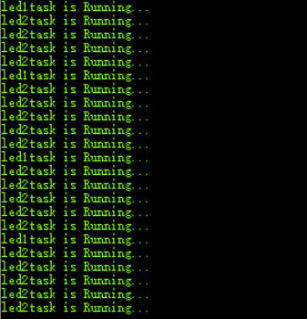
   
         2.2 任务动态创建与删除
   
         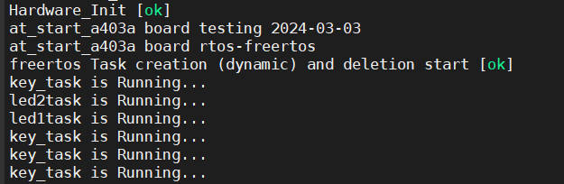
   
         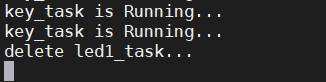
   
         2.3 任务动态创建 列表项应用
   
         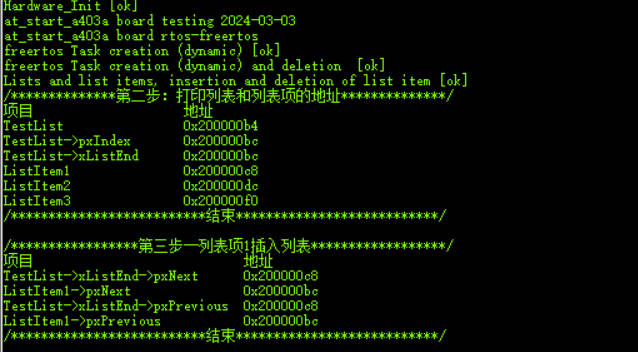
   
         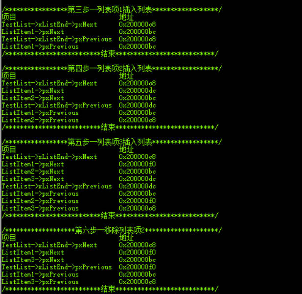
   
         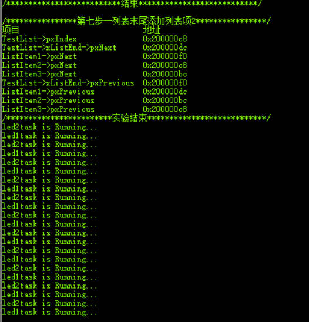
   
         
   
         
         
         