## 武汉芯源CW32F030开发板评测 00 CW32开发者社区

CW32-Template第三方资源集合 （个人整理收集）
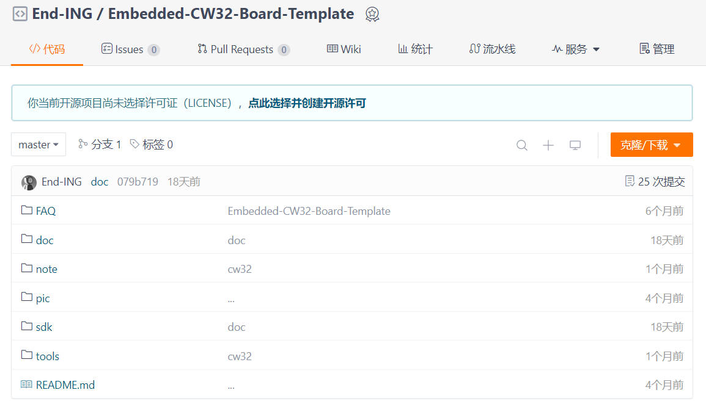
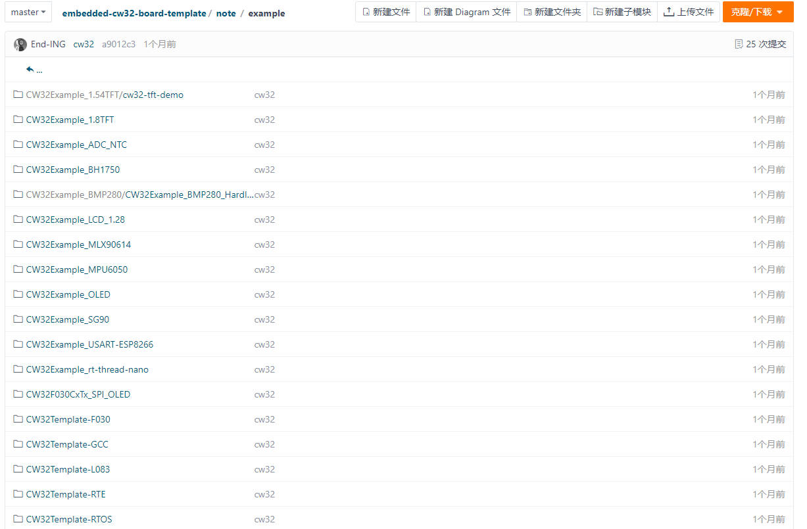
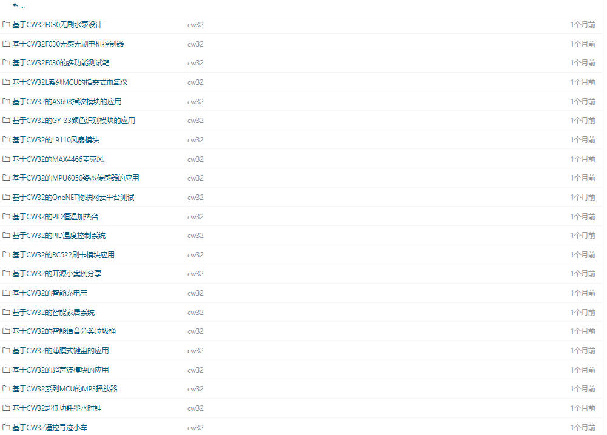
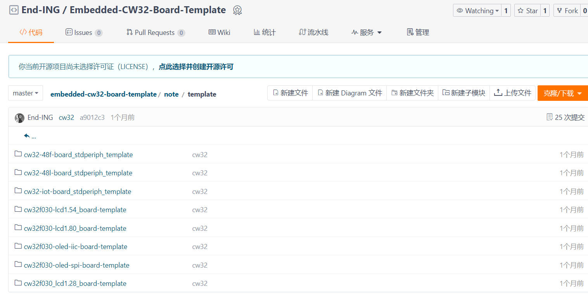

### CW32生态社区(官方社区组织)

CW32生态社区致力于构建武汉芯源半导体CW32系列MCU生态社区。
以开放、共享、互助为理念为国产IC、中国电子电路产业蓬勃发展赋能。我们旨在建立一个与伙伴合作共赢的生态，开放一系列软硬件内容，致力于MCU应用、物联网应用开发等核心技术。无论是嵌入式MCU小白还是想要攻破技术难题的工程师，亦或是需求解决方案的产品经理，都可在CW32生态社区汲取营养、共同成长。

武汉芯源半导体官网：[https://www.whxy.com](https://www.whxy.com/) 

### CW32F030开发板工程模板记录

#### 硬件开发平台：

#### CW32-48F-Board_StdPeriph_Template 例程基本上验证移植完成

软件平台：MDK-ARM KEIL
硬件平台：CW32-48F-Board

- [x] 1. 板载LED测试 （完善gpio库函数）（已测试完成）
- [x] 2. RCC-Config delay1ms （延迟函数）（已测试完成）
- [x] 3. ST7735-Lcd 1.70 屏幕驱动（已测试完成）
- [x] 4. UART 串口1 PA8-TX PA9-RX 支持printf （已测试完成）
- [x] 5. 定时器配置 ATIMER time1s_flag  BTIM time0.5s_flag （已测试完成）
- [x] 6. ADC配置 电位器实验测试（已测试完成）
- [x] 7. 板载蜂鸣器测试 （已测试完成）
- [x] 8. bsp_dht11驱动（已测试完成）
- [x] 9. 按键驱动FIFO移植（已测试完成）
- [x] 10. GPIO EXTI外部测试（测试,参考例程）
- [x] 11. ST7789--Lcd 1.54屏幕驱动（已测试完成）
- [x] 12. GC9A01-Lcd  1.28圆形屏幕驱动（已测试完成）
- [x] 13. HWSPI-OLED 0.96 驱动（已测试完成）
- [x] 14. SWSPI-OLED 0.96 驱动（已测试完成）
- [x] 15. SWIIC-OLED 0.96 驱动（已测试完成）
- [x] 16. HWIIC-OLED 0.96 驱动（待测试）

### CW32官方扶持开发项目

- [x] 1.基于芯源CW32F030无刷水泵设计 

  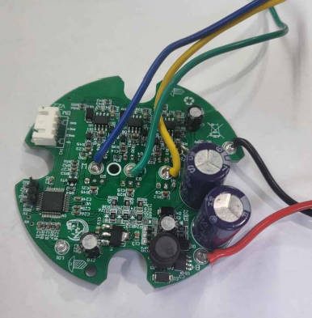

- [x] 2.基于芯源CW32F030的多功能测试笔
  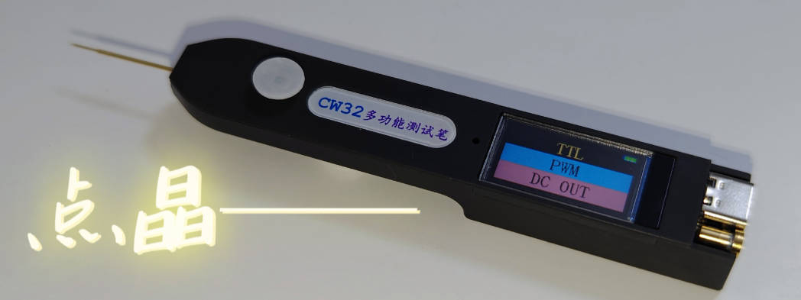

- [x] 3.基于芯源CW32L系列MCU的指夹式血氧仪设计 
  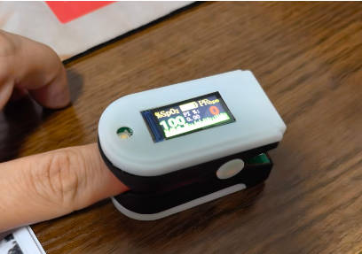

- [x] 4.基于芯源CW32系列芯片的4轴无人机

  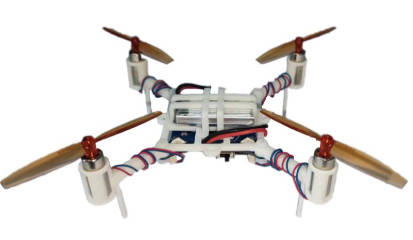

- [x] 5.基于CW32超低功耗墨水时钟

  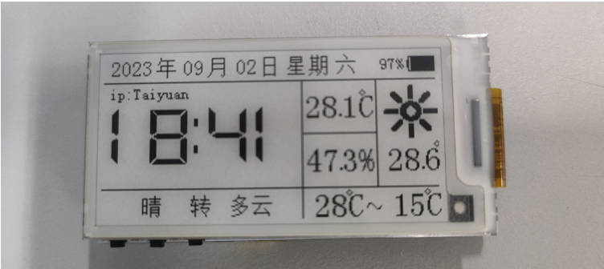

6. 基于CW32的PID恒温加热台

   开发者仓库地址 https://gitee.com/zhong_li/CW32_MiniHeating

   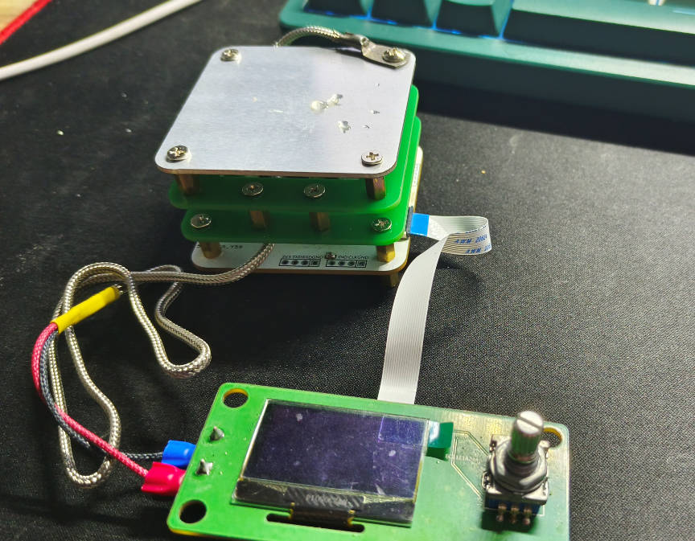

### CW32开发项目(CW32 Template)

####  （Form CW32生态社区 QQ群 482146847）

- [x] 1. CW32-48F-Board_StdPeriph_Template (CW32-48F大学计划板例程源码)
- [x] 2. CW32-IoT-Board_StdPeriph_Template (CW32-48物联网板例程源码)
- [x] 3. CW32-48L-Board_StdPeriph_Template (CW32-48L大学计划板例程源码)
- [x] 4. cw32-temipate.zip (form 群友邪心)
- [x] 5. cw32-tft-demo.zip (form 群友邪心)  
- [x] 6. cw32-freertos-templatezip
- [x] 7. cw32-gcc-template.zip
- [x] 8. CW32Example_BMP280_HardIIC (form 群友千羽)
- [x] 9. CW32Example_MPU6050_HardIIC (CW32 Drone V1.2上位机)(form 群友千羽)
- [x] 10. CW32F030_RTE工程模板	(form 群友流浪剑士)
- [x] 11. CW32L083_RTE工程模板	(form 群友流浪剑士)
- [x] 12. 基于CW32的PID温度控制系统
- [x] 13. 基于CW32F030无感无刷电机控制器
- [x] 14. 基于芯源CW32系列芯片的自动浇花器系统
- [x] 15. 基于CW32系列MCU的MP3播放器

### CW32-Learn-Template  

- [x] 1. CW32F030_StandardPeripheralLib_V1.8(官方原厂SDK例程)
- [x] 2. CW32L083_StandardPeripheralLib_V2.0(官方原厂SDK例程)
- [x] 3. cw32-example

### CW32开发常见问题一览 WIKI  

(Form 群友流浪剑士)
CW32开发常见问题一览 https://yuyy1989.github.io/CW32FAQ/

### 武汉芯源CW32开发板免费试用体验

#### 评测帖子 

电子发烧友评测帖子 https://bbs.elecfans.com/try_WHCW32.html

电子工程世界评测帖子 http://bbs.eeworld.com.cn/elecplay/content/95459da2

芯源CW32MCU  21-ic论坛 https://bbs.21ic.com/iclist-1116-1.html

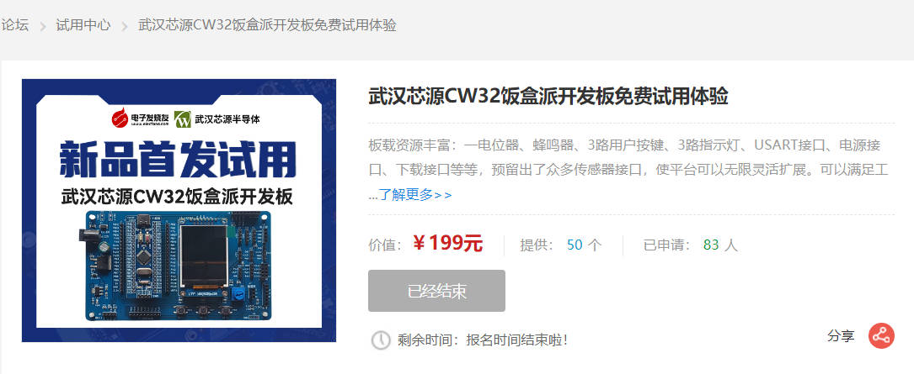

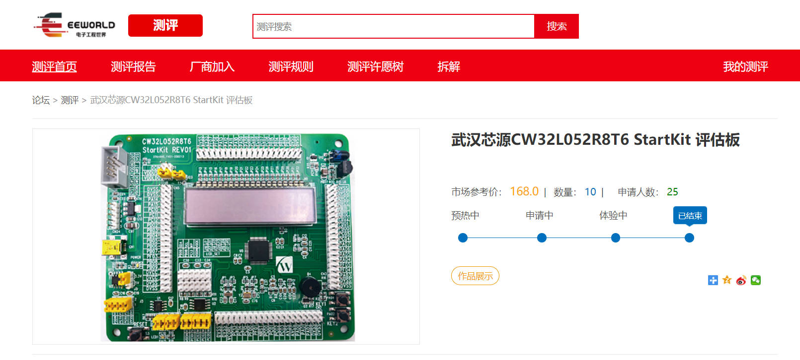