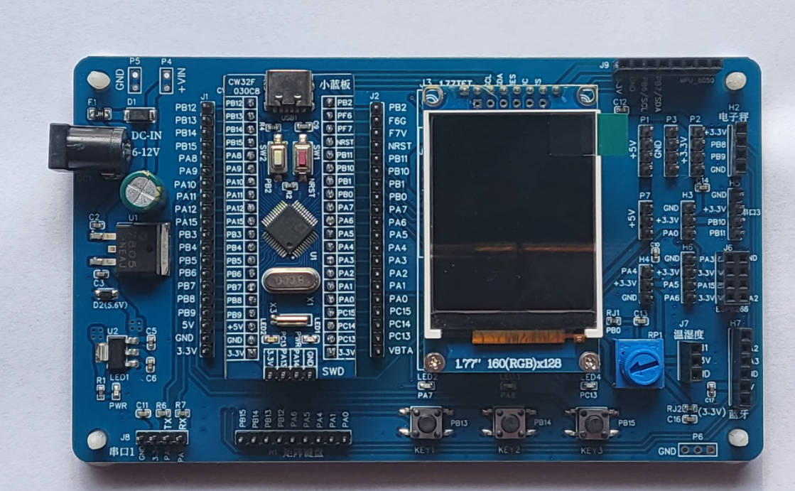
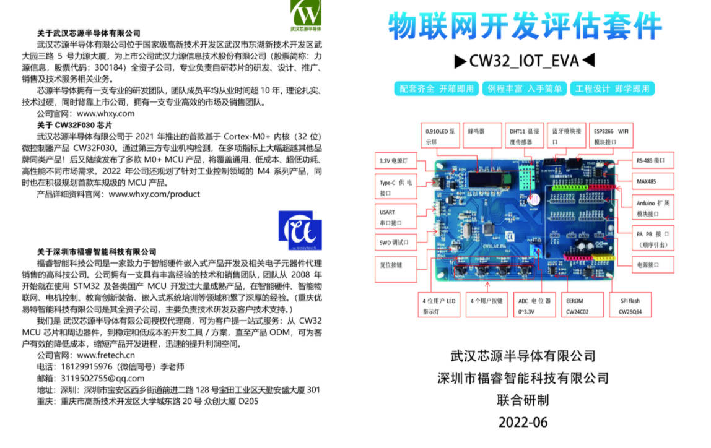
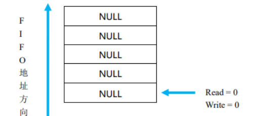
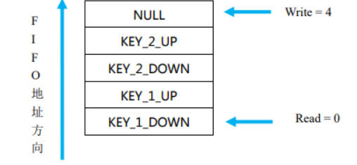
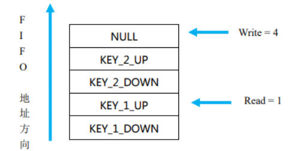
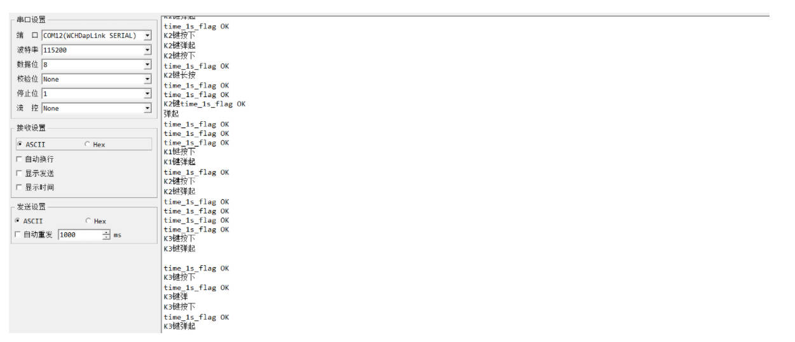

## 武汉芯源CW32F030开发板评测 02按键检测

### 硬件平台
1. CW32_48F大学计划板
2. CW32_IOT_EVA物联网开发评估套件




bsp_key 按键驱动程序用于扫描独立按键，具有软件滤波机制，采用 FIFO 机制保存键值。可以检测
如下事件：

- [x] 按键按下。
- [x] 按键弹起。
- [x]  长按键。
- [x] 长按时自动连发。

我们将按键驱动分为两个部分来介绍，一部分是 FIFO 的实现，一部分是按键检测的实现。
博客参考安富莱开发指南和果果小师弟博客等相关互联网资源
### 如何进行按键检测
检测按键有中断方式和GPIO查询方式两种。推荐大家用GPIO查询方式。

1. 从裸机的角度分析
- [x] 1.1 中断方式：中断方式可以快速地检测到按键按下，并执行相应的按键程序，但实际情况是由于按键的机械抖动特性，在程序进入中断后必须进行滤波处理才能判定是否有效的按键事件。如果每个按键都是独立的接一个 IO 引脚，需要我们给每个 IO 都设置一个中断，程序中过多的中断会影响系统的稳定性。中断方式跨平台移植困难。
- [x] 1.2 查询方式：查询方式有一个最大的缺点就是需要程序定期的去执行查询，耗费一定的系统资源。实际上耗费不了多大的系统资源，因为这种查询方式也只是查询按键是否按下，按键事件的执行还是在主程序里面实现。

2. 从OS的角度分析
- [x] 2.1 中断方式：在 OS 中要尽可能少用中断方式，因为在RTOS中过多的使用中断会影响系统的稳定性和可预见性。只有比较重要的事件处理需要用中断的方式。
- [x] 2.2 查询方式：对于用户按键推荐使用这种查询方式来实现，现在的OS基本都带有CPU利用率的功能，这个按键FIFO占用的还是很小的，基本都在1%以下。

### FIFO
FIFO 是 First Input First Output 的缩写，先入先出队列。我们这里以 5 个字节的 FIFO 空间进行说
明。Write 变量表示写位置，Read 变量表示读位置。初始状态时，Read = Write = 0。

我们依次按下按键 K1，K2，那么 FIFO 中的数据变为：


如果 Write！= Read，则我们认为有新的按键事件。
我们通过函数 bsp_GetKey 读取一个按键值进行处理后，Read 变量变为 1。Write 变量不变。


我们继续通过函数 bsp_GetKey 读取 3 个按键值进行处理后，Read 变量变为 4。此时 Read = Write
= 4。两个变量已经相等，表示已经没有新的按键事件需要处理。
有一点要特别的注意，如果 FIFO 空间写满了，Write 会被重新赋值为 0，也就是重新从第一个字节空
间填数据进去，如果这个地址空间的数据还没有被及时读取出来，那么会被后来的数据覆盖掉，这点要引
起大家的注意。我们的驱动程序开辟了 10 个字节的 FIFO 缓冲区，对于一般的应用足够了。
#### 
设计按键 FIFO 主要有三个方面的好处：
- [x] 可靠地记录每一个按键事件，避免遗漏按键事件。特别是需要实现按键的按下、长按、自动连发、弹起等事件时。
- [x] 读取按键的函数可以设计为非阻塞的，不需要等待按键抖动滤波处理完毕。
- [x] 按键 FIFO 程序在嘀嗒定时器中定期的执行检测，不需要在主程序中一直做检测，这样可以有效地降低系统资源消耗。

### 按键 FIFO 的实现
1.定义结构体
在我们的key.h文件中定义一个结构体类型为KEY_FIFO_T的结构体。就是前面说的那个结构体。这只是类型声明，并没有分配变量空间。

```c
typedef struct
{
 	uint8_t Buf[10];  /* 缓冲区 */
 	uint8_t Read;   /* 缓冲区读指针*/
 	uint8_t Write;   /* 缓冲区写指针 */
}KEY_FIFO_T;
```

接着在key.c 中定义 s_tKey 结构变量, 此时编译器会分配一组变量空间。

```c
static KEY_FIFO_T s_tKey;/* 按键FIFO变量,结构体 */
```

好了按键FIFO的结构体数据类型就定义完了，很简单吧！

2.将键值写入FIFO
既然结构体都定义好了，接着就是往这个FIFO的数组中写入数据，也就是按键的键值，用来模拟按键的动作了。

```c
/*
**********************************************************
* 函 数 名: KEY_FIFO_Put
* 功能说明: 将1个键值压入按键FIFO缓冲区。可用于模拟一个按键。
* 形    参:  _KeyCode : 按键代码
* 返 回 值: 无
**********************************************************
*/
void KEY_FIFO_Put(uint8_t _KeyCode)
{
 	s_tKey.Buf[s_tKey.Write] = _KeyCode;
 	if (++s_tKey.Write  >= KEY_FIFO_SIZE)
 	{
  		s_tKey.Write = 0;
 	}
}
```

函数的主要功能就是将按键代码_KeyCode写入到FIFO中，而这个FIFO就是我们定义结构体的这个数组成员，每写一次，就是每调用一次KEY_FIFO_Put()函数，写指针write就++一次，也就是向后移动一个空间，如果FIFO空间写满了，也就是s_tKey.Write >= KEY_FIFO_SIZE，Write会被重新赋值为 0。

3.从FIFO读出键值
有写入键值当然就有读出键值。

```c
/*
***********************************************************
* 函 数 名: KEY_FIFO_Get
* 功能说明: 从按键FIFO缓冲区读取一个键值。
* 形    参: 无
* 返 回 值: 按键代码
************************************************************
*/
uint8_t KEY_FIFO_Get(void)
{
 uint8_t ret;

 	if (s_tKey.Read == s_tKey.Write)
 	{
  		return KEY_NONE;
 	}
 	else
 	{
 		 ret = s_tKey.Buf[s_tKey.Read];
  		if (++s_tKey.Read >= KEY_FIFO_SIZE)
  		{
   			s_tKey.Read = 0;
  		}
  		return ret;
 	}
}
```

如果写指针和读出的指针相等，那么返回值就为0，表示按键缓冲区为空，所有的按键时间已经处理完毕。如果不相等就说明FIFO的缓冲区不为空，将Buf中的数读出给ret变量。同样，如果FIFO空间读完了，没有缓存了，也就是s_tKey.Read >= KEY_FIFO_SIZE，Read也会被重新赋值为 0。按键的键值定义在key.h 文件，下面是具体内容：

```c
typedef enum
{
 	KEY_NONE = 0,   /* 0 表示按键事件 */

 	KEY_1_DOWN,    /* 1键按下 */
 	KEY_1_UP,    /* 1键弹起 */
 	KEY_1_LONG,    /* 1键长按 */

 	KEY_2_DOWN,    /* 2键按下 */
 	KEY_2_UP,    /* 2键弹起 */
 	KEY_2_LONG,    /* 2键长按 */

 	KEY_3_DOWN,    /* 3键按下 */
 	KEY_3_UP,    /* 3键弹起 */
 	KEY_3_LONG,    /* 3键长按 */
}KEY_ENUM;
```

必须按次序定义每个键的按下、弹起和长按事件，即每个按键对象占用 3 个数值。推荐使用枚举enum, 不用#define的原因是便于新增键值,方便调整顺序。使用{ } 将一组相关的定义封装起来便于理解。编译器也可帮我们避免键值重复。

4.按键检测程序
上面说了如何将按键的键值存入和读出FIFO，但是既然是按键操作，就肯定涉及到按键消抖处理，还有按键的状态是按下还是弹起，是长按还是短按。所以为了以示区分，我们用还需要给每一个按键设置很多参数，就需要再定义一个结构体KEY_T，让每个按键对应1个全局的结构体变量。

```c
typedef struct
{
 /* 下面是一个函数指针，指向判断按键手否按下的函数 */
 uint8_t (*IsKeyDownFunc)(void); /* 按键按下的判断函数,1表示按下 */

 uint8_t  Count;   /* 滤波器计数器 */
 uint16_t LongCount;  /* 长按计数器 */
 uint16_t LongTime;  /* 按键按下持续时间, 0表示不检测长按 */
 uint8_t  State;   /* 按键当前状态（按下还是弹起） */
 uint8_t  RepeatSpeed; /* 连续按键周期 */
 uint8_t  RepeatCount; /* 连续按键计数器 */
}KEY_T;
```

在key.c 中定义s_tBtn结构体数组变量。

```c
static KEY_T   s_tBtn[3] = {0};
```

每个按键对象都分配一个结构体变量，这些结构体变量以数组的形式存在将便于我们简化程序代码行数。因为我的硬件有3个按键，所以这里的数组元素为3。使用函数指针IsKeyDownFunc可以将每个按键的检测以及组合键的检测代码进行统一管理。

因为函数指针必须先赋值，才能被作为函数执行。因此在定时扫描按键之前，必须先执行一段初始化函数来设置每个按键的函数指针和参数。这个函数是void KEY_Init(void)。

```c
void KEY_Init(void)
{
 	KEY_FIFO_Init();  /* 初始化按键变量 */
	KEY_GPIO_Config();  /* 初始化按键硬件 */
}
```
下面是KEY_FIFO_Init函数的定义：
```c
static void KEY_FIFO_Init(void)
{
 	uint8_t i;

 	/* 对按键FIFO读写指针清零 */
 	s_tKey.Read = 0;
 	s_tKey.Write = 0;
 	/* 给每个按键结构体成员变量赋一组缺省值 */
 	for (i = 0; i < HARD_KEY_NUM; i++)
 	{
  		s_tBtn[i].LongTime = 100;/* 长按时间 0 表示不检测长按键事件 */
  		s_tBtn[i].Count = 5/ 2; /* 计数器设置为滤波时间的一半 */
  		s_tBtn[i].State = 0;/* 按键缺省状态，0为未按下 */
  		s_tBtn[i].RepeatSpeed = 0;/* 按键连发的速度，0表示不支持连发 */
  		s_tBtn[i].RepeatCount = 0;/* 连发计数器 */
 }
	 /* 判断按键按下的函数 */
 	s_tBtn[0].IsKeyDownFunc = IsKey1Down;
 	s_tBtn[1].IsKeyDownFunc = IsKey2Down;
 	s_tBtn[2].IsKeyDownFunc = IsKey3Down;
}
```

我们知道按键会有机械抖动，你以为按键按下就是低电平，其实在按下的一瞬间会存在机械抖动，如果不做延时处理，可能会出错，一般如果按键检测到按下后再延时50ms检测一次，如果还是检测低电平，才能说明按键真正的被按下了。反之按键弹起时也是一样的。所以我们程序设置按键滤波时间50ms, 因为代码每10ms扫描一次按键，所以按键的单位我们可以理解为10ms，滤波的次数就为5次。这样只有连续检测到50ms状态不变才认为有效，包括弹起和按下两种事件，即使按键电路不做硬件滤波(没有电容滤波)，该滤波机制也可以保证可靠地检测到按键事件。

判断按键是否按下，使用CW32库的GPIO_ReadPin就可以搞定。
```c
/*
*********************************************************************************************************
*	函 数 名: IsKeyDownFunc
*	功能说明: 判断按键是否按下。单键和组合键区分。单键事件不允许有其他键按下。
*	形    参: 无
*	返 回 值: 返回值1 表示按下(导通），0表示未按下（释放）
*********************************************************************************************************
*/
static uint8_t IsKey1Down(void) 
{
	if (GPIO_ReadPin(KEY1_GPIO_PORT, KEY1_GPIO_PIN) == GPIO_Pin_RESET) 
		return 1;
	else 
		return 0;
}
static uint8_t IsKey2Down(void) 
{
	if (GPIO_ReadPin(KEY2_GPIO_PORT, KEY2_GPIO_PIN) == GPIO_Pin_RESET) 
		return 1;
	else 
		return 0;
}
static uint8_t IsKey3Down(void) 
{
	if (GPIO_ReadPin(KEY3_GPIO_PORT, KEY3_GPIO_PIN) == GPIO_Pin_RESET) 
		return 1;
	else 
		return 0;
}
```
下面是KEY_GPIO_Config函数的定义，这个函数就是配置具体的按键GPIO的，就不需要过多的解释了。
```c
*********************************************************************************************************
*	函 数 名: KEY_GPIO_Config
*	功能说明: 配置按键对应的GPIO
*	形    参:  无
*	返 回 值: 无
*********************************************************************************************************
*/
static void KEY_GPIO_Config(void)
{	
	GPIO_InitTypeDef GPIO_InitStructure;
	
	/* 第1步：打开GPIO时钟 */
		__RCC_GPIOB_CLK_ENABLE();
	
	/* 第2步：配置所有的按键GPIO为浮动输入模式(实际上CPU复位后就是输入状态) */
    GPIO_InitStructure.IT = GPIO_IT_NONE;  //KEY1 KEY2 KEY3
	GPIO_InitStructure.Mode = GPIO_MODE_INPUT_PULLUP;   			/* 设置输入 */
    
	GPIO_InitStructure.Speed = GPIO_SPEED_HIGH;  /* GPIO速度等级 */
	
	GPIO_InitStructure.Pins = KEY1_GPIO_PIN;
	GPIO_Init(KEY1_GPIO_PORT, &GPIO_InitStructure);
	
	GPIO_InitStructure.Pins = KEY2_GPIO_PIN;
	GPIO_Init(KEY2_GPIO_PORT, &GPIO_InitStructure);
 
	GPIO_InitStructure.Pins = KEY3_GPIO_PIN;
	GPIO_Init(KEY3_GPIO_PORT, &GPIO_InitStructure);

}
```
按键扫描函数KEY_Scan()每隔 10ms 被执行一次。
```c
void KEY_Scan(void)
{
 uint8_t i;
 for (i = 0; i < HARD_KEY_NUM; i++)
 {
  KEY_Detect(i);
 }
}
```

```c
static void KEY_Detect(uint8_t i)
{
 KEY_T *pBtn;

 pBtn = &s_tBtn[i];
 if (pBtn->IsKeyDownFunc())
 {//这个里面执行的是按键按下的处理
  if (pBtn->Count < KEY_FILTER_TIME)
  {//按键滤波前给 Count 设置一个初值
   pBtn->Count = KEY_FILTER_TIME;
  }
  else if(pBtn->Count < 2 * KEY_FILTER_TIME)
  {//实现 KEY_FILTER_TIME 时间长度的延迟
   pBtn->Count++;
  }
  else
  {
   if (pBtn->State == 0)
   {
    pBtn->State = 1;

    /* 发送按钮按下的消息 */
    KEY_FIFO_Put((uint8_t)(3 * i + 1));
   }

   if (pBtn->LongTime > 0)
   {
    if (pBtn->LongCount < pBtn->LongTime)
    {
     /* 发送按钮持续按下的消息 */
     if (++pBtn->LongCount == pBtn->LongTime)
     {
      /* 键值放入按键FIFO */
      KEY_FIFO_Put((uint8_t)(3 * i + 3));
     }
    }
    else
    {
     if (pBtn->RepeatSpeed > 0)
     {
      if (++pBtn->RepeatCount >= pBtn->RepeatSpeed)
      {
       pBtn->RepeatCount = 0;
       /* 长按键后，每隔10ms发送1个按键 */
       KEY_FIFO_Put((uint8_t)(3 * i + 1));
      }
     }
    }
   }
  }
 }
 else
 {//这个里面执行的是按键松手的处理或者按键没有按下的处理
  if(pBtn->Count > KEY_FILTER_TIME)
  {
   pBtn->Count = KEY_FILTER_TIME;
  }
  else if(pBtn->Count != 0)
  {
   pBtn->Count--;
  }
  else
  {
   if (pBtn->State == 1)
   {
    pBtn->State = 0;

    /* 发送按钮弹起的消息 */
    KEY_FIFO_Put((uint8_t)(3 * i + 2));
   }
  }
  pBtn->LongCount = 0;
  pBtn->RepeatCount = 0;
 }
}
```

这个函数还是比较难以理解的，主要是结构体的操作。所以好好学习结构体，不要见了结构体就跑。

分析：首先读取相应按键的结构体地址赋值给结构体指针变量pBtn ，因为程序里面每个按键都有自己的结构体，只有通过这个方式才能对具体的按键进行操作。(在前面我们使用软件定时器时也使用了这中操作，在滴答定时器的中断服务函数中)。

static KEY_T s_tBtn[3];//程序里面每个按键都有自己的结构体,有三个按键
KEY_T *pBtn;//定义一个结构体指针变量pBtn
pBtn = &s_tBtn[i];//将按键的结构体地址赋值给结构体指针变量pBtn
然后接着就是给按键滤波前给Count设置一个初值，前面说按键初始化的时候已经设置了Count =5/2。然后判断是否按下的标志位，如果按键按下了，这里就将其设置为 1，如果没有按下这个变量的值就会一直是 0。这里可能不理解是就是按键按下发送的键值是3 * i + 1。按键弹起发送的键值是3 * i + 2，按键长按发送的键值是3 * i + 3。也就是说按键按下发送的键值是1和4和7。按键弹起发送的键值是2和5和8，按键长按发送的键值是3和6和9。

### 移植

```c
#include "main.h"
/*
系统时钟配置为64M
*/
//--------------------------------------------------------------------------------------------------
//  自定义变量定义    |   0   |   1   |   2   |   3   |   4   |   5   |   6   |   7   |   8   |   9   
//--------------------------------------------------------------------------------------------------
unsigned int adc_timecount=0;
unsigned int dht_timecount=0;
//==================================================================================================
//  实现功能: LED测试函数
//  函数说明: led_example 
//  函数备注:  LED1 LED4——>PC13 LED2—>PA7 LED3—>PA8 
//--------------------------------------------------------------------------------------------------
//  |   -   |   -   |   0   |   1   |   2   |   3   |   4   |   5   |   6   |   7   |   8   |   9   
//==================================================================================================  
void led_example(void)
{
        LED1(1);
        delay1ms(500);
        LED1(0);
        delay1ms(500);
        LED2(1);
        delay1ms(500);
        LED2(0);
        delay1ms(500);
}
//==================================================================================================
//  实现功能: BEEP测试函数
//  函数说明: beep_example 
//  函数备注: BEEP->PB3
//--------------------------------------------------------------------------------------------------
//  |   -   |   -   |   0   |   1   |   2   |   3   |   4   |   5   |   6   |   7   |   8   |   9   
//==================================================================================================  
void beep_example(void)
{
        BEEP(1);
        delay1ms(500);
        BEEP(0);
        delay1ms(500);

}
//==================================================================================================
//  实现功能: ADC测试函数 电位器测试
//  函数说明: adc_example 
//  函数备注: 
//--------------------------------------------------------------------------------------------------
//  |   -   |   -   |   0   |   1   |   2   |   3   |   4   |   5   |   6   |   7   |   8   |   9   
//==================================================================================================  
void adc_example(void)
{
    uint16_t adcvalue;  
    float temp;
    if(adc_timecount>200)//每200ms单次转换一次，并通过OLED显示
			{
                    adc_timecount=0;		
                    ADC_SoftwareStartConvCmd(ENABLE);
					while(ADC_GetITStatus(ADC_IT_EOC))
					{
						ADC_ClearITPendingBit(ADC_IT_EOC);      
						adcvalue=ADC_GetConversionValue();		
						temp=(float)adcvalue*(3.3/4096);       //电压值换算
                        //sprintf(temp_buff1,"%0.1f V  ",temp);
						TFT_ShowNumber_Float_16x16(60,105,temp,1,2,Red,White);	
					 
					} 					 	
			}	
}
//==================================================================================================
//  实现功能: DHT11测试函数
//  函数说明: dht11_example 
//  函数备注: 
//--------------------------------------------------------------------------------------------------
//  |   -   |   -   |   0   |   1   |   2   |   3   |   4   |   5   |   6   |   7   |   8   |   9   
//==================================================================================================  
void dht11_example(void)
{
    float temperature;  	    
    uint8_t humidity; 
    if(dht_timecount>200)                           //200毫秒采集一次数据并更新屏幕
		{
			dht_timecount=0;
		 	DHT11_Read_Data(&temperature,&humidity);	//读取温湿度
            printf("temp:%.1f humi:%d \r\n",temperature,humidity);
		}
}
//==================================================================================================
//  实现功能: 按键测试函数
//  函数说明: key_fifo_example 
//  函数备注: 
//--------------------------------------------------------------------------------------------------
//  |   -   |   -   |   0   |   1   |   2   |   3   |   4   |   5   |   6   |   7   |   8   |   9   
//==================================================================================================  
uint8_t KeyCode;/* 按键代码 使用时在主函数调用 */
void key_fifo_example(void)
{
    //uint8_t KeyCode;/* 按键代码 使用时在主函数调用 */
    KeyCode = KEY_FIFO_Get();	/* 读取键值, 无键按下时返回 KEY_NONE = 0 */
            if (KeyCode != KEY_NONE)
            {
                switch (KeyCode)
                {
                    case KEY_DOWN_K1:			/* K1键按下 */
                        printf("K1键按下\r\n");
                        BEEP(1);
                        break;
                    case KEY_UP_K1:				/* K1键弹起 */
                        printf("K1键弹起\r\n");
                        break;
                    case KEY_1_LONG:		    /* K1键长按 */
                        printf("K1键长按\r\n");
                        break;
                    case KEY_DOWN_K2:			/* K2键按下 */
                        printf("K2键按下\r\n");
                        BEEP(0);
                        break;
                    case KEY_UP_K2:				/* K2键弹起 */
                        printf("K2键弹起\r\n");
                        break;
                    case KEY_2_LONG:				/* K2键长按 */
                        printf("K2键长按\r\n");
                        break;
                    case KEY_DOWN_K3:			/* K3键按下 */
                        printf("K3键按下\r\n");
                        LED1(1);
                        break;
                    case KEY_UP_K3:				/* K3键弹起 */
                        printf("K3键弹起\r\n");
                        LED1(0);
                        break;
                    case KEY_3_LONG:		    /* K3键长按 */
                        printf("K3键长按\r\n");
                        break;
                    default:
                        /* 其它的键值不处理 */
                        break;
                }
           }
}
//==================================================================================================
//  实现功能: 配置初始化
//  函数说明: Board_Iint 
//  函数备注: 
//--------------------------------------------------------------------------------------------------
//  |   -   |   -   |   0   |   1   |   2   |   3   |   4   |   5   |   6   |   7   |   8   |   9   
//================================================================================================== 
void Board_Iint(void)
{
    
    RCC_Configuration();  //系统时钟64M
    UART1_Iint();
    printf("CW32F030 RCC_Configuration OK\r\n");
    printf("CW32F030 UART1_Iint OK\r\n");
    Delay_Init();
	Lcd_Init();
    printf("CW32F030 Lcd_Init OK\r\n");
    LED_GPIO_Config();
    printf("CW32F030 LED_GPIO_Config OK\r\n");
    BEEP_GPIO_Config();
    printf("CW32F030 BEEP_GPIO_Config OK\r\n");
    DHT11_GPIO_Config();
    printf("CW32F030 DHT11_GPIO_Config OK\r\n");
    KEY_Init();
    printf("CW32F030 KEY_Init OK\r\n");
    ADC_Configuration();   //ADC初始化
    printf("CW32F030 ADC_Configuration OK\r\n"); /*timer time_1s_flag*/
    BTIM1_init();
    printf("CW32F030 BTIM1_init OK\r\n"); /*timer time_0.5s_flag*/
    BTIM2_init();
    printf("CW32F030 BTIM2_init OK\r\n"); /*timer time_0.5s_flag*/
    BTIM3_init();
    printf("CW32F030 BTIM3_init OK\r\n"); /*timer time_0.5s_flag*/
    ATIMER_init();
    printf("CW32F030 ATIMER_init OK\r\n"); /*timer time_1s_flag*/
    
}
//==================================================================================================
//  实现功能: 主函数
//  函数说明: main 
//  函数备注: 
//--------------------------------------------------------------------------------------------------
//  |   -   |   -   |   0   |   1   |   2   |   3   |   4   |   5   |   6   |   7   |   8   |   9   
//================================================================================================== 
int main()
{	

    unsigned char dht11_temp=20;
    unsigned char dht11_humi=70;
    
    Board_Iint();
    printf("CW32F030 HardWare-Iint OK\r\n");
    
    
	Lcd_Clear(GRAY0);               //清屏
	Gui_DrawFont_GBK16(15,5,BLACK,GRAY0,"HELLO-CW32");
    Gui_DrawFont_GBK16(15,25,RED,GRAY0,"CW32-48F-Board");
    Gui_DrawFont_GBK16(15,45,RED,GRAY0,"By 2023-06-11");
    Gui_DrawFont_GBK16(15,65,RED,GRAY0,"By CoderEnd");
        
    Gui_DrawFont_GBK16(15,85,GRAY1,WHITE,"adc_example:\n");
	Gui_DrawFont_GBK16(15,105,BLUE,WHITE,"Volt:");
    TFT_ShowString_16x16(105,105,"V",Red,White);
    TFT_ShowString_16x16(15,125,"Temp:",Blue1,White);
    TFT_ShowString_16x16(15,145,"Humi:",Blue1,White);
	TFT_ShowNumber_Float_16x16(60,125,dht11_temp,2,1,Magenta,White);
    TFT_ShowNumber_Float_16x16(60,145,dht11_humi,2,1,Blue2,White);
	while(1)
    {
            //adc_example();
            key_fifo_example();
            
    }
}

```
按键扫描函数KEY_Scan()每隔 10ms 被执行一次。
```c
//==================================================================================================
//  实现功能: 基本定时器
//  函数说明: BTIM1_init 
//  函数备注: 
//--------------------------------------------------------------------------------------------------
//  |   -   |   -   |   0   |   1   |   2   |   3   |   4   |   5   |   6   |   7   |   8   |   9   
//================================================================================================== 
void BTIM1_init(void)
{
	BTIM_TimeBaseInitTypeDef BTIM_InitStruct;
	
	__RCC_BTIM_CLK_ENABLE();
	
	__disable_irq(); 
  	NVIC_EnableIRQ(BTIM1_IRQn); 
  	__enable_irq();
	
	BTIM_InitStruct.BTIM_Mode = BTIM_Mode_TIMER;
    BTIM_InitStruct.BTIM_OPMode = BTIM_OPMode_Repetitive;
    BTIM_InitStruct.BTIM_Period = 8000;
    BTIM_InitStruct.BTIM_Prescaler = BTIM_PRS_DIV8;
    BTIM_TimeBaseInit(CW_BTIM1, &BTIM_InitStruct);
	
    BTIM_ITConfig(CW_BTIM1, BTIM_IT_OV, ENABLE);
    BTIM_Cmd(CW_BTIM1, ENABLE);
}
//==================================================================================================
//  实现功能: 中断服务函数
//  函数说明: BTIM1_IRQHandler 
//  函数备注: 
//--------------------------------------------------------------------------------------------------
//  |   -   |   -   |   0   |   1   |   2   |   3   |   4   |   5   |   6   |   7   |   8   |   9   
//================================================================================================== 
void BTIM1_IRQHandler(void)
{
  /* USER CODE BEGIN */
    static unsigned int btimer_count1=0;
    if(BTIM_GetITStatus(CW_BTIM1, BTIM_IT_OV))
    {
        BTIM_ClearITPendingBit(CW_BTIM1, BTIM_IT_OV);
		btimer_count1++;
		adc_timecount++;
        dht_timecount++;
		if(btimer_count1>10)  //用于按键检测
		{
            KEY_Scan();
			btimer_count1=0;
		}
	}
  /* USER CODE END */
}
```
##### bsp_key.c
```c
#include "main.h"

/*
	CW32-48F-Board开发板 按键口线分配：
		K1键      : PB13  (低电平表示按下)
		K2键      : PB14  (低电平表示按下)
		K3键      : PA15  (低电平表示按下)

*/
	
#define HARD_KEY_NUM	    3	   				/* 实体按键个数 */
static KEY_T      s_tBtn[HARD_KEY_NUM] = {0};
static KEY_FIFO_T s_tKey;						/* 按键FIFO变量,结构体 */

static void KEY_FIFO_Init(void);
static void KEY_GPIO_Config(void);
static uint8_t IsKey1Down(void);
static uint8_t IsKey2Down(void);
static uint8_t IsKey3Down(void);
static void KEY_Detect(uint8_t i);

/*
*********************************************************************************************************
*	函 数 名: KEY_Init
*	功能说明: 初始化按键. 该函数在主函数的开头被调用。
*	形    参:  无
*	返 回 值: 无
*********************************************************************************************************
*/
void KEY_Init(void)
{
	KEY_FIFO_Init();		/* 初始化按键变量 */
	KEY_GPIO_Config();		/* 初始化按键硬件 */
}
/*
*********************************************************************************************************
*	函 数 名: KEY_FIFO_Init
*	功能说明: 初始化按键变量
*	形    参:  无
*	返 回 值: 无
*********************************************************************************************************
*/
static void KEY_FIFO_Init(void)
{
	uint8_t i;

	/* 对按键FIFO读写指针清零 */
	s_tKey.Read = 0;
	s_tKey.Write = 0;

	/* 给每个按键结构体成员变量赋一组缺省值 */
	for (i = 0; i < HARD_KEY_NUM; i++)
	{
		s_tBtn[i].LongTime = KEY_LONG_TIME;			/* 长按时间 0 表示不检测长按键事件 */
		s_tBtn[i].Count = KEY_FILTER_TIME / 2;		/* 计数器设置为滤波时间的一半 */
		s_tBtn[i].State = 0;							/* 按键缺省状态，0为未按下 */
		s_tBtn[i].RepeatSpeed = 0;						/* 按键连发的速度，0表示不支持连发 */
		s_tBtn[i].RepeatCount = 0;						/* 连发计数器 */
	}
	/* 判断按键按下的函数 */
	s_tBtn[0].IsKeyDownFunc = IsKey1Down;
	s_tBtn[1].IsKeyDownFunc = IsKey2Down;
	s_tBtn[2].IsKeyDownFunc = IsKey3Down;
}
/*
*********************************************************************************************************
*	函 数 名: KEY_GPIO_Config
*	功能说明: 配置按键对应的GPIO
*	形    参:  无
*	返 回 值: 无
*********************************************************************************************************
*/
static void KEY_GPIO_Config(void)
{	
	GPIO_InitTypeDef GPIO_InitStructure;
	
	/* 第1步：打开GPIO时钟 */
		__RCC_GPIOB_CLK_ENABLE();
	
	/* 第2步：配置所有的按键GPIO为浮动输入模式(实际上CPU复位后就是输入状态) */
    GPIO_InitStructure.IT = GPIO_IT_NONE;  //KEY1 KEY2 KEY3
	GPIO_InitStructure.Mode = GPIO_MODE_INPUT_PULLUP;   			/* 设置输入 */
    
	GPIO_InitStructure.Speed = GPIO_SPEED_HIGH;  /* GPIO速度等级 */
	
	GPIO_InitStructure.Pins = KEY1_GPIO_PIN;
	GPIO_Init(KEY1_GPIO_PORT, &GPIO_InitStructure);
	
	GPIO_InitStructure.Pins = KEY2_GPIO_PIN;
	GPIO_Init(KEY2_GPIO_PORT, &GPIO_InitStructure);
 
	GPIO_InitStructure.Pins = KEY3_GPIO_PIN;
	GPIO_Init(KEY3_GPIO_PORT, &GPIO_InitStructure);

}

/*
*********************************************************************************************************
*	函 数 名: IsKeyDownFunc
*	功能说明: 判断按键是否按下。单键和组合键区分。单键事件不允许有其他键按下。
*	形    参: 无
*	返 回 值: 返回值1 表示按下(导通），0表示未按下（释放）
*********************************************************************************************************
*/
static uint8_t IsKey1Down(void) 
{
	if (GPIO_ReadPin(KEY1_GPIO_PORT, KEY1_GPIO_PIN) == GPIO_Pin_RESET) 
		return 1;
	else 
		return 0;
}
static uint8_t IsKey2Down(void) 
{
	if (GPIO_ReadPin(KEY2_GPIO_PORT, KEY2_GPIO_PIN) == GPIO_Pin_RESET) 
		return 1;
	else 
		return 0;
}

static uint8_t IsKey3Down(void) 
{
	if (GPIO_ReadPin(KEY3_GPIO_PORT, KEY3_GPIO_PIN) == GPIO_Pin_RESET) 
		return 1;
	else 
		return 0;
}

/*
*********************************************************************************************************
*	函 数 名: KEY_FIFO_Put
*	功能说明: 将1个键值压入按键FIFO缓冲区。可用于模拟一个按键。
*	形    参:  _KeyCode : 按键代码
*	返 回 值: 无
*********************************************************************************************************
*/
void KEY_FIFO_Put(uint8_t _KeyCode)
{
	s_tKey.Buf[s_tKey.Write] = _KeyCode;

	if (++s_tKey.Write  >= KEY_FIFO_SIZE)
	{
		s_tKey.Write = 0;
	}
}

/*
*********************************************************************************************************
*	函 数 名: KEY_FIFO_Get
*	功能说明: 从按键FIFO缓冲区读取一个键值。
*	形    参: 无
*	返 回 值: 按键代码
*********************************************************************************************************
*/
uint8_t KEY_FIFO_Get(void)
{
	uint8_t ret;

	if (s_tKey.Read == s_tKey.Write)
	{
		return KEY_NONE;
	}
	else
	{
		ret = s_tKey.Buf[s_tKey.Read];

		if (++s_tKey.Read >= KEY_FIFO_SIZE)
		{
			s_tKey.Read = 0;
		}
		return ret;
	}
}


/*
*********************************************************************************************************
*	函 数 名: KEY_GetState
*	功能说明: 读取按键的状态
*	形    参:  _ucKeyID : 按键ID，从0开始
*	返 回 值: 1 表示按下， 0 表示未按下
*********************************************************************************************************
*/
uint8_t KEY_GetState(KEY_ID_E _ucKeyID)
{
	return s_tBtn[_ucKeyID].State;
}

/*
*********************************************************************************************************
*	函 数 名: KEY_SetParam
*	功能说明: 设置按键参数
*	形    参：_ucKeyID : 按键ID，从0开始
*			_LongTime : 长按事件时间
*			 _RepeatSpeed : 连发速度
*	返 回 值: 无
*********************************************************************************************************
*/
void KEY_SetParam(uint8_t _ucKeyID, uint16_t _LongTime, uint8_t  _RepeatSpeed)
{
	s_tBtn[_ucKeyID].LongTime = _LongTime;			/* 长按时间 0 表示不检测长按键事件 */
	s_tBtn[_ucKeyID].RepeatSpeed = _RepeatSpeed;			/* 按键连发的速度，0表示不支持连发 */
	s_tBtn[_ucKeyID].RepeatCount = 0;						/* 连发计数器 */
}

/*
*********************************************************************************************************
*	函 数 名: KEY_FIFO_Clear
*	功能说明: 清空按键FIFO缓冲区
*	形    参：无
*	返 回 值: 按键代码
*********************************************************************************************************
*/
void KEY_FIFO_Clear(void)
{
	s_tKey.Read = s_tKey.Write;
}
/*
*********************************************************************************************************
*	函 数 名: bsp_KeyScan10ms
*	功能说明: 扫描所有按键。非阻塞，被systick中断周期性的调用，10ms一次
*	形    参: 无
*	返 回 值: 无
*********************************************************************************************************
*/
void KEY_Scan(void)
{
	uint8_t i;

	for (i = 0; i < HARD_KEY_NUM; i++)
	{
		KEY_Detect(i);
	}
}
/*
*********************************************************************************************************
*	函 数 名: KEY_Detect
*	功能说明: 检测一个按键。非阻塞状态，必须被周期性的调用。
*	形    参: IO的id， 从0开始编码
*	返 回 值: 无
*********************************************************************************************************
*/
static void KEY_Detect(uint8_t i)
{
	KEY_T *pBtn;

	pBtn = &s_tBtn[i];/*读取相应按键的结构体地址，程序里面每个按键都有自己的结构体。*/
	if (pBtn->IsKeyDownFunc())
	{/*这个里面执行的是按键按下的处理*/
		if (pBtn->Count < KEY_FILTER_TIME)/*用于按键滤波前给 Count 设置一个初值*/
		{
			pBtn->Count = KEY_FILTER_TIME;
		}
		else if(pBtn->Count < 2 * KEY_FILTER_TIME)/*这里实现 KEY_FILTER_TIME 时间长度的延迟*/
		{
			pBtn->Count++;
		}
		else
		{
			if (pBtn->State == 0)
			{
				pBtn->State = 1;/*如果按键按下了，这里就将其设置为 1*/

				/* 发送按钮按下的消息 */
				KEY_FIFO_Put((uint8_t)(3 * i + 1));
			}

			if (pBtn->LongTime > 0) /*LongTime初始值是100。单位10ms，持续1秒，认为长按事件*/
			{
				if (pBtn->LongCount < pBtn->LongTime) /*LongCount长按计数器。单位10ms，持续1秒，认为长按事件*/
				{
					/* 发送按钮持续按下的消息 */
					if (++pBtn->LongCount == pBtn->LongTime)/*LongCount等于LongTime(100),10ms进来一次，进来了100次也就是说按下时间为于1s*/
					{
						/* 键值放入按键FIFO */
						KEY_FIFO_Put((uint8_t)(3 * i + 3));
					}
				}
				else/*LongCount大于LongTime(100),也就是说按下时间大于1s*/
				{
					if (pBtn->RepeatSpeed > 0)/* RepeatSpeed连续按键周期 */
					{
						if (++pBtn->RepeatCount >= pBtn->RepeatSpeed)
						{
							pBtn->RepeatCount = 0;
							/* 长按键后，每隔10ms发送1个按键。因为长按也是要发送键值得，10ms发送一次。*/
							KEY_FIFO_Put((uint8_t)(3 * i + 1));
						}
					}
				}
			}
		}
	}
	else
	{/*这个里面执行的是按键松手的处理或者按键没有按下的处理*/
		if(pBtn->Count > KEY_FILTER_TIME)
		{
			pBtn->Count = KEY_FILTER_TIME;
		}
		else if(pBtn->Count != 0)
		{
			pBtn->Count--;
		}
		else
		{
			if (pBtn->State == 1)
			{
				pBtn->State = 0;

				/* 发送按钮弹起的消息 */
				KEY_FIFO_Put((uint8_t)(3 * i + 2));
			}
		}

		pBtn->LongCount = 0;
		pBtn->RepeatCount = 0;
	}
}

```
##### bsp_key.h

```c
#ifndef __BSP_KEY_H
#define __BSP_KEY_H
#include "main.h"
/*
	CW32-48F-Board开发板 按键口线分配：
		K1键      : PB13  (低电平表示按下)
		K2键      : PB14  (低电平表示按下)
		K3键      : PA15  (高电平表示按下)

*/

#define KEY1_GPIO_PORT      CW_GPIOB
#define KEY2_GPIO_PORT      CW_GPIOB
#define KEY3_GPIO_PORT      CW_GPIOB

#define KEY1_GPIO_PIN       GPIO_PIN_13
#define KEY2_GPIO_PIN       GPIO_PIN_14
#define KEY3_GPIO_PIN       GPIO_PIN_15

/* 根据应用程序的功能重命名按键宏 */
#define KEY_DOWN_K1		KEY_1_DOWN
#define KEY_UP_K1		KEY_1_UP
#define KEY_LONG_K1		KEY_1_LONG

#define KEY_DOWN_K2		KEY_2_DOWN
#define KEY_UP_K2		KEY_2_UP
#define KEY_LONG_K2		KEY_2_LONG

#define KEY_DOWN_K3		KEY_3_DOWN
#define KEY_UP_K3		KEY_3_UP
#define KEY_LONG_K3		KEY_3_LONG


/* 按键ID, 主要用于KEY_GetState()函数的入口参数 */
typedef enum
{
	KID_K1 = 0,
	KID_K2,
	KID_K3,
}KEY_ID_E;

/*
	按键滤波时间50ms, 单位10ms。
	只有连续检测到50ms状态不变才认为有效，包括弹起和按下两种事件
	即使按键电路不做硬件滤波，该滤波机制也可以保证可靠地检测到按键事件
*/
#define KEY_FILTER_TIME   5
#define KEY_LONG_TIME     100			/* 单位10ms， 持续1秒，认为长按事件 */

/*
	每个按键对应1个全局的结构体变量。
*/
typedef struct
{
	/* 下面是一个函数指针，指向判断按键手否按下的函数 */
	uint8_t (*IsKeyDownFunc)(void); /* 按键按下的判断函数,1表示按下 */

	uint8_t  Count;			/* 滤波器计数器 */
	uint16_t LongCount;		/* 长按计数器 */
	uint16_t LongTime;		/* 按键按下持续时间, 0表示不检测长按 */
	uint8_t  State;			/* 按键当前状态（按下还是弹起） */
	uint8_t  RepeatSpeed;	/* 连续按键周期 */
	uint8_t  RepeatCount;	/* 连续按键计数器 */
}KEY_T;

/*
	定义键值代码, 必须按如下次序定时每个键的按下、弹起和长按事件

	推荐使用enum, 不用#define，原因：
	(1) 便于新增键值,方便调整顺序，使代码看起来舒服点
	(2) 编译器可帮我们避免键值重复。
*/
typedef enum
{
	KEY_NONE = 0,			/* 0 表示按键事件 */

	KEY_1_DOWN,				/* 1键按下 */
	KEY_1_UP,				/* 1键弹起 */
	KEY_1_LONG,				/* 1键长按 */

	KEY_2_DOWN,				/* 2键按下 */
	KEY_2_UP,				/* 2键弹起 */
	KEY_2_LONG,				/* 2键长按 */

	KEY_3_DOWN,				/* 3键按下 */
	KEY_3_UP,				/* 3键弹起 */
	KEY_3_LONG,				/* 3键长按 */


}KEY_ENUM;

/* 按键FIFO用到变量 */
#define KEY_FIFO_SIZE	10
typedef struct
{
	uint8_t Buf[KEY_FIFO_SIZE];		/* 键值缓冲区 */
	uint8_t Read;					/* 缓冲区读指针1 */
	uint8_t Write;					/* 缓冲区写指针 */
}KEY_FIFO_T;

/* 供外部调用的函数声明 */
void KEY_Init(void);
void KEY_Scan(void);
void KEY_FIFO_Put(uint8_t _KeyCode);

void KEY_SetParam(uint8_t _ucKeyID, uint16_t _LongTime, uint8_t  _RepeatSpeed);
void KEY_FIFO_Clear(void);

uint8_t KEY_FIFO_Get(void);
uint8_t KEY_GetState(KEY_ID_E _ucKeyID);

#endif
```

### 测试效果
