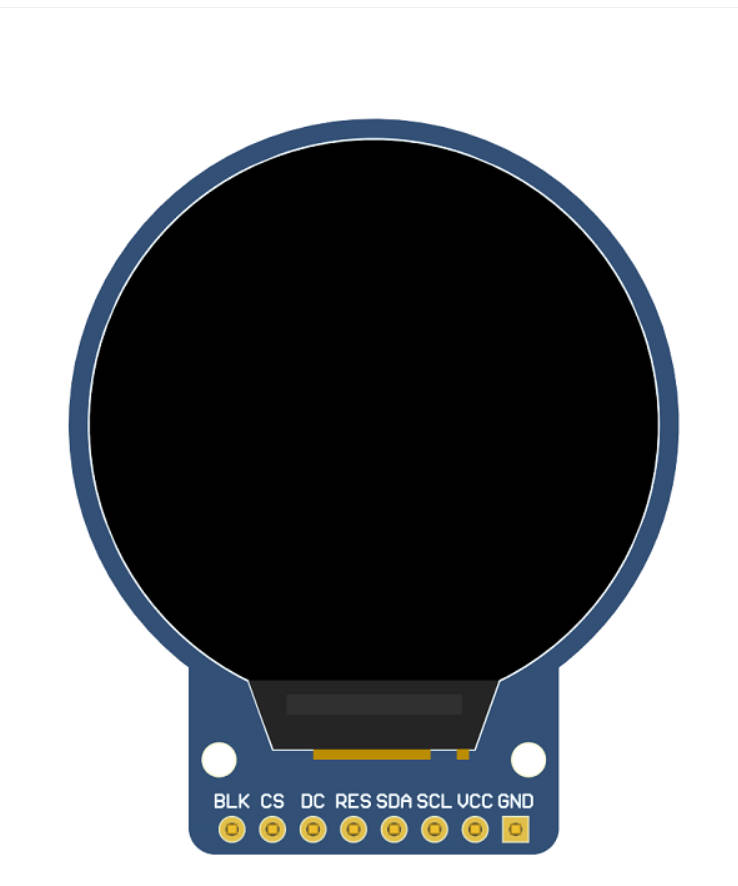
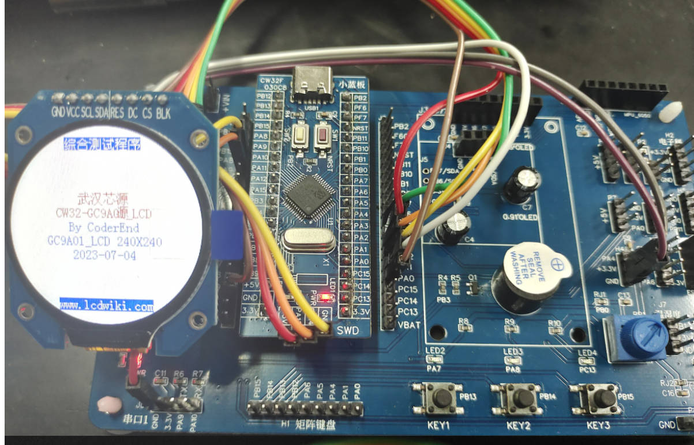
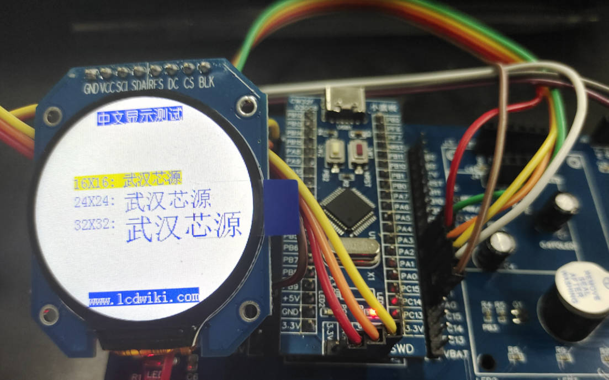
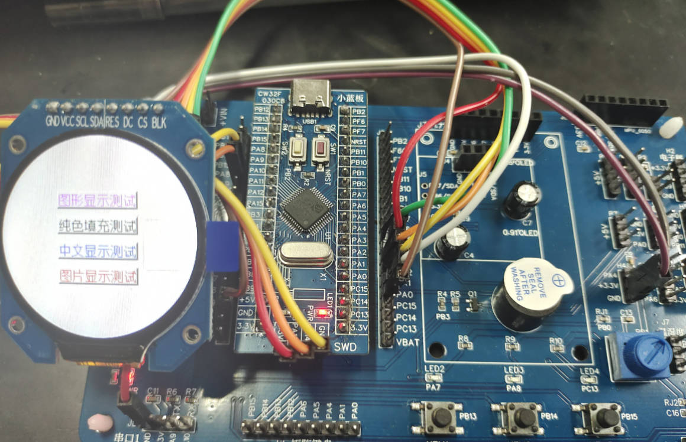

## 武汉芯源CW32F030开发板评测 04 SPI-LCD GC9A01模块
### 硬件平台
1. CW32_48F大学计划板
2. CW32_IOT_EVA物联网开发评估套件
3. 1.28寸圆形彩色TFT显示屏高清IPS 模块240X240 SPI接口GC9A01


### 产品介绍

- 1.28寸圆形IPS彩屏，支持 RGB 65K色显示，显示色彩丰富
- 240X240分辨率，显示清晰
- IPS全视角面板，超宽可视范围
- 采用4线制SPI串行总线，只需几个IO即可点亮
- 提供丰富的Arduino、STM32、C51以及MSP430示例程序
- 军工级工艺标准,长期稳定工作
- 提供底层驱动技术支持

### 产品参数


| 名称               | 参数                 |
| ------------------ | -------------------- |
| 显示颜色           | RGB 65K 彩色         |
| SKU                | MSP1281              |
| 尺寸               | 1.28(inch)           |
| 面板材质           | TFT                  |
| 驱动芯片           | GC9A01               |
| 分辨率             | 240*240 (Pixel)      |
| 显示接口           | 4-line SPI interface |
| 有效显示区域(AA区) | 直径：32.40 (mm)     |
| 触摸屏类型         | 无触摸屏             |
| 触摸IC             | 无触摸IC             |
| 模块PCB底板尺寸    | 38.03x45.80(mm)      |
| 视角               | 全角度               |
| 工作温度           | -10℃~60℃             |
| 存储温度           | -20℃~70℃             |
| 工作电压           | 3.3V                 |

### 接口定义

| 序号 | 模块引脚 | 引脚说明                                                     |
| ---- | -------- | ------------------------------------------------------------ |
| 1    | GND      | 液晶屏电源地                                                 |
| 2    | VCC      | 液晶屏电源正(3.3V/5V)                                        |
| 3    | SCL      | 液晶屏SPI总线时钟信号                                        |
| 4    | SDA      | 液晶屏SPI总线写数据信号                                      |
| 5    | RES      | 液晶屏复位控制信号（低电平复位，模块有复位电路，该引脚可不接） |
| 6    | DC       | 液晶屏寄存器/数据选择控制信号（低电平：寄存器，高电平：数据） |
| 7    | CS       | 液晶屏片选控制信号（低电平使能）                             |
| 8    | BLK      | 液晶屏背光控制信号（高电平点亮，如不需要控制，请接3.3V）     |

### 硬件配置

LCD模块硬件电路包含五大部分：FPC接口电路、3.3V稳压电路、背光控制电路、排针接口、复位电路。

1. FPC接口电路用于连接裸屏。
2. 3.3V稳压电路用于稳定输出3.3V电压。
3. 背光控制电路用于用于控制背光亮和灭，如果不需控制背光。可接3.3V电源。
4. 排针接口用于连接各种开发板。
5. 复位电路用于模块上电复位

#### GC9A01控制器

GC9A01控制器支持的最大分辨率为240*240，拥有一个129600字节大小的GRAM。同时支持8位、9位、12位、16位、18位并口数据总线，还支持3线制和4线制SPI串口。由于并行控制需要大量的I0口，所以最常用的还是SPI串口控制。ST7789还支持65K、262KRGB颜色显示，显示色彩很丰富，同时支持旋转和滚动显示以及视频播放，显示方式多样。
GC9A01控制器使用16bit（RGB565）来控制一个像素点显示，因此可以每个像素点显示颜色多达65K种。像素点地址设置按照行列的顺序进行，递增递减方向由扫描方式决定。GC9A01显示方法按照先设置地址再设置颜色值进行。

### LCD驱动代码结构
```c
//lcd_gc9a01 硬件驱动层代码
lcd_gc9a01.c
lcd_gc9a01.h
//lcd_gc9a01 软件应用层代码
lcd_guic
lcd_gui.h
lcd_font.h
//lcd_gc9a01 软件测试代码
lcd_example.c
lcd_example.h
```
#### lcd_gc9a01.c

```c
#include "main.h"	   
//管理LCD重要参数
//默认为竖屏
_lcd_dev lcddev;

//画笔颜色,背景颜色
uint16_t POINT_COLOR = 0x0000,BACK_COLOR = 0xFFFF;  
uint16_t DeviceCode;	 

void SPI_GPIO_Init(void)
{

      GPIO_InitTypeDef GPIO_InitStruct;
	  __RCC_GPIOA_CLK_ENABLE();
      GPIO_InitStruct.IT = GPIO_IT_NONE; 
      GPIO_InitStruct.Mode = GPIO_MODE_OUTPUT_PP;
      GPIO_InitStruct.Speed = GPIO_SPEED_HIGH;	
      GPIO_InitStruct.Pins = GPIO_PIN_0| GPIO_PIN_1;
	  GPIO_Init(CW_GPIOA, &GPIO_InitStruct);      	
	

}

/*****************************************************************************
 * @name       :void  SPI_WriteByte(uint8_t Data)
 * @date       :2018-08-09 
 * @function   :Write a byte of data using STM32's Software SPI
 * @parameters :Data:Data to be written
 * @retvalue   :None
******************************************************************************/
void SPI_WriteByte(uint8_t Data)
{
	unsigned char i=0;
	for(i=8;i>0;i--)
	{
	  if(Data&0x80)	
			SPI_MOSI_SET; //输出数据
    else
		  SPI_MOSI_CLR;
      SPI_SCLK_CLR;       
      SPI_SCLK_SET;
      Data<<=1; 
	}
}

/*****************************************************************************
 * @name       :void LCD_WR_REG(uint8_t data)
 * @date       :2018-08-09 
 * @function   :Write an 8-bit command to the LCD screen
 * @parameters :data:Command value to be written
 * @retvalue   :None
******************************************************************************/
void LCD_WR_REG(uint8_t data)
{ 
   LCD_CS_CLR;     
	 LCD_RS_CLR;	  
   SPI_WriteByte(data);
   LCD_CS_SET;	
}

/*****************************************************************************
 * @name       :void LCD_WR_DATA(uint8_t data)
 * @date       :2018-08-09 
 * @function   :Write an 8-bit data to the LCD screen
 * @parameters :data:data value to be written
 * @retvalue   :None
******************************************************************************/
void LCD_WR_DATA(uint8_t data)
{
   LCD_CS_CLR;
	 LCD_RS_SET;
   SPI_WriteByte(data);
   LCD_CS_SET;
}

/*****************************************************************************
 * @name       :void LCD_WriteReg(uint8_t LCD_Reg, uint16_t LCD_RegValue)
 * @date       :2018-08-09 
 * @function   :Write data into registers
 * @parameters :LCD_Reg:Register address
                LCD_RegValue:Data to be written
 * @retvalue   :None
******************************************************************************/
void LCD_WriteReg(uint8_t LCD_Reg, uint16_t LCD_RegValue)
{	
	LCD_WR_REG(LCD_Reg);  
	LCD_WR_DATA(LCD_RegValue);	    		 
}	   

/*****************************************************************************
 * @name       :void LCD_WriteRAM_Prepare(void)
 * @date       :2018-08-09 
 * @function   :Write GRAM
 * @parameters :None
 * @retvalue   :None
******************************************************************************/	 
void LCD_WriteRAM_Prepare(void)
{
	LCD_WR_REG(lcddev.wramcmd);
}	 

/*****************************************************************************
 * @name       :void Lcd_WriteData_16Bit(uint16_t Data)
 * @date       :2018-08-09 
 * @function   :Write an 16-bit command to the LCD screen
 * @parameters :Data:Data to be written
 * @retvalue   :None
******************************************************************************/	 
void Lcd_WriteData_16Bit(uint16_t Data)
{	
   LCD_CS_CLR;
   LCD_RS_SET;  
   SPI_WriteByte(Data>>8);
	 SPI_WriteByte(Data);
   LCD_CS_SET;
}

/*****************************************************************************
 * @name       :void LCD_DrawPoint(uint16_t x,uint16_t y)
 * @date       :2018-08-09 
 * @function   :Write a pixel data at a specified location
 * @parameters :x:the x coordinate of the pixel
                y:the y coordinate of the pixel
 * @retvalue   :None
******************************************************************************/	
void LCD_DrawPoint(uint16_t x,uint16_t y)
{
	LCD_SetCursor(x,y);//设置光标位置 
	Lcd_WriteData_16Bit(POINT_COLOR); 
}

/*****************************************************************************
 * @name       :void LCD_Clear(uint16_t Color)
 * @date       :2018-08-09 
 * @function   :Full screen filled LCD screen
 * @parameters :color:Filled color
 * @retvalue   :None
******************************************************************************/	
void LCD_Clear(uint16_t Color)
{
  unsigned int i,m;  
	LCD_SetWindows(0,0,lcddev.width-1,lcddev.height-1);   
	LCD_CS_CLR;
	LCD_RS_SET;
	for(i=0;i<lcddev.height;i++)
	{
    for(m=0;m<lcddev.width;m++)
    {	
			SPI_WriteByte(Color>>8);
			SPI_WriteByte(Color);
		}
	}
  LCD_CS_SET;
} 

/*****************************************************************************
 * @name       :void LCD_Clear(uint16_t Color)
 * @date       :2018-08-09 
 * @function   :Initialization LCD screen GPIO
 * @parameters :None
 * @retvalue   :None
******************************************************************************/	
void LCD_GPIOInit(void)
{
	 GPIO_InitTypeDef GPIO_InitStruct;
	  __RCC_GPIOA_CLK_ENABLE();
      GPIO_InitStruct.IT = GPIO_IT_NONE; 
      GPIO_InitStruct.Mode = GPIO_MODE_OUTPUT_PP;
      GPIO_InitStruct.Speed = GPIO_SPEED_HIGH;	
      GPIO_InitStruct.Pins = GPIO_PIN_2| GPIO_PIN_3|GPIO_PIN_4| GPIO_PIN_5;
	  GPIO_Init(CW_GPIOA, &GPIO_InitStruct);  
}

/*****************************************************************************
 * @name       :void LCD_RESET(void)
 * @date       :2018-08-09 
 * @function   :Reset LCD screen
 * @parameters :None
 * @retvalue   :None
******************************************************************************/	
void LCD_RESET(void)
{
	LCD_RST_CLR;
	delay_ms(20);	
	LCD_RST_SET;
	delay_ms(20);
}

/*****************************************************************************
 * @name       :void LCD_Init(void)
 * @date       :2018-08-09 
 * @function   :Initialization LCD screen
 * @parameters :None
 * @retvalue   :None
******************************************************************************/	 	 
void LCD_Init(void)
{  
	SPI_GPIO_Init(); //SPI GPIO初始化
	LCD_GPIOInit();//LCD GPIO初始化										 
 	LCD_RESET(); //LCD 复位
//************* GC9A01初始化**********//	
 	LCD_WR_REG(0xEF);
	LCD_WR_REG(0xEB);
	LCD_WR_DATA(0x14); 
	
  LCD_WR_REG(0xFE);			 
	LCD_WR_REG(0xEF); 

	LCD_WR_REG(0xEB);	
	LCD_WR_DATA(0x14); 

	LCD_WR_REG(0x84);			
	LCD_WR_DATA(0x40); 

	LCD_WR_REG(0x85);			
	LCD_WR_DATA(0xFF); 

	LCD_WR_REG(0x86);			
	LCD_WR_DATA(0xFF); 

	LCD_WR_REG(0x87);			
	LCD_WR_DATA(0xFF);

	LCD_WR_REG(0x88);			
	LCD_WR_DATA(0x0A);

	LCD_WR_REG(0x89);			
	LCD_WR_DATA(0x21); 

	LCD_WR_REG(0x8A);			
	LCD_WR_DATA(0x00); 

	LCD_WR_REG(0x8B);			
	LCD_WR_DATA(0x80); 

	LCD_WR_REG(0x8C);			
	LCD_WR_DATA(0x01); 

	LCD_WR_REG(0x8D);			
	LCD_WR_DATA(0x01); 

	LCD_WR_REG(0x8E);			
	LCD_WR_DATA(0xFF); 

	LCD_WR_REG(0x8F);			
	LCD_WR_DATA(0xFF); 


	LCD_WR_REG(0xB6);
	LCD_WR_DATA(0x00);
	LCD_WR_DATA(0x20);

	LCD_WR_REG(0x36);
	LCD_WR_DATA(0x08);
	
	LCD_WR_REG(0x3A);			
	LCD_WR_DATA(0x05); 


	LCD_WR_REG(0x90);			
	LCD_WR_DATA(0x08);
	LCD_WR_DATA(0x08);
	LCD_WR_DATA(0x08);
	LCD_WR_DATA(0x08); 

	LCD_WR_REG(0xBD);			
	LCD_WR_DATA(0x06);
	
	LCD_WR_REG(0xBC);			
	LCD_WR_DATA(0x00);	

	LCD_WR_REG(0xFF);			
	LCD_WR_DATA(0x60);
	LCD_WR_DATA(0x01);
	LCD_WR_DATA(0x04);

	LCD_WR_REG(0xC3);			
	LCD_WR_DATA(0x13);
	LCD_WR_REG(0xC4);			
	LCD_WR_DATA(0x13);

	LCD_WR_REG(0xC9);			
	LCD_WR_DATA(0x22);

	LCD_WR_REG(0xBE);			
	LCD_WR_DATA(0x11); 

	LCD_WR_REG(0xE1);			
	LCD_WR_DATA(0x10);
	LCD_WR_DATA(0x0E);

	LCD_WR_REG(0xDF);			
	LCD_WR_DATA(0x21);
	LCD_WR_DATA(0x0c);
	LCD_WR_DATA(0x02);

	LCD_WR_REG(0xF0);   
	LCD_WR_DATA(0x45);
	LCD_WR_DATA(0x09);
	LCD_WR_DATA(0x08);
	LCD_WR_DATA(0x08);
	LCD_WR_DATA(0x26);
 	LCD_WR_DATA(0x2A);

 	LCD_WR_REG(0xF1);    
 	LCD_WR_DATA(0x43);
 	LCD_WR_DATA(0x70);
 	LCD_WR_DATA(0x72);
 	LCD_WR_DATA(0x36);
 	LCD_WR_DATA(0x37);  
 	LCD_WR_DATA(0x6F);


 	LCD_WR_REG(0xF2);   
 	LCD_WR_DATA(0x45);
 	LCD_WR_DATA(0x09);
 	LCD_WR_DATA(0x08);
 	LCD_WR_DATA(0x08);
 	LCD_WR_DATA(0x26);
 	LCD_WR_DATA(0x2A);

 	LCD_WR_REG(0xF3);   
 	LCD_WR_DATA(0x43);
 	LCD_WR_DATA(0x70);
 	LCD_WR_DATA(0x72);
 	LCD_WR_DATA(0x36);
 	LCD_WR_DATA(0x37); 
 	LCD_WR_DATA(0x6F);

	LCD_WR_REG(0xED);	
	LCD_WR_DATA(0x1B); 
	LCD_WR_DATA(0x0B); 

	LCD_WR_REG(0xAE);			
	LCD_WR_DATA(0x77);
	
	LCD_WR_REG(0xCD);			
	LCD_WR_DATA(0x63);		


	LCD_WR_REG(0x70);			
	LCD_WR_DATA(0x07);
	LCD_WR_DATA(0x07);
	LCD_WR_DATA(0x04);
	LCD_WR_DATA(0x0E); 
	LCD_WR_DATA(0x0F); 
	LCD_WR_DATA(0x09);
	LCD_WR_DATA(0x07);
	LCD_WR_DATA(0x08);
	LCD_WR_DATA(0x03);

	LCD_WR_REG(0xE8);			
	LCD_WR_DATA(0x34);

	LCD_WR_REG(0x62);			
	LCD_WR_DATA(0x18);
	LCD_WR_DATA(0x0D);
	LCD_WR_DATA(0x71);
	LCD_WR_DATA(0xED);
	LCD_WR_DATA(0x70); 
	LCD_WR_DATA(0x70);
	LCD_WR_DATA(0x18);
	LCD_WR_DATA(0x0F);
	LCD_WR_DATA(0x71);
	LCD_WR_DATA(0xEF);
	LCD_WR_DATA(0x70); 
	LCD_WR_DATA(0x70);

	LCD_WR_REG(0x63);			
	LCD_WR_DATA(0x18);
	LCD_WR_DATA(0x11);
	LCD_WR_DATA(0x71);
	LCD_WR_DATA(0xF1);
	LCD_WR_DATA(0x70); 
	LCD_WR_DATA(0x70);
	LCD_WR_DATA(0x18);
	LCD_WR_DATA(0x13);
	LCD_WR_DATA(0x71);
	LCD_WR_DATA(0xF3);
	LCD_WR_DATA(0x70); 
	LCD_WR_DATA(0x70);

	LCD_WR_REG(0x64);			
	LCD_WR_DATA(0x28);
	LCD_WR_DATA(0x29);
	LCD_WR_DATA(0xF1);
	LCD_WR_DATA(0x01);
	LCD_WR_DATA(0xF1);
	LCD_WR_DATA(0x00);
	LCD_WR_DATA(0x07);

	LCD_WR_REG(0x66);			
	LCD_WR_DATA(0x3C);
	LCD_WR_DATA(0x00);
	LCD_WR_DATA(0xCD);
	LCD_WR_DATA(0x67);
	LCD_WR_DATA(0x45);
	LCD_WR_DATA(0x45);
	LCD_WR_DATA(0x10);
	LCD_WR_DATA(0x00);
	LCD_WR_DATA(0x00);
	LCD_WR_DATA(0x00);

	LCD_WR_REG(0x67);			
	LCD_WR_DATA(0x00);
	LCD_WR_DATA(0x3C);
	LCD_WR_DATA(0x00);
	LCD_WR_DATA(0x00);
	LCD_WR_DATA(0x00);
	LCD_WR_DATA(0x01);
	LCD_WR_DATA(0x54);
	LCD_WR_DATA(0x10);
	LCD_WR_DATA(0x32);
	LCD_WR_DATA(0x98);

	LCD_WR_REG(0x74);			
	LCD_WR_DATA(0x10);	
	LCD_WR_DATA(0x85);	
	LCD_WR_DATA(0x80);
	LCD_WR_DATA(0x00); 
	LCD_WR_DATA(0x00); 
	LCD_WR_DATA(0x4E);
	LCD_WR_DATA(0x00);					
	
    LCD_WR_REG(0x98);			
	LCD_WR_DATA(0x3e);
	LCD_WR_DATA(0x07);

	LCD_WR_REG(0x35);	
	LCD_WR_REG(0x21);

	LCD_WR_REG(0x11); 
	delay_ms(120); 

	LCD_WR_REG(0x29); 	
    LCD_direction(USE_HORIZONTAL);//设置LCD显示方向
	LCD_LED_SET;//点亮背光	 
	LCD_Clear(WHITE);//清全屏白色
}
 
/*****************************************************************************
 * @name       :void LCD_SetWindows(uint16_t xStar, uint16_t yStar,uint16_t xEnd,uint16_t yEnd)
 * @date       :2018-08-09 
 * @function   :Setting LCD display window
 * @parameters :xStar:the bebinning x coordinate of the LCD display window
								yStar:the bebinning y coordinate of the LCD display window
								xEnd:the endning x coordinate of the LCD display window
								yEnd:the endning y coordinate of the LCD display window
 * @retvalue   :None
******************************************************************************/ 
void LCD_SetWindows(uint16_t xStar, uint16_t yStar,uint16_t xEnd,uint16_t yEnd)
{	
	LCD_WR_REG(lcddev.setxcmd);	
	LCD_WR_DATA(xStar>>8);
	LCD_WR_DATA(xStar);		
	LCD_WR_DATA(xEnd>>8);
	LCD_WR_DATA(xEnd);

	LCD_WR_REG(lcddev.setycmd);	
	LCD_WR_DATA(yStar>>8);
	LCD_WR_DATA(yStar);		
	LCD_WR_DATA(yEnd>>8);
	LCD_WR_DATA(yEnd);

	LCD_WriteRAM_Prepare();	//开始写入GRAM			
}   

/*****************************************************************************
 * @name       :void LCD_SetCursor(uint16_t Xpos, uint16_t Ypos)
 * @date       :2018-08-09 
 * @function   :Set coordinate value
 * @parameters :Xpos:the  x coordinate of the pixel
								Ypos:the  y coordinate of the pixel
 * @retvalue   :None
******************************************************************************/ 
void LCD_SetCursor(uint16_t Xpos, uint16_t Ypos)
{	  	    			
	LCD_SetWindows(Xpos,Ypos,Xpos,Ypos);	
} 

/*****************************************************************************
 * @name       :void LCD_direction(uint8_t direction)
 * @date       :2018-08-09 
 * @function   :Setting the display direction of LCD screen
 * @parameters :direction:0-0 degree
                          1-90 degree
													2-180 degree
													3-270 degree
 * @retvalue   :None
******************************************************************************/ 
void LCD_direction(uint8_t direction)
{ 
			lcddev.setxcmd=0x2A;
			lcddev.setycmd=0x2B;
			lcddev.wramcmd=0x2C;
	switch(direction){		  
		case 0:						 	 		
			lcddev.width=LCD_W;
			lcddev.height=LCD_H;	
			LCD_WriteReg(0x36,1<<3);//BGR==1,MY==0,MX==0,MV==0
		break;
		case 1:
			lcddev.width=LCD_H;
			lcddev.height=LCD_W;
			LCD_WriteReg(0x36,(1<<5)|(1<<6)|(1<<3));//BGR==1,MY==1,MX==0,MV==1
		break;
		case 2:						 	 		
			lcddev.width=LCD_W;
			lcddev.height=LCD_H;			
			LCD_WriteReg(0x36,(1<<6)|(1<<7)|(1<<3));//BGR==1,MY==0,MX==0,MV==0
		break;
		case 3:
			lcddev.width=LCD_H;
			lcddev.height=LCD_W;
			LCD_WriteReg(0x36,(1<<7)|(1<<5)|(1<<3));//BGR==1,MY==1,MX==0,MV==1
		break;	
		default:break;
	}		
}	 
```
#### lcd_gc9a01.h

```c
#ifndef __LCD_GC9A01_H
#define __LCD_GC9A01_H	

#include "main.h"

//LCD重要参数集
typedef struct  
{										    
	uint16_t width;			//LCD 宽度
	uint16_t height;			//LCD 高度
	uint16_t id;				//LCD ID
	uint8_t  dir;			//横屏还是竖屏控制：0，竖屏；1，横屏。	
	uint16_t  wramcmd;		//开始写gram指令
	uint16_t  setxcmd;		//设置x坐标指令
	uint16_t  setycmd;		//设置y坐标指令	
}_lcd_dev; 	

//LCD参数
extern _lcd_dev lcddev;	//管理LCD重要参数
/////////////////////////////////////用户配置区///////////////////////////////////	 
#define USE_HORIZONTAL  	 0 //定义液晶屏顺时针旋转方向 	0-0度旋转，1-90度旋转，2-180度旋转，3-270度旋转

//定义LCD的尺寸
#define LCD_W 240
#define LCD_H 240

//TFTLCD部分外要调用的函数		   
extern uint16_t  POINT_COLOR;//默认红色    
extern uint16_t  BACK_COLOR; //背景颜色.默认为白色

//液晶控制口置1操作语句宏定义
#define SPI_PORT  CW_GPIOA
#define LCD_PORT  CW_GPIOA

#define SDA_GPIO_PIN  GPIO_PIN_0
#define SCL_GPIO_PIN  GPIO_PIN_1
#define CS_GPIO_PIN   GPIO_PIN_2
#define DC_GPIO_PIN   GPIO_PIN_3
#define RES_GPIO_PIN  GPIO_PIN_4
#define BLK_GPIO_PIN  GPIO_PIN_5

#define	SPI_MOSI_SET    GPIO_SetBits(SPI_PORT,SDA_GPIO_PIN)
#define	SPI_SCLK_SET    GPIO_SetBits(SPI_PORT,SCL_GPIO_PIN)
   
#define	SPI_MOSI_CLR    GPIO_ResetBits(SPI_PORT,SDA_GPIO_PIN)
#define	SPI_SCLK_CLR    GPIO_ResetBits(SPI_PORT,SCL_GPIO_PIN)


#define	LCD_CS_SET      GPIO_SetBits(LCD_PORT,CS_GPIO_PIN)
#define	LCD_RS_SET      GPIO_SetBits(LCD_PORT,DC_GPIO_PIN)
#define	LCD_RST_SET     GPIO_SetBits(LCD_PORT,RES_GPIO_PIN)
#define	LCD_LED_SET     GPIO_SetBits(LCD_PORT,BLK_GPIO_PIN) //LCD背光 

#define	LCD_CS_CLR     GPIO_ResetBits(LCD_PORT,CS_GPIO_PIN)
#define	LCD_RS_CLR     GPIO_ResetBits(LCD_PORT,DC_GPIO_PIN)
#define	LCD_RST_CLR    GPIO_ResetBits(LCD_PORT,RES_GPIO_PIN)			


//画笔颜色
#define WHITE       0xFFFF
#define BLACK      	0x0000	  
#define BLUE       	0x001F  
#define BRED        0XF81F
#define GRED 	    0XFFE0
#define GBLUE		0X07FF
#define RED         0xF800
#define MAGENTA     0xF81F
#define GREEN       0x07E0
#define CYAN        0x7FFF
#define YELLOW      0xFFE0
#define BROWN 		0XBC40 //棕色
#define BRRED 		0XFC07 //棕红色
#define GRAY  		0X8430 //灰色
#define GRAY0       0xEF7D 
#define GRAY1       0x8410 //灰色1      00000 000000 00000
#define GRAY2       0x4208 
//GUI颜色
#define DARKBLUE    0X01CF	//深蓝色
#define LIGHTBLUE   0X7D7C	//浅蓝色  
#define GRAYBLUE    0X5458 //灰蓝色
//以上三色为PANEL的颜色 
 
#define LIGHTGREEN  0X841F //浅绿色
#define LIGHTGRAY   0XEF5B //浅灰色(PANNEL)
#define LGRAY 		0XC618 //浅灰色(PANNEL),窗体背景色

#define LGRAYBLUE   0XA651 //浅灰蓝色(中间层颜色)
#define LBBLUE      0X2B12 //浅棕蓝色(选择条目的反色)


void SPI_WriteByte(uint8_t Data); 
void SPI_GPIO_Init(void);


void LCD_Init(void);
void LCD_DisplayOn(void);
void LCD_DisplayOff(void);
void LCD_Clear(uint16_t Color);	 
void LCD_SetCursor(uint16_t Xpos, uint16_t Ypos);
void LCD_DrawPoint(uint16_t x,uint16_t y);//画点
uint16_t  LCD_ReadPoint(uint16_t x,uint16_t y); //读点
void LCD_DrawLine(uint16_t x1, uint16_t y1, uint16_t x2, uint16_t y2);
void LCD_DrawRectangle(uint16_t x1, uint16_t y1, uint16_t x2, uint16_t y2);		   
void LCD_SetWindows(uint16_t xStar, uint16_t yStar,uint16_t xEnd,uint16_t yEnd);

uint16_t LCD_RD_DATA(void);//读取LCD数据									    
void LCD_WriteReg(uint8_t LCD_Reg, uint16_t LCD_RegValue);
void LCD_WR_DATA(uint8_t data);
uint16_t LCD_ReadReg(uint8_t LCD_Reg);
void LCD_WriteRAM_Prepare(void);
void LCD_WriteRAM(uint16_t RGB_Code);
uint16_t LCD_ReadRAM(void);		   
uint16_t LCD_BGR2RGB(uint16_t c);
void LCD_SetParam(void);
void Lcd_WriteData_16Bit(uint16_t Data);
void LCD_direction(uint8_t direction );
				  		 
#endif  
```
#### lcd_gui.c

```c
#include "main.h"
#include "lcd_font.h" 
/*LCD GUI API函数*/
/*******************************************************************
 * @name       :void GUI_DrawPoint(uint16_t x,uint16_t y,uint16_t color)
 * @date       :2018-08-09 
 * @function   :draw a point in LCD screen
 * @parameters :x:the x coordinate of the point
                y:the y coordinate of the point
								color:the color value of the point
 * @retvalue   :None
********************************************************************/
void GUI_DrawPoint(uint16_t x,uint16_t y,uint16_t color)
{
	LCD_SetCursor(x,y);//设置光标位置 
	Lcd_WriteData_16Bit(color); 
}

/*******************************************************************
 * @name       :void LCD_Fill(uint16_t sx,uint16_t sy,uint16_t ex,uint16_t ey,uint16_t color)
 * @date       :2018-08-09 
 * @function   :fill the specified area
 * @parameters :sx:the bebinning x coordinate of the specified area
                sy:the bebinning y coordinate of the specified area
								ex:the ending x coordinate of the specified area
								ey:the ending y coordinate of the specified area
								color:the filled color value
 * @retvalue   :None
********************************************************************/
void LCD_Fill(uint16_t sx,uint16_t sy,uint16_t ex,uint16_t ey,uint16_t color)
{  	
	uint16_t i,j;			
	uint16_t width=ex-sx+1; 		//得到填充的宽度
	uint16_t height=ey-sy+1;		//高度
	LCD_SetWindows(sx,sy,ex,ey);//设置显示窗口
	for(i=0;i<height;i++)
	{
		for(j=0;j<width;j++)
		Lcd_WriteData_16Bit(color);	//写入数据 	 
	}
	LCD_SetWindows(0,0,lcddev.width-1,lcddev.height-1);//恢复窗口设置为全屏
}

/*******************************************************************
 * @name       :void LCD_DrawLine(uint16_t x1, uint16_t y1, uint16_t x2, uint16_t y2)
 * @date       :2018-08-09 
 * @function   :Draw a line between two points
 * @parameters :x1:the bebinning x coordinate of the line
                y1:the bebinning y coordinate of the line
								x2:the ending x coordinate of the line
								y2:the ending y coordinate of the line
 * @retvalue   :None
********************************************************************/
void LCD_DrawLine(uint16_t x1, uint16_t y1, uint16_t x2, uint16_t y2)
{
	uint16_t t; 
	int xerr=0,yerr=0,delta_x,delta_y,distance; 
	int incx,incy,uRow,uCol; 

	delta_x=x2-x1; //计算坐标增量 
	delta_y=y2-y1; 
	uRow=x1; 
	uCol=y1; 
	if(delta_x>0)incx=1; //设置单步方向 
	else if(delta_x==0)incx=0;//垂直线 
	else {incx=-1;delta_x=-delta_x;} 
	if(delta_y>0)incy=1; 
	else if(delta_y==0)incy=0;//水平线 
	else{incy=-1;delta_y=-delta_y;} 
	if( delta_x>delta_y)distance=delta_x; //选取基本增量坐标轴 
	else distance=delta_y; 
	for(t=0;t<=distance+1;t++ )//画线输出 
	{  
		LCD_DrawPoint(uRow,uCol);//画点 
		xerr+=delta_x ; 
		yerr+=delta_y ; 
		if(xerr>distance) 
		{ 
			xerr-=distance; 
			uRow+=incx; 
		} 
		if(yerr>distance) 
		{ 
			yerr-=distance; 
			uCol+=incy; 
		} 
	}  
} 

/*****************************************************************************
 * @name       :void LCD_DrawRectangle(uint16_t x1, uint16_t y1, uint16_t x2, uint16_t y2)
 * @date       :2018-08-09 
 * @function   :Draw a rectangle
 * @parameters :x1:the bebinning x coordinate of the rectangle
                y1:the bebinning y coordinate of the rectangle
								x2:the ending x coordinate of the rectangle
								y2:the ending y coordinate of the rectangle
 * @retvalue   :None
******************************************************************************/
void LCD_DrawRectangle(uint16_t x1, uint16_t y1, uint16_t x2, uint16_t y2)
{
	LCD_DrawLine(x1,y1,x2,y1);
	LCD_DrawLine(x1,y1,x1,y2);
	LCD_DrawLine(x1,y2,x2,y2);
	LCD_DrawLine(x2,y1,x2,y2);
}  

/*****************************************************************************
 * @name       :void LCD_DrawFillRectangle(uint16_t x1, uint16_t y1, uint16_t x2, uint16_t y2)
 * @date       :2018-08-09 
 * @function   :Filled a rectangle
 * @parameters :x1:the bebinning x coordinate of the filled rectangle
                y1:the bebinning y coordinate of the filled rectangle
								x2:the ending x coordinate of the filled rectangle
								y2:the ending y coordinate of the filled rectangle
 * @retvalue   :None
******************************************************************************/  
void LCD_DrawFillRectangle(uint16_t x1, uint16_t y1, uint16_t x2, uint16_t y2)
{
	LCD_Fill(x1,y1,x2,y2,POINT_COLOR);
}
 
/*****************************************************************************
 * @name       :void _draw_circle_8(int xc, int yc, int x, int y, uint16_t c)
 * @date       :2018-08-09 
 * @function   :8 symmetry circle drawing algorithm (internal call)
 * @parameters :xc:the x coordinate of the Circular center 
                yc:the y coordinate of the Circular center 
								x:the x coordinate relative to the Circular center 
								y:the y coordinate relative to the Circular center 
								c:the color value of the circle
 * @retvalue   :None
******************************************************************************/  
void _draw_circle_8(int xc, int yc, int x, int y, uint16_t c)
{
	GUI_DrawPoint(xc + x, yc + y, c);

	GUI_DrawPoint(xc - x, yc + y, c);

	GUI_DrawPoint(xc + x, yc - y, c);

	GUI_DrawPoint(xc - x, yc - y, c);

	GUI_DrawPoint(xc + y, yc + x, c);

	GUI_DrawPoint(xc - y, yc + x, c);

	GUI_DrawPoint(xc + y, yc - x, c);

	GUI_DrawPoint(xc - y, yc - x, c);
}

/*****************************************************************************
 * @name       :void gui_circle(int xc, int yc,uint16_t c,int r, int fill)
 * @date       :2018-08-09 
 * @function   :Draw a circle of specified size at a specified location
 * @parameters :xc:the x coordinate of the Circular center 
                yc:the y coordinate of the Circular center 
								r:Circular radius
								fill:1-filling,0-no filling
 * @retvalue   :None
******************************************************************************/  
void gui_circle(int xc, int yc,uint16_t c,int r, int fill)
{
	int x = 0, y = r, yi, d;

	d = 3 - 2 * r;


	if (fill) 
	{
		// 如果填充（画实心圆）
		while (x <= y) {
			for (yi = x; yi <= y; yi++)
				_draw_circle_8(xc, yc, x, yi, c);

			if (d < 0) {
				d = d + 4 * x + 6;
			} else {
				d = d + 4 * (x - y) + 10;
				y--;
			}
			x++;
		}
	} else 
	{
		// 如果不填充（画空心圆）
		while (x <= y) {
			_draw_circle_8(xc, yc, x, y, c);
			if (d < 0) {
				d = d + 4 * x + 6;
			} else {
				d = d + 4 * (x - y) + 10;
				y--;
			}
			x++;
		}
	}
}

/*****************************************************************************
 * @name       :void Draw_Triangel(uint16_t x0,uint16_t y0,uint16_t x1,uint16_t y1,uint16_t x2,uint16_t y2)
 * @date       :2018-08-09 
 * @function   :Draw a triangle at a specified position
 * @parameters :x0:the bebinning x coordinate of the triangular edge 
                y0:the bebinning y coordinate of the triangular edge 
								x1:the vertex x coordinate of the triangular
								y1:the vertex y coordinate of the triangular
								x2:the ending x coordinate of the triangular edge 
								y2:the ending y coordinate of the triangular edge 
 * @retvalue   :None
******************************************************************************/ 
void Draw_Triangel(uint16_t x0,uint16_t y0,uint16_t x1,uint16_t y1,uint16_t x2,uint16_t y2)
{
	LCD_DrawLine(x0,y0,x1,y1);
	LCD_DrawLine(x1,y1,x2,y2);
	LCD_DrawLine(x2,y2,x0,y0);
}

static void _swap(uint16_t *a, uint16_t *b)
{
	uint16_t tmp;
  tmp = *a;
	*a = *b;
	*b = tmp;
}

/*****************************************************************************
 * @name       :void Fill_Triangel(uint16_t x0,uint16_t y0,uint16_t x1,uint16_t y1,uint16_t x2,uint16_t y2)
 * @date       :2018-08-09 
 * @function   :filling a triangle at a specified position
 * @parameters :x0:the bebinning x coordinate of the triangular edge 
                y0:the bebinning y coordinate of the triangular edge 
								x1:the vertex x coordinate of the triangular
								y1:the vertex y coordinate of the triangular
								x2:the ending x coordinate of the triangular edge 
								y2:the ending y coordinate of the triangular edge 
 * @retvalue   :None
******************************************************************************/ 
void Fill_Triangel(uint16_t x0,uint16_t y0,uint16_t x1,uint16_t y1,uint16_t x2,uint16_t y2)
{
	uint16_t a, b, y, last;
	int dx01, dy01, dx02, dy02, dx12, dy12;
	long sa = 0;
	long sb = 0;
 	if (y0 > y1) 
	{
    _swap(&y0,&y1); 
		_swap(&x0,&x1);
 	}
 	if (y1 > y2) 
	{
    _swap(&y2,&y1); 
		_swap(&x2,&x1);
 	}
  if (y0 > y1) 
	{
    _swap(&y0,&y1); 
		_swap(&x0,&x1);
  }
	if(y0 == y2) 
	{ 
		a = b = x0;
		if(x1 < a)
    {
			a = x1;
    }
    else if(x1 > b)
    {
			b = x1;
    }
    if(x2 < a)
    {
			a = x2;
    }
		else if(x2 > b)
    {
			b = x2;
    }
		LCD_Fill(a,y0,b,y0,POINT_COLOR);
    return;
	}
	dx01 = x1 - x0;
	dy01 = y1 - y0;
	dx02 = x2 - x0;
	dy02 = y2 - y0;
	dx12 = x2 - x1;
	dy12 = y2 - y1;
	
	if(y1 == y2)
	{
		last = y1; 
	}
  else
	{
		last = y1-1; 
	}
	for(y=y0; y<=last; y++) 
	{
		a = x0 + sa / dy01;
		b = x0 + sb / dy02;
		sa += dx01;
    sb += dx02;
    if(a > b)
    {
			_swap(&a,&b);
		}
		LCD_Fill(a,y,b,y,POINT_COLOR);
	}
	sa = dx12 * (y - y1);
	sb = dx02 * (y - y0);
	for(; y<=y2; y++) 
	{
		a = x1 + sa / dy12;
		b = x0 + sb / dy02;
		sa += dx12;
		sb += dx02;
		if(a > b)
		{
			_swap(&a,&b);
		}
		LCD_Fill(a,y,b,y,POINT_COLOR);
	}
}

/*****************************************************************************
 * @name       :void LCD_ShowChar(uint16_t x,uint16_t y,uint16_t fc, uint16_t bc, uint8_t num,uint8_t size,uint8_t mode)
 * @date       :2018-08-09 
 * @function   :Display a single English character
 * @parameters :x:the bebinning x coordinate of the Character display position
                y:the bebinning y coordinate of the Character display position
								fc:the color value of display character
								bc:the background color of display character
								num:the ascii code of display character(0~94)
								size:the size of display character
								mode:0-no overlying,1-overlying
 * @retvalue   :None
******************************************************************************/ 
void LCD_ShowChar(uint16_t x,uint16_t y,uint16_t fc, uint16_t bc, uint8_t num,uint8_t size,uint8_t mode)
{  
    uint8_t temp;
    uint8_t pos,t;
	uint16_t colortemp=POINT_COLOR;      
		   
	num=num-' ';//得到偏移后的值
	LCD_SetWindows(x,y,x+size/2-1,y+size-1);//设置单个文字显示窗口
	if(!mode) //非叠加方式
	{		
		for(pos=0;pos<size;pos++)
		{
			if(size==12)temp=asc2_1206[num][pos];//调用1206字体
			else temp=asc2_1608[num][pos];		 //调用1608字体
			for(t=0;t<size/2;t++)
		    {                 
		        if(temp&0x01)Lcd_WriteData_16Bit(fc); 
				else Lcd_WriteData_16Bit(bc); 
				temp>>=1; 
				
		    }
			
		}	
	}else//叠加方式
	{
		for(pos=0;pos<size;pos++)
		{
			if(size==12)temp=asc2_1206[num][pos];//调用1206字体
			else temp=asc2_1608[num][pos];		 //调用1608字体
			for(t=0;t<size/2;t++)
		    {   
				POINT_COLOR=fc;              
		        if(temp&0x01)LCD_DrawPoint(x+t,y+pos);//画一个点    
		        temp>>=1; 
		    }
		}
	}
	POINT_COLOR=colortemp;	
	LCD_SetWindows(0,0,lcddev.width-1,lcddev.height-1);//恢复窗口为全屏    	   	 	  
}

/*****************************************************************************
 * @name       :void LCD_ShowString(uint16_t x,uint16_t y,uint8_t size,uint8_t *p,uint8_t mode)
 * @date       :2018-08-09 
 * @function   :Display English string
 * @parameters :x:the bebinning x coordinate of the English string
                y:the bebinning y coordinate of the English string
								p:the start address of the English string
								size:the size of display character
								mode:0-no overlying,1-overlying
 * @retvalue   :None
******************************************************************************/   	  
void LCD_ShowString(uint16_t x,uint16_t y,uint8_t size,uint8_t *p,uint8_t mode)
{         
    while((*p<='~')&&(*p>=' '))//判断是不是非法字符!
    {   
		if(x>(lcddev.width-1)||y>(lcddev.height-1)) 
		return;     
        LCD_ShowChar(x,y,POINT_COLOR,BACK_COLOR,*p,size,mode);
        x+=size/2;
        p++;
    }  
} 

/*****************************************************************************
 * @name       :uint32_t mypow(uint8_t m,uint8_t n)
 * @date       :2018-08-09 
 * @function   :get the nth power of m (internal call)
 * @parameters :m:the multiplier
                n:the power
 * @retvalue   :the nth power of m
******************************************************************************/ 
uint32_t mypow(uint8_t m,uint8_t n)
{
	uint32_t result=1;	 
	while(n--)result*=m;    
	return result;
}

/*****************************************************************************
 * @name       :void LCD_ShowNum(uint16_t x,uint16_t y,uint32_t num,uint8_t len,uint8_t size)
 * @date       :2018-08-09 
 * @function   :Display number
 * @parameters :x:the bebinning x coordinate of the number
                y:the bebinning y coordinate of the number
								num:the number(0~4294967295)
								len:the length of the display number
								size:the size of display number
 * @retvalue   :None
******************************************************************************/  			 
void LCD_ShowNum(uint16_t x,uint16_t y,uint32_t num,uint8_t len,uint8_t size)
{         	
	uint8_t t,temp;
	uint8_t enshow=0;						   
	for(t=0;t<len;t++)
	{
		temp=(num/mypow(10,len-t-1))%10;
		if(enshow==0&&t<(len-1))
		{
			if(temp==0)
			{
				LCD_ShowChar(x+(size/2)*t,y,POINT_COLOR,BACK_COLOR,' ',size,0);
				continue;
			}else enshow=1; 
		 	 
		}
	 	LCD_ShowChar(x+(size/2)*t,y,POINT_COLOR,BACK_COLOR,temp+'0',size,0); 
	}
} 

/*****************************************************************************
 * @name       :void GUI_DrawFont16(uint16_t x, uint16_t y, uint16_t fc, uint16_t bc, uint8_t *s,uint8_t mode)
 * @date       :2018-08-09 
 * @function   :Display a single 16x16 Chinese character
 * @parameters :x:the bebinning x coordinate of the Chinese character
                y:the bebinning y coordinate of the Chinese character
								fc:the color value of Chinese character
								bc:the background color of Chinese character
								s:the start address of the Chinese character
								mode:0-no overlying,1-overlying
 * @retvalue   :None
******************************************************************************/ 
void GUI_DrawFont16(uint16_t x, uint16_t y, uint16_t fc, uint16_t bc, uint8_t *s,uint8_t mode)
{
	uint8_t i,j;
	uint16_t k;
	uint16_t HZnum;
	uint16_t x0=x;
	HZnum=sizeof(tfont16)/sizeof(typFNT_GB16);	//自动统计汉字数目
	
			
	for (k=0;k<HZnum;k++) 
	{
	  if ((tfont16[k].Index[0]==*(s))&&(tfont16[k].Index[1]==*(s+1)))
	  { 	LCD_SetWindows(x,y,x+16-1,y+16-1);
		    for(i=0;i<16*2;i++)
		    {
				for(j=0;j<8;j++)
		    	{	
					if(!mode) //非叠加方式
					{
						if(tfont16[k].Msk[i]&(0x80>>j))	Lcd_WriteData_16Bit(fc);
						else Lcd_WriteData_16Bit(bc);
					}
					else
					{
						POINT_COLOR=fc;
						if(tfont16[k].Msk[i]&(0x80>>j))	LCD_DrawPoint(x,y);//画一个点
						x++;
						if((x-x0)==16)
						{
							x=x0;
							y++;
							break;
						}
					}

				}
				
			}
			
			
		}				  	
		continue;  //查找到对应点阵字库立即退出，防止多个汉字重复取模带来影响
	}

	LCD_SetWindows(0,0,lcddev.width-1,lcddev.height-1);//恢复窗口为全屏  
} 

/*****************************************************************************
 * @name       :void GUI_DrawFont24(uint16_t x, uint16_t y, uint16_t fc, uint16_t bc, uint8_t *s,uint8_t mode)
 * @date       :2018-08-09 
 * @function   :Display a single 24x24 Chinese character
 * @parameters :x:the bebinning x coordinate of the Chinese character
                y:the bebinning y coordinate of the Chinese character
								fc:the color value of Chinese character
								bc:the background color of Chinese character
								s:the start address of the Chinese character
								mode:0-no overlying,1-overlying
 * @retvalue   :None
******************************************************************************/ 
void GUI_DrawFont24(uint16_t x, uint16_t y, uint16_t fc, uint16_t bc, uint8_t *s,uint8_t mode)
{
	uint8_t i,j;
	uint16_t k;
	uint16_t HZnum;
	uint16_t x0=x;
	HZnum=sizeof(tfont24)/sizeof(typFNT_GB24);	//自动统计汉字数目
		
			for (k=0;k<HZnum;k++) 
			{
			  if ((tfont24[k].Index[0]==*(s))&&(tfont24[k].Index[1]==*(s+1)))
			  { 	LCD_SetWindows(x,y,x+24-1,y+24-1);
				    for(i=0;i<24*3;i++)
				    {
							for(j=0;j<8;j++)
							{
								if(!mode) //非叠加方式
								{
									if(tfont24[k].Msk[i]&(0x80>>j))	Lcd_WriteData_16Bit(fc);
									else Lcd_WriteData_16Bit(bc);
								}
							else
							{
								POINT_COLOR=fc;
								if(tfont24[k].Msk[i]&(0x80>>j))	LCD_DrawPoint(x,y);//画一个点
								x++;
								if((x-x0)==24)
								{
									x=x0;
									y++;
									break;
								}
							}
						}
					}
					
					
				}				  	
				continue;  //查找到对应点阵字库立即退出，防止多个汉字重复取模带来影响
			}

	LCD_SetWindows(0,0,lcddev.width-1,lcddev.height-1);//恢复窗口为全屏  
}

/*****************************************************************************
 * @name       :void GUI_DrawFont32(uint16_t x, uint16_t y, uint16_t fc, uint16_t bc, uint8_t *s,uint8_t mode)
 * @date       :2018-08-09 
 * @function   :Display a single 32x32 Chinese character
 * @parameters :x:the bebinning x coordinate of the Chinese character
                y:the bebinning y coordinate of the Chinese character
								fc:the color value of Chinese character
								bc:the background color of Chinese character
								s:the start address of the Chinese character
								mode:0-no overlying,1-overlying
 * @retvalue   :None
******************************************************************************/ 
void GUI_DrawFont32(uint16_t x, uint16_t y, uint16_t fc, uint16_t bc, uint8_t *s,uint8_t mode)
{
	uint8_t i,j;
	uint16_t k;
	uint16_t HZnum;
	uint16_t x0=x;
	HZnum=sizeof(tfont32)/sizeof(typFNT_GB32);	//自动统计汉字数目
	for (k=0;k<HZnum;k++) 
			{
			  if ((tfont32[k].Index[0]==*(s))&&(tfont32[k].Index[1]==*(s+1)))
			  { 	LCD_SetWindows(x,y,x+32-1,y+32-1);
				    for(i=0;i<32*4;i++)
				    {
						for(j=0;j<8;j++)
				    	{
							if(!mode) //非叠加方式
							{
								if(tfont32[k].Msk[i]&(0x80>>j))	Lcd_WriteData_16Bit(fc);
								else Lcd_WriteData_16Bit(bc);
							}
							else
							{
								POINT_COLOR=fc;
								if(tfont32[k].Msk[i]&(0x80>>j))	LCD_DrawPoint(x,y);//画一个点
								x++;
								if((x-x0)==32)
								{
									x=x0;
									y++;
									break;
								}
							}
						}
					}
					
					
				}				  	
				continue;  //查找到对应点阵字库立即退出，防止多个汉字重复取模带来影响
			}
	
	LCD_SetWindows(0,0,lcddev.width-1,lcddev.height-1);//恢复窗口为全屏  
} 

/*****************************************************************************
 * @name       :void Show_Str(uint16_t x, uint16_t y, uint16_t fc, uint16_t bc, uint8_t *str,uint8_t size,uint8_t mode)
 * @date       :2018-08-09 
 * @function   :Display Chinese and English strings
 * @parameters :x:the bebinning x coordinate of the Chinese and English strings
                y:the bebinning y coordinate of the Chinese and English strings
								fc:the color value of Chinese and English strings
								bc:the background color of Chinese and English strings
								str:the start address of the Chinese and English strings
								size:the size of Chinese and English strings
								mode:0-no overlying,1-overlying
 * @retvalue   :None
******************************************************************************/	   		   
void Show_Str(uint16_t x, uint16_t y, uint16_t fc, uint16_t bc, uint8_t *str,uint8_t size,uint8_t mode)
{					
	uint16_t x0=x;							  	  
  	uint8_t bHz=0;     //字符或者中文 
    while(*str!=0)//数据未结束
    { 
        if(!bHz)
        {
			if(x>(lcddev.width-size/2)||y>(lcddev.height-size)) 
			return; 
	        if(*str>0x80)bHz=1;//中文 
	        else              //字符
	        {          
		        if(*str==0x0D)//换行符号
		        {         
		            y+=size;
					x=x0;
		            str++; 
		        }  
		        else
				{
					if(size>16)//字库中没有集成12X24 16X32的英文字体,用8X16代替
					{  
					LCD_ShowChar(x,y,fc,bc,*str,16,mode);
					x+=8; //字符,为全字的一半 
					}
					else
					{
					LCD_ShowChar(x,y,fc,bc,*str,size,mode);
					x+=size/2; //字符,为全字的一半 
					}
				} 
				str++; 
		        
	        }
        }else//中文 
        {   
			if(x>(lcddev.width-size)||y>(lcddev.height-size)) 
			return;  
            bHz=0;//有汉字库    
			if(size==32)
			GUI_DrawFont32(x,y,fc,bc,str,mode);	 	
			else if(size==24)
			GUI_DrawFont24(x,y,fc,bc,str,mode);	
			else
			GUI_DrawFont16(x,y,fc,bc,str,mode);
				
	        str+=2; 
	        x+=size;//下一个汉字偏移	    
        }						 
    }   
}

/*****************************************************************************
 * @name       :void Gui_StrCenter(uint16_t x, uint16_t y, uint16_t fc, uint16_t bc, uint8_t *str,uint8_t size,uint8_t mode)
 * @date       :2018-08-09 
 * @function   :Centered display of English and Chinese strings
 * @parameters :x:the bebinning x coordinate of the Chinese and English strings
                y:the bebinning y coordinate of the Chinese and English strings
								fc:the color value of Chinese and English strings
								bc:the background color of Chinese and English strings
								str:the start address of the Chinese and English strings
								size:the size of Chinese and English strings
								mode:0-no overlying,1-overlying
 * @retvalue   :None
******************************************************************************/ 
void Gui_StrCenter(uint16_t x, uint16_t y, uint16_t fc, uint16_t bc, uint8_t *str,uint8_t size,uint8_t mode)
{
	uint16_t len=strlen((const char *)str);
	uint16_t x1=(lcddev.width-len*8)/2;
	Show_Str(x1,y,fc,bc,str,size,mode);
} 
 
/*****************************************************************************
 * @name       :void Gui_Drawbmp16(uint16_t x,uint16_t y,const unsigned char *p)
 * @date       :2018-08-09 
 * @function   :Display a 16-bit BMP image
 * @parameters :x:the bebinning x coordinate of the BMP image
                y:the bebinning y coordinate of the BMP image
								p:the start address of image array
 * @retvalue   :None
******************************************************************************/ 
void Gui_Drawbmp16(uint16_t x,uint16_t y,uint16_t w, uint16_t h, const unsigned char *p) //显示40*40 QQ图片
{
  	int i; 
	unsigned char picH,picL; 
	LCD_SetWindows(x,y,x+w-1,y+h-1);//窗口设置
    for(i=0;i<w*h;i++)
	{	
	 	picL=*(p+i*2);	//数据低位在前
		picH=*(p+i*2+1);				
		Lcd_WriteData_16Bit(picH<<8|picL);  						
	}	
	LCD_SetWindows(0,0,lcddev.width-1,lcddev.height-1);//恢复显示窗口为全屏	
}

```
#### lcd_gui.h

```c
#ifndef __LCD_GUI_H__
#define __LCD_GUI_H__


#include "main.h"
void GUI_DrawPoint(uint16_t x,uint16_t y,uint16_t color);
void LCD_Fill(uint16_t sx,uint16_t sy,uint16_t ex,uint16_t ey,uint16_t color);
void LCD_DrawLine(uint16_t x1, uint16_t y1, uint16_t x2, uint16_t y2);
void LCD_DrawRectangle(uint16_t x1, uint16_t y1, uint16_t x2, uint16_t y2);
void Draw_Circle(uint16_t x0,uint16_t y0,uint16_t fc,uint8_t r);
void Draw_Triangel(uint16_t x0,uint16_t y0,uint16_t x1,uint16_t y1,uint16_t x2,uint16_t y2);
void Fill_Triangel(uint16_t x0,uint16_t y0,uint16_t x1,uint16_t y1,uint16_t x2,uint16_t y2);
void LCD_ShowChar(uint16_t x,uint16_t y,uint16_t fc, uint16_t bc, uint8_t num,uint8_t size,uint8_t mode);
void LCD_ShowNum(uint16_t x,uint16_t y,uint32_t num,uint8_t len,uint8_t size);
void LCD_Show2Num(uint16_t x,uint16_t y,uint16_t num,uint8_t len,uint8_t size,uint8_t mode);
void LCD_ShowString(uint16_t x,uint16_t y,uint8_t size,uint8_t *p,uint8_t mode);
void GUI_DrawFont16(uint16_t x, uint16_t y, uint16_t fc, uint16_t bc, uint8_t *s,uint8_t mode);
void GUI_DrawFont24(uint16_t x, uint16_t y, uint16_t fc, uint16_t bc, uint8_t *s,uint8_t mode);
void GUI_DrawFont32(uint16_t x, uint16_t y, uint16_t fc, uint16_t bc, uint8_t *s,uint8_t mode);
void Show_Str(uint16_t x, uint16_t y, uint16_t fc, uint16_t bc, uint8_t *str,uint8_t size,uint8_t mode);
void Gui_Drawbmp16(uint16_t x,uint16_t y,uint16_t w, uint16_t h, const unsigned char *p); //ÏÔʾ40*40 QQͼƬ
void gui_circle(int xc, int yc,uint16_t c,int r, int fill);
void Gui_StrCenter(uint16_t x, uint16_t y, uint16_t fc, uint16_t bc, uint8_t *str,uint8_t size,uint8_t mode);
void LCD_DrawFillRectangle(uint16_t x1, uint16_t y1, uint16_t x2, uint16_t y2);


#endif
```
#### lcd_example.c

```c
#include "main.h"
#include "pic.h"
/*LCD GUI 测试函数*/
//========================variable==========================//
uint16_t ColorTab[5]={RED,GREEN,BLUE,YELLOW,BRED};//定义颜色数组
//=====================end of variable======================//

/*****************************************************************************
 * @name       :void DrawTestPage(uint8_t *str)
 * @date       :2018-08-09 
 * @function   :Drawing test interface
 * @parameters :str:the start address of the Chinese and English strings
 * @retvalue   :None
******************************************************************************/ 
void DrawTestPage(uint8_t *str)
{
//绘制固定栏up
LCD_Clear(WHITE);
//LCD_Fill(0,0,lcddev.width,20,BLUE);
//绘制固定栏down
//LCD_Fill(0,lcddev.height-20,lcddev.width,lcddev.height,BLUE);
//POINT_COLOR=BLUE;
Gui_StrCenter(0,12,WHITE,BLUE,str,16,0);//居中显示
Gui_StrCenter(0,lcddev.height-32,WHITE,BLUE,"www.lcdwiki.com",16,0);//居中显示
//绘制测试区域
//LCD_Fill(0,20,lcddev.width,lcddev.height-20,WHITE);
}

/*****************************************************************************
 * @name       :void Display_ButtonUp(uint16_t x1,uint16_t y1,uint16_t x2,uint16_t y2)
 * @date       :2018-08-24 
 * @function   :Drawing a 3D button
 * @parameters :x1:the bebinning x coordinate of the button
                y1:the bebinning y coordinate of the button
								x2:the ending x coordinate of the button
								y2:the ending y coordinate of the button
 * @retvalue   :None
******************************************************************************/ 
void Display_ButtonUp(uint16_t x1,uint16_t y1,uint16_t x2,uint16_t y2)
{
	POINT_COLOR=WHITE;
	LCD_DrawLine(x1,  y1,  x2,y1); //H
	LCD_DrawLine(x1,  y1,  x1,y2); //V
	
	POINT_COLOR=GRAY1;
	LCD_DrawLine(x1+1,y2-1,x2,y2-1);  //H
	POINT_COLOR=GRAY2;
	LCD_DrawLine(x1,y2,x2,y2);  //H
	POINT_COLOR=GRAY1;
	LCD_DrawLine(x2-1,y1+1,x2-1,y2);  //V
	POINT_COLOR=GRAY2;
  LCD_DrawLine(x2,y1,x2,y2); //V
}

/*****************************************************************************
 * @name       :void menu_test(void)
 * @date       :2018-08-24 
 * @function   :Drawing a 3D menu UI
 * @parameters :None
 * @retvalue   :None
******************************************************************************/ 
void menu_test(void)
{
	LCD_Clear(GRAY0);
	
	Display_ButtonUp((lcddev.width-98)/2,65,(lcddev.width-98)/2+98,85); //x1,y1,x2,y2
	Gui_StrCenter(0,67,BRED,BLUE,"图形显示测试",16,1);

	Display_ButtonUp((lcddev.width-98)/2,95,(lcddev.width-98)/2+98,115); //x1,y1,x2,y2
	Gui_StrCenter(0,97,BLACK,GRAY0,"纯色填充测试",16,1);
	
	Display_ButtonUp((lcddev.width-98)/2,125,(lcddev.width-98)/2+98,145); //x1,y1,x2,y2
	Gui_StrCenter(0,127,BLUE,GRAY0,"中文显示测试",16,1);

	Display_ButtonUp((lcddev.width-98)/2,155,(lcddev.width-98)/2+98,175); //x1,y1,x2,y2
	Gui_StrCenter(16,157,RED,GRAY0,"图片显示测试",16,1);
	delay_ms(1500);
	delay_ms(500);
}

/*****************************************************************************
 * @name       :void main_test(void)
 * @date       :2018-08-09 
 * @function   :Drawing the main Interface of the Comprehensive Test Program
 * @parameters :None
 * @retvalue   :None
******************************************************************************/
void main_test(void)
{
	DrawTestPage("综合测试程序");	
	Gui_StrCenter(0,60,RED,BLUE,"武汉芯源",16,1);//居中显示
	Gui_StrCenter(0,95,RED,BLUE,"  CW32-GC9A01_LCD",16,1);//居中显示	
	Gui_StrCenter(0,112,BLUE,BLUE,"By CoderEnd",16,1);//居中显示
	Gui_StrCenter(0,129,BLUE,BLUE,"GC9A01_LCD 240X240",16,1);//居中显示
	Gui_StrCenter(0,146,BLUE,BLUE,"2023-07-04",16,1);//居中显示
	delay_ms(1500);		
	delay_ms(1500);
}

/*****************************************************************************
 * @name       :void Test_Color(void)
 * @date       :2018-08-09 
 * @function   :Color fill test(white,black,red,green,blue)
 * @parameters :None
 * @retvalue   :None
******************************************************************************/
void Test_Color(void)
{
	//DrawTestPage("测试1:纯色填充测试");
	LCD_Fill(0,0,lcddev.width-1,lcddev.height-1,WHITE);
	Show_Str(40,30,BLACK,YELLOW,"WHITE",16,1);delay_ms(1000);
	LCD_Fill(0,0,lcddev.width-1,lcddev.height-1,BLACK);
	Show_Str(40,30,WHITE,YELLOW,"BLACK",16,1);delay_ms(1000);
	LCD_Fill(0,0,lcddev.width-1,lcddev.height-1,RED);
	Show_Str(40,30,BLUE,YELLOW,"RED",16,1);delay_ms(800);
	LCD_Fill(0,0,lcddev.width-1,lcddev.height-1,GREEN);
	Show_Str(40,30,BLUE,YELLOW,"GREEN",16,1);delay_ms(800);
	LCD_Fill(0,0,lcddev.width-1,lcddev.height-1,BLUE);
	Show_Str(40,30,RED,YELLOW,"BLUE",16,1);delay_ms(800);
}

/*****************************************************************************
 * @name       :void Test_FillRec(void)
 * @date       :2018-08-09 
 * @function   :Rectangular display and fill test
								Display red,green,blue,yellow,pink rectangular boxes in turn,
								1500 milliseconds later,
								Fill the rectangle in red,green,blue,yellow and pink in turn
 * @parameters :None
 * @retvalue   :None
******************************************************************************/
void Test_FillRec(void)
{
	uint8_t i=0;
	DrawTestPage("GUI矩形填充测试");
	LCD_Fill(0,30,lcddev.width-1,lcddev.height-32,WHITE);
	for (i=0; i<5; i++) 
	{
		POINT_COLOR=ColorTab[i];
		LCD_DrawRectangle(lcddev.width/2-40+(i*16),lcddev.height/2-40+(i*13),lcddev.width/2-40+(i*16)+30,lcddev.height/2-40+(i*13)+30); 
	}
	delay_ms(1500);	
	LCD_Fill(0,30,lcddev.width-1,lcddev.height-32,WHITE);
	for (i=0; i<5; i++) 
	{
		POINT_COLOR=ColorTab[i];
		LCD_DrawFillRectangle(lcddev.width/2-40+(i*16),lcddev.height/2-40+(i*13),lcddev.width/2-40+(i*16)+30,lcddev.height/2-40+(i*13)+30); 
	}
	delay_ms(1500);
}

/*****************************************************************************
 * @name       :void Test_Circle(void)
 * @date       :2018-08-09 
 * @function   :circular display and fill test
								Display red,green,blue,yellow,pink circular boxes in turn,
								1500 milliseconds later,
								Fill the circular in red,green,blue,yellow and pink in turn
 * @parameters :None
 * @retvalue   :None
******************************************************************************/
void Test_Circle(void)
{
	uint8_t i=0;
	DrawTestPage("GUI画圆填充测试");
	LCD_Fill(0,30,lcddev.width-1,lcddev.height-32,WHITE);
	for (i=0; i<5; i++)  
		gui_circle(lcddev.width/2-40+(i*15),lcddev.height/2-25+(i*13),ColorTab[i],15,0);
	delay_ms(1500);	
	LCD_Fill(0,30,lcddev.width-1,lcddev.height-32,WHITE);
	for (i=0; i<5; i++) 
	  	gui_circle(lcddev.width/2-40+(i*15),lcddev.height/2-25+(i*13),ColorTab[i],15,1);
	delay_ms(1500);
}

/*****************************************************************************
 * @name       :void English_Font_test(void)
 * @date       :2018-08-09 
 * @function   :English display test
 * @parameters :None
 * @retvalue   :None
******************************************************************************/
void English_Font_test(void)
{
	DrawTestPage("英文显示测试");
	Show_Str(50,77,BLUE,YELLOW,"6X12:abcdefgh01234567",12,0);
	Show_Str(50,89,BLUE,YELLOW,"6X12:ABCDEFGH01234567",12,1);
	Show_Str(50,101,BLUE,YELLOW,"6X12:~!@#$%^&*()_+{}:",12,0);
	Show_Str(50,114,BLUE,YELLOW,"8X16:abcde01234",16,0);
	Show_Str(50,130,BLUE,YELLOW,"8X16:ABCDE01234",16,1);
	Show_Str(50,146,BLUE,YELLOW,"8X16:~!@#$%^&*()",16,0); 
	delay_ms(1200);
}

/*****************************************************************************
 * @name       :void Test_Triangle(void)
 * @date       :2018-08-09 
 * @function   :triangle display and fill test
								Display red,green,blue,yellow,pink triangle boxes in turn,
								1500 milliseconds later,
								Fill the triangle in red,green,blue,yellow and pink in turn
 * @parameters :None
 * @retvalue   :None
******************************************************************************/
void Test_Triangle(void)
{
	uint8_t i=0;
	DrawTestPage("GUI Tri填充测试");
	LCD_Fill(0,30,lcddev.width-1,lcddev.height-32,WHITE);
	for(i=0;i<5;i++)
	{
		POINT_COLOR=ColorTab[i];
		Draw_Triangel(lcddev.width/2-40+(i*15),lcddev.height/2-12+(i*11),lcddev.width/2-25-1+(i*15),lcddev.height/2-12-26-1+(i*11),lcddev.width/2-10-1+(i*15),lcddev.height/2-12+(i*11));
	}
	delay_ms(1500);	
	LCD_Fill(0,30,lcddev.width-1,lcddev.height-32,WHITE);
	for(i=0;i<5;i++)
	{
		POINT_COLOR=ColorTab[i];
		Fill_Triangel(lcddev.width/2-40+(i*15),lcddev.height/2-12+(i*11),lcddev.width/2-25-1+(i*15),lcddev.height/2-12-26-1+(i*11),lcddev.width/2-10-1+(i*15),lcddev.height/2-12+(i*11));
	}
	delay_ms(1500);
}

/*****************************************************************************
 * @name       :void Chinese_Font_test(void)
 * @date       :2018-08-09 
 * @function   :chinese display test
 * @parameters :None
 * @retvalue   :None
******************************************************************************/
void Chinese_Font_test(void)
{	
	DrawTestPage("中文显示测试");
	Show_Str(45,82,BLUE,YELLOW,"16X16: 武汉芯源",16,0);
	Show_Str(45,102,BLUE,YELLOW,"24X24: 武汉芯源",24,1);
	Show_Str(45,127,BLUE,YELLOW,"32X32: 武汉芯源",32,1);
	delay_ms(1200);
}

/*****************************************************************************
 * @name       :void Pic_test(void)
 * @date       :2018-08-09 
 * @function   :picture display test
 * @parameters :None
 * @retvalue   :None
******************************************************************************/
void Pic_test(void)
{
	DrawTestPage("图片显示测试");
	//LCD_Fill(0,20,lcddev.width,lcddev.height-20,WHITE);
	Gui_Drawbmp16(50,90,40,40,gImage_qq);
	Show_Str(50+12,135,BLUE,YELLOW,"QQ",16,1);
	Gui_Drawbmp16(100,90,40,40,gImage_qq);
	Show_Str(100+12,135,BLUE,YELLOW,"QQ",16,1);
	Gui_Drawbmp16(150,90,40,40,gImage_qq);
	Show_Str(150+12,135,BLUE,YELLOW,"QQ",16,1);
	delay_ms(1200);
}

/*****************************************************************************
 * @name       :void Rotate_Test(void)
 * @date       :2018-08-09 
 * @function   :rotate test
 * @parameters :None
 * @retvalue   :None
******************************************************************************/
void Rotate_Test(void)
{
	uint8_t i=0;
	uint8_t *Direction[4]={"Rotation:0","Rotation:90","Rotation:180","Rotation:270"};
	
	for(i=0;i<4;i++)
	{
	LCD_direction(i);
	DrawTestPage("屏幕旋转测试");
	Show_Str(40,35,BLUE,YELLOW,Direction[i],16,1);
	Gui_Drawbmp16(40,55,40,40,gImage_qq);
	delay_ms(1000);delay_ms(1000);
	}
	LCD_direction(USE_HORIZONTAL);
}
```
#### lcd_example.h

```c
#ifndef __LCD_EXAMPLE_H__
#define __LCD_EXAMPLE_H__

#include "main.h"


void DrawTestPage(uint8_t *str);
void Display_ButtonUp(uint16_t x1,uint16_t y1,uint16_t x2,uint16_t y2);
void menu_test(void);
void Test_Color(void);
void Test_FillRec(void);
void Test_Circle(void);
void Test_Triangle(void);
void English_Font_test(void);
void Chinese_Font_test(void);
void Pic_test(void);
void Load_Drow_Dialog(void);
void Touch_Test(void);
void main_test(void);
void Rotate_Test(void);


#endif

```
### 测试效果




