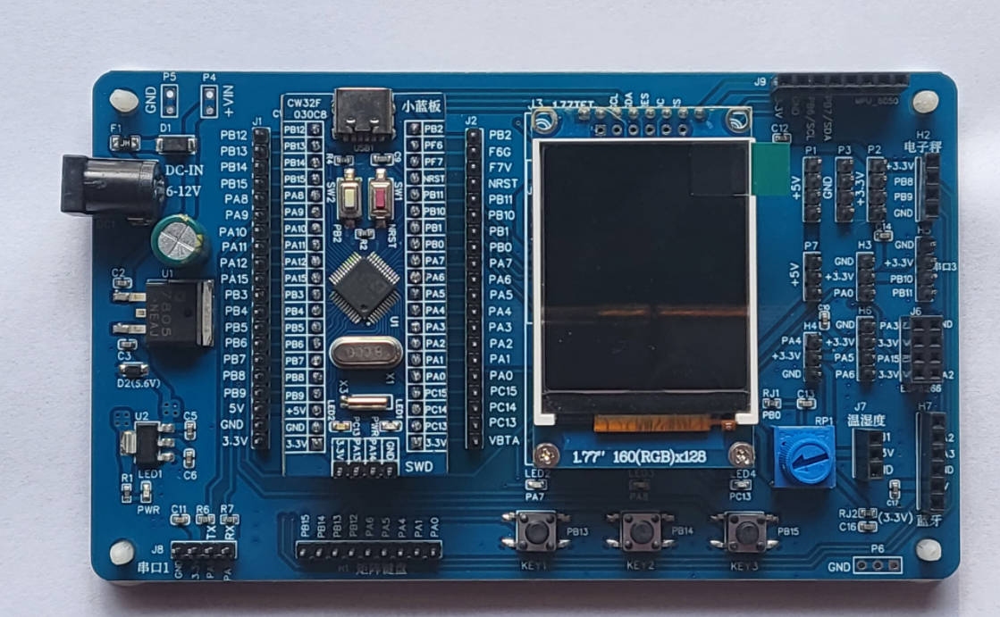
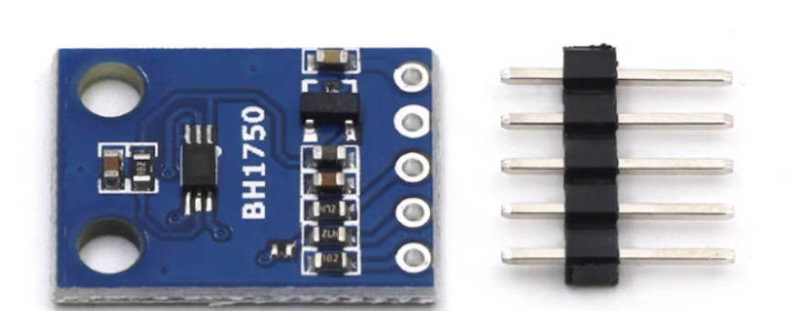
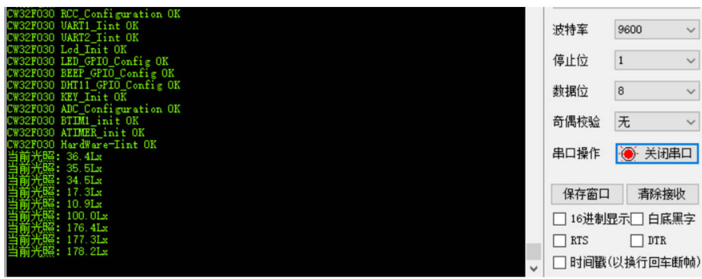

## 武汉芯源CW32F030开发板评测 05 BH1750光照强度传感器模块

### 硬件平台
1. CW32_48F大学计划板
2. CW32_IOT_EVA物联网开发评估套件
3. BH1750数字型光照强度传感器


### BH1750
​	 BH1750是一款数字型光照强度传感器，能够获取周围环境的光照强度。其测量范围在0~65535 lx。lx勒克斯，是光照强度的单位。BH1750可用于调节手机屏幕和键盘的背光功率，或者用于智能灯光控制，比如，随着外界光照强度的变化调节灯光亮度。



### BH1750特点

1. I2C总线接口
2. 接近视觉灵敏度的光谱灵敏度特性
3. 输出对应亮度的数字值
4. 高分辨率（0~65535 lx）
5. 通过降低功率功能,实现低电流化
6. 50Hz / 60Hz光噪声抑制功能
7. 可以选择两种类型的I2C从属地址
8. 最小误差变动在±20%
9. 受红外线影响很小

BH1750原理部分 博客参考
1.  BH1750( GY-302 )光照传感器 https://blog.csdn.net/Dustinthewine/article/details/127540711 
2. BH1750 光照传感器文档详解 及 驱动设计 https://juejin.cn/post/7157645672945025055 
### 代码移植 
#### bh1750.c
```c
#include "main.h"


/*
	应用说明：
	在访问I2C设备前，请先调用 i2c_CheckDevice() 检测I2C设备是否正常，该函数会配置GPIO
*/


/*
	应用说明：
	在访问I2C设备前，请先调用 i2c_CheckDevice() 检测I2C设备是否正常，该函数会配置GPIO
*/


static void I2C_BH1750_GPIOConfig(void);

//==================================================================================================
//  函数功能: IIC 外设驱动函数部分
//  函数标记: i2c_Delay
//  函数说明: I2C总线位延迟，最快400KHz
//			  形 参：无
//            返 回 值: 无
//-------------------------------------------------------------------------------------------------
//  |   -   |   -   |   0   |   1   |   2   |   3   |   4   |   5   |   6   |   7   |   8   |   9   
//==================================================================================================
static void i2c_Delay(void)
{
	uint8_t i;

	/*　
	 	下面的时间是通过逻辑分析仪测试得到的。
        工作条件：CPU主频72MHz ，MDK编译环境，1级优化
  
		循环次数为10时，SCL频率 = 205KHz 
		循环次数为7时，SCL频率 = 347KHz， SCL高电平时间1.5us，SCL低电平时间2.87us 
	 	循环次数为5时，SCL频率 = 421KHz， SCL高电平时间1.25us，SCL低电平时间2.375us 
	*/
	for (i = 0; i < 12; i++);
}
//==================================================================================================
//  函数功能: IIC 外设驱动函数部分
//  函数标记: i2c_Start
//  函数说明: CPU发起I2C总线启动信号
//			  形 参：无
//            返 回 值: 无
//-------------------------------------------------------------------------------------------------
//  |   -   |   -   |   0   |   1   |   2   |   3   |   4   |   5   |   6   |   7   |   8   |   9   
//==================================================================================================
void i2c_Start(void)
{
	/* 当SCL高电平时，SDA出现一个下跳沿表示I2C总线启动信号 */
	BH1750_I2C_SDA_1();
	BH1750_I2C_SCL_1();
	i2c_Delay();
	BH1750_I2C_SDA_0();
	i2c_Delay();
	BH1750_I2C_SCL_0();
	i2c_Delay();
}
//==================================================================================================
//  函数功能: IIC 外设驱动函数部分
//  函数标记: i2c_Stop
//  函数说明: CPU发起I2C总线停止信号
//			  形 参：无
//            返 回 值: 无
//-------------------------------------------------------------------------------------------------
//  |   -   |   -   |   0   |   1   |   2   |   3   |   4   |   5   |   6   |   7   |   8   |   9   
//==================================================================================================
void i2c_Stop(void)
{
	/* 当SCL高电平时，SDA出现一个上跳沿表示I2C总线停止信号 */
	BH1750_I2C_SDA_0();
	BH1750_I2C_SCL_1();
	i2c_Delay();
	BH1750_I2C_SDA_1();
}
//==================================================================================================
//  函数功能: IIC 外设驱动函数部分
//  函数标记: i2c_SendByte
//  函数说明: CPU发起I2C总线停止信号
//			  形    参：_ucByte ： 等待发送的字节
//            返 回 值: 无
//-------------------------------------------------------------------------------------------------
//  |   -   |   -   |   0   |   1   |   2   |   3   |   4   |   5   |   6   |   7   |   8   |   9   
//==================================================================================================
void i2c_SendByte(uint8_t _ucByte)
{
	uint8_t i;

	/* 先发送字节的高位bit7 */
	for (i = 0; i < 8; i++)
	{		
		if (_ucByte & 0x80)
		{
			BH1750_I2C_SDA_1();
		}
		else
		{
			BH1750_I2C_SDA_0();
		}
		i2c_Delay();
		BH1750_I2C_SCL_1();
		i2c_Delay();	
		BH1750_I2C_SCL_0();
		if (i == 7)
		{
			 BH1750_I2C_SDA_1(); // 释放总线
		}
		_ucByte <<= 1;	/* 左移一个bit */
		i2c_Delay();
	}
}
//==================================================================================================
//  函数功能: IIC 外设驱动函数部分
//  函数标记: i2c_ReadByte
//  函数说明: CPU从I2C总线设备读取8bit数据
//			  形    参：无
//            返 回 值: 读到的数据
//-------------------------------------------------------------------------------------------------
//  |   -   |   -   |   0   |   1   |   2   |   3   |   4   |   5   |   6   |   7   |   8   |   9   
//==================================================================================================
uint8_t i2c_ReadByte(void)
{
	uint8_t i;
	uint8_t value;

	/* 读到第1个bit为数据的bit7 */
	value = 0;
	for (i = 0; i < 8; i++)
	{
		value <<= 1;
		BH1750_I2C_SCL_1();
		i2c_Delay();
		if (BH1750_I2C_SDA_READ())
		{
			value++;
		}
		BH1750_I2C_SCL_0();
		i2c_Delay();
	}
	return value;
}
//==================================================================================================
//  函数功能: IIC 外设驱动函数部分
//  函数标记: i2c_WaitAck
//  函数说明: CPU产生一个时钟，并读取器件的ACK应答信号
//			  形    参：无
//            返 回 值: 返回0表示正确应答，1表示无器件响应
//-------------------------------------------------------------------------------------------------
//  |   -   |   -   |   0   |   1   |   2   |   3   |   4   |   5   |   6   |   7   |   8   |   9   
//==================================================================================================
uint8_t i2c_WaitAck(void)
{
	uint8_t re;

	BH1750_I2C_SDA_1();	/* CPU释放SDA总线 */
	i2c_Delay();
	BH1750_I2C_SCL_1();	/* CPU驱动SCL = 1, 此时器件会返回ACK应答 */
	i2c_Delay();
	if (BH1750_I2C_SDA_READ())	/* CPU读取SDA口线状态 */
		re = 1;
	else
		re = 0;
	BH1750_I2C_SCL_0();
	i2c_Delay();
	return re;
}

//==================================================================================================
//  函数功能: IIC 外设驱动函数部分
//  函数标记: i2c_Ack
//  函数说明: CPU产生一个ACK信号
//			  形    参：无
//            返 回 值: 无
//-------------------------------------------------------------------------------------------------
//  |   -   |   -   |   0   |   1   |   2   |   3   |   4   |   5   |   6   |   7   |   8   |   9   
//==================================================================================================
void i2c_Ack(void)
{
	BH1750_I2C_SDA_0();	/* CPU驱动SDA = 0 */
	i2c_Delay();
	BH1750_I2C_SCL_1();	/* CPU产生1个时钟 */
	i2c_Delay();
	BH1750_I2C_SCL_0();
	i2c_Delay();
	BH1750_I2C_SDA_1();	/* CPU释放SDA总线 */
}
//==================================================================================================
//  函数功能: IIC 外设驱动函数部分
//  函数标记: i2c_NAck
//  函数说明: CPU产生1个NACK信号
//			  形    参：无
//            返 回 值: 无
//-------------------------------------------------------------------------------------------------
//  |   -   |   -   |   0   |   1   |   2   |   3   |   4   |   5   |   6   |   7   |   8   |   9   
//==================================================================================================
void i2c_NAck(void)
{
	BH1750_I2C_SDA_1();	/* CPU驱动SDA = 1 */
	i2c_Delay();
	BH1750_I2C_SCL_1();	/* CPU产生1个时钟 */
	i2c_Delay();
	BH1750_I2C_SCL_0();
	i2c_Delay();	
}
/*
*********************************************************************************************************
*	函 数 名: I2C_BH1750_GPIOConfig
*	功能说明: 配置I2C总线的GPIO，采用模拟IO的方式实现
*	形    参：无
*	返 回 值: 无
*********************************************************************************************************
*/
static void I2C_BH1750_GPIOConfig(void)
{
	GPIO_InitTypeDef  GPIO_InitStructure; 
    __RCC_GPIOA_CLK_ENABLE();/* 打开GPIO时钟 */
    
    GPIO_InitStructure.Pins = BH1750_I2C_SCL_PIN|BH1750_I2C_SDA_PIN;	  
    GPIO_InitStructure.Mode = GPIO_MODE_OUTPUT_OD;/* 开漏输出 */
	GPIO_InitStructure.Speed = GPIO_SPEED_HIGH;        
 	GPIO_Init(BH1750_GPIO_PORT_I2C, &GPIO_InitStructure);
 	GPIO_SetBits(BH1750_GPIO_PORT_I2C,BH1750_I2C_SCL_PIN|BH1750_I2C_SDA_PIN);	

	/* 给一个停止信号, 复位I2C总线上的所有设备到待机模式 */
	i2c_Stop();
}

//==================================================================================================
//  函数功能: IIC 外设驱动函数部分
//  函数标记: i2c_ReadByte
//  函数说明: 检测I2C总线设备，CPU向发送设备地址，然后读取设备应答来判断该设备是否存在
//			  形    参：_Address：设备的I2C总线地址
//            返 回 值: 返回值 0 表示正确， 返回1表示未探测到
//-------------------------------------------------------------------------------------------------
//  |   -   |   -   |   0   |   1   |   2   |   3   |   4   |   5   |   6   |   7   |   8   |   9   
//==================================================================================================
uint8_t i2c_CheckDevice(uint8_t _Address)
{
	uint8_t ucAck;
	i2c_Start();		/* 发送启动信号 */
	/* 发送设备地址+读写控制bit（0 = w， 1 = r) bit7 先传 */
	i2c_SendByte(_Address | BH1750_I2C_WR);
	ucAck = i2c_WaitAck();	/* 检测设备的ACK应答 */

	i2c_Stop();			/* 发送停止信号 */

	return ucAck;
}
//==================================================================================================
//  函数功能: BH1750 外设驱动函数部分
//  函数标记: BH1750_Byte_Write
//  函数说明: BH1750写一个字节
//   		  返回值	成功：0		失败：非0 
//-------------------------------------------------------------------------------------------------
//  |   -   |   -   |   0   |   1   |   2   |   3   |   4   |   5   |   6   |   7   |   8   |   9   
//==================================================================================================
uint8_t BH1750_Byte_Write(uint8_t data)
{
	i2c_Start();
	//发送写地址
	i2c_SendByte(BH1750_Addr|0);
	if(i2c_WaitAck()==1)
		return 1;
	//发送控制命令
	i2c_SendByte(data);
	if(i2c_WaitAck()==1)
		return 2;
	i2c_Stop();
	return 0;
}
//==================================================================================================
//  函数功能: BH1750 外设驱动函数部分
//  函数标记: BH1750_Read_Measure
//  函数说明: BH1750读取测量数据
//            返回值 成功：返回光照强度 	失败：返回0
//-------------------------------------------------------------------------------------------------
//  |   -   |   -   |   0   |   1   |   2   |   3   |   4   |   5   |   6   |   7   |   8   |   9   
//==================================================================================================
uint16_t BH1750_Read_Measure(void)
{
	uint16_t receive_data=0; 
	i2c_Start();
	//发送读地址
	i2c_SendByte(BH1750_Addr|1);
	if(i2c_WaitAck()==1)
		return 0;
	//读取高八位
	receive_data=i2c_ReadByte();
	i2c_Ack();
	//读取低八位
	receive_data=(receive_data<<8)+i2c_ReadByte();
	i2c_NAck();
	i2c_Stop();
	return receive_data;	//返回读取到的数据
}

//==================================================================================================
//  函数功能: BH1750 外设驱动函数部分
//  函数标记: BH1750_Power_ON
//  函数说明: BH1750s上电
//-------------------------------------------------------------------------------------------------
//  |   -   |   -   |   0   |   1   |   2   |   3   |   4   |   5   |   6   |   7   |   8   |   9   
//==================================================================================================
void BH1750_Power_ON(void)
{
	BH1750_Byte_Write(POWER_ON);
}
//==================================================================================================
//  函数功能: BH1750 外设驱动函数部分
//  函数标记: BH1750_Power_OFF
//  函数说明: //BH1750s断电
//-------------------------------------------------------------------------------------------------
//  |   -   |   -   |   0   |   1   |   2   |   3   |   4   |   5   |   6   |   7   |   8   |   9   
//==================================================================================================
void BH1750_Power_OFF(void)
{
	BH1750_Byte_Write(POWER_OFF);
}
//==================================================================================================
//  函数功能: BH1750 外设驱动函数部分
//  函数标记: BH1750_RESET
//  函数说明: BH1750复位	仅在上电时有效
//-------------------------------------------------------------------------------------------------
//  |   -   |   -   |   0   |   1   |   2   |   3   |   4   |   5   |   6   |   7   |   8   |   9   
//==================================================================================================
void BH1750_RESET(void)
{
	BH1750_Byte_Write(MODULE_RESET);
}
//==================================================================================================
//  函数功能: BH1750 外设驱动函数部分
//  函数标记: BH1750_Init
//  函数说明: BH1750初始化
//-------------------------------------------------------------------------------------------------
//  |   -   |   -   |   0   |   1   |   2   |   3   |   4   |   5   |   6   |   7   |   8   |   9   
//==================================================================================================
//
void BH1750_Init(void)
{
	I2C_BH1750_GPIOConfig();		/* 配置GPIO */
	
	BH1750_Power_ON();	//BH1750s上电
	//BH1750_RESET();			//BH1750复位
	BH1750_Byte_Write(Measure_Mode);
	//SysTick_Delay_ms(120);
}
//==================================================================================================
//  函数功能: BH1750 外设驱动函数部分
//  函数标记: LIght_Intensity
//  函数说明: 获取光照强度
//-------------------------------------------------------------------------------------------------
//  |   -   |   -   |   0   |   1   |   2   |   3   |   4   |   5   |   6   |   7   |   8   |   9   
//==================================================================================================
float LIght_Intensity(void)
{
	return (float)(BH1750_Read_Measure()/1.1f*Resolurtion);
}
```
#### bh1750.h
```c
#ifndef __BH1750_H
#define __BH1750_H	 

#include "main.h"
 
//BH1750的地址
#define BH1750_Addr				0x46

//BH1750指令码
#define POWER_OFF		    0x00
#define POWER_ON			0x01
#define MODULE_RESET	    0x07
#define	CONTINUE_H_MODE		0x10
#define CONTINUE_H_MODE2	0x11
#define CONTINUE_L_MODE		0x13
#define ONE_TIME_H_MODE		0x20
#define ONE_TIME_H_MODE2	0x21
#define ONE_TIME_L_MODE		0x23

//测量模式
#define Measure_Mode			CONTINUE_H_MODE

//分辨率	光照强度（单位lx）=（High Byte  + Low Byte）/ 1.2 * 测量精度
#if ((Measure_Mode==CONTINUE_H_MODE2)|(Measure_Mode==ONE_TIME_H_MODE2))
	#define Resolurtion		0.5
#elif ((Measure_Mode==CONTINUE_H_MODE)|(Measure_Mode==ONE_TIME_H_MODE))
	#define Resolurtion		1
#elif ((Measure_Mode==CONTINUE_L_MODE)|(Measure_Mode==ONE_TIME_L_MODE))
	#define Resolurtion		4
#endif

#define BH1750_I2C_WR	0		/* 写控制bit */
#define BH1750_I2C_RD	1		/* 读控制bit */


/* 定义I2C总线连接的GPIO端口, 只需要修改下面4行代码即可任意改变SCL和SDA的引脚 */
#define BH1750_GPIO_PORT_I2C	CW_GPIOA			        /* GPIO端口 */
#define BH1750_I2C_SCL_PIN		GPIO_PIN_0			        /* 连接到SCL时钟线的GPIO */
#define BH1750_I2C_SDA_PIN		GPIO_PIN_1			        /* 连接到SDA数据线的GPIO */
/* 定义读写SCL和SDA的宏，已增加代码的可移植性和可阅读性 */
#define BH1750_I2C_SCL_1()      GPIO_SetBits(BH1750_GPIO_PORT_I2C, BH1750_I2C_SCL_PIN)		/* SCL = 1 */
#define BH1750_I2C_SCL_0()      GPIO_ResetBits(BH1750_GPIO_PORT_I2C, BH1750_I2C_SCL_PIN)	/* SCL = 0 */
#define BH1750_I2C_SDA_1()      GPIO_SetBits(BH1750_GPIO_PORT_I2C, BH1750_I2C_SDA_PIN)		/* SDA = 1 */
#define BH1750_I2C_SDA_0()      GPIO_ResetBits(BH1750_GPIO_PORT_I2C, BH1750_I2C_SDA_PIN)	/* SDA = 0 */
#define BH1750_I2C_SDA_READ()   GPIO_ReadPin(BH1750_GPIO_PORT_I2C, BH1750_I2C_SDA_PIN)	    /* 读SDA口线状态 */


void i2c_Start(void);
void i2c_Stop(void);
void i2c_SendByte(uint8_t _ucByte);
uint8_t i2c_ReadByte(void);
uint8_t i2c_WaitAck(void);
void i2c_Ack(void);
void i2c_NAck(void);
uint8_t i2c_CheckDevice(uint8_t _Address);

void BH1750_Init(void);			//未包含IIC初始化
float LIght_Intensity(void);	//读取光照强度的值
uint8_t BH1750_Byte_Write(uint8_t data);
uint16_t BH1750_Read_Measure(void);
void BH1750_Power_ON(void);
void BH1750_Power_OFF(void);
void BH1750_RESET(void); 				    
#endif

```
#### 测试

```c
//==================================================================================================
//  实现功能: 高级定时器
//  函数说明: ATIMER_init 
//  函数备注: 
//--------------------------------------------------------------------------------------------------
//  |   -   |   -   |   0   |   1   |   2   |   3   |   4   |   5   |   6   |   7   |   8   |   9   
//================================================================================================== 
void ATIMER_init(void)
{
	ATIM_InitTypeDef ATIM_InitStruct;
	__RCC_ATIM_CLK_ENABLE();   
    
    __disable_irq();
    NVIC_EnableIRQ(ATIM_IRQn);
    __enable_irq();

   ATIM_InitStruct.BufferState = ENABLE;                               //使能缓存寄存器   
   ATIM_InitStruct.ClockSelect = ATIM_CLOCK_PCLK;                      //选择PCLK时钟计数
   ATIM_InitStruct.CounterAlignedMode = ATIM_COUNT_MODE_EDGE_ALIGN;    //边沿对齐
   ATIM_InitStruct.CounterDirection = ATIM_COUNTING_UP;                //向上计数；
   ATIM_InitStruct.CounterOPMode = ATIM_OP_MODE_REPETITIVE;            //连续运行模式
   ATIM_InitStruct.OverFlowMask = DISABLE;                             //重复计数器上溢出不屏蔽
   ATIM_InitStruct.Prescaler = ATIM_Prescaler_DIV8;                    // 8分频,8MHZ
   ATIM_InitStruct.ReloadValue = 8000;                                 // 重载周期 1MS TIMER
   ATIM_InitStruct.RepetitionCounter = 0;                              // 重复周期0
   ATIM_InitStruct.UnderFlowMask = DISABLE;                            // 重复计数下溢出不屏蔽
   ATIM_Init(&ATIM_InitStruct);
   ATIM_ITConfig(ATIM_CR_IT_OVE, ENABLE);                              // 有重复计数器溢出产生进入中断
   ATIM_Cmd(ENABLE); 	 
    
}
//==================================================================================================
//  实现功能: 中断服务函数
//  函数说明: ATIM_IRQHandler 
//  函数备注: 
//--------------------------------------------------------------------------------------------------
//  |   -   |   -   |   0   |   1   |   2   |   3   |   4   |   5   |   6   |   7   |   8   |   9   
//================================================================================================== 
void ATIM_IRQHandler(void)
{
    static unsigned int atimer_count=0;
    if (ATIM_GetITStatus(ATIM_IT_OVF))
    {
        ATIM_ClearITPendingBit(ATIM_IT_OVF);
		atimer_count++;
		if(atimer_count>=1000)     //1S=1000ms
		{
            //printf("time_1s_flag OK\r\n");
            light = LIght_Intensity();
            printf("当前光照：%.1fLx\r\n",light);
            atimer_count=0; 
				
		}
  }
}
```
### 测试效果



