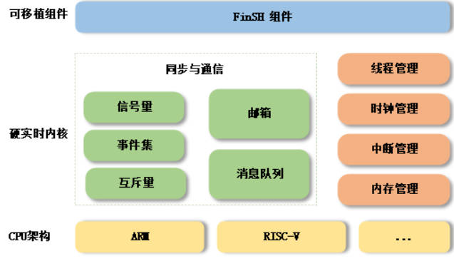
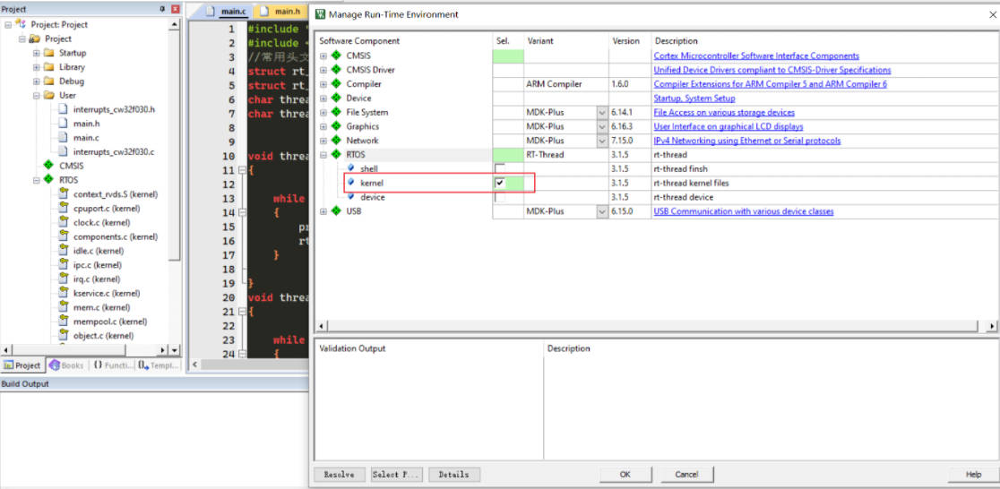
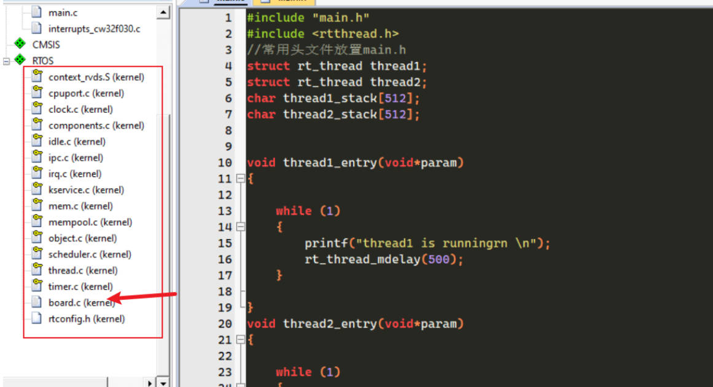
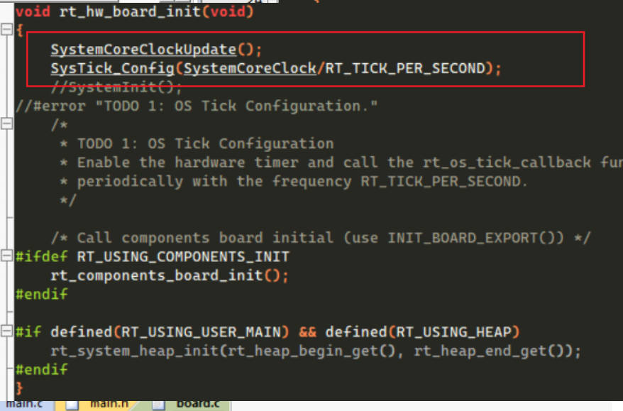
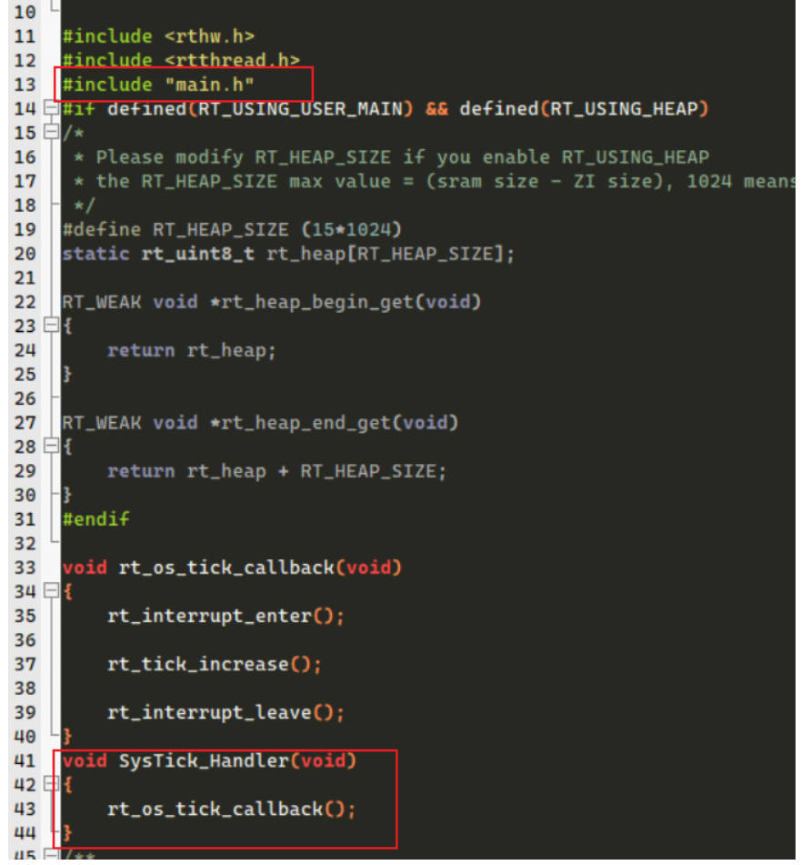
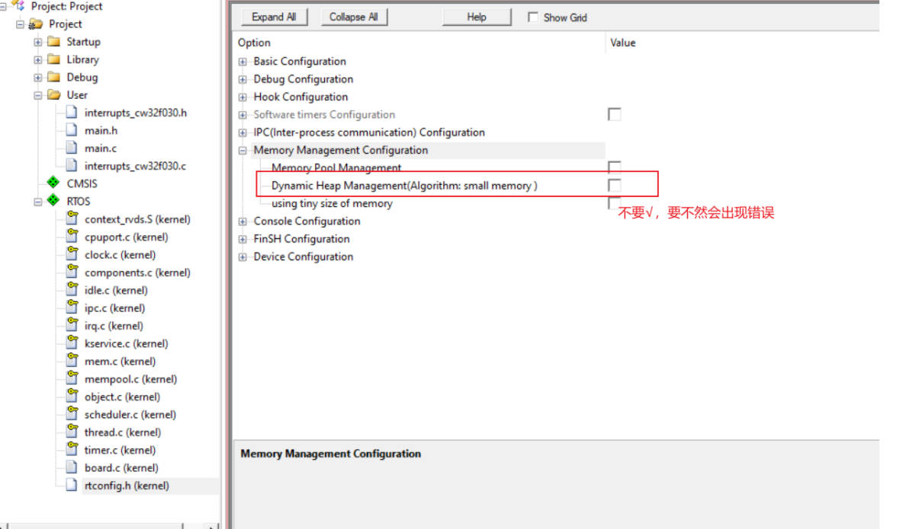
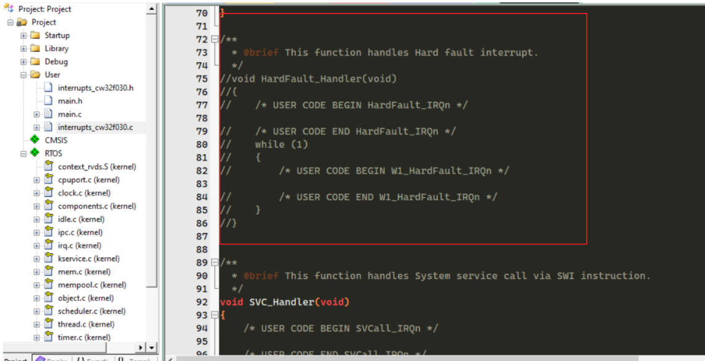
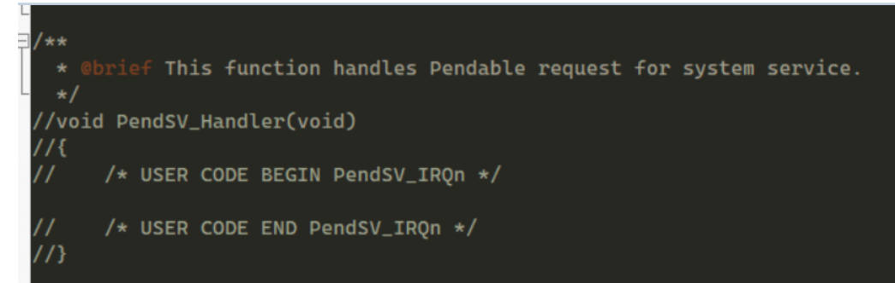
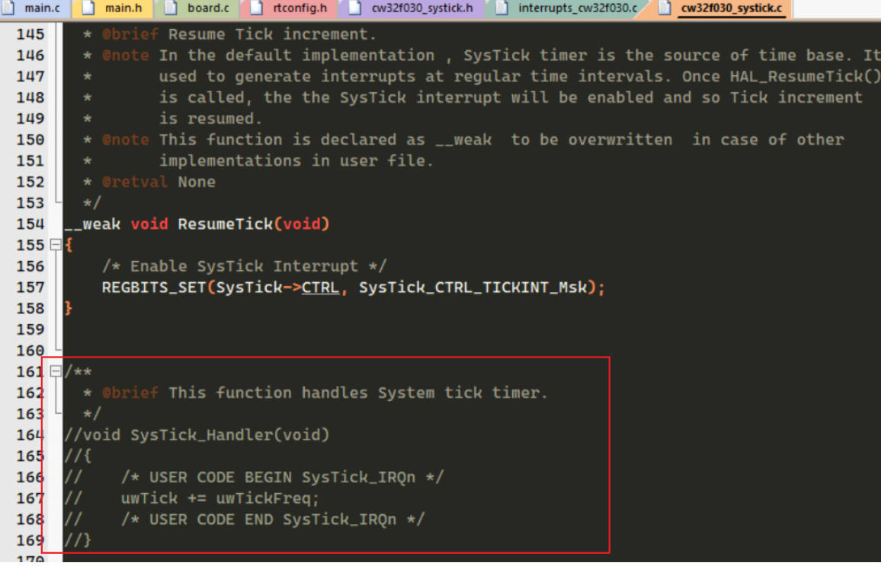
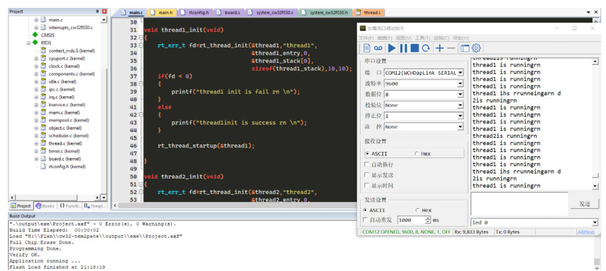

## 武汉芯源CW32F030开发板评测 06 RTOS移植 RT-Thread Nano
### 硬件平台
1. CW32_48F大学计划板
2. CW32_IOT_EVA物联网开发评估套件

### RT-Thread Nano

	RT-Thread Nano 是一个极简版的硬实时内核，它是由 C 语言开发，采用面向对象的编程思维，具有良好的代码风格，是一款可裁剪的、抢占式实时多任务的 RTOS。其内存资源占用极小，功能包括任务处理、软件定时器、信号量、邮箱和实时调度等相对完整的实时操作系统特性。适用于家电、消费电子、医疗设备、工控等领域大量使用的 32 位 ARM 入门级 MCU 的场合。

下图是 RT-Thread Nano 的软件框图，包含支持的 CPU 架构与内核源码，还有可拆卸的 FinSH 组件：


支持架构：ARM：Cortex M0/ M3/ M4/ M7 等、RISC-V 及其他。

功能：线程管理、线程间同步与通信、时钟管理、中断管理、内存管理。

### RT-Thread Nano的特点

1. 下载简单

	RT-Thread Nano 以软件包的方式集成在 Keil MDK 与 CubeMX 中，可		以直接在软件中下载 Nano 软件包获取源码，获取方式详见 基于 Keil MDK 移植 RT-Thread Nano 与 基于 CubeMX 移植 RT-Thread Nano 。同时也提供 下载 Nano 源码压缩包 的途径，方便在其他开发环境移植 RT-Thread Nano，如 基于 IAR 移植 RT-Thread Nano。

2. 代码简单
	与RT-Thread 完整版不同的是，Nano 不含 Scons 构建系统，不需要 Kconfig 以及 Env 配置工具，也去除了完整版特有的 device 框架和组件，仅是一个纯净的内核。
3. 移植简单
	由于 Nano 的极简特性，使 Nano 的移植过程变得极为简单。添加 Nano 源码到工程，就已完成 90% 的移植工作。
4. 使用简单
	RT-Thread Nano 在使用上也非常简单，带给开发者友好的开发体验。
5. 易裁剪：Nano 的配置文件为 rtconfig.h，该文件中列出了内核中的所有宏定义，有些默认没有打开，如需使用，打开即可。具体的配置可见 Nano 版块的 RT-Thread Nano 配置 教程。
6. 易添加 FinSH 组件：FinSH 组件 可以很方便的在 Nano 上进行移植，而不再依赖 device 框架，只需要对接两个必要的函数即可完成 FinSH 移植。
7. 资源占用小：对 RAM 与 ROM 的开销非常小，在支持 semaphore 和 mailbox 特性，并运行两个线程 (main 线程 + idle 线程) 情况下，ROM 和 RAM 依然保持着极小的尺寸，RAM 占用约 1K 左右，ROM 占用 4K 左右。
注：如果需要丰富的组件、驱动以及软件包等功能，则建议使用 RT-Thread 完整版。
### 移植过程
1. 打开一个支持串口printf打印的工程模板
2. 打开manage Run-Time Environment工具，选择RT-Thread，我们这里只选择kenel。

3. 打开RTOS目录下的board.c文件，添加main.h头文件的引用、添加系统心路中断函数、添加systick初始化。



4. 打开rtthconfig.h中内存管理的选项


5.  注释掉interrupts_cw32放0.c中HardFault_Handler、PendSV_Handler两个函数，避免出现得新定义的错误 


6. 注释掉cw32f030_systick.c中的SysTick_Handler函数，避免出现得新定义的错误 

7.  在main.c中添加rtthreah.h的头文件引用，再添回两个任务函数，并在主程序中启动

```c
#include "main.h"
#include <rtthread.h>
//常用头文件放置main.h
struct rt_thread thread1;
struct rt_thread thread2;
char thread1_stack[512];
char thread2_stack[512];


void thread1_entry(void*param)
{

    while (1)
    {
        printf("thread1 is runningrn \n");
        rt_thread_mdelay(500);
    }

}
void thread2_entry(void*param)
{

    while (1)
    {
        printf("thread2is runningrn \n");
        rt_thread_mdelay(3000);
    }

}

void thread1_init(void)
{
    rt_err_t fd=rt_thread_init(&thread1,"thread1",
                               &thread1_entry,0,
                               &thread1_stack[0],
                               sizeof(thread1_stack),10,10);
    if(fd < 0)   
    {
        printf("thread1 init is fail rn \n");  
    }
    else
    {
        printf("thread1init is success rn \n");
    }

    rt_thread_startup(&thread1);

}

void thread2_init(void)
{
    rt_err_t fd=rt_thread_init(&thread2,"thread2",
                               &thread2_entry,0,
                               &thread2_stack[0],
                               sizeof(thread2_stack),10,10);
    if(fd < 0)
    {
        printf("thread2 init is fail rn \n");  
    }
    else
    {
        printf("thread2init is success rn \n");
    }
    rt_thread_startup(&thread2);
}


int32_t main(void)
{
	RCC_Configuration(); //时钟配置64M,时钟配置以移动到systejm_cw32f030.h
	UART_Configuration();//printf函数初始化，函数主体在Debug.c，使用串口1，和大学板的LED3冲突。
    thread1_init();
    thread2_init();
    printf("cw32f030-rtthread init \n");
	while(1)
	{
	
	}
	
}
```
### 测试效果

移植可能还有问题，只是初步移植，目前能串口打印，但是我感觉串口打印有乱七八糟码，而且打印速度非常快，可能这个部分有问题，后面看看能否移植FinSH组件