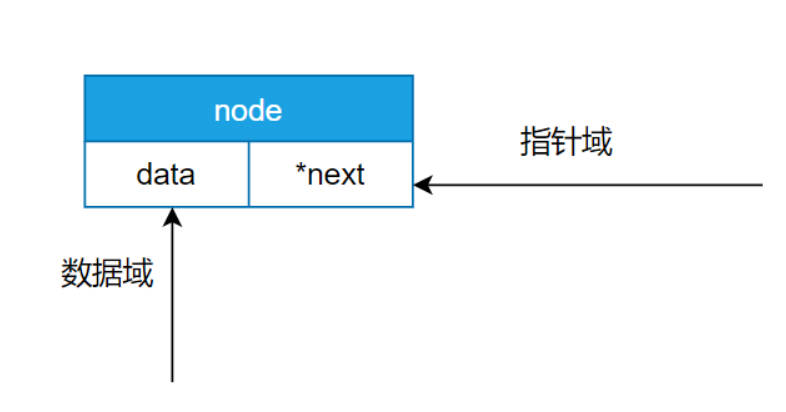

## FreeRTOS 列表 列表项(链表 节点)

#### 链表与数组区别


**链表是通过节点把离散的数据链接成一个表，通过对节点的插入和删除操作从而实现对数据的存取**。

**数组是通过开辟一段连续的内存来存储数据**，这是数组和链表最大的区别。

数组的每个成员对应链表的节点，成员和节点的数据类型可以是标准的C 类型或者是用户自定义的结构体。

数组有起始地址和结束地址，而链表是一个圈，没有头和尾之分，但是为了方便节点的插入和删除操作会人为的规定一个根节点(头节点)。

### FreeRTOS 列表与列表项 

list.c

```c
/*
 * FreeRTOS Kernel V10.5.1
 * Copyright (C) 2021 Amazon.com, Inc. or its affiliates.  All Rights Reserved.
 *
 * SPDX-License-Identifier: MIT
 *
 * Permission is hereby granted, free of charge, to any person obtaining a copy of
 * this software and associated documentation files (the "Software"), to deal in
 * the Software without restriction, including without limitation the rights to
 * use, copy, modify, merge, publish, distribute, sublicense, and/or sell copies of
 * the Software, and to permit persons to whom the Software is furnished to do so,
 * subject to the following conditions:
 *
 * The above copyright notice and this permission notice shall be included in all
 * copies or substantial portions of the Software.
 *
 * THE SOFTWARE IS PROVIDED "AS IS", WITHOUT WARRANTY OF ANY KIND, EXPRESS OR
 * IMPLIED, INCLUDING BUT NOT LIMITED TO THE WARRANTIES OF MERCHANTABILITY, FITNESS
 * FOR A PARTICULAR PURPOSE AND NONINFRINGEMENT. IN NO EVENT SHALL THE AUTHORS OR
 * COPYRIGHT HOLDERS BE LIABLE FOR ANY CLAIM, DAMAGES OR OTHER LIABILITY, WHETHER
 * IN AN ACTION OF CONTRACT, TORT OR OTHERWISE, ARISING FROM, OUT OF OR IN
 * CONNECTION WITH THE SOFTWARE OR THE USE OR OTHER DEALINGS IN THE SOFTWARE.
 *
 * https://www.FreeRTOS.org
 * https://github.com/FreeRTOS
 *
 */


#include <stdlib.h>

/* Defining MPU_WRAPPERS_INCLUDED_FROM_API_FILE prevents task.h from redefining
 * all the API functions to use the MPU wrappers.  That should only be done when
 * task.h is included from an application file. */
#define MPU_WRAPPERS_INCLUDED_FROM_API_FILE

#include "FreeRTOS.h"
#include "list.h"

/* Lint e9021, e961 and e750 are suppressed as a MISRA exception justified
 * because the MPU ports require MPU_WRAPPERS_INCLUDED_FROM_API_FILE to be
 * defined for the header files above, but not in this file, in order to
 * generate the correct privileged Vs unprivileged linkage and placement. */
#undef MPU_WRAPPERS_INCLUDED_FROM_API_FILE /*lint !e961 !e750 !e9021. */

/*-----------------------------------------------------------
* PUBLIC LIST API documented in list.h
*----------------------------------------------------------*/

void vListInitialise( List_t * const pxList )
{
    /* The list structure contains a list item which is used to mark the
     * end of the list.  To initialise the list the list end is inserted
     * as the only list entry. */
    pxList->pxIndex = ( ListItem_t * ) &( pxList->xListEnd ); /*lint !e826 !e740 !e9087 The mini list structure is used as the list end to save RAM.  This is checked and valid. */

    listSET_FIRST_LIST_ITEM_INTEGRITY_CHECK_VALUE( &( pxList->xListEnd ) );

    /* The list end value is the highest possible value in the list to
     * ensure it remains at the end of the list. */
    pxList->xListEnd.xItemValue = portMAX_DELAY;

    /* The list end next and previous pointers point to itself so we know
     * when the list is empty. */
    pxList->xListEnd.pxNext = ( ListItem_t * ) &( pxList->xListEnd );     /*lint !e826 !e740 !e9087 The mini list structure is used as the list end to save RAM.  This is checked and valid. */
    pxList->xListEnd.pxPrevious = ( ListItem_t * ) &( pxList->xListEnd ); /*lint !e826 !e740 !e9087 The mini list structure is used as the list end to save RAM.  This is checked and valid. */

    /* Initialize the remaining fields of xListEnd when it is a proper ListItem_t */
    #if ( configUSE_MINI_LIST_ITEM == 0 )
    {
        pxList->xListEnd.pvOwner = NULL;
        pxList->xListEnd.pxContainer = NULL;
        listSET_SECOND_LIST_ITEM_INTEGRITY_CHECK_VALUE( &( pxList->xListEnd ) );
    }
    #endif

    pxList->uxNumberOfItems = ( UBaseType_t ) 0U;

    /* Write known values into the list if
     * configUSE_LIST_DATA_INTEGRITY_CHECK_BYTES is set to 1. */
    listSET_LIST_INTEGRITY_CHECK_1_VALUE( pxList );
    listSET_LIST_INTEGRITY_CHECK_2_VALUE( pxList );
}
/*-----------------------------------------------------------*/

void vListInitialiseItem( ListItem_t * const pxItem )
{
    /* Make sure the list item is not recorded as being on a list. */
    pxItem->pxContainer = NULL;

    /* Write known values into the list item if
     * configUSE_LIST_DATA_INTEGRITY_CHECK_BYTES is set to 1. */
    listSET_FIRST_LIST_ITEM_INTEGRITY_CHECK_VALUE( pxItem );
    listSET_SECOND_LIST_ITEM_INTEGRITY_CHECK_VALUE( pxItem );
}
/*-----------------------------------------------------------*/

void vListInsertEnd( List_t * const pxList,
                     ListItem_t * const pxNewListItem )
{
    ListItem_t * const pxIndex = pxList->pxIndex;

    /* Only effective when configASSERT() is also defined, these tests may catch
     * the list data structures being overwritten in memory.  They will not catch
     * data errors caused by incorrect configuration or use of FreeRTOS. */
    listTEST_LIST_INTEGRITY( pxList );
    listTEST_LIST_ITEM_INTEGRITY( pxNewListItem );

    /* Insert a new list item into pxList, but rather than sort the list,
     * makes the new list item the last item to be removed by a call to
     * listGET_OWNER_OF_NEXT_ENTRY(). */
    pxNewListItem->pxNext = pxIndex;
    pxNewListItem->pxPrevious = pxIndex->pxPrevious;

    /* Only used during decision coverage testing. */
    mtCOVERAGE_TEST_DELAY();

    pxIndex->pxPrevious->pxNext = pxNewListItem;
    pxIndex->pxPrevious = pxNewListItem;

    /* Remember which list the item is in. */
    pxNewListItem->pxContainer = pxList;

    ( pxList->uxNumberOfItems )++;
}
/*-----------------------------------------------------------*/

void vListInsert( List_t * const pxList,
                  ListItem_t * const pxNewListItem )
{
    ListItem_t * pxIterator;
    const TickType_t xValueOfInsertion = pxNewListItem->xItemValue;

    /* Only effective when configASSERT() is also defined, these tests may catch
     * the list data structures being overwritten in memory.  They will not catch
     * data errors caused by incorrect configuration or use of FreeRTOS. */
    listTEST_LIST_INTEGRITY( pxList );
    listTEST_LIST_ITEM_INTEGRITY( pxNewListItem );

    /* Insert the new list item into the list, sorted in xItemValue order.
     *
     * If the list already contains a list item with the same item value then the
     * new list item should be placed after it.  This ensures that TCBs which are
     * stored in ready lists (all of which have the same xItemValue value) get a
     * share of the CPU.  However, if the xItemValue is the same as the back marker
     * the iteration loop below will not end.  Therefore the value is checked
     * first, and the algorithm slightly modified if necessary. */
    if( xValueOfInsertion == portMAX_DELAY )
    {
        pxIterator = pxList->xListEnd.pxPrevious;
    }
    else
    {
        /* *** NOTE ***********************************************************
        *  If you find your application is crashing here then likely causes are
        *  listed below.  In addition see https://www.FreeRTOS.org/FAQHelp.html for
        *  more tips, and ensure configASSERT() is defined!
        *  https://www.FreeRTOS.org/a00110.html#configASSERT
        *
        *   1) Stack overflow -
        *      see https://www.FreeRTOS.org/Stacks-and-stack-overflow-checking.html
        *   2) Incorrect interrupt priority assignment, especially on Cortex-M
        *      parts where numerically high priority values denote low actual
        *      interrupt priorities, which can seem counter intuitive.  See
        *      https://www.FreeRTOS.org/RTOS-Cortex-M3-M4.html and the definition
        *      of configMAX_SYSCALL_INTERRUPT_PRIORITY on
        *      https://www.FreeRTOS.org/a00110.html
        *   3) Calling an API function from within a critical section or when
        *      the scheduler is suspended, or calling an API function that does
        *      not end in "FromISR" from an interrupt.
        *   4) Using a queue or semaphore before it has been initialised or
        *      before the scheduler has been started (are interrupts firing
        *      before vTaskStartScheduler() has been called?).
        *   5) If the FreeRTOS port supports interrupt nesting then ensure that
        *      the priority of the tick interrupt is at or below
        *      configMAX_SYSCALL_INTERRUPT_PRIORITY.
        **********************************************************************/

        for( pxIterator = ( ListItem_t * ) &( pxList->xListEnd ); pxIterator->pxNext->xItemValue <= xValueOfInsertion; pxIterator = pxIterator->pxNext ) /*lint !e826 !e740 !e9087 The mini list structure is used as the list end to save RAM.  This is checked and valid. *//*lint !e440 The iterator moves to a different value, not xValueOfInsertion. */
        {
            /* There is nothing to do here, just iterating to the wanted
             * insertion position. */
        }
    }

    pxNewListItem->pxNext = pxIterator->pxNext;
    pxNewListItem->pxNext->pxPrevious = pxNewListItem;
    pxNewListItem->pxPrevious = pxIterator;
    pxIterator->pxNext = pxNewListItem;

    /* Remember which list the item is in.  This allows fast removal of the
     * item later. */
    pxNewListItem->pxContainer = pxList;

    ( pxList->uxNumberOfItems )++;
}
/*-----------------------------------------------------------*/

UBaseType_t uxListRemove( ListItem_t * const pxItemToRemove )
{
/* The list item knows which list it is in.  Obtain the list from the list
 * item. */
    List_t * const pxList = pxItemToRemove->pxContainer;

    pxItemToRemove->pxNext->pxPrevious = pxItemToRemove->pxPrevious;
    pxItemToRemove->pxPrevious->pxNext = pxItemToRemove->pxNext;

    /* Only used during decision coverage testing. */
    mtCOVERAGE_TEST_DELAY();

    /* Make sure the index is left pointing to a valid item. */
    if( pxList->pxIndex == pxItemToRemove )
    {
        pxList->pxIndex = pxItemToRemove->pxPrevious;
    }
    else
    {
        mtCOVERAGE_TEST_MARKER();
    }

    pxItemToRemove->pxContainer = NULL;
    ( pxList->uxNumberOfItems )--;

    return pxList->uxNumberOfItems;
}
/*-----------------------------------------------------------*/

/*
 * FreeRTOS Kernel V10.5.1
 * Copyright (C) 2021 Amazon.com, Inc. or its affiliates.  All Rights Reserved.
 *
 * SPDX-License-Identifier: MIT
 *
 * Permission is hereby granted, free of charge, to any person obtaining a copy of
 * this software and associated documentation files (the "Software"), to deal in
 * the Software without restriction, including without limitation the rights to
 * use, copy, modify, merge, publish, distribute, sublicense, and/or sell copies of
 * the Software, and to permit persons to whom the Software is furnished to do so,
 * subject to the following conditions:
 *
 * The above copyright notice and this permission notice shall be included in all
 * copies or substantial portions of the Software.
 *
 * THE SOFTWARE IS PROVIDED "AS IS", WITHOUT WARRANTY OF ANY KIND, EXPRESS OR
 * IMPLIED, INCLUDING BUT NOT LIMITED TO THE WARRANTIES OF MERCHANTABILITY, FITNESS
 * FOR A PARTICULAR PURPOSE AND NONINFRINGEMENT. IN NO EVENT SHALL THE AUTHORS OR
 * COPYRIGHT HOLDERS BE LIABLE FOR ANY CLAIM, DAMAGES OR OTHER LIABILITY, WHETHER
 * IN AN ACTION OF CONTRACT, TORT OR OTHERWISE, ARISING FROM, OUT OF OR IN
 * CONNECTION WITH THE SOFTWARE OR THE USE OR OTHER DEALINGS IN THE SOFTWARE.
 *
 * https://www.FreeRTOS.org
 * https://github.com/FreeRTOS
 *
 */

/*
 * This is the list implementation used by the scheduler.  While it is tailored
 * heavily for the schedulers needs, it is also available for use by
 * application code.
 *
 * list_ts can only store pointers to list_item_ts.  Each ListItem_t contains a
 * numeric value (xItemValue).  Most of the time the lists are sorted in
 * ascending item value order.
 *
 * Lists are created already containing one list item.  The value of this
 * item is the maximum possible that can be stored, it is therefore always at
 * the end of the list and acts as a marker.  The list member pxHead always
 * points to this marker - even though it is at the tail of the list.  This
 * is because the tail contains a wrap back pointer to the true head of
 * the list.
 *
 * In addition to it's value, each list item contains a pointer to the next
 * item in the list (pxNext), a pointer to the list it is in (pxContainer)
 * and a pointer to back to the object that contains it.  These later two
 * pointers are included for efficiency of list manipulation.  There is
 * effectively a two way link between the object containing the list item and
 * the list item itself.
 *
 *
 * \page ListIntroduction List Implementation
 * \ingroup FreeRTOSIntro
 */


#ifndef LIST_H
#define LIST_H

#ifndef INC_FREERTOS_H
    #error "FreeRTOS.h must be included before list.h"
#endif

/*
 * The list structure members are modified from within interrupts, and therefore
 * by rights should be declared volatile.  However, they are only modified in a
 * functionally atomic way (within critical sections of with the scheduler
 * suspended) and are either passed by reference into a function or indexed via
 * a volatile variable.  Therefore, in all use cases tested so far, the volatile
 * qualifier can be omitted in order to provide a moderate performance
 * improvement without adversely affecting functional behaviour.  The assembly
 * instructions generated by the IAR, ARM and GCC compilers when the respective
 * compiler's options were set for maximum optimisation has been inspected and
 * deemed to be as intended.  That said, as compiler technology advances, and
 * especially if aggressive cross module optimisation is used (a use case that
 * has not been exercised to any great extend) then it is feasible that the
 * volatile qualifier will be needed for correct optimisation.  It is expected
 * that a compiler removing essential code because, without the volatile
 * qualifier on the list structure members and with aggressive cross module
 * optimisation, the compiler deemed the code unnecessary will result in
 * complete and obvious failure of the scheduler.  If this is ever experienced
 * then the volatile qualifier can be inserted in the relevant places within the
 * list structures by simply defining configLIST_VOLATILE to volatile in
 * FreeRTOSConfig.h (as per the example at the bottom of this comment block).
 * If configLIST_VOLATILE is not defined then the preprocessor directives below
 * will simply #define configLIST_VOLATILE away completely.
 *
 * To use volatile list structure members then add the following line to
 * FreeRTOSConfig.h (without the quotes):
 * "#define configLIST_VOLATILE volatile"
 */
#ifndef configLIST_VOLATILE
    #define configLIST_VOLATILE
#endif /* configSUPPORT_CROSS_MODULE_OPTIMISATION */

/* *INDENT-OFF* */
#ifdef __cplusplus
    extern "C" {
#endif
/* *INDENT-ON* */

/* Macros that can be used to place known values within the list structures,
 * then check that the known values do not get corrupted during the execution of
 * the application.   These may catch the list data structures being overwritten in
 * memory.  They will not catch data errors caused by incorrect configuration or
 * use of FreeRTOS.*/
#if ( configUSE_LIST_DATA_INTEGRITY_CHECK_BYTES == 0 )
    /* Define the macros to do nothing. */
    #define listFIRST_LIST_ITEM_INTEGRITY_CHECK_VALUE
    #define listSECOND_LIST_ITEM_INTEGRITY_CHECK_VALUE
    #define listFIRST_LIST_INTEGRITY_CHECK_VALUE
    #define listSECOND_LIST_INTEGRITY_CHECK_VALUE
    #define listSET_FIRST_LIST_ITEM_INTEGRITY_CHECK_VALUE( pxItem )
    #define listSET_SECOND_LIST_ITEM_INTEGRITY_CHECK_VALUE( pxItem )
    #define listSET_LIST_INTEGRITY_CHECK_1_VALUE( pxList )
    #define listSET_LIST_INTEGRITY_CHECK_2_VALUE( pxList )
    #define listTEST_LIST_ITEM_INTEGRITY( pxItem )
    #define listTEST_LIST_INTEGRITY( pxList )
#else /* if ( configUSE_LIST_DATA_INTEGRITY_CHECK_BYTES == 0 ) */
    /* Define macros that add new members into the list structures. */
    #define listFIRST_LIST_ITEM_INTEGRITY_CHECK_VALUE     TickType_t xListItemIntegrityValue1;
    #define listSECOND_LIST_ITEM_INTEGRITY_CHECK_VALUE    TickType_t xListItemIntegrityValue2;
    #define listFIRST_LIST_INTEGRITY_CHECK_VALUE          TickType_t xListIntegrityValue1;
    #define listSECOND_LIST_INTEGRITY_CHECK_VALUE         TickType_t xListIntegrityValue2;

/* Define macros that set the new structure members to known values. */
    #define listSET_FIRST_LIST_ITEM_INTEGRITY_CHECK_VALUE( pxItem )     ( pxItem )->xListItemIntegrityValue1 = pdINTEGRITY_CHECK_VALUE
    #define listSET_SECOND_LIST_ITEM_INTEGRITY_CHECK_VALUE( pxItem )    ( pxItem )->xListItemIntegrityValue2 = pdINTEGRITY_CHECK_VALUE
    #define listSET_LIST_INTEGRITY_CHECK_1_VALUE( pxList )              ( pxList )->xListIntegrityValue1 = pdINTEGRITY_CHECK_VALUE
    #define listSET_LIST_INTEGRITY_CHECK_2_VALUE( pxList )              ( pxList )->xListIntegrityValue2 = pdINTEGRITY_CHECK_VALUE

/* Define macros that will assert if one of the structure members does not
 * contain its expected value. */
    #define listTEST_LIST_ITEM_INTEGRITY( pxItem )                      configASSERT( ( ( pxItem )->xListItemIntegrityValue1 == pdINTEGRITY_CHECK_VALUE ) && ( ( pxItem )->xListItemIntegrityValue2 == pdINTEGRITY_CHECK_VALUE ) )
    #define listTEST_LIST_INTEGRITY( pxList )                           configASSERT( ( ( pxList )->xListIntegrityValue1 == pdINTEGRITY_CHECK_VALUE ) && ( ( pxList )->xListIntegrityValue2 == pdINTEGRITY_CHECK_VALUE ) )
#endif /* configUSE_LIST_DATA_INTEGRITY_CHECK_BYTES */


/*
 * Definition of the only type of object that a list can contain.
 */
struct xLIST;
struct xLIST_ITEM
{
    listFIRST_LIST_ITEM_INTEGRITY_CHECK_VALUE           /*< Set to a known value if configUSE_LIST_DATA_INTEGRITY_CHECK_BYTES is set to 1. */
    configLIST_VOLATILE TickType_t xItemValue;          /*< The value being listed.  In most cases this is used to sort the list in ascending order. */
    struct xLIST_ITEM * configLIST_VOLATILE pxNext;     /*< Pointer to the next ListItem_t in the list. */
    struct xLIST_ITEM * configLIST_VOLATILE pxPrevious; /*< Pointer to the previous ListItem_t in the list. */
    void * pvOwner;                                     /*< Pointer to the object (normally a TCB) that contains the list item.  There is therefore a two way link between the object containing the list item and the list item itself. */
    struct xLIST * configLIST_VOLATILE pxContainer;     /*< Pointer to the list in which this list item is placed (if any). */
    listSECOND_LIST_ITEM_INTEGRITY_CHECK_VALUE          /*< Set to a known value if configUSE_LIST_DATA_INTEGRITY_CHECK_BYTES is set to 1. */
};
typedef struct xLIST_ITEM ListItem_t;                   /* For some reason lint wants this as two separate definitions. */

#if ( configUSE_MINI_LIST_ITEM == 1 )
    struct xMINI_LIST_ITEM
    {
        listFIRST_LIST_ITEM_INTEGRITY_CHECK_VALUE /*< Set to a known value if configUSE_LIST_DATA_INTEGRITY_CHECK_BYTES is set to 1. */
        configLIST_VOLATILE TickType_t xItemValue;
        struct xLIST_ITEM * configLIST_VOLATILE pxNext;
        struct xLIST_ITEM * configLIST_VOLATILE pxPrevious;
    };
    typedef struct xMINI_LIST_ITEM MiniListItem_t;
#else
    typedef struct xLIST_ITEM      MiniListItem_t;
#endif

/*
 * Definition of the type of queue used by the scheduler.
 */
typedef struct xLIST
{
    listFIRST_LIST_INTEGRITY_CHECK_VALUE      /*< Set to a known value if configUSE_LIST_DATA_INTEGRITY_CHECK_BYTES is set to 1. */
    volatile UBaseType_t uxNumberOfItems;
    ListItem_t * configLIST_VOLATILE pxIndex; /*< Used to walk through the list.  Points to the last item returned by a call to listGET_OWNER_OF_NEXT_ENTRY (). */
    MiniListItem_t xListEnd;                  /*< List item that contains the maximum possible item value meaning it is always at the end of the list and is therefore used as a marker. */
    listSECOND_LIST_INTEGRITY_CHECK_VALUE     /*< Set to a known value if configUSE_LIST_DATA_INTEGRITY_CHECK_BYTES is set to 1. */
} List_t;

/*
 * Access macro to set the owner of a list item.  The owner of a list item
 * is the object (usually a TCB) that contains the list item.
 *
 * \page listSET_LIST_ITEM_OWNER listSET_LIST_ITEM_OWNER
 * \ingroup LinkedList
 */
#define listSET_LIST_ITEM_OWNER( pxListItem, pxOwner )    ( ( pxListItem )->pvOwner = ( void * ) ( pxOwner ) )

/*
 * Access macro to get the owner of a list item.  The owner of a list item
 * is the object (usually a TCB) that contains the list item.
 *
 * \page listGET_LIST_ITEM_OWNER listSET_LIST_ITEM_OWNER
 * \ingroup LinkedList
 */
#define listGET_LIST_ITEM_OWNER( pxListItem )             ( ( pxListItem )->pvOwner )

/*
 * Access macro to set the value of the list item.  In most cases the value is
 * used to sort the list in ascending order.
 *
 * \page listSET_LIST_ITEM_VALUE listSET_LIST_ITEM_VALUE
 * \ingroup LinkedList
 */
#define listSET_LIST_ITEM_VALUE( pxListItem, xValue )     ( ( pxListItem )->xItemValue = ( xValue ) )

/*
 * Access macro to retrieve the value of the list item.  The value can
 * represent anything - for example the priority of a task, or the time at
 * which a task should be unblocked.
 *
 * \page listGET_LIST_ITEM_VALUE listGET_LIST_ITEM_VALUE
 * \ingroup LinkedList
 */
#define listGET_LIST_ITEM_VALUE( pxListItem )             ( ( pxListItem )->xItemValue )

/*
 * Access macro to retrieve the value of the list item at the head of a given
 * list.
 *
 * \page listGET_LIST_ITEM_VALUE listGET_LIST_ITEM_VALUE
 * \ingroup LinkedList
 */
#define listGET_ITEM_VALUE_OF_HEAD_ENTRY( pxList )        ( ( ( pxList )->xListEnd ).pxNext->xItemValue )

/*
 * Return the list item at the head of the list.
 *
 * \page listGET_HEAD_ENTRY listGET_HEAD_ENTRY
 * \ingroup LinkedList
 */
#define listGET_HEAD_ENTRY( pxList )                      ( ( ( pxList )->xListEnd ).pxNext )

/*
 * Return the next list item.
 *
 * \page listGET_NEXT listGET_NEXT
 * \ingroup LinkedList
 */
#define listGET_NEXT( pxListItem )                        ( ( pxListItem )->pxNext )

/*
 * Return the list item that marks the end of the list
 *
 * \page listGET_END_MARKER listGET_END_MARKER
 * \ingroup LinkedList
 */
#define listGET_END_MARKER( pxList )                      ( ( ListItem_t const * ) ( &( ( pxList )->xListEnd ) ) )

/*
 * Access macro to determine if a list contains any items.  The macro will
 * only have the value true if the list is empty.
 *
 * \page listLIST_IS_EMPTY listLIST_IS_EMPTY
 * \ingroup LinkedList
 */
#define listLIST_IS_EMPTY( pxList )                       ( ( ( pxList )->uxNumberOfItems == ( UBaseType_t ) 0 ) ? pdTRUE : pdFALSE )

/*
 * Access macro to return the number of items in the list.
 */
#define listCURRENT_LIST_LENGTH( pxList )                 ( ( pxList )->uxNumberOfItems )

/*
 * Access function to obtain the owner of the next entry in a list.
 *
 * The list member pxIndex is used to walk through a list.  Calling
 * listGET_OWNER_OF_NEXT_ENTRY increments pxIndex to the next item in the list
 * and returns that entry's pxOwner parameter.  Using multiple calls to this
 * function it is therefore possible to move through every item contained in
 * a list.
 *
 * The pxOwner parameter of a list item is a pointer to the object that owns
 * the list item.  In the scheduler this is normally a task control block.
 * The pxOwner parameter effectively creates a two way link between the list
 * item and its owner.
 *
 * @param pxTCB pxTCB is set to the address of the owner of the next list item.
 * @param pxList The list from which the next item owner is to be returned.
 *
 * \page listGET_OWNER_OF_NEXT_ENTRY listGET_OWNER_OF_NEXT_ENTRY
 * \ingroup LinkedList
 */
#define listGET_OWNER_OF_NEXT_ENTRY( pxTCB, pxList )                                           \
    {                                                                                          \
        List_t * const pxConstList = ( pxList );                                               \
        /* Increment the index to the next item and return the item, ensuring */               \
        /* we don't return the marker used at the end of the list.  */                         \
        ( pxConstList )->pxIndex = ( pxConstList )->pxIndex->pxNext;                           \
        if( ( void * ) ( pxConstList )->pxIndex == ( void * ) &( ( pxConstList )->xListEnd ) ) \
        {                                                                                      \
            ( pxConstList )->pxIndex = ( pxConstList )->pxIndex->pxNext;                       \
        }                                                                                      \
        ( pxTCB ) = ( pxConstList )->pxIndex->pvOwner;                                         \
    }

/*
 * Version of uxListRemove() that does not return a value.  Provided as a slight
 * optimisation for xTaskIncrementTick() by being inline.
 *
 * Remove an item from a list.  The list item has a pointer to the list that
 * it is in, so only the list item need be passed into the function.
 *
 * @param uxListRemove The item to be removed.  The item will remove itself from
 * the list pointed to by it's pxContainer parameter.
 *
 * @return The number of items that remain in the list after the list item has
 * been removed.
 *
 * \page listREMOVE_ITEM listREMOVE_ITEM
 * \ingroup LinkedList
 */
#define listREMOVE_ITEM( pxItemToRemove ) \
    {                                     \
        /* The list item knows which list it is in.  Obtain the list from the list \
         * item. */                                                              \
        List_t * const pxList = ( pxItemToRemove )->pxContainer;                 \
                                                                                 \
        ( pxItemToRemove )->pxNext->pxPrevious = ( pxItemToRemove )->pxPrevious; \
        ( pxItemToRemove )->pxPrevious->pxNext = ( pxItemToRemove )->pxNext;     \
        /* Make sure the index is left pointing to a valid item. */              \
        if( pxList->pxIndex == ( pxItemToRemove ) )                              \
        {                                                                        \
            pxList->pxIndex = ( pxItemToRemove )->pxPrevious;                    \
        }                                                                        \
                                                                                 \
        ( pxItemToRemove )->pxContainer = NULL;                                  \
        ( pxList->uxNumberOfItems )--;                                           \
    }

/*
 * Inline version of vListInsertEnd() to provide slight optimisation for
 * xTaskIncrementTick().
 *
 * Insert a list item into a list.  The item will be inserted in a position
 * such that it will be the last item within the list returned by multiple
 * calls to listGET_OWNER_OF_NEXT_ENTRY.
 *
 * The list member pxIndex is used to walk through a list.  Calling
 * listGET_OWNER_OF_NEXT_ENTRY increments pxIndex to the next item in the list.
 * Placing an item in a list using vListInsertEnd effectively places the item
 * in the list position pointed to by pxIndex.  This means that every other
 * item within the list will be returned by listGET_OWNER_OF_NEXT_ENTRY before
 * the pxIndex parameter again points to the item being inserted.
 *
 * @param pxList The list into which the item is to be inserted.
 *
 * @param pxNewListItem The list item to be inserted into the list.
 *
 * \page listINSERT_END listINSERT_END
 * \ingroup LinkedList
 */
#define listINSERT_END( pxList, pxNewListItem )           \
    {                                                     \
        ListItem_t * const pxIndex = ( pxList )->pxIndex; \
                                                          \
        /* Only effective when configASSERT() is also defined, these tests may catch \
         * the list data structures being overwritten in memory.  They will not catch \
         * data errors caused by incorrect configuration or use of FreeRTOS. */ \
        listTEST_LIST_INTEGRITY( ( pxList ) );                                  \
        listTEST_LIST_ITEM_INTEGRITY( ( pxNewListItem ) );                      \
                                                                                \
        /* Insert a new list item into ( pxList ), but rather than sort the list, \
         * makes the new list item the last item to be removed by a call to \
         * listGET_OWNER_OF_NEXT_ENTRY(). */                 \
        ( pxNewListItem )->pxNext = pxIndex;                 \
        ( pxNewListItem )->pxPrevious = pxIndex->pxPrevious; \
                                                             \
        pxIndex->pxPrevious->pxNext = ( pxNewListItem );     \
        pxIndex->pxPrevious = ( pxNewListItem );             \
                                                             \
        /* Remember which list the item is in. */            \
        ( pxNewListItem )->pxContainer = ( pxList );         \
                                                             \
        ( ( pxList )->uxNumberOfItems )++;                   \
    }

/*
 * Access function to obtain the owner of the first entry in a list.  Lists
 * are normally sorted in ascending item value order.
 *
 * This function returns the pxOwner member of the first item in the list.
 * The pxOwner parameter of a list item is a pointer to the object that owns
 * the list item.  In the scheduler this is normally a task control block.
 * The pxOwner parameter effectively creates a two way link between the list
 * item and its owner.
 *
 * @param pxList The list from which the owner of the head item is to be
 * returned.
 *
 * \page listGET_OWNER_OF_HEAD_ENTRY listGET_OWNER_OF_HEAD_ENTRY
 * \ingroup LinkedList
 */
#define listGET_OWNER_OF_HEAD_ENTRY( pxList )            ( ( &( ( pxList )->xListEnd ) )->pxNext->pvOwner )

/*
 * Check to see if a list item is within a list.  The list item maintains a
 * "container" pointer that points to the list it is in.  All this macro does
 * is check to see if the container and the list match.
 *
 * @param pxList The list we want to know if the list item is within.
 * @param pxListItem The list item we want to know if is in the list.
 * @return pdTRUE if the list item is in the list, otherwise pdFALSE.
 */
#define listIS_CONTAINED_WITHIN( pxList, pxListItem )    ( ( ( pxListItem )->pxContainer == ( pxList ) ) ? ( pdTRUE ) : ( pdFALSE ) )

/*
 * Return the list a list item is contained within (referenced from).
 *
 * @param pxListItem The list item being queried.
 * @return A pointer to the List_t object that references the pxListItem
 */
#define listLIST_ITEM_CONTAINER( pxListItem )            ( ( pxListItem )->pxContainer )

/*
 * This provides a crude means of knowing if a list has been initialised, as
 * pxList->xListEnd.xItemValue is set to portMAX_DELAY by the vListInitialise()
 * function.
 */
#define listLIST_IS_INITIALISED( pxList )                ( ( pxList )->xListEnd.xItemValue == portMAX_DELAY )

/*
 * Must be called before a list is used!  This initialises all the members
 * of the list structure and inserts the xListEnd item into the list as a
 * marker to the back of the list.
 *
 * @param pxList Pointer to the list being initialised.
 *
 * \page vListInitialise vListInitialise
 * \ingroup LinkedList
 */
void vListInitialise( List_t * const pxList ) PRIVILEGED_FUNCTION;

/*
 * Must be called before a list item is used.  This sets the list container to
 * null so the item does not think that it is already contained in a list.
 *
 * @param pxItem Pointer to the list item being initialised.
 *
 * \page vListInitialiseItem vListInitialiseItem
 * \ingroup LinkedList
 */
void vListInitialiseItem( ListItem_t * const pxItem ) PRIVILEGED_FUNCTION;

/*
 * Insert a list item into a list.  The item will be inserted into the list in
 * a position determined by its item value (ascending item value order).
 *
 * @param pxList The list into which the item is to be inserted.
 *
 * @param pxNewListItem The item that is to be placed in the list.
 *
 * \page vListInsert vListInsert
 * \ingroup LinkedList
 */
void vListInsert( List_t * const pxList,
                  ListItem_t * const pxNewListItem ) PRIVILEGED_FUNCTION;

/*
 * Insert a list item into a list.  The item will be inserted in a position
 * such that it will be the last item within the list returned by multiple
 * calls to listGET_OWNER_OF_NEXT_ENTRY.
 *
 * The list member pxIndex is used to walk through a list.  Calling
 * listGET_OWNER_OF_NEXT_ENTRY increments pxIndex to the next item in the list.
 * Placing an item in a list using vListInsertEnd effectively places the item
 * in the list position pointed to by pxIndex.  This means that every other
 * item within the list will be returned by listGET_OWNER_OF_NEXT_ENTRY before
 * the pxIndex parameter again points to the item being inserted.
 *
 * @param pxList The list into which the item is to be inserted.
 *
 * @param pxNewListItem The list item to be inserted into the list.
 *
 * \page vListInsertEnd vListInsertEnd
 * \ingroup LinkedList
 */
void vListInsertEnd( List_t * const pxList,
                     ListItem_t * const pxNewListItem ) PRIVILEGED_FUNCTION;

/*
 * Remove an item from a list.  The list item has a pointer to the list that
 * it is in, so only the list item need be passed into the function.
 *
 * @param uxListRemove The item to be removed.  The item will remove itself from
 * the list pointed to by it's pxContainer parameter.
 *
 * @return The number of items that remain in the list after the list item has
 * been removed.
 *
 * \page uxListRemove uxListRemove
 * \ingroup LinkedList
 */
UBaseType_t uxListRemove( ListItem_t * const pxItemToRemove ) PRIVILEGED_FUNCTION;

/* *INDENT-OFF* */
#ifdef __cplusplus
    }
#endif
/* *INDENT-ON* */

#endif /* ifndef LIST_H */

```


```c


//List_t 列表

typedef struct xLIST

{

  listFIRST_LIST_INTEGRITY_CHECK_VALUE    //校验值

  volatile UBaseType_t uxNumberOfItems;   // 列表中的列表项数量:用于记录列表中列表项的个数（不包含 xListEnd）

  ListItem_t * configLIST_VOLATILE pxIndex; // 用于遍历列表项的指针:用于指向列表中的某个列表项，一般用于遍历列表中的所有列表项 

  MiniListItem_t xListEnd;          // 末尾列表项:成员变量 xListEnd 是一个迷你列表项，排在最末尾 

  listSECOND_LIST_INTEGRITY_CHECK_VALUE   //< Set to a known value if configUSE_LIST_DATA_INTEGRITY_CHECK_BYTES is set to 1.

} List_t;


```

ListItem_t

```c
//ListItem_t 列表项

struct xLIST_ITEM
{
  listFIRST_LIST_ITEM_INTEGRITY_CHECK_VALUE      

  configLIST_VOLATILE TickType_t xItemValue;      		//列表项的值  

  struct xLIST_ITEM * configLIST_VOLATILE pxNext;   	//下一个列表项  

  struct xLIST_ITEM * configLIST_VOLATILE pxPrevious; 	//上一个列表项 

  void * pvOwner;                   					//列表项的拥有者 

  struct xLIST * configLIST_VOLATILE pxContainer;   	//列表项所在列表 

  listSECOND_LIST_ITEM_INTEGRITY_CHECK_VALUE      

};
```

1. vListInsert 列表的插入（本质上是双向链表的使用）

   按照 Item列表项 中的 xItemValue 排序插入，xItemValue 越大，越靠近 xListEnd

   ```c
   void vListInsert( List_t * const pxList, ListItem_t * const pxNewListItem ) 
   {   
       /*pxList 列表项要插入的列表 pxNewListItem 要插入的列表项*/
    	ListItem_t * pxIterator; /* 临时索引变量 */
   	const TickType_t  xValueOfInsertion  =  pxNewListItem->xItemValue; //获取插入的列表项值	
   	listTEST_LIST_INTEGRITY( pxList ); 							/* 检查参数是否正确 */
   	listTEST_LIST_ITEM_INTEGRITY( pxNewListItem ); 				/* 如果待插入列表项的值为最大值 */ 
   	 /*将新的列表项插入到列表，根据xItemValue的值升序插入列表。*/
      
       if( xValueOfInsertion == portMAX_DELAY ) //portMAX_DELAY列表项的值为最大值
    	{ 
            /* 如果列表项的值等于portMAX_DELAY，即列表项为最大值，则插入末尾 */
   		pxIterator = pxList->xListEnd.pxPrevious; 				/* 插入的位置为列表 xListEnd 前面 */ 
   	} 
       
       else  /*遍历列表中的列表项，找到插入的位置*/
   	{
   		for(  pxIterator = ( ListItem_t * ) &( pxList->xListEnd ); 	 
   		         pxIterator->pxNext->xItemValue <= xValueOfInsertion; 
   		         pxIterator = pxIterator->pxNext  )
            /*
            pxIterator = ( ListItem_t * ) &( pxList->xListEnd ); //
            */
           {
                /* There is nothing to do here, just iterating to the wanted insertion position. */
           }
   	} 
       /*待插入的列表项插入过程*/
   	pxNewListItem->pxNext = pxIterator->pxNext;			/* 将待插入的列表项插入指定位置 */ 
    	pxNewListItem->pxNext->pxPrevious = pxNewListItem; 
   	pxNewListItem->pxPrevious = pxIterator; 
   	pxIterator->pxNext = pxNewListItem; 
       /* Remember which list the item is in.  This allows fast removal of the item later. */
   	pxNewListItem->pxContainer = pxList; 				/* 更新待插入列表项所在列表 */ 
   	( pxList->uxNumberOfItems )++;						/* 更新列表中列表项的数量 */ 
   }
   ```

参考文章：FreeRTOS中列表和列表项插入函数分析（https://blog.csdn.net/qq_20222919/article/details/102936067）

### FreeRTOS 列表与列表项


假如现在的列表项如下:


此时我们要将 50 插入到列表中去


此时**pxNewListItem**指向的就是50这一项，**pxIterator**指向的就是40这一项。

由上面的for循环也可以看出
**pxIterator->pxNext->xItemValue <= xValueOfInsertion;**
列表中的值小于等于当要插入的值，插入点就继续指向下一个。

此时要插入的值是50，它会依次和列表中的值20、30、40、60比较，当比较到60时，插入点的值是60，大于要插入的值50，此时for循环退出，插入点指向40这一项。
此时列表的状态入下图所示


下来开始执行列表插入操作。

```c
   pxNewListItem->pxNext = pxIterator->pxNext;//50->next->60
```

将插入点指向的下一个列表项赋值给新插入列表项的下一项


此时列表项50的下一项指向了列表项60.

```c
pxNewListItem->pxNext->pxPrevious = pxNewListItem;//pxNewListItem->pxNext就是60 60->pre ->50
```

将新插入列表项的下一项的前一项设置为新插入列表项。


也就是说此时列表项60的上一个列表项指向了50。

```C
pxNewListItem->pxPrevious = pxIterator;
```

下来将新插入列表项的前一个列表项设置为插入点。


此时列表项50的前一项指向了40。

```c
 pxIterator->pxNext = pxNewListItem;
```

将新插入列表项指向插入点的下一项


此时列表项40的下一项是列表项50,列表项50的下一项是60。列表项60的前一项是列表项50，列表项50的前一项是列表项40。
**pxNewListItem->pvContainer = ( void \* ) pxList**：
插入后，列表项成员变量pvContainer记录此列表项属于哪个列表。
**pxList->uxNumberOfItems**：列表成员数量加1。
这样列表项50就成功的插入到列表中去了，插入的过程就是将插入点与后面的连接项断开，然后重新连接到新插入项上。在把新插入项和断开的连接项连接起来。

### C语言链表基础

Blog 参考 https://yufengbiji.com/posts/data-structures-02

1. 链表的创建

   定义表示节点的结构体

   ```c
   struct node {
       /* 后继节点 */
       struct node *next;
       /* 值 */
       int data;
   };
   
   ////定义结点结构体
   typedef struct node
   {
       /* data:数据域*/
       int num;
       int score;
       char name[20];
       /* point:指针域 指针需要指向的地址 后继节点*/  
       struct node *next;
   } Node;
   ```

   在后面的代码书写中, `Node`就等价于`struct node`了。 比如我们使用这个结构体创建一个新的节点， `Node *new_node`就等价于`struct node *new_node`。

   单链表的节点

    

​	单链表的表示

​			单链表是线性表的**链式**表示和实现。把节点链接起来，就形成了单链表。

 

​	单链表的创建

```c
list * create_list()
{
    /* 创建一个新的节点，由于使用了typedef关键字，此处 node *head与struct node *head等价    */
    list *head = (list *)malloc(sizeof(list));
    if(head==NULL) return NULL;
    /* 初始化节点 */
    head->data = 0; // 头结点数据域，我们用来表示链表长度
    head->next = NULL; 
    return head;
}
```

 

此函数会创建一个单链表，并返回头指针。 头指针是指向头结点地址的指针，和节点中指向下一个节点的指针是相同类型。
首先，我们用`malloc`函数开辟了一块`list`大小的内存，并返回了指向该内存块首地址的指针，同时将此指针赋值给头指针变量。
接着，判断此指针是否为空，为空，则说明内存申请失败（一般不会）。
然后，对该节点进行初始化。
最后，函数返回头指针，结束。

**为什么设置头节点？**
头节点的数据域一般无意义，这里为了方便后面的插入和删除操作而设置，头节点并非链表所必须。
头节点后面的第一个元素节点，称为首元节点

```c
// 链表的创建
void link_creat_head(Node ** p_head,Node *p_new)
{
    Node *p_mov  = *p_head; //当第一次加入链表为空时，head执行p_new
    if (*p_head == NULL)
    {
        *p_head = p_new;
         p_new->next = NULL;
    } 
    else //第二次及以后加入链表
    {
        while (p_mov->next!=NULL) //找到原有链表的最后一个节点
        {
            p_mov = p_mov->next;
        }

        p_mov->next = p_new; //将新申请的节点加入链表
        p_new->next = NULL;        
    }
    
}
```

```c
//链表的遍历
void link_print(Node *head)
{
    Node *p_mov;    //定义新的指针保存链表的首地址，防止使用head改变原本链表
    p_mov = head;   //当指针保存最后一个结点的指针域为NULL时，循环结束
    while(p_mov!=NULL)
    {
        //先打印当前指针保存结点的指针域
        printf("num=%d score=%d name:%s\n",p_mov->num,\
               p_mov->score,p_mov->name);
        //指针后移，保存下一个结点的地址
        p_mov = p_mov->next;
    }
}

```

```c
//链表的释放
void link_free(Node **p_head)
{
    //定义一个指针变量保存头结点的地址
    Node *pb=*p_head;
    while(*p_head!=NULL)
    {
        //先保存p_head指向的结点的地址
        pb=*p_head;
        //p_head保存下一个结点地址
        *p_head=(*p_head)->next;
        //释放结点并防止野指针
        free(pb);
        pb = NULL;
    }
}
```


2. 单链表基本操作

   2.1 单链表的插入

    

   2.2 单链表的删除

    

   2.3 单链表的查找

   先对比第一个结点的数据域是否是想要的数据，如果是就直接返回，如果不是则继续查找下 一个结点，如果到达最后一个结点的时候都没有匹配的数据，说明要查找数据不存在

   .....

```c
//链表的查找
//按照num查找
Node * link_search_num(Node *head,int num)
{
    Node *p_mov;
    //定义的指针变量保存第一个结点的地址
    p_mov=head;
    //当没有到达最后一个结点的指针域时循环继续
    while(p_mov!=NULL)
    {
        //如果找到是当前结点的数据，则返回当前结点的地址
        if(p_mov->num == num)//找到了
        {
            return p_mov;
        }
        //如果没有找到，则继续对比下一个结点的指针域
        p_mov=p_mov->next;
    }

    //当循环结束的时候还没有找到，说明要查找的数据不存在，返回NULL进行标识
    return NULL;//没有找到
}
//按照name查找
Node * link_search_name(Node *head,char *name)
{
    Node *p_mov;
    p_mov=head;
    while(p_mov!=NULL)
    {
        if(strcmp(p_mov->name,name)==0)//找到了
        {
            return p_mov;
        }
        p_mov=p_mov->next;
    }
    return NULL;//没有找到
}
```

```c
//链表的插入：按照num的顺序插入
void link_insert_num(Node **p_head,Node *p_new)
{
    Node *pb,*pf;
    pb=pf=*p_head;
    if(*p_head ==NULL)// 链表为空链表
    {
        *p_head = p_new;
        p_new->next=NULL;
        return ;
    }
    while((p_new->num >= pb->num)  && (pb->next !=NULL) )
    {
        pf=pb;
        pb=pb->next;
    }

    if(p_new->num < pb->num)//找到一个节点的num比新来的节点num大，插在pb的前面
    {
        if(pb== *p_head)//找到的节点是头节点，插在最前面
        {
            p_new->next= *p_head;
            *p_head =p_new;
        }
        else
        {
            pf->next=p_new;
            p_new->next = pb;
        }
    }
    else//没有找到pb的num比p_new->num大的节点，插在最后
    {
        pb->next =p_new;
        p_new->next =NULL;
    }
}


```

```c
//链表的排序
void link_order(Node *head)
{
    Node *pb,*pf,temp;
    pf=head;

    if(head==NULL)
    {
        printf("The list is empty and does not need to be sorted\n");
        return ;
    }

    if(head->next ==NULL)
    {
        printf("Only one node, no sorting\n");
        return ;
    }
    while(pf->next !=NULL)  //以pf指向的节点为基准节点，
    {
        pb=pf->next ;       //pb从基准元素的下个元素开始
        while(pb!=NULL)
        {
            if(pf->num > pb->num) //判断num的大小去排序
            {
                temp=*pb;
                *pb=*pf;
                *pf=temp;

                temp.next=pb->next;
                pb->next=pf->next;
                pf->next=temp.next;
            }
            pb=pb->next;
        }
        pf=pf->next;
    }
}

```

```c
//链表结点的删除
void link_delete_num(Node **p_head,int num)
{
    Node *pb,*pf;
    pb=pf=*p_head;
    if(*p_head == NULL)//链表为空，不用删
    {
        printf("The list is empty and there are no nodes to delete");\
        return ;
    }
    while(pb->num != num && pb->next !=NULL)//循环找，要删除的节点
    {
        pf=pb;
        pb=pb->next;
    }
    if(pb->num == num)//找到了一个节点的num和num相同
    {
        if(pb == *p_head)//要删除的节点是头节点
        {
            *p_head = pb->next;//让保存头结点的指针保存后一个结点的地址
        }
        else
        {
            pf->next = pb->next;//前一个结点的指针域保存要删除的后一个结点的地址
        }
        //释放空间
        free(pb);
        pb = NULL;
    }
    else//没有找到
    {
        printf("There are no nodes to delete\n");
    }
}
```

3. 代码测试

```c
int main()
{
    Node *head = NULL, *p_new =NULL;
    int  num,i;

    printf("Please enter the initial number of linked list:\n");
    scanf("%d",&num);
    for (i = 0;i<num;i++)
    {
        p_new = (Node*) malloc(sizeof(Node));
        printf("Iint num,socre,name \n");

        scanf("%d %d %s",&p_new->num,&p_new->score,&p_new->name);

        link_creat_head(&head,p_new);
    }
    link_print(head);

    #if 0
    Node *pb;
    while(1)
    {
        printf("Please enter the number you are looking for \n");
        scanf("%d",&num);
        pb=link_search_num(head,num);
        if(pb!=NULL)//找到了
        {
            printf("Found it. num=%d score=%d name:%s\n",pb->num,pb->score,pb->name);
        }
        else
        {
            printf("The node you were looking for was not found \n");
        }
    }
    #endif

    #if 0
    char name[32] = "";
    Node *pb;
    while(1)
    {
        printf("Please enter the name you are looking for\n");
        scanf("%s",name);
        pb=link_search_name(head,name);
        if(pb!=NULL)//找到了
        {
            printf("Found it. num=%d score=%d name:%s\n",pb->num,pb->score,pb->name);
        }
        else
        {
            printf("The node you were looking for was not found\n");
        }
    }
    #endif
    #if 0
    printf("Enter the number of the node you want to delete\n");
    scanf("%d",&num);
    link_delete_num(&head,num);

    link_print(head);
    #endif
    #if 0
    while(1)
    {
        printf("Enter the num-score-name of the node you want to insert\n");
        p_new=(Node*)malloc(sizeof(Node));//申请一个新节点
        scanf("%d %d %s",&p_new->num,&p_new->score,p_new->name);
        link_insert_num(&head,p_new);
        link_print(head);
    }
    #endif

    #if 0
    printf("***************************\n");
    link_order(head);
    link_print(head);
    #endif
    
    
    link_free(&head);
    return 0;
}
```

  

  

  

  

  
