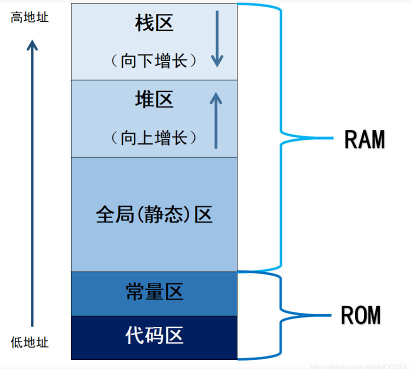
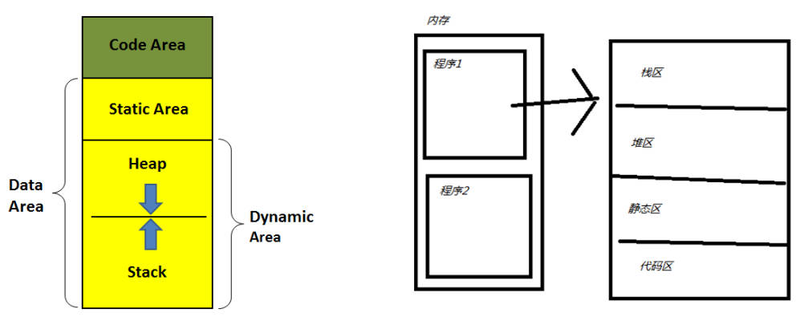
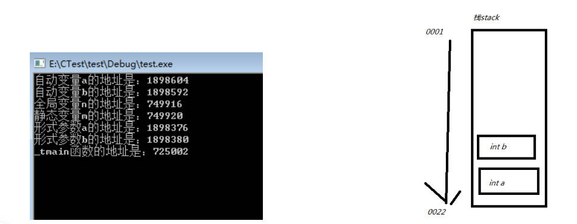
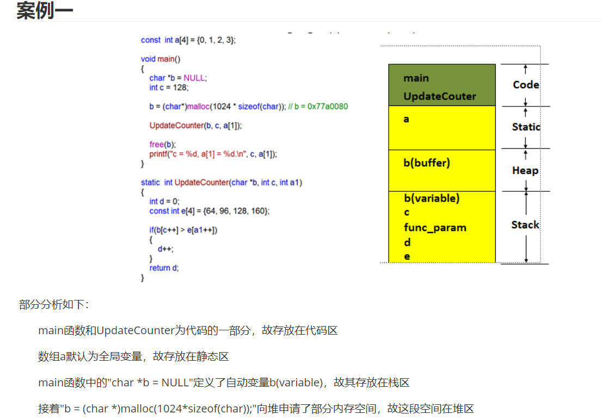
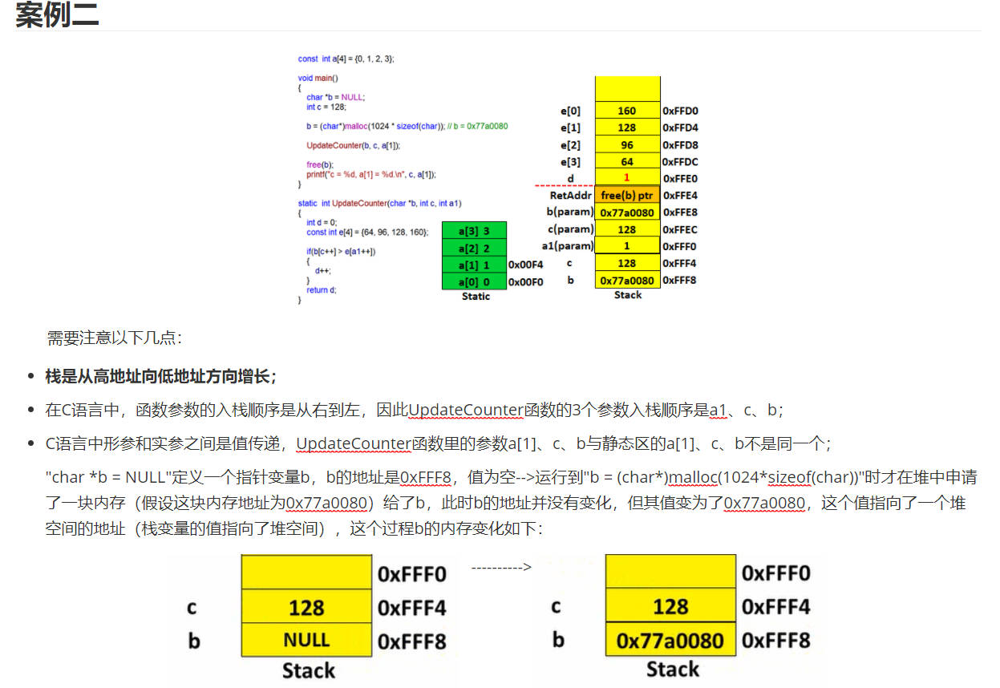
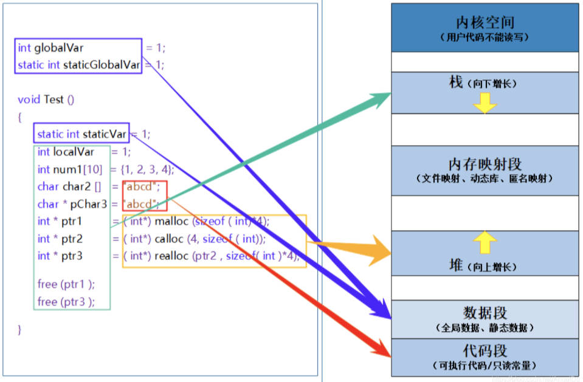

### RTOS内核 内存管理

C 语言的内存管理，分成两部分。一部分是系统管理的，另一部分是用户手动管理的。

**系统管理的内存，主要是函数内部的变量（局部变量）。**这部分变量在函数运行时进入内存，函数运行结束后自动从内存卸载。这些变量存放的区域称为”栈“（stack），**”栈“所在的内存是系统自动管理的**。

**用户手动管理的内存，主要是程序运行的整个过程中都存在的变量（全局变量），这些变量需要用户手动从内存释放。**如果使用后忘记释放，它就一直占用内存，直到程序退出，这种情况称为”内存泄漏“（memory leak）。这些变量所在的内存称为”堆“（heap），**”堆“所在的内存是用户手动管理的。**



1. 内存管理

   在C语言中，关于内存管理的知识点比较多，如函数、变量、作用域、指针等，在探究C语言内存管理机制时，先简单复习下这几个基本概念：

   1. 变量

      全局变量（外部变量）：出现在代码块{}之外的变量就是全局变量。

      局部变量（自动变量）：一般情况下，代码块{}内部定义的变量就是自动变量，也可使用auto显示定义。

      静态变量：是**指内存位置在程序执行期间一直不改变的变量，用关键字static修饰。代码块内部的静态变量只能被这个代码块内部访问，代码块外部的静态变量只能被定义这个变量的文件访问。**

   注意：extern修饰变量时，根据具体情况，既可以看作是定义也可以看作是声明；但extern修饰函数时只能是定义，没有二义性。

   2. 作用域

      通常指的是变量的作用域，广义上讲，也有函数作用域及文件作用域等。作用域就是指某个事物能够存在的区域或范围。

   3. 函数

      注意：**C语言中函数默认都是全局的，可以使用static关键字将函数声明为静态函数**（只能被定义这个函数的文件访问的函数）.

2. 内存四区

   

   **静态区，代码区，堆区，栈区 存储地址依次下降**。

   栈和堆的生长方向：

   栈：从大(地址)到小(地址)；

   堆：从小(地址)到大(地址)；

   1. 栈区

      **局部变量放在栈区**，**由编译器自动分配释放** ，**存放函数的参数值，局部变量的值等**。其操作方式类似于数据结构中的栈。
      **栈的分配时由高位地址向低位地址**。且注意，函数参数的载入时由右到左。

      ```c
      //实验一：观察代码区、静态区、栈区的内存地址
      #include "stdafx.h"
      int n = 0;
      void test(int a, int b)
      {
      	printf("形式参数a的地址是：%d\n形式参数b的地址是：%d\n",&a, &b);
      }
      int _tmain(int argc, _TCHAR* argv[])
      {
          static int m = 0;
          int a = 0;
          int b = 0;
          printf("自动变量a的地址是：%d\n自动变量b的地址是：%d\n", &a, &b);
          printf("全局变量n的地址是：%d\n静态变量m的地址是：%d\n", &n, &m);
          test(a, b);
          printf("_tmain函数的地址是：%d", &_tmain);
          getchar();
      }
      ```

      

      结果分析：自动变量a和b依次被定义和赋值，都在栈区存放，内存地址只相差12，**需要注意的是a的地址比b要大，这是因为栈是一种先进后出的数据存储结构，先存放的a,后存放的b,形象化表示如上图（注意地址编号顺序）**。**一旦超出作用域，那么变量b将先于变量a被销毁**。最先放的最后才能被拿出，最后放的最先被拿出。

      ```c
      //实验二：栈变量与作用域
      #include "stdafx.h"
      //函数的返回值是一个指针，尽管这样可以运行程序，但这样做是不合法的，因为
      //非要这样做需在x变量前加static关键字修饰，即static int a = 0;
      int *getx()
      {
          int x = 10;
          return &x;
      }
      
      int _tmain(int argc, _TCHAR* argv[])
      {
          int *p = getx();
          *p = 20;
          printf("%d", *p);
          getchar();
      }
      ```

      这段代码没有任何语法错误，也能得到预期的结果：20。但是这么写是有问题的：

      因为**int p = getx()中变量x的作用域为getx()函数体内部，这里得到一个临时栈变量x的地址，getx()函数调用结束后这个地址就无效了，**但是后面的p = 20仍然在对其进行访问并修改，结果可能对也可能错，实际工作中应避免这种做法，不然怎么死的都不知道。**不能将一个栈变量的地址通过函数的返回值返回，切记！**

      **在C语言中，子函数（或称为函数）调用完成后，该函数内的局部变量（包括自动存储期（auto）变量和临时变量）的存储空间会被释放或回收，这意味着这些变量的地址在函数返回后变得无效。尝试访问这些无效地址可能导致未定义行为，包括但不限于程序崩溃、数据损坏或不可预测的结果。**

      另外，栈不会很大，一般都是以K为单位。**如果在程序中直接将较大的数组保存在函数内的栈变量中，很可能会内存溢出，导致程序崩溃，严格来说应该叫栈溢出（当栈空间以满，但还往栈内存压变量，这个就叫栈溢出）。**

      ```c
      #include <stdio.h>
      
      // 定义一个函数  
      void printMessage() {
      	printf("Hello, World!\n");
      }
      
      // 另一个函数，它尝试返回一个局部变量的地址  
      int *dangerousFunction() {
      	int localVariable = 10; // 局部变量  
      	return &localVariable; // 返回局部变量的地址，这是危险的！  
      }
      
      int main() {
      	// 通过函数指针调用函数  
      	void(*functionPtr)() = printMessage;
      	functionPtr(); // 正确调用  
      
      	// 尝试使用dangerousFunction返回的局部变量地址  
      	int *ptr = dangerousFunction();
      	if (ptr != NULL) {
      		printf("Value at address: %d\n", *ptr); // 这可能显示10，但行为未定义  
      	}
      
      	// 尝试再次调用可能已释放的局部变量的地址（不推荐，可能导致崩溃）  
      	// 注意：这里不执行以演示安全原则  
      
      	return 0;
      }
      ```

   2. 堆区

      堆（heap）和栈一样，也是一种在程序运行过程中可以随时修改的内存区域，但没有栈那样先进后出的顺序。更重要的是堆是一个大容器，它的容量要远远大于栈，这可以解决内存溢出问题。**一般比较复杂的数据类型都是放在堆中。**但是在C语言中，**堆内存空间的申请和释放需要手动通过代码来完成。**

      malloc的变量放在堆区,**堆区一般由程序员分配释放， 若程序员不释放，程序结束时可能由OS回收** 。注意它与数据结构中的堆是两回事，分配方式倒是类似于链表。**堆的增长方式由低地址向高地址**。

      ```c
      #include <stdio.h>  
      #include <stdlib.h> // 包含malloc和free的头文件  
        
      // 函数原型声明  
      int* createIntArray(int size);  
        
      int main() {  
          // 假设我们想创建一个包含5个整数的数组  
          int size = 5;  
          int *arrayPtr = createIntArray(size);  
        
          // 检查malloc是否成功分配了内存  
          if (arrayPtr == NULL) 
          {  
              printf("Memory allocation failed!\n");  
              return 1; // 返回一个错误码  
          }  
        
          // 使用数组  
          for (int i = 0; i < size; i++) 
          {  
              arrayPtr[i] = i * 2; // 填充数组  
          }  
        
          // 打印数组内容  
          for (int i = 0; i < size; i++) {  
              printf("%d ", arrayPtr[i]);  
          }  
          printf("\n");  
        
          // 释放分配的内存  
          free(arrayPtr);  
        
          return 0;  
      }  
        
      // 函数定义：分配内存以存储整数数组  
      int* createIntArray(int size) 
      {  
          // 使用malloc分配内存。注意，我们需要为size个整数分配内存，  
          // 每个整数占用sizeof(int)字节。  
          int *arrayPtr = (int*)malloc(size * sizeof(int));  
        
          // 检查malloc是否成功分配了内存  
          if (arrayPtr == NULL) 
          {  
              // 如果malloc返回NULL，说明内存分配失败  
              printf("Failed to allocate memory\n");  
          }  
        
          // 返回指向分配的内存的指针  
          return arrayPtr;  
      }
      ```

      在这个例子中，`createIntArray`函数接受一个整数`size`作为参数，这个参数指定了我们想要创建的数组的大小（即数组中元素的数量）。然后，它使用`malloc`函数来动态分配足够的内存来存储`size`个整数。`malloc`函数返回一个指向分配的内存块的指针，这个指针被转换为`int*`类型并返回给调用者。

      在`main`函数中，我们首先调用`createIntArray`函数来获取一个指向整数数组的指针，并使用这个指针来访问和修改数组中的元素。完成操作后，我们使用`free`函数来释放之前分配的内存，以避免内存泄漏。

      请注意，虽然在这个例子中我们没有显式地检查`malloc`的返回值是否为`NULL`（在`createIntArray`函数内部已经做了这个检查），但在实际编程中，这是一个好习惯，因为它可以帮助你避免在`NULL`指针上执行解引用操作，这会导致程序崩溃。在`main`函数中，我们也检查了`createIntArray`返回的指针是否为`NULL`，以确保内存分配成功

   3. 静态区（static）

      **全局变量**和静态变量存储在静态区。初始化的全局变量和静态变量在同一块区域，没有初始化的全局变量和静态变量在相邻的另一块区域，该区域在程序结束结束之后由操作系统释放。

      常量区：字符串常量与其他常量的储存位置，在程序结束结束之后由操作系统释放。

   4. 代码区

      存放函数体的二进制代码。

   5. 案例分析

      

      ​		**使用malloc函数申请内存空间，申请的空间应该为堆区**

      

      主要点：**子函数的入栈顺序为从右到左**

      

3. FreeRTOS内存管理算法

   **FreeRTOS 操作系统将内核与内存管理分开实现，操作系统内核仅规定了必要的内存管理函数原型，而不关心这些内存管理函数是如何实现的，所以在FreeRTOS 中提供了多种内存分配算法（分配策略），但是上层接口（API）却是统一的**。这样做可以增加系统的
   灵活性：用户可以选择对自己更有利的内存管理策略，在不同的应用场合使用不同的内存分配策略。

4. 内存管理算法分析

   1. 内存管理算法heap1.c
   2. 内存管理算法heap2.c
   3. 内存管理算法heap3.c
   4. 内存管理算法heap4.c
   5. 内存管理算法heap5.c