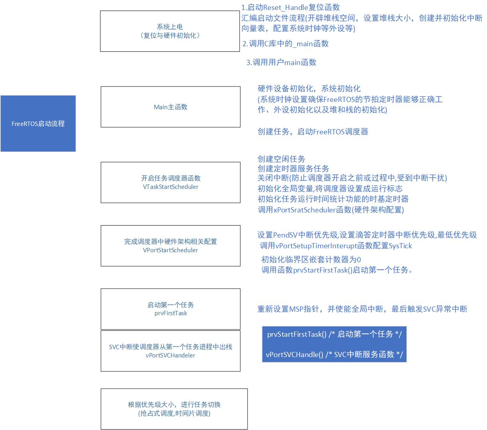
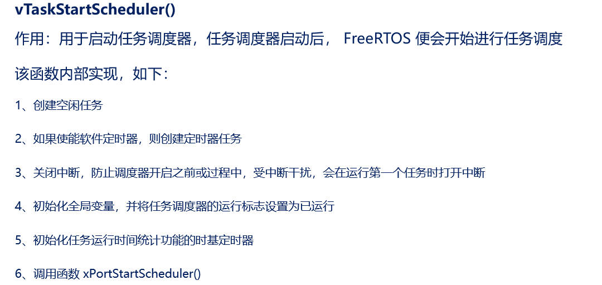
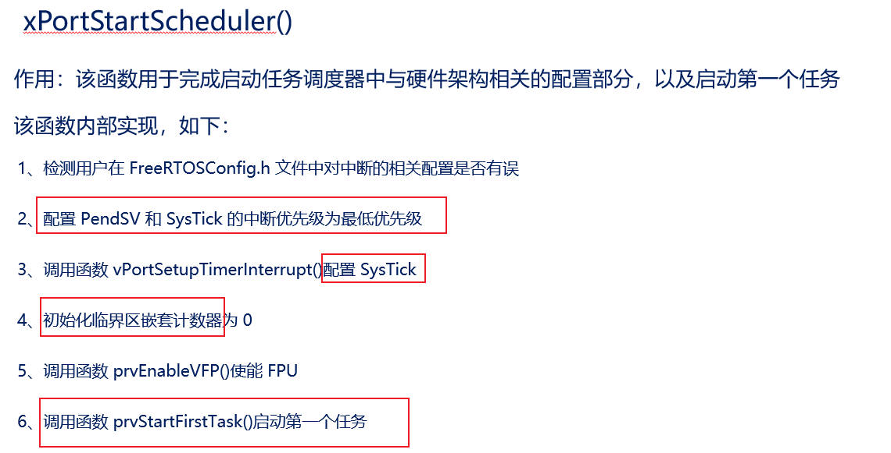
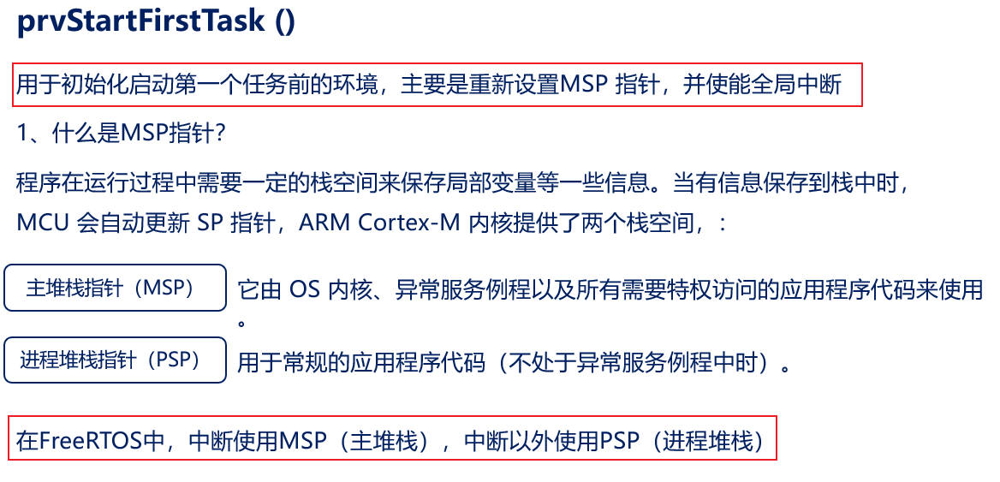
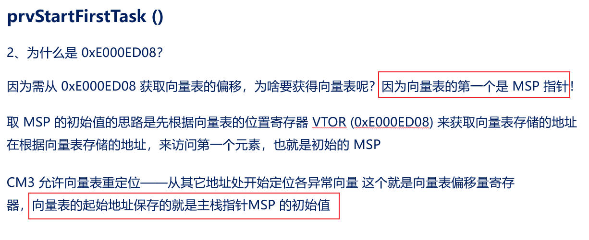
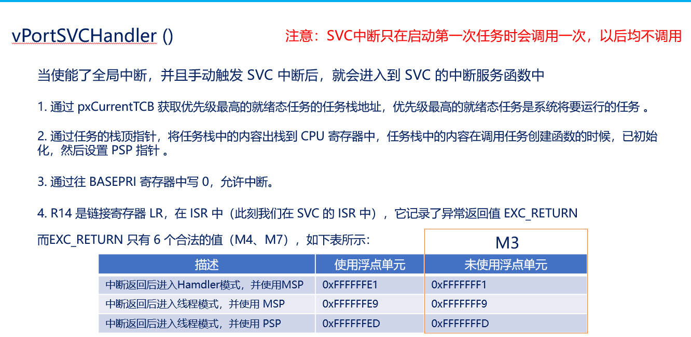
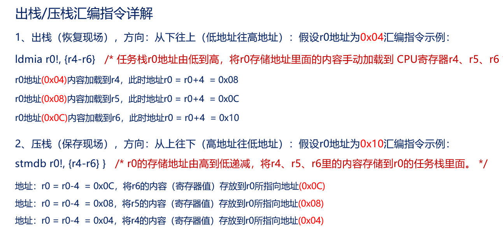
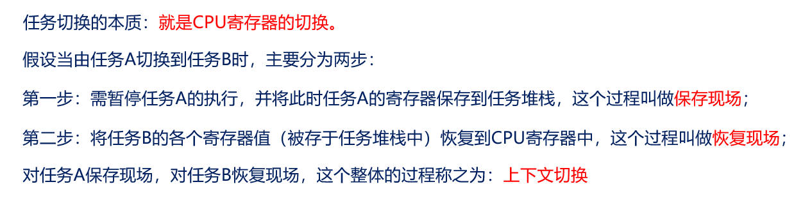
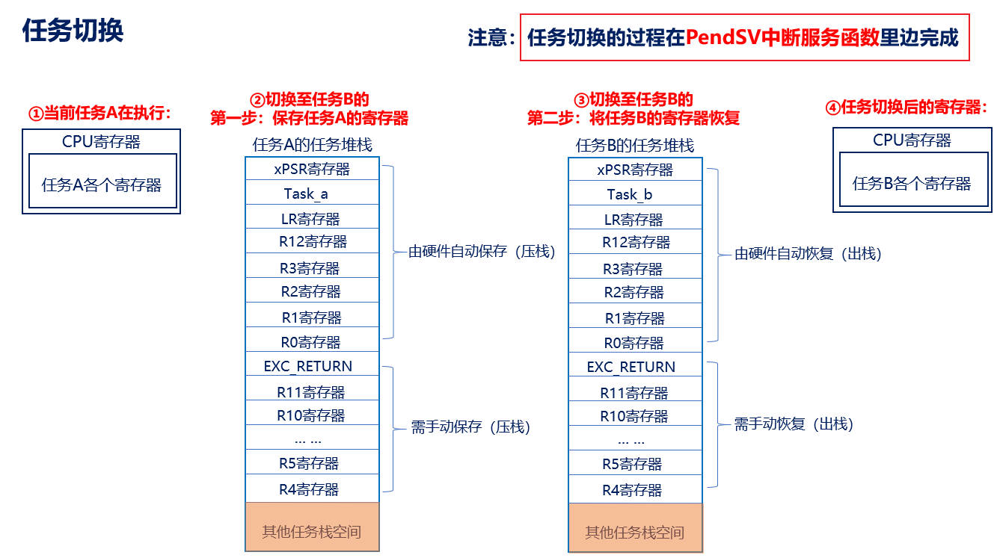

## FreeRTOS的启动流程

FreeRTOS的启动流程是一个涉及多个步骤的过程，主要包括硬件初始化、RTOS系统初始化、任务创建以及调度器启动等关键步骤。

下面将详细解析FreeRTOS的启动流程：



### 一、系统启动准备

1. 复位与硬件初始化
   - 系统上电时，首先执行的是由汇编语言编写的复位函数（如`Reset_Handle`），该函数负责初始化CPU的基本状态，并调用C语言的入口点（通常是`_main`或`main`函数）。
   - 在`main`函数之前或之中，进行必要的硬件初始化，包括系统时钟设置（确保FreeRTOS的节拍定时器能够正确工作）、外设初始化（如GPIO、UART、I2C等）以及堆和栈的初始化。

### 二、RTOS系统初始化

- 在`main`函数中，进行FreeRTOS的RTOS系统初始化。这一步骤可能包括配置FreeRTOS的系统参数（如任务数量、堆栈大小、优先级等），以及初始化FreeRTOS的内核服务（如空闲任务、软件定时器服务等）。

### 三、任务创建

- 在RTOS系统初始化完成后，需要创建应用所需的任务。每个任务都需要定义一个任务函数和一些参数，并通过FreeRTOS提供的API（如xTaskCreate）创建。

  - **任务创建参数**：包括任务函数指针、任务名称、堆栈大小、传递给任务函数的参数、任务优先级以及任务句柄。

  - 示例代码片段：

    ```c
    xTaskCreate(TaskFunction_t pvTaskCode, // 任务函数指针  
                const char* const pcName, // 任务名称  
                configSTACK_DEPTH_TYPE usStackDepth, // 任务堆栈大小  
                void* pvParameters, // 传递给任务函数的参数  
                UBaseType_t uxPriority, // 任务优先级  
                TaskHandle_t* pxCreatedTask // 任务句柄);
    ```

### 四、启动调度器

- 所有任务创建完成后，调用vTaskStartScheduler函数启动FreeRTOS的任务调度器。
  - 该函数会配置并启动FreeRTOS的调度器，使系统开始运行创建的任务，并根据任务优先级和调度策略进行任务切换。
  - `vTaskStartScheduler`函数启动后，通常不会返回。因此，在调用该函数后，`main`函数中的后续代码将不会被执行。
  
  
  
  
  
  
  
  
  
  
  
  
  
  

### 五、任务执行与调度

- 调度器启动后，FreeRTOS将根据任务的优先级和调度策略自动切换任务。每个任务都在其自己的上下文中运行，并通过FreeRTOS的API进行同步和通信。

### 上下文切换





### 六、任务管理与调度策略

- FreeRTOS提供了丰富的任务管理和调度策略，包括任务创建、删除、挂起、恢复、优先级调整等。
- 调度策略可以是抢占式的（基于优先级的抢占调度）或非抢占式的（基于时间片的轮转调度），具体取决于FreeRTOS的配置和任务的属性。

### 总结

FreeRTOS的启动流程是一个从硬件初始化到RTOS系统初始化，再到任务创建和调度器启动的完整过程。通过这个过程，FreeRTOS能够创建一个高效、可靠的多任务实时操作系统环境，为嵌入式应用提供强大的实时任务管理和调度能力。