## GD32F307E-START开发板评测 使用TinyMaix进行手写数字识别

### 参考博客 

【GD32F427开发板试用】使用TinyMaix进行手写数字识别 https://blog.csdn.net/weixin_47569031/article/details/129009839

### 软硬件平台

1. GD32F307E-START Board开发板
2. GCC Makefile

###   TinyMaix简介

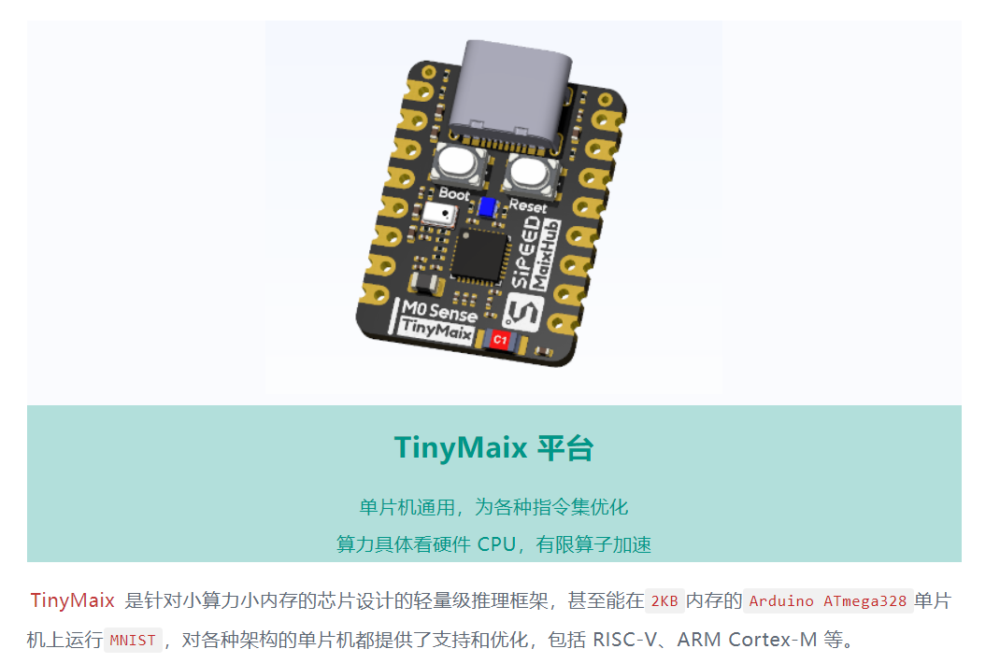

TinyMaix是国内sipeed团队开发一个轻量级AI推理框架。https://wiki.sipeed.com/ai/zh/deploy/tinymaix.html

> TinyMaix 是面向单片机的超轻量级的神经网络推理库，即 TinyML 推理库，可以让你在任意单片机上运行轻量级深度学习模型 。

**关键特性**

- 核心代码少于**400行**(tm_layers.c+tm_model.c+arch_cpu.h), 代码段(.text)少于**3KB**
- 低内存消耗，甚至**Arduino ATmega328** (32KB Flash, 2KB Ram) 都能基于TinyMaix跑mnist(手写数字识别)
- 支持**INT8/FP32/FP16**模型，实验性地支持**FP8**模型，支持keras h5或tflite模型转换
- 支持多种芯片架构的专用指令优化: **ARM SIMD/NEON/MVEI，RV32P, RV64V**
- 友好的用户接口，只需要load/run模型~
- 支持全静态的内存配置(无需malloc)
- [MaixHub](https://maixhub.com/) **在线模型训练**支持

所以，在我们这次试用的主角GD32F307上运行TinyMaix完全是没有任何压力的。接下来，我将介绍如何在GD32F427上运行TinyMaix进行手写数字识别。

####   1.1 TinyMaix开源项目

GitHub代码仓： https://github.com/sipeed/tinymaix

###   二、TinyMaix工程

TinyMaix是一个轻量级AI推理框架，他的核心功能就是支持AI模型的各种算子，可以简单理解为一个矩阵和向量计算库。对于计算库的移植，我们通常只需要解决编译问题即可，不涉及外设和周边元件。

#### 创建GCC工程并添加TinyMaix源码

在之前的gcc 工程模板上创建TinyMaix文件夹

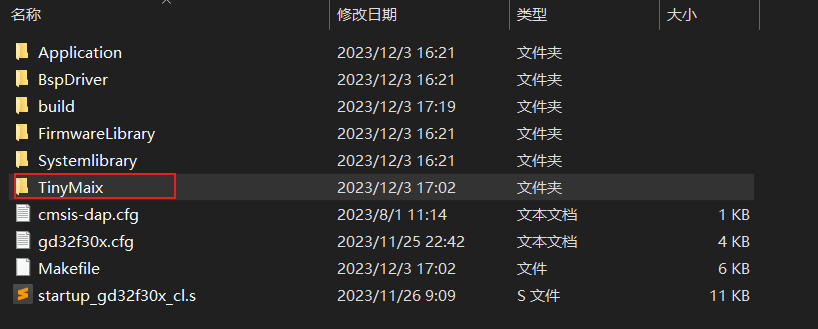

从Github克隆TinyMaix源码到到当前项目中：

```Plaintext
git clone https://github.com/sipeed/TinyMaix.git
```

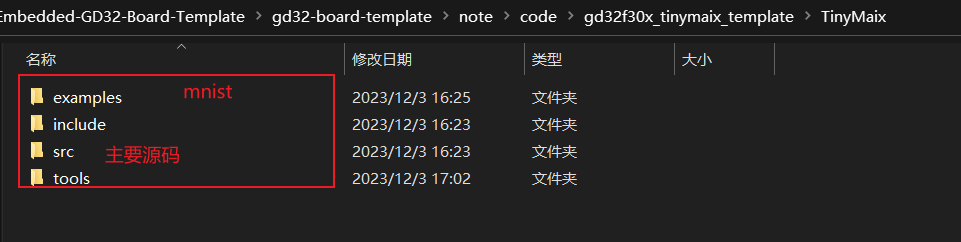

修改Makefile文件，添加TinyMaix文件。

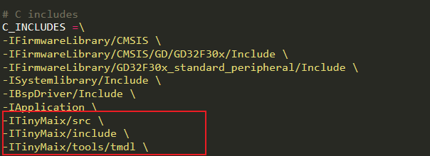

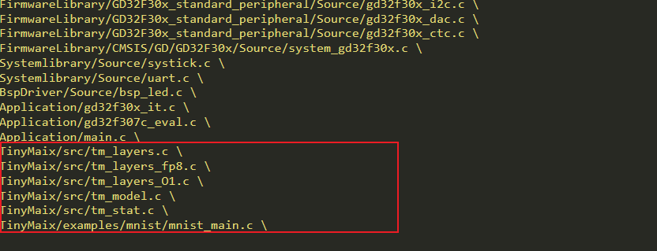

###   三、TinyMaix测试

在上面的工程构建之后，接下来进行一些代码的修改，完成对于GD32F307-START开发板实现功能。

TinyMaix项目提供了一些案例去测试，无需我们手动编写，例如手写数字识别。但是在GD32F307-START开发板上实现下面两个基础功能。

- 日志打印，具体是printf输出
- 精准计时，精确到毫秒即可

本次移植TinyMaix，需要实现计时功能，可以在点灯项目代码的基础上进行一些修改，具体修如下：

```c
/*!
    \file  systick.c
    \brief the systick configuration file
*/

#include "main.h"

static __IO uint32_t delay;
static volatile uint32_t ticks = 0;

/*!
    \brief      configure systick
    \param[in]  none
    \param[out] none
    \retval     none
*/
void systick_config(void)
{
    /* setup systick timer for 1000Hz interrupts */
    if(SysTick_Config(SystemCoreClock / 1000U)){
        /* capture error */
        while (1){
        }
    }
    /* configure the systick handler priority */
    NVIC_SetPriority(SysTick_IRQn, 0x00U);
}

/*!
    \brief      delay a time in milliseconds
    \param[in]  count: count in milliseconds
    \param[out] none
    \retval     none
*/
void delay_1ms(uint32_t count)
{
    uint32_t end  = ticks+ count;

    while(ticks != end){
    }
}

/*!
    \brief      delay decrement
    \param[in]  none
    \param[out] none
    \retval     none
*/

void delay_decrement(void)
{
    ticks++;
}


uint32_t systick_get_ms(void)
{
    return ticks;
}

```

#### 修改 `tm_port.h` 文件

接下来修改 `tm_port.h` 文件中的几个宏：

```C
#include "systick.h"
#define TM_DBGT_INIT()     uint32_t _start,_finish; uint32_t _time; _start = systick_get_ms();
#define TM_DBGT_START()    _start = systick_get_ms();
#define TM_DBGT(x)         {_finish = systick_get_ms();                  \
                            _time = _finish - _start;                    \
                            TM_PRINTF("===%s use %lu ms\n", (x), _time); \
                            _start = systick_get_ms();}
```

#### 修改 `mnist_main.c` 文件

在修改之前文件之前，需要进行下面的操作

- 删除 `examples` 目录下除 `mnist` 之外的其他所有目录；
- 将 `mnist` 目录内的 `main.c` 文件中的 `main` 函数重命名为 `mnist_main` ；
- 将 `mnist` 目录内的 `main.c` 重命名为 `mnist_main.c` ；

接下来修改 `mnist_main.c` 文件，具体修改为：

修改原因，是因为没有找到在GCC开发环境下能够打印浮点数的方法。

同时注释掉**tm_stat((tm_mdlbin_t*)mdl_data);**

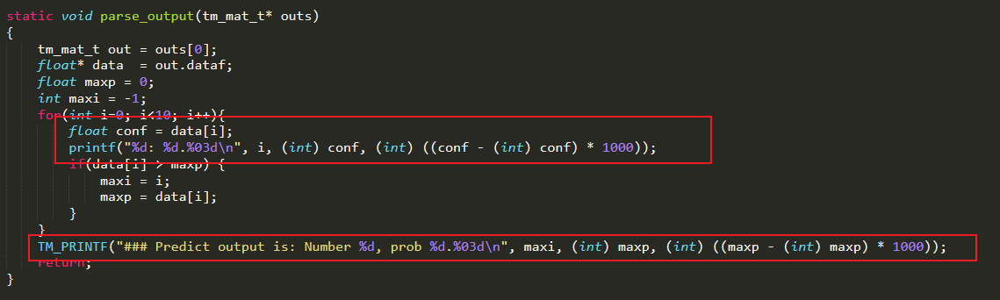

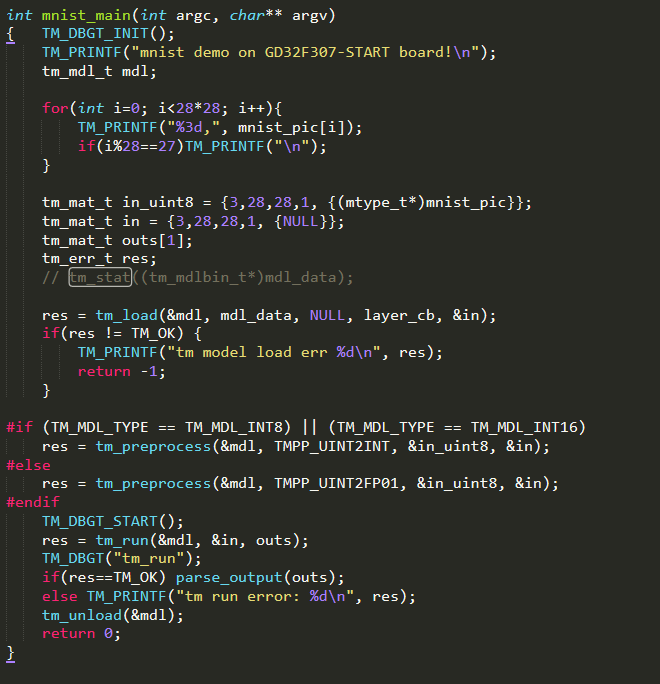

###   四、运行手写数字识别

完成以上修改后，进行Makeb编译，就可以在GD32F307上运行手写数字识别示例了，具体输出如下图所示：

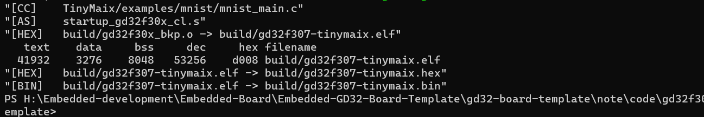

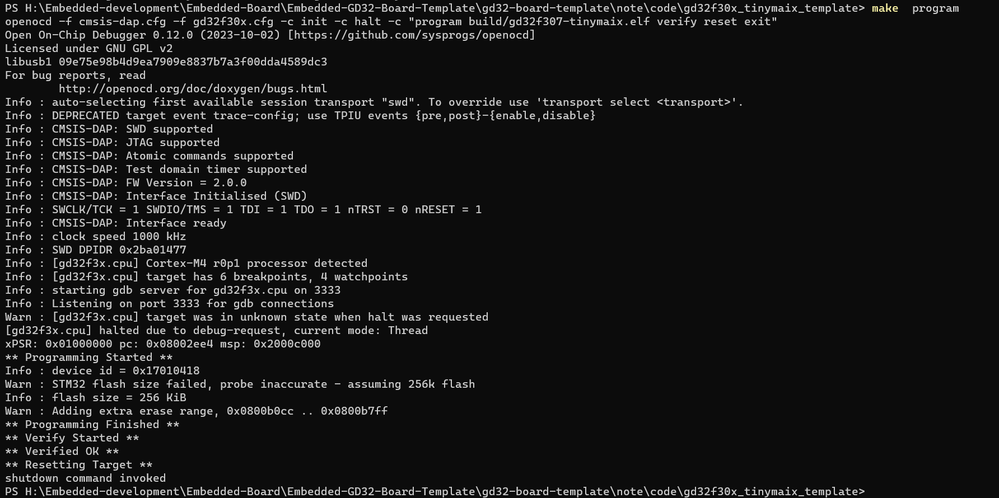

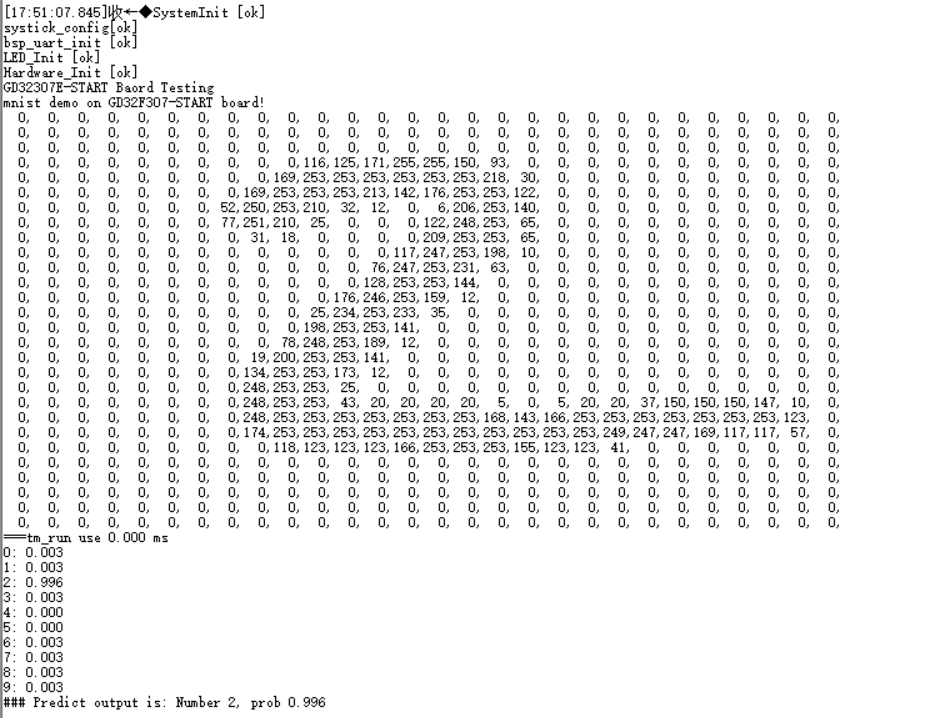

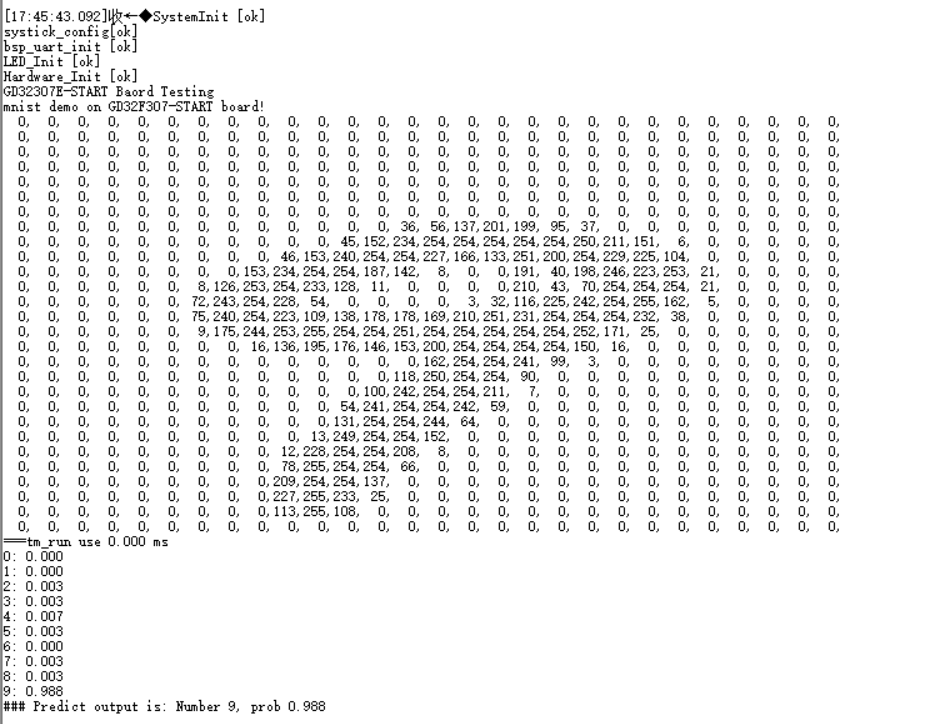


