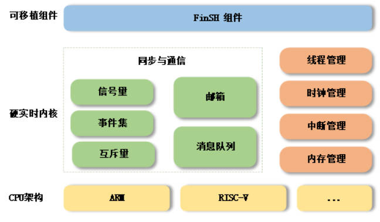

## 05-GD32F307E-START开发板评测 RT-Thread学习-线程管理

### 1. 软硬件平台

1. GD32F307E-START Board开发板
2. MDK-ARM Keil

### 2.RT-Thread Nano 



### 3.线程管理

​		在多线程操作系统中，可以把一个复杂的应用分解成多个小的、可调度的、序列化的程序单元，当合理地划分任务并正确地执行时，这种设计能够让系统满足实时系统的性能及时间的要求。在多线程实时系统中，可以将这个任务分解成子任务。

​		在 RT-Thread 中，与上述**子任务对应的程序实体就是线程**，**线程是实现任务的载体，它是 RT-Thread 中最基本的调度单位**，它描述了一个任务执行的运行环境，也描述了这个任务所处的优先等级，重要的任务可设置相对较高的优先级，非重要的任务可以设置较低的优先级，不同的任务还可以设置相同的优先级，轮流运行。(RT-Thread 中Thread 对应于FreeRTOS中的task)。

当线程运行时，它会认为自己是以独占 CPU 的方式在运行，**线程执行时的运行环境称为上下文，具体来说就是各个变量和数据，包括所有的寄存器变量、堆栈、内存信息等**。

​	RT-Thread **线程管理的主要功能是对线程进行管理和调度**，系统中总共存在两类线程，**分别是系统线程和用户线程**，**系统线程是由 RT-Thread 内核创建的线程，用户线程是由应用程序创建的线程，**这两类线程都会从内核对象容器中分配线程对象，当线程被删除时，也会被从对象容器中删除，如下图所示，每个线程都有重要的属性，如线程控制块、线程栈、入口函数等。


**RT-Thread 的线程调度器是抢占式的**，主要的工作就是**从就绪线程列表中查找最高优先级线程，保证最高优先级的线程能够被运行，最高优先级的任务一旦就绪，总能得到 CPU 的使用权。**

当一个运行着的线程使一个比它优先级高的线程满足运行条件，当前线程的 CPU 使用权就被剥夺了，或者说被让出了，高优先级的线程立刻得到了 CPU 的使用权。

如果是中断服务程序使一个高优先级的线程满足运行条件，中断完成时，被中断的线程挂起，优先级高的线程开始运行。

当调度器调度线程切换时，先将当前线程上下文保存起来，当再切回到这个线程时，线程调度器将该线程的上下文信息恢复。

#### 重要概念1 线程控制块

​		在 RT-Thread 中，线程控制块由结构体 struct rt_thread 表示，线程控制块是操作系统用于管理线程的一个数据结构，它会存放线程的一些信息，例如**优先级、线程名称、线程状态**等，也包含线程与线程之间连接用的链表结构，线程等待事件集合等，详细定义如下：

```c
/* 线程控制块 */
struct rt_thread
{
    /* rt 对象 */
    char        name[RT_NAME_MAX];     /* 线程名称 */
    rt_uint8_t  type;                   /* 对象类型 */
    rt_uint8_t  flags;                  /* 标志位 */

    rt_list_t   list;                   /* 对象列表 */
    rt_list_t   tlist;                  /* 线程列表 */

    /* 栈指针与入口指针 */
    void       *sp;                      /* 栈指针 */
    void       *entry;                   /* 入口函数指针 */
    void       *parameter;              /* 参数 */
    void       *stack_addr;             /* 栈地址指针 */
    rt_uint32_t stack_size;            /* 栈大小 */

    /* 错误代码 */
    rt_err_t    error;                  /* 线程错误代码 */
    rt_uint8_t  stat;                   /* 线程状态 */

    /* 优先级 */
    rt_uint8_t  current_priority;    /* 当前优先级 */
    rt_uint8_t  init_priority;        /* 初始优先级 */
    rt_uint32_t number_mask;

    ......

    rt_ubase_t  init_tick;               /* 线程初始化计数值 */
    rt_ubase_t  remaining_tick;         /* 线程剩余计数值 */

    struct rt_timer thread_timer;      /* 内置线程定时器 */

    void (*cleanup)(struct rt_thread *tid);  /* 线程退出清除函数 */
    rt_uint32_t user_data;                      /* 用户数据 */
};

```

其中 **init_priority 是线程创建时指定的线程优先级，在线程运行过程当中是不会被改变的**（除非用户执行线程控制函数进行手动调整线程优先级）。**cleanup 会在线程退出时，被空闲线程回调一次以执行用户设置的清理现场等工作。**最后的一个成员 user_data 可由用户挂接一些数据信息到线程控制块中，以提供一种类似线程私有数据的实现方式。

#### 重要概念2 线程状态

线程运行的过程中，同一时间内只允许一个线程在处理器中运行，从运行的过程上划分，线程有多种不同的运行状态，如初始状态、挂起状态、就绪状态等。在 RT-Thread 中，线程包含五种状态，操作系统会自动根据它运行的情况来动态调整它的状态。 RT-Thread 中线程的五种状态，如下表所示：

|   状态   |                             描述                             |
| :------: | :----------------------------------------------------------: |
| 初始状态 | 当线程刚开始创建还没开始运行时就处于初始状态；在初始状态下，线程不参与调度。此状态在 RT-Thread 中的宏定义为 **RT_THREAD_INIT** |
| 就绪状态 | 在就绪状态下，线程按照优先级排队，等待被执行；一旦当前线程运行完毕让出处理器，操作系统会马上寻找最高优先级的就绪态线程运行。此状态在 RT-Thread 中的宏定义为 **RT_THREAD_READY** |
| 运行状态 | 线程当前正在运行。在单核系统中，只有 rt_thread_self() 函数返回的线程处于运行状态；在多核系统中，可能就不止这一个线程处于运行状态。此状态在 RT-Thread 中的宏定义为 **RT_THREAD_RUNNING** |
| 挂起状态 | 也称阻塞态。它可能因为资源不可用而挂起等待，或线程主动延时一段时间而挂起。在挂起状态下，线程不参与调度。此状态在 RT-Thread 中的宏定义为 **RT_THREAD_SUSPEND** |
| 关闭状态 | 当线程运行结束时将处于关闭状态。关闭状态的线程不参与线程的调度。此状态在 RT-Thread 中的宏定义为 **RT_THREAD_CLOSE** |

RT-Thread 提供一系列的操作系统调用接口，使得线程的状态在这五个状态之间来回切换。几种状态间的转换关系如下图所示：


- 线程通过调用函数 **rt_thread_create/init()** 进入到初始状态（RT_THREAD_INIT）
- 初始状态的线程通过调用函数 **rt_thread_startup()** 进入到**就绪状态**（RT_THREAD_READY）；就绪状态的线程被调度器调度后进入**运行状态**（RT_THREAD_RUNNING）
- 当处于运行状态的线程调用 **rt_thread_delay()，rt_sem_take()，rt_mutex_take()，rt_mb_recv()** 等函数或者获取不到资源时，将进入到**挂起状态**（RT_THREAD_SUSPEND）
- 处于挂起状态的线程，如果等待超时依然未能获得资源或由于其他线程释放了资源，那么它将返回到就绪状态。
- 挂起状态的线程，如果调用 **rt_thread_delete/detach()** 函数，将更改为**关闭状态**（RT_THREAD_CLOSE）
- 而运行状态的线程，如果**运行结束**，就会在线程的最后部分执行 **rt_thread_exit()** 函数，将状态更改为**关闭状态**

#### 重要概念3 线程优先级

RT-Thread 线程的优先级是表示线程被调度的优先程度。每个线程都具有优先级，线程越重要，赋予的优先级就应越高，线程被调度的可能才会越大。

**RT-Thread 最大支持 256 个线程优先级 (0~255)，数值越小的优先级越高，0 为最高优先级。**在一些资源比较紧张的系统中，可以根据实际情况选择只支持 8 个或 32 个优先级的系统配置；对于 ARM Cortex-M 系列，普遍采用 32 个优先级。最低优先级默认分配给空闲线程使用，用户一般不使用。在系统中，当有比当前线程优先级更高的线程就绪时，当前线程将立刻被换出，高优先级线程抢占处理器运行。

绝大多数的RTOS的优先级都是数值越小，优先级越高，除了FreeRTOS。


#### 重要概念4 系统线程：空闲线程 主线程

##### 空闲线程

**空闲线程（idle）是系统创建的最低优先级的线程，线程状态永远为就绪态。当系统中无其他就绪线程存在时，调度器将调度到空闲线程，它通常是一个死循环，且永远不能被挂起。**另外，空闲线程在 RT-Thread 也有着它的特殊用途：

若某线程运行完毕，系统将自动删除线程：自动执行 rt_thread_exit() 函数，先将该线程从系统就绪队列中删除，再将该线程的状态更改为关闭状态，不再参与系统调度，然后挂入 rt_thread_defunct 僵尸队列（资源未回收、处于关闭状态的线程队列）中，最后空闲线程会回收被删除线程的资源。

空闲线程也提供了接口来运行用户设置的钩子函数，在空闲线程运行时会调用该钩子函数，适合处理功耗管理、看门狗喂狗等工作。空闲线程必须有得到执行的机会，即其他线程不允许一直while(1)死卡，必须调用具有阻塞性质的函数；否则例如线程删除、回收等操作将无法得到正确执行。

##### 主线程

在系统启动时，系统会创建 main 线程，它的入口函数为 main_thread_entry()，用户的应用入口函数 main() 就是从这里真正开始的，系统调度器启动后，main 线程就开始运行，过程如下图，用户可以在 main() 函数里添加自己的应用程序初始化代码。


#### 线程管理函数API

```C
/*
 * thread interface
 */
rt_err_t rt_thread_init(struct rt_thread *thread,
                        const char       *name,
                        void (*entry)(void *parameter),
                        void             *parameter,
                        void             *stack_start,
                        rt_uint32_t       stack_size,
                        rt_uint8_t        priority,
                        rt_uint32_t       tick);
rt_err_t rt_thread_detach(rt_thread_t thread);
rt_thread_t rt_thread_create(const char *name,
                             void (*entry)(void *parameter),
                             void       *parameter,
                             rt_uint32_t stack_size,
                             rt_uint8_t  priority,
                             rt_uint32_t tick);
rt_thread_t rt_thread_self(void);
rt_thread_t rt_thread_find(char *name);
rt_err_t rt_thread_startup(rt_thread_t thread);
rt_err_t rt_thread_delete(rt_thread_t thread);

rt_err_t rt_thread_yield(void);
rt_err_t rt_thread_delay(rt_tick_t tick);
rt_err_t rt_thread_mdelay(rt_int32_t ms);
rt_err_t rt_thread_control(rt_thread_t thread, int cmd, void *arg);
rt_err_t rt_thread_suspend(rt_thread_t thread);
rt_err_t rt_thread_resume(rt_thread_t thread);
void rt_thread_timeout(void *parameter);


#ifdef RT_USING_SIGNALS //使用信号量
void rt_thread_alloc_sig(rt_thread_t tid);
void rt_thread_free_sig(rt_thread_t tid);
int  rt_thread_kill(rt_thread_t tid, int sig);
#endif

#ifdef RT_USING_HOOK  //使用钩子函数
void rt_thread_suspend_sethook(void (*hook)(rt_thread_t thread));
void rt_thread_resume_sethook (void (*hook)(rt_thread_t thread));
void rt_thread_inited_sethook (void (*hook)(rt_thread_t thread));
#endif

/*
 * idle thread interface
 */
void rt_thread_idle_init(void);
#if defined(RT_USING_HOOK) || defined(RT_USING_IDLE_HOOK)
rt_err_t rt_thread_idle_sethook(void (*hook)(void));
rt_err_t rt_thread_idle_delhook(void (*hook)(void));
#endif
void rt_thread_idle_excute(void);
rt_thread_t rt_thread_idle_gethandler(void);
```


#### 线程的创建（动态创建、静态创建）

**动态创建 rt_thread_create**

```c
rt_thread_t rt_thread_create(const char* name,
                            void (*entry)(void* parameter),
                            void* parameter,
                            rt_uint32_t stack_size,
                            rt_uint8_t priority,
                            rt_uint32_t tick);
```

| **参数**   |                           **描述**                           |
| ---------- | :----------------------------------------------------------: |
| name       | **线程的名称**；线程名称的最大长度由 rtconfig.h 中的宏 RT_NAME_MAX 指定，多余部分会被自动截掉 |
| entry      |                       **线程入口函数**                       |
| parameter  |                       线程入口函数参数                       |
| stack_size |                  **线程栈大小，单位是字节**                  |
| priority   | **线程的优先级**。优先级范围根据系统配置情况（rtconfig.h 中的 RT_THREAD_PRIORITY_MAX 宏定义），如果支持的是 256 级优先级，那么范围是从 0~255，数值越小优先级越高，0 代表最高优先级 |
| tick       | **线程的时间片大小**。时间片（tick）的单位是操作系统的时钟节拍。当系统中存在相同优先级线程时，这个参数指定线程一次调度能够运行的最大时间长度。这个时间片运行结束时，调度器自动选择下一个就绪态的同优先级线程进行运行 |
| **返回值** |                                                              |
| thread     |                  线程创建成功，返回线程句柄                  |
| RT_NULL    |                         线程创建失败                         |

一般情况下，入口参数没有的情况比较多。

**静态创建 rt_thread_init**

```c
rt_err_t rt_thread_init(struct rt_thread *thread,
                        const char       *name,
                        void (*entry)(void *parameter),
                        void             *parameter,
                        void             *stack_start,
                        rt_uint32_t       stack_size,
                        rt_uint8_t        priority,
                        rt_uint32_t       tick);
```

| **参数**    |                           **描述**                           |
| ----------- | :----------------------------------------------------------: |
| thread      | **线程句柄**。线程句柄由用户提供出来，并指向对应的线程控制块内存地址 |
| name        | **线程的名称**；线程名称的最大长度由 rtconfig.h 中定义的 RT_NAME_MAX 宏指定，多余部分会被自动截掉 |
| entry       |                         线程入口函数                         |
| parameter   |                       线程入口函数参数                       |
| stack_start |                      **线程栈起始地址**                      |
| stack_size  | **线程栈大小，单位是字节。**在大多数系统中需要做栈空间地址对齐（例如 ARM 体系结构中需要向 4 字节地址对齐） |
| priority    | **线程的优先级**。优先级范围根据系统配置情况（rtconfig.h 中的 RT_THREAD_PRIORITY_MAX 宏定义），如果支持的是 256 级优先级，那么范围是从 0 ～ 255，数值越小优先级越高，0 代表最高优先级 |
| tick        | **线程的时间片大小。**时间片（tick）的单位是操作系统的时钟节拍。当系统中存在相同优先级线程时，这个参数指定线程一次调度能够运行的最大时间长度。这个时间片运行结束时，调度器自动选择下一个就绪态的同优先级线程进行运行 |
| **返回**    |                                                              |
| RT_EOK      |                         线程创建成功                         |
| RT_ERROR    |                         线程创建失败                         |

在静态创建过程中，需要预先定义一个数组，提前申请空间，动态创建过程则不需要，系统会从动态堆内存中分配一个线程句柄以及按照参数中指定的栈大小从动态堆内存中分配相应的空间。

#### 线程启动

创建（初始化）的线程状态处于初始状态，并未进入就绪线程的调度队列，我们可以在线程初始化 / 创建成功后调用下面的函数接口让该线程进入就绪态：

```c
rt_err_t rt_thread_startup(rt_thread_t thread);
```

当调用这个函数时，将把线程的状态更改为就绪状态，并放到相应优先级队列中等待调度。如果新启动的线程优先级比当前线程优先级高，将立刻切换到这个线程。线程启动接口 rt_thread_startup() 的参数和返回值见下表：

| **参数** |   **描述**   |
| :------: | :----------: |
|  thread  |   线程句柄   |
|   返回   |              |
|  RT_EOK  | 线程启动成功 |
| RT_ERROR | 线程启动失败 |

```c
/*
 * 程序清单：创建、初始化/脱离线程
 * 这个例子会创建两个线程，一个动态线程，一个静态线程。
 * 静态线程在运行完毕后自动被系统脱离，动态线程一直打印计数。
 */
#include <rtthread.h>

#define THREAD_PRIORITY         19
#define THREAD_STACK_SIZE       512
#define THREAD_TIMESLICE        5

static rt_thread_t tid1 = RT_NULL;

/* 线程1的入口函数 */
static void thread1_entry(void *parameter)
{
    rt_uint32_t count = 0;

    for (count =0 ;count< 20;count++)
    {
        /* 线程1采用低优先级运行，打印计数值20 */
        rt_kprintf("thread1 count: %d\n", count ++);
    }
    rt_kprintf("thread1 exit\n");
}

ALIGN(RT_ALIGN_SIZE)
static char thread2_stack[1024];
static struct rt_thread thread2;

/* 线程2入口 */
static void thread2_entry(void *param)
{
    rt_uint32_t count = 0;

    /* 线程2拥有较高的优先级，以抢占线程1而获得执行 */
    for (count = 0; count < 10 ; count++)
    {
        /* 线程2打印计数值 */
        rt_kprintf("thread2 count: %d\n", count);
    }
    rt_kprintf("thread2 exit\n");

    /* 线程2运行结束后也将自动被系统脱离 */
}

/* 线程示例 */
int thread_sample(void)
{
    /* 创建线程1，名称是thread1，入口是thread1_entry*/
    tid1 = rt_thread_create("create_hread1",
                            thread1_entry, RT_NULL,
                            THREAD_STACK_SIZE,
                            THREAD_PRIORITY, THREAD_TIMESLICE);

    /* 如果获得线程控制块，启动这个线程 */
    if (tid1 != RT_NULL)
        rt_thread_startup(tid1);

    /* 初始化线程2，名称是thread2，入口是thread2_entry */
    rt_thread_init(&thread2,
                   "init_thread2",
                   thread2_entry,
                   RT_NULL,
                   &thread2_stack[0],
                   sizeof(thread2_stack),
                   THREAD_PRIORITY - 1, THREAD_TIMESLICE);
    rt_thread_startup(&thread2);

    return 0;
}

/* 导出到 msh 命令列表中 */
MSH_CMD_EXPORT(thread_sample, thread sample);

```

```c
#include "main.h"

void Hardware_Init(void)
{
    SystemInit (); 
   	systick_config();
    bsp_uart_init();
    HW_LED_Init();  
    
}

int main(void)
{
	Hardware_Init();
    printf("SystemInit [ok] \r\n");
    printf("systick_config[ok] \r\n");
    printf("bsp_uart_init [ok] \r\n");
    printf("Hardware_Init [ok] \r\n");
    printf("LED_Init [ok] \r\n");
    printf("GD32307E-START Board Testing \r\n");
    
    
    printf("GD32307E-START Board thread_sample test start...\r\n");
    thread_sample();
    printf("GD32307E-START Board thread_sample test end...\r\n");
    
    while(1)
    {
        gpio_bit_set(GPIOC,GPIO_PIN_6);
        rt_thread_delay(500);   /* 延时500个tick */
        rt_kprintf("led_thread running,LED1_ON\r\n");
        
        gpio_bit_reset(GPIOC,GPIO_PIN_6);    
        rt_thread_delay(500);   /* 延时500个tick */		 		
        rt_kprintf("led_thread running,LED1_OFF\r\n");
    }
    
 
    
}


```


整个程序先执行thread2,因为THREAD_PRIORITY优先级比thread1高，thread2打印完成10次计数值之后，就执行thread1，打印完成20次计数值结束。

#### 线程调度

**不同优先级: 依据优先级抢占**
**相同优先级: 时间片轮转**


#### 线程时间片轮转调度案例

```c
/* 
 线程时间片轮转调度案例
 * 程序清单：相同优先级线程按照时间片轮番调度
 * 这个例子中将创建两个线程，每一个线程都在打印信息
 */

#include <rtthread.h>

#define THREAD_STACK_SIZE	1024
#define THREAD_PRIORITY	    20
#define THREAD_TIMESLICE    10

/* 线程入口 */
static void timelice_thread_entry(void* parameter)
{
    rt_uint32_t value;
    rt_uint32_t count = 0;

    value = (rt_uint32_t)parameter;
    while (1)
    {
        if(0 == (count % 5))
        {           
            rt_kprintf("thread %d is running ,thread %d count = %d\n", value , value , count);      

            if(count > 200)
                return;            
        }
         count++;
     }  
}

int timeslice_sample(void)
{
    rt_thread_t tid;
    /* 创建线程1 */
    tid = rt_thread_create("timelice_thread1", 
                            timelice_thread_entry, (void*)1, 
                            THREAD_STACK_SIZE, 
                            THREAD_PRIORITY, THREAD_TIMESLICE); 
    if (tid != RT_NULL) 
        rt_thread_startup(tid);


    /* 创建线程2 */
    tid = rt_thread_create("timelice_thread2", 
                            timelice_thread_entry, (void*)2,
                            THREAD_STACK_SIZE, 
                            THREAD_PRIORITY, THREAD_TIMESLICE-5);
    if (tid != RT_NULL) 
        rt_thread_startup(tid);
    return 0;
}

/* 导出到 msh 命令列表中 */
MSH_CMD_EXPORT(timeslice_sample, timeslice sample);


```


#### 线程让出,线程抢占,线程恢复,线程挂起


```c
#include <rtthread.h>

static rt_thread_t tid1 = RT_NULL;
static rt_thread_t tid2 = RT_NULL;

#define THREAD_PRIORITY         18
#define THREAD_STACK_SIZE       512
#define THREAD_TIMESLICE        5
/* 线程1入口 */
static void thread1_yield_entry(void* parameter)
{
    rt_uint32_t count = 0;
    int i=0;

    for(i = 0 ; i < 10 ; i++)
    {
        /* 执行yield后应该切换到thread2执行*/
        rt_thread_yield();
        /* 打印线程1的输出*/
        rt_kprintf("thread1: count = %d\n", count ++);
    }
}
/* 线程2入口 */
 static void thread2_yield_entry(void* parameter)
 {
    rt_uint32_t count = 0;
    int i=0;

    for(i = 0 ; i < 10 ; i++)
    {
        /* 打印线程2的输出*/
        rt_kprintf("thread2: count = %d\n", count ++);
        /* 执行yield后应该切换到thread1执行*/
        rt_thread_yield();
    }
}

void thread_yield(void)
{
	tid1 = rt_thread_create("thread1_yield",
		thread1_yield_entry, RT_NULL, 
		THREAD_STACK_SIZE, THREAD_PRIORITY, THREAD_TIMESLICE);
	if (tid1 != RT_NULL)
		rt_thread_startup(tid1);

	tid2 = rt_thread_create("thread2_yield",
		thread2_yield_entry, RT_NULL,
		THREAD_STACK_SIZE, THREAD_PRIORITY, THREAD_TIMESLICE);
	if (tid2 != RT_NULL)
		rt_thread_startup(tid2);

}

MSH_CMD_EXPORT(thread_yield, thread test yield);

```


##### 不同优先级抢占

```c
#include <rtthread.h>

static rt_thread_t tid1 = RT_NULL;
static rt_thread_t tid2 = RT_NULL;

#define THREAD_PRIORITY         17
#define THREAD_STACK_SIZE       512
#define THREAD_TIMESLICE        5

 /* 线程1入口*/ 
static void thread1_grab_entry(void* parameter) 
{
  rt_uint32_t count ; 
 for(count = 0;count<4;count++) 
 { 
        rt_thread_delay(RT_TICK_PER_SECOND*3); 
        rt_kprintf("count = %d\n", count); 
 } 
} 

 /* 线程2入口*/
static void thread2_grab_entry(void* parameter) 
{ 
    rt_tick_t tick; 
    rt_uint32_t i; 

    for(i=0; i<10 ; ++i) 
    { 
        tick = rt_tick_get(); 
        rt_thread_delay(RT_TICK_PER_SECOND);
        rt_kprintf("tick = %d\n",tick++); 
    } 
} 

void thread_grab(void)
{
	tid1 = rt_thread_create("thread1_grab",
		thread1_grab_entry, RT_NULL, 
		THREAD_STACK_SIZE, THREAD_PRIORITY - 1, THREAD_TIMESLICE);
	if (tid1 != RT_NULL)
		rt_thread_startup(tid1);

	tid2 = rt_thread_create("thread2_grab",
		thread2_grab_entry, RT_NULL,
		THREAD_STACK_SIZE, THREAD_PRIORITY, THREAD_TIMESLICE);
	if (tid2 != RT_NULL)
		rt_thread_startup(tid2);
}

MSH_CMD_EXPORT(thread_grab, thread test grab);

```


##### 不同优先级的线程恢复

```c
 #include <rtthread.h>

static rt_thread_t tid1 = RT_NULL;
static rt_thread_t tid2 = RT_NULL;

#define THREAD_PRIORITY         16
#define THREAD_STACK_SIZE       512
#define THREAD_TIMESLICE        5

/* 线程1入口 */
static void thread1_resume_entry(void* parameter)
{
        rt_uint32_t count = 0;

        for(;count < 10; )
        {
                rt_kprintf("thread count: %d\n", count ++);
                rt_thread_delay(RT_TICK_PER_SECOND);
              /* count为2时挂起自身 */
                if(count == 2) 
                {
                    rt_kprintf("thread1 suspend\n"); /* 挂起自身 */
                    rt_thread_suspend(tid1);                        
                    rt_schedule();                  /* 主动执行线程调度 */
                    rt_kprintf("thread1 resumed\n");                    
                }
        }
}

/* 线程2入口 */
static void thread2_resume_entry(void* parameter)
{
        rt_thread_delay(RT_TICK_PER_SECOND*5);

        /* 唤醒线程1 */
        rt_thread_resume(tid1);

        rt_thread_delay(10);
}

void thread_resume(void)
{
	tid1 = rt_thread_create("thread1_resume",
		thread1_resume_entry, RT_NULL,       
		THREAD_STACK_SIZE, THREAD_PRIORITY, THREAD_TIMESLICE);
	if (tid1 != RT_NULL)
		rt_thread_startup(tid1);

	tid2 = rt_thread_create("thread2_resume",
		thread2_resume_entry,   RT_NULL,       
		THREAD_STACK_SIZE, THREAD_PRIORITY-1, THREAD_TIMESLICE);
	if (tid2 != RT_NULL)
		rt_thread_startup(tid2);
}

MSH_CMD_EXPORT(thread_resume, thread test resume);

```


##### 不同优先级的线程挂起

```c
#include <rtthread.h>

static rt_thread_t tid1 = RT_NULL;
static rt_thread_t tid2 = RT_NULL;

#define THREAD_PRIORITY         15
#define THREAD_STACK_SIZE       512
#define THREAD_TIMESLICE        5

/* 线程1入口 */
static void thread1_suspend_entry(void* parameter)
{
        rt_uint32_t count = 0;

        while (1)
        {
            /* 线程1采用低优先级运行，一直打印计数值 */
            rt_kprintf("thread count: %d\n", count ++);
            //rt_thread_delay(RT_TICK_PER_SECOND);
        }
}

/* 线程2入口 */
static void thread2_suspend_entry(void* parameter)
{
        rt_thread_delay(RT_TICK_PER_SECOND*2);

        /* 挂起线程1 */
        rt_thread_suspend(tid1);
}

void thread_suspend(void)
{
	tid1 = rt_thread_create("suspend_t1",
		thread1_suspend_entry, RT_NULL,       
		THREAD_STACK_SIZE, THREAD_PRIORITY, THREAD_TIMESLICE);
	if (tid1 != RT_NULL)
		rt_thread_startup(tid1);

	tid2 = rt_thread_create("suspend_t2",
		thread2_suspend_entry,   RT_NULL,       
		THREAD_STACK_SIZE, THREAD_PRIORITY-1, THREAD_TIMESLICE);
	if (tid2 != RT_NULL)
		rt_thread_startup(tid2);
}
MSH_CMD_EXPORT(thread_suspend, thread test suspend);

```


