## GD32F307E-START开发板评测 移植RT-Thread 

### 1. 软硬件平台

1. GD32F307E-START Board开发板
2. MDK-ARM Keil
3. GCC Makefile

### 2. 物联网RTOS—RT-Thread

1. RT-Thread 

RT-Thread诞生于2006年，是一款以开源、中立、社区化发展起来的物联网操作系统。 RT-Thread主要采用 C 语言编写，浅显易懂，且具有方便移植的特性（可快速移植到多种主流 MCU 及模组芯片上）。RT-Thread把面向对象的设计方法应用到实时系统设计中，使得代码风格优雅、架构清晰、系统模块化并且可裁剪性非常好。RT-Thread完整版，通过在线的软件包管理工具，配合系统配置工具实现直观快速的模块化裁剪，并且可以无缝地导入丰富的软件功能包，从而实现复杂功能。

下图是 RT-Thread  的软件框图：

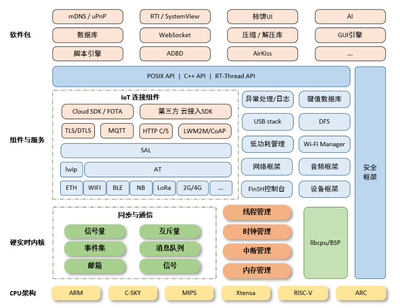

2. RT-Thread Nano

​		RT-Thread Nano 是一个极简版的硬实时内核，它是由 C 语言开发，采用面向对象的编程思维，具有良好的代码风格，是一款可裁剪的、抢占式实时多任务的 RTOS。其内存资源占用极小，功能包括任务处理、软件定时器、信号量、邮箱和实时调度等相对完整的实时操作系统特性。适用于大量使用的 32 位 ARM 入门级 MCU 的场合。

下图是 RT-Thread Nano 的软件框图，包含支持的 CPU 架构与内核源码，还有可拆卸的 FinSH 组件：


支持架构：ARM：Cortex M0/ M3/ M4/ M7 等、RISC-V 及其他。

功能：线程管理、线程间同步与通信、时钟管理、中断管理、内存管理。

#### RT-Thread Nano的特点

1. 下载简单

	RT-Thread Nano 以软件包的方式集成在 Keil MDK 与 CubeMX 中，可以直接在软件中下载 Nano 软件包获取源码，获取方式详见 基于 Keil MDK 移植 RT-Thread Nano 与 基于 CubeMX 移植 RT-Thread Nano 。同时也提供 下载 Nano 源码压缩包 的途径，方便在其他开发环境移植 RT-Thread Nano，如 基于 IAR 移植 RT-Thread Nano。

2. 代码简单
	与RT-Thread 完整版不同的是，Nano 不含 Scons 构建系统，不需要 Kconfig 以及 Env 配置工具，也去除了完整版特有的 device 框架和组件，仅是一个纯净的内核。
	
3. 移植简单
	由于 Nano 的极简特性，使 Nano 的移植过程变得极为简单。添加 Nano 源码到工程，就已完成 90% 的移植工作。
	
4. 易裁剪：Nano 的配置文件为 rtconfig.h，该文件中列出了内核中的所有宏定义，有些默认没有打开，如需使用，打开即可。

5. 易添加 FinSH 组件：FinSH 组件 可以很方便的在 Nano 上进行移植，而不再依赖 device 框架，只需要对接两个必要的函数即可完成 FinSH 移植。

6. 资源占用小：对 RAM 与 ROM 的开销非常小，在支持 semaphore 和 mailbox 特性，并运行两个线程 (main 线程 + idle 线程) 情况下，ROM 和 RAM 依然保持着极小的尺寸，RAM 占用约 1K 左右，ROM 占用 4K 左右。

### 移植过程

1. RT-Thread Nano 内核移植

   RT-Thread Nano移植较为简单，参考官方教程。我这里里面可能有少步骤的，大体也差不多。其实我实际对接内核就改了一个SystemClock_Config()函数的实现，其他的基本上没有太大变化，然后就是一些宏定义的打开，特别是你需要使用FINSH组件的时候。

   官方移植教程 [基于 Keil MDK 移植 RT-Thread Nano](https://www.rt-thread.org/document/site/#/rt-thread-version/rt-thread-nano/nano-port-keil/an0039-nano-port-keil?id=基于-keil-mdk-移植-rt-thread-nano)

   官方移植教程 [在 RT-Thread Nano 上添加控制台与 FinSH](https://www.rt-thread.org/document/site/#/rt-thread-version/rt-thread-nano/finsh-port/an0045-finsh-port?id=在-rt-thread-nano-上添加控制台与-finsh)

   1. 在之前的工程模板基础上，添加RT-Thread Nano代码文件。在keil里面添加文件即可。

   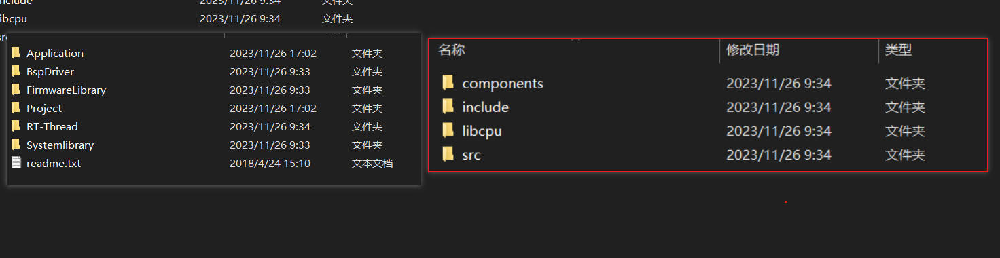

   | components | Finsh                        |
   | :--------: | ---------------------------- |
   |  include   | 头文件                       |
   |   libcpu   | Cortex M0/ M3/ M4/ M7/RISC-V |
   |    src     | 内核源代码（重点）           |

   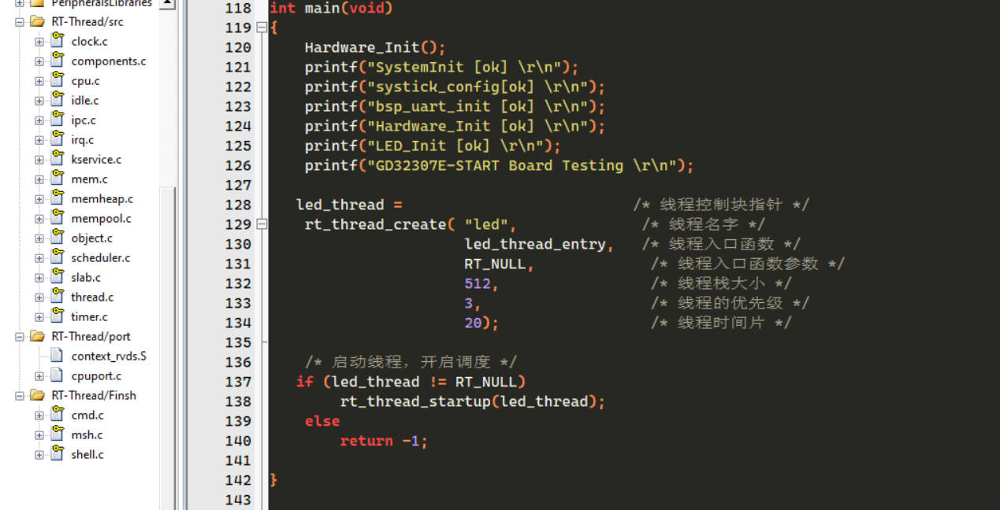

   2. 需要注意是，RT-Thread/port里面需要选择与芯片匹配的文件，GD32F307E-START Board是Cortex-M4内核的芯片，选择添加相关文件。Cortex-M 芯片内核移植文件如下：

   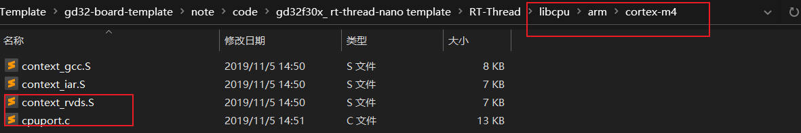

   3. RT-Thread 会接管异常处理函数 `HardFault_Handler()` 和悬挂处理函数 `PendSV_Handler()`，这两个函数已由 RT-Thread 实现，所以需要删除工程里中断服务例程文件中的这两个函数，避免在编译时产生重复定义。如果此时对工程进行编译，没有出现函数重复定义的错误，则不用做修改。因此在我们的工程里面需要把gd32f30x_it.c文件中的HardFault_Handler、PendSV_Handler、SysTick_Handler函数注释掉。

   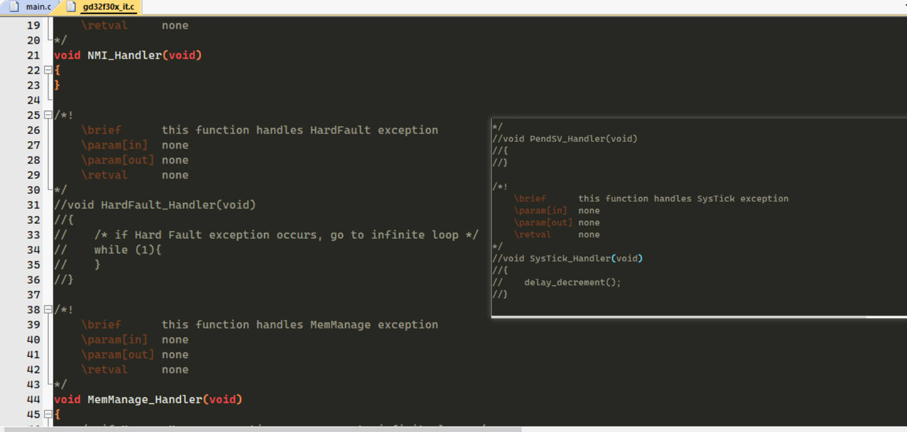

   4. 添加board.c rtconfig.h文件，这两个文件非常重要。重点需要修改这两个文件。

      修改rt_hw_board_init,SystemClock_Config();你可以main函数里的systick_config();注释掉

      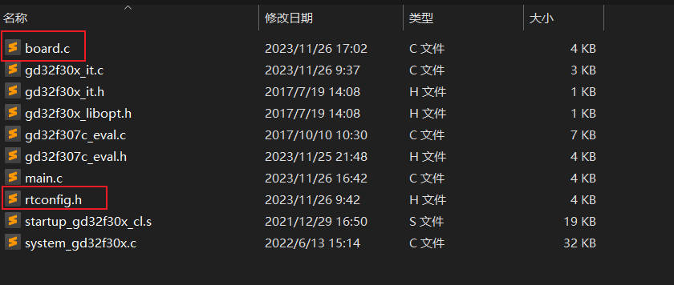

      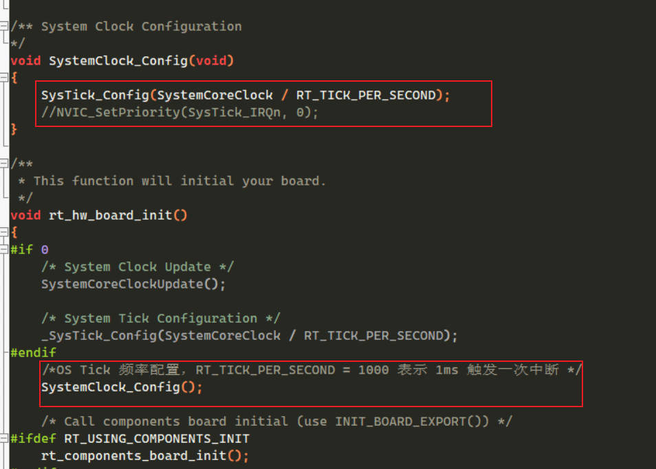

      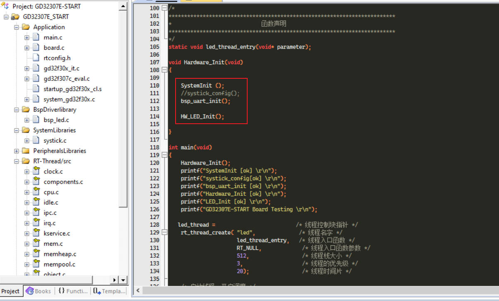

   5. 由于 `SysTick_Handler()` 中断服务例程由用户在 board.c 中重新实现，做了系统 OS Tick，所以还需要删除工程里中原本已经实现的 `SysTick_Handler()` ，避免在编译时产生重复定义。如果此时对工程进行编译，没有出现函数重复定义的错误，则不用做修改。

      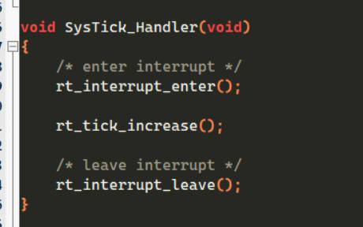

   6. 系统内存堆的初始化在 board.c 中的 rt_hw_board_init() 函数中完成，内存堆功能是否使用取决于宏 RT_USING_HEAP 是否开启，RT-Thread Nano 默认不开启内存堆功能，这样可以保持一个较小的体积，不用为内存堆开辟空间。开启系统 heap 将可以使用动态内存功能，如使用 rt_malloc、rt_free 以及各种系统动态创建对象的 API。若需要使用系统内存堆功能，则打开 RT_USING_HEAP 宏定义即可，此时内存堆初始化函数 rt_system_heap_init() 将被调用.

      初始化内存堆需要堆的起始地址与结束地址这两个参数，系统中默认使用数组作为 heap，并获取了 heap 的起始地址与结束地址，该数组大小可手动更改.

      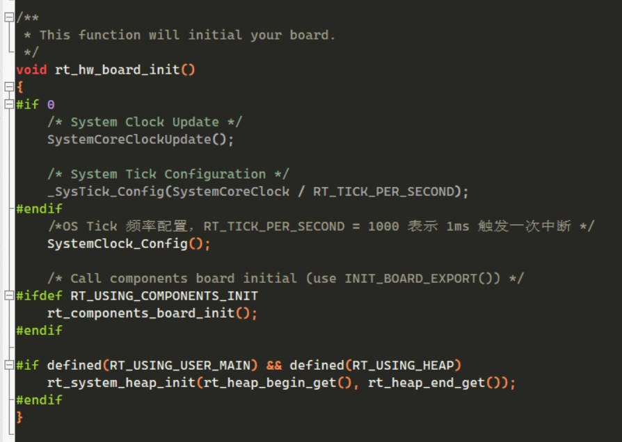

      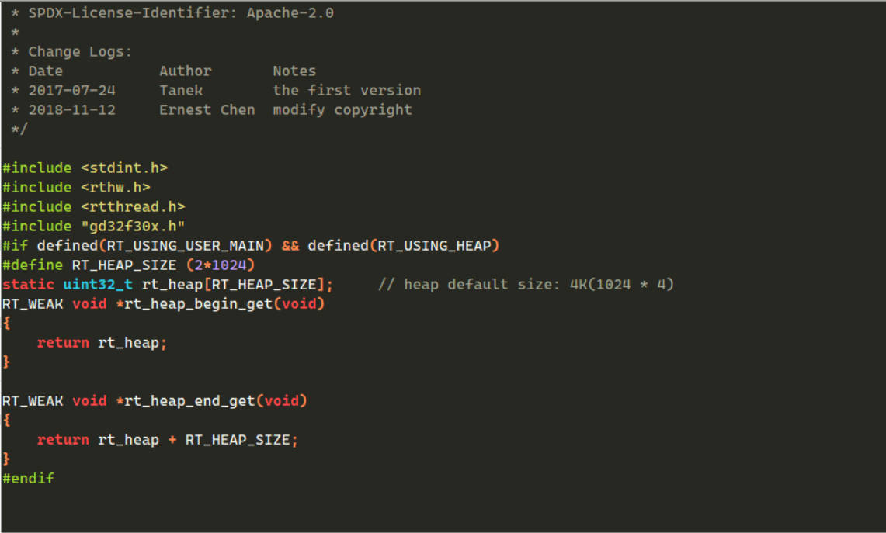

   注意：开启 heap 动态内存功能后，heap 默认值较小，在使用的时候需要改大，否则可能会有申请内存失败或者创建线程失败的情况，修改方法有以下两种：

   - 可以直接修改数组中定义的 RT_HEAP_SIZE 的大小，至少大于各个动态申请内存大小之和，但要小于芯片 RAM 总大小。
   - 也可以参考 [《RT-Thread Nano 移植原理》——实现动态内存堆](https://www.rt-thread.org/document/site/#/rt-thread-version/rt-thread-nano/nano-port-principle/an0044-nano-port-principle) 章节进行修改，使用 RAM ZI 段结尾处作为 HEAP 的起始地址，使用 RAM 的结尾地址作为 HEAP 的结尾地址，这是 heap 能设置的最大值的方法。

   7. 编写主程序代码

      创建一个线程，同时支持串口打印

      ```c
      /*!
          \file  main.c
          \brief USART printf demo
      */
      
      /*
          Copyright (C) 2017 GigaDevice
      
          2018-04-25, V1.0.0, demo for GD32F30x
      */
      
      #include "gd32f30x.h"
      #include "systick.h"
      #include <stdio.h>
      #include <rtthread.h>
      #include "bsp_led.h"
      
      
      /* retarget the C library printf function to the USART */
      int fputc(int ch, FILE *f)
      {
          usart_data_transmit(USART0 , (uint8_t)ch);
          while(RESET == usart_flag_get(USART0 , USART_FLAG_TBE));
          return ch;
      }
      
      /*****************************************************************************
        * @brief  This function
        * @param  None
        * @retval None
        */
      void bsp_uart_init(void)
      {
      	
          /* enable GPIO clock */
          rcu_periph_clock_enable(RCU_GPIOB);
      		
          /* enable AF clock */
      	rcu_periph_clock_enable(RCU_AF);
      
          /* enable USART clock */
          rcu_periph_clock_enable(RCU_USART0);
      
          /* connect port to USARTx_Tx */
          gpio_init(GPIOB, GPIO_MODE_AF_PP, GPIO_OSPEED_50MHZ, GPIO_PIN_6);
      
          /* connect port to USARTx_Rx */
          gpio_init(GPIOB, GPIO_MODE_IN_FLOATING, GPIO_OSPEED_50MHZ, GPIO_PIN_7);
          
      	/* USART0 remap configure */
      	  gpio_pin_remap_config(GPIO_USART0_REMAP,ENABLE);
      		
          /* USART configure */
          usart_deinit(USART0);
      		
          usart_baudrate_set(USART0, 115200U);
      		
          usart_receive_config(USART0, USART_RECEIVE_ENABLE);
      		
          usart_transmit_config(USART0, USART_TRANSMIT_ENABLE);
      		
          usart_enable(USART0);	
      	
      }
      
      
      /* 定义线程控制块 */
      static rt_thread_t led_thread = RT_NULL;
      
      /*
      *************************************************************************
      *                             线程定义
      *************************************************************************
      */
       
      static void led_thread_entry(void* parameter)
      {	
      	while (1)
      	{
      
              gpio_bit_set(GPIOC,GPIO_PIN_6);
              rt_thread_delay(500);   /* 延时500个tick */
              rt_kprintf("led_thread running,LED1_ON\r\n");
              
              gpio_bit_reset(GPIOC,GPIO_PIN_6);    
              rt_thread_delay(500);   /* 延时500个tick */		 		
              rt_kprintf("led_thread running,LED1_OFF\r\n"); 
      
      
              rt_kprintf("led_thread running,LED2_ON\r\n");     
              rt_thread_delay(500);   /* 延时500个tick */
              
              rt_kprintf("led_thread running,LED2_OFF\r\n");
              rt_thread_delay(500);   /* 延时500个tick */
              
      	
      	}
      }
      
      /*
      *************************************************************************
      *                             函数声明
      *************************************************************************
      */
      static void led_thread_entry(void* parameter);
      
      void Hardware_Init(void)
      {
      
          SystemInit (); 
         	//systick_config();
          bsp_uart_init();
      
          HW_LED_Init();  
          
      }
      
      int main(void)
      {
      	Hardware_Init();
          printf("SystemInit [ok] \r\n");
          printf("systick_config[ok] \r\n");
          printf("bsp_uart_init [ok] \r\n");
          printf("Hardware_Init [ok] \r\n");
          printf("LED_Init [ok] \r\n");
          printf("GD32307E-START Board Testing \r\n");
      
         led_thread =                          /* 线程控制块指针 */
          rt_thread_create( "led",              /* 线程名字 */
                            led_thread_entry,   /* 线程入口函数 */
                            RT_NULL,             /* 线程入口函数参数 */
                            512,                 /* 线程栈大小 */
                            3,                   /* 线程的优先级 */
                            20);                 /* 线程时间片 */
                         
          /* 启动线程，开启调度 */
         if (led_thread != RT_NULL)
              rt_thread_startup(led_thread);
          else
              return -1;
          
      }
      
      ```

      需要注意的是，用于finish打印，实现rt_ktprintf() 此函数可以在kservies.c中实现

      如果需要使用Finsh组件，需要添加相关的代码文件,并且添加rt_hw_console_getchar()代码实现

      ```c
      //用于finish打印，实现rt_ktprintf()
      //此函数可以在kservies.c中实现
      void rt_hw_console_output(const char *str)
      {
      //    printf(str);
       
            rt_size_t i = 0, size = 0;
            char a = '\r';
            size = rt_strlen(str);
            
            for (i = 0; i < size; i++)
              {
                      if ( *(str+i) == '\n')
                      {
                           usart_data_transmit(USART0,a);
                           while(RESET == usart_flag_get(USART0, USART_FLAG_TBE));
                      }
                      usart_data_transmit(USART0, *(str+i));
                      while(RESET == usart_flag_get(USART0, USART_FLAG_TBE));
              }
       
      }
      
      //用于finish输入
      char rt_hw_console_getchar(void)
      {
            int ch =-1;
           
            if( usart_flag_get(USART0,USART_FLAG_RBNE) != RESET)
              {
                 ch  =   (uint8_t)usart_data_receive(USART0);
                 
       
              }
            else{
                  if ( usart_flag_get(USART0,USART_FLAG_ORERR) != RESET)
                  {
                      usart_flag_clear(USART0, USART_FLAG_RBNE);
                      //rt_thread_mdelay(10);
                  }
       
            }
            
            return ch;
      }
      
      ```

   测试效果：

   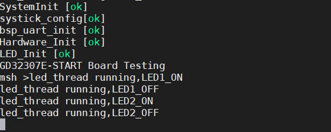

   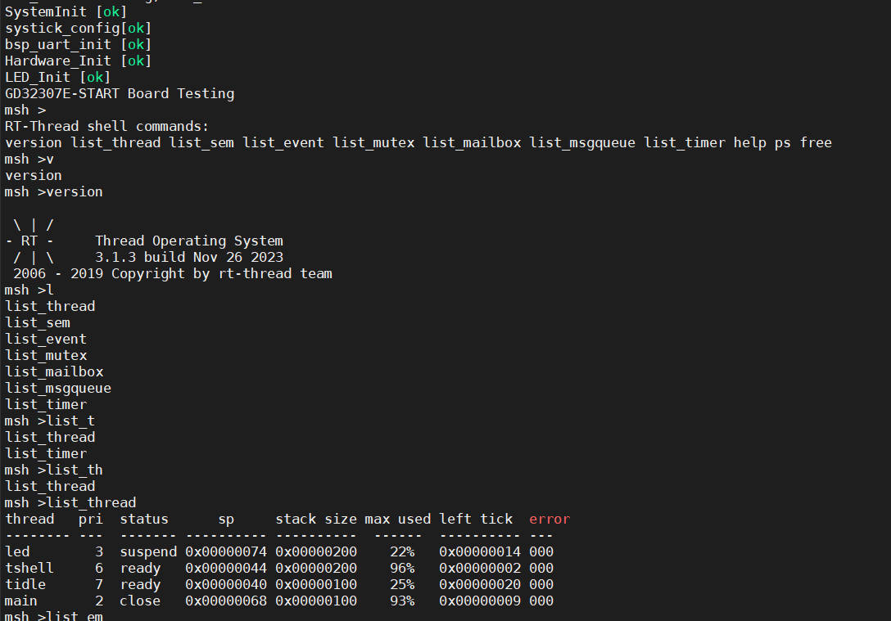

   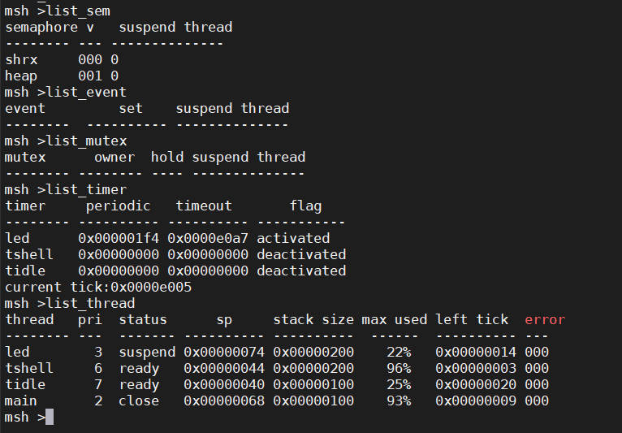

其实gcc的工程 我也进行了实验，但是虽然能下载程序了，但是不能进入内核出现错误，后面有时间再看看吧，有时间继续实践里面的各个example，完成rt-thread的学习。

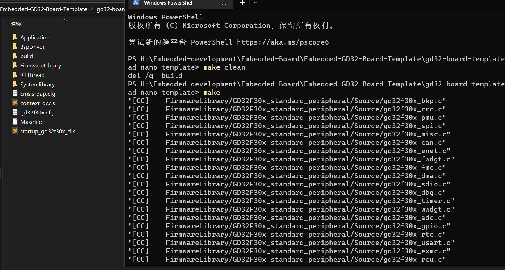

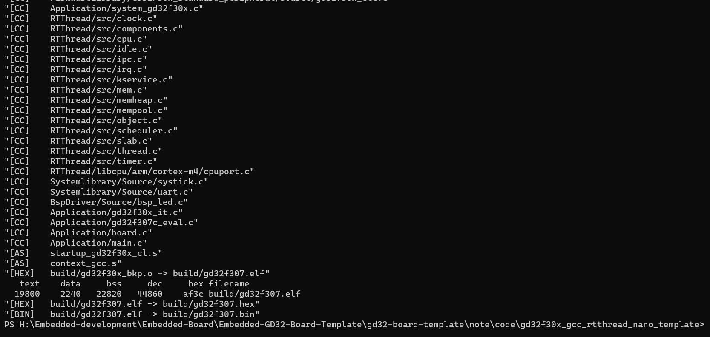

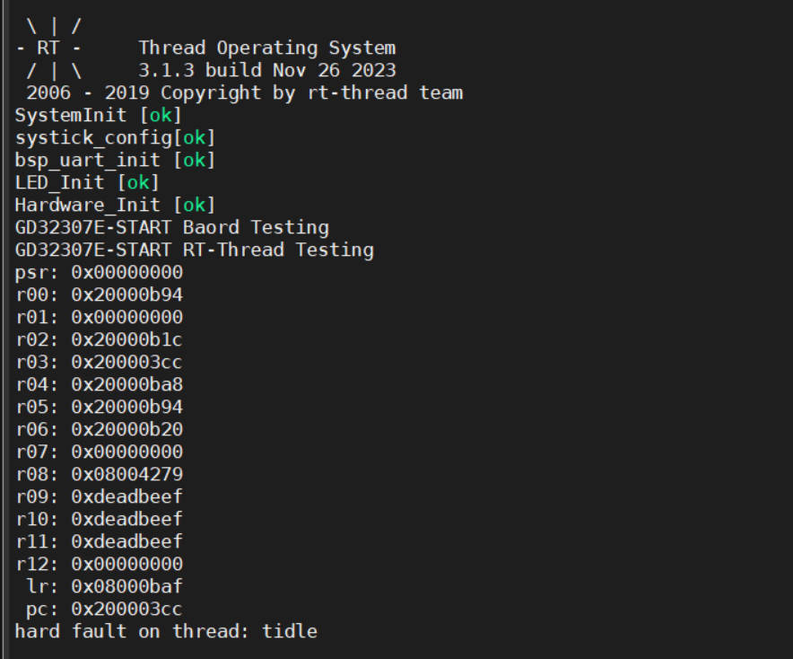

2. RT-Thread 完整版测试

   在RT-Thread的官方仓库里面有这个板子的bsp,但是我进行了下载程序，不是这个程序的效果。后面有时间再看看吧。

   https://gitee.com/rtthread/rt-thread/tree/master/bsp/gd32/arm/gd32307e-start
