
## 立创开发板 开源嵌入式组件移植测试 02-嵌入式框架Zorb Framework移植 


###  Zorb Framework

 Zorb Framework是一个轻量级的嵌入式框架，搭建目的是为在不能运行Linux的芯片上快速开发应用，不用反复造轮子。

 Zorb Framework的初步设计功能有

 1、时间系统功能zf_time

 2、环形缓冲区功能zf_buffer

 3、列表功能zf_list

 4、状态机功能zf_fsm

 5、事件功能zf_event

 6、定时器功能zf_timer

 7、任务功能zf_task

 前6个功能，就可以实现纯事件驱动的程序，基本可以满足中小型嵌入式应用程序开发的需求。加上任务功能，是为了满足部分程序对实时性要求较高的需求。当然，也可以将前6个功能裁剪出来，然后运行在现有的嵌入式系统上面，这样子也可以满足实时性的需求。


### 一、移植前的准备

####    1. 准备目标硬件（开发板/芯片/模组）

Zorb Framework支持ARM Cortex M3/M4的内核的芯片的移植。本教程将使用立创开发板GD32F407进行示例移植，其他 ARM Cortex M3/M4系列开发板和芯片移植方法类似。

调试ARM Cortex M核还需要仿真器，如果您的开发板或者芯片模组没有板载仿真器，就需要连接外置的仿真器，如J-Link、DAPLink之类的。

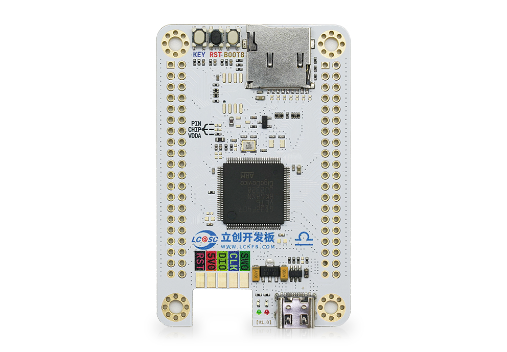


####    2.准备编译器环境

本移植指南针对的是Keil编译器，所以我们移植内核前需要先安装Keil编译器，能编译ARM Cortex M核的Keil编译器现在也叫MDK。

下载地址为：https://www.keil.com/demo/eval/arm.htm

####   3. 准备芯片对应的裸机工程

移植Zorb Framework基础内核需要您提前准备一个芯片对应的裸机工程，裸机工程包含基本的芯片启动文件、基础配置（时钟、主频等）、以及串口1和systick，其中串口1提供调试打印功能，systick提供系统时间计数功能。

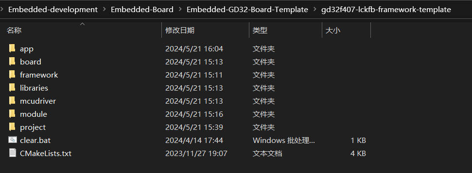

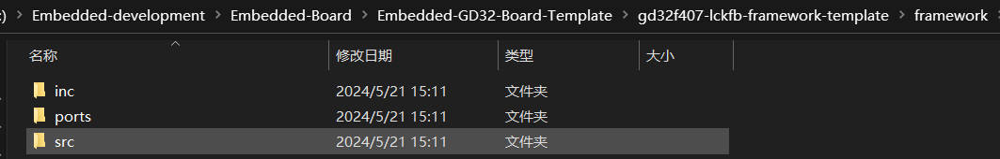

####    4. 准备Zorb Framework的源码
Zorb Framework的源码已经开源，github仓库地址 https://github.com/54zorb/Zorb-Framework)

| 一级目录 | 说明                                                |
| -------- | --------------------------------------------------- |
| inc      | Zorb Framework  头文件                              |
| ports    | Zorb Framework 接口文件  支持ARM Cortex M3/M4的内核 |
| src      | Zorb Framework 源代码文件                           |

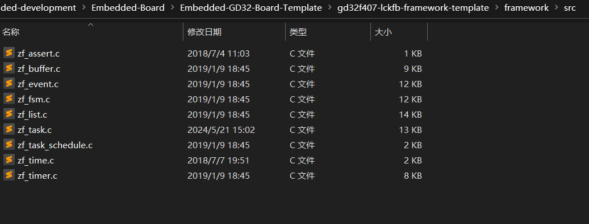

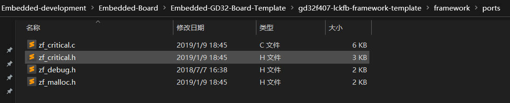

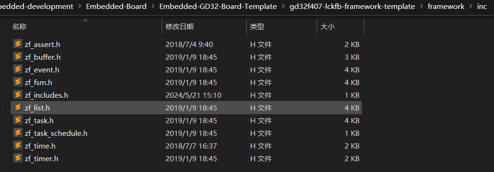


### 二、移植

打开keil工程，开始添加Zorb Framework的内核代码。

####  1. 添加Zorb Framework源代码文件

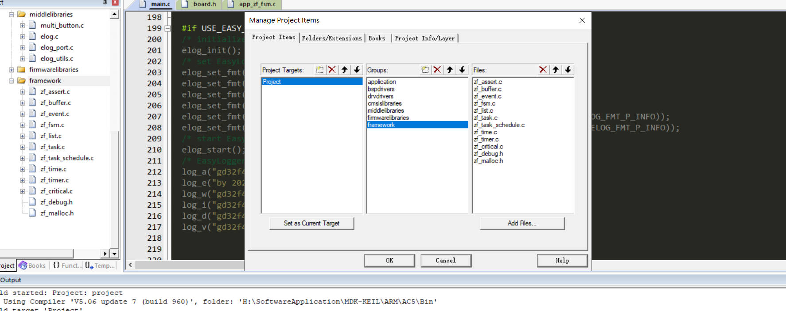

####  2. 添加Zorb Framework头文件目录

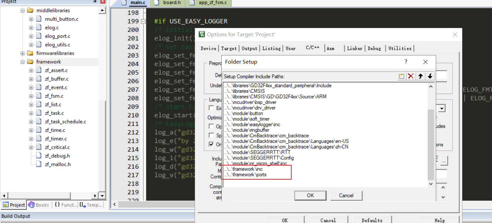

####  3. 系统滴答计数器 中断相关配置

1. 配置SysTick_Handler

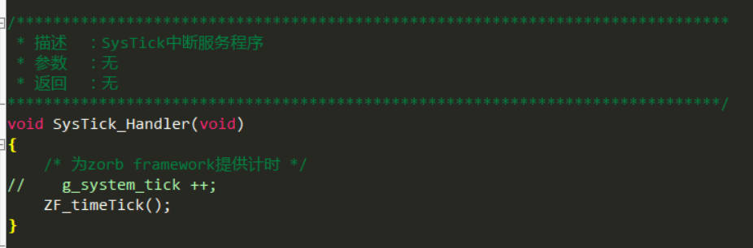

2. 配置systick_config

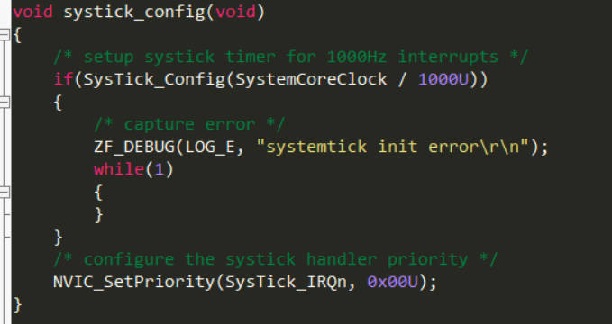

3. 初始化systick_config 初始化系统时基

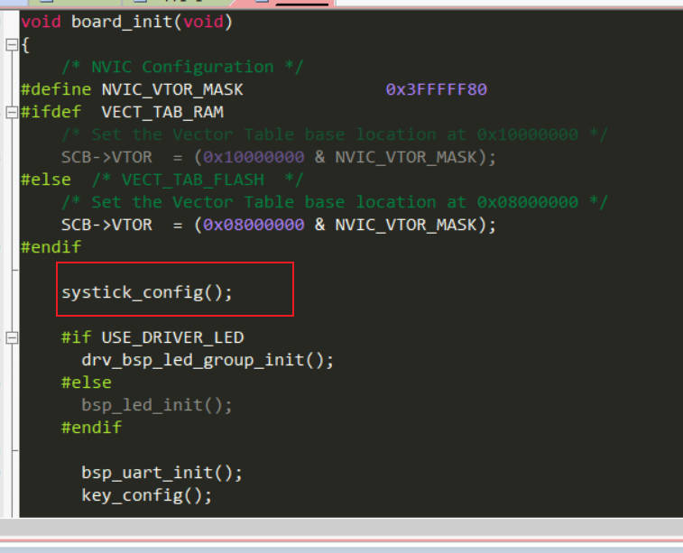

4. 注释PendSV_Handler 

   Zorb Framework提供的任务功能比较简单，状态也只有运行和关闭两种状态。任务功能实现的关键在于任务调度，而任务调度的核心又在于任务堆栈的保存和恢复。这部分需要根据使用的芯片进行修改，在GD32中，通过触发PendSV异常进行任务切换：

   **Zorb Framework重写了endSV_Handler** 

   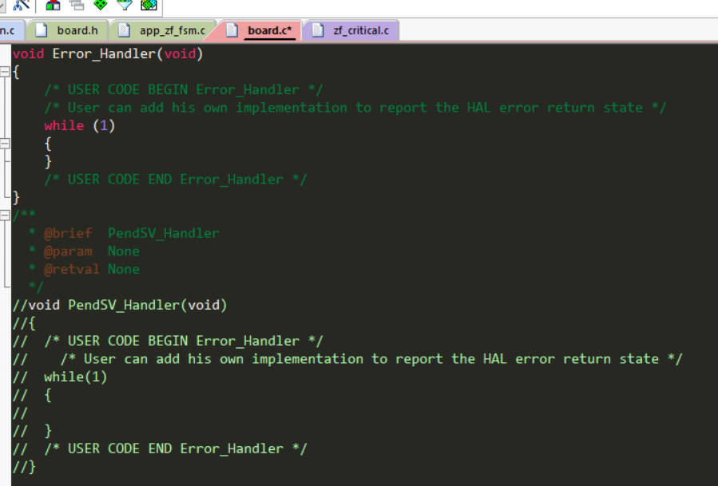

   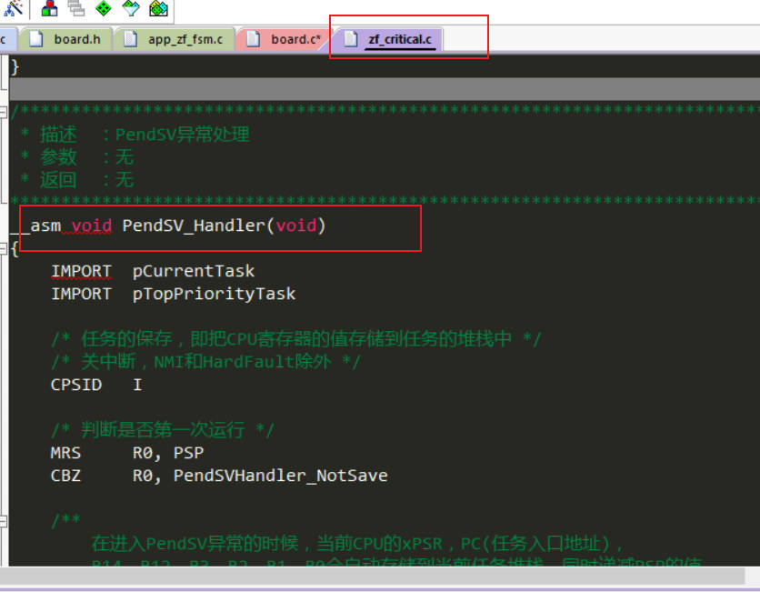

这样Zorb Framework源码就全部添加完毕了。

###  三、测试移植结果

####  1. 添加app_test测试代码

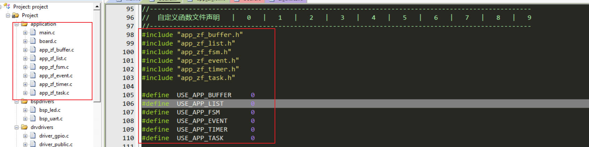

####  2. 编写测试代码

```c
/*
 * 立创开发板GD32F407VET6
 * Change Logs:
 * Date           Author       Notes
 * 2024-5-21      Coderend     first version
 */
#include "board.h"
#include "zf_includes.h"
#define LOG_TAG    "main"

/*
	MAIN_Function
*/
int main(void)
{
	
  /* initialize board */
  board_init();
	
  ZF_DEBUG(LOG_D,"Hardware_Init [ok] \r\n");
  ZF_DEBUG(LOG_D,"gd32f407 lckfb-board testing 2024-05-21 [ok]\r\n");
  ZF_DEBUG(LOG_D,"gd32f407 lckfb-board zf-framework [ok]\r\n");
  ZF_DEBUG(LOG_D, "init time used:%dms\r\n", ZF_SYSTIME_MS());
  ZF_DEBUG(LOG_D, "zorb framework run\r\n");

  //测试 app_test 需要打开main.h 中的宏定义
	#if USE_APP_BUFFER 
	App_Buffer_init();
	App_Buffer_process();
	#endif
	
	#if USE_APP_LIST 
	App_List_init();
	App_List_process();
	#endif
	
	#if USE_APP_FSM 
	App_Fsm_init();
	App_Fsm_process();
	#endif
	
	#if USE_APP_EVENT
	App_Event_init();
	App_Event_process();
	#endif
  
	#if USE_APP_TIMER
	App_Timer_init();
	App_Timer_process();
	#endif
	
	#if USE_APP_TASK 
	App_Task_init();
	#endif

  while (1)
    {
			#if 0
			drv_bsp_led_on(&LED_1);
			ZF_DELAY_MS(500);
			ZF_DEBUG(LOG_D, "init time used:%dms\r\n", ZF_SYSTIME_MS());
			ZF_DEBUG(LOG_D, "drv_bsp_led1 on [ok]\r\n");
			drv_bsp_led_off(&LED_1);
			ZF_DELAY_MS(500);
			ZF_DEBUG(LOG_D, "init time used:%dms\r\n", ZF_SYSTIME_MS());
			ZF_DEBUG(LOG_D, "drv_bsp_led1 off [ok]\r\n");
		  drv_bsp_led_on(&LED_2);
			ZF_DELAY_MS(1000);
			ZF_DEBUG(LOG_D, "init time used:%dms\r\n", ZF_SYSTIME_MS());
			ZF_DEBUG(LOG_D, "drv_bsp_led2 on [ok]\r\n");
			drv_bsp_led_off(&LED_2);
			ZF_DELAY_MS(1000);
			ZF_DEBUG(LOG_D, "init time used:%dms\r\n", ZF_SYSTIME_MS());
			ZF_DEBUG(LOG_D, "drv_bsp_led2 off [ok]\r\n");
			#endif
    }
}


```

```c
/*
 * 立创开发板GD32F407VET6
 * Change Logs:
 * Date           Author       Notes
 * 2024-4-11      Coderend     first version
 */
#ifndef __BOARD_H__
#define __BOARD_H__

//--------------------------------------------------------------------------------------------------
//  驱动库宏定义   |   0   |   1   |   2   |   3   |   4   |   5   |   6   |   7   |   8   |   9   
//--------------------------------------------------------------------------------------------------
#define  USE_DRIVER_LED   	1
#define  USE_CM_BACKTRACE 	0
#define  USE_EASY_LOGGER  	0
#define  USE_SEGGER_RTT   	0
#define  USE_MULTI_BUTTON   0
#define  USE_SOFT_TIMER   	0
//--------------------------------------------------------------------------------------------------
//  C库函数调用头文件    |   0   |   1   |   2   |   3   |   4   |   5   |   6   |   7   |   8   |   9   
//--------------------------------------------------------------------------------------------------
#include <stdint.h>
#include <stdbool.h>
#include <string.h>
#include <stdarg.h>
#include <stdlib.h>  
#include <stdio.h>   
#include <math.h>
//--------------------------------------------------------------------------------------------------
//  数据类型重定义   |   0   |   1   |   2   |   3   |   4   |   5   |   6   |   7   |   8   |   9   
//--------------------------------------------------------------------------------------------------
/**************************************************************************************************
typedef unsigned char               uint8_t;
typedef unsigned short              uint16_t;
typedef unsigned long               uint32_t;
typedef unsigned long long int      uint64_t;

typedef signed char                 int8_t;
typedef signed short                int16_t;
typedef signed long                 int32_t;
typedef long long int               int64_t;

C语言数据类型
整型（int）、单精度浮点型（float）
双精度浮点型（double）、字符型（char）

整型（int）类型又划分了 
long int（也可以直接写为long） 、long long int（可以直接写为long long） 、short int（可以直接写为short）
指针类型：void *；

空类型：void；

构造类型：数组、结构体（strtuct）、共用体类型（union）、枚举类型（enum）；

1字节(Byte) = 8位(bit)   1Byte=8bi 
******************************************************************************************************/
//--------------------------------------------------------------------------------------------------
// GD32_STD库文件   |   0   |   1   |   2   |   3   |   4   |   5   |   6   |   7   |   8   |   9   
//--------------------------------------------------------------------------------------------------
#include "gd32f4xx.h"
#include "gd32f4xx_libopt.h"
#include "gd32f4xx_exti.h"

//--------------------------------------------------------------------------------------------------
//  中间件驱动文件   |   0   |   1   |   2   |   3   |   4   |   5   |   6   |   7   |   8   |   9   
//--------------------------------------------------------------------------------------------------
#include "elog.h"
#include "multi_button.h"

//--------------------------------------------------------------------------------------------------
//  Drv_Drivers文件   |   0   |   1   |   2   |   3   |   4   |   5   |   6   |   7   |   8   |   9   
//--------------------------------------------------------------------------------------------------
#include "driver_public.h"
#include "driver_gpio.h"
//--------------------------------------------------------------------------------------------------
//  BSP_Drivers文件   |   0   |   1   |   2   |   3   |   4   |   5   |   6   |   7   |   8   |   9   
//--------------------------------------------------------------------------------------------------
#include "bsp_uart.h"
#include "bsp_led.h"

//--------------------------------------------------------------------------------------------------
//  板载模块   |   0   |   1   |   2   |   3   |   4   |   5   |   6   |   7   |   8   |   9   
//--------------------------------------------------------------------------------------------------
/* 定义key的引脚 */
#define BSP_KEY_RCU      RCU_GPIOA
#define BSP_KEY_PORT     GPIOA
#define BSP_KEY_PIN      GPIO_PIN_0
#define NULL             0


#define ARRAYNUM(arr_nanme)      (uint32_t)(sizeof(arr_nanme) / sizeof(*(arr_nanme)))
#define TRANSMIT_SIZE            (ARRAYNUM(txbuffer) - 1)


//--------------------------------------------------------------------------------------------------
//  自定义函数文件声明   |   0   |   1   |   2   |   3   |   4   |   5   |   6   |   7   |   8   |   9   
//--------------------------------------------------------------------------------------------------
#include "app_zf_buffer.h"
#include "app_zf_list.h"
#include "app_zf_fsm.h"
#include "app_zf_event.h"
#include "app_zf_timer.h"
#include "app_zf_task.h"

#define  USE_APP_BUFFER   	0
#define  USE_APP_LIST   	0
#define  USE_APP_FSM     	0
#define  USE_APP_EVENT     	0
#define  USE_APP_TIMER     	0
#define  USE_APP_TASK     	0

void board_init(void);
uint32_t get_system_tick(void);
void delay_us(uint32_t _us);
void delay_ms(uint32_t _ms);

#endif

```

####  3. 编译下载观察效果

1. 测试时基释放正常输出（ZF_DEBUG，ZF_TIME）

   将while(1) 循环中的  #if 0 修改 #if 1

   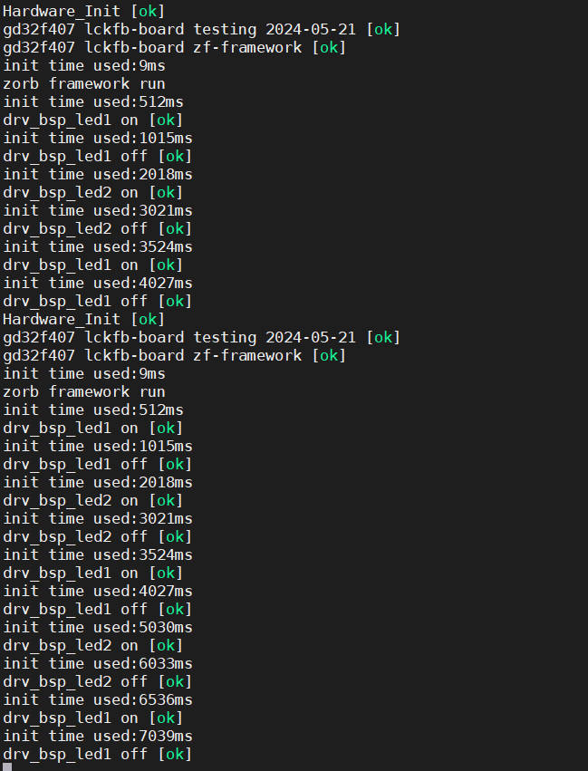

2. 测试zf_buffer

   **#define  USE_APP_BUFFER   	1**

   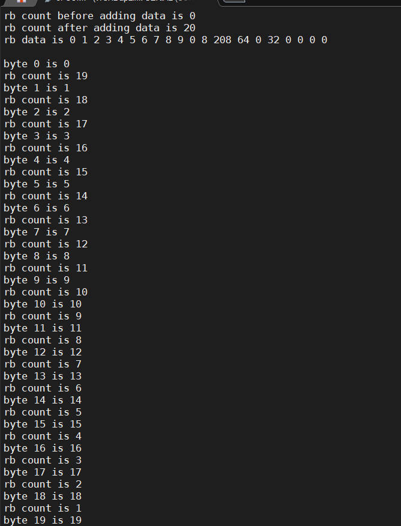

3. 测试zf_list

   **#define  USE_APP_LIST   	  1**

   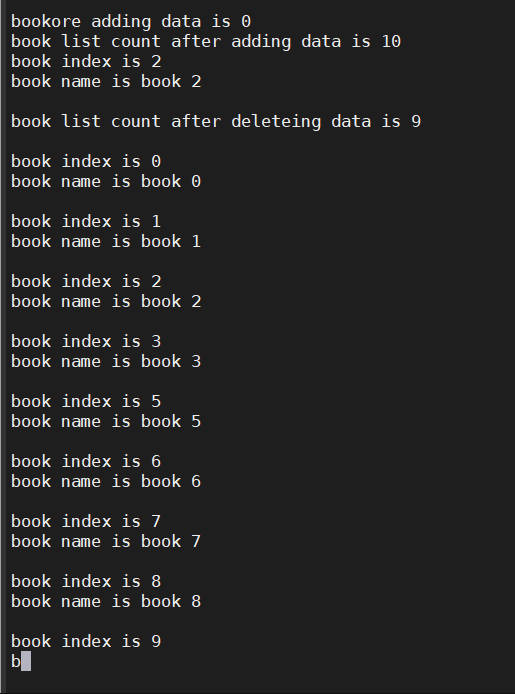

4. 测试zf_fsm

   **#define  USE_APP_FSM   	  1**

   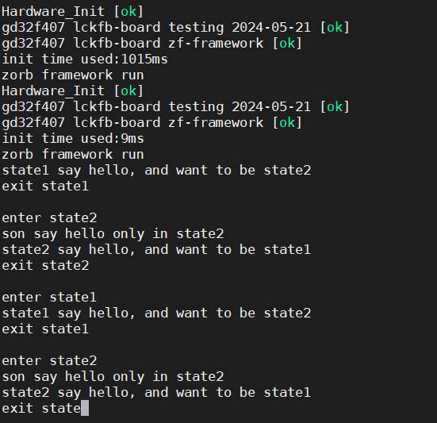

5. 测试zf_event

   **#define  USE_APP_EVENT   	  1**

   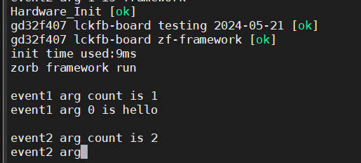

6. 测试zf_task

   **#define  USE_APP_TASK   	  1**

   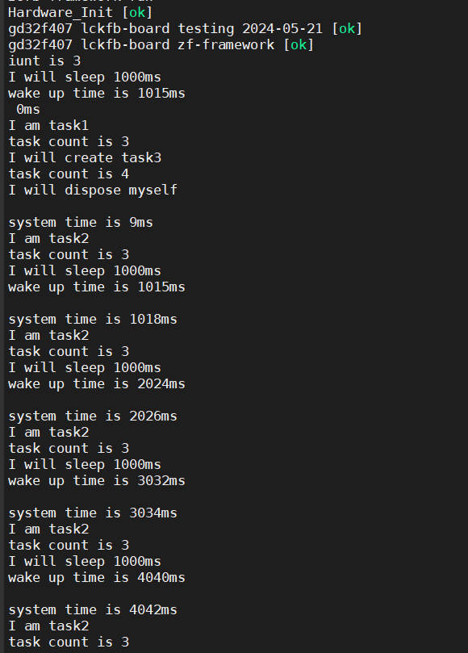

7. 测试zf_timer

   **#define  USE_APP_TIMER   	  1**

   事件和事件处理器已经设计好了，再把定时器的处理程序添加到系统滴答程序中即可：

   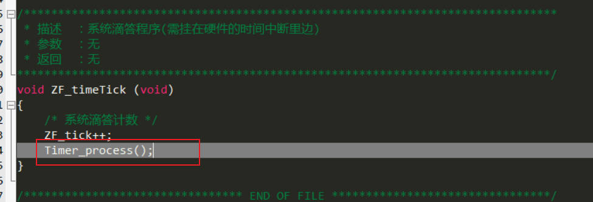

   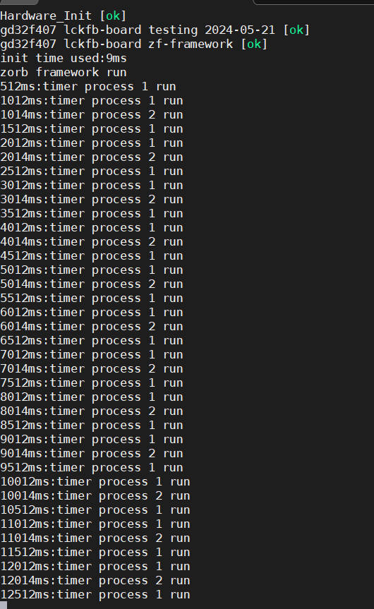
