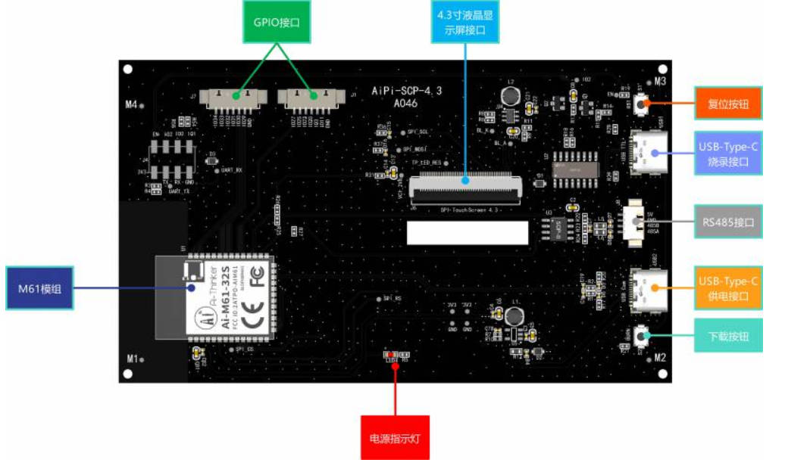
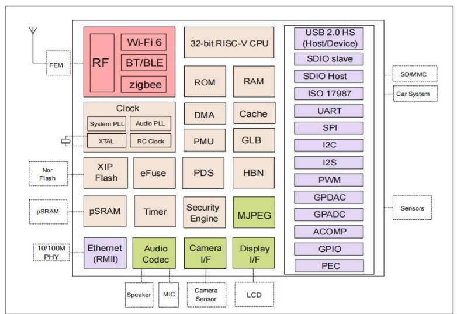
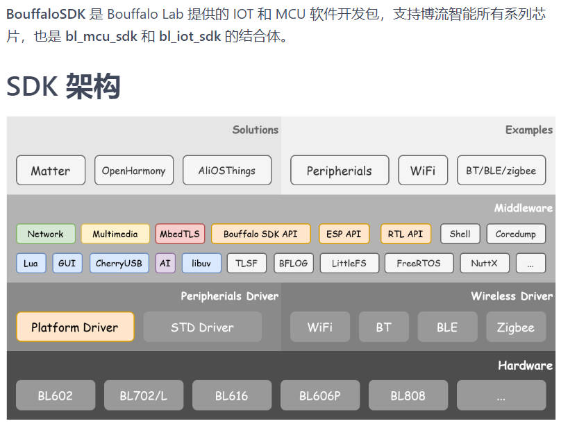
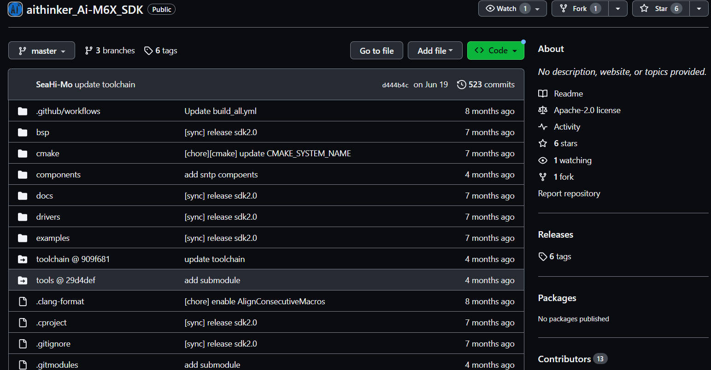
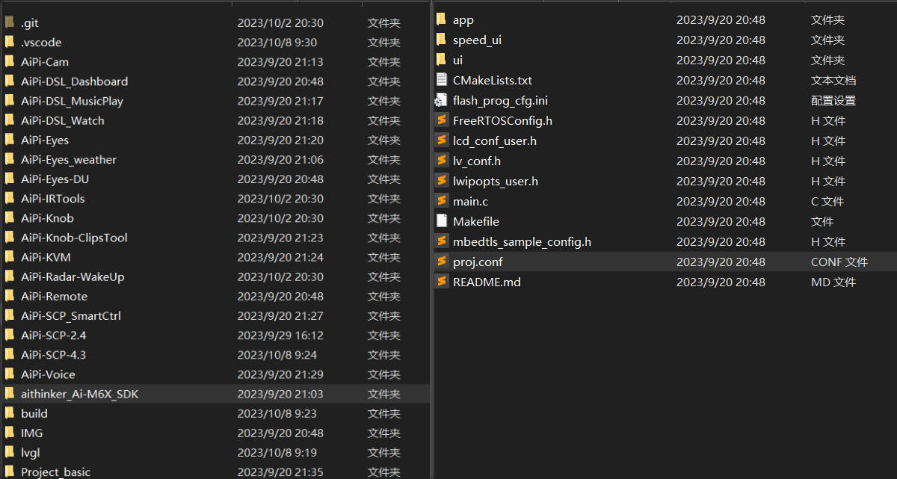
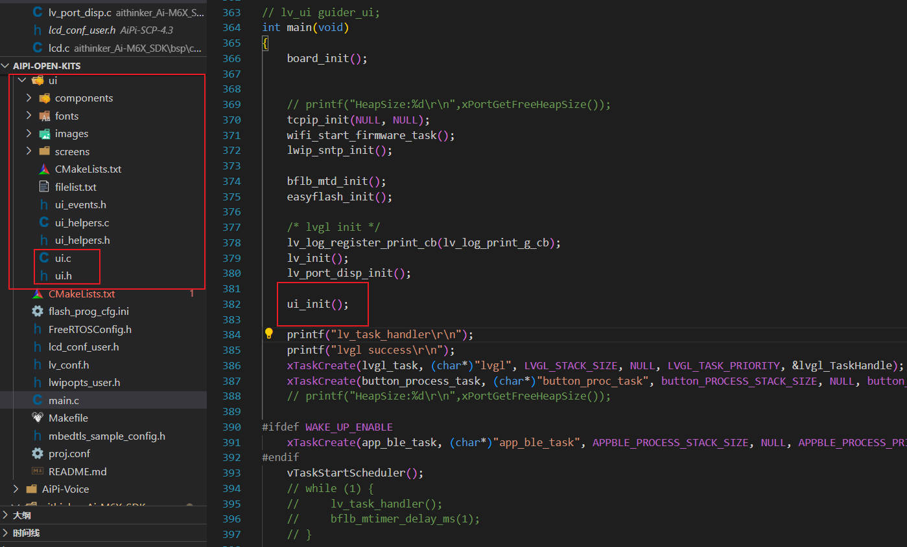
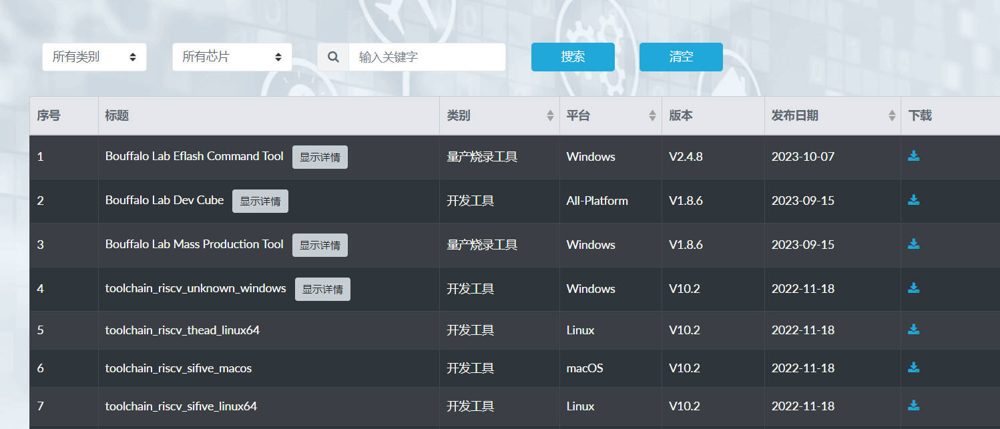
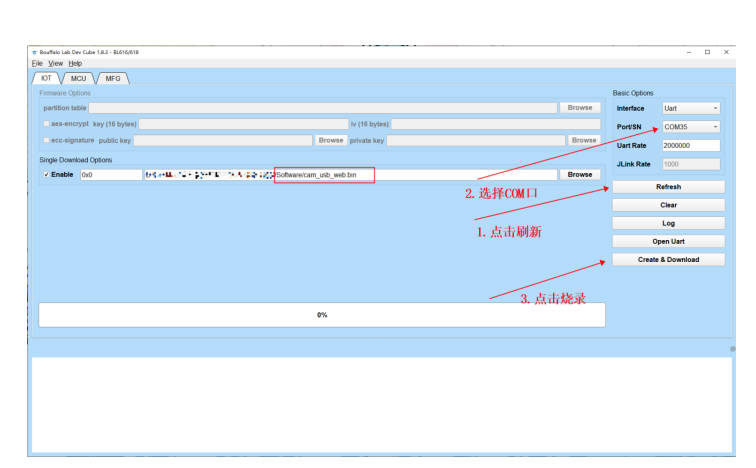
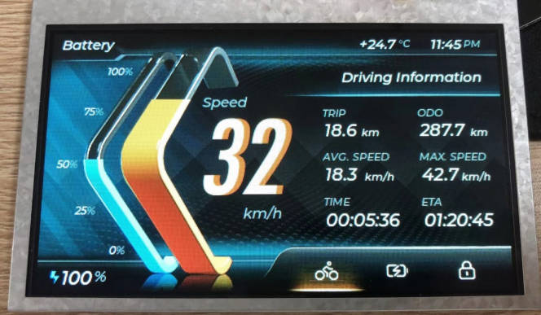

## 02-安信可小安派开发板学习 AiPi-SCP-4.3开箱体验

01-**搭建安信可小安派Windows 开发环境** http://bbs.ai-thinker.com/forum.php?mod=viewthread&tid=41723&extra=&_dsign=1cde5517

### AiPi-SCP-4.3概述



**小安派-SCP-4.3用Ai-M61-32S模组**作为控制核心，采用Type-C接口进行供电，**通过SPI接口连接4.3英寸的RGB液晶显示屏**，外接的TTL转485**提供了485协议通讯功能,**适用于电动车等两轮车设备。所搭载的Ai-M61-32S 模组具有丰富的外设接口，具体包括 DVP、MJPEG、Dispaly、AudioCodec、USB2.0、SDU、以太网 (EMAC)、SD/MMC(SDH)、SPI、UART、I2C、I2S、PWM、GPDAC、GPADC、ACOMP 和 GPIO 等。

**Ai-M61-32S 是由深圳市安信可科技有限公司开发的 Wi-Fi 6+BLE5.3 模组**，该模组搭载**博流BL618 芯片**作为核心处理器，支持 Wi-Fi 802.11b/g/n/ax 协议和BLE 协议，支持Thread协议。**BL618 系统包含一个带有浮点单元、DSP 单元、高速缓存和存储器的低功耗32位 RISC-V CPU，最高主频可达 320M**。



Bouffalo SDK是Bouffalo Lab团队提供的物联网和MCU第三方开发工具，支持所有Bouffalo系列芯片。也是bl_mcu_sdk和bl_iot_sdk的结合。仓库地址如下：

```bash
https://gitee.com/bouffalolab/bouffalo_sdk
```



在AiPi-Open-Kits里面aithinker_Ai-M6X_SDK基本上就是在Bouffalo SDK进行修改的，从而得到安信可小安派的SDK开发环境。

```bash
https://github.com/Ai-Thinker-Open/aithinker_Ai-M6X_SDK
```



在搭建小安派的环境中，需要下载aithinker_Ai-M6X_SDK。通过官方的git请求容易出现拉取不下来，总是出现问题。有的人很快的下载下来，但我没有成功拉取下来。然后我直接就在github下载了，有上网能力的话可能速度比较快点。

但是下载toolchain tools是空文件夹，需要从gituhub更新下载，但是我在实验过程中发现速度太慢，而且经常性拉取不下来，所以使用了其他的方法，直接使用了博流的bouffalo_sdk/tools  toolchain_gcc_t-head_windows仓库里面的工具链。

```bash
toolchain:
	https://gitee.com/bouffalolab/toolchain_gcc_t-head_windows.git
tools:
	https://github.com/bouffalolab/bouffalo_sdk.git
```

参考官方教程或者**搭建安信可小安派Windows 开发环境**内容，搭建基础环境。

### AiPi-SCP-4.3工程




在小安派-SCP-4.3 出厂Demo中，使用了LVGL GUI图形库，其中speed_ui，ui是UI设计文件。

- **speed_ui**

​	speed_ui的文件生成是通过GUI-Guider生成的。GUI Guider是恩智浦为LVGL开发了一个上位机GUI设计工具，**目前可以免费使用**，可以通过拖放控件的方式设计LVGL GUI页面，加速GUI的设计。设计完成的GUI页面可以在PC上仿真运行，确认设计完毕之后可以生成C代码，再整合到MCU项目中。

- **ui**

ui的文件生成是LVGL官方推出的SquareLine Studio设计器，**目前可以免费试用，时间期限到了需要付费**。

我准备使用GUI Guider准备修改一下工程，但是移植出现了问题，这个问题有时间在看看吧。在小安派-SCP-4.3 出厂Demo中使用的第二种。



- **app**

  在官方的小安派-SCP-4.3出厂固件中，有两种类型，一种就是单独的出厂固件，**第二种是小安派-SCP-4.3蓝牙接近唤醒固件**, app_ble应该就是应用代码。

  ```bash
  app_ble.c
  app_ble.h
  hog_kb.c
  hog_kb.h
  ```

- CMakeLists.txt

  ```cmake
  cmake_minimum_required(VERSION 3.15)
  
  include(proj.conf)
  
  find_package(bouffalo_sdk REQUIRED HINTS $ENV{BL_SDK_BASE})
  
  #添加.c源文件
  # file(GLOB_RECURSE sources "${CMAKE_CURRENT_SOURCE_DIR}/speed_ui/generated/guider_fonts/*.c")
  # file(GLOB_RECURSE sources "${CMAKE_CURRENT_SOURCE_DIR}/speed_ui/generated/images/*.c")
  # file(GLOB_RECURSE sources "${CMAKE_CURRENT_SOURCE_DIR}/speed_ui/generated/*.c")
  file(GLOB_RECURSE sources "${CMAKE_CURRENT_SOURCE_DIR}/ui/*.c")
  file(GLOB_RECURSE app "${CMAKE_CURRENT_SOURCE_DIR}/app/*.c")
  
  # User
  # sdk_add_compile_definitions(-DCONFIG_CLI_CMD_ENABLE)
  
  # sdk_add_compile_definitions(-DBL616_DHCP_DEBUG)
  target_sources(app PRIVATE
  
      # speed_ui/custom/custom.c
  )
  
  sdk_add_include_directories(.)
  
  # sdk_add_include_directories(speed_ui/generated)
  # sdk_add_include_directories(speed_ui/generated/guider_customer_fonts)
  # sdk_add_include_directories(speed_ui/generated/guider_fonts)
  # sdk_add_include_directories(speed_ui/custom)
  sdk_add_include_directories(ui)
  sdk_add_include_directories(app)
  target_sources(app PRIVATE ${sources} ${app})
  sdk_set_main_file(main.c)
  get_filename_component(PROJECT_NAME ${CMAKE_CURRENT_SOURCE_DIR} NAME)
  project(${PROJECT_NAME})
  
  ```

- Makefile

```makefile
SDK_DEMO_PATH ?= .
BL_SDK_BASE ?= $(SDK_DEMO_PATH)/../aithinker_Ai-M6X_SDK
#aithinker_Ai-M6X_SDK SDk环境

export BL_SDK_BASE

CHIP ?= bl616
BOARD ?= bl616dk
CROSS_COMPILE ?= riscv64-unknown-elf-

# add custom cmake definition
#cmake_definition+=-Dxxx=sss

include $(BL_SDK_BASE)/project.build

```

其他的基本上的配置文件，包括FreeRTOS，LCD,LVGL等文件，基本上都是通过宏定义去开启一些配置文件。

main.c是主程序代码，里面的内容还是挺多的，后续仔细分析。基本上都是硬件配置初始化，wifi，ble配置，rtos中的task,lvgl适配文件，然后就是整个工程的逻辑代码。

### 小安派-SCP-4.3 实物测试

出厂固件下载。使用USB-Type-C 线接入 USB1。

烧录工具下载：https://dev.bouffalolab.com/download



烧录工具在烧录开始后，按住“下载按钮”进入烧录模式。操作步骤如下：



注意：固件烧录完成之后，需要按一次复位按键，程序才能运行。

实物测试效果：

小安派-SCP-4.3 配备了两个按键，一个为复位按键，另一个作为下载按钮，在本示例中使用了 S2（下 载按钮）作为界面切换的按键。初始默认展示驾驶信息界面。



实物测试视频：https://www.bilibili.com/video/BV1T84y1S7zb/

