## 嵌入式面向对象   RT-Thread I/O 设备管理 设备驱动层 

注：本文转载于[《RT-Thread记录（十、全面认识 RT-Thread I/O 设备模型）》](https://mp.weixin.qq.com/s/NcAU7QrehJ5tv74Ul9_InA)

注： 本次使用的开发板 ：

​	兆易创新GD32F407 开发板

​	雅特力AT32A403A开发板


一、RT-Thread 的 I/O设备管理

1.1 什么是 I/O 设备模型

1.2 I/O 设备模型框架解析

1.3 I/O 设备操作逻辑说明

1.4 I/O 设备模型框架用处

二、I/O 设备模型操作 API

2.1 I/O 设备控制块

2.2 创建 I/O 设备相关

2.3 访问 I/O 设备相关

三、新建 I/O 设备模型实例

3.1 设备驱动层编写

3.2 应用层测试

###  **前言** 

但是RT-Thread作为一个嵌入式操作系统， RT-Thread 除了内核部分还有自己的设备框架，类似于 Linux 操作系统设备的管理方式的 I/O 设备模型。

从本文开始，我们要开始学习了解 RT-Thread 的 I/O 设备模型。

说明，概念性质的说明主要还是使用引用方式，毕竟有权威的官方在，对于一些细节的理解，我会阐述自己的看法，同时会设计一些实例加深我们对基本概念的理解。

我想做到的是，仅此一片文章，让所有人都能明白RT-Thread 的I/O 设备模型

###  **一、RT-Thread 的** **I/O设备管理** 

我们先从基本概念说起，了解RT-Thread 对 I/O 设备的管理方式，以及 I/O 设备模型框架的用途：

###  **1.1 什么是** **I/O** **设备模型** 

有些小伙伴在刚接触到这个概念的时候还不太明白， I/O 设备模型，IO口？IO口的模型？

注意这里的 I/O 指的是 Input/Output。I/O 设备，就是指的输入 / 输出设备。

所谓 I/O 设备模型，指的是 RT-Thread 把所有的 输入 / 输出设备当做一类对象，然后通过自己的一套体系对这类对象进行管理，这类 I/O 设备对象就可以认为是 I/O 设备模型。

RT-Thread 提供了一套模型框架用来对所有的输入/输出设备进行管理的，名叫 I/O 设备模型框架 ，其 位于硬件层和应用程序之间，包括IO设备管理层、设备驱动框架层和设备驱动层， 向上层层抽象，目标是针对各种不同的I/O设备提供给应用程序相同的接口,如下图：


###  **1.2** **I/O** **设备模型框架解析** 

根据上图，结合工程代码，我们对每个层分别说：

####  **1.2.1 应用程序** 

我们写的应用程序，调用 I/O 设备管理层给的接口进行底层硬件操作；

对应 main.c ：

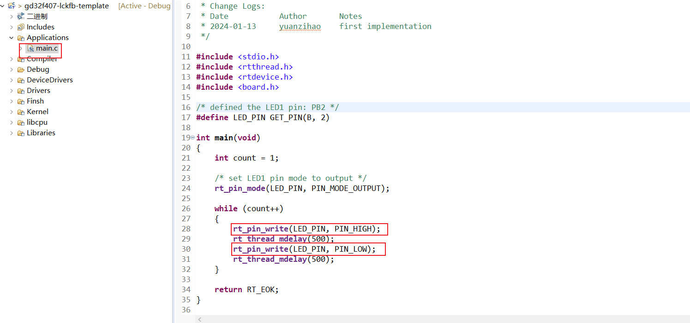

####  **1.2.2** **I/O** **设备管理层** 

I/O 设备管理层实现了对设备驱动程序的封装。应用程序通过 I/O 设备管理接口获得正确的设备驱动，然后通过这个设备驱动与底层 I/O 硬件设备进行数据交互。设备驱动程序的升级、更替不会对上层应用产生影响。这种方式使得设备的硬件操作相关的代码能够独立于应用程序而存在，双方只需关注各自的功能实现，从而降低了代码的耦合性、复杂性，提高了系统的可靠性。

对应 device.c

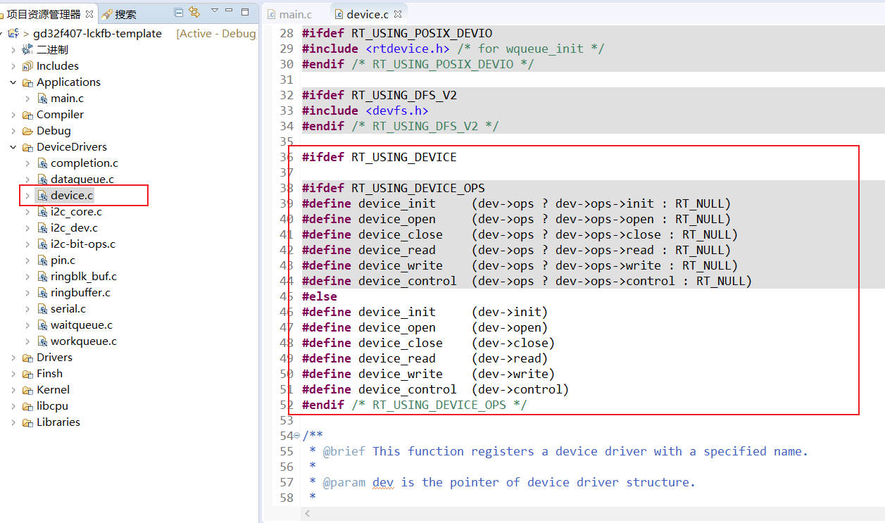

####  **1.2.3 设备驱动框架层** 

设备驱动框架层对同类硬件设备驱动的抽象，将不同厂家的同类硬件设备驱动中相同的部分抽取出来，将不同部分留出接口，由驱动程序实现。

对应的比如 serial.c 等


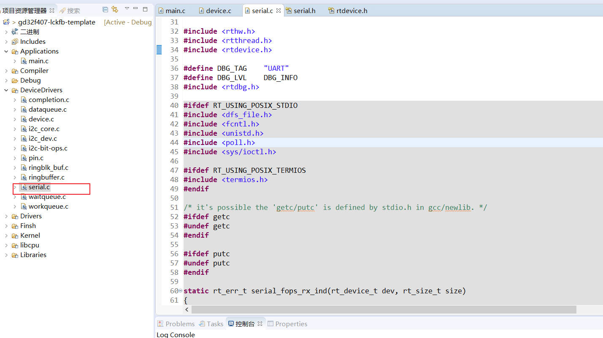

上面的 I/O 设备管理层 和 设备驱动框架层 是属于RT-Thread 系统的范畴，官方已写好，所以在项目中的位置存放于 rt-thread 文件夹下面。

####  **1.2.4 设备驱动层** 

设备驱动层是一组驱使硬件设备工作的程序，实现访问硬件设备的功能。 它负责创建和注册 I/O 设备，就类似于使用裸机编写程序时候的底层驱动。 裸机的驱动是直接被应用层调用，这里的驱动是提供给 设备驱动框架层调用 或者 直接给 I/O 设备管理层调用的。

对于一些常用的芯片或者与官方有合作的芯片，官方也会提供了写好的驱动，比如STM32，下图就是官方已经写好的基于STM32 的设备驱动层的代码。设备驱动层的编写是需要基于芯片或外设的手册、SDK，是需要额外实现的。但是有些常用芯片和外设官方已经帮我们写好了，比如基于 STM32 的 HAL 库，RT-Thread官方已经实现了基于 STM32 的设备驱动层 。

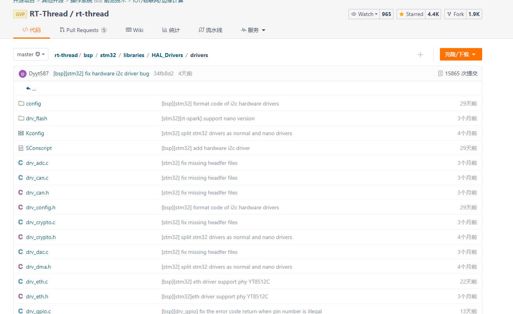

在立创开发板GD32F407中，目前bsp只适配了drv_gpio,drv_usart.c，但是其他的GD32开发板应该是适配的比较多的，后面可以根据该开发板进行继续适配

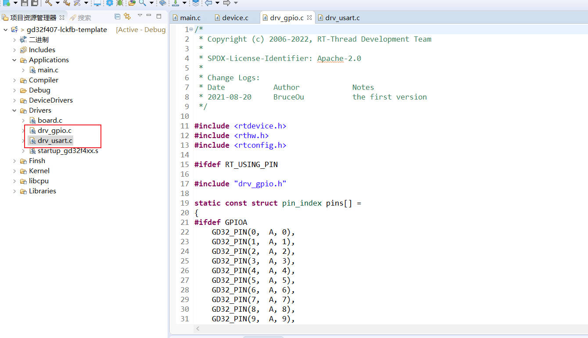


####  **1.2.5 硬件层** 

比如Flash芯片，SD卡，stm32芯片等外设和MCU设备。

###  **1.3** **I/O** **设备操作逻辑说明** 

简单介绍一下 I/O 设备操作逻辑，这部分应用官方的说明。

对于操作逻辑简单的设备，可以不经过设备驱动框架层，直接将设备注册到 I/O 设备管理器中，过程如下：

在我们本文后面的新建设备模型实例中就举了个简单设备的例子。

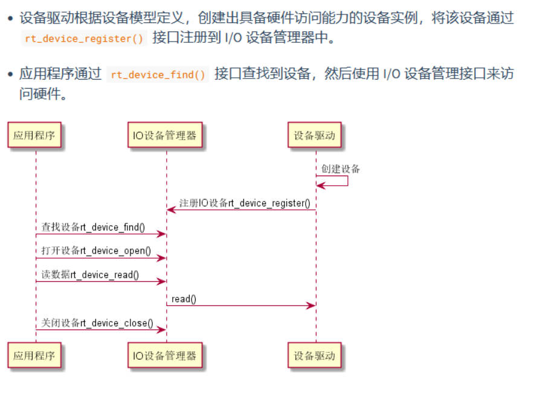

对于复杂点的设备，需要经过设备驱动框架层：

对于另一些设备，如看门狗等，则会将创建的设备实例先注册到对应的设备驱动框架中，再由设备驱动框架向 I/O 设备管理器进行注册，主要有以下几点：

- 看门狗设备驱动程序根据看门狗设备模型定义，创建出具备硬件访问能力的看门狗设备实例，并将该看门狗设备通过 `rt_hw_watchdog_register()` 接口注册到看门狗设备驱动框架中。
- 看门狗设备驱动框架通过 `rt_device_register()` 接口将看门狗设备注册到 I/O 设备管理器中。
- 应用程序通过 I/O 设备管理接口来访问看门狗设备硬件。

看门狗设备使用序列图:

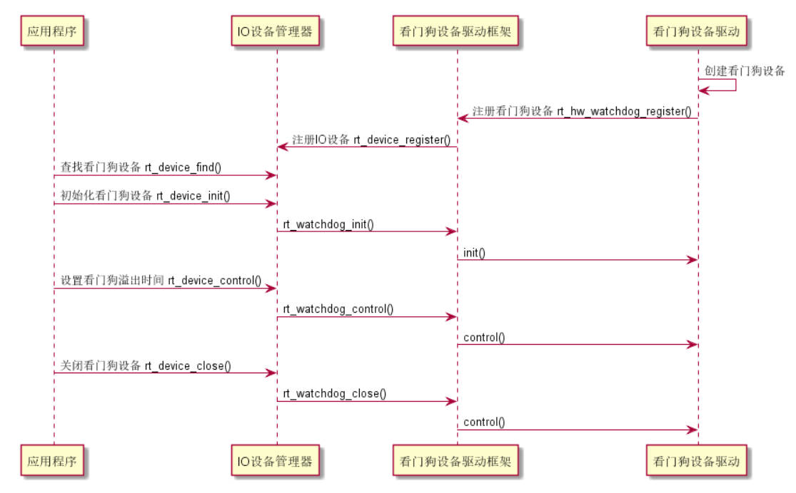

为了更好的理解上面的流程，可以结合工程源码理解，多看源码，比如下图所示：

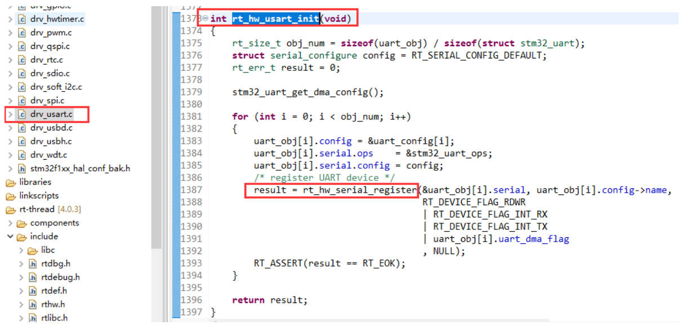

###  **1.4** **I/O** **设备模型框架有什么用？**

有很多初学者会问， I/O 设备模型意义在哪里？ 在裸机使用中，比如操作一个IO口，直接调用驱动函数，不是更简单，更直接，使用了设个模型，反而变得复杂了？

在某些时候，如果你只使用一种芯片一种方案，或许某种意义上说， I/O 设备模型确实可能会比直接调用驱动函数复杂。也可以说，你使用的方案单一，项目简单，没有必要使用 I/O 设备模型，甚至可能连 RTOS 都不一定需要。

总之就是，只用一种芯片方案简单项目或者内存空间实在有限，完全是可以不用这个框架，直接用 RT-Thread Nano 完成功能，和我们前面讲的项目实例一样完成，是没有问题的！

但是作为一个工程师，不能局限在一种方案上面，尤其当今芯片市场变幻莫测，指不定哪天需要换芯片，换方案呢？而且 RT-Thread 作为一个面向对象思想设计的操作系统，必须得全面考虑，需要降低了代码的耦合性、复杂性，提高了系统的可靠性，能够使得系统运行与不同的芯片设备上。

如果没有 I/O 设备模型，那么每次换方案，从底层到应用层所有的代码基本上都得重写，对于简单的项目无所谓，对于复杂一点的项目，那可是需要花费大量功夫。

**使用了 RT-Thread 的 I/O 设备模型，不管你使用哪种MCU，应用层对设备操作的函数一模一样，设备驱动程序的升级、更替不会对上层应用产生影响。**这种方式使得设备的硬件操作相关的代码能够独立于应用程序而存在，双方只需关注各自的功能实现。

如果学过 Linux 的朋友肯定知道，**RT-Thread 的 I/O 设备模型 思想 是和 Linux 类似的，作为嵌入式工程师，如果你懂 Linux，那么就应该知道 I/O 设备模型框架 的优点。**如果你不懂 Linux，那么学会了 RT-Thread 操作系统的 I/O 设备模型，对于以后深入学习 Linux 操作系统，也是有帮助的 。

###  **二、I/O 设备模型操作 API** 

上文我们说明了RT-Thread I/O 设备模型的基本概念先关内容，也了解了 I/O 设备模型框架以及操作逻辑，那么我们用户该如何来实现这一流程呢？

所以现在我们就来学习一下I/O设备模型操作的相关API函数，包括创建、注册、访问等 。

###  **2.1 I/O 设备控制块**

我们不止一次的说明了 RT-Thread 的面向对象的思想，在RT-Thread中，设备也是一种内核对象，那么他和以前说的线程，IPC机制，定时器等对象一样，有自己的对象控制块。

在以前博文：RT-Thread记录（六、IPC机制之信号量、互斥量和事件集）这里再次额外说明一下，因为只要理解了这种思想，对于学会他们的使用就更加简单了，在IPC机制的时候我们使用图片说明过：

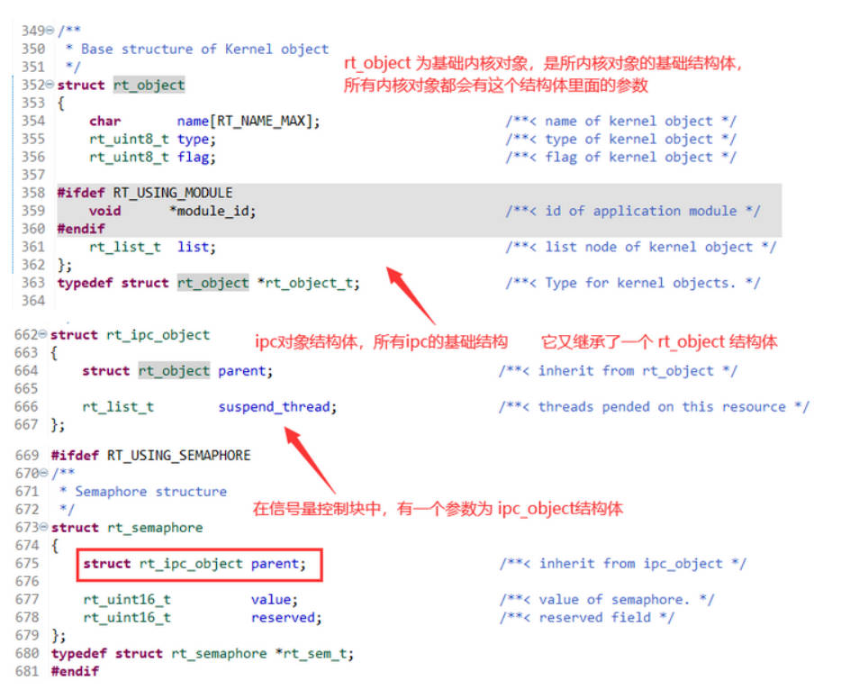

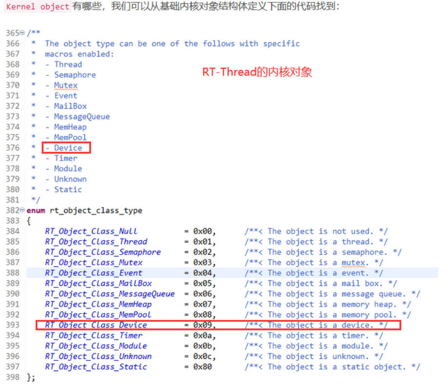

其实我们可以看一下设备对象的控制块：


上源码方便以后复制：

```c
/**
 * Device structure 设备控制块
 */
struct rt_device
{
    struct rt_object          parent;                   /**< inherit from rt_object */

    enum rt_device_class_type type;                     /**< device type */
    rt_uint16_t               flag;                     /**< device flag */
    rt_uint16_t               open_flag;                /**< device open flag */

    rt_uint8_t                ref_count;                /**< reference count */
    rt_uint8_t                device_id;                /**< 0 - 255 */

    /* device call back */
    rt_err_t (*rx_indicate)(rt_device_t dev, rt_size_t size);
    rt_err_t (*tx_complete)(rt_device_t dev, void *buffer);

#ifdef RT_USING_DEVICE_OPS
    const struct rt_device_ops *ops;
#else
    /* common device interface */
    rt_err_t  (*init)   (rt_device_t dev);
    rt_err_t  (*open)   (rt_device_t dev, rt_uint16_t oflag);
    rt_err_t  (*close)  (rt_device_t dev);
    rt_size_t (*read)   (rt_device_t dev, rt_off_t pos, void *buffer, rt_size_t size);
    rt_size_t (*write)  (rt_device_t dev, rt_off_t pos, const void *buffer, rt_size_t size);
    rt_err_t  (*control)(rt_device_t dev, int cmd, void *args);
#endif

#if defined(RT_USING_POSIX)
    const struct dfs_file_ops *fops;
    struct rt_wqueue wait_queue;
#endif

    void                     *user_data;                /**< device private data */
};
```

####  **2.1.1 设备类型 type** 

设备对象的控制块中对于设备类型使用了一个 `rt_device_class_type` 枚举的方式，其可能的设备类型如下（简单的没有注释，还有部分吗不太清楚的，以后更新）：

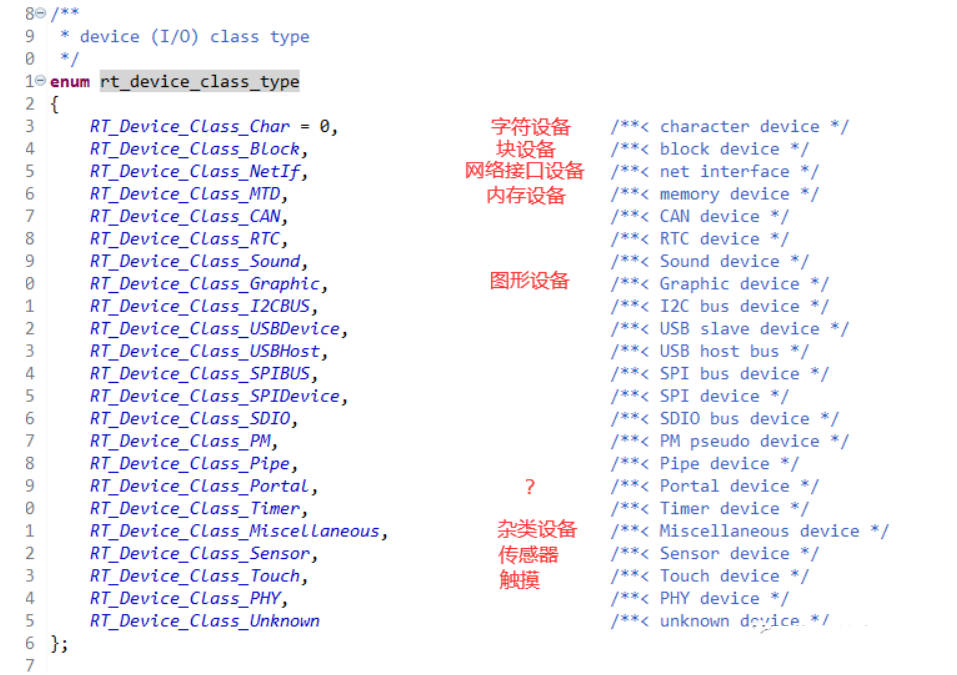

设备类型 需要在创建的时候选择好，写驱动的时候应该知道自己写的是什么类型的设备。

####  **2.1.2 设备注册 flag** 

设备对象的控制块中有一个 flag 参数， 设备模式标志 ，表示设备是属于什么状态的设备，可读、可写、收发等，其可以有的参数如下：

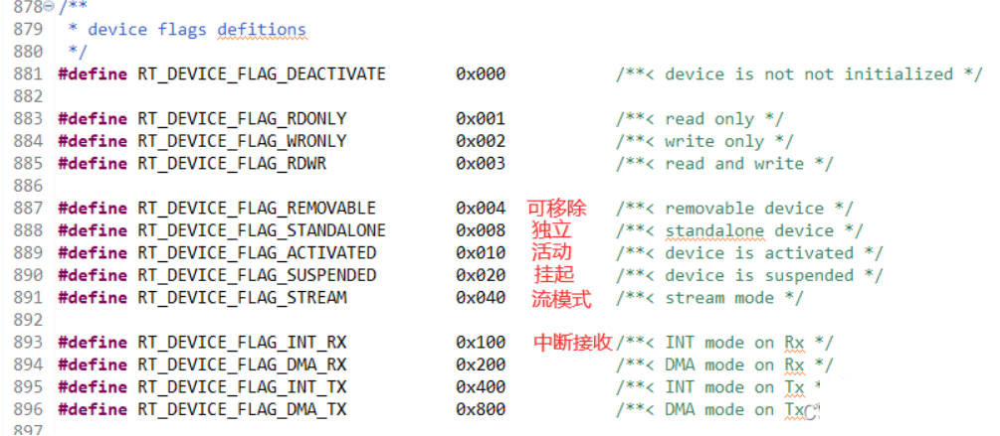

注意，该标志可以采用或的方式支持多种参数。

设备注册 flag 需要在创建的时候选择好，写驱动的时候应该知道自己写的设备是什么状态，比如只读。只写，中断接收之类的。

####  **2.1.3 设备访问 open_flag** 

设备对象的控制块中有一个 open_flag 参数， 设备打开模式标志 ，表示对设备进行什么操作，其可以有的参数如下：


设备访问的时候，需要使用这个 open_flag 来判断需要对设备进行什么操作，是读？还是写? 还是发送等。。。

介绍了 I/O 设备控制块，让我们清楚我们要操作的对象是什么，我们在 设备驱动层 要写的设备驱动以及上层应用对 I/O 设备的访问， 就是基于这个控制块来进行的。

###  **2.2 创建 I/O 设备相关** 

我们按照 先创建设备，再访问设备 的顺序来介绍对于的 API 函数。

####  **2.2.1 创建设备** 

老规矩用源码，解释看注释（使用起来也方便复制 ~ ~！）：

```c
/*
参数的含义：
1、type   设备类型，上面 2.1.1 小结说明的设备类型
2、attach_size  用户数据大小
返回值：
创建成功,返回设备的控制块指针
创建失败,返回RT_BULL 
*/

rt_device_t rt_device_create(int type, int attach_size)

/**
 * device (I/O) class type  设备类型
 */
enum rt_device_class_type
{
    RT_Device_Class_Char = 0,                           /**< character device */
    RT_Device_Class_Block,                              /**< block device */
    RT_Device_Class_NetIf,                              /**< net interface */
    RT_Device_Class_MTD,                                /**< memory device */
    RT_Device_Class_CAN,                                /**< CAN device */
    RT_Device_Class_RTC,                                /**< RTC device */
    RT_Device_Class_Sound,                              /**< Sound device */
    RT_Device_Class_Graphic,                            /**< Graphic device */
    RT_Device_Class_I2CBUS,                             /**< I2C bus device */
    RT_Device_Class_USBDevice,                          /**< USB slave device */
    RT_Device_Class_USBHost,                            /**< USB host bus */
    RT_Device_Class_SPIBUS,                             /**< SPI bus device */
    RT_Device_Class_SPIDevice,                          /**< SPI device */
    RT_Device_Class_SDIO,                               /**< SDIO bus device */
    RT_Device_Class_PM,                                 /**< PM pseudo device */
    RT_Device_Class_Pipe,                               /**< Pipe device */
    RT_Device_Class_Portal,                             /**< Portal device */
    RT_Device_Class_Timer,                              /**< Timer device */
    RT_Device_Class_Miscellaneous,                      /**< Miscellaneous device */
    RT_Device_Class_Sensor,                             /**< Sensor device */
    RT_Device_Class_Touch,                              /**< Touch device */
    RT_Device_Class_PHY,                                /**< PHY device */
    RT_Device_Class_Unknown                             /**< unknown device */
};
```

设备被创建后，需要实现它访问硬件的操作方法，要按照下面的函数指针实现这些对于设备的操作函数：

```c
/* common device interface */
    rt_err_t  (*init)   (rt_device_t dev);
    rt_err_t  (*open)   (rt_device_t dev, rt_uint16_t oflag);
    rt_err_t  (*close)  (rt_device_t dev);
    rt_size_t (*read)   (rt_device_t dev, rt_off_t pos, void *buffer, rt_size_t size);
    rt_size_t (*write)  (rt_device_t dev, rt_off_t pos, const void *buffer, rt_size_t size);
    rt_err_t  (*control)(rt_device_t dev, int cmd, void *args);
```

这里引用官方的说明：

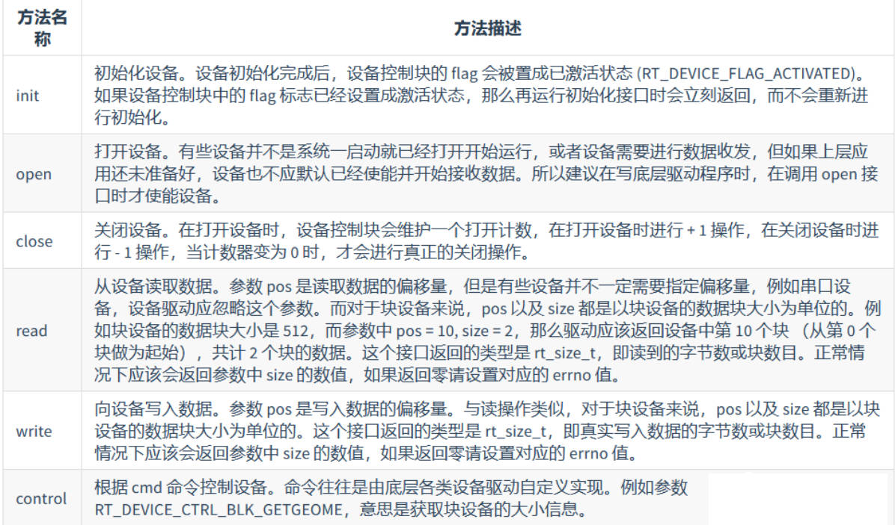

####  **2.2.2 销毁设备** 

此函数不一定需要使用，但是有创建就应该有销毁：

```c
/*
参数的含义：
dev  设备句柄
*/
void rt_device_destroy(rt_device_t dev)
```

####  **2.2.3 设备注册** 

设备被创建后，需要注册到 I/O 设备管理器中，应用程序才能够访问：

```c
/*
参数的含义：
dev  设备句柄
name  设备名称，
设备名称的最大长度由 rtconfig.h 中定义的宏 RT_NAME_MAX 指定，多余部分会被自动截掉
flags  设备模式标志，就是上面介绍的 2.1.2 设备注册 flag
返回值：
RT_EOK  注册成功
-RT_ERROR  注册失败，dev 为空或者 name 已经存在
*/
rt_err_t rt_device_register(rt_device_t dev,
                            const char *name,
                            rt_uint16_t flags)


/*设备注册 flag*/
#define RT_DEVICE_FLAG_DEACTIVATE       0x000           /**< device is not not initialized */

#define RT_DEVICE_FLAG_RDONLY           0x001           /**< read only */
#define RT_DEVICE_FLAG_WRONLY           0x002           /**< write only */
#define RT_DEVICE_FLAG_RDWR             0x003           /**< read and write */

#define RT_DEVICE_FLAG_REMOVABLE        0x004           /**< removable device */
#define RT_DEVICE_FLAG_STANDALONE       0x008           /**< standalone device */
#define RT_DEVICE_FLAG_ACTIVATED        0x010           /**< device is activated */
#define RT_DEVICE_FLAG_SUSPENDED        0x020           /**< device is suspended */
#define RT_DEVICE_FLAG_STREAM           0x040           /**< stream mode */

#define RT_DEVICE_FLAG_INT_RX           0x100           /**< INT mode on Rx */
#define RT_DEVICE_FLAG_DMA_RX           0x200           /**< DMA mode on Rx */
#define RT_DEVICE_FLAG_INT_TX           0x400           /**< INT mode on Tx */
#define RT_DEVICE_FLAG_DMA_TX           0x800           /**< DMA mode on Tx */
上面需要额外说明的一点，设备流模式 `RT_DEVICE_FLAG_STREAM` 参数用于向串口终端输出字符串：
当输出的字符是 “\n” 时，自动在前面补一个 “\r” 做分行。
```

####  **2.2.4 设备注销** 

创建对销毁，注册对注销：

```c
/**
参数  描述
dev  设备句柄
返回  ——
RT_EOK  成功
 */
rt_err_t rt_device_unregister(rt_device_t dev)
```

当设备注销后的，设备将从设备管理器中移除，也就不能再通过设备查找搜索到该设备。注销设备不会释放设备控制块占用的内存。 注销只是把这个 设备对象结构体 从管理链表中去掉，并不会释放这个对象结构体的空间，要释放空间需要调用销毁设备函数。

创建 I/O 设备相关的函数，和 I/O 设备模型框架中 设备驱动层 有关，在我们底层写驱动的时候需要使用。

###  **2.3 访问 I/O 设备相关** 

上面我们说的创建 I/O 设备相关是和 设备驱动层 有关的代码，本小结说的访问 I/O 设备就是和 应用程序有关的代码，就是告诉我们应用程序怎么去操作我们上面创建的设备。

I/O 设备管理接口与 I/O 设备的操作方法的映射关系下图：

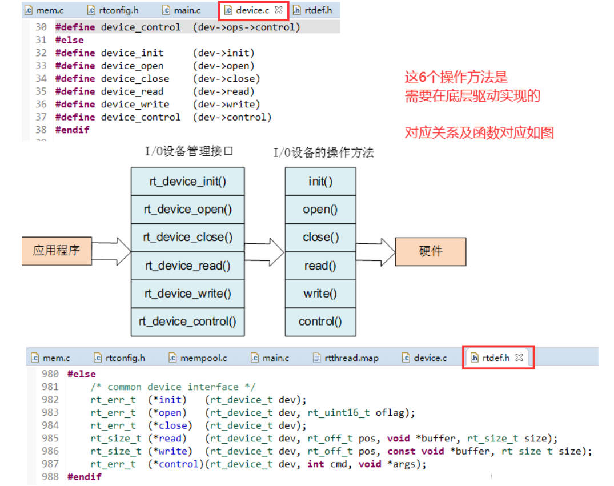

####  **2.3.1 查找设备** 

注册过的设备才能被查找到，名字对应注册时候使用的名字：

```c
/**
参数  描述
name  设备名称
返回  ——
设备句柄  查找到对应设备将返回相应的设备句柄
RT_NULL  没有找到相应的设备对象
 */
rt_device_t rt_device_find(const char *name)
```

####  **2.3.2 初始化设备** 

对应底层 `rt_err_t (*init) (rt_device_t dev);` 的实现函数：

```c
/**
参数  描述
dev  设备句柄
返回  ——
RT_EOK  设备初始化成功
错误码  设备初始化失败
 */
rt_err_t rt_device_init(rt_device_t dev)
```

当一个设备已经初始化成功后，调用这个接口将不再重复做初始化 0。

####  **2.3.3 打开和关闭设备**

**打开设备：**

对应底层 `rt_err_t (*open) (rt_device_t dev, rt_uint16_t oflag);` 的实现函数：

```c
/*
参数  描述
dev  设备句柄
oflags  设备打开模式标志,上面 2.1.3 小结说明的设备访问 open_flag
返回  ——
RT_EOK  设备打开成功
-RT_EBUSY  如果设备注册时指定的参数中包括 RT_DEVICE_FLAG_STANDALONE 参数，此设备将不允许重复打开
其他错误码  设备打开失败
*/
rt_err_t  rt_device_open (rt_device_t dev, rt_uint16_t oflag);

#define RT_DEVICE_FLAG_INT_RX           0x100           /**< INT mode on Rx */
#define RT_DEVICE_FLAG_DMA_RX           0x200           /**< DMA mode on Rx */
#define RT_DEVICE_FLAG_INT_TX           0x400           /**< INT mode on Tx */
#define RT_DEVICE_FLAG_DMA_TX           0x800           /**< DMA mode on Tx */

#define RT_DEVICE_OFLAG_CLOSE           0x000           /**< 设备已经关闭（内部使用） */
#define RT_DEVICE_OFLAG_RDONLY          0x001           /**< read only access */
#define RT_DEVICE_OFLAG_WRONLY          0x002           /**< write only access */
#define RT_DEVICE_OFLAG_RDWR            0x003           /**< read and write */
#define RT_DEVICE_OFLAG_OPEN            0x008           /**< device is opened */
#define RT_DEVICE_OFLAG_MASK            0xf0f           /**< mask of open flag */
```

注：如果上层应用程序需要设置设备的接收回调函数，则必须以 `RT_DEVICE_FLAG_INT_RX` 或者 `RT_DEVICE_FLAG_DMA_RX` 的方式打开设备，否则不会回调函数。

**关闭设备：**

对应底层 `rt_err_t (*close) (rt_device_t dev);` 的实现函数：

```c
/*
dev  设备句柄
返回  ——
RT_EOK  关闭设备成功
-RT_ERROR  设备已经完全关闭，不能重复关闭设备
其他错误码  关闭设备失败
*/
rt_err_t  rt_device_open (rt_device_t dev, rt_uint16_t oflag);
```

关闭设备接口和打开设备接口需配对使用，打开一次设备对应要关闭一次设备，这样设备才会被完全关闭，否则设备仍处于未关闭状态。

####  **2.3.4 读写设备** 

**读设备：**

对应底层 `rt_size_t (*read) (rt_device_t dev, rt_off_t pos, void *buffer, rt_size_t size);` 的实现函数：

```c
/**
参数  描述
dev  设备句柄
pos  读取数据偏移量
buffer  内存缓冲区指针，读取的数据将会被保存在缓冲区中
size  读取数据的大小
返回  ——
读到数据的实际大小  如果是字符设备，返回大小以字节为单位，如果是块设备，返回的大小以块为单位
0  需要读取当前线程的 errno 来判断错误状态
 */
rt_size_t rt_device_read(rt_device_t dev,
                         rt_off_t    pos,
                         void       *buffer,
                         rt_size_t   size)
```

调用这个函数，会从 dev 设备中读取数据，并存放在 buffer 缓冲区中，这个缓冲区的最大长度是 size，pos 根据不同的设备类别有不同的意义。

**写设备：**

对应底层 `rt_size_t (*write) (rt_device_t dev, rt_off_t pos, const void *buffer, rt_size_t size);` 的实现函数：

```c
/**
参数  描述
dev  设备句柄
pos  写入数据偏移量
buffer  内存缓冲区指针，放置要写入的数据
size  写入数据的大小
返回  ——
写入数据的实际大小  如果是字符设备，返回大小以字节为单位；如果是块设备，返回的大小以块为单位
0  需要读取当前线程的 errno 来判断错误状态
 */
rt_size_t rt_device_write(rt_device_t dev,
                          rt_off_t    pos,
                          const void *buffer,
                          rt_size_t   size)
```

调用这个函数，会把缓冲区 buffer 中的数据写入到设备 dev 中，写入数据的最大长度是 size，pos 根据不同的设备类别存在不同的意义。

####  **2.3.5 控制设备**

对应底层 `rt_err_t (*control)(rt_device_t dev, int cmd, void *args);` 的实现函数：

```c
/**
参数  描述
dev  设备句柄
cmd  命令控制字，这个参数通常与设备驱动程序相关，见下面列出的参数
arg  控制的参数
返回  ——
RT_EOK   函数执行成功
-RT_ENOSYS  执行失败，dev 为空
其他错误码  执行失败
 */
rt_err_t rt_device_control(rt_device_t dev, int cmd, void *arg)


/**
 * general device commands 上面 cmd 的参数
 */
#define RT_DEVICE_CTRL_RESUME           0x01            /**< resume device */
#define RT_DEVICE_CTRL_SUSPEND          0x02            /**< suspend device */
#define RT_DEVICE_CTRL_CONFIG           0x03            /**< configure device */
#define RT_DEVICE_CTRL_CLOSE            0x04            /**< close device */

#define RT_DEVICE_CTRL_SET_INT          0x10            /**< set interrupt */
#define RT_DEVICE_CTRL_CLR_INT          0x11            /**< clear interrupt */
#define RT_DEVICE_CTRL_GET_INT          0x12            /**< get interrupt status */
```

####  **2.3.6 数据收发回调** 

这个对于 设备控制块中参数中的两个设备回调函数：


**硬件设备收到数据：**

```c
/**
参数  描述
dev  设备句柄
rx_ind  回调函数指针
返回  ——
RT_EOK  设置成功
 */
rt_err_t
rt_device_set_rx_indicate(rt_device_t dev,
                          rt_err_t (*rx_ind)(rt_device_t dev, rt_size_t size))
```

该函数的回调函数由调用者提供。当硬件设备接收到数据时，会回调这个函数并把收到的数据长度放在 size 参数中传递给上层应用。上层应用线程应在收到指示后，立刻从设备中读取数据。

**硬件设备发送数据：**

在应用程序调用 rt_device_write() 写入数据时，如果底层硬件能够支持自动发送，那么上层应用可以设置一个回调函数。这个回调函数会在底层硬件数据发送完成后 (例如 DMA 传送完成或 FIFO 已经写入完毕产生完成中断时) 调用。

通过如下函数设置设备发送完成指示：

```c
/**
参数  描述
dev  设备句柄
tx_done  回调函数指针
返回  ——
RT_EOK  设置成功
 */
rt_err_t
rt_device_set_tx_complete(rt_device_t dev,
                          rt_err_t (*tx_done)(rt_device_t dev, void *buffer))
```

调用这个函数时，回调函数由调用者提供，当硬件设备发送完数据时，由驱动程序回调这个函数并把发送完成的数据块地址 buffer 作为参数传递给上层应用。上层应用（线程）在收到指示时会根据发送 buffer 的情况，释放 buffer 内存块或将其作为下一个写数据的缓存。

访问 I/O 设备相关的函数，和 I/O 设备模型框架中 应用程序 有关，是我们上层写应用程序直接调用的函数。

###  **三、新建** **I/O** **设备模型实例** 

RT-Thread 驱动都是在 drivers 目录下面：

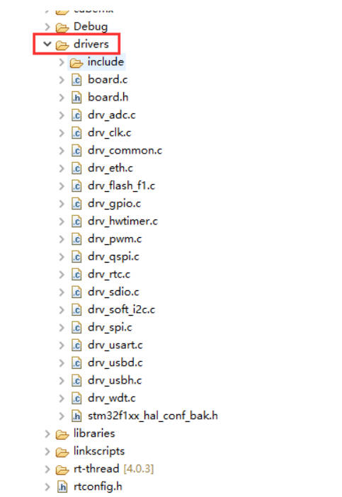

我们在目录下新建一个文件，作为驱动示例：

我们写一个简单的基本框架：

1、创建一个设备；
   使用 rt_device_create 创建一个设备，需要定义一个 rt_device_t 接口体接收设备设备句柄。

2、实现设备操作的函数：
   实现设备对象中对于 设备操作的init，open，close,,read,write,control等 函数。

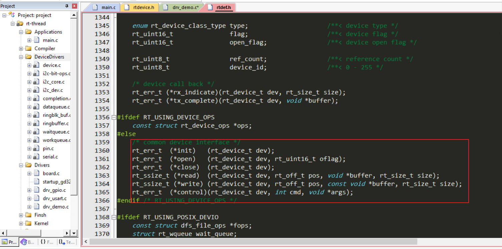

3、注册设备到 I/O 设备管理器；
   使用 rt_device_register 将设备注册到设备管理器。

在 `drv_demo.c` 中，我们实现如下代码：

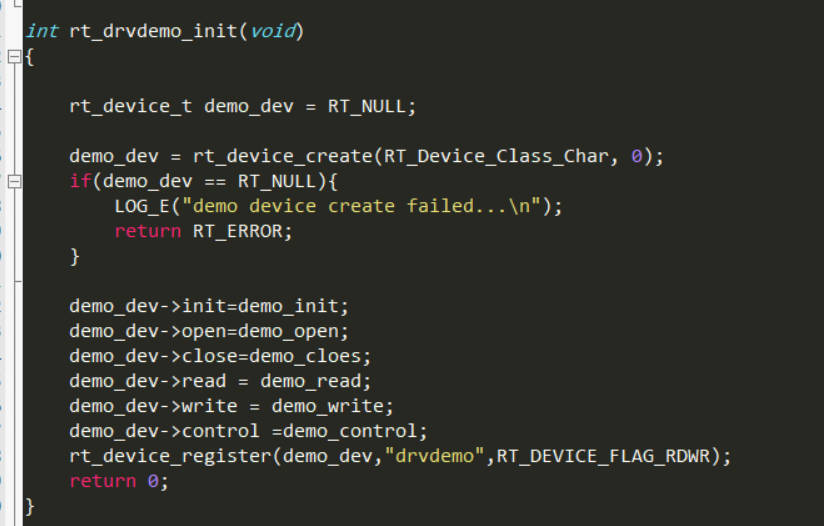

其次，我们需要实现一下设备操作的函数：

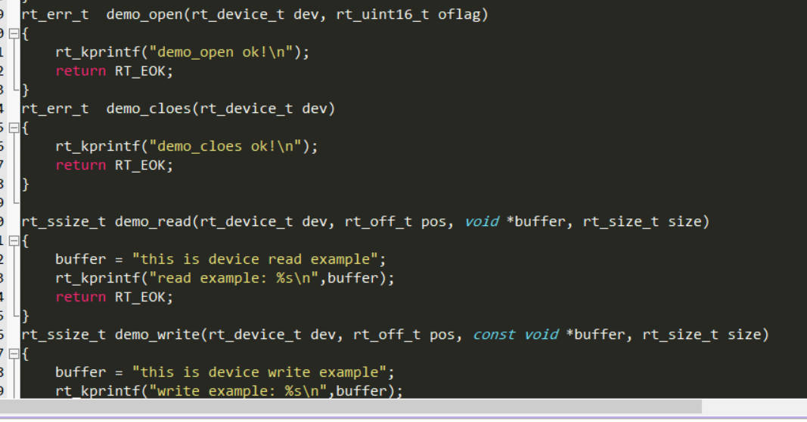

最后，别忘了使用 `INIT_BOARD_EXPORT` 把设备初始化的代码加入板级硬件初始化：

上一下设备模型实例代码：

```c
#include <rtdevice.h>
#include <rtdbg.h>

rt_err_t  demo_init(rt_device_t dev)
{
    rt_kprintf("demo_init ok!\n");
    return RT_EOK;
}
rt_err_t  demo_open(rt_device_t dev, rt_uint16_t oflag)
{
    rt_kprintf("demo_open ok!\n");
    return RT_EOK;
}
rt_err_t  demo_cloes(rt_device_t dev)
{
    rt_kprintf("demo_cloes ok!\n");
    return RT_EOK;
}

rt_ssize_t demo_read(rt_device_t dev, rt_off_t pos, void *buffer, rt_size_t size)
{
	  buffer = "this is device read example";
	  rt_kprintf("read example: %s\n",buffer);
	  return RT_EOK;
}
rt_ssize_t demo_write(rt_device_t dev, rt_off_t pos, const void *buffer, rt_size_t size)
{
	  buffer = "this is device write example";
	  rt_kprintf("write example: %s\n",buffer);
	  return RT_EOK;
}
rt_err_t  demo_control(rt_device_t dev, int cmd, void *args)
{
	switch(cmd)
	{
		case 0:
			rt_kprintf("this is demo_control example cmd-1!\n");	
			break;
		case 1:
			rt_kprintf("this is demo_control example  cmd-2!\n");	
			break;
		case 2:
			rt_kprintf("this is demo_control example  cmd-3!\n");	
			break;
		default:
			break;
	}
}


int rt_drvdemo_init(void)
{

    rt_device_t demo_dev = RT_NULL;

    demo_dev = rt_device_create(RT_Device_Class_Char, 0);
    if(demo_dev == RT_NULL){
        LOG_E("demo device create failed...\n");
        return RT_ERROR;
    }

    demo_dev->init=demo_init;
    demo_dev->open=demo_open;
    demo_dev->close=demo_cloes;
		demo_dev->read = demo_read;
    demo_dev->write = demo_write;
		demo_dev->control =demo_control;
    rt_device_register(demo_dev,"drvdemo",RT_DEVICE_FLAG_RDWR);
    return 0;
}


INIT_BOARD_EXPORT(rt_drvdemo_init);
```

上面我们完成的是 设备驱动层的 代码，接下来我们还需要简单演示一下，如果在应用层 使用这个 demo 设备。

我们根据上文所介绍的 访问 I/O 设备 进行对应操作，这里直接上图说明一下使用流程：

应用测试函数

```c
rt_device_t dev = RT_NULL;

void *read_buf;
void *write_buf;

int main(void)
{

	dev = rt_device_find("drvdemo");
	
	  rt_device_init(dev);
	  rt_thread_mdelay(1000);
	  rt_device_open(dev,RT_DEVICE_OFLAG_OPEN);
	  rt_device_read(dev,0,read_buf,20);
	  rt_device_write(dev,0,write_buf,20);
	  rt_device_control(dev,0,RT_NULL);
	  rt_device_close(dev);
		
		
    return RT_EOK;
}

```

看一下测试结果，我们实现的 3 个驱动函数都只有打印输出，所以我们可以通过打印信息查看是否正确执行的驱动函数的内容：

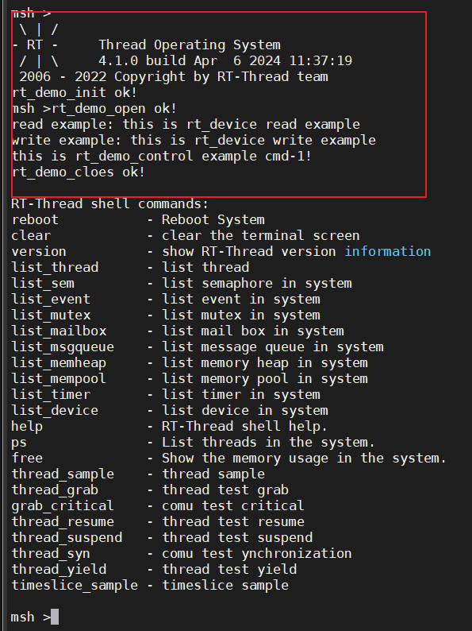

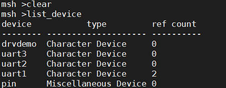

通过上面的测试，我们实现了一个简单的设备驱动的设计，虽然demo比较简单，但是经过这么一个过程可以让我们更加的理解 RT-Thread I/O 设备模型的工作方式和流程。

### 设备抽象层的开源库 mr-library 

[mr-library](https://gitee.com/MacRsh/mr-library) 框架是专为嵌入式系统设计的轻量级框架。充分考虑了嵌入式系统在资源和性能方面的需求。 通过提供标准化的设备管理接口，极大简化了嵌入式应用开发的难度，帮助开发者快速构建嵌入式应用程序。

框架为开发者提供了标准化的开启(`open`)、关闭(`close`)、控制(`ioctl`)、读(`read`)、写(`write`) 等接口。它将应用程序与底层硬件驱动进行解耦。应用程序无需了解驱动的实现细节。 当硬件发生改变时,只需要适配底层驱动,应用程序就可以无缝迁移到新硬件上。这大大提高了软件的可重用性和应对新硬件的可扩展性。

**mr-library 是一个开源项目，设备抽象层应该比RT-Thread更加轻量级，是一个学习设备框架，设备驱动，面向对象操作的好东西。**

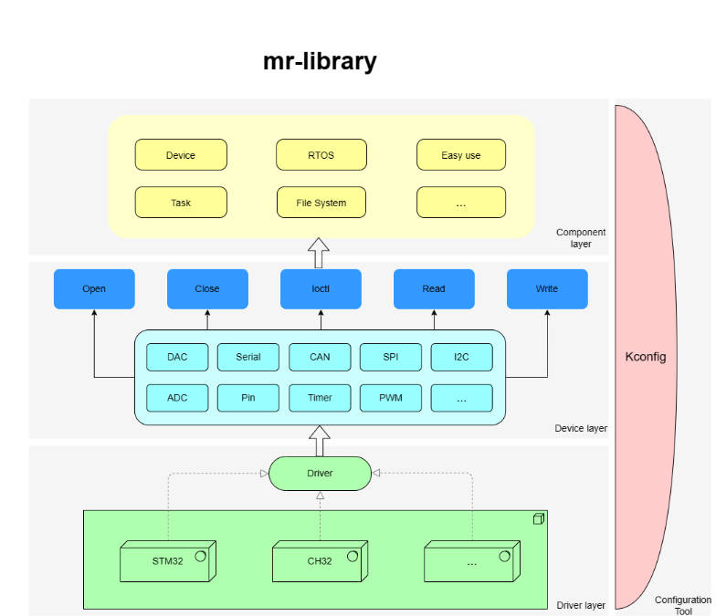

###  关键特性

- 标准化的设备访问接口
- 应用程序和驱动开发解耦
- 简化底层驱动和应用程序开发
- 轻量易上手，资源占用低
- 模块化设计，各部分解耦合并独立开发，极低的硬件迁移成本
- 支持在裸机环境和操作系统环境下使用

### 主要组成

- 设备框架：提供设备访问标准接口
- 内存管理：动态内存管理
- 工具：链表、队列、平衡树等常用数据结构
- 各类功能组件

------

### 标准化设备接口

设备的所有操作都可通过以下接口实现：

| 接口            | 描述           |
| --------------- | -------------- |
| mr_dev_register | 注册设备       |
| mr_dev_open     | 打开设备       |
| mr_dev_close    | 关闭设备       |
| mr_dev_ioctl    | 控制设备       |
| mr_dev_read     | 从设备读取数据 |
| mr_dev_write    | 向设备写入数据 |

测试案例

