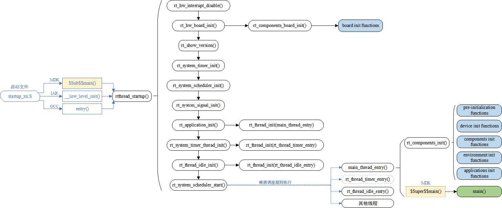

## RT-Thread的启动流程

RT-Thread的启动流程是操作系统初始化和运行应用程序之前的关键步骤，它大致可以分为汇编阶段和C阶段。以下是对RT-Thread启动流程的详细解析：

### 一、汇编阶段

在汇编阶段，主要进行以下操作：

1. **启动文件执行**：系统首先执行启动文件（如startup.s或Reset_Handler等），该文件通常包含汇编语言编写的代码，用于初始化处理器、设置堆栈指针、初始化全局数据、清零未初始化的数据等。
2. **硬件初始化准备**：为后续的C语言代码执行创建必要的环境，包括堆栈的设置、中断向量表的配置等。
3. **跳转到C代码入口**：完成必要的汇编初始化后，跳转到C代码的入口点，通常是一个特定的函数（如`entry`函数或直接跳转到`rtthread_startup`函数）。

### 二、C阶段

在C阶段，主要进行以下操作：

1. **进入`rtthread_startup`函数**：RT-Thread规定的统一启动入口是`rtthread_startup`函数。该函数是RT-Thread启动流程的核心，负责执行后续的初始化工作。
2. **硬件初始化**：在`rtthread_startup`函数中，首先进行硬件的初始化，包括CPU、内存、外设等。这通常通过调用`rt_hw_board_init`等函数完成，该函数会根据具体的硬件平台执行相应的初始化代码。
3. **系统堆初始化**：初始化系统堆，为应用程序和其他软件组件提供内存分配的基础。
4. **版本信息打印**：打印出RT-Thread的版本信息，有助于调试和确认系统状态。
5. **定时器初始化**：系统时钟是操作系统调度的基础，因此会进行定时器初始化。这包括设置定时器的时钟源、配置定时器参数等。
6. **调度器初始化**：调度器是操作系统的核心组件之一，负责管理线程的执行顺序和时间。在`rtthread_startup`函数中会进行调度器的初始化。
7. **信号初始化**（如果系统配置了信号支持）：初始化信号相关的机制，以便系统能够处理信号事件。
8. **创建main线程**：操作系统会创建一个用户级的main线程，这个线程将承载用户的应用程序代码。通常，这一步会在`rt_application_init`函数中完成，该函数会创建一个新的线程作为主线程，并设置其优先级、堆栈大小等参数。
9. **定时器线程和空闲线程初始化**：如果系统需要定时器线程来处理定时任务，会进行定时器线程的初始化。同时，还会初始化空闲线程，空闲线程是操作系统在没有其他线程可执行时运行的线程，通常执行一些低优先级的任务或系统维护操作。
10. **启动调度器**：一旦调度器启动，系统将根据优先级等调度策略开始调度线程的执行。此时，系统已经完成了所有的初始化工作，并准备好执行用户的应用程序。
11. **跳转到用户定义的`main`函数**：最后，系统会跳转到用户定义的`main`函数，用户可以在该函数中编写自己的应用程序逻辑。在RT-Thread中，`main`函数通常是在主线程中执行的。

在整个启动流程中，RT-Thread利用了多个初始化函数，并通过宏定义的方式在系统启动时自动调用这些函数，形成了自动初始化机制。这样，开发者不需要显式调用每个初始化函数，从而简化了系统的启动过程。

总的来说，RT-Thread的启动流程是一个从硬件初始化到系统内核对象初始化，再到创建并启动主线程和调度器的过程。这个过程确保了系统的各个组件被正确地初始化，为后续的稳定运行打下了基础。