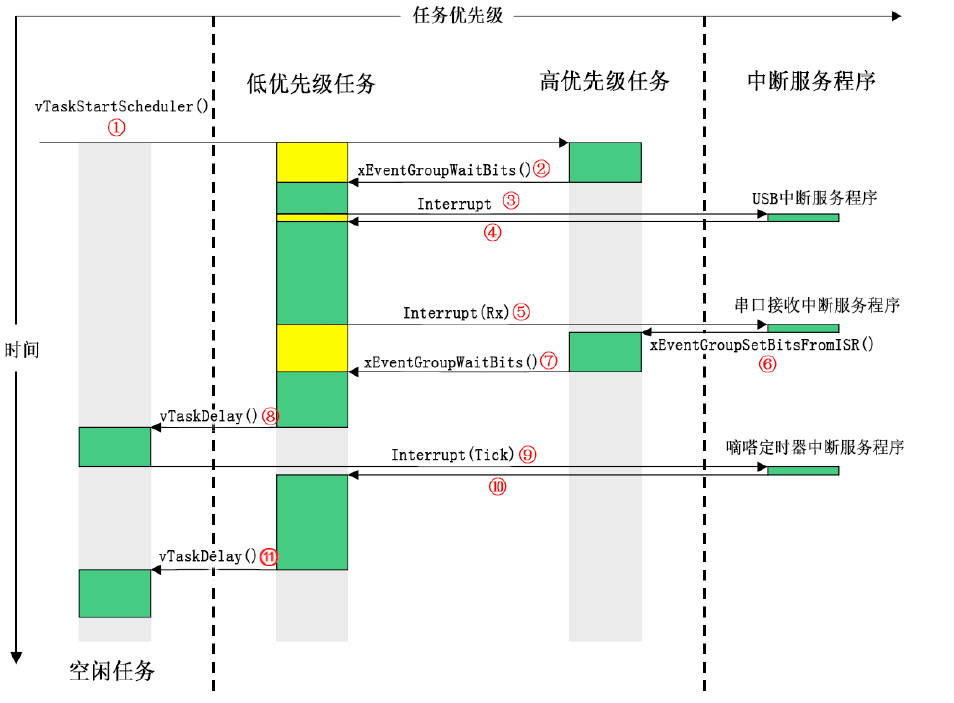
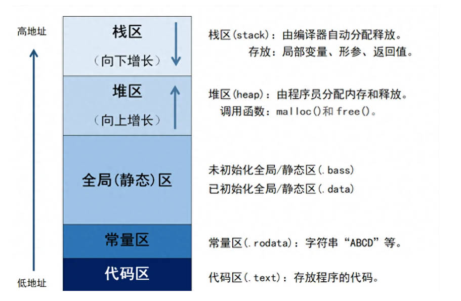
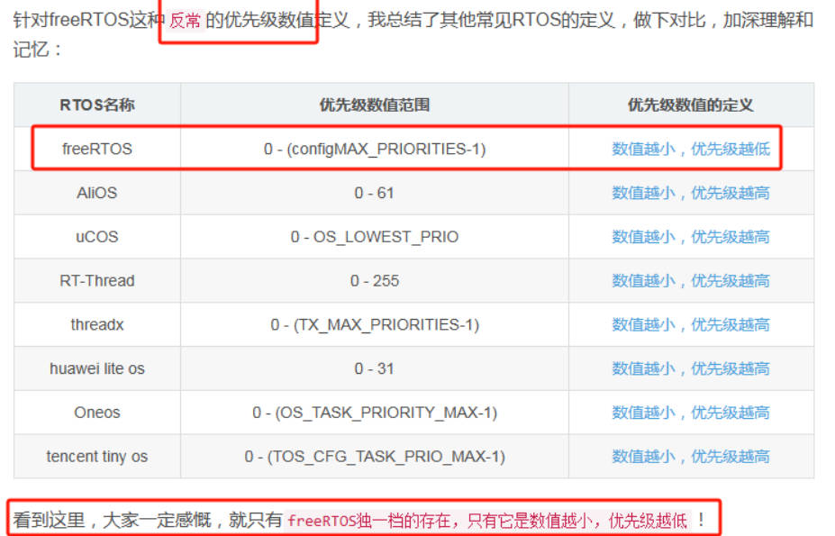
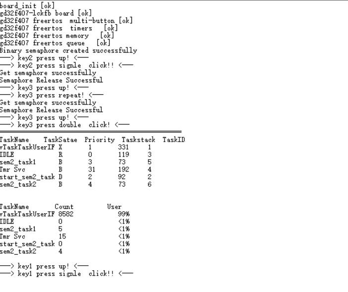
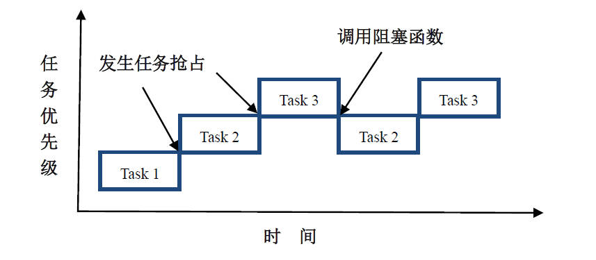
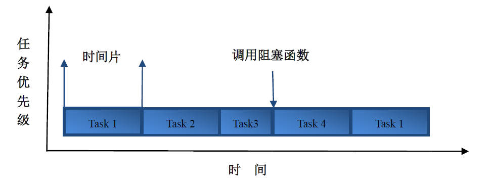

## RTOS内核 任务管理与调度

1. 多任务系统运行过程

   

   **在多任务过程中，中断的响应的优先级是最高的，其次根据任务的优先级进行任务之间的调度，调用延迟函数vTaskDelay会使任务进入挂起状态。**

   1. **启动RTOS，开启调度器**(vTaskStartScheduler)，**执行高优先级任务**
   2. **高优先级任务**等待事件标志（xEventGroupWaitBits）**被阻塞**，**低优先级任务得到执行**。（任务被被阻塞，任务挂起，执行低优先级任务）
   3. 低优先级**任务执行的过程中产生**USB **中断**，**进入**USB **中断服务程序**。
   4. **退出**USB **中断复位程序**，**回到低优先级任务继续执行**。
   5. 低优先级**任务执行过程**中**产生**串口接收**中断**，**进入**串口接收**中断服务程序**。
   6. **退出**串口接收**中断复位程序**，并**发送事件标志设置消息**（xEventGroupSetBitsFromISR），**被阻塞的高优先级任务就会重新进入就绪状态，这个时候高优先级任务和低优先级任务都在就绪态，抢占式调度器就会让高优先级的任务先执行，所以此时就会进入高优先级任务。**
   7. 高优先级任务由于等待事件标志（xEventGroupWaitBits）会再次被阻塞，低优先级任务开始继续执行。
   8. 低优先级任务**调用函数vTaskDelay**，**低优先级任务被挂起**，从而空闲任务得到执行。
   9.  空闲任务执行期间**发生滴答定时器中断**，**进入滴答定时器中断服务程序**。
   10. **退出滴答定时器中断**，由于**低优先级任务延时时间到，低优先级任务继续执行**。
   11. 低优先级任务再次**调用延迟函数vTaskDelay**，低优先级**任务被挂起**，从而切换到空闲任务,空闲任务得到执行。

   **FreeRTOS 支持多任务运行的实时操作系统，具有时间片，抢占式和合作式三种调度方式。**

   **RT-Thread调度方式：时间片轮转+优先级抢占式**

2. 任务栈相关概念

   RTOS 编程，栈的分配大小都非常重要。**局部变量，函数调用时的现场保护和返回地址，函数的形参，进入中断函数前和中断嵌套**等都需要栈空间，栈空间定义小了会造成系统崩溃。

   BSS段：BSS段（bss segment）通常是指用来**存放程序中未初始化的全局变量**的一块内存区域。BSS是英文Block Started by Symbol的简称。BSS段属于静态内存分配。

   数据段：数据段（data segment）通常是指用来**存放程序中已初始化的全局变量**的一块内存区域。数据段属于静态内存分配。

   代码段：代码段（code segment/text segment）通常是指用来**存放程序执行代码**的一块内存区域。这部分区域的大小在程序运行前就已经确定，并且内存区域通常属于只读, 某些架构也允许代码段为可写，即允许修改程序。在代码段中，也有可能包含一些只读的常数变量，例如字符串常量等。

   堆（heap）：**堆是用于存放进程运行中被动态分配的内存段，它的大小并不固定，可动态扩张或缩减**。当进程调用malloc等函数分配内存时，新分配的内存就被动态添加到堆上（堆被扩张）；当利用free等函数释放内存时，被释放的内存从堆中被剔除（堆被缩减）

   栈(stack)：**栈又称堆栈， 是用户存放程序临时创建的局部变量**，也就是说我们函数括弧“{}”中定义的变量（**但不包括static声明的变量，static意味着在数据段中存放变量**）。除此以外，**在函数被调用时，其参数也会被压入发起调用的进程栈中，并且待到调用结束后，函数的返回值也会被存放回栈中**。由于栈的先进后出特点，所以**栈特别方便用来保存/恢复调用现场**。从这个意义上讲，我们可以把**堆栈看成一个寄存、交换临时数据的内存区**。**它是由操作系统分配的，内存的申请与回收都由OS管理**。

   

   任务栈

   ```c
   static void AppTaskCreate (void)
   {
       xTaskCreate(vTaskTaskUserIF, /* 任务函数 */
       			"vTaskUserIF", /* 任务名 */
       			512, /* 任务栈大小，单位word，也就是4 字节 */
      				NULL, /* 任务参数 */
      				1, /* 任务优先级*/
       			&xHandleTaskUserIF ); /* 任务句柄 */
       xTaskCreate( vTaskTaskLED, /* 任务函数 */
       			"vTaskTaskLED", /* 任务名 */
       			512, /* 任务栈大小，单位word，也就是4 字节 */
       			NULL, /* 任务参数 */
   				2, /* 任务优先级*/
   				&xHandleTaskLED ); /* 任务句柄 */
       xTaskCreate( vTaskMsgPro, /* 任务函数 */
                   "vTaskMsgPro", /* 任务名 */
                   512, /* 任务栈大小，单位word，也就是4 字节 */
                   NULL, /* 任务参数 */
                   3, /* 任务优先级*/
                   &xHandleTaskMsgPro ); /* 任务句柄 */
       xTaskCreate( vTaskStart, /* 任务函数 */
                   "vTaskStart", /* 任务名 */
                   512, /* 任务栈大小，单位word，也就是4 字节 */
                   NULL, /* 任务参数 */
                   4, /* 任务优先级*/
                   &xHandleTaskStart ); /* 任务句柄 */
   }
   ```

   系统栈

   而任务栈是不使用(启动文件里面描述 Stack_Size)空间的。任务栈不使用这里的栈空间，哪里使用这里的栈空间呢？答案就在中断函数和中断嵌套。

   ```c
   Stack_Size      EQU     0x00000400
   
                   AREA    STACK, NOINIT, READWRITE, ALIGN=3
   Stack_Mem       SPACE   Stack_Size
   __initial_sp
   
   
   ; <h> Heap Configuration
   ;   <o>  Heap Size (in Bytes) <0x0-0xFFFFFFFF:8>
   ; </h>
   
   Heap_Size       EQU     0x00000400
   ```

3. 任务状态

   **Running 运行态**

   当任务处于实际运行状态被称之为运行态，即CPU 的使用权被这个任务占用。

   **Ready 就绪态**

   处于就绪态的任务是指那些能够运行（没有被阻塞和挂起），但是当前没有运行的任务，因为同优先级或更高优先级的任务正在运行。

   **Blocked 阻塞态**

   由于等待信号量，消息队列，事件标志组等而处于的状态被称之为阻塞态，另外任务调用延迟函数也会处于阻塞态。

   **Suspended 挂起态**

   类似阻塞态，通过调用函数vTaskSuspend()对指定任务进行挂起，挂起后这个任务将不被执行，只有调用函数xTaskResume()才可将这个任务从挂起态恢复。

4. 任务的创建,删除,挂起,恢复

   ```c
   //任务创建
   xTaskCreate(vTaskTaskUserIF, /* 任务函数 */
       			"vTaskUserIF", /* 任务名 */
       			512, /* 任务栈大小，单位word，也就是4 字节 */
      				NULL, /* 任务参数 */
      				1, /* 任务优先级*/
       			&xHandleTaskUserIF ); /* 任务句柄 */
   //任务删除
   vTaskDelete(xHandleTaskUserIF); /* 任务句柄 */
   //任务挂起
   vTaskSuspend(xHandleTaskUserIF); /* 任务句柄 */
   //任务恢复
   vTaskResume(xHandleTaskUserIF);/* 任务句柄 */
   //FreeRTOS任务恢复(中断方式)
   xTaskResumeFromISR(xHandleTaskUserIF)
   ```

   如果用往此**vTaskDelete函数里面填的任务ID 是NULL，即数值0 的话，那么删除的就是当前正在执行的任务，此任务被删除后，FreeRTOS 会切换到任务就绪列表里面下一个要执行的最高优先级任务**。

   如果用往此**vTaskSuspend函数里面填的任务ID 是NULL，即数值0 的话，那么挂起的就是当前正在执行的任务，此任务被挂起后，FreeRTOS 会切换到任务就绪列表里面下一个要执行的最高优先级任务**。

   在FreeRTOS 中，创建任务所需的内存需要在空闲任务中释放，如果用户在FreeRTOS 中调用了这个函数的话，一定要让空闲任务有执行的机会，否则这块内存是无法释放的。另外，**创建的这个任务在使用中申请了动态内存，这个内存不会因为此任务被删除而删除，这一点要注意，一定要在删除前将此内存释放**。

5. 任务优先级

   ```c
   #define configMAX_PRIORITIES ( 5 )
   ```

   定义可供用户使用的最大优先级数，如果这个定义的是5，那么用户可以使用的优先级号是0,1,2,3,4，不包含5，要特别的注意。

   用户配置任务的**优先级数值越小，那么此任务的优先级越低**（绝大多数的RTOS的优先级情况与之相反，数值越小，任务的优先级越高），空闲任务的优先级是 0。

   

6. 任务信息统计

   

   - **第一列: task name**
     即 `xTaskCreate` 创建该 task 时第二个参数。
     如果名称过长，会根据 `configMAX_TASK_NAME_LEN` 截断。

   - **第二列: task 当前状态**

     - `X`: running
     - `B`: blocked
     - `R`: ready
     - `D`: deleted
     - `S`: suspended

   - **第三列: task 优先级**
     即 `xTaskCreate` 创建该 task 时第四个参数。
     数字越大，优先级越高，**建议客户设置 task 优先级在 1-9 之间，慎行！**

   - **第四列: 最小剩余 task 栈空间，字节为单位**
     在 `xTaskCreate` 创建 task 时，给定的第三个参数值代表该 task 调度和运行过程中，最大可用 task 栈空间，以字节为单位(读者可以修改 `portSTACK_TYPE` 宏来决定是否以字节还是4字节为单位);
     `Task` 如果 API 调用比较深，则使用的栈空间越大，也就意味着最小剩余 task 栈空间越小。

     **高能预警，做好笔记，熟读三遍：**
     `A:` 当某个 task 最小剩余 task 栈空间比较大时，**适当减小** `xTaskCreate` 创建该 task 时给定的第三个参数值，**可节约 DRAM，以优化系统内存**。

     `B:` 当某个 task 最小剩余 task 栈空间比较小时，**适当增大** `xTaskCreate` 创建该 task 时给定的第三个参数值，**可降低 task 栈溢出风险**。

     `C:` 如果对 SDK 没有深入了解，**不要修改** 系统 task 优先级和分配的最大可用栈空间。

     `D:` **不要在系统 task 的 callback 函数里，添加过多代码，不要添加阻塞操作**。
     因为系统 task 通常都是经过优化配置的，如果代码深度较大，容易造成 task 栈溢出；
     如果有阻塞操作，将导致该系统 task 接下来逻辑无法执行，甚至有死锁的可能。
     例如：
     sniffer 的 callback 函数: `wifi_promiscuous_cb_t cb`
     WiFi callback 函数: `system_event_cb_t cb`

     `E:` 减少应用代码 task 的个数，以优化内存。
     例如:
     多个 `socket` 数据流，可以通过 `select()` 放在同一个 task 里处理；
     而不是一个 `socket` 数据流，一个 task;
     更不要一个 `socket` 数据流，居然三个 task (接收 task, 发送 task, 处理 task), **it is amazing!**

     `F:` 占用空间较大的变量，尽可能通过 malloc/calloc 等动态申请释放，以提高栈空间利用率。

7. 任务调度

   1. 调度器就是使用相关的调度算法来决定当前需要执行的任务。所有的调度器有一个共同的特性：
      ◆ **调度器可以区分就绪态任务和挂起任务**（由于延迟，信号量等待，邮箱等待，事件组等待等原因而使得任务被挂起）。
      ◆ **调度器可以选择就绪态中的一个任务**，然后激活它（通过执行这个任务）。当前正在执行的任务是运行态的任务。
      ◆ **不同调度器之间最大的区别就是如何分配就绪态任务间的完成时间**。
      **嵌入式实时操作系统的核心就是调度器和任务切换，调度器的核心就是调度算法**。

   2. 调度算法

      禁止使用时间片调度，那么每个任务必须配置不同的优先级。当FreeRTOS 多任务启动执行后，基本会按照如下的方式去执行
   
      ◆ 首先**执行的最高优先级的任务**Task1，Task1 会**一直运行直到遇到系统阻塞式的API 函数**，比如**延迟，事件标志等待，信号量等待**，Task1 **任务会被挂起**，也就是**释放CPU 的执行权，让低优先级的任务得到执行**。
   
      ◆ FreeRTOS 操作系统继续执行任务就绪列表中下一个最高优先级的任务Task2，Task2 执行过程中有两种情况：
   
      ◆  Task1 **由于延迟时间到，接收到信号量消息等**方面的原因，使得Task1 **任务从挂起状态恢复到就绪态**，在抢占式调度器的作用下，Task2 的执行会被Task1 抢占。
   
      ◆  Task2 会**一直运行直到遇到系统阻塞式的API 函数，比如延迟，事件标志等待，信号量等待**，Task2**任务会被挂起**，**继而执行就绪列表中下一个最高优先级的任务**。
   
      ◆ 如果用户创建了多个任务并且采用抢占式调度器的话，基本都是按照上面两条来执行。**根据抢占式调度器，当前的任务要么被高优先级任务抢占，要么通过调用阻塞式API 来释放CPU 使用权让低优先级任务执行，没有用户任务执行时就执行空闲任务。**
   
   3. 任务调度案例
   
      Task1 的优先级为1，Task2 的优先级为2，Task3 的优先级为3。**FreeRTOS 操作系统是设置的数值越小任务优先级越低，故Task3 的优先级最高，Task1 的优先级最低。**
   
      

      ◆任务Task1 在运行中，运行过程中由于Task2 就绪，在**抢占式调度器的作用下**任务Task2 抢占Task1 的执行。**Task2 进入到运行态，Task1 由运行态进入到就绪态**。

      ◆ 任务Task2 在运行中，运行过程中由于Task3 就绪，在抢占式调度器的作用下任务Task3 抢占Task2的执行。**Task3 进入到运行态，Task2 由运行态进入到就绪态。**

      ◆ 任务Task3 运行过程中调用了阻塞式API 函数，比如vTaskDelay，任务Task3 被挂起，在抢占式调度器的作用下查找到下一个要执行的最高优先级任务是Task2，任务Task2 由就绪态进入到运行态。

      ◆ 任务Task2 在运行中，运行过程中由于Task3 再次就绪，在抢占式调度器的作用下任务Task3 抢占Task2 的执行。Task3 进入到运行态，Task2 由运行态进入到就绪态
   
   4. 时间片调度
   
      时间片调度在同一任务优先级下。
   
      
   
      运行条件：

      ◆ 这里仅对时间片调度进行说明。
   
      ◆ 创建4 个同优先级任务Task1，Task2，Task3 和Task4。
   
      ◆ 每个任务分配的时间片大小是5 个系统时钟节拍。
      运行过程描述如下：
   
      ◆ 先运行任务Task1，**运行够5 个系统时钟节拍后**，通过**时间片调度切换到任务Task2**。
   
      ◆ 任务Task2 运行够5 个系统时钟节拍后，通过时间片调度切换到任务Task3。
   
      ◆ 任务Task3 在运行期间调用了阻塞式API 函数，调用函数时，虽然5 个系统时钟节拍的时间片大小还没有用完，**此时依然会通过时间片调度切换到下一个任务Task4**。（注意，没有用完的时间片不会再使用，下次任务Task3 得到执行还是按照5 个系统时钟节拍运行）
   
      ◆ 任务Task4 运行够5 个系统时钟节拍后，通过时间片调度切换到任务Task1。