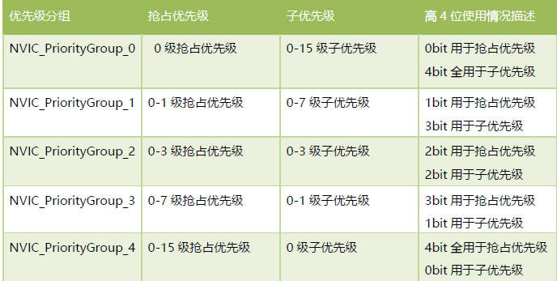
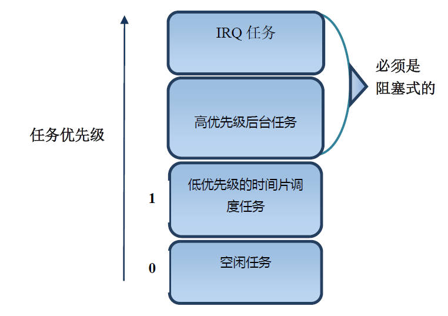
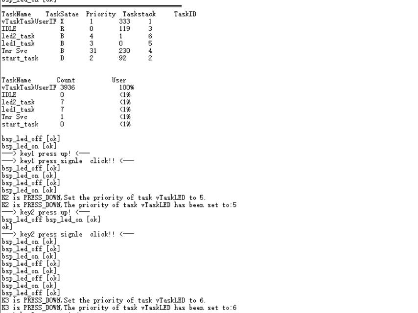

## RTOS内核 中断优先级配置与任务任务优先级配置

1. NVIC中断

   对于M3 和M4 内核的MCU，每个中断的优先级都是用寄存器中的8 位来设置，但是实际不需要这么多优先级，以STM32F1,F4为案例都是只使用了这个8 位中的高四位[7:4]，低四位取零。

   优先级分组，抢占优先级和子优先级相关概念

   **配置抢占优先级和子优先级，他们合并成的4bit 数字的数值越小，优先级越高**

   1. 具有高抢占式优先级的中断可以在具有低抢占式优先级的中断服务程序执行过程中被响应，即中断嵌套，或者说高抢占式优先级的中断可以抢占低抢占式优先级的中断的执行。

   2. 在抢占式优先级相同的情况下，有几个子优先级不同的中断同时到来，那么高子优先级的中断优先被响应.

   3. 在抢占式优先级相同的情况下，如果有低子优先级中断正在执行，高子优先级的中断要等待已被响应的低子优先级中断执行结束后才能得到响应，即子优先级不支持中断嵌套.

   4. **Reset、NMI、Hard Fault 优先级为负数，高于普通中断优先级，且优先级不可配置**

   5. 系统中断（比如：PendSV，SVC，SysTick）是不是一定比外部中断（比如SPI,USART）要高？

      答案：不是的，它们是在同一个NVIC 下面设置的。
      
      STM32 NVIC

   

   GD32 NVIC

   ```c
   /*!
       \brief      使能中断
       \param[in]  nvic_irq: 中断源，如
       \param[in]  nvic_irq_pre_priority: 抢占优先级
       \param[in]  nvic_irq_sub_priority: 子优先级
       \param[out] none
       \retval     none
   */
   void nvic_irq_enable(uint8_t nvic_irq, 
                        uint8_t nvic_irq_pre_priority, 
                        uint8_t nvic_irq_sub_priority)
       
      //nvic_irq_enable(COM_UART_IRQn[_com_uart], 2, 0);
   ```

   **一旦初始化好NVIC 的优先级分组后，切不可以在应用中再次更改.**

   | 优先级分组              | 抢占优先级取值 | 子优先级取值 |
   | ----------------------- | -------------- | ------------ |
   | NVIC_PRIGROUP_PRE0_SUB4 | 0              | 0-15         |
   | NVIC_PRIGROUP_PRE1_SUB3 | 0-1            | 0-7          |
   | NVIC_PRIGROUP_PRE2_SUB2 | 0-3            | 0-3          |
   | NVIC_PRIGROUP_PRE3_SUB1 | 0-7            | 0-1          |
   | NVIC_PRIGROUP_PRE4_SUB0 | 0-15           | 0            |

   ```c
   /*!
       \brief      设置优先级分组
       \param[in]  nvic_prigroup: the NVIC priority group
         \arg        NVIC_PRIGROUP_PRE0_SUB4: 0 bit 抢占优先级 ，4 bit 子优先级 
         \arg        NVIC_PRIGROUP_PRE1_SUB3: 1 bit 抢占优先级 ，3 bit 子优先级
         \arg        NVIC_PRIGROUP_PRE2_SUB2: 2 bit 抢占优先级 ，2 bit 子优先级
         \arg        NVIC_PRIGROUP_PRE3_SUB1: 3 bit 抢占优先级 ，1 bit 子优先级
         \arg        NVIC_PRIGROUP_PRE4_SUB0: 4 bit 抢占优先级 ，0 bit 子优先级
       \param[out] none
       \retval     none
   */
   void nvic_priority_group_set(uint32_t nvic_prigroup)
   {
       /* set the priority group value */
       SCB->AIRCR = NVIC_AIRCR_VECTKEY_MASK | nvic_prigroup;
   }
   ```

   **在这里继续强调下这一点，在NVIC 分组为4 的情况下，抢占优先级可配置范围是0-15，那么数值越小，抢占优先级的级别越高，即0 代表最高优先级，15 代表最低优先级**

2. 中断延迟

   中断延迟时间是衡量RTOS 实时操作系统的一项重要指标，那什么又是中断延迟呢？**从中断触发到执行中断服务程序的第一条指令这段时间就是中断延迟时间**。

3. 中断

   BASEPRI寄存器
   作用：
   BASEPRI有 32bit，但只有低 8位 [7:0]有效，也是可读可写的 。 BASEPRI寄存器 比起 PRIMASK和 FAULTMASK寄存器直接屏蔽掉大部分中断的方式， BASEPRI寄存器的功能显得更加细腻**，BASEPRI用于设置一个中断屏蔽的阈值， 设置好 BASEPRI后，中断优先级低于 BASEPRI的中断就都会被屏蔽掉**,FreeRTOS就是使用 BASEPRI寄存器来管理受 FreeRTOS管理的中断的，而不受 FreeRTOS管理的中断，则不受 FreeRTOS的影响。

   ```c
   __get_BASEPRI(); /* 读取BASEPRI值 */ 
   __set_BASEPRI(0); /* 清除BASEPRI（使能中断） */
   __set_BASEPRI(0x60); /* 设置BASEPRI（屏蔽优先级小于0x60的中断） */
   ```

3. 任务优先级配置注意点

   1. FreeRTOS 中任务的最高优先级是通过**FreeRTOSConfig.h 文件中的configMAX_PRIORITIES 进行配置**的，用户实际可以使用的**优先级范围是0 到configMAX_PRIORITIES – 1**。比如我们配置此宏定义为5，那么用户可以使用的优先级号是0,1,2,3,4，不包含5，对于这一点要特别的注意。
   
   2. 用户配置任务的优先级数值越小，那么此任务的优先级越低，空闲任务的优先级是0。

   3. 不管中断的优先级是多少，**中断的优先级永远高于任何任务的优先级，即任务在执行的过程中，中断来了就开始执行中**
      **断服务程序**
   
   4. 任务管理
   
      
   
      ◆IRQ 任务：IRQ 任务是指通过中断服务程序进行触发的任务，此类任务应该设置为所有任务里面优先级最高的。
      
      ◆ 高优先级后台任务：比如按键检测，触摸检测，USB 消息处理，串口消息处理等，都可以归为这一类任务。
   
      ◆ 低优先级的时间片调度任务：比如emWin 的界面显示，LED 数码管的显示等不需要实时执行的都可以归为这一类任务。实际应用中用户不必拘泥于将这些任务都设置为优先级1 的同优先级任务，可以设置多个优先级，只需注意这类任务不需要高实时性。
      
      ◆空闲任务：空闲任务是系统任务。
      
      ◆ 特别注意：I**RQ 任务和高优先级任务必须设置为阻塞式（调用消息等待或者延迟等函数即可）**，只有这样，**高优先级任务才会释放CPU 的使用权,从而低优先级任务才有机会得到执行。**
   
3. 任务优先级案例测试

   ```c
   //任务函数
   static void vTaskTaskUserIF(void *pvParameters);
   //任务句柄
   static TaskHandle_t xHandleTaskUserIF = NULL;
   extern struct Button btn1;
   extern struct Button btn2;
   extern struct Button btn3;
   //任务优先级
   #define START_USERIF_TASK_PRIO      1
   //任务堆栈大小    
   #define START_USERIF_TASK_SIZE      512  
   
   
   //任务优先级
   #define START_TASK_PRIO		2
   //任务堆栈大小	
   #define START_STK_SIZE 		128  
   //任务句柄
   TaskHandle_t StartTask_Handler;
   //任务函数
   void start_task(void *pvParameters);
   
   //任务优先级
   #define LED1_TASK_PRIO		3
   //任务堆栈大小	
   #define LED1_STK_SIZE 		50  
   //任务句柄
   TaskHandle_t LED1Task_Handler;
   //任务函数
   void LED_Thread1(void *pvParameters);
   
   //任务优先级
   #define LED2_TASK_PRIO		4
   //任务堆栈大小	
   #define LED2_STK_SIZE 		50  
   //任务句柄
   TaskHandle_t LED2Task_Handler;
   //任务函数
   void LED_Thread2(void *pvParameters);
   
   //----------------------------------------------------------------------------------
   //函 数 名: start_task
   //功能说明: 开始任务任务函数
   //形    参: 无
   //返 回 值: 无
   //----------------------------------------------------------------------------------
   void start_task(void *pvParameters)
   {
   
   	taskENTER_CRITICAL();           //进入临界区
       //创建LED1任务
       xTaskCreate((TaskFunction_t )LED_Thread1,     	
                   (const char*    )"led1_task",   	
                   (uint16_t       )LED1_STK_SIZE, 
                   (void*          )NULL,				
                   (UBaseType_t    )LED1_TASK_PRIO,	
                   (TaskHandle_t*  )&LED1Task_Handler);   
   
   
   	    xTaskCreate((TaskFunction_t )LED_Thread2,     	
                   (const char*    )"led2_task",   	
                   (uint16_t       )LED2_STK_SIZE, 
                   (void*          )NULL,				
                   (UBaseType_t    )LED2_TASK_PRIO,	
                   (TaskHandle_t*  )&LED2Task_Handler);   
   
       vTaskDelete(StartTask_Handler); //删除开始任务
       taskEXIT_CRITICAL();            //退出临界区
   
   }
   
   //----------------------------------------------------------------------------------
   //函 数 名: LED_Thread1
   //功能说明: LED1任务函数
   //形    参: 无
   //返 回 值: 无
   //---------------------------------------------------------------------------------- 
   static void LED_Thread1(void *pvParameters)
   {
       while(1)
       {
         bsp_led_on(LED1);
         vTaskDelay(500);
   			printf("bsp_led_on [ok]\r\n");
       }
   } 
   //----------------------------------------------------------------------------------
   //函 数 名: LED_Thread2
   //功能说明: LED2任务函数
   //形    参: 无
   //返 回 值: 无
   //----------------------------------------------------------------------------------
   static void LED_Thread2(void *pvParameters)
   {
       while(1)
       {
   			bsp_led_off(LED1);
          vTaskDelay(500);
         printf("bsp_led_off [ok]\r\n");
       }
   }
   
   
   /*
   *********************************************************************************************************
   *   函 数 名: vTaskTaskUserIF
   *   功能说明: 接口消息处理。
   *   形    参: pvParameters 是在创建该任务时传递的形参
   *   返 回 值: 无
   *   优 先 级: 1  (数值越小优先级越低，这个跟uCOS相反)
   *********************************************************************************************************
   */
   static void vTaskTaskUserIF(void *pvParameters)
   {
       /*
   				任务优先级的设置  vTaskPrioritySet(Task_Handler, num); //num优先级 ，Task_Handler任务句柄
   				任务优先级的获取  uxTaskPriorityGet(Task_Handler)
       */
       #if User_TaskPriority
       uint8_t pcWriteBuffer[500];
       uint8_t btn1_event_val=0;
       uint8_t btn2_event_val=0;
       uint8_t btn3_event_val=0;
       while(1) 
       {
               if(btn1_event_val != get_button_event(&btn1)) 
               {
                   btn1_event_val = get_button_event(&btn1);
                   if(btn1_event_val == PRESS_DOWN) 
                   {
                       
                       printf("=================================================\r\n");
                       printf("TaskName    TaskSatae  Priority  Taskstack     TaskID\r\n");
                       vTaskList((char *)&pcWriteBuffer);
                       printf("%s\r\n", pcWriteBuffer);
                   
                       printf("\r\nTaskName       Count          User\r\n");
                       vTaskGetRunTimeStats((char *)&pcWriteBuffer);
                       printf("%s\r\n", pcWriteBuffer);
                      
   
                   }
               } 
   
               if(btn2_event_val != get_button_event(&btn2)) 
               {
                   btn2_event_val = get_button_event(&btn2);
                   if(btn2_event_val == PRESS_DOWN) 
                   {    
                       printf("K2 is PRESS_DOWN,Set the priority of task vTaskLED to 5.\r\n");
                       vTaskPrioritySet( LED1Task_Handler, 5);
   									printf("K2 is PRESS_DOWN,The priority of task vTaskLED has been set to:%d\r\n",  (int)uxTaskPriorityGet(LED1Task_Handler));
                   }
               } 
   
               if(btn3_event_val != get_button_event(&btn3)) 
               {
                   btn3_event_val = get_button_event(&btn3);
                   if(btn3_event_val == PRESS_DOWN) 
                   {
                       printf("K3 is PRESS_DOWN,Set the priority of task vTaskLED to 6.\r\n");
                       vTaskPrioritySet( LED1Task_Handler, 6);
   									printf("K3 is PRESS_DOWN,The priority of task vTaskLED has been set to:%d\r\n",  (int)uxTaskPriorityGet(LED1Task_Handler));
                   }
               } 
               
       }
   
       #endif
   }
   ```
   
   
   
3. 

   
   
   