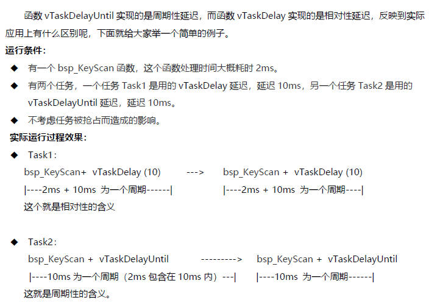
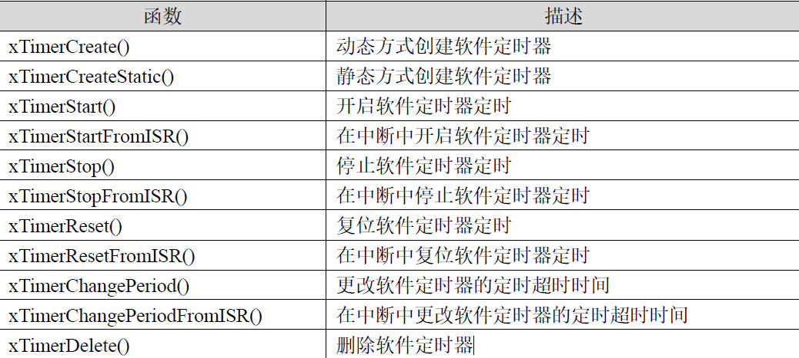
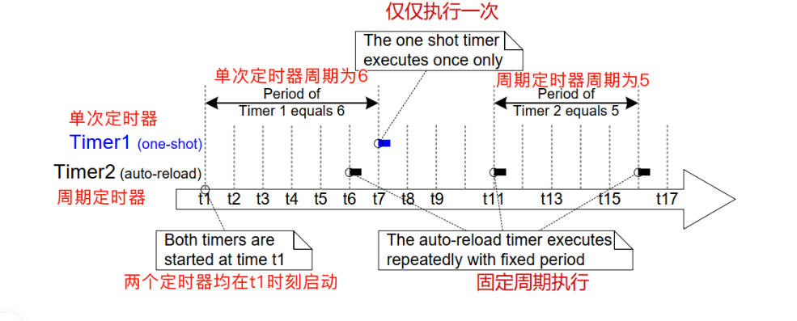
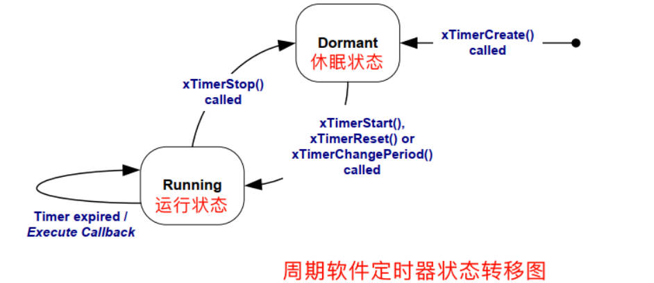
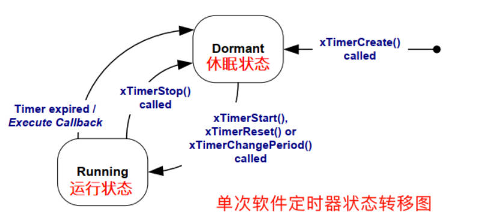

## RTOS内核  时钟管理与软件定时器

### 1.延迟函数

1. FreeRTOS 的时钟节拍

   任何操作系统都需要提供一个时钟节拍，以供系统处理诸如延时、超时等与时间相关的事件。

   对于Cortex-M3 内核和Cortex-M4 内核，都是用滴答定时器来实现系统时钟节拍的。

   **滴答定时器Systick**

   SysTick 定时器被捆绑在NVIC 中，用于产生SysTick 异常（异常号：15），滴答定时器是一个24 位的递减计数器，支持中断。使用比较简单，专门用于给操作系统提供时钟节。

   FreeRTOS 的系统时钟节拍可以在配置文件FreeRTOSConfig.h 里面设置：如下所示的宏定义配置表示系统时钟节拍是1KHz，即1ms

   ```c
   #define configTICK_RATE_HZ ( ( TickType_t ) 1000 )
   ```

2. 时间延迟

   FreeRTOS 中的时间延迟函数主要有以下两个作用

   ◆为周期性执行的任务提供延迟。

   ◆ **对于抢占式调度器，让高优先级任务可以通过时间延迟函数释放CPU 使用权，从而让低优先级任务可以得到执行**。

3. API函数

   vTaskDelay ()

   ```c
   void vTaskDelay(const TickType_t xTicksToDelay ); /* 延迟时间长度 */
   //延迟范围 0~portMAX_DELAY
   
    #if ( configUSE_16_BIT_TICKS == 1 )
           typedef uint16_t     TickType_t;
           #define portMAX_DELAY              ( TickType_t ) 0xffff
       #else
           typedef uint32_t     TickType_t;
           #define portMAX_DELAY              ( TickType_t ) 0xffffffffUL
   
   static void LED_Thread2(void *pvParameters)
   {
       while(1)
       {
   	   bsp_led_off(LED1);
          vTaskDelay(500);	//释放CPU使用权进入挂起状态
          printf("bsp_led_off [ok]\r\n");
       }
   }
   ```

   函数原型：

   void vTaskDelayUntil( TickType_t *pxPreviousWakeTime, const TickType_t xTimeIncrement ); 

   函数描述：

   **函数vTaskDelayUntil 用于周期性延迟。**

   第1 个参数，存储任务上次处于非阻塞状态时刻的变量地址。

   第2 个参数，周期性延迟时间。

   使用此函数需要在FreeRTOSConfig.h 配置文件中配置如下宏定义为1
   #define INCLUDE_vTaskDelayUntil 1

   ```c
   void vTaskDelayUntil( TickType_t *pxPreviousWakeTime, const TickType_t xTimeIncrement );
    TickType_t *pxPreviousWakeTime/* 存储任务上次处于非阻塞状态时刻的变量地址 */
    const TickType_t xTimeIncrement/* 周期性延迟时间 */
    
   static void vTaskLED(void *pvParameters)
   {
       TickType_t xLastWakeTime;
       const TickType_t xFrequency = 200;
       /* 获取当前的系统时间 */
       xLastWakeTime = xTaskGetTickCount();
       while(1)
       {
           bsp_LedToggle(2);
           /* vTaskDelayUntil 是绝对延迟，vTaskDelay 是相对延迟。*/
           vTaskDelayUntil(&xLastWakeTime, xFrequency);
       }
   }
   ```

   函数原型：

   **xTaskGetTickCount(void)**

   函数描述：

   函数**xTaskGetTickCount 用于获取系统当前运行的时钟节拍数。**

   函数注意：

   **此函数用于在任务代码里面调用**，如果在中断服务程序里面调用的话，需要使用函数xTaskGetTickCountFromISR，这两个函数切不可混用。

   ```c
   if(btn1_event_val != get_button_event(&btn1)) 
               {
                   btn1_event_val = get_button_event(&btn1);
                   if(btn1_event_val == PRESS_DOWN) 
                   {
                       printf("当前的系统时钟节拍数 = %d\r\n", xTaskGetTickCount());
                   }
               } 
   ```

   函数原型：

   **volatile TickType_t xTaskGetTickCountFromISR( void );**

   函数描述：

   函数xTaskGetTickCountFromISR 用于获取系统当前运行的时钟节拍数。

   函数注意：

   **此函数用于在中断服务程序里面调用**，如果在任务里面调用的话，需要使用函数xTaskGetTickCount，这两个函数切不可混用。

   ```c
   void XXX_IRQHandler( void )
   {
   	TickType_t xTickCount;
   	xTickCount = xTaskGetTickCountFromISR();
       printf("当前的系统时钟节拍数 = %d\r\n", xTickCount);
   }
   ```

4. 绝对延迟与相对延迟

   

   ### 2.定时器组（软件定时器）

   参考教程 

   1. 定时器

      定时器，是指从指定的时刻开始，经过一个指定时间，然后触发一个超时事件，用户可以自定义定时器的周期与频率。

   2. 硬件定时器

      **硬件定时器是芯片本身提供的定时功能**。一般是由外部晶振提供给芯片输入时钟，芯片向软件模块提供一组配置寄存器，接受控制输入，到达设定时间值后芯片中断控制器产生时钟中断。**硬件定时器的精度一般很高，可以达到纳秒级别，并且是中断触发方式**。

   3. 软件定时器

      软件定时器，**软件定时器是由操作系统提供的一类系统接口，它构建在硬件定时器基础之上，使系统能够提供不受硬件定时器资源限制的定时器服务，它实现的功能与硬件定时器也是类似的**。

   4. 硬件定时器与软件定时器区别

      **使用硬件定时器时，每次在定时时间到达之后就会自动触发一个中断，用户在中断中处理信息**；**而使用软件定时器时，需要我们在创建软件定时器时指定时间到达后要调用的函数**（也称超时函数/回调函数，为了统一，下文均用回调函数描述），**在回调函数中处理信息。**

      注意：软件定时器回调函数的上下文是任务。

      软件定时器的回调函数是一个返回值为 void 类型，并且只有软件定时器句柄一个参数的 C 语言函数，其函数的具体原型如下所述.

      ```c
      /**
        * @brief  软件定时器回调函数
        * @param  xTimer：软件定时器句柄
        * @retval None
        */
      void ATimerCallback(TimerHandle_t xTimer)
      {
      	/* do something */
      }
      ```

   5. RTOS中的软件定时器注意点

      **一般系统利用SysTick (系统调度)作为软件定时器的基础时钟**，软件定时器的回调函数类似硬件的中断服务函数，所以，**回调函数也要快进快出，而且回调函数中不能有任何阻塞任务运行的情况（软件定时器回调函数的上下文环境是任务）**，比如vTaskDelay(), vTaskDelayUntil()以及非零延迟的消息队列和信号量相关的函数。将定时器任务挂起，会导致定时器任务负责的相关功能都不能正确执行了。

   6. FreeRTOS TimerAPI

      FreeRTOS 操作系统提供软件定时器功能，软件定时器的使用相当于扩展了定时器的数
      量，允许创建更多的定时业务。FreeRTOS 软件定时器功能上支持：

      

   7. 软件定时器类型

      FreeRTOS 提供的软件定时器支持**单次模式和周期模式**，单次模式和周期模式的定时时间到之后都会调用软件定时器的回调函数，用户可以在回调函数中加入要执行的工程代码。

      单次模式就是用户创建了定时器并启动了定时器后，定时时间到将不再重新执行，这就是单次模式软件定时器的含义。周期模式就是此定时器会按照设置的时间周期重复去执行，这就是周期模式软件定时器的含义。

      

      

      

      1. 不管是单次定时器还是周期定时器，**在定时器创建成功之后都处于休眠状态，一旦调用启动、复位或改变定时器周期的 API 函数就会使定时器从休眠状态转移到运行状态**；
      2. **单次定时器定时时间到期之后执行一次回调函数就会自动转换为休眠状态，而周期定时器会一直处于运行状态**；
      3. **当对处于运行状态的定时器调用停止 API 函数时，不管是哪种定时器都会转变为休眠状态**。

      定时器的状态可以通过 xTimerlsTimerActive() API 函数查询，该函数具体声明如下所述：

      ```c
      /**
        * @brief  查询软件定时器是否处于运行或休眠状态
        * @param  xTimer：要查询的定时器句柄
        * @retval 如果定时器处于休眠状态则返回pdFALSE，如果定时器处于运行状态则返回pdTRUE
      **/
      BaseType_t xTimerIsTimerActive(TimerHandle_t xTimer);
      ```

   8. API函数重点

      1. 创建软件定时器 xTimerCreate

         在FreeRTOSConfig.h 文件中使能宏定义：（建议默认开启）

         ```c
         #define configUSE_TIMERS 1
         ```

         函数原型：

         ```c
         TimerHandle_t xTimerCreate( const char * const pcTimerName, /* 定时器名字 */
         							const TickType_t xTimerPeriod, /* 定时器周期，单位系统时钟节拍 */
         							const UBaseType_t uxAutoReload, /* 选择单次模式或者周期模式 */
         							void * const pvTimerID, /* 定时器ID */
         							TimerCallbackFunction_t pxCallbackFunction ); /* 定时器回调函数 */
         ```

         函数描述：
         函数xTimerCreate 用于创建软件定时器。
         
         ◆ 第1 个参数是定时器名字，用于调试目的，方便识别不同的定时器。
         
         ◆ 第2 个参数是定时器周期，单位系统时钟节拍。
         
         ◆ 第3 个参数是选择周期模式还是单次模式，若参数为pdTRUE，则表示选择周期模式，若参数为
         pdFALSE，则表示选择单次模式。

         ◆ 第4 个参数是定时器ID，当创建不同的定时器，但使用相同的回调函数时，在回调函数中通过不同的ID 号来区分不同的定时器。
         
         ◆ 第5 个参数是定时器回调函数。
         
         ◆ 返回值，创建成功返回定时器的句柄，由于FreeRTOSCongfig.h 文件中heap 空间不足，或者定时器周期设置为0，会返回NULL。
         
         ```c
         static void AppObjCreate (void)
         {
         	uint8_t i;
         	const TickType_t  xTimerPer[2] = {100, 100};
         	
         	/* 
         	  1. 创建定时器，如果在RTOS调度开始前初始化定时器，那么系统启动后才会执行。
         	  2. 统一初始化两个定时器，他们使用共同的回调函数，在回调函数中通过定时器ID来区分
         	     是那个定时器的时间到。当然，使用不同的回调函数也是没问题的。
         	*/
         	for(i = 0; i < 2; i++)
         	{
         		xTimers[i] = xTimerCreate("Timer",          /* 定时器名字 */
         							       xTimerPer[i],    /* 定时器周期,单位时钟节拍 */
         							       pdTRUE,          /* 周期性 */
         							       (void *) i,      /* 定时器ID */
         							       vTimerCallback); /* 定时器回调函数 */
         
         		if(xTimers[i] == NULL)
         		{
         			/* 没有创建成功，用户可以在这里加入创建失败的处理机制 */
         		}
         		else
         		{
         			 /* 启动定时器，系统启动后才开始工作 */
         			 if(xTimerStart(xTimers[i], 100) != pdPASS)
         			 {
         				 /* 定时器还没有进入激活状态 */
         			 }
         		}
         	}
         }
         ```
         
         2. 启动定时器xTimerStart
         
            函数原型：

            ```c
            BaseType_t xTimerStart( TimerHandle_t xTimer, /* 定时器句柄 */
            						TickType_t xBlockTime ); 
            /* 成功启动定时器前的最大等待时间设置，单位系统时钟节拍 */
            ```

            函数描述：

            ◆ 第1 个参数是定时器句柄。

            ◆ 第2 个参数是成功启动定时器前的最大等待时间设置，单位系统时钟节拍，定时器组的大部分API函数不是直接运行，而是通过消息队列给定时器任务发消息来实现的，此参数设置的等待时间就是当消息队列已经满的情况下，等待消息队列有空间时的最大等待时间。
         
            ◆ 返回值，返回pdFAIL 表示此函数向消息队列发送消息失败，返回pdPASS 表示此函数向消息队列发送消息成功。定时器任务实际执行消息队列发来的命令依赖于定时器任务的优先级，如果定时器任务是高优先级会及时得到执行，如果是低优先级，就要等待其余高优先级任务释放CPU 权才可以得到执行。

         3. 获取定时器ID  pvTimerGetTimerID
         
            函数原型：
         
            ```c
            void *pvTimerGetTimerID( TimerHandle_t xTimer ); /* 定时器句柄 */
            ```
         
            函数描述：
            函数pvTimerGetTimerID 用于返回使用函数xTimerCreate 创建的软件定时器ID。
         
            ◆ 第1 个参数是定时器句柄。
         
            ◆ 返回值，返回定时器ID。
         
            ```c
            /*
            *********************************************************************************************
            * 函 数 名: vTimerCallback
            * 功能说明: 定时器回调函数
            * 形 参: 无
            * 返 回 值: 无
            *********************************************************************************************
            */
            static void vTimerCallback(xTimerHandle pxTimer)
            {
                    uint32_t ulTimerID;
                    configASSERT(pxTimer);
                    /* 获取那个定时器时间到 */
                    ulTimerID = (uint32_t)pvTimerGetTimerID(pxTimer);
                    /* 处理定时器0 任务 */
                    if(ulTimerID == 0)
                    {
                    	bsp_LedToggle(1);
                    }
                    /* 处理定时器1 任务 */
                    if(ulTimerID == 1)
                    {
                   		 bsp_LedToggle(2);
                    }
            }
            ```
         

   9. 测试案例
   
      在rtos软件定时器中使用multi-button中间件库
   
      https://github.com/0x1abin/MultiButton
   
      ```c
      #include "button.h"
      
      unit8_t btn1_id = 0;
      
      struct Button btn1;
      
      uint8_t read_button_GPIO(uint8_t button_id)
      {
      	// you can share the GPIO read function with multiple Buttons
      	switch(button_id)
      	{
      		case btn1_id:
      			return HAL_GPIO_ReadPin(B1_GPIO_Port, B1_Pin);
      			break;
      
      		default:
      			return 0;
      			break;
      	}
      }
      void BTN1_PRESS_DOWN_Handler(void* btn)
      {
      	//do something...
      }
      
      void BTN1_PRESS_UP_Handler(void* btn)
      {
      	//do something...
      }
      
      ...
      
      int main()
      {
      	button_init(&btn1, read_button_GPIO, 0, btn1_id);
      	button_attach(&btn1, PRESS_DOWN,       BTN1_PRESS_DOWN_Handler);
      	button_attach(&btn1, PRESS_UP,         BTN1_PRESS_UP_Handler);
      	button_attach(&btn1, PRESS_REPEAT,     BTN1_PRESS_REPEAT_Handler);
      	button_attach(&btn1, SINGLE_CLICK,     BTN1_SINGLE_Click_Handler);
      	button_attach(&btn1, DOUBLE_CLICK,     BTN1_DOUBLE_Click_Handler);
      	button_attach(&btn1, LONG_PRESS_START, BTN1_LONG_PRESS_START_Handler);
      	button_attach(&btn1, LONG_PRESS_HOLD,  BTN1_LONG_PRESS_HOLD_Handler);
      	button_start(&btn1);
      
      	//make the timer invoking the button_ticks() interval 5ms.
      	//This function is implemented by yourself.
      	__timer_start(button_ticks, 0, 5);
      
      	while(1)
      	{}
      }
      ```
   
      
   
      ```c
      #if User_OS_TIMER
      //----------------------------------------------------------------------------------
      //函 数 名: vTimerCallback
      //功能说明: 定时器回调函数
      //形    参: 无
      //返 回 值: 无
      //----------------------------------------------------------------------------------
      static TimerHandle_t xTimers = NULL;
      void vTimerCallback(xTimerHandle pxTimer)
      {
      	//make the timer invoking the button_ticks() interval 5ms.
      	//This function is implemented by yourself.
      	button_ticks(); //主要是将button_ticks()放到定时器中进行处理
      
      }
      //----------------------------------------------------------------------------------
      //函 数 名: AppObjCreate
      //功能说明: 创建定时器
      //形    参: 无
      //返 回 值: 无
      //----------------------------------------------------------------------------------
      void OsTimerCreate (void)
      {
      	xTimers = xTimerCreate("Timer",                     /* 定时器名字 */
      							5,    			            /* 定时器周期,单位时钟节拍 */
      							pdTRUE,          			/* 周期性 */
      							(void *) 1,      			/* 定时器ID */
      							vTimerCallback); 			/* 定时器回调函数 */
      
      			 /* 启动定时器，系统启动后才开始工作 */
      			 xTimerStart(xTimers, 100);
      }
      
      #endif
      ```

   10. 
   
       
   
       