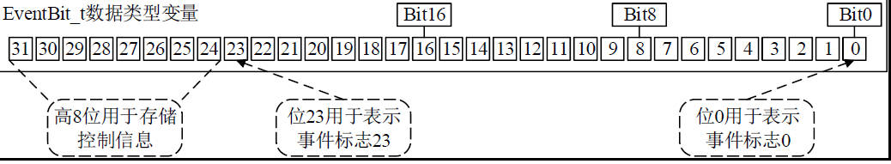
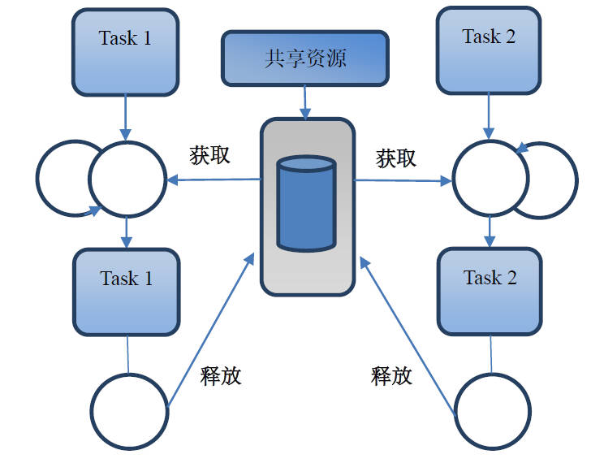
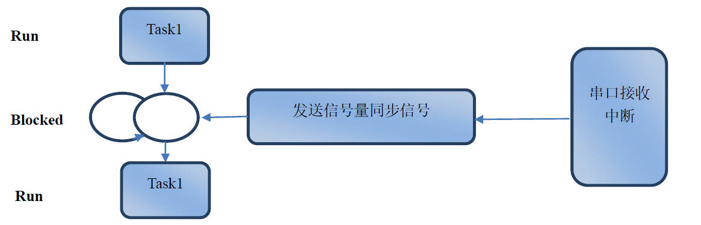
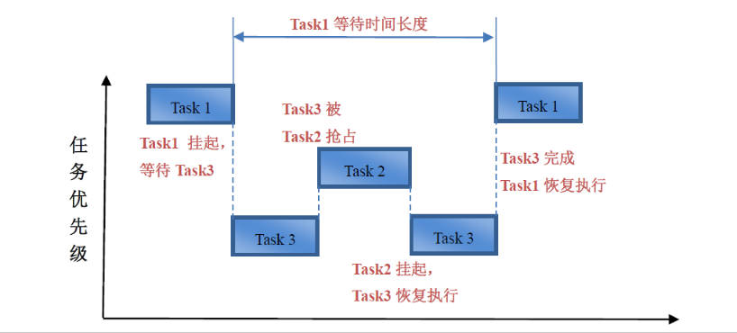
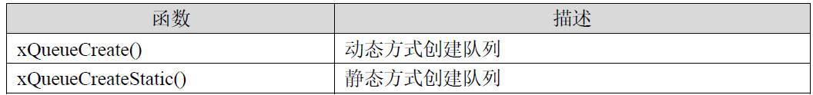
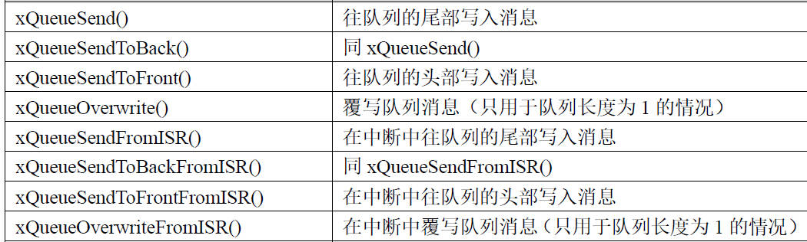
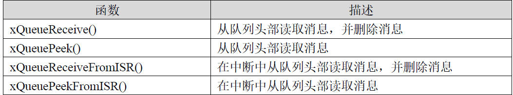
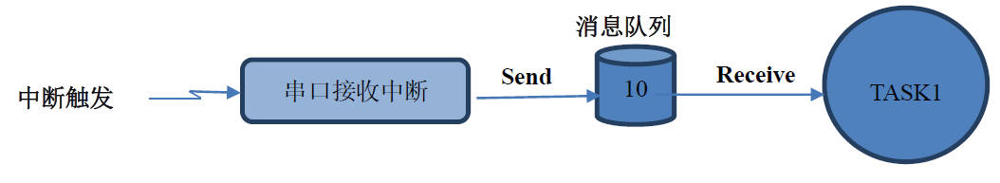

## RTOS内核 任务通信与任务同步

### 1. 任务同步（本质上是标志位，通知其他任务）

1. FreeRTOS 事件标志组

   **任务间事件标志组的实现是指各个任务之间使用事件标志组实现任务的通信或者同步机制**

   1. 事件标志组与全局变量的区别

      使用全局变量相比事件标志组主要有如下三个问题：
   
      ◆ **使用事件标志组可以让RTOS 内核有效地管理任务**，而全局变量是无法做到的，任务的超时等机制需
      要用户自己去实现。
   
      ◆ 使用了全局变量就要**防止多任务的访问冲突**，而**使用事件标志组**则处理好了这个问题，用户无需担心。
   
      ◆ 使用**事件标志组可以有效地解决中断服务程序和任务之间的同步问题**。
   
   2. **宏定义 configUSE_16_BIT_TICKS** 
   
      #define configUSE_16_BIT_TICKS 1
      配置宏定义configUSE_16_BIT_TICKS 为1 时，每创建一个事件标志组，用户可以使用的事件标志是8 个。
      #define configUSE_16_BIT_TICKS 0
   
      配置宏定义configUSE_16_BIT_TICKS 为0 时，每创建一个事件标志组，用户可以使用的事件标志是24个。
   
      
   
      **其实就是定义了一个16 位变量，仅使用了低8bit或者定义了一个32 位变量，仅使用了低24bit。每一个bit 用0 和1 两种状态来代表事件标志**。
   
      ```c
      //1表示为16位无符号整形，0表示为32位无符号整形
      //系统节拍计数器变量数据类型
      #define configUSE_16_BIT_TICKS				0     
      
      typedef TickType_t EventBits_t;
      
      #if ( configUSE_16_BIT_TICKS == 1 )
      	typedef uint16_t     TickType_t;
      	#define portMAX_DELAY              ( TickType_t ) 0xffff
      #else
      	typedef uint32_t     TickType_t;
      	#define portMAX_DELAY              ( TickType_t ) 0xffffffffUL
      /* 32-bit tick type on a 32-bit architecture, so reads of the tick count do
       * not need to be guarded with a critical section. */
      	#define portTICK_TYPE_IS_ATOMIC    1
      #endif
      ```
   
   2. FreeRTOS  信号量（计数与二值）
   
      1. 信号量作用
   
         任务间信号量的实现是指各个任务之间使用信号量实现任务的同步或者资源共享功。
   
         
   
         运行条件：
   
         ◆ 创建2 个任务Task1 和Task2。
   
         ◆ 创建计数信号量可用资源为1。
   
         运行过程描述如下：
   
         ◆ **任务Task1 运行过程中调用函数xSemaphoreTake 获取信号量资源，如果信号量没有被任务Task2占用，Task1 将直接获取资源。如果信号量被Task2 占用，任务Task1 将由运行态转到阻塞状态，等待资源可用**。**一旦获取了资源并使用完毕后会通过函数xSemaphoreGive 释放掉资源。**
         ◆ **任务Task2 运行过程中调用函数xSemaphoreTake 获取信号量资源，如果信号量没有被任务Task1占用，Task2 将直接获取资源**。**如果信号量被Task1 占用，任务Task2 将由运行态转到阻塞状态，等待资源可用。一旦获取了资源并使用完毕后会通过函数xSemaphoreGive 释放掉资源**。
   
      2. 信号量与中断
   
         **FreeRTOS 中断方式信号量的实现是指中断函数和FreeRTOS 任务之间使用信号量。信号量的中断方式主要是用于实现任务同步**，与事件标志组中断方式是一样的。
   
         
   
         运行条件：
   
         ◆ 创建一个任务Task1 和一个串口接收中断。
   
         ◆ 信号量的初始值为0，串口中断调用函数xSemaphoreGiveFromISR 释放信号量，任务Task1 调用函数xSemaphoreTake 获取信号量资源。
         运行过程描述如下：
   
         ◆ 任务Task1 运行过程中调用函数xSemaphoreTake，**由于信号量的初始值是0，没有信号量资源可用，任务Task1 由运行态进入到阻塞态**。
   
         ◆ Task1 阻塞的情况下，串口接收到数据进入到了串口中断服务程序，**在串口中断服务程序中调用函数**
         **xSemaphoreGiveFromISR 释放信号量资源，信号量数值加1，此时信号量计数值为1，任务Task1由阻塞态进入到就绪态，在调度器的作用下由就绪态又进入到运行态，任务Task1 获得信号量后，信号量数值减1，此时信号量计数值又变成了0**。
   
         ◆ 再次循环执行时，任务Task1 调用函数xSemaphoreTake 由于没有资源可用再次进入到阻塞态，等待串口释放信号量资源，如此往复循环。
   
      3. 重点API函数
   
         1. xSemaphoreCreateCounting 用于创建计数信号量
   
            函数原型：
   
            ```c
            SemaphoreHandle_t xSemaphoreCreateCounting( UBaseType_t uxMaxCount, /* 支持的最大计数值 */
            											UBaseType_t uxInitialCount); /* 初始计数值 */
            ```
   
            函数描述：函数xSemaphoreCreateCounting 用于创建计数信号量。
   
            ◆ 第1 个参数是设置此计数信号量支持的最大计数值。
   
            ◆ 第2 个参数是设置计数信号量的初始值。
   
            ◆ 返回值，**如果创建成功会返回消息队列的句柄，如果由于FreeRTOSConfig.h 文件中heap 大小不足，无法为此消息队列提供所需的空间会返回NULL**。
   
            使用此函数要在FreeRTOSConfig.h 文件中使能宏定义：**#define configUSE_COUNTING_SEMAPHORES 1**
   
            ```c
            static SemaphoreHandle_t xSemaphore = NULL;
            /* 初始化有1 个可用资源，当前可用资源为0，此时计数信号量的功能等同二值信号量 */
            xSemaphore = xSemaphoreCreateCounting(1, 0);
            
            if(xSemaphore == NULL)
            {
            	/* 没有创建成功，用户可以在这里加入创建失败的处理机制 */
            }
            ```
   
         2. xSemaphoreGive 释放信号量
   
            函数原型：
   
            ```c
            xSemaphoreGive( SemaphoreHandle_t xSemaphore ); /* 信号量句柄 */
            ```
   
            函数描述：
            函数xSemaphoreGive 用于在任务代码中释放信号量。
   
            ◆ 第1 个参数是信号量句柄。
   
            ◆ **返回值，如果信号量释放成功返回pdTRUE，否则返回pdFALSE，因为计数信号量的实现是基于消息队列，返回失败的主要原因是消息队列已经满了**。
            使用这个函数要注意以下问题：
   
            1. 此函数是基于消息队列函数xQueueGenericSend 实现的。
            2. **此函数是用于任务代码中调用的，故不可以在中断服务程序中调用此函数，中断服务程序中使用的是**
               **xSemaphoreGiveFromISR。**
            3. 使用此函数前，一定要保证用函数xSemaphoreCreateBinary(), xSemaphoreCreateMutex() 或者
               xSemaphoreCreateCounting()创建了信号量。
            4. **此函数不支持使用xSemaphoreCreateRecursiveMutex()创建的信号量**。
   
            ```c
            static void vTask(void *pvParameters)
            {
                uint8_t ucKeyCode;
                uint8_t pcWriteBuffer[500];
                while(1)
                {
                    ucKeyCode = bsp_GetKey();
                    if (ucKeyCode != KEY_NONE)
                    {
                    	switch (ucKeyCode)
                        {
                        /* K2 键按下 直接发送同步信号给任务vTaskMsgPro */
                        case KEY_DOWN_K2:
                            printf("K2 键按下，直接发送同步信号给任务vTaskMsgPro\r\n");
                            xSemaphoreGive(xSemaphore);//当按键按下时，释放信号量，通知其他任务可以访问共享资源
                            /* 其他的键值不处理 */
                        default:
                        break;
                        }
                    }
                    vTaskDelay(20);
                }
            }
            ```
   
         3. xSemaphoreGiveFromISR 用于中断服务程序中释放信号量
   
            函数原型：
   
            ```c
            xSemaphoreGiveFromISR(SemaphoreHandle_t xSemaphore, /* 信号量句柄 */
            					signed BaseType_t *pxHigherPriorityTaskWoken
                                  /* 高优先级任务是否被唤醒的状态保存 */
            )
            ```
   
            函数描述
   
            函数xSemaphoreGiveFromISR 用于中断服务程序中释放信号量。
   
            ◆ 第1 个参数是信号量句柄。
   
            ◆ 第2 个参数用于保存是否有高优先级任务准备就绪。如果函数执行完毕后，此参数的数值是pdTRUE，说明有高优先级任务要执行，否则没有。
   
            ◆ 返回值，如果信号量释放成功返回pdTRUE，否则返回errQUEUE_FULL。使用这个函数要注意以下问题：
   
            1. 此函数是基于消息队列函数xQueueGiveFromISR 实现。
            2. **此函数是用于中断服务程序中调用的，故不可以任务代码中调用此函数，**任务代码中中使用的是
                xSemaphoreGive。
            3. 使用此函数前，一定要保证用函数xSemaphoreCreateBinary()或者 xSemaphoreCreateCounting()创建了信号量。
            4. 此函数不支持使用xSemaphoreCreateMutex ()创建的信号量。
   
            ```c
            static void TIM2_IRQHandler (void)
            {
            	BaseType_t xHigherPriorityTaskWoken = pdFALSE;
            	/* 中断消息处理，此处省略 */
            	……
            	/* 发送同步信号 */
            	xSemaphoreGiveFromISR(xSemaphore, &xHigherPriorityTaskWoken);
                /* 如果xHigherPriorityTaskWoken = pdTRUE，那么退出中断后切到当前最高优先级任务执行 */
                portYIELD_FROM_ISR(xHigherPriorityTaskWoken);
            }
            ```
   
         4. xSemaphoreTake 任务中获取信号量
            函数原型：
   
            ```c
            xSemaphoreTake( SemaphoreHandle_t xSemaphore, /* 信号量句柄 */
                           TickType_t xTicksToWait ); /* 等待信号量可用的最大等待时间 */
            ```
   
            函数描述：
            函数xSemaphoreTake 用于在任务代码中获取信号量。
            ◆ 第1 个参数是信号量句柄。
   
            ◆ 第2 个参数是没有信号量可用时，等待信号量可用的最大等待时间，单位系统时钟节拍。
   
            ◆ 返回值，如果创建成功会获取信号量返回pdTRUE，否则返回pdFALSE。
   
            使用这个函数要注意以下问题：
            1. 此函数是用于任务代码中调用的，故不可以在中断服务程序中调用此函数，中断服务程序使用的是
                xSemaphoreTakeFromISR。
   
            2. **如果消息队列为空且第2 个参数为0，那么此函数会立即返回**。（等待时间为0）
   
            3. 如果用户将FreeRTOSConfig.h 文件中的宏定义INCLUDE_vTaskSuspend 配置为1 且第2 个参数配
                置为portMAX_DELAY，那么此函数会永久等待直到信号量可用
   
              ```c
              static void vTaskMsgPro(void *pvParameters)
              {
              	BaseType_t xResult;
              	const TickType_t xMaxBlockTime = pdMS_TO_TICKS(300); /* 设置最大等待时间为300ms */
              	while(1)
              	{
                      xResult = xSemaphoreTake(xSemaphore, (TickType_t)xMaxBlockTime);
                      if(xResult == pdTRUE)
                      {
                          /* 接收到同步信号 */
                          printf("接收到同步信号\r\n");
                      }
              		else
              		{
                          /* 超时 */
                           printf("超时\r\n");
              		}
              	}
              }
              ```
   
   4. FreeRTOS  互斥量
   
      1. 优先级翻转问题
   
         
   
         运行条件：
   
         ◆ 创建3 个任务Task1，Task2 和Task3，优先级分别为3，2，1。也就是Task1 的优先级最高。
   
         ◆ **任务Task1 和Task3 互斥访问串口打印printf**，采用二值信号实现互斥访问。
   
         ◆ **起初Task3 通过二值信号量正在调用printf，被任务Task1 抢占，开始执行任务Task1**，也就是上图的起始位置。
   
         运行过程描述如下：
   
         ◆ **任务Task1 运行的过程需要调用函数printf，发现任务Task3 正在调用，任务Task1 会被挂起，等待Task3 释放函数printf。**
   
         ◆ 在调度器的作用下，**任务Task3 得到运行，Task3 运行的过程中，由于任务Task2 就绪，抢占了Task3的运行**。优先级翻转问题就出在这里了，从任务执行的现象上看，**任务Task1 需要等待Task2 执行完毕才有机会得到执行**，这个与抢占式调度正好反了，**正常情况下应该是高优先级任务抢占低优先级任务的执行，这里成了高优先级任务Task1 等待低优先级任务Task2 完成。所以这种情况被称之为优先级翻转问题**。
   
         ◆ **任务Task2 执行完毕后，任务Task3 恢复执行，Task3 释放互斥资源后，任务Task1 得到互斥资源，从而可以继续执行**。
   
      2. 互斥量解决优先级翻转问题
   
         使用互斥量运行过程描述如下：
   
         ◆ 低优先级任务Task1 执行过程中先获得互斥资源printf 的执行。此时任务Task2 抢占了任务Task1的执行，任务Task1 被挂起。任务Task2 得到执行。
   
         ◆ 任务Task2 执行过程中也需要调用互斥资源，但是发现任务Task1 正在访问，此时任务Task1 的优先级会被提升到与Task2 同一个优先级，也就是优先级3，这个就是所谓的优先级继承（Priority inheritance），这样就有效地防止了优先级翻转问题。任务Task2 被挂起，任务Task1 有新的优先级继续执行。
   
         ◆ 任务Task1 执行完毕并释放互斥资源后，优先级恢复到原来的水平。由于互斥资源可以使用，任务Task2 获得互斥资源后开始执行
   
      3. API函数
   
         1. xSemaphoreCreateMutex () 函数xSemaphoreCreateMutex 用于创建互斥信号量
   
            ```c
            static SemaphoreHandle_t xMutex = NULL;
            static void AppObjCreate (void)
            {
                /* 创建互斥信号量 */
                xMutex = xSemaphoreCreateMutex();
                if(xSemaphore == NULL)
                {
                /* 没有创建成功，用户可以在这里加入创建失败的处理机制 */
                }
            }
            ```
   
         2. xSemaphoreGive ()
   
            ```c
            xSemaphoreGive( SemaphoreHandle_t xSemaphore ); /* 信号量句柄 */
            ```
   
            函数描述：函数xSemaphoreGive 用于在任务代码中释放信号量。
            ◆ 第1 个参数是信号量句柄。
   
            ◆ 返回值，如果信号量释放成功返回pdTRUE，否则返回pdFALSE，因为信号量的实现是基于消息队列，返回失败的主要原因是消息队列已经满了。
   
            ```c
            static SemaphoreHandle_t xMutex = NULL;
            /*
            *********************************************************************************************************
            * 函 数 名: vTaskLED
            * 功能说明: 实现串口的互斥访问，防止多个任务同时访问造成串口打印乱码
            * 形 参: pvParameters 是在创建该任务时传递的形参
            * 返 回 值: 无
            * 优 先 级: 2
            *********************************************************************************************************
            */
            static void vTaskLED(void *pvParameters)
            {
                TickType_t xLastWakeTime;
                const TickType_t xFrequency = 200;
                /* 获取当前的系统时间 */
                xLastWakeTime = xTaskGetTickCount();
                while(1)
                {
                    /* 互斥信号量，xSemaphoreTake 和xSemaphoreGive 一定要成对的调用 */
                    xSemaphoreTake(xMutex, portMAX_DELAY);
                    printf("任务vTaskLED 在运行\r\n");
                    bsp_LedToggle(2);
                    bsp_LedToggle(3);
                    xSemaphoreGive(xMutex);
                    /* vTaskDelayUntil 是绝对延迟，vTaskDelay 是相对延迟。*/
                    vTaskDelayUntil(&xLastWakeTime, xFrequency);
                }
            }
            ```
   
         3. xSemaphoreTake ()
   
            函数原型：
   
            ```c
            xSemaphoreTake( SemaphoreHandle_t xSemaphore, /* 信号量句柄 */
                           TickType_t xTicksToWait ); /* 等待信号量可用的最大等待时间 */
            ```
   
            函数描述：函数xSemaphoreTake 用于在任务代码中获取信号量。
   
            ◆ 第1 个参数是信号量句柄。
   
            ◆ 第2 个参数是没有信号量可用时，等待信号量可用的最大等待时间，单位系统时钟节拍。
   
            ◆ 返回值，如果创建成功会获取信号量返回pdTRUE，否则返回pdFALSE。
   
            使用这个函数要注意以下问题：
            1. 此函数是用于任务代码中调用的，故不可以在中断服务程序中调用此函数，中断服务程序使用的是
            xSemaphoreTakeFromISR。
            2. **如果消息队列为空且第2 个参数为0，那么此函数会立即返回**。**(等待时间为0 ，立即返回)**
            3. 如果用户将FreeRTOSConfig.h 文件中的宏定义INCLUDE_vTaskSuspend 配置为1 且第2 个参数配置为portMAX_DELAY，那么此函数会永久等待直到信号量可用.**（portMAX_DELAY，一直等待）**
   
   5. 任务信号量
   
      1. 任务计数信号量
   
         任务计数信号量与计数信号量要实现的功能是一样的，不同的是调用的函数和使用的计数变量：
   
         ◆ 任务计数信号量的计数变量是通过任务控制块中的一个32 位变量ulNotifiedValue 实现计数。计数信号量创建后会有自己的计数变量。
   
         ◆ 任务计数信号量是通过函数ulTaskNotifyTake()替代函数xSemaphoreTake()实现资源获取，即对计数信号量数值进行减一操作。
   
         ◆ 任务计数信号量是通过函数xTaskNotifyGive() 和vTaskNotifyGiveFromISR()替代xSemaphoreGive() 和xSemaphoreGiveFromISR()实现资源释放，即对计数信号量的数值进行加一操作。
   
         **ulTaskNotifyTake()获取信号量  **
   
         **xTaskNotifyGive()释放信号量**
   
         ```c
         static void vTaskTaskUserIF(void *pvParameters)
         {
         	uint8_t ucKeyCode;
         	uint8_t pcWriteBuffer[500];
         	
         
             while(1)
             {
         		ucKeyCode = bsp_GetKey();
         		
         		if (ucKeyCode != KEY_NONE)
         		{
         			switch (ucKeyCode)
         			{
         				/* K1键按下 打印任务执行情况 */
         				case KEY_DOWN_K1:			 
         					printf("=================================================\r\n");
         					printf("任务名      任务状态 优先级   剩余栈 任务序号\r\n");
         					vTaskList((char *)&pcWriteBuffer);
         					printf("%s\r\n", pcWriteBuffer);
         				
         					printf("\r\n任务名       运行计数         使用率\r\n");
         					vTaskGetRunTimeStats((char *)&pcWriteBuffer);
         					printf("%s\r\n", pcWriteBuffer);
         					break;
         				
         				/* K2键按下 直接发送消息给任务vTaskMsgPro */
         				case KEY_DOWN_K2:
         					printf("K2键按下，直接发送消息给任务vTaskMsgPro \r\n");
         					xTaskNotifyGive(xHandleTaskMsgPro);
         				
         				/* 其他的键值不处理 */
         				default:                     
         					break;
         			}
         		}
         		
         		vTaskDelay(20);
         	}
         }
         static void vTaskMsgPro(void *pvParameters)
         {
         	const TickType_t xBlockTime = pdMS_TO_TICKS(500); /* 设置最大等待时间为500ms */
         	uint32_t ulNotifiedValue;
         	
             while(1)
             {
         		 /* 
         		    函数ulTaskNotifyTake第一个参数说明：
         		    1. 此参数设置为pdFALSE，任务vTaskMsgPro的TCB(任务控制块)中的变量ulNotifiedValue减一 
         			2. 此参数设置为pdTRUE，任务vTaskMsgPro的TCB(任务控制块)中的变量ulNotifiedValue清零 
         		*/
         		ulNotifiedValue = ulTaskNotifyTake(pdFALSE, 
         						                   xBlockTime); /* 等待信号量可用的最大等待时间 */
         		if( ulNotifiedValue > 0 )
                 {
         			/* 接收到消息 */
         			printf("任务vTaskMsgPro接收到消息，ulNotifiedValue = %d\r\n", ulNotifiedValue);
                 }
                 else
                 {
         			/* 超时 */
         			bsp_LedToggle(1);
         			bsp_LedToggle(4);
                 }
             }
         }
         ```
   
      2. 任务二值信号量
   
         任务二值信号量与任务计数信号量基本上一样，就是创建的信号量的个数不一样而已，调用的API也一样。
   
      3. 任务事件标志组
   
         任务事件标志组与事件标志组要实现的功能是一样的，不同的是调用的函数和支持的事件标志个数，**任务事件标志组支持32 个事件标志设置**，而事件标志组，每创建一个支持24 个事件标志设置：
   
         ◆ 任务事件标志组的事件标志位是通过任务控制块中的一个32 位变量ulNotifiedValue 实现。事件标志组创建后会有自己可以设置的事件标志位。
   
         ◆ 任务事件标志组是通过函数xTaskNotifyWait()替代函数xEventGroupWaitBits () 实现等待事件标志位被设置。
   
         ◆ 任务事件标志组是通过函数xTaskNotify() 和 xTaskNotifyFromISR()替代xEventGroupSetBits() 和 xEventGroupSetBitsFromISR 实现对事件标志位的设置。
   
         ◆ **函数xEventGroupSetBitsFromISR 是通过给Daemon 任务（定时器任务）发消息，在定时器任务中执行实际的操作**，**xTaskNotifyFromISR 是直接在中断服务程序里面执行操作**，效率要高很多。
   
         **xTaskNotify释放 **
   
         函数xTaskNotify 通过设置任务控制块中的变量ulNotifiedValue 可以在任务代码中实现任务事件标志组，任务计数信号量，任务消息邮箱和任务二值信号量四种方式的消息通知。
   
         ◆ 第1 个参数是任务句柄。
   
         ◆ 第2 个参数是用来更新任务控制块中的32 位变量ulNotifiedValue。
   
         ◆ 第3 个参数是任务通知模式设置，支持以下5 个参数
   
         ◆ 返回值，根据上面第3 个参数的说明，将其设置为eSetValueWithoutOverwrite，有可能返回pdFALSE，其余所有情况都返回值pdPASS。
   
         | 支持的参数                | 参数描述                                                     |
         | ------------------------- | ------------------------------------------------------------ |
         | eNoAction                 | 接收此消息的任务，其任务控制块中的变量ulNotifiedValue 没有变化，即函数xTaskNotify 第2 个参数ulValue 没有用上。 |
         | eSetBits                  | 接收此消息的任务，其任务控制块中的变量ulNotifiedValue 与函数xTaskNotify 第2 个参数ulValue 实现或操作，比如ulValue=0x01，那么变量的ulNotifiedValue 的bit0 = 1，ulValue=0x08，那么变量的ulNotifiedValue 的bit3= 1，通过这种方式就实现了任务事件标志组。 |
         | eIncrement                | 接收此消息的任务，其任务控制块中的变量ulNotifiedValue 实现加一操作，此时函数xTaskNotify 实现的功能等效于函数xTaskNotifyGive，函数xTaskNotify 的第二个参数ulValue 没有用上。这种方式用于信号量。 |
         | eSetValueWithOverwrite    | 接收此消息的任务，其任务控制块中的变量ulNotifiedValue 被设置为函数xTaskNotify 第2 个参数ulValue 的数值，即使等待此消息的任务还没有收到上一次的数值，即数值被覆盖了。这种方式用于消息邮箱，相当于消息队列覆盖方式函数xQueueOverwrite()。 |
         | eSetValueWithoutOverwrite | 如果接收此消息的任务，其任务控制块中的变量ulNotifiedValue 已经被更新，但由于接收此消息的任务还处于阻塞态等待此消息，那么变量ulNotifiedValue 不可以被更新为函数xTaskNotify 第2 个参数ulValue 的数值，此时函数xTaskNotify 会返回pdFALSE。如果接收此消息的任务，其任务控制块中的变量ulNotifiedValue 还没有被更新，那么变量ulNotifiedValue 会被设置为xTaskNotify 第2 个参数ulValue 的数值。这种方式用于消息邮箱，相当于消息队列长度为1 时调用函数xQueueSend()。 |
   
         **xTaskNotifyWait 获取事件标志组**
   
         ```c
         #define BIT_0	(1 << 0)
         #define BIT_1	(1 << 1)
         
         static void vTaskTaskUserIF(void *pvParameters)
         {
         	uint8_t ucKeyCode;
         	uint8_t pcWriteBuffer[500];
         	
         
             while(1)
             {
         		ucKeyCode = bsp_GetKey();
         		
         		if (ucKeyCode != KEY_NONE)
         		{
         			switch (ucKeyCode)
         			{
         				/* K1键按下 打印任务执行情况 */
         				case KEY_DOWN_K1:			 
         					printf("=================================================\r\n");
         					printf("任务名      任务状态 优先级   剩余栈 任务序号\r\n");
         					vTaskList((char *)&pcWriteBuffer);
         					printf("%s\r\n", pcWriteBuffer);
         				
         					printf("\r\n任务名       运行计数         使用率\r\n");
         					vTaskGetRunTimeStats((char *)&pcWriteBuffer);
         					printf("%s\r\n", pcWriteBuffer);
         					break;
         				
         				/* K2键按下，直接发送事件标志设置给任务vTaskMsgPro，置位bit0 */
         				case KEY_DOWN_K2:
         					printf("K2键按下，任务vTaskMsgPro事件标志位bit0被置位 \r\n");
         					xTaskNotify(xHandleTaskMsgPro, /* 目标任务 */
         								BIT_0,             /* 设置目标任务事件标志位bit0  */
         								eSetBits);         /* 将目标任务的事件标志位与BIT_0进行或操作， 
         				                                      将结果赋值给事件标志位。*/
         					break;
         				
         				/*  K3键按下，直接发送事件标志设置给任务vTaskMsgPro，置位bit1 */
         				case KEY_DOWN_K3:
         					printf("K3键按下，任务vTaskMsgPro事件标志位bit1被置位 \r\n");
         					xTaskNotify(xHandleTaskMsgPro, /* 目标任务 */
         								BIT_1,             /* 设置目标任务事件标志位bit0  */
         								eSetBits);         /* 将目标任务的事件标志位与BIT_0进行或操作， 
         				                                      将结果赋值给事件标志位。*/
         				
         				/* 其他的键值不处理 */
         				default:                     
         					break;
         			}
         		}
         		
         		vTaskDelay(20);
         	}
         }
         /*
         *********************************************************************************************************
         *	函 数 名: vTaskMsgPro
         *	功能说明: 使用函数xTaskNotifyWait接收任务vTaskTaskUserIF发送的事件标志位设置
         *	形    参: pvParameters 是在创建该任务时传递的形参
         *	返 回 值: 无
         *   优 先 级: 3  
         *********************************************************************************************************
         */
         static void vTaskMsgPro(void *pvParameters)
         {
         	BaseType_t xResult;
         	const TickType_t xMaxBlockTime = pdMS_TO_TICKS(500); /* 设置最大等待时间为500ms */
         	uint32_t ulValue;
         	
             while(1)
             {
         		/*
         			第一个参数 ulBitsToClearOnEntry的作用（函数执行前）：
         		          ulNotifiedValue &= ~ulBitsToClearOnEntry
         		          简单的说就是参数ulBitsToClearOnEntry那个位是1，那么notification value
         		          的那个位就会被清零。
         
         		          这里ulBitsToClearOnEntry = 0x00000000就是函数执行前保留所有位。
         		
         		    第二个参数 ulBitsToClearOnExit的作用（函数退出前）：			
         				  ulNotifiedValue &= ~ulBitsToClearOnExit
         		          简单的说就是参数ulBitsToClearOnEntry那个位是1，那么notification value
         		          的那个位就会被清零。
         
         				  这里ulBitsToClearOnExi = 0xFFFFFFFF就是函数退出前清楚所有位。
         		
         		    注：ulNotifiedValue表示任务vTaskMsgPro的任务控制块里面的变量。		
         		*/
         		
         		xResult = xTaskNotifyWait(0x00000000,      
         						          0xFFFFFFFF,      
         						          &ulValue,        /* 保存ulNotifiedValue到变量ulValue中 */
         						          xMaxBlockTime);  /* 最大允许延迟时间 */
         		
         		if( xResult == pdPASS )
         		{
         			/* 接收到消息，检测那个位被按下 */
         			if((ulValue & BIT_0) != 0)
         			{
         				printf("接收到K2按键按下消息, ulNotifiedValue = 0x%08x\r\n", ulValue);
         		
         			}
         
         			if((ulValue & BIT_1) != 0)
         			{
         				printf("接收到K3按键按下消息, ulNotifiedValue = 0x%08x\r\n", ulValue);
         			}
         		}
         		else
         		{
         			/* 超时 */
         			bsp_LedToggle(1);
         			bsp_LedToggle(4);
         		}
             }
         }
         
         ```
   
         

### 2. 任务通信

1. 消息队列

   1. 消息队列

      ​		**队列又称消息队列，是一种常用于任务间通信的数据结构，队列可以在任务与任务间、中断和任务间传递信息，实现了任务接收来自其他任务或中断的不固定长度的消息**，**任务能够从队列里面读取消息，当队列中的消息是空时，读取消息的任务将被阻塞**，用户还可以指定阻塞的任务时间xTicksToWait，在这段时间中，如果队列为空，该任务将保持阻塞状态以等待队列数据有效。**当队列中有新消息时，被阻塞的任务会被唤醒并处理新消息；****当等待的时间超过了指定的阻塞时间，即使队列中尚无有效数据，任务也会自动从阻塞态转为就绪态。消息队列是一种异步的通信方式。**
      ​		通过消息队列服务，**任务或中断服务例程可以将一条或多条消息放入消息队列中。同样，一个或多个任务可以从消息队列中获得消息。当有多个消息发送到消息队列时，通常是将先进入消息队列的消息先传给任务，也就是说，任务先得到的是最先进入消息队列的消息，即先进先出原则（FIFO），但是也支持后进先出原则（LIFO）。**

   2. 消息队列的优点

      消息队列与全局数组 问题：
      ◆ 使用消息队列可以让RTOS 内核有效地管理任务，而全局数组是无法做到的，任务的超时等机制需要用户自己去实现。
      ◆ 使用了全局数组就要防止多任务的访问冲突，而使用消息队列则处理好了这个问题，用户无需担心。
      ◆ 使用消息队列可以有效地解决中断服务程序与任务之间消息传递的问题。
      ◆ FIFO 机制更有利于数据的处理。

   3. FreeRTOS 消息队列API函数

      

      

      

   4. 消息队列工作原理

      

      **向队列中写数据 xQueueSend** 

      **从队列中读数据 xQueueReceive** 

      **任务与任务之间的通信**

      

      运行条件：
      ◆ 创建消息队列，可以存放10 个消息。
      ◆ 创建2 个任务Task1 和Task2，任务Task1 向消息队列放数据，任务Task2 从消息队列取数据。
      ◆ FreeRTOS 的消息存取采用FIFO 方式。
      运行过程主要有以下两种情况：

      **写快读慢--》队满**

      ◆ 任务Task1 向消息队列放数据，任务Task2 从消息队列取数据，如果放数据的速度快于取数据的速度，那么会出现消息队列存放满的情况，FreeRTOS 的消息存放函数xQueueSend 支持超时等待，用户可以设置超时等待，直到有空间可以存放消息或者设置的超时时间溢出。

      写慢读快--》队空

      ◆ 任务Task1 向消息队列放数据，任务Task2 从消息队列取数据，如果放数据的速度慢于取数据的速度，那么会出现消息队列为空的情况，FreeRTOS 的消息获取函数xQueueReceive 支持超时等待，用户可以设置超时等待，直到消息队列中有消息或者设置的超时时间溢出。

      **中断程序与任务之间的通信**

      

      运行条件：
      ◆ 创建消息队列，可以存放10 个消息。

      ◆ 创建1 个任务Task1 和一个串口接收中断。

      ◆ FreeRTOS 的消息存取采用FIFO 方式。

      运行过程主要有以下两种情况：

      **写快读慢--》队满**

      ◆ 中断服务程序向消息队列放数据，任务Task1 从消息队列取数据，如果放数据的速度快于取数据的速度，那么会出现消息队列存放满的情况。**由于中断服务程序里面的消息队列发送函数xQueueSendFromISR 不支持超时设置**，**所以发送前要通过函数xQueueIsQueueFullFromISR 检测消息队列是否满**。中断判满函数

      **写慢读快--》队空**

      ◆ 中断服务程序向消息队列放数据，任务Task1 从消息队列取数据，如果放数据的速度慢于取数据的速度，那么会出现消息队列存为空的情况。在FreeRTOS 的任务中可以通过函数xQueueReceive 获取消息，因为此函数可以设置超时等待，直到消息队列中有消息存放或者设置的超时时间溢出。

   5. 中断消息处理注意点

      实际应用中，中断方式的消息机制要注意以下四个问题：
      ◆ **中断函数的执行时间越短越好，防止其它低于这个中断优先级的异常不能得到及时响应**。
      ◆ 实际应用中，**建议不要在中断中实现消息处理**，用户可以在**中断服务程序里面发送消息通知任务**，**在任务中实现消息处理**，这样可以**有效地保证中断服务程序的实时响应**。同时此任务也需要设置为高优先级，以便退出中断函数后任务可以得到及时执行。
      ◆ **中断服务程序中一定要调用专用于中断的消息队列函数，即以FromISR 结尾的函数**。

   6. 重点API函数

      1. 队列创建 xQueueCreate

         ```c
         QueueHandle_t xQueueCreate( UBaseType_t uxQueueLength, /* 消息个数 */
         							UBaseType_t uxItemSize ); /* 每个消息大小，单位字节 */
         ```

         函数描述：
         函数xQueueCreate 用于创建消息队列。

         ◆ 第1 个参数是消息队列支持的消息个数。

         ◆ 第2 个参数是每个消息的大小，单位字节。

         ◆返回值，如果创建成功会返回消息队列的句柄，如果由于FreeRTOSConfig.h 文件中heap 大小不足，无法为此消息队列提供所需的空间会返回NULL。

         使用这个函数要注意以下问题：

         **FreeRTOS 的消息传递是数据的复制，而不是传递的数据地址**，这点要特别注意。**每一次传递都是uxItemSize 个字节**。

         函数原型：

         ```c
         static QueueHandle_t xQueue1 = NULL;
         static QueueHandle_t xQueue2 = NULL;
         
         static void AppObjCreate (void)
         {
         	/* 创建10个uint8_t型消息队列 */
         	xQueue1 = xQueueCreate(10, sizeof(uint8_t));
             if( xQueue1 == 0 )
             {
                 /* 没有创建成功，用户可以在这里加入创建失败的处理机制 */
             }
         	
         	/* 创建10个存储指针变量的消息队列，由于CM3/CM4内核是32位机，一个指针变量占用4个字节 */
         	xQueue2 = xQueueCreate(10, sizeof(struct Msg *));
             if( xQueue2 == 0 )
             {
                 /* 没有创建成功，用户可以在这里加入创建失败的处理机制 */
             }
         }
         ```

      2. 队列数据写入xQueueSend

         函数原型：

         ```c
         BaseType_t xQueueSend(QueueHandle_t xQueue, 	  /* 消息队列句柄 */
                               const void * pvItemToQueue, /* 要传递数据地址 */
                               TickType_t xTicksToWait); /* 等待消息队列有空间的最大等待时间 */
         ```

         函数描述：
         函数xQueueSend 用于任务中消息发送。
         ◆ 第1 个参数是消息队列句柄。

         ◆ **第2 个参数要传递数据地址，每次发送都是将消息队列创建函数xQueueCreate 所指定的单个消息大小复制到消息队列空间中**。

         ◆ 第3 个参数是当消息队列已经满时，等待消息队列有空间时的最大等待时间，单位系统时钟节拍。

         ◆ 返回值，如果消息成功发送返回pdTRUE，否则返回errQUEUE_FULL。

         使用这个函数要注意以下问题：

         1. **FreeRTOS 的消息传递是数据的复制，而不是传递的数据地址**。

         2. **xQueueSend是用于任务代码中调用的，故不可以在中断服务程序中调用此函数**，中断服务程序中使用的是xQueueSendFromISR。

         3. 如果消息队列已经满且第三个参数为0，那么此函数会立即返回。**等待时间为0，即不等待，直接返回**

         4. 如果用户将FreeRTOSConfig.h 文件中的宏定义INCLUDE_vTaskSuspend 配置为1 且第三个参数配置为portMAX_DELAY，那么此发送函数会永久等待直到消息队列有空间可以使用。（portMAX_DELAY,一直等待，直到消息队列有空间使用）

         5. 消息队列还有两个函数xQueueSendToBack 和xQueueSendToFront

            **函数xQueueSendToBack实现的是FIFO 方式的存取**，**函数xQueueSendToFront 实现的是LIFO 方式的读写**。

            我们这里说的函数xQueueSend 等效于xQueueSendToBack，即实现的是FIFO 方式的存取。

            ```c
            typedef struct Msg
            {
            	uint8_t  ucMessageID;
            	uint16_t usData[2];
            	uint32_t ulData[2];
            }MSG_T;
            
            MSG_T   g_tMsg; /* 定义一个结构体用于消息队列 */
            static void vTaskTaskUserIF(void *pvParameters)
            {
            	MSG_T   *ptMsg;
            	uint8_t ucCount = 0;
            	uint8_t ucKeyCode;
            	uint8_t pcWriteBuffer[500];
            	
            	/* 初始化结构体指针 */
            	ptMsg = &g_tMsg;
            	
            	/* 初始化数组 */
            	ptMsg->ucMessageID = 0;
            	ptMsg->ulData[0] = 0;
            	ptMsg->usData[0] = 0;
            
                while(1)
                {
            		ucKeyCode = bsp_GetKey();
            		
            		if (ucKeyCode != KEY_NONE)
            		{
            			switch (ucKeyCode)
            			{
            				/* K1键按下 打印任务执行情况 */
            				case KEY_DOWN_K1:			 
            					printf("=================================================\r\n");
            					printf("任务名      任务状态 优先级   剩余栈 任务序号\r\n");
            					vTaskList((char *)&pcWriteBuffer);
            					printf("%s\r\n", pcWriteBuffer);
            				
            					printf("\r\n任务名       运行计数         使用率\r\n");
            					vTaskGetRunTimeStats((char *)&pcWriteBuffer);
            					printf("%s\r\n", pcWriteBuffer);
            					break;
            				
            				/* K2键按下，向xQueue1发送数据 */
            				case KEY_DOWN_K2:
            					ucCount++;
            				
            					/* 向消息队列发数据，如果消息队列满了，等待10个时钟节拍 */
            					if( xQueueSend(xQueue1,
            								   (void *) &ucCount,
            								   (TickType_t)10) != pdPASS )
            					{
            						/* 发送失败，即使等待了10个时钟节拍 */
            						printf("K2键按下，向xQueue1发送数据失败，即使等待了10个时钟节拍\r\n");
            					}
            					else
            					{
            						/* 发送成功 */
            						printf("K2键按下，向xQueue1发送数据成功\r\n");						
            					}
            					break;
            				
            				/* K3键按下，向xQueue2发送数据 */
            				case KEY_DOWN_K3:
            					ptMsg->ucMessageID++;
            					ptMsg->ulData[0]++;;
            					ptMsg->usData[0]++;
            					
            					/* 使用消息队列实现指针变量的传递 */
            					if(xQueueSend(xQueue2,                  /* 消息队列句柄 */
            								 (void *) &ptMsg,           /* 发送结构体指针变量ptMsg的地址 */
            								 (TickType_t)10) != pdPASS )
            					{
            						/* 发送失败，即使等待了10个时钟节拍 */
            						printf("K3键按下，向xQueue2发送数据失败，即使等待了10个时钟节拍\r\n");
            					}
            					else
            					{
            						/* 发送成功 */
            						printf("K3键按下，向xQueue2发送数据成功\r\n");						
            					}
            				
            				/* 其他的键值不处理 */
            				default:                     
            					break;
            			}
            		}
            		
            		vTaskDelay(20);
            	}
            }
            ```

      3. 队列数据读取xQueueReceive 

         函数原型：

         ```c
         BaseType_t xQueueReceive(QueueHandle_t xQueue, /* 消息队列句柄 */
                                  void *pvBuffer, /* 接收消息队列数据的缓冲地址 */
                                  TickType_t xTicksToWait); /* 等待消息队列有数据的最大等待时间 */
         ```

         函数描述：
         函数xQueueReceive 用于接收消息队列中的数据。

         ◆ 第1 个参数是消息队列句柄。

         ◆ **第2 个参数是从消息队列中复制出数据后所储存的缓冲地址，缓冲区空间要大于等于消息队列创建函数xQueueCreate 所指定的单个消息大小，否则取出的数据无法全部存储到缓冲区，从而造成内存溢出**。

         ◆ 第3 个参数是消息队列为空时，等待消息队列有数据的最大等待时间，单位系统时钟节拍。

         ◆ 返回值，如果接到到消息返回pdTRUE，否则返回pdFALSE。
         使用这个函数要注意以下问题：

         1. **此函数是用于任务代码中调用的，故不可以在中断服务程序中调用此函数**，中断服务程序使用的是
             xQueueReceiveFromISR。
         2. 如果消息队列为空且第三个参数为0，那么此函数会立即返回。(最大等待时间为0，不等待，直接返回)
         3. 如果用户将FreeRTOSConfig.h 文件中的宏定义INCLUDE_vTaskSuspend 配置为1 且第三个参数配置为**portMAX_DELAY，那么此函数会永久等待直到消息队列有数据**。

         ```c
         typedef struct Msg
         {
         	uint8_t  ucMessageID;
         	uint16_t usData[2];
         	uint32_t ulData[2];
         }MSG_T;
         
         MSG_T   g_tMsg; /* 定义一个结构体用于消息队列 */
         
         static void vTaskLED(void *pvParameters)
         {
         	MSG_T *ptMsg;
         	BaseType_t xResult;
         	const TickType_t xMaxBlockTime = pdMS_TO_TICKS(200); /* 设置最大等待时间为200ms */
         	
             while(1)
             {
         		xResult = xQueueReceive(xQueue2,                   /* 消息队列句柄 */
         		                        (void *)&ptMsg,  		   /* 这里获取的是结构体的地址 */
         		                        (TickType_t)xMaxBlockTime);/* 设置阻塞时间 */
         		
         		
         		if(xResult == pdPASS)
         		{
         			/* 成功接收，并通过串口将数据打印出来 */
         			printf("接收到消息队列数据ptMsg->ucMessageID = %d\r\n", ptMsg->ucMessageID);
         			printf("接收到消息队列数据ptMsg->ulData[0] = %d\r\n", ptMsg->ulData[0]);
         			printf("接收到消息队列数据ptMsg->usData[0] = %d\r\n", ptMsg->usData[0]);
         		}
         		else
         		{
         			/* 超时 */
         			bsp_LedToggle(2);
         			bsp_LedToggle(3);
         		}
             }
         }
         static void vTaskMsgPro(void *pvParameters)
         {
         	BaseType_t xResult;
         	const TickType_t xMaxBlockTime = pdMS_TO_TICKS(300); /* 设置最大等待时间为300ms */
         	uint8_t ucQueueMsgValue;
         	
             while(1)
             {
         	 xResult = xQueueReceive(xQueue1,                   /* 消息队列句柄 */
         		  					(void *)&ucQueueMsgValue,  /* 存储接收到的数据到变量ucQueueMsgValue中 */
         		                    (TickType_t)xMaxBlockTime);/* 设置阻塞时间 */
         		
         		if(xResult == pdPASS)
         		{
         			/* 成功接收，并通过串口将数据打印出来 */
         			printf("接收到消息队列数据ucQueueMsgValue = %d\r\n", ucQueueMsgValue);
         		}
         		else
         		{
         			/* 超时 */
         			bsp_LedToggle(1);
         			bsp_LedToggle(4);
         		}
             }
         }
         ```

         

      4. 队列数据中断写入xQueueSendFromISR

         函数原型：

         ```c
         BaseType_t xQueueSendFromISR(QueueHandle_t xQueue, /* 消息队列句柄 */
                                      const void *pvItemToQueue, /* 要传递数据地址 */
                                      BaseType_t *pxHigherPriorityTaskWoken); /* 高优先级任务是否被唤醒的状态保*/
         ```

         函数描述：
         函数xQueueSendFromISR 用于中断服务程序中消息发送。

         ◆ 第1 个参数是消息队列句柄。

         ◆ **第2 个参数要传递数据地址，每次发送都是将消息队列创建函数xQueueCreate 所指定的单个消息大小复制到消息队列空间中**。

         ◆ **第3 个参数用于保存是否有高优先级任务准备就绪**。如果函数执行完毕后，此参数的数值是pdTRUE，说明有高优先级任务要执行，否则没有。

         ◆ 返回值，如果消息成功发送返回pdTRUE，否则返回errQUEUE_FULL。
         使用这个函数要注意以下问题：

         1. FreeRTOS 的消息传递是数据的复制，而不是传递的数据地址。正因为这个原因，用户在创建消息队列时单个消息大小不可太大，因为一定程度上面会增加中断服务程序的执行时间。

         2. 此函数是用于中断服务程序中调用的，故不可以在任务代码中调用此函数，任务代码中使用的是xQueueSend。

         3. 消息队列还有两个函数xQueueSendToBackFromISR 和xQueueSendToFrontFromISR。

           函数xQueueSendToBackFromISR 实现的是FIFO 方式的存取，函数xQueueSendToFrontFromISR 实现的是LIFO 方式的读写。

           我们这里说的函数xQueueSendFromISR 等效于xQueueSendToBackFromISR，即实现的是FIFO 方式的存取

         ```c
         static uint32_t g_uiCount = 0; /* 设置为全局静态变量，方便数据更新 */
         static void TIM_CallBack1(void)
         {
         	BaseType_t xHigherPriorityTaskWoken = pdFALSE;
         	
         	g_uiCount++;
         	
         	/* 向消息队列发数据 */
         	xQueueSendFromISR(xQueue1,
         				      (void *)&g_uiCount,
         				      &xHigherPriorityTaskWoken);
         
         	/* 如果xHigherPriorityTaskWoken = pdTRUE，那么退出中断后切到当前最高优先级任务执行 */
         	portYIELD_FROM_ISR(xHigherPriorityTaskWoken);
         }
         
         static void TIM_CallBack2(void)
         {
         	MSG_T   *ptMsg;
         	BaseType_t xHigherPriorityTaskWoken = pdFALSE;
         	
         	/* 初始化结构体指针 */
         	ptMsg = &g_tMsg;
         	
         	/* 初始化数组 */
         	ptMsg->ucMessageID++;
         	ptMsg->ulData[0]++;
         	ptMsg->usData[0]++;
         
         	/* 向消息队列发数据 */
         	xQueueSendFromISR(xQueue2,
         				      (void *)&ptMsg,
         				       &xHigherPriorityTaskWoken);
         
         	/* 如果xHigherPriorityTaskWoken = pdTRUE，那么退出中断后切到当前最高优先级任务执行 */
         	portYIELD_FROM_ISR(xHigherPriorityTaskWoken);
         }
         ```

2. 消息邮箱

   

2. 