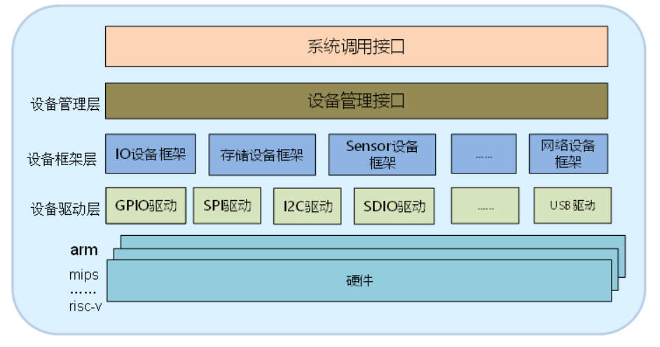
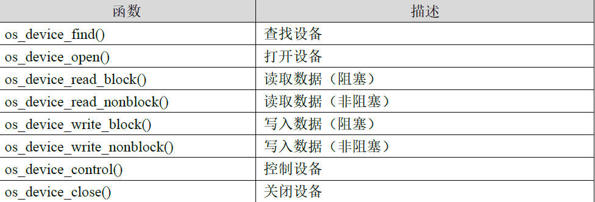

## OneOS设备驱动层分析

1. OneOS设备驱动模型

   在操作系统模式下进行设备开发， 最核心的思想就是实现应用程序的硬件无 关性 。设备驱动模型的产生也正是为了实现这一思想，在设备模型的管理下，设备操作信息将逐层传递。 OneOS将硬件分成了五个层次进行管理，分别为系统调用层次、设备管理层、设备框架层、设备驱动层、硬件层。OneOS的设备驱动模型如图所示。

   

   **设备驱动框架设计原则**

   OneOS Lite 在各类外设的基础上抽象出了设备驱动模型，有效提高了代码可复用性、可移植性，模块分层解耦，降低了各层的开发难度。：

   1. **下层向上层提供统一的访问接口**

   2. **分层设计，屏蔽硬件差异**

   3. **每一层只跟其相邻的层建立联系**

   上面的三点思想贯穿了OneOS设备驱动的设计过程，将我们的应用程序和驱动分离开来设备控制的信息通过 OneOS不同层次最终传达到我们的设备。如果我们要调用一个设备，那么我们应该调用 OneOS提供的系统 API函数即可，接下来系统 API将会向下进行调用，调用的顺序为**系统 API-->设备管理接口 -->设备框架层 -->设备驱动层 -->硬件层**。

   ##### 设备驱动框架作用

   1. **系统调用接口提供统一的对外接口，实现对设备的访问**。

   2. **设备管理层实现了对设备驱动程序的封装，向上对接系统调用接口**。

   3. **设备驱动框架层是对同类硬件设备驱动的抽象，将不同厂家的同类硬件设备驱动中相同的部分抽取出来，将不同部分留出接口，由驱动程序实现**。
   4. **设备驱动层是一组驱使硬件设备工作的程序，实现访问硬件设备的功能，它负责创建和注册设备**。

   ① 系统调用层，该层为 OneOS提供给用户调用设备的系统 API函数。

   ② 设备管理层，该层实现了对设备驱动程序的封装，向上对接系统调用接口。

   ③设备框架层，该层是对同类硬件设备驱动的抽象，将不同厂家的同类硬件设备驱动中相同的部分抽取出来，将不同部分留出接口，由驱动程序实现。

   ④设备驱动层，该层是一组驱使硬件设备工作的程序，实现访问硬件设备的功能，它负责创建和注册设备。

   ⑤硬件层，直接与设备通讯，向上往设备驱动层传递设备的操作函数，向下对设备进行直接的操作。

2. 系统统一调用接口

   

   注意：对于阻塞，如果设备没有准备好数据，读线程会睡眠阻塞，直到数据可读才被唤醒、返回。而非阻塞，如果设备没有准备好数据，函数立即返回，返回值为 0。

3. 