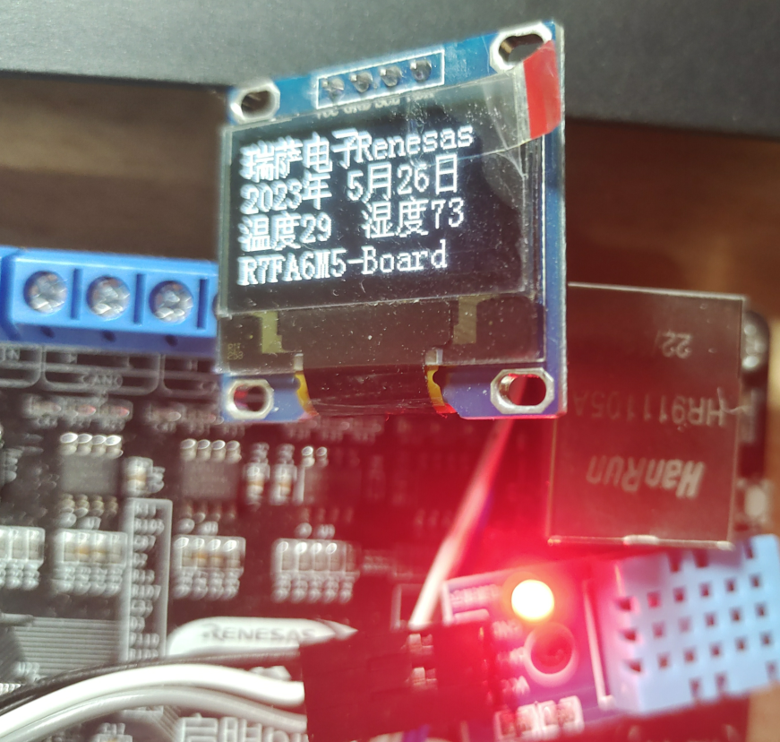
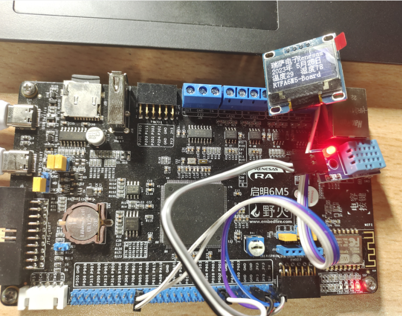

# 野火RA6M5开发板评测 DHT11温湿度传感器 OLED显示测试学习

## DHT11温湿度传感器

DHT11是一款有已校准数字信号输出的温湿度传感器。 精度湿度+-5%RH， 温度+-2℃，量程湿度20-90%RH， 温度0~50℃。

更多DHT11信息请参考：https://baike.sogou.com/v73984313.htm?fromTitle=DHT11

下图为DHT11的引脚说明图，DATA引脚为信号输入输出。


在编写DHT11驱动时，要考虑更改硬件环境的情况。我们把DHT11信号引脚相关的宏定义到 “bsp_dht11.h”文件中, 这样的话在更改或移植的时候只用改宏定义就可以。

#### bsp_dht11.h

```c
#ifndef __BSP_DHT11_H
#define __BSP_DHT11_H
#include "hal_data.h"


#define Bit_RESET   0
#define Bit_SET     1

#define DHT11_LOW   0
#define DHT11_HIGH  1

#define DHT11_PORT  BSP_IO_PORT_00_PIN_01
#define DHT_HIGH    R_BSP_PinWrite(DHT11_PORT, BSP_IO_LEVEL_HIGH);
#define DHT_LOW     R_BSP_PinWrite(DHT11_PORT, BSP_IO_LEVEL_LOW);
#define Read_Data   R_BSP_PinRead(DHT11_PORT)

#define DHT11_DATA_OUT(a)   if (a)  \ DHT_HIGH\ else \  DHT_LOW

typedef struct
{
    uint8_t  humi_int;      //湿度的整数部分
    uint8_t  humi_deci;     //湿度的小数部分
    uint8_t  temp_int;      //温度的整数部分
    uint8_t  temp_deci;     //温度的小数部分
    uint8_t  check_sum;     //校验和
}DHT11_Data_TypeDef;

void DHT11_Init         (void);
void DHT11_Start        (void);
void DHT11_DELAY_US     (uint32_t delay);
void DHT11_DELAY_MS     (uint32_t delay);
uint8_t Read_DHT11(DHT11_Data_TypeDef *DHT11_Data);

#endif

```

#### bsp_dht11.c

```c
#include "bsp_dht11.h"             // Device header


/* DHT11初始化函数 */
void DHT11_Init(void)
{
    /* 初始化配置引脚（这里重复初始化了，可以注释掉） */
    R_IOPORT_Open (&g_ioport_ctrl, g_ioport.p_cfg);
}

void DHT11_DELAY_US(uint32_t delay)
{
    R_BSP_SoftwareDelay(delay, BSP_DELAY_UNITS_MICROSECONDS);
}

void DHT11_DELAY_MS(uint32_t delay)
{
    R_BSP_SoftwareDelay(delay, BSP_DELAY_UNITS_MILLISECONDS);
}

//主机发送开始信号
void DHT11_Start(void)
{

    DHT_HIGH; //先拉高
    DHT11_DELAY_US(30);

    DHT_LOW; //拉低电平至少18us
    DHT11_DELAY_MS(20);

    DHT_HIGH; //拉高电平20~40us
    DHT11_DELAY_US(30);


}

/*
 * 从DHT11读取一个字节，MSB先行
 */
static uint8_t Read_Byte(void)
{
    uint8_t i, temp=0;

    for(i=0;i<8;i++)
    {
        /*每bit以50us低电平标置开始，轮询直到从机发出 的50us 低电平 结束*/
        while(Read_Data == Bit_RESET);

        /*DHT11 以26~28us的高电平表示“0”，以70us高电平表示“1”，
         *通过检测 x us后的电平即可区别这两个状 ，x 即下面的延时
         */
        DHT11_DELAY_US(40); //延时x us 这个延时需要大于数据0持续的时间即可

        if(Read_Data == Bit_SET)/* x us后仍为高电平表示数据“1” */
        {
            /* 等待数据1的高电平结束 */
            while( Read_Data ==Bit_SET);

            temp|=(uint8_t)(0x01<<(7-i));  //把第7-i位置1，MSB先行
        }
        else     // x us后为低电平表示数据“0”
        {
            temp&=(uint8_t)~(0x01<<(7-i)); //把第7-i位置0，MSB先行
        }
    }
    return temp;
}


/*
 * 一次完整的数据传输为40bit，高位先出
 * 8bit 湿度整数 + 8bit 湿度小数 + 8bit 温度整数 + 8bit 温度小数 + 8bit 校验和
 */
uint8_t Read_DHT11(DHT11_Data_TypeDef *DHT11_Data)
{
    uint16_t count;
    DHT11_Start();
    DHT_HIGH; //拉高电平

    /*判断从机是否有低电平响应信号 如不响应则跳出，响应则向下运行*/
    if( Read_Data == Bit_RESET)
    {
    count=0;
        /*轮询直到从机发出 的80us 低电平 响应信号结束*/
        while( Read_Data ==Bit_RESET)
        {
            count++;
            if(count>1000)
                    return 0;
            DHT11_DELAY_US(10);
        }

    count=0;
        /*轮询直到从机发出的 80us 高电平 标置信号结束*/
        while( Read_Data==Bit_SET)
        {
                count++;
                if(count>1000)
                    return 0;
                DHT11_DELAY_US(10);
        }
        /*开始接收数据*/
        DHT11_Data->humi_int= Read_Byte();

        DHT11_Data->humi_deci= Read_Byte();

        DHT11_Data->temp_int= Read_Byte();

        DHT11_Data->temp_deci= Read_Byte();

        DHT11_Data->check_sum= Read_Byte();

        DHT_LOW;
        DHT11_DELAY_US(55);
        DHT_HIGH;

        /*检查读取的数据是否正确*/
        if(DHT11_Data->check_sum == DHT11_Data->humi_int + DHT11_Data->humi_deci + DHT11_Data->temp_int+ DHT11_Data->temp_deci)
            return 1;
        else
            return 0;
    }
    else
    {
        return 0;
    }
}

```

#### hal_entry.c

```c
//--------------------------------------------------------------------------------------------------
// 函数头文件    |   0   |   1   |   2   |   3   |   4   |   5   |   6   |   7   |   8   |   9
//--------------------------------------------------------------------------------------------------
#include "hal_data.h"
#include "oled.h"
#include "bmp.h"
#include "bsp_debug_uart.h"
#include "bsp_led.h"
#include "bsp_dht11.h"
#include "bsp_gpt_timing.h"

#define SUCCESS 1

void Hardware_init(void);
FSP_CPP_HEADER
void R_BSP_WarmStart(bsp_warm_start_event_t event);
FSP_CPP_FOOTER

/* Callback function */
i2c_master_event_t i2c_event = I2C_MASTER_EVENT_ABORTED;
void sci_i2c_master_callback(i2c_master_callback_args_t *p_args)
{
    i2c_event = I2C_MASTER_EVENT_ABORTED;
    if (NULL != p_args)
    {
        /* capture callback event for validating the i2c transfer event*/
        i2c_event = p_args->event;
    }

}

fsp_err_t err = FSP_SUCCESS;
uint32_t  timeout_ms = 1000;
DHT11_Data_TypeDef DHT11_Data;
uint8_t Temperature,Humidity;
extern uint8_t temp_humi_flag;

//==================================================================================================
//  函数说明: 硬件初始化
//  函数备注: Hardware_init
//--------------------------------------------------------------------------------------------------
//  |   -   |   -   |   0   |   1   |   2   |   3   |   4   |   5   |   6   |   7   |   8   |   9
//==================================================================================================
void Hardware_init(void)
{
        Debug_UART4_Init(); // SCI4 UART 调试串口初始化
        GPT0_Timing_Init();
        printf("Debug-UART4-Init OK \r\n");
        LED_Init();
        printf("LED_Init    OK \r\n");
        printf("IIC-Config  Start \r\n");
        DHT11_Init();
        printf("DHT11_Init OK \r\n");
        /* Initialize the I2C module */
        err = R_SCI_I2C_Open(&g_i2c5_ctrl, &g_i2c5_cfg);
        /* Handle any errors. This function should be defined by the user. */
        assert(FSP_SUCCESS == err);
        printf("IIC-Config OK \r\n");
        OLED_Init();            //初始化OLED
        OLED_Clear();
        printf("oled-Init OK \r\n");

}
//==================================================================================================
//  函数说明: 主函数入口
//  函数备注: hal_entry
//--------------------------------------------------------------------------------------------------
//  |   -   |   -   |   0   |   1   |   2   |   3   |   4   |   5   |   6   |   7   |   8   |   9
//==================================================================================================

/*******************************************************************************************************************//**
 * main() is generated by the RA Configuration editor and is used to generate threads if an RTOS is used.  This function
 * is called by main() when no RTOS is used.
 **********************************************************************************************************************/
void hal_entry(void)
{
    /* TODO: add your own code here */

          Hardware_init();
          printf("RA6M5-Board-Init OK \r\n");

          R_BSP_PinAccessEnable();
          R_BSP_PinWrite(BSP_IO_PORT_00_PIN_01, BSP_IO_LEVEL_HIGH); //DHT11端口配置
          while(1)
          {

              /*调用DHT11_Read_TempAndHumidity读取温湿度，若成功则输出该信息*/
              if( Read_DHT11 ( & DHT11_Data ) == SUCCESS )
              {
                  Temperature =  DHT11_Data.temp_int;
                  Humidity    =  DHT11_Data.humi_int;

              }
             OLED_ShowCHinese(0,0,0);//瑞
             OLED_ShowCHinese(16,0,1);//萨
             OLED_ShowCHinese(32,0,5);//电
             OLED_ShowCHinese(48,0,6);//子
             OLED_ShowString(60,0,"Renesas",16);
             OLED_ShowNum(0,2,2023,4,16);//显示ASCII字符的码值
             OLED_ShowCHinese(32,2,2);//中文字->年
             OLED_ShowNum(48,2,5,2,16);//显示ASCII字符的码值
             OLED_ShowCHinese(64,2,3);//中文字->月
             OLED_ShowNum(80,2,26,2,16);//显示ASCII字符的码值
             OLED_ShowCHinese(96,2,4);//中文字->日

             OLED_ShowCHinese(0,4,7);   //中文字->温
             OLED_ShowCHinese(16,4,9);  //中文字->度
             OLED_ShowNum(32,4,Temperature,2,16);
             OLED_ShowCHinese(64,4,8);  //中文字->湿
             OLED_ShowCHinese(80,4,9);  //中文字->度
             OLED_ShowNum(96,4,Humidity,2,16);
             OLED_ShowString(0,6,"RA6M5-Embedfire",16);

          }


#if BSP_TZ_SECURE_BUILD
    /* Enter non-secure code */
    R_BSP_NonSecureEnter();
#endif
}

/*******************************************************************************************************************//**
 * This function is called at various points during the startup process.  This implementation uses the event that is
 * called right before main() to set up the pins.
 *
 * @param[in]  event    Where at in the start up process the code is currently at
 **********************************************************************************************************************/
void R_BSP_WarmStart(bsp_warm_start_event_t event)
{
    if (BSP_WARM_START_RESET == event)
    {
#if BSP_FEATURE_FLASH_LP_VERSION != 0

        /* Enable reading from data flash. */
        R_FACI_LP->DFLCTL = 1U;

        /* Would normally have to wait tDSTOP(6us) for data flash recovery. Placing the enable here, before clock and
         * C runtime initialization, should negate the need for a delay since the initialization will typically take more than 6us. */
#endif
    }

    if (BSP_WARM_START_POST_C == event)
    {
        /* C runtime environment and system clocks are setup. */

        /* Configure pins. */
        R_IOPORT_Open (&g_ioport_ctrl, g_ioport.p_cfg);
    }
}

#if BSP_TZ_SECURE_BUILD

BSP_CMSE_NONSECURE_ENTRY void template_nonsecure_callable ();

/* Trustzone Secure Projects require at least one nonsecure callable function in order to build (Remove this if it is not required to build). */
BSP_CMSE_NONSECURE_ENTRY void template_nonsecure_callable ()
{

}
#endif

```

#### 测试效果





