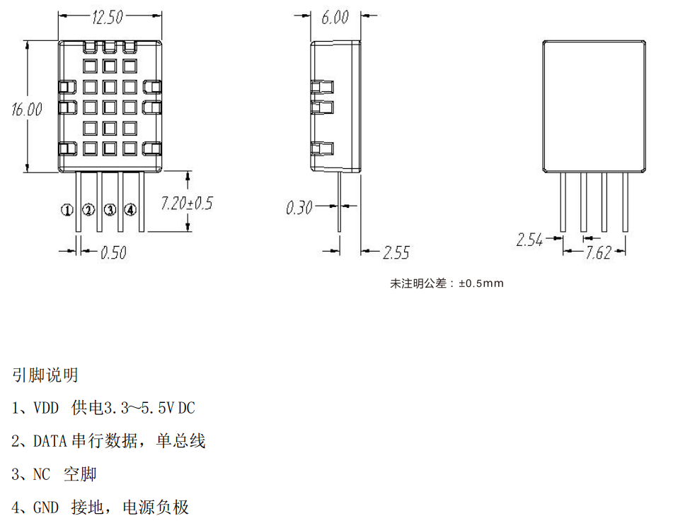

## 野火RA6M5开发板评测 基于瑞萨RA6M5的环境监测系统设计

### 1. 设计简介

本项目初步设计思路是打算以瑞萨单片机作为控制和数据处理的单元，使用温湿度，光照传感器去监测周围的环境参数，在屏幕上完成传感器数据和相关信息的显示。同时，使用WIFI无线模组与单片机之间进行数据交互，接入物联网云平台。尝试利用上位机实现对于温度、湿度、光照强度等相关环境参数监测。但是由于时间原因以及个人能力有限制，只完成了部分设计。

本项目是基于启明6M5开发板完成了环境监测系统设计，传感器DHT11获取温度湿度的数据；传感器GY39获取光照强度数据；0.96寸OLED屏幕提供显示功能，能够显示传感器数据以及相关信息。编写上位机软件，实现温湿度传感器数据的上报。

### 2. 设计框架


### 3. 项目说明

RA 产品家族单片机 (MCU) 于 2019 年 10 月推出，丰富了瑞萨的 32 位 MCU 系列产品。 除了 RA 系列之外的 32 位 MCU 产品还有 RX 系列（CPU使用瑞萨自家RX内核）和 Renesas Synergy™ 平台 MCU。

Renesas Advanced (RA) 32 位 MCU 是采用 Arm® Cortex®-M33、-M23 和 -M4 处理器内核， 并经过 PSA Certified ® 1 级认证的、行业领先的 32 位 MCU。

瑞萨 RA 系列产品家族包括：

- RA2 系列，适用于低功耗应用；

- RA4 系列，适用于需要低功耗、高性能和高安全性的设备；

- RA6 系列，具有卓越的连接性能和安全性能；

- RA8 系列，可以为采用人机界面、连接、安全和模拟功能的应用提供出色性能。

  - **RA2 系列 – 低功耗**：基于 Arm Cortex-M23 内核，最高频率 48 MHz， 拥有高达 512 KB 的闪存和 64 KB 的 SRAM。电源电压范围为 1.6 V 到 5.5 V。 外设包括全速 USB、CAN、24 位 ∑-△ 模数转换器 (ADC)、16 位数模转换器 (DAC)、电容式触摸感应以及安全功能。
  - **RA4 系列 – 高性能和出色的功耗**：基于支持 TrustZone 的 Arm Cortex-M33F 内核或 Arm Cortex-M4F 内核构建，最高频率 100 MHz。高达 1 MB 的闪存和 128 KB 的 SRAM。电压范围为 1.6 V 到 5.5 V。 外设包括电容式触摸感应、段码式 LCD 控制器、全速 USB、CAN、安全功能以及数据转换器和定时 器。RA4W1 系列器件还额外配备了 Bluetooth ® 低功耗 (BLE) 5.0。
  - **RA6 系列 – 高性能**：基于支持 TrustZone 的 Arm Cortex-M33F 内核或 Arm Cortex-M4F 内核。最高频 率 200 MHz。高达 2 MB 的闪存和 640 KB 的 SRAM。电压范围为 2.7 V 到 3.6 V。外设包括数据转换 器、定时器、外部存储总线、以太网、全速和高速 USB、CAN、安全功能、电容式触摸感应和用于 TFT 显示的图形 LCD 控制器，以及一个 2D 图形引擎。RA6T1 系列器件带有用于电机控制的增强型外 设，如高分辨率 PWM 定时器或高级模拟模块。
  - **RA8 系列 – 更高性能、人机界面、物联网和边缘计算**

  


3.1 传感器模块

1. 温湿度传感器

   DHT11是一款有已校准数字信号输出的温湿度传感器。 精度湿度+-5%RH， 温度+-2℃，量程湿度20-90%RH， 温度0~50℃。

   更多DHT11信息请参考：https://baike.sogou.com/v73984313.htm?fromTitle=DHT11

   下图为DHT11的引脚说明图，DATA引脚为信号输入输出。

   

2. 光照强度传感器

   1. GY-39 是一款低成本，气压，温湿度，光强度传感器模块。工作电压 3-5v，功耗小，安装方便。

   2. 其工作原理是，MCU 收集各种传感器数据，统一处理，直接输出计算后的结果。此模块，有两种方式读取数据，即串口 UART（TTL 电平）或者 IIC（2 线）。串口的波特率有 9600bps 与 115200bps，可配置，有连续，询问输出两种方式，可掉电保存设置。可适应不同的工作环境，与单片机及电脑连接。

   3. 模块另外可以设置单独传感器芯片工作模式，作为简单传感器模块，MCU 不参与数据处理工作。

   4. 参考资料网站 https://www.gysensor.cn/air-gy39/
   5. 部分参数及资料
      

      GY39-MCU-IIC

      

      接线示意图

      

      

3.2 显示模块


OLED，即有机发光二极管（Organic Light-Emitting Diode），又称为有机电激光显示（Organic Electroluminesence Display， OELD）。OLED 由于同时具备自发光，不需背光源、对比度高、厚度薄、视角广、反应速度快、可用于挠曲性面板、使用温度范围广、构造及制程较简单等优异之特性，被认为是下一代的平面显示器新兴应用技术。
​    LCD都需要背光，而 OLED 不需要，因为它是自发光的。这样同样的显示，OLED 效果要来得好一些。以目前的技术，**OLED 的尺寸还难以大型化**，但是分辨率确可以做到很高。市场上常见OLED模块有以下特点：

​    (1)模块有**单色和双色两种**可选，单色为纯蓝色，而双色则为黄蓝双色。
​    (2)尺寸小，显示尺寸为 0.96 寸，而模块的尺寸仅为 27mm*26mm 大小。
​    (3)高分辨率，该模块的分辨率为 128\*64。 
​    (4)多种接口方式，该模块提供了总共 5 种接口包括：6800、8080 两种并行接口方式、3线或 4 线的穿行 SPI 接口方式，、IIC 接口方式（只需要 2 根线就可以控制 OLED 了！）。
​    (5)不需要高压，直接接 3.3V就可以工作了。
​    特别注意，市面上有部分的OLED屏幕不可以直接接5.0v电压，否则可能烧坏！
​    总结：目前市面上常用的0.96寸OLED屏幕通讯方式主要有SPI和I2C两种！SPI为4线制较多，而I2C为2线制。2种通讯协议较为浅显的区：总所周知，SPI的通讯速度明显快于I2C的通讯速度，所以通常使用SPI通讯协议的OLED屏幕可以实现更高的帧数显示，画面更为流畅丝滑。
本次实验所采用的0.96寸OLED屏幕为I2C通讯方式，故在此稍微给读者介绍一下I2C通讯原理。
​    IIC(Inter－Integrated Circuit)总线是一种由 PHILIPS 公司开发的两线式串行总线，用于连接微控制器及其外围设备。它是由数据线 SDA 和时钟 SCL 构成的串行总线，可发送和接收数据。在 CPU 与被控 IC 之间、IC 与 IC 之间进行双向传送，高速 IIC 总线一般可达 400kbps 以上。
​    I2C 总线在传送数据过程中共有三种类型信号， 它们分别是：开始信号、结束信号和应答信号。
​    开始信号：SCL 为高电平时，SDA 由高电平向低电平跳变，开始传送数据。
​    结束信号：SCL 为高电平时，SDA 由低电平向高电平跳变，结束传送数据。
​    应答信号：接收数据的 IC 在接收到 8bit 数据后，向发送数据的 IC 发出特定的低电平脉冲，
​    表示已收到数据。CPU 向受控单元发出一个信号后，等待受控单元发出一个应答信号，CPU 接收到应答信号后，根据实际情况作出是否继续传递信号的判断。若未收到应答信号，由判断为受控单元出现故障。
​    这些信号中，起始信号是必需的，结束信号和应答信号，都可以不要。
3.3 串口上位机


### 4 项目配置

1. OLED显示模块

​	选择了使用EBF模块接口上的I2C接口，因为改接口的布线顺序和OLED的I2C接口一致。可以直接将OLED插上去，减少了接线。该接口使用的是SCI6的I2C功能。

Pin下配置如下：选择SCI6，复用I2C模式。


配置stack，选择sci_i2c：


```c
//==================================================================================================
//  实现功能: 0.96寸OLED 接口演示例程
//  说明:
//              GND   电源地
//              VCC   接5V或3.3v电源
//              SCL   接P505（SCL6）
//              SDA   接P506（SDA6）
//==================================================================================================------------------------------------------------------------------------
//  |   -   |   -   |   0   |   1   |   2   |   3   |   4   |   5   |   6   |   7   |   8   |   9
//==================================================================================================
//==================================================================================================
#include "oled.h"
#include "stdlib.h"
#include "oledfont.h"
#include "math.h"
#include "hal_data.h"


extern fsp_err_t err;
extern int  timeout_ms;
extern  i2c_master_event_t i2c_event ;
//OLED的显存
//存放格式如下.
//[0]0 1 2 3 ... 127
//[1]0 1 2 3 ... 127
//[2]0 1 2 3 ... 127
//[3]0 1 2 3 ... 127
//[4]0 1 2 3 ... 127
//[5]0 1 2 3 ... 127
//[6]0 1 2 3 ... 127
//[7]0 1 2 3 ... 127

//==================================================================================================
//  函数功能: IIC外设驱动函数部分
//  函数标记: Write_IIC_Command
//  函数说明: 无
//-------------------------------------------------------------------------------------------------
//  |   -   |   -   |   0   |   1   |   2   |   3   |   4   |   5   |   6   |   7   |   8   |   9
//==================================================================================================
void Write_IIC_Command(unsigned char IIC_Command)
{

    uint8_t ii[2]={0x00,0x00};
    ii[1] = IIC_Command;

    err = R_SCI_I2C_Write(&g_sci6_i2c_ctrl, ii, 0x02, true);
    assert(FSP_SUCCESS == err);
    /* Since there is nothing else to do, block until Callback triggers*/
    //while ((I2C_MASTER_EVENT_TX_COMPLETE != i2c_event) && timeout_ms)
    while ((I2C_MASTER_EVENT_TX_COMPLETE != i2c_event) && timeout_ms>0)
    {
        R_BSP_SoftwareDelay(100U, BSP_DELAY_UNITS_MICROSECONDS);
        timeout_ms--;
    }
    if (I2C_MASTER_EVENT_ABORTED == i2c_event)
    {
        __BKPT(0);
    }
    /* Read data back from the I2C slave */
    i2c_event = I2C_MASTER_EVENT_ABORTED;
    timeout_ms           = 100000;
}

//==================================================================================================
//  函数功能: IIC外设驱动函数部分
//  函数标记: Write_IIC_Data
//  函数说明: 无
//-------------------------------------------------------------------------------------------------
//  |   -   |   -   |   0   |   1   |   2   |   3   |   4   |   5   |   6   |   7   |   8   |   9
//==================================================================================================
void Write_IIC_Data(unsigned char IIC_Data)
{
    uint8_t ii[2]={0x40,0x00};
    ii[0] = 0x40;
    ii[1] = IIC_Data;
    err = R_SCI_I2C_Write(&g_sci6_i2c_ctrl, ii, 0x02, true);
           assert(FSP_SUCCESS == err);
           /* Since there is nothing else to do, block until Callback triggers*/
           //while ((I2C_MASTER_EVENT_TX_COMPLETE != i2c_event) && timeout_ms)
    while ((I2C_MASTER_EVENT_TX_COMPLETE != i2c_event) && timeout_ms>0)
    {
        R_BSP_SoftwareDelay(100U, BSP_DELAY_UNITS_MICROSECONDS);
        timeout_ms--;
    }
    if (I2C_MASTER_EVENT_ABORTED == i2c_event)
    {
        __BKPT(0);
    }
    /* Read data back from the I2C slave */
    i2c_event = I2C_MASTER_EVENT_ABORTED;
    timeout_ms           = 100000;

}
//==================================================================================================
//  函数功能: IIC外设驱动函数部分
//  函数标记: Write_IIC_Data
//  函数说明: 无
//-------------------------------------------------------------------------------------------------
//  |   -   |   -   |   0   |   1   |   2   |   3   |   4   |   5   |   6   |   7   |   8   |   9
//==================================================================================================
void OLED_WR_Byte(unsigned dat,unsigned cmd)
{
    if(cmd)
    {
        Write_IIC_Data(dat);
    }
    else
    {
        Write_IIC_Command(dat);
    }


}
/********************************************
// fill_Picture
********************************************/
void fill_picture(unsigned char fill_Data)
{
    unsigned char m,n;
    for(m=0;m<8;m++)
    {
        OLED_WR_Byte(0xb0+m,0);     //page0-page1
        OLED_WR_Byte(0x00,0);       //low column start address
        OLED_WR_Byte(0x10,0);       //high column start address
        for(n=0;n<128;n++)
            {
                OLED_WR_Byte(fill_Data,1);
            }
    }
}


/***********************Delay****************************************/
void Delay_50ms(unsigned int Del_50ms)
{
    unsigned int m;
    for(;Del_50ms>0;Del_50ms--)
        for(m=6245;m>0;m--);
}

void Delay_1ms(unsigned int Del_1ms)
{
    unsigned char j;
    while(Del_1ms--)
    {
        for(j=0;j<123;j++);
    }
}

//坐标设置

void OLED_Set_Pos(unsigned char x, unsigned char y)
{   OLED_WR_Byte(0xb0+y,OLED_CMD);
    OLED_WR_Byte(((x&0xf0)>>4)|0x10,OLED_CMD);
    OLED_WR_Byte((x&0x0f),OLED_CMD);
}
//开启OLED显示
void OLED_Display_On(void)
{
    OLED_WR_Byte(0X8D,OLED_CMD);  //SET DCDC命令
    OLED_WR_Byte(0X14,OLED_CMD);  //DCDC ON
    OLED_WR_Byte(0XAF,OLED_CMD);  //DISPLAY ON
}
//关闭OLED显示
void OLED_Display_Off(void)
{
    OLED_WR_Byte(0X8D,OLED_CMD);  //SET DCDC命令
    OLED_WR_Byte(0X10,OLED_CMD);  //DCDC OFF
    OLED_WR_Byte(0XAE,OLED_CMD);  //DISPLAY OFF
}
//清屏函数,清完屏,整个屏幕是黑色的!和没点亮一样!!!
void OLED_Clear(void)
{
    u8 i,n;
    for(i=0;i<8;i++)
    {
        OLED_WR_Byte(0xb0+i,OLED_CMD);    //设置页地址（0~7）
        OLED_WR_Byte(0x00,OLED_CMD);      //设置显示位置—列低地址
        OLED_WR_Byte(0x10,OLED_CMD);      //设置显示位置—列高地址
        for(n=0;n<128;n++)OLED_WR_Byte(0,OLED_DATA);
    } //更新显示
}
void OLED_On(void)
{
    u8 i,n;
    for(i=0;i<8;i++)
    {
        OLED_WR_Byte (0xb0+i,OLED_CMD);    //设置页地址（0~7）
        OLED_WR_Byte (0x00,OLED_CMD);      //设置显示位置—列低地址
        OLED_WR_Byte (0x10,OLED_CMD);      //设置显示位置—列高地址
        for(n=0;n<128;n++)OLED_WR_Byte(1,OLED_DATA);
    } //更新显示
}
//在指定位置显示一个字符,包括部分字符
//x:0~127
//y:0~63
//mode:0,反白显示;1,正常显示
//size:选择字体 16/12
void OLED_ShowChar(u8 x,u8 y,u8 chr,u8 Char_Size)
{
    unsigned char c=0,i=0;
        c=chr-' ';//得到偏移后的值
        if(x>Max_Column-1){x=0;y=y+2;}
        if(Char_Size ==16)
            {
                OLED_Set_Pos(x,y);
                for(i=0;i<8;i++)
                    OLED_WR_Byte(F8X16[c*16+i],OLED_DATA);
                    OLED_Set_Pos(x,y+1);
                    for(i=0;i<8;i++)
                        OLED_WR_Byte(F8X16[c*16+i+8],OLED_DATA);
            }
            else {
                OLED_Set_Pos(x,y);
                for(i=0;i<6;i++)
                OLED_WR_Byte(F6x8[c][i],OLED_DATA);

            }
}
//m^n函数
u32 oled_pow(u8 m,u8 n)
{
    u32 result=1;
    while(n--)result*=m;
    return result;
}
//显示2个数字
//x,y :起点坐标
//len :数字的位数
//size:字体大小
//mode:模式   0,填充模式;1,叠加模式
//num:数值(0~4294967295);
void OLED_ShowNum(u8 x,u8 y,u32 num,u8 len,u8 size2)
{
    u8 t,temp;
    u8 enshow=0;
    for(t=0;t<len;t++)
    {
        temp=(num/oled_pow(10,len-t-1))%10;
        if(enshow==0&&t<(len-1))
        {
            if(temp==0)
            {
                OLED_ShowChar(x+(size2/2)*t,y,' ',size2);
                continue;
            }else enshow=1;

        }
        OLED_ShowChar(x+(size2/2)*t,y,temp+'0',size2);
    }
}
//显示一个字符号串
void OLED_ShowString(u8 x,u8 y,u8 *chr,u8 Char_Size)
{
    unsigned char j=0;
    while (chr[j]!='\0')
    {       OLED_ShowChar(x,y,chr[j],Char_Size);
            x+=8;
        if(x>120){x=0;y+=2;}
            j++;
    }
}
//显示汉字
void OLED_ShowCHinese(u8 x,u8 y,u8 no)
{
    u8 t,adder=0;
    OLED_Set_Pos(x,y);
    for(t=0;t<16;t++)
        {
                OLED_WR_Byte(Hzk[2*no][t],OLED_DATA);
                adder+=1;
     }
        OLED_Set_Pos(x,y+1);
    for(t=0;t<16;t++)
            {
                OLED_WR_Byte(Hzk[2*no+1][t],OLED_DATA);
                adder+=1;
      }
}
/***********功能描述：显示显示BMP图片128×64起始点坐标(x,y),x的范围0～127，y为页的范围0～7*****************/
void OLED_DrawBMP(unsigned char x0, unsigned char y0,unsigned char x1, unsigned char y1,unsigned char BMP[])
{
 unsigned int j=0;
 unsigned char x,y;

  if(y1%8==0) y=y1/8;
  else y=y1/8+1;
    for(y=y0;y<y1;y++)
    {
        OLED_Set_Pos(x0,y);
    for(x=x0;x<x1;x++)
        {
            OLED_WR_Byte(BMP[j++],OLED_DATA);
        }
    }
}

//初始化SSD1306
void OLED_Init(void)
{


    /* Wait for minimum time required between transfers. */
    R_BSP_SoftwareDelay(800, BSP_DELAY_UNITS_MICROSECONDS);

    OLED_WR_Byte(0xAE,OLED_CMD);//--display off
    OLED_WR_Byte(0x00,OLED_CMD);//---set low column address
    OLED_WR_Byte(0x10,OLED_CMD);//---set high column address
    OLED_WR_Byte(0x40,OLED_CMD);//--set start line address
    OLED_WR_Byte(0xB0,OLED_CMD);//--set page address
    OLED_WR_Byte(0x81,OLED_CMD); // contract control
    OLED_WR_Byte(0xFF,OLED_CMD);//--128
    OLED_WR_Byte(0xA1,OLED_CMD);//set segment remap
    OLED_WR_Byte(0xA6,OLED_CMD);//--normal / reverse
    OLED_WR_Byte(0xA8,OLED_CMD);//--set multiplex ratio(1 to 64)
    OLED_WR_Byte(0x3F,OLED_CMD);//--1/32 duty
    OLED_WR_Byte(0xC8,OLED_CMD);//Com scan direction
    OLED_WR_Byte(0xD3,OLED_CMD);//-set display offset
    OLED_WR_Byte(0x00,OLED_CMD);//

    OLED_WR_Byte(0xD5,OLED_CMD);//set osc division
    OLED_WR_Byte(0x80,OLED_CMD);//

    OLED_WR_Byte(0xD8,OLED_CMD);//set area color mode off
    OLED_WR_Byte(0x05,OLED_CMD);//

    OLED_WR_Byte(0xD9,OLED_CMD);//Set Pre-Charge Period
    OLED_WR_Byte(0xF1,OLED_CMD);//

    OLED_WR_Byte(0xDA,OLED_CMD);//set com pin configuartion
    OLED_WR_Byte(0x12,OLED_CMD);//

    OLED_WR_Byte(0xDB,OLED_CMD);//set Vcomh
    OLED_WR_Byte(0x30,OLED_CMD);//

    OLED_WR_Byte(0x8D,OLED_CMD);//set charge pump enable
    OLED_WR_Byte(0x14,OLED_CMD);//

    OLED_WR_Byte(0xAF,OLED_CMD);//--turn on oled panel
}
```

```c
/*
 * oled.h
 *
 *  Created on: 2023年1月31日
 *      Author: a8456
 */

#ifndef OLED_H_
#define OLED_H_
#include "stdlib.h"
#include "stdint.h"
#define OLED_MODE 0

#define XLevelL     0x00
#define XLevelH     0x10
#define Max_Column  128
#define Max_Row     64
#define Brightness  0xFF
#define X_WIDTH     128
#define Y_WIDTH     64


#define OLED_CMD  0 //写命令
#define OLED_DATA 1 //写数据

typedef __uint8_t u8 ;
typedef __uint32_t u32 ;


//OLED控制用函数
void OLED_WR_Byte(unsigned dat,unsigned cmd);
void OLED_Display_On(void);
void OLED_Display_Off(void);
void OLED_Init(void);
void OLED_Clear(void);
void OLED_DrawPoint(u8 x,u8 y,u8 t);
void OLED_Fill(u8 x1,u8 y1,u8 x2,u8 y2,u8 dot);
void OLED_ShowChar(u8 x,u8 y,u8 chr,u8 Char_Size);
void OLED_ShowNum(u8 x,u8 y,u32 num,u8 len,u8 size);
void OLED_ShowString(u8 x,u8 y, u8 *p,u8 Char_Size);
void OLED_Set_Pos(unsigned char x, unsigned char y);
void OLED_ShowCHinese(u8 x,u8 y,u8 no);
void OLED_DrawBMP(unsigned char x0, unsigned char y0,unsigned char x1, unsigned char y1,unsigned char BMP[]);
void Delay_50ms(unsigned int Del_50ms);
void Delay_1ms(unsigned int Del_1ms);
void fill_picture(unsigned char fill_Data);
void Picture();
void IIC_Start();
void IIC_Stop();
void Write_IIC_Command(unsigned char IIC_Command);
void Write_IIC_Data(unsigned char IIC_Data);
void Write_IIC_Byte(unsigned char IIC_Byte);

void IIC_Wait_Ack();
#endif /* OLED_H_ */
```

2. 传感器模块

   温湿度传感器DHT11,任意配置一个GPIO端口就可以了，不需要其他的配置，只要注意时序问题即可，重点在GY39传感器的配置。

Pin下配置如下：选择SCI2，复用I2C模式。


配置stack，选择sci_i2c：


```c
#ifndef __BSP_DHT11_H
#define __BSP_DHT11_H
#include "hal_data.h"


#define Bit_RESET   0
#define Bit_SET     1

#define DHT11_LOW   0
#define DHT11_HIGH  1

#define DHT11_PORT  BSP_IO_PORT_00_PIN_01
#define DHT_HIGH    R_BSP_PinWrite(DHT11_PORT, BSP_IO_LEVEL_HIGH);
#define DHT_LOW     R_BSP_PinWrite(DHT11_PORT, BSP_IO_LEVEL_LOW);
#define Read_Data   R_BSP_PinRead(DHT11_PORT)

#define DHT11_DATA_OUT(a)   if (a)  \ DHT_HIGH\ else \  DHT_LOW

typedef struct
{
    uint8_t  humi_int;      //湿度的整数部分
    uint8_t  humi_deci;     //湿度的小数部分
    uint8_t  temp_int;      //温度的整数部分
    uint8_t  temp_deci;     //温度的小数部分
    uint8_t  check_sum;     //校验和
}DHT11_Data_TypeDef;

void DHT11_Init         (void);
void DHT11_Start        (void);
void DHT11_DELAY_US     (uint32_t delay);
void DHT11_DELAY_MS     (uint32_t delay);
uint8_t Read_DHT11(DHT11_Data_TypeDef *DHT11_Data);

#endif


```

```c
#include "bsp_dht11.h"             // Device header


/* DHT11初始化函数 */
void DHT11_Init(void)
{
    /* 初始化配置引脚（这里重复初始化了，可以注释掉） */
    R_IOPORT_Open (&g_ioport_ctrl, g_ioport.p_cfg);
}

void DHT11_DELAY_US(uint32_t delay)
{
    R_BSP_SoftwareDelay(delay, BSP_DELAY_UNITS_MICROSECONDS);
}

void DHT11_DELAY_MS(uint32_t delay)
{
    R_BSP_SoftwareDelay(delay, BSP_DELAY_UNITS_MILLISECONDS);
}

//主机发送开始信号
void DHT11_Start(void)
{

    DHT_HIGH; //先拉高
    DHT11_DELAY_US(30);

    DHT_LOW; //拉低电平至少18us
    DHT11_DELAY_MS(20);

    DHT_HIGH; //拉高电平20~40us
    DHT11_DELAY_US(30);


}

/*
 * 从DHT11读取一个字节，MSB先行
 */
static uint8_t Read_Byte(void)
{
    uint8_t i, temp=0;

    for(i=0;i<8;i++)
    {
        /*每bit以50us低电平标置开始，轮询直到从机发出 的50us 低电平 结束*/
        while(Read_Data == Bit_RESET);

        /*DHT11 以26~28us的高电平表示“0”，以70us高电平表示“1”，
         *通过检测 x us后的电平即可区别这两个状 ，x 即下面的延时
         */
        DHT11_DELAY_US(40); //延时x us 这个延时需要大于数据0持续的时间即可

        if(Read_Data == Bit_SET)/* x us后仍为高电平表示数据“1” */
        {
            /* 等待数据1的高电平结束 */
            while( Read_Data ==Bit_SET);

            temp|=(uint8_t)(0x01<<(7-i));  //把第7-i位置1，MSB先行
        }
        else     // x us后为低电平表示数据“0”
        {
            temp&=(uint8_t)~(0x01<<(7-i)); //把第7-i位置0，MSB先行
        }
    }
    return temp;
}


/*
 * 一次完整的数据传输为40bit，高位先出
 * 8bit 湿度整数 + 8bit 湿度小数 + 8bit 温度整数 + 8bit 温度小数 + 8bit 校验和
 */
uint8_t Read_DHT11(DHT11_Data_TypeDef *DHT11_Data)
{
    uint16_t count;
    DHT11_Start();
    DHT_HIGH; //拉高电平

    /*判断从机是否有低电平响应信号 如不响应则跳出，响应则向下运行*/
    if( Read_Data == Bit_RESET)
    {
    count=0;
        /*轮询直到从机发出 的80us 低电平 响应信号结束*/
        while( Read_Data ==Bit_RESET)
        {
            count++;
            if(count>1000)
                    return 0;
            DHT11_DELAY_US(10);
        }

    count=0;
        /*轮询直到从机发出的 80us 高电平 标置信号结束*/
        while( Read_Data==Bit_SET)
        {
                count++;
                if(count>1000)
                    return 0;
                DHT11_DELAY_US(10);
        }
        /*开始接收数据*/
        DHT11_Data->humi_int= Read_Byte();

        DHT11_Data->humi_deci= Read_Byte();

        DHT11_Data->temp_int= Read_Byte();

        DHT11_Data->temp_deci= Read_Byte();

        DHT11_Data->check_sum= Read_Byte();

        DHT_LOW;
        DHT11_DELAY_US(55);
        DHT_HIGH;

        /*检查读取的数据是否正确*/
        if(DHT11_Data->check_sum == DHT11_Data->humi_int + DHT11_Data->humi_deci + DHT11_Data->temp_int+ DHT11_Data->temp_deci)
            return 1;
        else
            return 0;
    }
    else
    {
        return 0;
    }
}


```

GY39

```C
typedef struct
{
    uint32_t P;
    uint16_t Temp;
    uint16_t Hum;
    uint16_t Alt;
} bme;
bme Bme;
uint32_t Lux;
float LightLux;

void sci2_i2c_master_callback(i2c_master_callback_args_t *p_args)
{
    i2c_event = I2C_MASTER_EVENT_ABORTED;
    if (NULL != p_args)
    {
        /* capture callback event for validating the i2c transfer event*/
        i2c_event = p_args->event;
    }

}

void read_bme(void)
{
    uint16_t data_16[2] ={ 0 };
    uint8_t data[10] = { 0x00 }; //接收读取后的数据
    uint8_t write_buffer = 0x04; //写数据
    err = R_SCI_I2C_Open (&g_sci2_i2c_ctrl, &g_sci2_i2c_cfg);
    err = R_SCI_I2C_Write (&g_sci2_i2c_ctrl, &write_buffer, 1, true);
    err = R_SCI_I2C_Abort (&g_sci2_i2c_ctrl);
    R_BSP_SoftwareDelay (3, BSP_DELAY_UNITS_MILLISECONDS);
    err = R_SCI_I2C_Read (&g_sci2_i2c_ctrl, data, 10, false);
    R_BSP_SoftwareDelay (3, BSP_DELAY_UNITS_MILLISECONDS);
    err = R_SCI_I2C_Abort (&g_sci2_i2c_ctrl);
    err = R_SCI_I2C_Close (&g_sci2_i2c_ctrl);

    Bme.Temp = (data[0] << 8) | data[1];
    data_16[0] = (data[2] << 8) | data[3];
    data_16[1] = (data[4] << 8) | data[5];

    Bme.P = (((uint32_t) data_16[0]) << 16) | data_16[1];
    Bme.Hum = (data[6] << 8) | data[7];
    Bme.Alt = (data[8] << 8) | data[9];
}
void read_lux(void)
{
    uint16_t data_16[2] ={ 0 };
    uint8_t data[4] = { 0 };
    uint8_t write_buffer = 0x00; //写数据
    err = R_SCI_I2C_Open (&g_sci2_i2c_ctrl, &g_sci2_i2c_cfg);
    err = R_SCI_I2C_Write (&g_sci2_i2c_ctrl, &write_buffer, 1, true);
    err = R_SCI_I2C_Abort (&g_sci2_i2c_ctrl);
    R_BSP_SoftwareDelay (3, BSP_DELAY_UNITS_MILLISECONDS);
    err = R_SCI_I2C_Read (&g_sci2_i2c_ctrl, data, 4, false);
    R_BSP_SoftwareDelay (3, BSP_DELAY_UNITS_MILLISECONDS);
    err = R_SCI_I2C_Abort (&g_sci2_i2c_ctrl);
    err = R_SCI_I2C_Close (&g_sci2_i2c_ctrl);
    data_16[0] = (data[0] << 8) | data[1];
    data_16[1] = (data[2] << 8) | data[3];
    Lux = (((uint32_t) data_16[0]) << 16) | data_16[1];

}
```


#### 主函数代码

```c

//--------------------------------------------------------------------------------------------------
// 函数头文件    |   0   |   1   |   2   |   3   |   4   |   5   |   6   |   7   |   8   |   9
//--------------------------------------------------------------------------------------------------
#include "hal_data.h"
#include "oled.h"
#include "bmp.h"
#include "bsp_debug_uart.h"
#include "bsp_led.h"
#include "bsp_dht11.h"
#include "bsp_gpt_timing.h"

#define SUCCESS 1

void Hardware_init(void);
FSP_CPP_HEADER
void R_BSP_WarmStart(bsp_warm_start_event_t event);
FSP_CPP_FOOTER

/* Callback function */
i2c_master_event_t i2c_event = I2C_MASTER_EVENT_ABORTED;
void sci6_i2c_master_callback(i2c_master_callback_args_t *p_args)
{
    i2c_event = I2C_MASTER_EVENT_ABORTED;
    if (NULL != p_args)
    {
        /* capture callback event for validating the i2c transfer event*/
        i2c_event = p_args->event;
    }

}

void sci2_i2c_master_callback(i2c_master_callback_args_t *p_args)
{
    i2c_event = I2C_MASTER_EVENT_ABORTED;
    if (NULL != p_args)
    {
        /* capture callback event for validating the i2c transfer event*/
        i2c_event = p_args->event;
    }

}


fsp_err_t err = FSP_SUCCESS;
uint32_t  timeout_ms = 1000;

DHT11_Data_TypeDef DHT11_Data;
uint8_t Temperature,Humidity;
extern uint8_t temp_humi_flag;
extern uint32_t time1s_flag;
typedef struct
{
    uint32_t P;
    uint16_t Temp;
    uint16_t Hum;
    uint16_t Alt;
} bme;
bme Bme;
uint32_t Lux;
float LightLux;

//==================================================================================================
//  函数说明: 硬件初始化
//  函数备注: Hardware_init
//--------------------------------------------------------------------------------------------------
//  |   -   |   -   |   0   |   1   |   2   |   3   |   4   |   5   |   6   |   7   |   8   |   9
//==================================================================================================
void Hardware_init(void)
{
        Debug_UART4_Init(); // SCI4 UART 调试串口初始化
        GPT0_Timing_Init();
        printf("Debug-UART4-Init OK \r\n");
        LED_Init();
        printf("LED_Init    OK \r\n");
        printf("IIC-Config  Start \r\n");
        DHT11_Init();
        printf("DHT11_Init OK \r\n");
        /* Initialize the I2C module */
        err = R_SCI_I2C_Open(&g_sci6_i2c_ctrl, &g_sci6_i2c_cfg);
        /* Handle any errors. This function should be defined by the user. */
        assert(FSP_SUCCESS == err);
        printf("IIC-Config OK \r\n");
        OLED_Init();            //初始化OLED
        OLED_Clear();
        printf("oled-Init OK \r\n");

}


void read_bme(void)
{
    uint16_t data_16[2] ={ 0 };
    uint8_t data[10] = { 0x00 }; //接收读取后的数据
    uint8_t write_buffer = 0x04; //写数据
    err = R_SCI_I2C_Open (&g_sci2_i2c_ctrl, &g_sci2_i2c_cfg);
    err = R_SCI_I2C_Write (&g_sci2_i2c_ctrl, &write_buffer, 1, true);
    err = R_SCI_I2C_Abort (&g_sci2_i2c_ctrl);
    R_BSP_SoftwareDelay (3, BSP_DELAY_UNITS_MILLISECONDS);
    err = R_SCI_I2C_Read (&g_sci2_i2c_ctrl, data, 10, false);
    R_BSP_SoftwareDelay (3, BSP_DELAY_UNITS_MILLISECONDS);
    err = R_SCI_I2C_Abort (&g_sci2_i2c_ctrl);
    err = R_SCI_I2C_Close (&g_sci2_i2c_ctrl);

    Bme.Temp = (data[0] << 8) | data[1];
    data_16[0] = (data[2] << 8) | data[3];
    data_16[1] = (data[4] << 8) | data[5];

    Bme.P = (((uint32_t) data_16[0]) << 16) | data_16[1];
    Bme.Hum = (data[6] << 8) | data[7];
    Bme.Alt = (data[8] << 8) | data[9];
}
void read_lux(void)
{
    uint16_t data_16[2] ={ 0 };
    uint8_t data[4] = { 0 };
    uint8_t write_buffer = 0x00; //写数据
    err = R_SCI_I2C_Open (&g_sci2_i2c_ctrl, &g_sci2_i2c_cfg);
    err = R_SCI_I2C_Write (&g_sci2_i2c_ctrl, &write_buffer, 1, true);
    err = R_SCI_I2C_Abort (&g_sci2_i2c_ctrl);
    R_BSP_SoftwareDelay (3, BSP_DELAY_UNITS_MILLISECONDS);
    err = R_SCI_I2C_Read (&g_sci2_i2c_ctrl, data, 4, false);
    R_BSP_SoftwareDelay (3, BSP_DELAY_UNITS_MILLISECONDS);
    err = R_SCI_I2C_Abort (&g_sci2_i2c_ctrl);
    err = R_SCI_I2C_Close (&g_sci2_i2c_ctrl);
    data_16[0] = (data[0] << 8) | data[1];
    data_16[1] = (data[2] << 8) | data[3];
    Lux = (((uint32_t) data_16[0]) << 16) | data_16[1];

}

//==================================================================================================
//  函数说明: 主函数入口
//  函数备注: hal_entry
//--------------------------------------------------------------------------------------------------
//  |   -   |   -   |   0   |   1   |   2   |   3   |   4   |   5   |   6   |   7   |   8   |   9
//==================================================================================================

/*******************************************************************************************************************//**
 * main() is generated by the RA Configuration editor and is used to generate threads if an RTOS is used.  This function
 * is called by main() when no RTOS is used.
 **********************************************************************************************************************/
void hal_entry(void)
{
    /* TODO: add your own code here */

          Hardware_init();
          printf("RA6M5-Board-Init OK \r\n");

           OLED_ShowCHinese(0,0,0);//瑞
           OLED_ShowCHinese(16,0,1);//萨
           OLED_ShowCHinese(32,0,5);//电
           OLED_ShowCHinese(48,0,6);//子
           OLED_ShowString(60,0,"Renesas",16);
           OLED_ShowNum(0,2,2023,4,16);//显示ASCII字符的码值
           OLED_ShowCHinese(32,2,2);//中文字->年
           OLED_ShowNum(48,2,8,2,16);//显示ASCII字符的码值
           OLED_ShowCHinese(64,2,3);//中文字->月
           OLED_ShowNum(80,2,5,2,16);//显示ASCII字符的码值
           OLED_ShowCHinese(96,2,4);//中文字->日

           OLED_ShowCHinese(0,4,7);   //中文字->温
           OLED_ShowCHinese(16,4,9);  //中文字->度

           OLED_ShowCHinese(64,4,8);  //中文字->湿
           OLED_ShowCHinese(80,4,9);  //中文字->度

           OLED_ShowString(0,6,"Light:",16);
           OLED_ShowString(96,6,"Lux",16);
          R_BSP_PinAccessEnable();
          R_BSP_PinWrite(BSP_IO_PORT_00_PIN_01, BSP_IO_LEVEL_HIGH); //DHT11端口配置


          while(1)
          {

              if (time1s_flag == 1)
              {
                  //printf("time1s_flag ......\r\n");
                  printf("T%dPH%dI", Temperature, Humidity);
                  printf("\r\n");

              }

             OLED_ShowNum(32,4,Temperature,2,16);
             OLED_ShowNum(96,4,Humidity,2,16);
             read_bme();
             read_lux (); //光照传感器
             LightLux = Lux / 100;
             //printf("LightLux: %.2f lux \r\n ",(float)LightLux );
             OLED_ShowNum(48,6,LightLux,5,16);
          }


#if BSP_TZ_SECURE_BUILD
    /* Enter non-secure code */
    R_BSP_NonSecureEnter();
#endif
}

/*******************************************************************************************************************//**
 * This function is called at various points during the startup process.  This implementation uses the event that is
 * called right before main() to set up the pins.
 *
 * @param[in]  event    Where at in the start up process the code is currently at
 **********************************************************************************************************************/
void R_BSP_WarmStart(bsp_warm_start_event_t event)
{
    if (BSP_WARM_START_RESET == event)
    {
#if BSP_FEATURE_FLASH_LP_VERSION != 0

        /* Enable reading from data flash. */
        R_FACI_LP->DFLCTL = 1U;

        /* Would normally have to wait tDSTOP(6us) for data flash recovery. Placing the enable here, before clock and
         * C runtime initialization, should negate the need for a delay since the initialization will typically take more than 6us. */
#endif
    }

    if (BSP_WARM_START_POST_C == event)
    {
        /* C runtime environment and system clocks are setup. */

        /* Configure pins. */
        R_IOPORT_Open (&g_ioport_ctrl, g_ioport.p_cfg);
    }
}

#if BSP_TZ_SECURE_BUILD

BSP_CMSE_NONSECURE_ENTRY void template_nonsecure_callable ();

/* Trustzone Secure Projects require at least one nonsecure callable function in order to build (Remove this if it is not required to build). */
BSP_CMSE_NONSECURE_ENTRY void template_nonsecure_callable ()
{

}
#endif

```

### 测试效果


### 总结：

   首先非常感谢野火举办的瑞萨RA MCU创意氛围赛，能让我入围获得这次参赛的机会。本次创意氛围赛学习到了很多东西，对云平台的连接有了更深入的了解，同时对RA6M5单片机的内核以及控制有了充足的认知，RA6M5上手快速，对新手很友好，可以用来开发强大功能的设计作品。野火官方提供的手册例程使用起来也很方便，能够快速上手，便于开发使用。在开发过程，遇到了很多问题，大多在网上搜索答案，从而提高自己的解决问题的能力