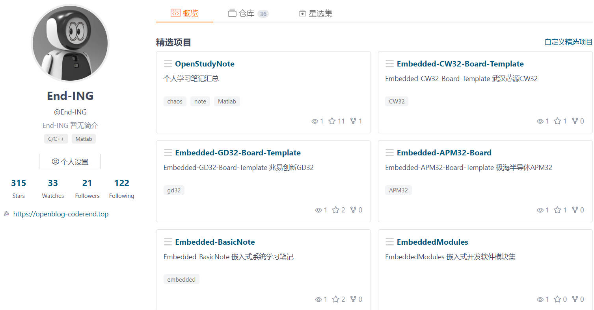

# EmbeddedNote
1. 🌱 研究方向：个人兴趣方向:嵌入式系统开发；研究生研究方向:混沌系统和图像加密算法等。
2. 📫 联系方式：邮箱：delelemonwzx@163.com
3. 🌱 当前正在学习：C/C++、MATLAB、STM32/GD32/AT32/APM32/CW32,嵌入式Linux系统等。
4. 💬 电子信息工程专业学生，希望成为嵌入式工程师,嵌入式软件工程师,电子工程师。

## 教育背景

**西安邮电大学 -电子工程学院-电子信息(硕士)  2022.09 - 2025.06**

研究生研究方向：混沌系统设计与图像加密算法设计，发表SCI论文2篇，参与中国研究生数学建模竞赛获全国三等奖.

**Design and analysis of image encryption based on memristor chaotic systems with hidden attractors**

SCI论文 Physica Scripta 2024 [查看论文](https://iopscience.iop.org/article/10.1088/1402-4896/ad56cf)

**Generation multi-scroll chaotic attractors using composite sine function and its application in image encryption**

SCI论文 Physica Scripta 2024 [查看论文](https://iopscience.iop.org/article/10.1088/1402-4896/ad2b3f)

**蚌埠学院 - 电子与电气工程学院-电子信息工程(本科)2018.09 - 2022.06**

本科期间作为电子协会和电子竞赛负责人，参与各项电子类竞赛，包括电子设计大赛、单片机、物联网等，获得过奖项若干。

## 专业技能

1. 熟悉C语言,Matlab,Python开发,熟悉基本数据结构,熟练使用Keil,IAR,GCC,AD等嵌入式开发工具,具有基本软硬设件调试能力；
2. 熟悉嵌入式MCU芯片开发(STM32,GD32,CW32,瑞萨RA系列等),熟悉MCU基本外设使用,熟悉基本MCU外设通信协议；
3. 熟悉Git基本操作，熟悉基本Linux命令，了解Liunx相关开发；
4. 熟悉RTOS(FreeRTOS,RT-Thread)原理及应用开发,如任务管理,内存管理,任务同步与通信等,了解Linux系统相关应用开发；
5. 熟悉Altium Designer原理图绘制与PCB制作；
6. 熟悉Verilog和FPGA开发软件使用，具有紫光同创FPGA开发经验；
7. 了解ARM和RISC-V体系框架。

## 奖项证书

2022年第十九届中国研究生数学建模竞赛三等奖

2020年安徽省机器人大赛单片机与嵌入式系统竞赛一等奖 

2020年安徽省高校物联网应用创新大赛技能赛 二等奖

2020年第十五届全国大学生智能车竞赛创意组 三等奖

## 项目经历

### 基于紫光同创FPGA的混沌信号的实现
##### FPGA MATLAB Verilog 2024
项目来源于研究生科研项目,研究方向为混沌系统的设计与图像加密应用。通过将连续混沌系统微分方程进行离散化处理,利用MATLAB进行仿真分析。同时,实现混沌电路系统的模拟电路设计与数字电路(FPGA)设计验证以用与图像加密中。
主要职责：
1. 使用数值方法求解微分方程(Euler,Runge-Kutta)，利用MATLAB实现混沌系统的仿真分析。
2. 使用模拟电路元器件,完成混沌电路系统的模拟电路设计验证；利用国厂紫光同创FPGA开发板进行硬件数字电路验证,编写Verilog程序(Euler,Runge-Kutta算法),使用DAC模块将数字信号转换成模拟信号,完成混沌信号的生成。
### 基于GD32的多功能环境检测仪设计
##### GD32 FreeRTOS 2024 
本项目设计了基于兆易创新GD32F4系列微控制器的多功能环境检测装置，通过对多种环境传感器数据的采集，实现环境参数实时监测，使用显示屏幕模块和按键模块进行用户信息展示与交互。同时连接物联网云平台，将传感器数据通发送到云端，实现远程监测。项目移植实时操作系统FreeRTOS实现多任务管理。移植FreeModbus协议，实现Modbus通讯功能。
主要职责：
1. 负责GD32单片机的软件开发工作,项目分层设计,分为应用控制层、中间件层(组件层FreeRTOS等)、BSP模块驱动层、MCU外设驱动层(GIPO,I2C,SPI,UART,TIMER,ADC等)、芯片硬件层(GD32固件库)。主要编写传感器驱动代码(温湿度传感器驱动、光强传感器驱动，气压传感器驱动等)与显示控制模块(LED驱动、按键驱动、LCD驱动、Flash储存驱动、RTC驱动等)代码，实现环境参数的读取与数据处理。通过无线模组实现连接云端 ，将传感器数据通过MQTT协议发送到OneNET平台。同时进行软件与硬件的联合调试，编写测试程序与技术文档。
2. 移植FreeRTOS实时操作系统，实现(传感器数据采集任务、数据显示任务、云平台任务等)多任务管理。通过FreeRTOS的任务调度等机制，提高了系统的响应速度和资源利用率；移植FreeModbus协议实现Modbus通讯功能。
### 基于CW32的无刷电机驱动控制系统
##### CW32 BLDC 2023
本项目设计一个基于CW32的无刷电机控制系统，其核心控制单元采用CW32F030单片机。该系统实现了方波有感控制和方波无感控制两种模式，以满足不同应用场景下的需求。通过ADC接口实时读取电流和电压值，通过电位器调整电机速度，通过温度传感器获取温度值，并通过OLED显示屏展示系统状态、参数等信息。
主要职责：
1. 负责武汉芯源CW32单片机的软件开发工作，编写GPIO,ADC,I2C,Timer等外设驱动代码，通过ADC接口读取电压值，并进行必要的滤波处理。编写传感器数据采集代码，编写OLED显示屏的驱动程序(实现OLED显示实时电流及电压、实时转速等状态信息)。同时对控制系统进行调试，编写测试程序与技术文档。
2. 编写电机控制算法代码(实现方波有感控制和方波无感控制)。通过霍尔(HALL)传感器完成转子位置检测，实现电机的六步换相。同时，支持无传感器模式，使用反电势法检测方法，通过过零信号的组合状态判断转子的位置，从而实现电机换相控制
### 无接触安防控制系统
##### STM32 K210 IoT OTA
项目采用STM32单片机作为主控制器，负责整体系统的控制与传感器数据获取与处理，嘉楠科技的RISC-V架构处理器K210作为副处理器,负责图像采集并对图像数据进行处理,实现人脸识别与检测。系统通过WIFI模组与机智云物联网平台对接,实现传感器数据的上传与控制命令的下发,利用云平台进行远程OTA升级。修改机智云APP软件,使用户在APP上实现对各种参数监测,支持RFID刷卡与语音播报功能,从而实现无接触安防控制系统功能。
主要职责：
1. 负责STM32单片机的软件开发工作,编写传感器驱动代码与应用层控制代码,实现传感器数据的读取与处理,编写通信代码,完成与副处理器K210通信。同时进行软件与硬件调试等,编写测试程序与技术文档。
2. 实现WIFI无线模组与机智云物联网平台连接,实现数据上传与下发。利用机智云物联网云平台OTA功能,实现系统远程固件升级。同时修改APP源码,完成APP上位机设计,并与微控制器进行联调测试

## 自我评价
1. 有良好的自学能力和解决问题的能力，能承受一定的工作压力；
2. 具备良好的团队合作能力，能够与团队紧密协作，共同完成项目目标；
3. 能够快速接受新知识和新技术。

## 求职意向

嵌入式工程师 嵌入式软件工程师 电子工程师

## Blog
Blog: https://openblog-coderend.top/

Gitee:https://gitee.com/End-ING

CSDN: https://delehub.blog.csdn.net/

