## 01-雅特力AT32A403开发板评测 开箱及环境搭建流程

### 雅特力AT32

2023年，玩了不少的国产MCU开发板，例如武汉芯源CW32，兆易创新GD32、上海航芯ACM32、沁恒CH32V307等开发板，虽然论坛也有雅特力AT32开发板的评测活动，但是一直申请也没有申请到，一直就听说雅特力AT32在国产之间做的很好，支持力度，开发资料资源都比较丰富，甚至都有图形化配置工具了。终于，2024年申请到了，但是板子到手里面快十天了，都还没有开始玩起来，很惭愧，主要最近忙着赶论文，而且又感冒了。

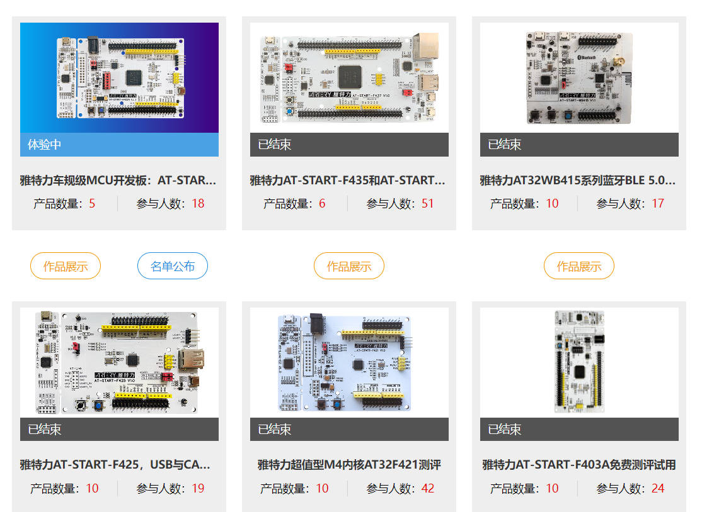

接下来就开始介绍介绍雅特力AT32A403A开发板，雅特力芯片有许多类型，竟然第一次申请就拿到了车规级微控制器，特别是近几年汽车电子的快速发展，感觉得玩玩车规级微控制器的，虽然我还不知道有啥子区别，但是能通过车规级认证还是比较难的。

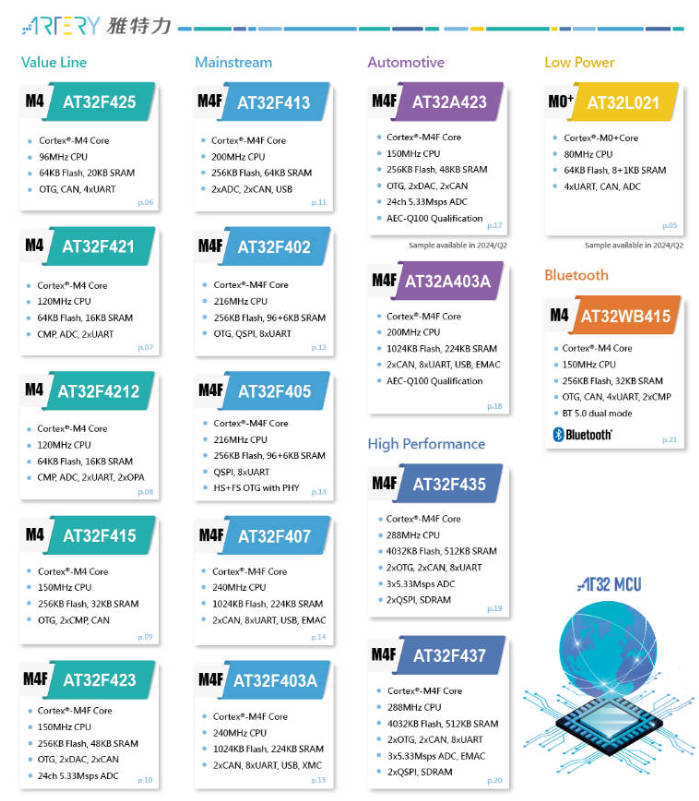


###  AT32A403A资源简介

雅特力科技AT32A403A系列车规级微控制器，搭载32位ARM®Cortex®-M4内核，配合先进制程可达超高效能200MHz的运算速度。内建的单精度浮点运算单元(FPU)及数字信号处理器(DSP)，搭配丰富的外设及灵活的时钟控制机制，具有高集成及高性价比优势。完善的内存设计，最高可支持1MB闪存存储器(Flash)及224KB随机存取存储器(SRAM)，其闪存存储器执行零等待的优异表现，超越业界同级芯片水平。


AT32A403A可运行于工业级温度范围-40~105°C，特别支持8组UART串口，2组CAN总线，还集成兼容IEEE-802.3 10/100Mbps以太网口控制器特别适用于车联网及车载影音系统，以及USB设备应用不需外挂晶振，具有同时提升终端产品的可靠度与降低成本的多重用途。相比于一般性电子产品，汽车电子对MCU的可靠性要求更高，以保障用户安全及极端环境中驾驶工作。作为雅特力首款车规级MCU产 品，AT32A403A (A : Automotive)顺利通过AEC-Q100车规级可靠性认证，满足功能安全标准车规级MCU的能力，同时可广泛适用于车身控制、ADAS辅助驾驶、车载影音、BMS等新能源车用场景，符合车用电子高可靠性和稳定性要求。遵循AEC-Q100标准，AT32A403A通过了包括加速环境应力测试、加速寿命测试、封装组装整合测试、电器特性确认测试等一系列车规级认证。

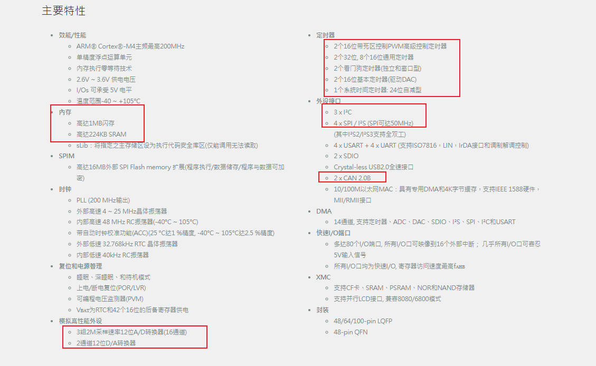

#### 开发板资料

官网资料 

https://www.arterytek.com/cn/product/AT32A403A.jsp#ProuductSelection

主要使用到就是 AT32A403A数据手册，AT32A403A用户参考手册，AT32A403A开发板硬件原理图

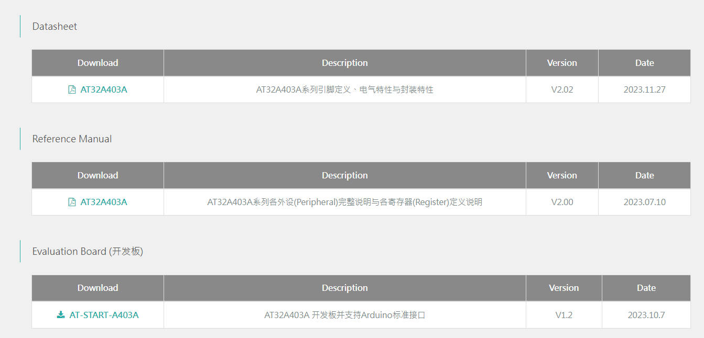

#### 开发板硬件资源

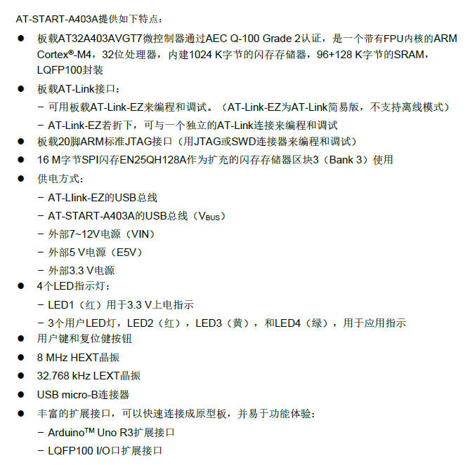

#### AT32A403A_Firmware Library

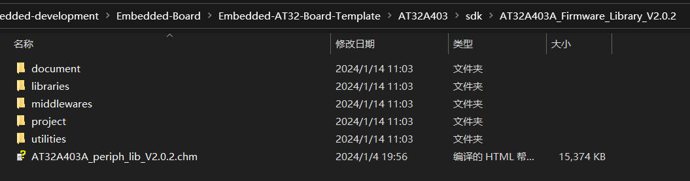

官方提供了大量的参考例程，过于丰富

| **编号** | **模块名称**                     | Examples                               | 功能描述                              |
| -------- | -------------------------------- | -------------------------------------- | ------------------------------------- |
| 1        | acc                              | calibration                            | ACC校准HICK                           |
| 2        | adc                              | combine_mode_ordinary_simult           | ADC主从模式之普通同时模式             |
| 3        | current_vref_value_check         | ADC检测Vref+电压                       |                                       |
| 4        | exint_trigger_partitioned        | ADC分割模式下使用EXINT触发转换         |                                       |
| 5        | internal_temperature_sensor      | ADC使用内部温度传感器                  |                                       |
| 6        | repeat_conversion_loop_transfer  | ADC反复转换时使用DMA的循环模式传输数据 |                                       |
| 7        | software_trigger_repeat          | ADC反复模式下使用软件触发              |                                       |
| 8        | tmr_trigger_automatic_preempted  | ADC使用TMR触发普通转换结合抢占自动转换 |                                       |
| 9        | triple_adc_synchro_trigger       | ADC之三ADC同步触发转换                 |                                       |
| 10       | voltage_monitoring               | 电压监测                               |                                       |
| 11       | bpr                              | bpr_data                               | 电池供电域寄存器读写                  |
| 12       | tamper                           | 入侵检测                               |                                       |
| 13       | can                              | communication_mode                     | CAN通讯模式的使用                     |
| 14       | filter                           | CAN接收过滤器的使用                    |                                       |
| 15       | loopback_mode                    | CAN回环模式使用                        |                                       |
| 16       | cortex_m4                        | bit_band                               | 位带操作进行GPIO翻转和SRAM读写        |
| 17       | cmsis_dsp                        | DSP使用                                |                                       |
| 18       | fpu                              | 使用硬件FPU进行函数运算                |                                       |
| 19       | systick_interrupt                | 演示systick定时器中断方式              |                                       |
| 20       | crc                              | calculation                            | 使用硬件CRC进行CRC计算                |
| 21       | crm                              | clock_failure_detection                | 外部时钟失效检测并系统时钟拯救        |
| 22       | sysclk_switch                    | 系统时钟切换                           |                                       |
| 23       | dac                              | double_mode_dma_sinewave               | 使用DMA双路输出正弦波                 |
| 24       | double_mode_dma_squarewave       | 使用DMA双路输出方波                    |                                       |
| 25       | one_dac_dma_escalator            | 使用DMA单路输出阶梯波                  |                                       |
| 26       | one_dac_noisewave                | 单路输出噪声                           |                                       |
| 27       | two_dac_trianglewave             | 双路输出三角波                         |                                       |
| 28       | debug                            | tmr1                                   | 调试TMR1定时器计数                    |
| 29       | dma                              | data_to_gpio_flexible                  | 使用DMA弹性映射将数据从SRAM传输到GPIO |
| 30       | flash_to_sram                    | 使用DMA将数据从flash传输到SRAM         |                                       |
| 31       | exint                            | exint_config                           | EXINT的基础配置                       |
| 32       | exint_software_trigger           | EXINT的软件触发                        |                                       |
| 33       | flash                            | fap_enable                             | flash访问保护使能                     |
| 34       | flash_write_read                 | 内部flash读写操作                      |                                       |
| 35       | operate_spim                     | 外部spim读写操作                       |                                       |
| 36       | run_in_spim                      | 演示程序运行在外部spim                 |                                       |
| 37       | gpio                             | io_toggle                              | 演示IO翻转                            |
| 38       | led_toggle                       | 演示LED翻转                            |                                       |
| 39       | swjtag_remap                     | 对SWD/JTAG引脚进行复用                 |                                       |
| 40       | i2c                              | communication_dma                      | I2C使用DMA模式通信                    |
| 41       | communication_int                | I2C使用中断模式通信                    |                                       |
| 42       | communication_poll               | I2C使用轮询模式通信                    |                                       |
| 43       | eeprom                           | I2C和EEPROM通信                        |                                       |
| 44       | i2s                              | fullduplex_dma                         | I2S使用DMA进行全双工通讯              |
| 45       | halfduplex_dma                   | I2S使用DMA进行半双工通讯               |                                       |
| 46       | halfduplex_interrupt             | I2S使用中断进行半双工通讯              |                                       |
| 47       | spii2s_switch_halfduplex_polling | SPI_I2S在半双工轮询条件下的模式切换    |                                       |
| 48       | pwc                              | deepsleep_rtc                          | PWC使用RTC唤醒深度睡眠模式            |
| 49       | power_voltage_monitor            | PWC使用电压监测器                      |                                       |
| 50       | sleep_tmr2                       | PWC使用TMR2唤醒睡眠模式                |                                       |
| 51       | sleep_usart1                     | PWC使用USART1唤醒睡眠模式              |                                       |
| 52       | standby_rtc                      | PWC使用RTC唤醒待机模式                 |                                       |
| 53       | standby_wakeup_pin               | PWC使用待机唤醒管脚唤醒待机模式        |                                       |
| 54       | rtc                              | calendar                               | RTC实现日历功能                       |
| 55       | lick_calibration                 | LICK时钟校准                           |                                       |
| 56       | sdio                             | sdio_fatfs                             | 基于SDIO移植应用FatFs文件系统         |
| 57       | sd_mmc_card                      | SD或MMC卡的识别/读写操作               |                                       |
| 58       | spi                              | crc_transfer_polling                   | SPI使用轮询进行CRC传输                |
| 59       | fullduplex_polling               | SPI使用轮询进行全双工通讯              |                                       |
| 60       | halfduplex_interrupt             | SPI使用中断进行半双工通讯              |                                       |
| 61       | halfduplex_transceiver_switch    | SPI半双工下的收发模式切换              |                                       |
| 62       | only_receive_mode_polling        | SPI使用轮训进行单线单向只收            |                                       |
| 63       | use_jtagpin_hardwarecs_dma       | SPI映射到JTAG脚并使用DMA进行硬件CS通讯 |                                       |
| 64       | w25q_flash                       | SPI与W25Qxx Flash通讯                  |                                       |
| 65       | tmr                              | 6_steps                                | 演示如何配置六步方波                  |
| 66       | 7_pwm_output                     | 演示如何配置TMR1产生7路PWM输出         |                                       |
| 67       | cascade_synchro                  | 实现3个TMR的串联同步                   |                                       |
| 68       | complementary_signals            | 使用TMR1实现互补信号输出               |                                       |
| 69       | dma                              | 使用TMR1 overflow事件产生DMA请求       |                                       |
| 70       | dma_burst                        | 演示如何使用定时器DMA burst功能        |                                       |
| 71       | encoder_tmr2                     | 演示定时器编码器接口模式               |                                       |
| 72       | external_clock                   | 演示如何使用外部时钟模式               |                                       |
| 73       | hall_xor_tmr2                    | 演示定时器输入异或功能                 |                                       |
| 74       | hang_mode                        | 演示如何使用挂起模式                   |                                       |
| 75       | input_capture                    | 演示输入捕获功能                       |                                       |
| 76       | oc_high                          | 使用输出控制High模式                   |                                       |
| 77       | oc_low                           | 使用输出控制Low模式                    |                                       |
| 78       | oc_toggle_tmr3                   | 使用TMR3输出控制Toggle模式             |                                       |
| 79       | oc_toggle_tmr9                   | 使用TMR9输出控制Toggle模式             |                                       |
| 80       | one_cycle                        | 使用单周期模式                         |                                       |
| 81       | parallel_synchro                 | 实现3个TMR的并联同步                   |                                       |
| 82       | pwm_input                        | 演示PWM输入捕获功能                    |                                       |
| 83       | pwm_input_dma                    | 使用DMA的PWM输入捕获功能               |                                       |
| 84       | pwm_output_simulate              | 演示模拟PWM输出功能                    |                                       |
| 85       | pwm_output_tmr10                 | 演示TMR10的PWM输出                     |                                       |
| 86       | pwm_output_tmr3                  | 演示TMR3的PWM输出                      |                                       |
| 87       | timer_base                       | 演示定时器计数基本功能                 |                                       |
| 88       | tmr1_synchro                     | 演示TMR1的同步功能                     |                                       |
| 89       | tmr2_32bit                       | 使用32bit定时器                        |                                       |
| 90       | usart                            | half_duplex                            | 使用单线半双工收发                    |
| 91       | hw_flow_control                  | 使用硬件流控通信                       |                                       |
| 92       | idle_detection                   | 空闲帧中断检测                         |                                       |
| 93       | interrupt                        | 使用中断方式收发数据                   |                                       |
| 94       | irda                             | 红外模式通讯                           |                                       |
| 95       | polling                          | 使用轮询方式收发数据                   |                                       |
| 96       | printf                           | 使用串口打印字符                       |                                       |
| 97       | receiver_mute                    | 收到匹配ID退出接收静默模式             |                                       |
| 98       | rs485                            | 基于AT32-Comm-EV Board的RS485通信      |                                       |
| 99       | smartcard                        | 智能卡应用                             |                                       |
| 100      | synchronous                      | 通过同步模式与SPI通信                  |                                       |
| 101      | transfer_by_dma_interrupt        | 使用DMA中断方式实现数据收发            |                                       |
| 102      | transfer_by_dma_polling          | 使用DMA轮询方式实现数据收发            |                                       |
| 103      | usb_device                       | audio                                  | USB音频实现speaker和microphone        |
| 104      | composite_audio_hid              | 实现音频和HID复合设备                  |                                       |
| 105      | composite_vcp_keyboard           | 实现虚拟串口和键盘复合设备             |                                       |
| 106      | composite_vcp_msc                | 实现虚拟串口和mass storage复合设备     |                                       |
| 107      | custom_hid                       | 实现USB自定义HID                       |                                       |
| 108      | keyboard                         | USB键盘设备                            |                                       |
| 109      | mouse                            | USB鼠标设备                            |                                       |
| 110      | msc                              | 使用内部flash实现mass storage设备      |                                       |
| 111      | printer                          | USB打印机设备                          |                                       |
| 112      | vcp_loopback                     | USB虚拟串口设备                        |                                       |
| 113      | virtual_comport                  | USB转串口                              |                                       |
| 114      | virtual_msc_iap                  | 利用虚拟mass storage实现IAP升级功能    |                                       |
| 115      | wdt                              | wdt_reset                              | 看门狗使用                            |
| 116      | wdt_standby                      | standby模式下看门狗使用                |                                       |
| 117      | wwdt                             | wwdt_reset                             | 窗口看门狗使用                        |
| 118      | xmc                              | lcd_8bit                               | 驱动8080并口LCD                       |
| 119      | lcd_touch_16bit                  | 驱动16位并口LCD                        |                                       |
| 120      | nand                             | NAND FLASH储存器读写访问               |                                       |
| 121      | psram                            | PSRAM存储器读写访问                    |                                       |

###  环境搭建流程参考

基本上大多数的工程模板都是采用MDK-KEIL开发的，一般开发人员都安装好了，基本上没有啥子好说的。

基本上只要安装这个pack包就可以了。ArteryTek.AT32A403A_DFP.2.0.3.pack

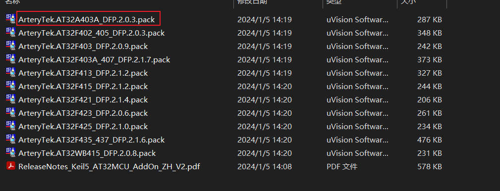

我们以at_start_a403a 里面的工程作为基础，搭建自己的工程模板。以GPIO的工程为基础模板，当然其他的Example同样可以，这里面的基本案例都是值得学习的。

1. at_start_a403a 包含大量开发例程，其中examples是各个外设案例demo,template是各个开发工具的工程模板，而且支持工具版本比较多，这一点是在其他国产mcu例程资料比较少的，绝大多数都是清一色的MDK-KEIL，其次就是IAR工程，像官方的at32_ide，gcc工程模板是比较有特色的。

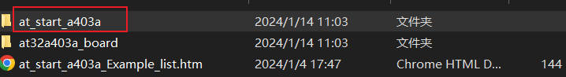

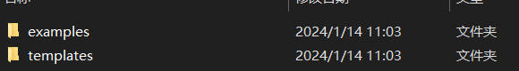

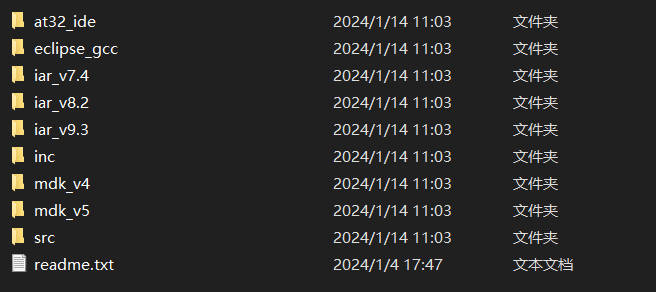

2. 学习外设参考案例 (adc,dac,gpio,timer,i2c,spi,can等) 

   在这里我们选择了gpio的led_toggle工程模板，毕竟点灯是万万不能少的

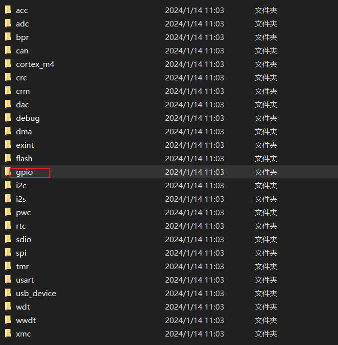


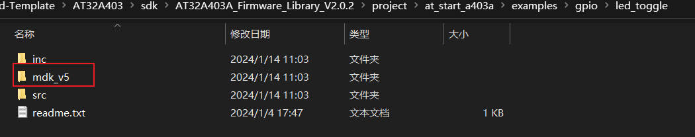

3. 打开led_toggle工程，编译代码，编译0错误0警告。

   at32的led_toggle工程模板的整体命名风格其实和我个人的风格比较相似，所以好感度比较高。

   个人的工程模板文件参考架构如下：

   1. Application 主函数，应用层代码
   2. BspDrivers 板级驱模块动文件
   3. Drivers 底层驱动库文件 Firmware Library
   4. Project 工程文件

   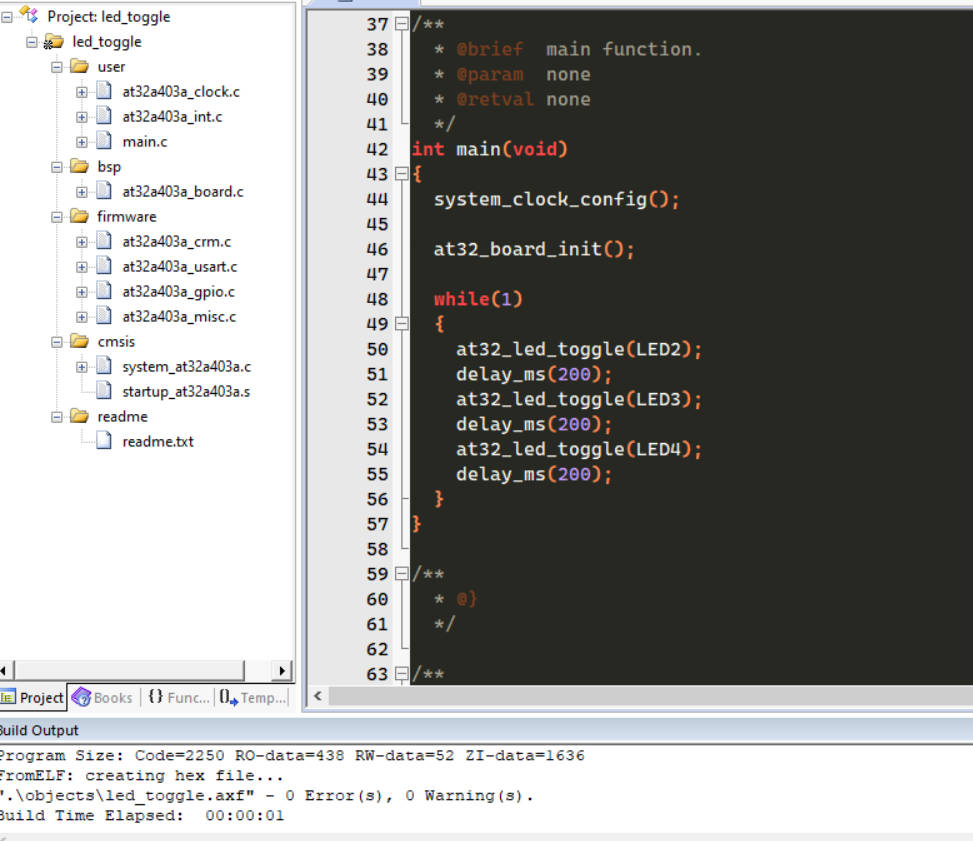

4. 准备下载代码

   板子板载了AT-link（本质上就是DAP）,不需要其他的工具，很方便的就下载程序了。

   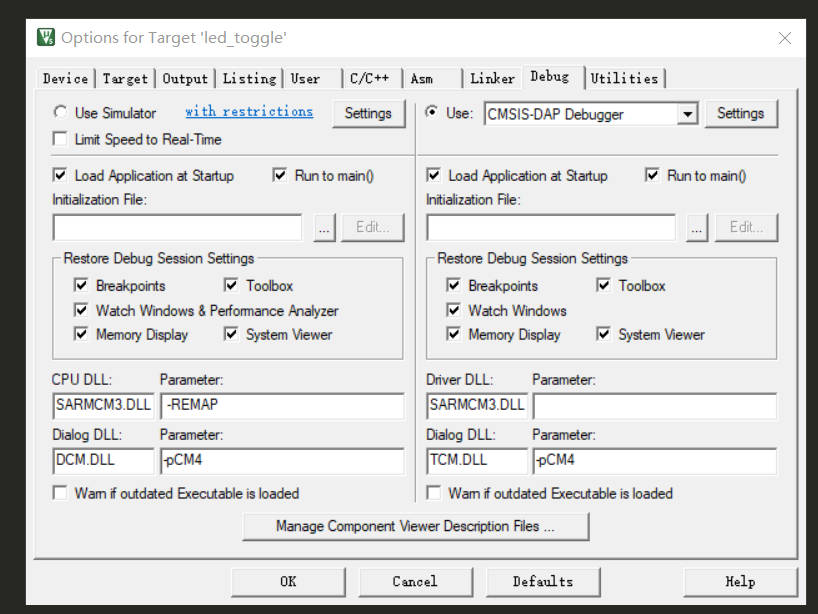

   

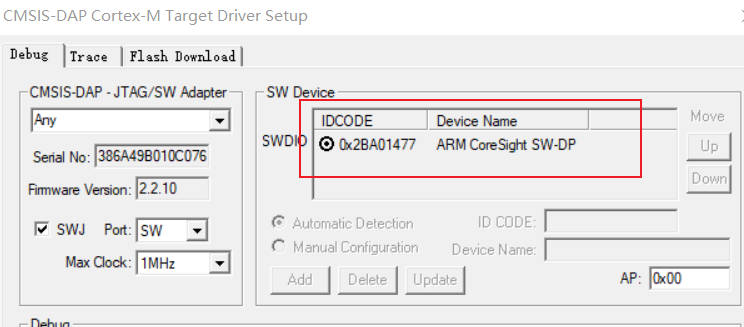

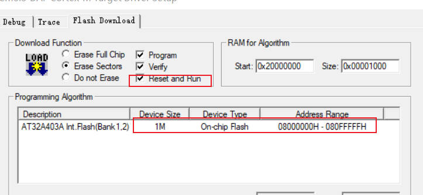

5. 观察开发板现象，流水灯现象

   ```c
   #include "at32a403a_board.h"
   #include "at32a403a_clock.h"
   
   
   /** @addtogroup AT32A403A_periph_examples
     * @{
     */
   
   /** @addtogroup 403A_GPIO_led_toggle GPIO_led_toggle
     * @{
     */
   
   /**
     * @brief  main function.
     * @param  none
     * @retval none
     */
   int main(void)
   {
     system_clock_config();
   
     at32_board_init();
   
     while(1)
     {
       at32_led_toggle(LED2);
       delay_ms(200);
       at32_led_toggle(LED3);
       delay_ms(200);
       at32_led_toggle(LED4);
       delay_ms(200);
     }
   }
   
   ```

   6. 打开usart_printf工程，测试串口打印功能

   ```c
   #include "at32a403a_board.h"
   #include "at32a403a_clock.h"
   
   /** @addtogroup AT32A403A_periph_examples
     * @{
     */
   
   /** @addtogroup 403A_USART_printf USART_printf
     * @{
     */
   
   __IO uint32_t time_cnt = 0;
   
   /**
     * @brief  main function.
     * @param  none
     * @retval none
     */
   int main(void)
   {
     system_clock_config();
     at32_board_init();
     uart_print_init(115200);
   
     /* output a message on hyperterminal using printf function */
     //printf("usart printf example: retarget the c library printf function to the usart\r\n");
     printf("Hardware_Init [ok] \r\n");
     printf("at_start_a403a board testing 2024-1-26\r\n");
     while(1)
     {
       printf("at32_led_toggle example start \r\n");
       at32_led_toggle(LED2);
       delay_ms(200);
       at32_led_toggle(LED3);
       delay_ms(200);
       at32_led_toggle(LED4);
       delay_ms(200);
         printf("at32_led_toggle example end \r\n");
       printf("usart printf counter: %u\r\n",time_cnt++);
       delay_sec(1);
     }
   }
   ```

   

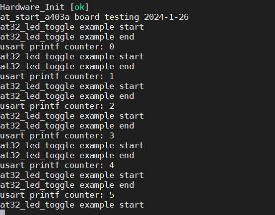