## 01-航芯ACM32G103开发板评测 开箱及环境搭建流程

### ACM32G103开发板资源简介

ACM32G103系列是航芯推出的一款有着丰富模拟外设及安全存储扩展能力的高性价比通用MCU。

1. 高性能：采用STAR-MC1内核（兼容M33和M4指令集），工作主频120MHz，支持浮点运算和DSP，自带CORDIC三角函数硬件加速器，兼具优异的运算处理能力与超低功耗特性（STOP2模式下<15uA）。

2. 大容量存储空间：采用320KB 片上eFlash，64KB SRAM大容量存储空间，并自带Flash加速器实现零等待访问。

3. 集成丰富模拟外设：内置2个高级定时器，2路19通道4Msps ADC，1路2通道DAC，4路比较器，3路运算放大器，满足双电机FOC控制要求。

4. 更强的保护功能，提升数据安全性：内置AES密码算法硬件加速引擎，内置高质量随机数发生器，有效保护用户代码不被窃取和篡改。

   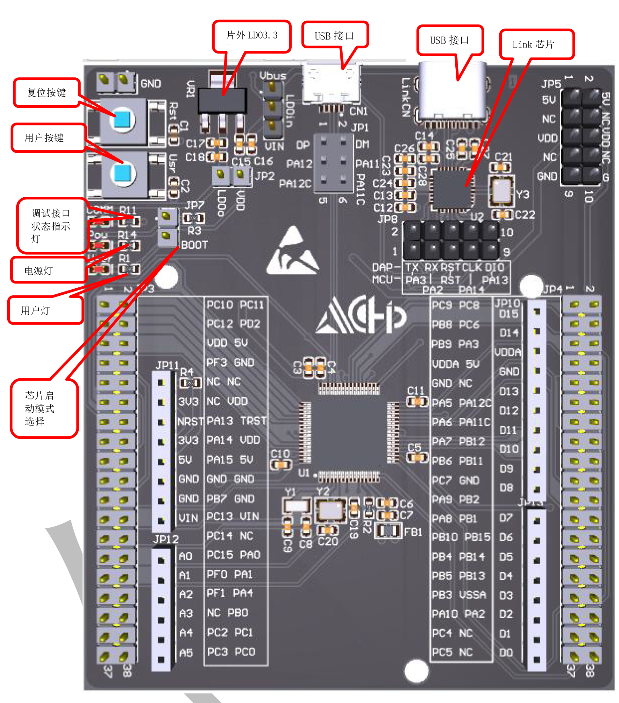a

 上海航芯ACM32G103开发板评测计划 仓库https://gitee.com/End-ING/embedded-acm32-board

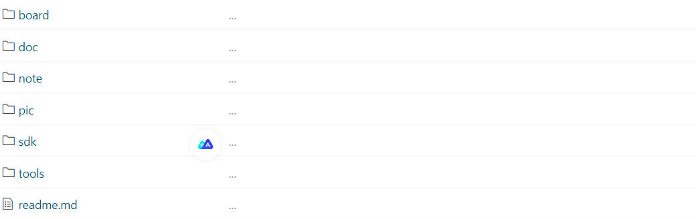

1. doc 开发过程中使用的手册（很重要）

2. sdk 包括标准库和HAL相关参考例程 （很重要）

3. note 测评学习笔记记录

   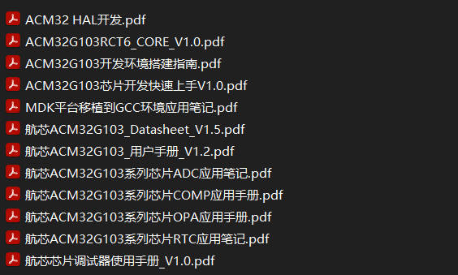

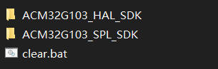

### 环境搭建流程参考 

 **分享一波新资料【航芯ACM32G103开发环境搭建】** http://bbs.eeworld.com.cn/thread-1265880-1-1.html

基本上大多数的工程模板都是采用MDK-KEIL开发的，一般开发人员都安装好了，基本上没有啥子好说的。

基本上只要安装这个pack包就可以了。Aisinochip.ACM32G1.1.0.2.pack

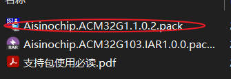

我们以ACM32G103_SPL_SDK里面的工程作为基础，搭建自己的工程模板。以GPIO的工程为基础模板，当然其他的Example同样可以，这里面的基本案例都是值得学习的。

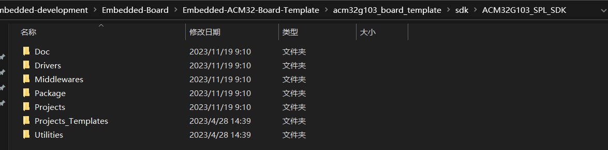

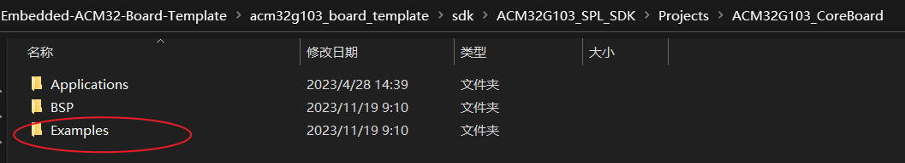

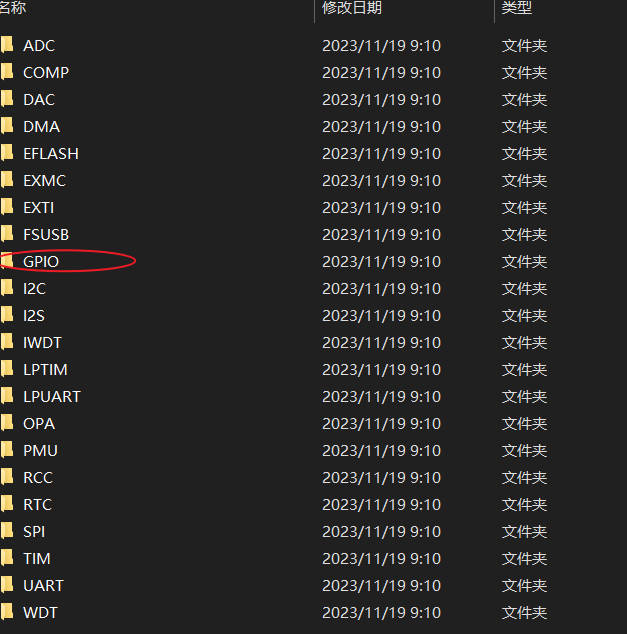

打开工程，编译0错误0警告。

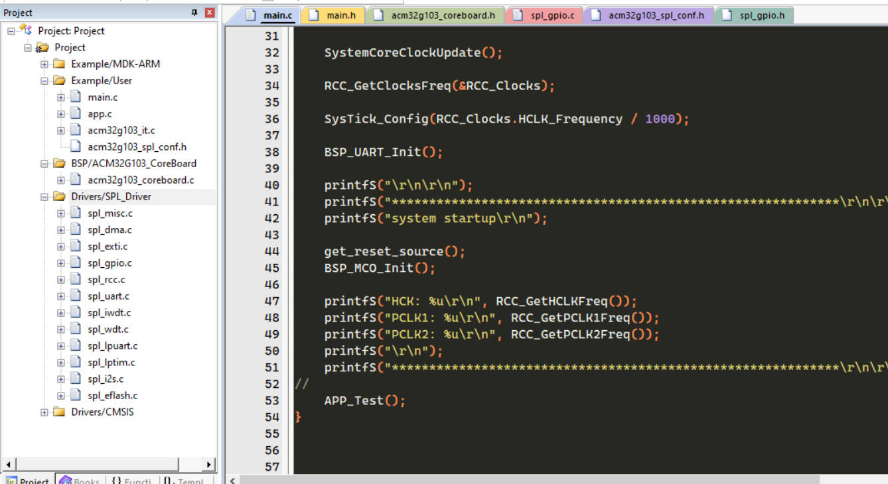

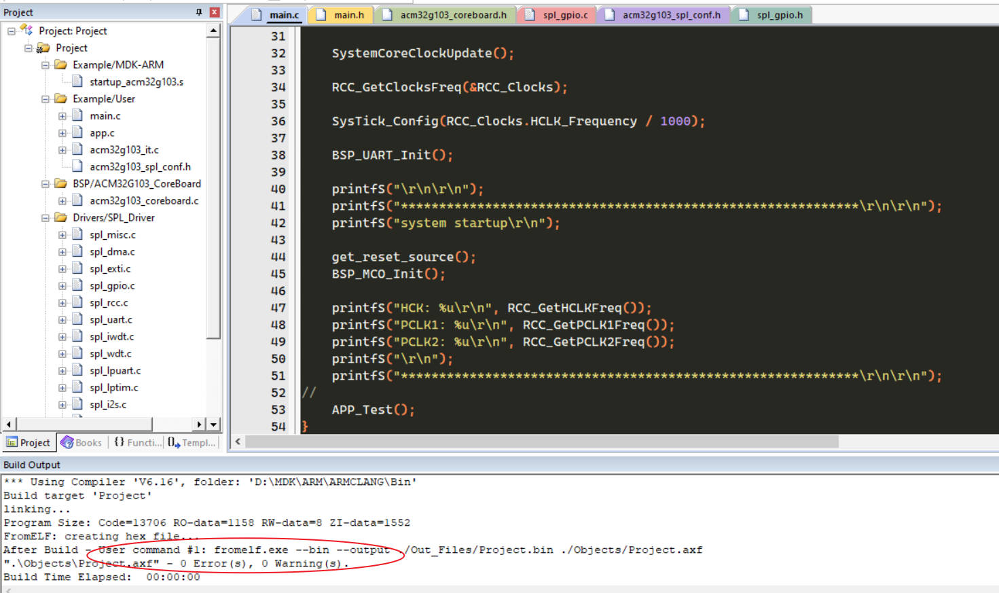

接下来，我们将建立自己的工程模板

文件参考架构如下：

1. Application 主函数，应用层代码
2. BspDrivers 板级驱模块动文件
3. Drivers 底层驱动库文件 CMSIS Device SPL_Driver
4. Project  mdk工程文件

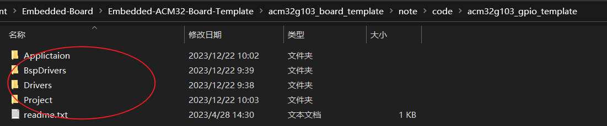

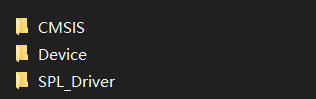

每个人都有自己的工程习惯，我的如下。打开工程，编译0错误0警告。下载代码即可。

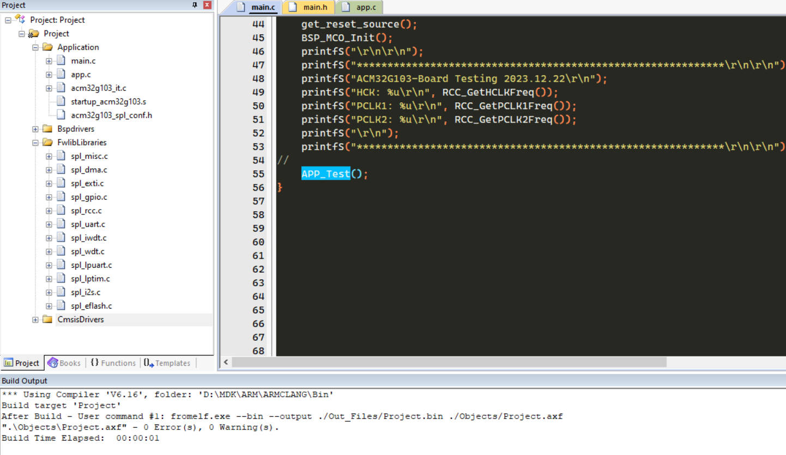

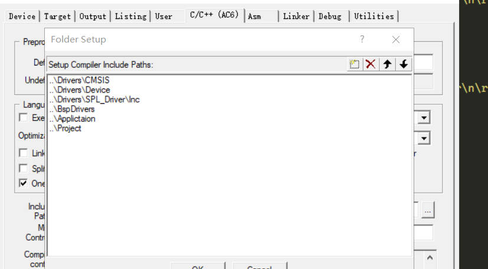

需要注意使用的AC6，不是AC5.

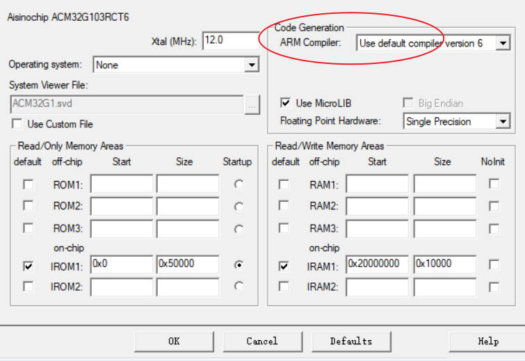

板子板载了DAP,不需要其他的工具，很方便的就下载程序了

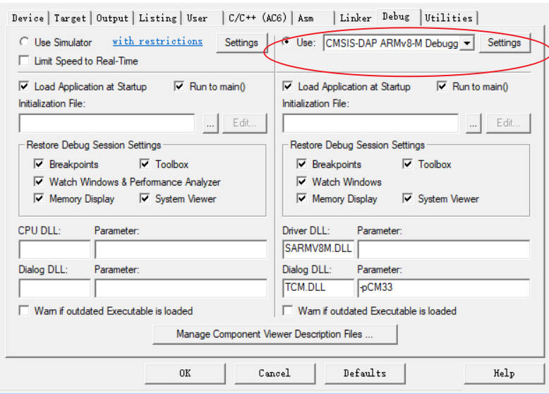

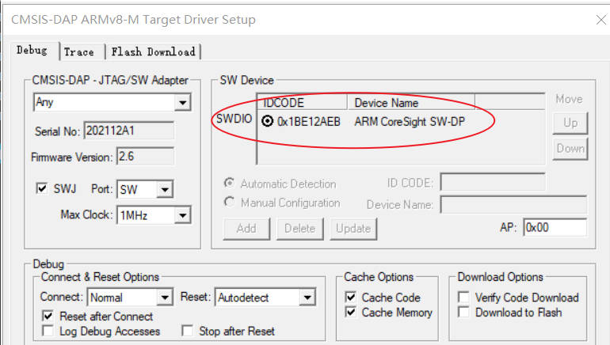

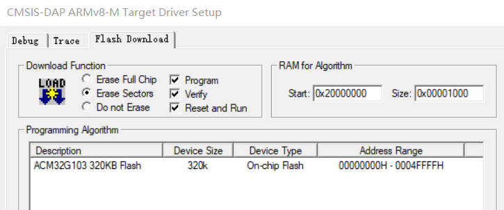

下载代码，查看仓库终端打印结果。

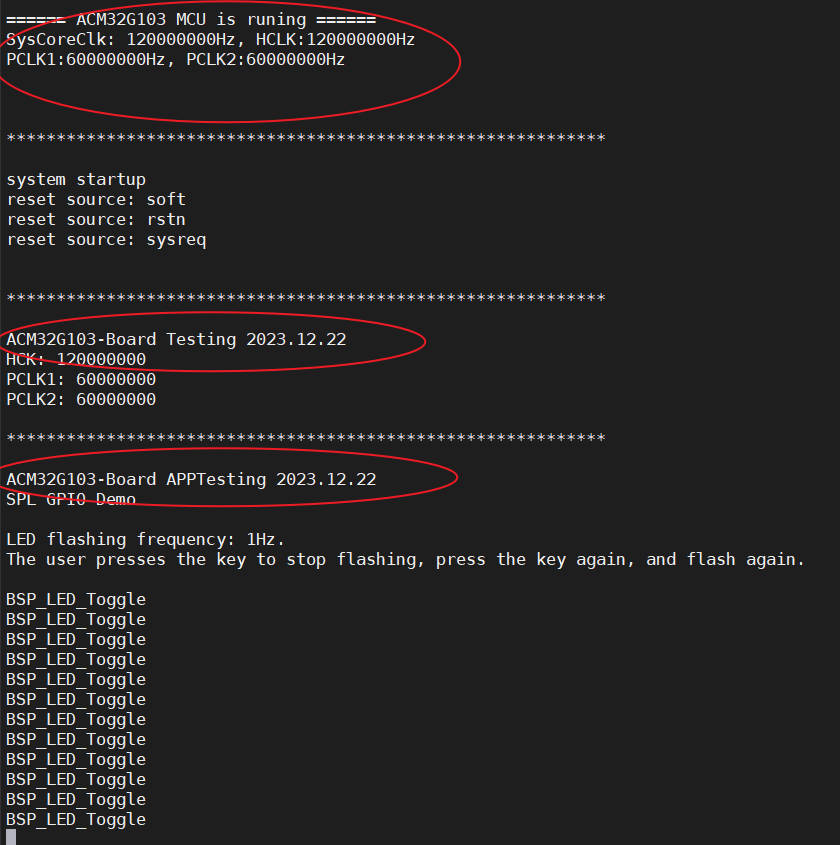
