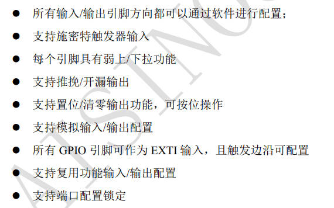
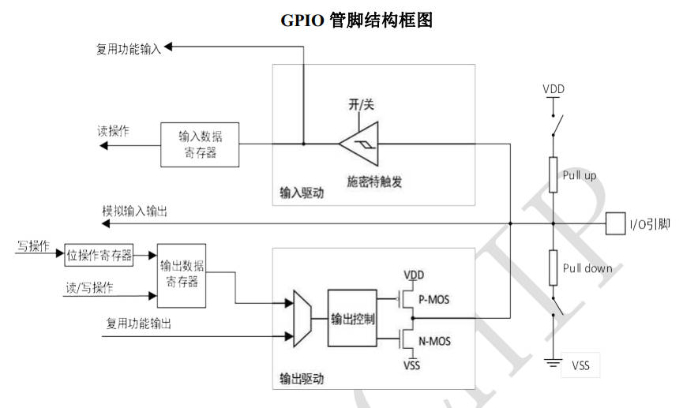
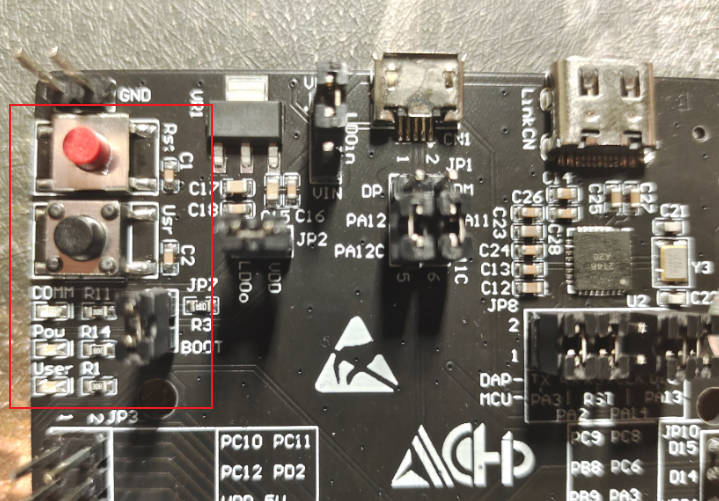
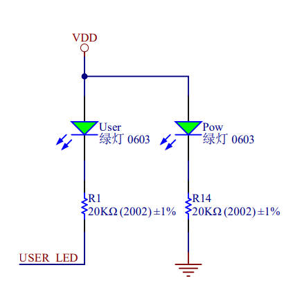
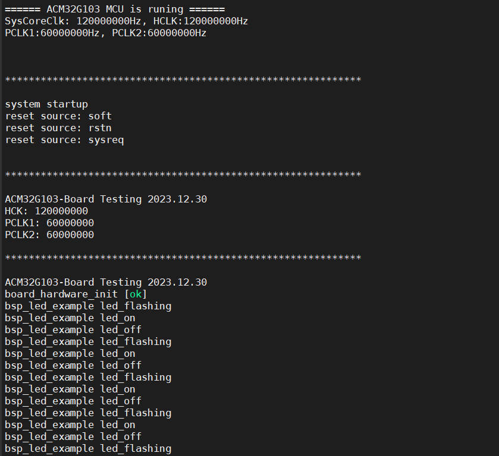
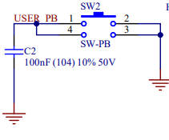
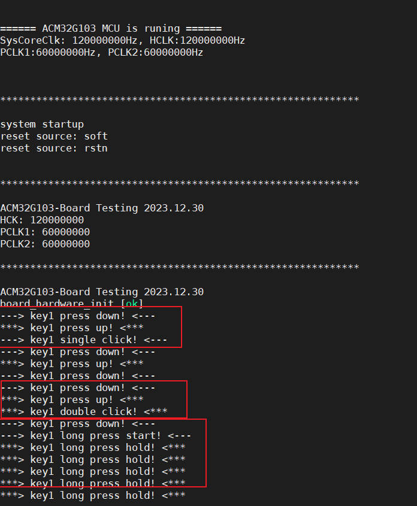

## 02-航芯ACM32G103开发板评测 -GPIO输入输出 

航芯ACM32G103开发板评测 GPIO输入输出应用

GPIO输出典型应用——点灯

GPIO输入典型应用——按键

### GPIO 功能概述

GPIO 是通用输入/输出（General Purpose I/O）的简称，主要用于工业现场需要用到数字量输入/输出的场合，例如：

- **输出功能**：继电器、 LED、蜂鸣器等的控制
- **输入功能**：传感器状态、高低电平等信息的读取
- **复用功能**：片内外设的对外接口
- **时序模拟**：模拟 SPI、I2C 和 UART 等常用接口的时序

### GPIO 功能特性

- 多种工作模式：每个 GPIO 引脚可以独立配置为输出（推挽或开漏）、输入、外设复用功能或模拟模式。每个 GPIO 引脚可以独立配置为上拉、下拉或浮空。
- 灵活的复用模式：复用功能（AF）的备用引脚，极大提高了端口利用的灵活性。GPIO引脚通过配置相关的寄存器可以用作复用功能输入/输出引脚。



###### 

##### GPIO具体细节见航芯ACM32G103_用户手册V1.3 P393

查看acm32官方库函数文件，查看api函数

```c
/* Exported functions --------------------------------------------------------*/
void GPIO_Init(GPIO_TypeDef *GPIOx, GPIO_InitTypeDef *GPIO_Init);
void GPIO_DeInit(GPIO_TypeDef *GPIOx, uint32_t GPIO_Pin);
void GPIO_StructInit(GPIO_InitTypeDef* GPIO_InitStruct);
GPIO_PinState GPIO_ReadPin(GPIO_TypeDef *GPIOx, uint16_t GPIO_Pin);
uint16_t GPIO_ReadInputData(GPIO_TypeDef* GPIOx);
GPIO_PinState GPIO_ReadOutputDataBit(GPIO_TypeDef* GPIOx, uint16_t GPIO_Pin);
uint16_t GPIO_ReadOutputData(GPIO_TypeDef* GPIOx);
void GPIO_SetBits(GPIO_TypeDef* GPIOx, uint16_t GPIO_Pin);
void GPIO_ResetBits(GPIO_TypeDef* GPIOx, uint16_t GPIO_Pin);
void GPIO_WriteBit(GPIO_TypeDef *GPIOx, uint32_t GPIO_Pin, GPIO_PinState PinState);
void GPIO_Write(GPIO_TypeDef *GPIOx, uint16_t PortVal);
void GPIO_ToggleBits(GPIO_TypeDef *GPIOx, uint16_t GPIO_Pin);
void GPIO_PinLockConfig(GPIO_TypeDef *GPIOx, uint32_t GPIO_Pin);
```



### GPIO输出 LED点灯

在航芯ACM32G103开发板中，一共有3个led，但是只有一个user_led可以去控制，其中，pow_led com_led作为提示作用。

接下来就是gpio端口初始化的函数简单分析。



```c

#define BSP_LED_GPIO            GPIOF
#define BSP_LED_PIN             GPIO_PIN_3
#define BSP_LED_MODE            GPIO_MODE_OUTPUT_PP
#define BSP_LED_PULL            GPIO_PULLUP
#define BSP_LED_DRIVE           GPIO_DRIVE_LEVEL3
#define BSP_LED_ALTERNATE       GPIO_FUNCTION_0
#define BSP_LED_CLK_ENABLE()    __RCC_GPIOF_CLK_ENABLE()

void BSP_LED_Init(void)
{
    GPIO_InitTypeDef  GPIO_InitStruct;

    /* Enable the GPIO_LED Clock */
    BSP_LED_CLK_ENABLE();

    GPIO_InitStruct.Pin       = BSP_LED_PIN;
    GPIO_InitStruct.Mode      = BSP_LED_MODE;
    GPIO_InitStruct.Pull      = BSP_LED_PULL;
    GPIO_InitStruct.Drive     = BSP_LED_DRIVE;
    GPIO_InitStruct.Alternate = BSP_LED_ALTERNATE;

    GPIO_Init(BSP_LED_GPIO, &GPIO_InitStruct);

    GPIO_WriteBit(BSP_LED_GPIO, BSP_LED_PIN, GPIO_PIN_SET);
}
```

ACM32G103的gpio端口初始化，与stm32等其他mcu基本上没有太大的区别。唯一的区别是GPIO_InitStruct结构体里一些成员有不同。

```c
//stm32f103 hal
typedef struct
{
  uint32_t Pin;       /*!< Specifies the GPIO pins to be configured.
                           This parameter can be any value of @ref GPIO_pins_define */
  uint32_t Mode;      /*!< Specifies the operating mode for the selected pins.
                           This parameter can be a value of @ref GPIO_mode_define */
  uint32_t Pull;      /*!< Specifies the Pull-up or Pull-Down activation for the selected pins.
                          This parameter can be a value of @ref GPIO_pull_define */
  uint32_t Speed;     /*!< Specifies the speed for the selected pins.
                           This parameter can be a value of @ref GPIO_speed_define */
} GPIO_InitTypeDef;

//stm32f103 std
typedef struct
{
  uint16_t GPIO_Pin;             /*!< Specifies the GPIO pins to be configured.
                                      This parameter can be any value of @ref GPIO_pins_define */
  GPIOSpeed_TypeDef GPIO_Speed;  /*!< Specifies the speed for the selected pins.
                                      This parameter can be a value of @ref GPIOSpeed_TypeDef */
  GPIOMode_TypeDef GPIO_Mode;    /*!< Specifies the operating mode for the selected pins.
                                      This parameter can be a value of @ref GPIOMode_TypeDef */
}GPIO_InitTypeDef;

//acm32g103 spl
typedef struct
{
    uint32_t    Pin;               /*!< Specifies the GPIO pins to be configured.
                                        This parameter can be any value of @ref GPIO_pins */
    uint32_t    Mode;              /*!< Specifies the operating mode for the selected pins.
                                         This parameter can be a value of @ref GPIO_mode */
    uint32_t    Pull;              /*!< Specifies the Pull-up or Pull-Down activation for the selected pins.
                                         This parameter can be a value of @ref GPIO_pull */
    uint32_t    Drive;             /*!< Specifies the Output drive capability for the selected pins.
                                         This parameter can be a value of @ref GPIO_drive */
    uint32_t    Alternate;         /*!< Peripheral to be connected to the selected pins
                                         This parameter can be a value of @ref GPIOEx_function_selection */
} GPIO_InitTypeDef;

```

其中主要的区别是acm32中有一个**指定选定引脚的输出驱动能力Drive**成员，GPIOx 的 PIN驱动能力5V 耐压 IO 的驱动能力配置：

```c
/** @defgroup GPIO_drive
  * @brief GPIO Output drive capability
  * @{
  */
/*!< Output drive capability up to 2mA, please refer to the product datasheet */
#define  GPIO_DRIVE_LEVEL0                      (0x00000000U)   
/*!< Output drive capability up to 4mA, please refer to the product datasheet */
#define  GPIO_DRIVE_LEVEL1                      (0x00000001U)   
 /*!< Output drive capability up to 6mA, please refer to the product datasheet */
#define  GPIO_DRIVE_LEVEL2                      (0x00000002U)  
/*!< Output drive capability up to 8mA, please refer to the product datasheet */
#define  GPIO_DRIVE_LEVEL3                      (0x00000003U)   
/*!< Output drive capability up to 10mA,please refer to the product datasheet */
#define  GPIO_DRIVE_LEVEL4                      (0x00000004U)   
/*!< Output drive capability up to 12mA,please refer to the product datasheet */
#define  GPIO_DRIVE_LEVEL5                      (0x00000005U)   
/*!< Output drive capability up to 14mA,please refer to the product datasheet */
#define  GPIO_DRIVE_LEVEL6                      (0x00000006U)  
 /*!< Output drive capability up to 16mA,please refer to the product datasheet */
#define  GPIO_DRIVE_LEVEL7                      (0x00000007U)  
```

GPIO控制函数

```c
//设置或清除选定的数据端口位。
void GPIO_WriteBit(GPIO_TypeDef *GPIOx, uint32_t GPIO_Pin, GPIO_PinState PinState)
{
    /* Check the parameters */
    assert_param(IS_GPIO_ALL_PERIPH(GPIOx));
    assert_param(IS_GPIO_ALL_PIN(GPIOx, GPIO_Pin));
    assert_param(IS_GPIO_PIN_STATE(PinState));

    if (GPIO_PIN_RESET == PinState)
        GPIOx->BSC = GPIO_Pin << 16U;
    else
        GPIOx->BSC = GPIO_Pin;
}

```

```c
/******************************************************************************
*@brief : LED on
*@param : none
*@return: none
******************************************************************************/
void BSP_LED_On(void)
{
    GPIO_WriteBit(BSP_LED_GPIO, BSP_LED_PIN, GPIO_PIN_RESET);
}

/******************************************************************************
*@brief : LED off
*@param : none
*@return: none
******************************************************************************/
void BSP_LED_Off(void)
{
    GPIO_WriteBit(BSP_LED_GPIO, BSP_LED_PIN, GPIO_PIN_SET);
}

/******************************************************************************
*@brief : LED toggle
*@param : none
*@return: none
******************************************************************************/
void BSP_LED_Toggle(void)
{
    GPIO_ToggleBits(BSP_LED_GPIO, BSP_LED_PIN);
}
```

led_example测试函数

```c
void bsp_led_example(void)
{
    printfS("bsp_led_example led_flashing \r\n");
    BSP_LED_On();
    printfS("bsp_led_example led_on \r\n");
    DelayMs(1000);
    BSP_LED_Off();
    printfS("bsp_led_example led_off \r\n");
    DelayMs(500);
}
```



### GPIO输入 按键控制

在航芯ACM32G103开发板中，一共有2个按键，但是只有一个user_key可以去控制，其中一个是rst复位按键。

按键机械触点断开、闭合时，由于触点的弹性作用，按键开关不会马上稳定接通或一下子断开， 使用按键时会产生图 按键抖动说明图中的带波纹信号，需要用软件消抖处理滤波，不方便输入检测。


本实验板连接的按键带硬件消抖功能， 见图 按键原理图 ，它利用电容充放电的延时，消除了波纹，从而简化软件的处理，软件只需要直接检测引脚的电平即可。

接下来就是按键key端口初始化的函数简单分析。

BSP_PB_Init初始化配置过程中，基本上就是GPIO端口初始化，和中断配置初始化。



```c
/******************************************************************************
*@brief : PB init
*@param : none
*@return: none
******************************************************************************/
void BSP_PB_Init(void)
{
    GPIO_InitTypeDef GPIO_InitStruct;
    EXTI_InitTypeDef EXTI_InitStruct;

    BSP_PB_CLK_ENABLE();

    GPIO_InitStruct.Pin       = BSP_PB_PIN;
    GPIO_InitStruct.Mode      = BSP_PB_MODE;
    GPIO_InitStruct.Pull      = BSP_PB_PULL;
    GPIO_InitStruct.Drive     = BSP_PB_DRIVE;
    GPIO_InitStruct.Alternate = BSP_PB_ALTERNATE;

    GPIO_Init(BSP_PB_GPIO, &GPIO_InitStruct);

    EXTI_InitStruct.GPIOx     = BSP_PB_GPIO;
    EXTI_InitStruct.Line      = BSP_PB_PIN;
    EXTI_InitStruct.Mode      = EXTI_MODE_IT;
    EXTI_InitStruct.Trigger   = EXTI_TRIGGER_FALLING;
    EXTI_InitStruct.Cmd       = ENABLE;
    
    EXTI_Init(&EXTI_InitStruct);
    
	EXTI_ClearITPendingBit(BSP_PB_PIN);
    
    NVIC_ClearPendingIRQ(BSP_PB_IRQ);
    NVIC_SetPriority(BSP_PB_IRQ, 0x00);
    NVIC_EnableIRQ(BSP_PB_IRQ);
}

/******************************************************************************
*@brief : get PB state
*@param : none
*@return: none
******************************************************************************/
uint32_t BSP_PB_GetState(void)
{
    return (GPIO_ReadPin(BSP_PB_GPIO, BSP_PB_PIN));
}

```

```c
void APP_Test(void)
{
    uint32_t state;
    
	printfS("SPL GPIO Demo\r\n");
	printfS("LED flashing frequency: 1Hz.\r\n");
	printfS("The user presses the key to stop flashing, press the key again, and flash again.\r\n");

    g_press = 0;
    
    state = 0;
    while(1)
    {
        if (g_press != 0)
        {
            DelayMs(50);
            g_press = 0;
            if (state == 0)
                state = 1;
            else
                state = 0;
        }
        
        if (state == 0)
        {
            BSP_LED_Toggle();
            printfS("BSP_LED_Toggle \r\n");
        }
        else
        {
            BSP_LED_Off();
        }
		DelayMs(500);
    };
}


void EXTI15_10_IRQHandler(void)
{
    if (EXTI->PDR & BSP_PB_PIN)
    {
        EXTI->PDR = BSP_PB_PIN;
        PB_IRQHandler();
    }
}
```

上面的方法是利用按键中断去判断的，下面使用MultiButton开源框架，进行按键检测。

#### MultiButton按键检测

MultiButton开源框架仓库 https://github.com/0x1abin/MultiButton

参考博客https://blog.csdn.net/qq_36075612/article/details/115901032

MultiButton | 一个小巧简单易用的事件驱动型按键驱动模块 https://zhuanlan.zhihu.com/p/128961191

本次使用的是博客中的版本，仓库版本的代码可能与下面代码不一样，应该是更新了代码和api。

### 一、使用方法

1.先申请一个按键结构。

2.初始化按键对象，绑定按键的GPIO电平读取接口**read_button_pin()** ，后一个参数设置有效触发电平。

3.注册按键事件。

4.启动按键。

5.设置一个5ms间隔的定时器循环调用后台处理函数。

```c
//按键状态读取接口
unsigned char btn0_id = 0;
struct Button button0;

uint8_t  read_button0_GPIO(void)
{
    return (GPIO_ReadPin(BSP_PB_GPIO, BSP_PB_PIN));
}

void button_callback(void *button)
{
    uint32_t btn_event_val; 
    
    btn_event_val = get_button_event((struct Button *)button); 
    
    switch(btn_event_val)
    {
      case PRESS_DOWN:
          printf("---> key1 press down! <---\r\n"); 
      break; 
 
      case PRESS_UP: 
          printf("***> key1 press up! <***\r\n");
      break; 
 
      case PRESS_REPEAT: 
          printf("---> key1 press repeat! <---\r\n");
      break; 
 
      case SINGLE_CLICK: 
          printf("---> key1 single click! <---\r\n");
      break; 
 
      case DOUBLE_CLICK: 
          printf("***> key1 double click! <***\r\n");
      break; 
 
      case LONG_PRESS_START: 
          printf("---> key1 long press start! <---\r\n");
      break; 
 
      case LONG_PRESS_HOLD: 
          printf("***> key1 long press hold! <***\r\n");
      break; 
    }
}
```

#### 特性

MultiButton 使用C语言实现，基于面向对象方式设计思路，每个按键对象单独用一份数据结构管理：

```cpp
struct Button {

	uint16_t ticks;
	uint8_t  repeat: 4;
	uint8_t  event : 4;
	uint8_t  state : 3;
	uint8_t  debounce_cnt : 3;
	uint8_t  active_level : 1;
	uint8_t  button_level : 1;
	uint8_t  (*hal_button_Level)(void);
	BtnCallback  cb[number_of_event];
	struct Button* next;
};
```

这样每个按键使用单向链表相连，依次进入 button_handler(struct Button* handle) 状态机处理，所以每个按键的状态彼此独立。

#### 按键事件

| 事件             | 说明                                 |
| :--------------- | :----------------------------------- |
| PRESS_DOWN       | 按键按下，每次按下都触发             |
| PRESS_UP         | 按键弹起，每次松开都触发             |
| PRESS_REPEAT     | 重复按下触发，变量repeat计数连击次数 |
| SINGLE_CLICK     | 单击按键事件                         |
| DOUBLE_CLICK     | 双击按键事件                         |
| LONG_PRESS_START | 达到长按时间阈值时触发一次           |
| LONG_PRESS_HOLD  | 长按期间一直触发                     |

```c
/******************************************************************************
*@brief : main program
*@param : none
*@return: none
******************************************************************************/
int main(void)
{
   
    board_hardware_init();
    printfS("board_hardware_init [ok] \r\n");
    //Timer_Update_Test();
    
    
   //初始化按键对象
    button_init(&button0, read_button0_GPIO, 0);
    button_attach(&button0, PRESS_DOWN,       button_callback);
    button_attach(&button0, PRESS_UP,         button_callback);
    button_attach(&button0, PRESS_REPEAT,     button_callback);
    button_attach(&button0, SINGLE_CLICK,     button_callback);
    button_attach(&button0, DOUBLE_CLICK,     button_callback);
    button_attach(&button0, LONG_PRESS_START, button_callback);
    button_attach(&button0, LONG_PRESS_HOLD,  button_callback);
   //启动按键
   button_start(&button0);
    while(1)
    {
        //bsp_led_example();
        button_ticks();
        DelayMs(5);
    }
    
}
```


