## 03-航芯ACM32G103开发板评测 RT-Thread Nano移植 线程管理测试

### 1. 软硬件平台

1. ACM32G103 Board开发板
2. MDK-ARM Keil
3. RT-Thread Nano 源码
### 2. 物联网RTOS—RT-Thread
​	RT-Thread诞生于2006年，是一款以开源、中立、社区化发展起来的物联网操作系统。 RT-Thread主要采用 C 语言编写，浅显易懂，且具有方便移植的特性（可快速移植到多种主流 MCU 及模组芯片上）。RT-Thread把面向对象的设计方法应用到实时系统设计中，使得代码风格优雅、架构清晰、系统模块化并且可裁剪性非常好。RT-Thread完整版，通过在线的软件包管理工具，配合系统配置工具实现直观快速的模块化裁剪，并且可以无缝地导入丰富的软件功能包，从而实现复杂功能。

RT-Thread Nano 是一个极简版的硬实时内核，它是由 C 语言开发，采用面向对象的编程思维，具有良好的代码风格，是一款可裁剪的、抢占式实时多任务的 RTOS。其内存资源占用极小，功能包括任务处理、软件定时器、信号量、邮箱和实时调度等相对完整的实时操作系统特性。适用于大量使用的 32 位 ARM 入门级 MCU 的场合。下图是 RT-Thread Nano 的软件框图，包含支持的 CPU 架构与内核源码，还有可拆卸的 FinSH 组件：
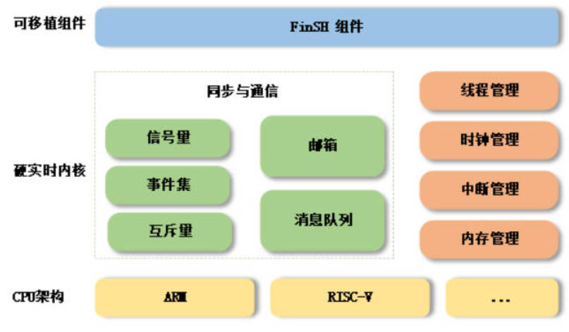


支持架构：ARM：Cortex M0/ M3/ M4/ M7 等、RISC-V 及其他。

功能：线程管理、线程间同步与通信、时钟管理、中断管理、内存管理。

#### RT-Thread Nano的特点

1. 下载简单

   RT-Thread Nano 以软件包的方式集成在 Keil MDK 与 CubeMX 中，可以直接在软件中下载 Nano 软件包获取源码，获取方式详见 基于 Keil MDK 移植 RT-Thread Nano 与 基于 CubeMX 移植 RT-Thread Nano 。同时也提供 下载 Nano 源码压缩包 的途径，方便在其他开发环境移植 RT-Thread Nano，如 基于 IAR 移植 RT-Thread Nano。

2. 代码简单
   与RT-Thread 完整版不同的是，Nano 不含 Scons 构建系统，不需要 Kconfig 以及 Env 配置工具，也去除了完整版特有的 device 框架和组件，仅是一个纯净的内核。

3. 移植简单
   由于 Nano 的极简特性，使 Nano 的移植过程变得极为简单。添加 Nano 源码到工程，就已完成 90% 的移植工作。

4. 易裁剪：Nano 的配置文件为 rtconfig.h，该文件中列出了内核中的所有宏定义，有些默认没有打开，如需使用，打开即可。

5. 易添加 FinSH 组件：FinSH 组件 可以很方便的在 Nano 上进行移植，而不再依赖 device 框架，只需要对接两个必要的函数即可完成 FinSH 移植。

6. 资源占用小：对 RAM 与 ROM 的开销非常小，在支持 semaphore 和 mailbox 特性，并运行两个线程 (main 线程 + idle 线程) 情况下，ROM 和 RAM 依然保持着极小的尺寸，RAM 占用约 1K 左右，ROM 占用 4K 左右。

### 移植过程

1. 先准备好rt-thread nano 源码

https://gitee.com/End-ING/Embedded-BasicNote/tree/master/learn-note/rtos-note/rt-thread-nano/rt-thread

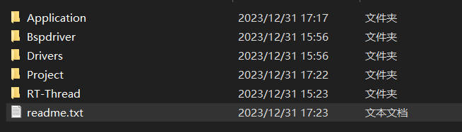

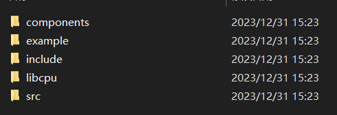

2. 建立工程，添加相关文件

   直接全部添加src文件，添加port文件时选择了arm cortex-m4架构的。

   ACM32G103是基于ARMv8-M架构，支持Cortex-M33和Cortex-M4F指令集，支持浮点运算和DSP。但rt-thread nano里面没有Cortex-M33文件，可能标准版支持的力度好点，因此就选择了cortex-m4的，里面的具体差别不怎么清楚，我也没有找到相关官方资料，目前按照这个去移植吧，后续出现问题的时候再移植。

   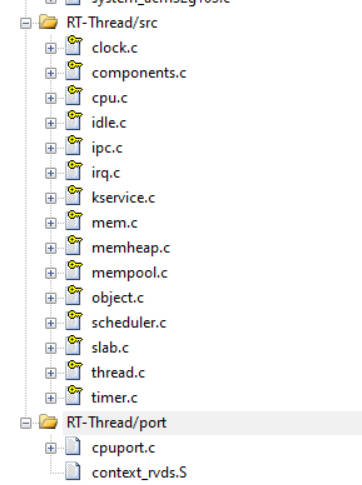

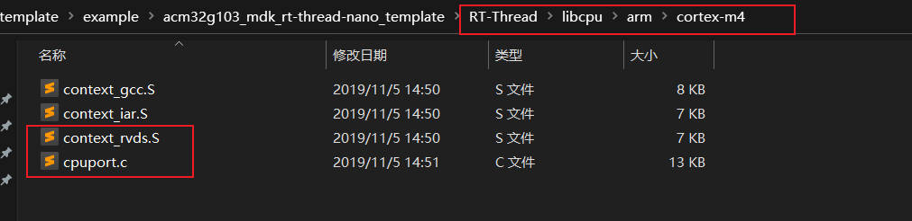

3. 注释中断处理函数

   ```c
   void PendSV_Handler(void);
   void SysTick_Handler(void);
   void HardFault_Handler(void);
   ```

​	RT-Thread 会接管异常处理函数 `HardFault_Handler()` 和悬挂处理函数 `PendSV_Handler()`，这两个函数已由 RT-Thread 实现，所以需要删除工程里中断服务例程文件中的这两个函数，避免在编译时产生重复定义。如果此时对工程进行编译，没有出现函数重复定义的错误，则不用做修改。因此在我们的工程里面需要把gd32f30x_it.c文件中的HardFault_Handler、PendSV_Handler、SysTick_Handler函数注释掉。

4. 添加board.c rtconfig.h文件，这两个文件非常重要。重点需要修改这两个文件。

   参考官方教程   [基于 Keil MDK 移植 RT-Thread Nano](https://www.rt-thread.org/document/site/#/rt-thread-version/rt-thread-nano/nano-port-keil/an0039-nano-port-keil?id=基于-keil-mdk-移植-rt-thread-nano)

（1）初始化HAL库

（2）配置系统时钟

（3）对系统时钟进行更新

（4）RT-Thread nano OS tick频率配置

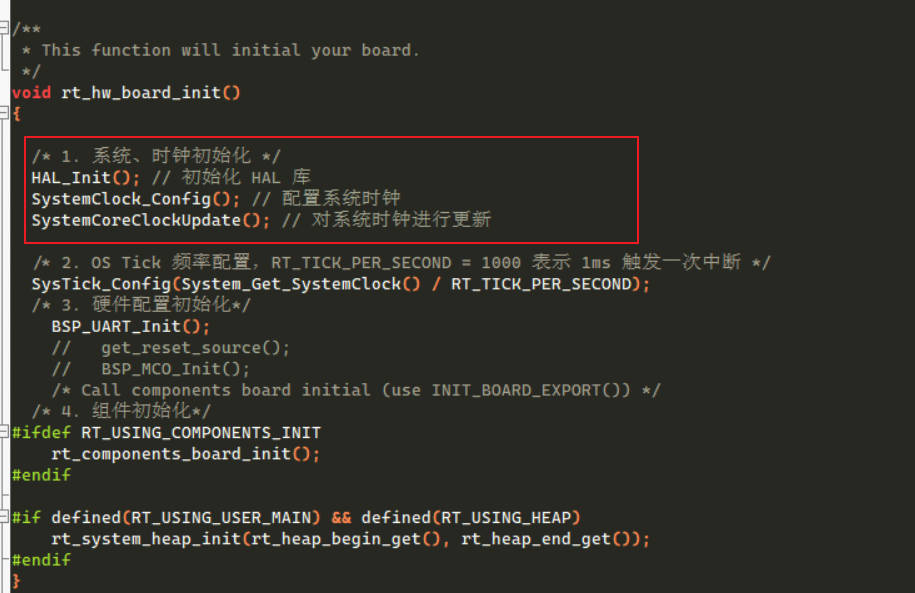

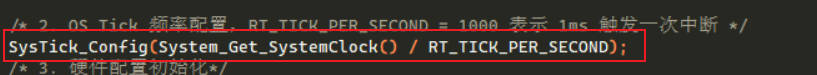

在SysTick_Config中，修改了一些文件，原始库没有。

```c
extern uint32_t g_SystemCoreClock; /*!< System Clock Frequency (Core Clock) */
uint32_t System_Get_SystemClock(void)
{
    return g_SystemCoreClock;
}
```

5. 由于 `SysTick_Handler()` 中断服务例程由用户在 board.c 中重新实现，做了系统 OS Tick，所以还需要删除工程里中原本已经实现的 `SysTick_Handler()` ，避免在编译时产生重复定义。如果此时对工程进行编译，没有出现函数重复定义的错误，则不用做修改。

   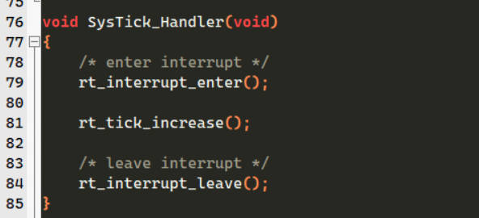

6. 系统内存堆的初始化
   系统内存堆的初始化在board.c 中的 rt_hw_board_init() 函数中完成，内存堆功能是否使用取决于宏 RT_USING_HEAP 是否开启，RT-Thread Nano 默认不开启内存堆功能，这样可以保持一个较小的体积，不用为内存堆开辟空间。
   开启系统 heap 将可以使用动态内存功能，如使用 rt_malloc、rt_free 以及各种系统动态创建对象的 API。若需要使用系统内存堆功能，则打开 RT_USING_HEAP 宏定义即可，此时内存堆初始化函数 rt_system_heap_init() 将被调用.
   初始化内存堆需要堆的起始地址与结束地址这两个参数，系统中默认使用数组作为 heap，并获取了 heap 的起始地址与结束地址，该数组大小可手动更改.

   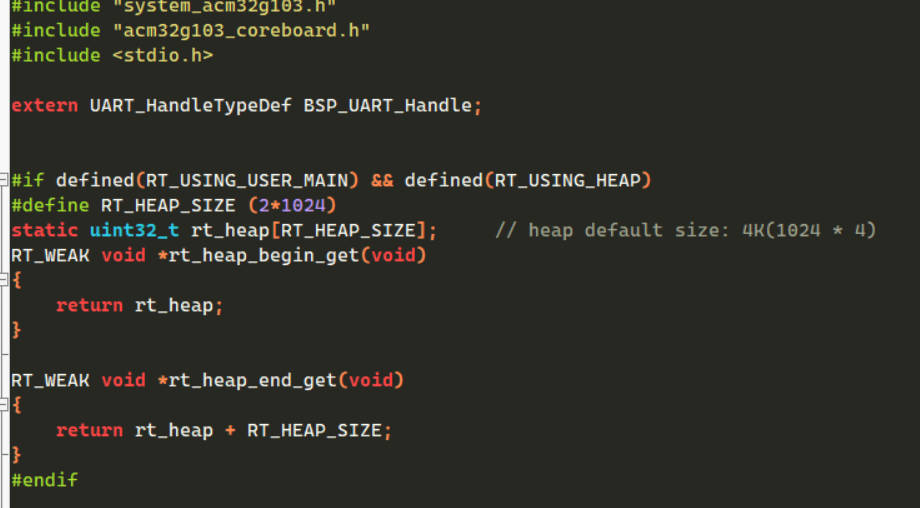

综述所述，内核基本上就移植完成了，接下来进行线程管理测试。

### 线程管理测试

1. 线程管理函数

   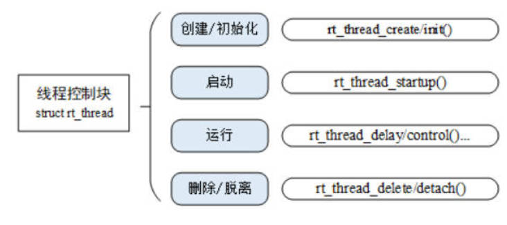
   #### 线程的创建（动态创建、静态创建）

   **动态创建 rt_thread_create**

   ```c
   rt_thread_t rt_thread_create(const char* name,
                               void (*entry)(void* parameter),
                               void* parameter,
                               rt_uint32_t stack_size,
                               rt_uint8_t priority,
                               rt_uint32_t tick);
   ```

   | **参数**   |                           **描述**                           |
   | ---------- | :----------------------------------------------------------: |
   | name       | **线程的名称**；线程名称的最大长度由 rtconfig.h 中的宏 RT_NAME_MAX 指定，多余部分会被自动截掉 |
   | entry      |                       **线程入口函数**                       |
   | parameter  |                       线程入口函数参数                       |
   | stack_size |                  **线程栈大小，单位是字节**                  |
   | priority   | **线程的优先级**。优先级范围根据系统配置情况（rtconfig.h 中的 RT_THREAD_PRIORITY_MAX 宏定义），如果支持的是 256 级优先级，那么范围是从 0~255，数值越小优先级越高，0 代表最高优先级 |
   | tick       | **线程的时间片大小**。时间片（tick）的单位是操作系统的时钟节拍。当系统中存在相同优先级线程时，这个参数指定线程一次调度能够运行的最大时间长度。这个时间片运行结束时，调度器自动选择下一个就绪态的同优先级线程进行运行 |
   | **返回值** |                                                              |
   | thread     |                  线程创建成功，返回线程句柄                  |
   | RT_NULL    |                         线程创建失败                         |

   一般情况下，入口参数没有的情况比较多。

   **静态创建 rt_thread_init**

   ```c
   rt_err_t rt_thread_init(struct rt_thread *thread,
                           const char       *name,
                           void (*entry)(void *parameter),
                           void             *parameter,
                           void             *stack_start,
                           rt_uint32_t       stack_size,
                           rt_uint8_t        priority,
                           rt_uint32_t       tick);
   ```

   | **参数**    |                           **描述**                           |
   | ----------- | :----------------------------------------------------------: |
   | thread      | **线程句柄**。线程句柄由用户提供出来，并指向对应的线程控制块内存地址 |
   | name        | **线程的名称**；线程名称的最大长度由 rtconfig.h 中定义的 RT_NAME_MAX 宏指定，多余部分会被自动截掉 |
   | entry       |                         线程入口函数                         |
   | parameter   |                       线程入口函数参数                       |
   | stack_start |                      **线程栈起始地址**                      |
   | stack_size  | **线程栈大小，单位是字节。**在大多数系统中需要做栈空间地址对齐（例如 ARM 体系结构中需要向 4 字节地址对齐） |
   | priority    | **线程的优先级**。优先级范围根据系统配置情况（rtconfig.h 中的 RT_THREAD_PRIORITY_MAX 宏定义），如果支持的是 256 级优先级，那么范围是从 0 ～ 255，数值越小优先级越高，0 代表最高优先级 |
   | tick        | **线程的时间片大小。**时间片（tick）的单位是操作系统的时钟节拍。当系统中存在相同优先级线程时，这个参数指定线程一次调度能够运行的最大时间长度。这个时间片运行结束时，调度器自动选择下一个就绪态的同优先级线程进行运行 |
   | **返回**    |                                                              |
   | RT_EOK      |                         线程创建成功                         |
   | RT_ERROR    |                         线程创建失败                         |

   在静态创建过程中，需要预先定义一个数组，提前申请空间，动态创建过程则不需要，系统会从动态堆内存中分配一个线程句柄以及按照参数中指定的栈大小从动态堆内存中分配相应的空间。

   #### 线程启动

   创建（初始化）的线程状态处于初始状态，并未进入就绪线程的调度队列，我们可以在线程初始化 / 创建成功后调用下面的函数接口让该线程进入就绪态：

   ```c
   rt_err_t rt_thread_startup(rt_thread_t thread);
   ```

   当调用这个函数时，将把线程的状态更改为就绪状态，并放到相应优先级队列中等待调度。如果新启动的线程优先级比当前线程优先级高，将立刻切换到这个线程。线程启动接口 rt_thread_startup() 的参数和返回值见下表：

   | **参数** |   **描述**   |
   | :------: | :----------: |
   |  thread  |   线程句柄   |
   |   返回   |              |
   |  RT_EOK  | 线程启动成功 |
   | RT_ERROR | 线程启动失败 |

2. 主函数

```c
/******************************************************************************
*@file  : main.c
*@brief : main program
******************************************************************************/

#include "main.h" 
#include "app.h"   


/*
 * 程序清单：创建、初始化/脱离线程
 *
 * 这个例子会创建两个线程，一个动态线程，一个静态线程。
 * 静态线程在运行完毕后自动被系统脱离，动态线程一直打印计数。
 */
#include <rtthread.h>

#define THREAD_PRIORITY         19
#define THREAD_STACK_SIZE       512
#define THREAD_TIMESLICE        5

static rt_thread_t tid1 = RT_NULL;

/* 线程1的入口函数 */
static void thread1_entry(void *parameter)
{
    rt_uint32_t count = 0;

    for (count =0 ;count< 20;count++)
    {
        /* 线程1采用低优先级运行，打印计数值20 */
        rt_kprintf("thread1 count: %d\n", count ++);
    }
    rt_kprintf("thread1 exit\n");
}

ALIGN(RT_ALIGN_SIZE)
static char thread2_stack[1024];
static struct rt_thread thread2;

/* 线程2入口 */
static void thread2_entry(void *param)
{
    rt_uint32_t count = 0;

    /* 线程2拥有较高的优先级，以抢占线程1而获得执行 */
    for (count = 0; count < 10 ; count++)
    {
        /* 线程2打印计数值 */
        rt_kprintf("thread2 count: %d\n", count);
    }
    rt_kprintf("thread2 exit\n");

    /* 线程2运行结束后也将自动被系统脱离 */
}

/* 线程示例 */
int thread_sample(void)
{
    /* 创建线程1，名称是thread1，入口是thread1_entry*/
    tid1 = rt_thread_create("create_hread1",
                            thread1_entry, RT_NULL,
                            THREAD_STACK_SIZE,
                            THREAD_PRIORITY, THREAD_TIMESLICE);

    /* 如果获得线程控制块，启动这个线程 */
    if (tid1 != RT_NULL)
        rt_thread_startup(tid1);

    /* 初始化线程2，名称是thread2，入口是thread2_entry */
    rt_thread_init(&thread2,
                   "init_thread2",
                   thread2_entry,
                   RT_NULL,
                   &thread2_stack[0],
                   sizeof(thread2_stack),
                   THREAD_PRIORITY - 1, THREAD_TIMESLICE);
    rt_thread_startup(&thread2);

    return 0;
}
/******************************************************************************
*@brief : main program
*@param : none
*@return: none
******************************************************************************/
int main(void)
{
   
    printfS("board_hardware_init [ok] \r\n");
    printfS("acm32g103-board testing by 2023.12.31 [ok] \r\n");
    printfS("rt-thread nano thread_sample [ok] \r\n");
	thread_sample();

}
```

3. 测试效果

   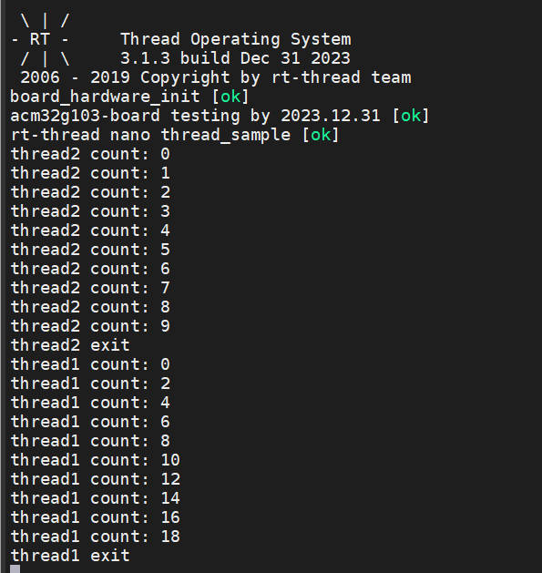

​	整个程序先执行thread2,因为THREAD_PRIORITY优先级比thread1高，thread2打印完成10次计数值之后，就执行thread1，打印完成20次计数值结束。