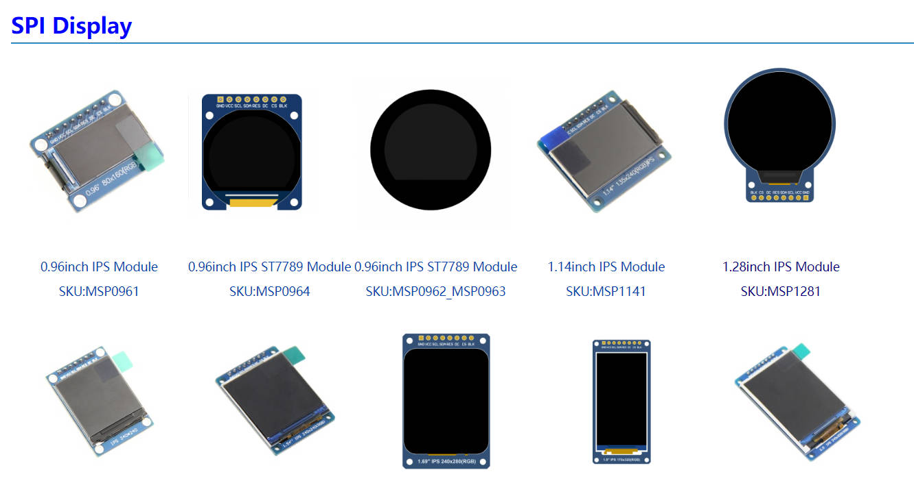
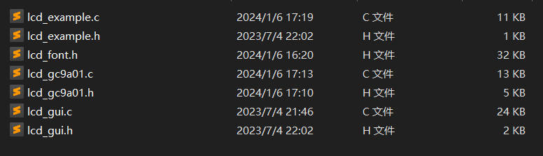
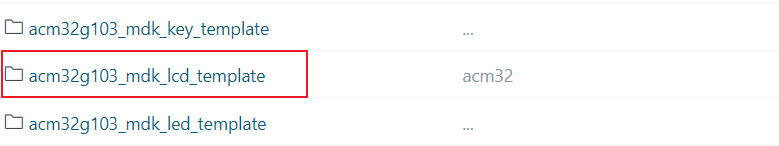
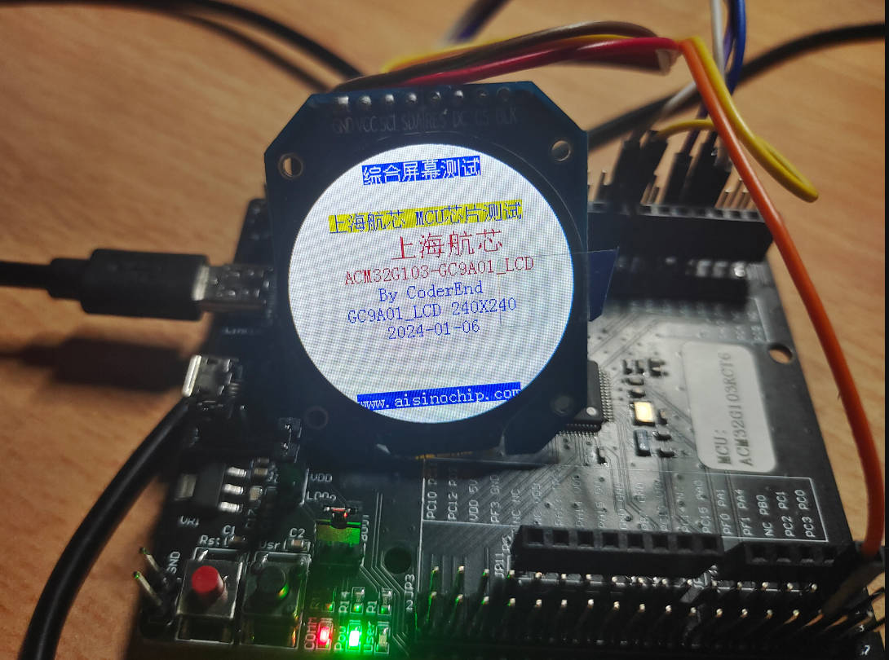
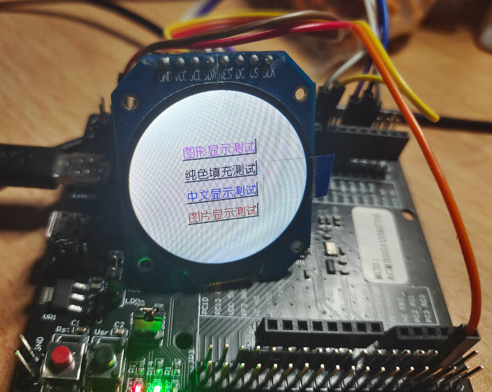
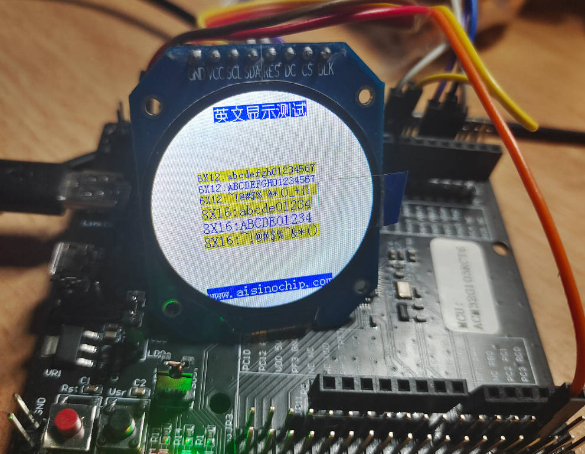
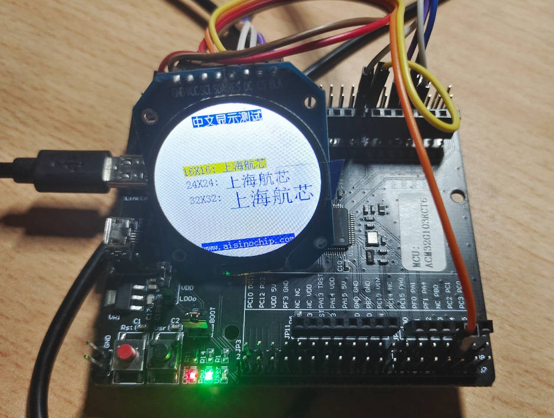

## 04-航芯ACM32G103开发板评测 GC9A01 SPI-LCD 1.28圆形屏幕 

### 硬件平台
1. 航芯ACM32G103开发板
2. 1.28寸圆形彩色TFT显示屏高清IPS 模块240X240 SPI接口GC9A01
### 产品介绍

推荐一个屏幕资料参考网站 http://www.lcdwiki.com/1.28inch_IPS_Module



- 1.28寸圆形IPS彩屏，支持 RGB 65K色显示，显示色彩丰富
- 240X240分辨率，显示清晰
- IPS全视角面板，超宽可视范围
- 采用4线制SPI串行总线，只需几个IO即可点亮
- 提供丰富的Arduino、STM32、C51以及MSP430示例程序
- 军工级工艺标准,长期稳定工作
- 提供底层驱动技术支持

### 产品参数
| 名称               | 参数                 |
| ------------------ | -------------------- |
| 显示颜色           | RGB 65K 彩色         |
| SKU                | MSP1281              |
| 尺寸               | 1.28(inch)           |
| 面板材质           | TFT                  |
| 驱动芯片           | GC9A01               |
| 分辨率             | 240*240 (Pixel)      |
| 显示接口           | 4-line SPI interface |
| 有效显示区域(AA区) | 直径：32.40 (mm)     |
| 触摸屏类型         | 无触摸屏             |
| 触摸IC             | 无触摸IC             |
| 模块PCB底板尺寸    | 38.03x45.80(mm)      |
| 视角               | 全角度               |
| 工作温度           | -10℃~60℃             |
| 存储温度           | -20℃~70℃             |
| 工作电压           | 3.3V                 |

### 接口定义

| 序号 | 模块引脚 | 引脚说明                                                     |
| ---- | -------- | ------------------------------------------------------------ |
| 1    | GND      | 液晶屏电源地                                                 |
| 2    | VCC      | 液晶屏电源正(3.3V/5V)                                        |
| 3    | SCL      | 液晶屏SPI总线时钟信号                                        |
| 4    | SDA      | 液晶屏SPI总线写数据信号                                      |
| 5    | RES      | 液晶屏复位控制信号（低电平复位，模块有复位电路，该引脚可不接） |
| 6    | DC       | 液晶屏寄存器/数据选择控制信号（低电平：寄存器，高电平：数据） |
| 7    | CS       | 液晶屏片选控制信号（低电平使能）                             |
| 8    | BLK      | 液晶屏背光控制信号（高电平点亮，如不需要控制，请接3.3V）     |

#### 硬件配置

LCD模块硬件电路包含五大部分：FPC接口电路、3.3V稳压电路、背光控制电路、排针接口、复位电路。

1. FPC接口电路用于连接裸屏。
2. 3.3V稳压电路用于稳定输出3.3V电压。
3. 背光控制电路用于用于控制背光亮和灭，如果不需控制背光。可接3.3V电源。
4. 排针接口用于连接各种开发板。
5. 复位电路用于模块上电复位

#### GC9A01控制器

GC9A01控制器支持的最大分辨率为240*240，拥有一个129600字节大小的GRAM。同时支持8位、9位、12位、16位、18位并口数据总线，还支持3线制和4线制SPI串口。由于并行控制需要大量的I0口，所以最常用的还是SPI串口控制。ST7789还支持65K、262KRGB颜色显示，显示色彩很丰富，同时支持旋转和滚动显示以及视频播放，显示方式多样。
GC9A01控制器使用16bit（RGB565）来控制一个像素点显示，因此可以每个像素点显示颜色多达65K种。像素点地址设置按照行列的顺序进行，递增递减方向由扫描方式决定。GC9A01显示方法按照先设置地址再设置颜色值进行。
#### 模拟SPI移植LCD屏幕驱动

1. 建立工程模板，添加相关驱动文件

   ```c
   //lcd_gc9a01 硬件驱动层代码
   lcd_gc9a01.c
   lcd_gc9a01.h
   //lcd_gc9a01 软件应用层代码
   lcd_guic
   lcd_gui.h
   lcd_font.h
   //lcd_gc9a01 软件测试代码
   lcd_example.c
   lcd_example.h
   ```

   

2. 配置引脚

   选择引脚，进入工程开始编写屏幕引脚初始化代码。

   为了方便后续移植，我在**lcd_gc9a01.h**处宏定义了每一个引脚，后续根据需要进行修改即可。

   ```c
   #define LCD_GPIO_PORT  GPIOB
   
   #define SCL_GPIO_PORT            GPIOB
   #define SCL_GPIO_PIN             GPIO_PIN_0
   #define SCL_GPIO_CLK_ENABLE()    __RCC_GPIOB_CLK_ENABLE()
   
   #define SDA_GPIO_PORT            GPIOB
   #define SDA_GPIO_PIN             GPIO_PIN_1
   #define SDA_GPIO_CLK_ENABLE()    __RCC_GPIOB_CLK_ENABLE()
   
   #define RES_GPIO_PORT            GPIOB
   #define RES_GPIO_PIN             GPIO_PIN_2
   #define RES_GPIO_CLK_ENABLE()    __RCC_GPIOB_CLK_ENABLE()
   
   #define DC_GPIO_PORT            GPIOB
   #define DC_GPIO_PIN             GPIO_PIN_3
   #define DC_GPIO_CLK_ENABLE()    __RCC_GPIOB_CLK_ENABLE()
   
   #define CS_GPIO_PORT            GPIOB
   #define CS_GPIO_PIN             GPIO_PIN_4
   #define CS_GPIO_CLK_ENABLE()    __RCC_GPIOB_CLK_ENABLE()
   
   #define BLK_GPIO_PORT            GPIOB
   #define BLK_GPIO_PIN             GPIO_PIN_5
   #define BLK_GPIO_CLK_ENABLE()    __RCC_GPIOB_CLK_ENABLE()
   
   
   ```

3. 屏幕GPIO端口初始化配置

   ```c
   void lcd_gpio_init(void)
   {
       GPIO_InitTypeDef  GPIO_InitStruct;
       /* Enable the GPIO Clock */
       SDA_GPIO_CLK_ENABLE();
       SCL_GPIO_CLK_ENABLE();
   	RES_GPIO_CLK_ENABLE();
       DC_GPIO_CLK_ENABLE();
       CS_GPIO_CLK_ENABLE();
       BLK_GPIO_CLK_ENABLE();
       
       GPIO_InitStruct.Pin       = SDA_GPIO_PIN   	|SCL_GPIO_PIN|RES_GPIO_PIN|DC_GPIO_PIN|CS_GPIO_PIN|BLK_GPIO_PIN;
       GPIO_InitStruct.Mode      = GPIO_MODE_OUTPUT_PP;
       GPIO_InitStruct.Pull      = GPIO_PULLUP;
       GPIO_InitStruct.Drive     = GPIO_DRIVE_LEVEL3;
       GPIO_InitStruct.Alternate = GPIO_FUNCTION_0;
        
       GPIO_Init(LCD_GPIO_PORT, &GPIO_InitStruct);
   	
       
   }
   ```

4. SPI 接口宏定义设置

   ```C
   #define	SPI_SCLK_SET    GPIO_SetBits(SCL_GPIO_PORT,SCL_GPIO_PIN)
   #define	SPI_SCLK_CLR    GPIO_ResetBits(SCL_GPIO_PORT,SCL_GPIO_PIN)
   
   #define	SPI_MOSI_SET    GPIO_SetBits(SDA_GPIO_PORT,SDA_GPIO_PIN)
   #define	SPI_MOSI_CLR    GPIO_ResetBits(SDA_GPIO_PORT,SDA_GPIO_PIN)
      
   
   
   #define	LCD_RES_SET     GPIO_SetBits(RES_GPIO_PORT,RES_GPIO_PIN)
   #define	LCD_RES_CLR     GPIO_ResetBits(RES_GPIO_PORT,RES_GPIO_PIN)
   
   #define	LCD_DC_SET      GPIO_SetBits(DC_GPIO_PORT,DC_GPIO_PIN)
   #define	LCD_DC_CLR      GPIO_ResetBits(DC_GPIO_PORT,DC_GPIO_PIN)
   
   #define	LCD_CS_SET      GPIO_SetBits(CS_GPIO_PORT,CS_GPIO_PIN)
   #define	LCD_CS_CLR      GPIO_ResetBits(CS_GPIO_PORT,CS_GPIO_PIN)
   
   #define	LCD_BLK_SET     GPIO_SetBits(BLK_GPIO_PORT,BLK_GPIO_PIN) 
   ```

5. 软件SPI代码实现

   ```C
   /*****************************************************************************
    * @name       :void  SPI_WriteByte(uint8_t Data)
    * @function   :Write a byte of data using STM32's Software SPI
    * @parameters :Data:Data to be written
    * @retvalue   :None
   ******************************************************************************/
   void SPI_WriteByte(uint8_t Data)
   {
   	unsigned char i=0;
   	for(i=8;i>0;i--)
   	{
   	  if(Data&0x80)	
   			SPI_MOSI_SET; //输出数据
       else
   		  SPI_MOSI_CLR;
         SPI_SCLK_CLR;       
         SPI_SCLK_SET;
         Data<<=1; 
   	}
   }
   
   /*****************************************************************************
    * @name       :void LCD_WR_REG(uint8_t data)
    * @function   :Write an 8-bit command to the LCD screen
    * @parameters :data:Command value to be written
    * @retvalue   :None
   ******************************************************************************/
   void LCD_WR_REG(uint8_t data)
   { 
      LCD_CS_CLR;     
      LCD_DC_CLR;	  
      SPI_WriteByte(data);
      LCD_CS_SET;	
   }
   
   /*****************************************************************************
    * @name       :void LCD_WR_DATA(uint8_t data)
    * @function   :Write an 8-bit data to the LCD screen
    * @parameters :data:data value to be written
    * @retvalue   :None
   ******************************************************************************/
   void LCD_WR_DATA(uint8_t data)
   {
      LCD_CS_CLR;
      LCD_DC_SET;
      SPI_WriteByte(data);
      LCD_CS_SET;
   }
   ```

   如果传输的数据位为1，则将SPI数据引脚拉高；传输的数据位为0，则将SPI数据引脚拉低。每次传输一个字节数据，高位在前，每个时钟上升沿传输1位数据。

6. LCD初始化函数

   ```C
   /*****************************************************************************
    * @name       :void LCD_Init(void)
    * @date       :2018-08-09 
    * @function   :Initialization LCD screen
    * @parameters :None
    * @retvalue   :None
   ******************************************************************************/	 	 
   void LCD_Init(void)
   {  
   	lcd_gpio_init();								 
    	LCD_RESET(); //LCD 复位
   //************* GC9A01初始化**********//	
    	LCD_WR_REG(0xEF);
   	LCD_WR_REG(0xEB);
   	LCD_WR_DATA(0x14); 
   	
     	LCD_WR_REG(0xFE);			 
   	LCD_WR_REG(0xEF); 
   
   	LCD_WR_REG(0xEB);	
   	LCD_WR_DATA(0x14); 
   
   	LCD_WR_REG(0x84);			
   	LCD_WR_DATA(0x40); 
   
   	LCD_WR_REG(0x85);			
   	LCD_WR_DATA(0xFF); 
   
   	LCD_WR_REG(0x86);			
   	LCD_WR_DATA(0xFF); 
   
   	LCD_WR_REG(0x87);			
   	LCD_WR_DATA(0xFF);
   
   	LCD_WR_REG(0x88);			
   	LCD_WR_DATA(0x0A);
   
   	LCD_WR_REG(0x89);			
   	LCD_WR_DATA(0x21); 
   
   	LCD_WR_REG(0x8A);			
   	LCD_WR_DATA(0x00); 
   
   	LCD_WR_REG(0x8B);			
   	LCD_WR_DATA(0x80); 
   
   	LCD_WR_REG(0x8C);			
   	LCD_WR_DATA(0x01); 
   
   	LCD_WR_REG(0x8D);			
   	LCD_WR_DATA(0x01); 
   
   	LCD_WR_REG(0x8E);			
   	LCD_WR_DATA(0xFF); 
   
   	LCD_WR_REG(0x8F);			
   	LCD_WR_DATA(0xFF); 
   
   
   	LCD_WR_REG(0xB6);
   	LCD_WR_DATA(0x00);
   	LCD_WR_DATA(0x20);
   
   	LCD_WR_REG(0x36);
   	LCD_WR_DATA(0x08);
   	
   	LCD_WR_REG(0x3A);			
   	LCD_WR_DATA(0x05); 
   
   
   	LCD_WR_REG(0x90);			
   	LCD_WR_DATA(0x08);
   	LCD_WR_DATA(0x08);
   	LCD_WR_DATA(0x08);
   	LCD_WR_DATA(0x08); 
   
   	LCD_WR_REG(0xBD);			
   	LCD_WR_DATA(0x06);
   	
   	LCD_WR_REG(0xBC);			
   	LCD_WR_DATA(0x00);	
   
   	LCD_WR_REG(0xFF);			
   	LCD_WR_DATA(0x60);
   	LCD_WR_DATA(0x01);
   	LCD_WR_DATA(0x04);
   
   	LCD_WR_REG(0xC3);			
   	LCD_WR_DATA(0x13);
   	LCD_WR_REG(0xC4);			
   	LCD_WR_DATA(0x13);
   
   	LCD_WR_REG(0xC9);			
   	LCD_WR_DATA(0x22);
   
   	LCD_WR_REG(0xBE);			
   	LCD_WR_DATA(0x11); 
   
   	LCD_WR_REG(0xE1);			
   	LCD_WR_DATA(0x10);
   	LCD_WR_DATA(0x0E);
   
   	LCD_WR_REG(0xDF);			
   	LCD_WR_DATA(0x21);
   	LCD_WR_DATA(0x0c);
   	LCD_WR_DATA(0x02);
   
   	LCD_WR_REG(0xF0);   
   	LCD_WR_DATA(0x45);
   	LCD_WR_DATA(0x09);
   	LCD_WR_DATA(0x08);
   	LCD_WR_DATA(0x08);
   	LCD_WR_DATA(0x26);
    	LCD_WR_DATA(0x2A);
   
    	LCD_WR_REG(0xF1);    
    	LCD_WR_DATA(0x43);
    	LCD_WR_DATA(0x70);
    	LCD_WR_DATA(0x72);
    	LCD_WR_DATA(0x36);
    	LCD_WR_DATA(0x37);  
    	LCD_WR_DATA(0x6F);
   
   
    	LCD_WR_REG(0xF2);   
    	LCD_WR_DATA(0x45);
    	LCD_WR_DATA(0x09);
    	LCD_WR_DATA(0x08);
    	LCD_WR_DATA(0x08);
    	LCD_WR_DATA(0x26);
    	LCD_WR_DATA(0x2A);
   
    	LCD_WR_REG(0xF3);   
    	LCD_WR_DATA(0x43);
    	LCD_WR_DATA(0x70);
    	LCD_WR_DATA(0x72);
    	LCD_WR_DATA(0x36);
    	LCD_WR_DATA(0x37); 
    	LCD_WR_DATA(0x6F);
   
   	LCD_WR_REG(0xED);	
   	LCD_WR_DATA(0x1B); 
   	LCD_WR_DATA(0x0B); 
   
   	LCD_WR_REG(0xAE);			
   	LCD_WR_DATA(0x77);
   	
   	LCD_WR_REG(0xCD);			
   	LCD_WR_DATA(0x63);		
   
   
   	LCD_WR_REG(0x70);			
   	LCD_WR_DATA(0x07);
   	LCD_WR_DATA(0x07);
   	LCD_WR_DATA(0x04);
   	LCD_WR_DATA(0x0E); 
   	LCD_WR_DATA(0x0F); 
   	LCD_WR_DATA(0x09);
   	LCD_WR_DATA(0x07);
   	LCD_WR_DATA(0x08);
   	LCD_WR_DATA(0x03);
   
   	LCD_WR_REG(0xE8);			
   	LCD_WR_DATA(0x34);
   
   	LCD_WR_REG(0x62);			
   	LCD_WR_DATA(0x18);
   	LCD_WR_DATA(0x0D);
   	LCD_WR_DATA(0x71);
   	LCD_WR_DATA(0xED);
   	LCD_WR_DATA(0x70); 
   	LCD_WR_DATA(0x70);
   	LCD_WR_DATA(0x18);
   	LCD_WR_DATA(0x0F);
   	LCD_WR_DATA(0x71);
   	LCD_WR_DATA(0xEF);
   	LCD_WR_DATA(0x70); 
   	LCD_WR_DATA(0x70);
   
   	LCD_WR_REG(0x63);			
   	LCD_WR_DATA(0x18);
   	LCD_WR_DATA(0x11);
   	LCD_WR_DATA(0x71);
   	LCD_WR_DATA(0xF1);
   	LCD_WR_DATA(0x70); 
   	LCD_WR_DATA(0x70);
   	LCD_WR_DATA(0x18);
   	LCD_WR_DATA(0x13);
   	LCD_WR_DATA(0x71);
   	LCD_WR_DATA(0xF3);
   	LCD_WR_DATA(0x70); 
   	LCD_WR_DATA(0x70);
   
   	LCD_WR_REG(0x64);			
   	LCD_WR_DATA(0x28);
   	LCD_WR_DATA(0x29);
   	LCD_WR_DATA(0xF1);
   	LCD_WR_DATA(0x01);
   	LCD_WR_DATA(0xF1);
   	LCD_WR_DATA(0x00);
   	LCD_WR_DATA(0x07);
   
   	LCD_WR_REG(0x66);			
   	LCD_WR_DATA(0x3C);
   	LCD_WR_DATA(0x00);
   	LCD_WR_DATA(0xCD);
   	LCD_WR_DATA(0x67);
   	LCD_WR_DATA(0x45);
   	LCD_WR_DATA(0x45);
   	LCD_WR_DATA(0x10);
   	LCD_WR_DATA(0x00);
   	LCD_WR_DATA(0x00);
   	LCD_WR_DATA(0x00);
   
   	LCD_WR_REG(0x67);			
   	LCD_WR_DATA(0x00);
   	LCD_WR_DATA(0x3C);
   	LCD_WR_DATA(0x00);
   	LCD_WR_DATA(0x00);
   	LCD_WR_DATA(0x00);
   	LCD_WR_DATA(0x01);
   	LCD_WR_DATA(0x54);
   	LCD_WR_DATA(0x10);
   	LCD_WR_DATA(0x32);
   	LCD_WR_DATA(0x98);
   
   	LCD_WR_REG(0x74);			
   	LCD_WR_DATA(0x10);	
   	LCD_WR_DATA(0x85);	
   	LCD_WR_DATA(0x80);
   	LCD_WR_DATA(0x00); 
   	LCD_WR_DATA(0x00); 
   	LCD_WR_DATA(0x4E);
   	LCD_WR_DATA(0x00);					
   	
       LCD_WR_REG(0x98);			
   	LCD_WR_DATA(0x3e);
   	LCD_WR_DATA(0x07);
   
   	LCD_WR_REG(0x35);	
   	LCD_WR_REG(0x21);
   
   	LCD_WR_REG(0x11); 
   	DelayMs(120); 
   
   	LCD_WR_REG(0x29); 	
       LCD_direction(USE_HORIZONTAL);//设置LCD显示方向
   	LCD_BLK_SET;//点亮背光	 
   	LCD_Clear(WHITE);//清全屏白色
   }
    
   /*****************************************************************************
    * @name       :void LCD_SetWindows(uint16_t xStar, uint16_t yStar,uint16_t xEnd,uint16_t yEnd)
    * @date       :2018-08-09 
    * @function   :Setting LCD display window
    * @parameters :xStar:the bebinning x coordinate of the LCD display window
   								yStar:the bebinning y coordinate of the LCD display window
   								xEnd:the endning x coordinate of the LCD display window
   								yEnd:the endning y coordinate of the LCD display window
    * @retvalue   :None
   ******************************************************************************/ 
   void LCD_SetWindows(uint16_t xStar, uint16_t yStar,uint16_t xEnd,uint16_t yEnd)
   {	
   	LCD_WR_REG(lcddev.setxcmd);	
   	LCD_WR_DATA(xStar>>8);
   	LCD_WR_DATA(xStar);		
   	LCD_WR_DATA(xEnd>>8);
   	LCD_WR_DATA(xEnd);
   
   	LCD_WR_REG(lcddev.setycmd);	
   	LCD_WR_DATA(yStar>>8);
   	LCD_WR_DATA(yStar);		
   	LCD_WR_DATA(yEnd>>8);
   	LCD_WR_DATA(yEnd);
   
   	LCD_WriteRAM_Prepare();	//开始写入GRAM			
   }   
   ```

7. 驱动完整代码见仓库代码

   https://gitee.com/End-ING/embedded-acm32-board/tree/master/note

   

### 屏幕测试

1. 主程序

   ```c
   #include "main.h" 
   #include "app.h"   
   void board_hardware_init(void)
   {
        //省略部分初始化代码
       printfS("ACM32G103-Board Testing 2024.01.06\r\n");
       LCD_Init();//屏幕初始化
   }
   /************************************************************************
   *@brief : main program
   *@param : none
   *@return: none
   ******************************************************************************/
   int main(void)
   {
      
       board_hardware_init();
       printfS("board_hardware_init [ok] \r\n");
       
       while(1)
       {
   
           printfS("lcd_init [start] \r\n");
           main_test(); 		    //测试主界面
           menu_test();			//测试界面
           English_Font_test();    //英文界面
           Chinese_Font_test();    //中文界面
           printfS("lcd_init [end] \r\n");
       }
       
   }
   ```

2. 测试程序

   ```c
   void main_test(void)
   {
   	DrawTestPage("综合测试程序");	
   	Show_Str(40,50,BLUE,YELLOW,"上海航芯 MCU芯片测试",16,0);
   	Gui_StrCenter(0,70,RED,BLUE,"上海航芯",24,1);//居中显示
   	Gui_StrCenter(0,95,RED,BLUE,"  ACM32G103-LCD_GC9A01",16,1);//居中显示	
   	Gui_StrCenter(0,112,BLUE,BLUE,"By CoderEnd",16,1);//居中显示
   	Gui_StrCenter(0,129,BLUE,BLUE,"GC9A01_LCD 240X240",16,1);//居中显示
   	Gui_StrCenter(0,146,BLUE,BLUE,"2024-01-06 Testing",16,1);//居中显示
   	DelayMs(1500);		
   	DelayMs(1500);
   }
   
   void menu_test(void)
   {
   	LCD_Clear(GRAY0);
   	
   	Display_ButtonUp((lcddev.width-98)/2,65,(lcddev.width-98)/2+98,85); //x1,y1,x2,y2
   	Gui_StrCenter(0,67,BRED,BLUE,"图形显示测试",16,1);
   
   	Display_ButtonUp((lcddev.width-98)/2,95,(lcddev.width-98)/2+98,115); //x1,y1,x2,y2
   	Gui_StrCenter(0,97,BLACK,GRAY0,"纯色填充测试",16,1);
   	
   	Display_ButtonUp((lcddev.width-98)/2,125,(lcddev.width-98)/2+98,145); //x1,y1,x2,y2
   	Gui_StrCenter(0,127,BLUE,GRAY0,"中文显示测试",16,1);
   
   	Display_ButtonUp((lcddev.width-98)/2,155,(lcddev.width-98)/2+98,175); //x1,y1,x2,y2
   	Gui_StrCenter(16,157,RED,GRAY0,"图片显示测试",16,1);
   	DelayMs(1500);
   	DelayMs(500);
   }
   
   void English_Font_test(void)
   {
   	DrawTestPage("英文显示测试");
   	Show_Str(50,77,BLUE,YELLOW,"6X12:abcdefgh01234567",12,0);
   	Show_Str(50,89,BLUE,YELLOW,"6X12:ABCDEFGH01234567",12,1);
   	Show_Str(50,101,BLUE,YELLOW,"6X12:~!@#$%^&*()_+{}:",12,0);
   	Show_Str(50,114,BLUE,YELLOW,"8X16:abcde01234",16,0);
   	Show_Str(50,130,BLUE,YELLOW,"8X16:ABCDE01234",16,1);
   	Show_Str(50,146,BLUE,YELLOW,"8X16:~!@#$%^&*()",16,0); 
   	DelayMs(1200);
   }
   
   void Chinese_Font_test(void)
   {	
   	DrawTestPage("中文显示测试");
   	Show_Str(45,82,BLUE,YELLOW,"16X16: 上海航芯",16,0);
   	Show_Str(45,102,BLUE,YELLOW,"24X24: 上海航芯",24,1);
   	Show_Str(45,127,BLUE,YELLOW,"32X32: 上海航芯",32,1);
   	DelayMs(1200);
   }
   
   ```

   

3. 测试效果







